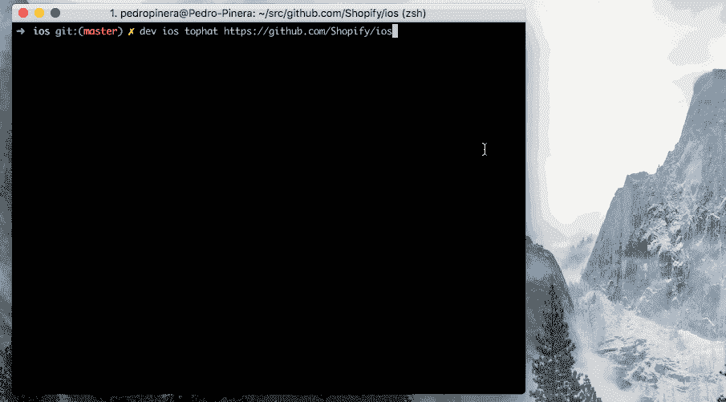

# Shopify 上的移动桌面——开发者工具

> 原文：<https://engineering.shopify.com/blogs/engineering/mobile-tophatting-at-shopify-1?utm_source=wanqu.co&utm_campaign=Wanqu+Daily&utm_medium=website>

Shopify 是领先的基于云的多渠道商务平台，面向超过 175 个国家的 600，000 多家商家，测试和验证平台中引入的新功能的功能至关重要。由于公司在设计上没有一个 [QA 团队](https://en.wikipedia.org/wiki/Software_quality_assurance "Software Quality Assurance")，测试功能是开发者的责任。为此，我们建立了一个包含自动化测试步骤的项目，这些步骤通过我们的[持续集成基础设施(CI)](https://engineering.shopify.com/blogs/engineering/scaling-ios-ci-with-anka "Scaling iOS CI with Anka") 执行，额外的手动检查由开发人员执行。

其中一项人工检查是在将更改合并到代码库之前尝试这些更改。我们称这个过程为“tophatting”🎩表情符号。当 Github 不支持代码审查请求时，Shopify 依赖表情符号来轻松传达代码审查过程的状态。🎩表明评审者不仅查看了代码，而且还在本地运行了代码，以确保一切按预期运行，尤其是当更改影响到用户界面时。

top hat 流程要求开发人员保存他们当前的工作，签出一个不同的 git 分支，为该分支设置他们的本地环境并构建应用程序。对于移动开发者来说，这个过程很繁琐，因为更改 git 分支往往会使缓存失效，增加 Xcode 和 Android Studio 中的构建时间。根据项目的不同，构建应用程序可能需要长达 15 分钟的时间，在此期间，开发人员不能在同一项目中进行任何其他工作。

为了消除他们的痛点并促进最佳实践，我们创建了一个快速、顺畅的 tophatting 流程，该流程与我们的 CI 基础设施和 dev 无缝集成，dev 是所有移动开发人员在其环境中运行的 Shopify 通用开发工具。在这篇文章中，我将描述我们如何建立无摩擦的 tophatting 过程，并向你展示一个例子。

## 为 Tophat 设置项目

移动 tophatting 过程中最慢的部分是编译。为了加快移动开发者的速度，我们跳过了编译步骤。我们已经在 CI 上构建了应用程序，因此应用程序二进制文件可以在我们为运行 PR 构建而创建的一次性环境中使用。我们更新了项目管道以导出二进制文件，这样我们就可以通过 CI API 列出和访问它们。根据平台(iOS 或 Android)的不同，导出的应用程序具有不同的格式:

*   **iOS** :应用程序是文件夹，我们使用包括应用程序名称及其版本的命名约定来压缩文件夹。例如，导出的 Shopify 应用版本 3.2.1 将被命名为 *Shopify-3.2.1.app.zip* 。
*   **Android** : APK 文件是 zip 存档，所以我们用它现有的名字导出。

应用程序导出后，我们利用 GitHub 提交状态让开发人员知道他们的 PRs 有可下载的版本:

## 命令行界面

Dev 是一个内部工具，它为公司的所有项目提供了一组标准命令(你可以在 [devproductivity.io](https://devproductivity.io/dev-shopifys-all-purpose-development-tool/ "Shopify's All Purpose Development Tool") 上了解更多)。后端开发人员使用的命令之一是 tophat，我们扩展了它的用途以支持移动项目。

命令看起来像:

*开发平台 tophat 资源*

其中平台可以是 *ios* 或 *android* ，资源可以是以下任何一种:

*   拉请求 URL:用于下载其他开发人员的作品
*   存储库 URL:用于放置存储库的主分支
*   存储库分支 URL:用于加载特定分支
*   构建 URL:用于从配置项加载特定的构建

例如，如果开发人员想要执行 android 项目的 pull 请求 35，他们可以运行命令:

*开发安卓托法特 https://github.com/shopify/android/pulls/35*

## 在后台

运行 tophat 命令时，将执行以下步骤:

1.  用户在 Buildkite 和 GitHub API 上被认证，如果它们还没有被认证的话。访问令牌保存在 macOS 钥匙串中，以便在将来的 API 调用中重用。
2.  如果给定的资源是 GitHub URL，我们使用提交状态来获取构建的 URL。
3.  由于工件列表可能包含无法通过 tophatting 的资源，我们将它们过滤掉，只显示有效的资源。如果存储库中有多个应用程序，开发者可以选择他们想要的应用程序。
4.  选择应用程序后:

1.  对于 iOS 项目，我们列出系统模拟器并引导到用户选择的系统模拟器。大多数时候，开发人员倾向于使用同一个模拟器，所以命令会记住并建议默认使用它
2.  对于 Android 项目，我们列出了环境中可用的模拟器和一些默认的模拟器，以防开发人员还没有在本地配置任何模拟器。

6.  一旦模拟器启动，我们安装应用程序并启动它。

以下示例显示了为 iOS 安装 Shopify Mobile 的流程:

## 

未来的改进

我们对来自移动开发者的回应感到激动；他们喜欢这个功能。自从我们推出以来，Shopifolks 热情地提交了错误报告和建议，提出了许多关于如何不断改进 tophatting 过程的想法。我们目前正在进行的一些改进包括:

*   **缓存**:每次我们启动 tophat 进程时，我们都会从 Buildkite 中提取工件，即使我们已经为构建添加了 top hat。添加本地缓存将防止再次下载工件，而是从缓存中复制它。
*   **真实设备**:开发者通常会在真实设备上试用这些应用，我们愿意为此提供便利。对于 iOS，版本需要使用有效的证书进行签名，以便在测试设备上安装应用程序。
*   Tophat from commit and branch :我们没有传递整个 GitHub URL，而是通过让开发人员指定他们想要 Tophat 的存储库和分支/提交来简化输入。

测试别人的工作现在比以往任何时候都容易。我们的开发人员不需要知道如何设置环境或编译他们正在安装的应用程序。他们可以运行一个命令，剩下的工作由工具来完成。移动工具团队致力于收集反馈，并与我们的移动开发人员合作，添加改进和错误修复，以促进他们的工作流程。