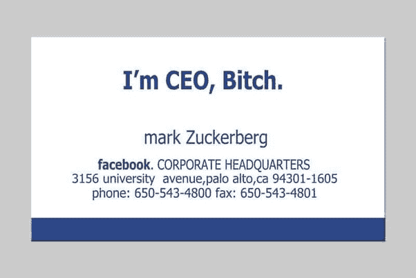
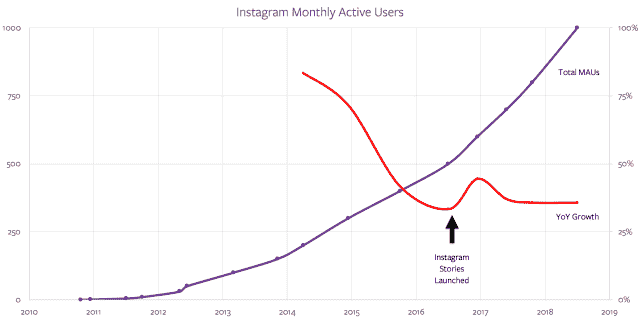

# Instagram 的首席执行官——本·汤普森的战略

> 原文：<https://stratechery.com/2018/instagrams-ceo/?utm_source=wanqu.co&utm_campaign=Wanqu+Daily&utm_medium=website>

在《纽约时报》爆出 Instagram 联合创始人凯文·斯特罗姆和迈克·克里格已经从 Instagram 辞职的消息后的几个小时内，问题很快变成了为什么；直接的罪魁祸首是大家最喜欢的出气筒，脸书首席执行官马克·扎克伯格:

*   [彭博](https://www.bloomberg.com/news/articles/2018-09-25/instagram-founders-depart-facebook-after-clashes-with-zuckerberg) : *知情人士透露，Instagram 的创始人在与首席执行官马克·扎克伯格就照片分享应用的方向日益紧张后，将离开脸书公司。*
*   TechCrunch : *根据 TechCrunch 的消息来源，今年 Instagram 和脸书领导层之间关于 Instagram 自主性的紧张关系已经升级。作为收购交易的一部分，脸书已经同意让它独立运营。但在 5 月，Instagram 受人爱戴的产品副总裁凯文·韦尔(Kevin Weil)跳槽到了脸书的新区块链团队，并被脸书新闻频道的前副总裁亚当·莫塞里(Adam Mosseri)取代，后者是扎克伯格的核心圈子成员。*
*   消息人士称，由于脸书首席执行官马克·扎克伯格对 Instagram 越来越多的干预和控制，Instagram 的联合创始人凯文·斯特罗姆和迈克·克里格感到沮丧和不安，他们将从自己创建的公司辞职。

所有这些故事都很有趣，毫无疑问，未来几天将会有更多的细节浮出水面。与此同时，从过去几周、几个月甚至几年发生的事件来看，他们都没有抓住要点。理解这些辞职事件的关键日期是 2012 年 4 月 9 日，对此负有最大责任的人是凯文·斯特罗姆和迈克·克里格。

#### 非凡的产品领导者

[扎克伯格关于 Systrom 和 Krieger 辞职的声明](https://twitter.com/MikeIsaac/status/1044427733768462337)非常简洁，或许正因如此，颇具启发性:

> “凯文和迈克是非凡的产品领导者，Instagram 反映了他们的综合创意才能。在过去的六年里，我和他们一起工作，学到了很多东西，真的很开心。我祝他们一切顺利，并期待看到他们接下来的作品。”

将 Systrom 和 Krieger 称为“非凡的产品领导者”是一种高度的赞扬，但也是一种轻描淡写。

Instagram 最初是一款名为 *Burbn* 的 Foursquare 式签到应用，但当 Systrom 和 Krieger 意识到 Brbn 的用户并没有签到，而是疯狂地分享照片时，他们迅速开发了一款名为 Instagram 的新应用。[MG·西格勒在《T3》中写道:](https://techcrunch.com/2010/09/20/instagram/)

> 与 Burbn 不同，Instagram 既不是基于位置的应用程序(尽管这是一个组件)，也不是基于 HTML5 的。但它确实源于联合创始人凯文·斯特罗姆和迈克·克里格对人们使用 Burbn 的看法。那就是:快速的社交分享——以及分享各地照片的愿望。这就是 Instagram 的基础。
> 
> 更具体地说，Instagram 是一个 iPhone 照片共享应用程序，允许你对照片应用有趣的滤镜，使它们真正流行起来……一旦你拍照并应用滤镜(也有一个选项不应用)，照片就会被共享到你的 Instagram Feed 中。在这里，你在网站上的朋友可以“喜欢”或评论它。但 Instagram 的另一个关键是，它可以很容易地将这些照片分享到其他社交网络，如 Twitter、脸书和 Flickr。

几乎所有的关键部分从一开始就存在:

*   Instagram 有理由下载:与竞争对手不同，酷酷的滤镜是免费的。
*   Instagram 有很好的用户体验:即时分享到社交网络，而不用跳过“保存到相机胶卷”这一关。
*   Instagram 拥有比照片编辑应用更伟大的东西的种子:从一开始，它就是一个独立的社交网络；正如 Chris Dixon 所描述的那样(T1)，“为工具而来，为网络而留。”

Instagram 像火箭一样起飞，一年就有 1000 万用户；在接下来的六个月里，这个数字将增加两倍，而且当这家初创公司最终推出 Android 版本时，这个数字还会增长得更快，在 24 小时内下载量达到了 100 万次。这时候，脸书提出了一个 Systrom 公司无法拒绝的提议:10 亿美元的现金和股票，嗯，为了什么？

从技术上讲，Instagram 是一家公司。但实际上，Instagram 是一种产品，其商业模式是风险投资。诚然，这种情况不会永远存在，但 2012 年 4 月 9 日，从流行产品到可行公司的道路是漫长而艰难的。Instagram 不仅需要继续扩大其用户基础，还必须扩大其基础设施，找出商业模式(好吧，广告)，建立支持该商业模式的工具(首先是销售团队，然后是自助服务模式，加上跟踪和定位功能)，同时击退更大和更成熟的公司——特别是脸书——这些公司正意识到 Instagram 对其用户注意力的威胁。

或者，Systrom 和 Instagram 可以将所有这些责任交给脸书，继续成为“非凡的产品领导者”，并获得 10 亿美元的收入(公平地说，这低估了他们的收益；这 10 亿美元包括 7 亿美元的脸书股票，如今价值近 40 亿美元。这是一个可以辩护的选择(无论如何对 Instagram 来说；对批准交易的[监管者来说不是这样，但言下之意是，尽管有头衔，Systrom 从来不是 Instagram 的首席执行官；做 CEO 就是要有一个可以自立的公司。](https://stratechery.com/2017/why-facebook-shouldnt-be-allowed-to-buy-tbh/)

与扎克伯格——insta gram 真正的首席执行官——的区别是明显的。脸书于 2004 年 2 月推出，两个月后在 T2 销售了第一个广告。没错，《脸书传单》与如今驱动该公司的新闻供稿广告没有多少相似之处，但扎克伯格打造的不仅仅是一款产品，而是一家公司的即时本能值得注意。事实上，它为这位傲慢的首席执行官的著名名片带来了新的亮点:

A recreation of Mark Zuckerberg’s infamous business card from the movie *The Social Network*. The actual card looked like [this](https://149384716.v2.pressablecdn.com/wp-content/uploads/2018/09/card.jpg), with the caption in the lower left corner. They were also not Zuckerberg’s primary business cards.

他确实是，在名义上和实践中。至少从长远来看，成为首席执行官——拥有控制权——不仅仅是制造一个伟大的产品。它是关于寻找和发展一种商业模式，让你决定自己的命运。

#### Snapchat 的威胁是如何被消除的

Systrom 和扎克伯格——非凡的产品领导者和无情的首席执行官——合作的巅峰可能是 Instagram Stories。Systrom [大方承认](https://techcrunch.com/2016/08/02/silicon-copy/)这个概念是抄袭 Snapchat 的；正如我[在当时](https://stratechery.com/2016/the-audacity-of-copying-well/)指出的，考虑到 Instagram 更大的网络，这当然已经足够好了:

> Instagram 和脸书足够聪明，知道 Instagram 的故事不会取代 Snapchat 在用户生活中的地位。然而，Instagram 故事能做的是，消除 Instagram 上亿用户尝试 Snapchat 的动力。
> 
> 让消费者接受新产品很难；当这种采用需要一个网络时，那就更难了，至少如果你的大部分网络没有使用该产品；另一方面，一旦产品通过了你朋友的某个门槛，那些同样的困难就会变成巨大的加速器。Snapchat 在美国的青少年和越来越多的年轻人中已经超过了这个门槛，并且每天都在与其他人口统计数据和地理位置越来越接近。
> 
> 然而，Instagram 已经存在，但它的产品做了脸书展示最佳自我的工作。让这一举动如此大胆的是扎克伯格和 Systrom 的赌注，他们可以将 Instagram 改造成一款做自己的产品，至少在足够大的程度上抵挡 Snapchat 持续的注意力吸引。

那篇文章基本上是准确的；我的主要错误是低估了 Instagram 的产品会有多好。Instagram 故事从第一天开始就比 Snapchat 故事更好，特别是在速度方面；产品差异只是从那里开始的。最终，Instagram 的故事并没有简单地阻止 Snapchat 的增长；它实际上加速了 Instagram 的:

[T2】](https://i0.wp.com/stratechery.com/wp-content/uploads/2018/08/Screen-Shot-2018-08-14-at-4.49.16-PM.png?ssl=1)

与此同时，扎克伯格和脸书的广告团队正在切断 Snapchat 的盈利氧气，正如我在[脸书的镜头](https://stratechery.com/2018/facebook-lenses/)中解释的:

> 脸书花了数年时间打造新闻源广告——不仅仅是显示和定位技术，还包括广告商的整个后端设备、与非脸书数据源和销售点的联系、与广告买家的关系等。——然后简单地把 Instagram 接入那个基础设施。
> 
> 这种综合方法的回报怎么强调都不为过。尽管最初的产品团队可以自由地专注于用户体验，但 Instagram 在货币化方面的发展速度比他们自己更快。脸书应用程序也从中受益，因为 Instagram 不仅增加了脸书广告活动的表面积，还增加了脸书的定位能力。
> 
> 不过，最大的影响是潜在的竞争。人们很容易关注“投资回报率”中的“R”，正如我刚才提到的，Instagram +脸书让这一点变得更有吸引力。然而，同样重要的是“我”；对广告商来说，成为一站式商店有着巨大的好处，他们可以通过将花费集中在脸书上来节省时间和金钱。工具是熟悉的，购买是跨平台的，正如扎克伯格和桑德伯格提到的故事，广告本身只需要制作一次，就可以在多个平台上使用。为什么还要费事去别的地方做广告呢？

顺便说一下，这种动力在一年半前 Snap IPO 时非常明显；事实上，Snap 公司的首席执行官埃文·斯皮格尔，经常被认为是反 syst rom——对脸书说“不”的首席执行官——也有同样的缺陷。Systrom 将业务的建设交给了扎克伯格；直到为时已晚，斯皮格尔才开始烦恼。

#### Instagram 的挑战

然而，尽管 Instagram Stories 产品很好，但很难夸大 Instagram 更大网络的内在优势，也不可能夸大与脸书共享广告后端的重要性。换句话说，Instagram 相对于 Snapchat 或任何其他可能出现的竞争对手的两个最大优势，与产品(Systrom 的专长)没有太大关系。

没有比 IGTV 更好的例子了。三个月前，Systrom 发布了 Instagram 新的长篇视频产品，展示了产品的感性。我[惊叹于时间](https://stratechery.com/2018/instagram-launches-igtv-igtvs-monetization-youtube-channel-memberships/):

> 在短短几分钟内，Systrom 出色地(在我看来是准确地)解释了视频消费尤其是对青少年的影响，强调了当前解决方案(如 YouTube)的不足之处，并阐述了指导创建更好服务(移动优先、简单和高质量视频)的原则。当然，更好的服务是 IGTV。

这似乎一点也不重要。Josh Constine 上个月在 TechCrunch 上写了一篇关于 IGTV 挣扎的精彩文章:

> 现在进行科学分析还为时过早，Instagram 的 feed 早在 2010 年就已经出现了，所以这显然不是一个公平的比较，但我们看了一下该功能的一些发布合作伙伴创作者的 IGTV 浏览量。在其中六个创作者中，他们最近的视频点击率大约是他们在 IGTV 上发布的视频点击率的 6.8 倍。如果受益于早期访问和指导的 IGTV 推出合作伙伴表现不佳，这意味着其他创作者或普通用户可能不会有免费观看的机会。他们和 IGTV 将不得不为他们的观众工作。事实已经证明，这对于独立的 IGTV 应用来说是很困难的。尽管根据 Sensor Tower 的数据，它在美国 iPhone 应用程序整体排名第 25 位时达到峰值，并在 iOS 和 Android 上获得了 250 万次下载，但此后跌至第 1497 位，周安装量下降了 94%，上周仅为 7 万次。
> 
> 发布会的一大惊喜是 IGTV 将会出现在哪里。Instagram 宣布它将存在于一个独立的 IGTV 应用程序中，但也是主应用程序中的一个功能，可以从主屏幕顶部的一个橙色按钮访问，该按钮偶尔会显示新内容。它可以有自己的旋转木马一样的故事，或被集成到探索，直到它准备好黄金时间。相反，它是微不足道的。IGTV 没有像 Instagram Stories 那样获得主屏幕聚光灯的好处。跳过那个橙色按钮，避免下载单独的应用程序，用户可以直接点击和滚动 Instagram，而不会看到 IGTV 的较长视频。发布合作伙伴的浏览量反映了这一点。

我不是说产品不重要。确实如此，令人难以置信。但这不是唯一重要的事情，随着网络效应和商业模式等因素的影响，它的相对重要性会随着时间的推移而下降。为此，insta gram——或者更准确地说，脸书——面临的最重要的问题是故事货币化。上个月，我在脸书的故事《问题和机遇》中写道:

> 不过，这就是故事的特点:虽然更多的人可能因为故事而使用 Instagram，但也有相当一部分人会看故事，而不是 Instagram 新闻，或者两者都看，而不是脸书新闻。从长远来看，这对于脸书来说是好的——有用户在你的网站上总比没有好——但是同样的用户不看新闻，特别是脸书的新闻，可能就没有价值了，至少现在是这样。

这就是导致 Systrom 和 Krieger 辞职的任何争议的背景:他们不仅实际上没有控制自己的公司(因为他们没有控制货币化)，他们也不是解决他们产品面临的最大问题的关键。Instagram Stories 货币化最终是脸书的问题，如果之前不清楚的话，现在很明显脸书将提供解决方案。

* * *

我写这些一点也不是为了诋毁 Systrom 和 Krieger。如果说有什么不同的话，那就是在过去几年里，我对他们难以置信的产品意识的欣赏与日俱增。两者都是真正非凡的，因为他们的创作。

然而，掌控自己的命运，需要的不仅仅是产品或知名度。这需要钱，也就是说需要建立一个公司，运作商业模式等等。这就是为什么我将 2012 年 4 月 9 日定为“昨天”，因为这一天已经不可避免。让脸书建立业务可能让 Systrom 和 Krieger 变得富有，并让他们专注于产品，但这让扎克伯格成为了真正的首席执行官，并且总是不可避免地由首席执行官发号施令。

*我在[每日更新](https://stratechery.com/2018/six-years-of-systrom-instagrams-alternate-reality-facebooks-red-flag/)中写了这篇文章的后续。*

### *相关*