# 量化的自我应用程序:19 个(大部分)免费的跟踪工具

> 原文：<https://blog.doist.com/quantified-self-free-tools-to-track-and-optimize-life-2656bc3ed0da?utm_source=wanqu.co&utm_campaign=Wanqu+Daily&utm_medium=website>

## 阅读书籍📚

在过去的几年里，我发现了真正的有声读物，并大大增加了我每年阅读的书籍数量。我用 Goodreads 来记录我读了哪些书，什么时候读的。它鼓励我在阅读时做笔记，这样当我完成时我就可以写一篇像样的评论。这也是寻找新书阅读的好方法。

通过使用 Goodreads，我可以生成这样的报告:

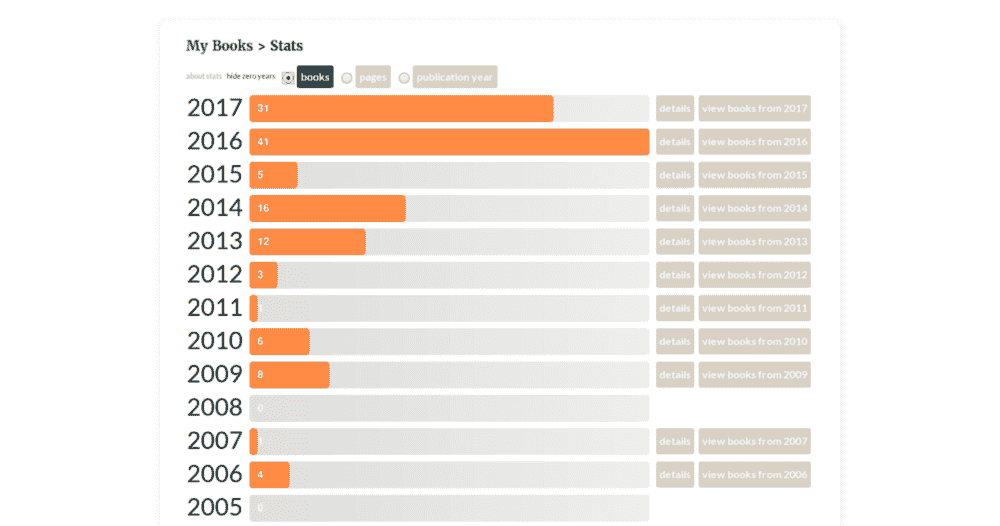

Goodreads breaks down how many books I’ve read per year.

这份报告确切地告诉我，有声读物改变了我多少阅读习惯。(强烈推荐你尝试一下)。Goodreads 还提供了按年份分列的数据:

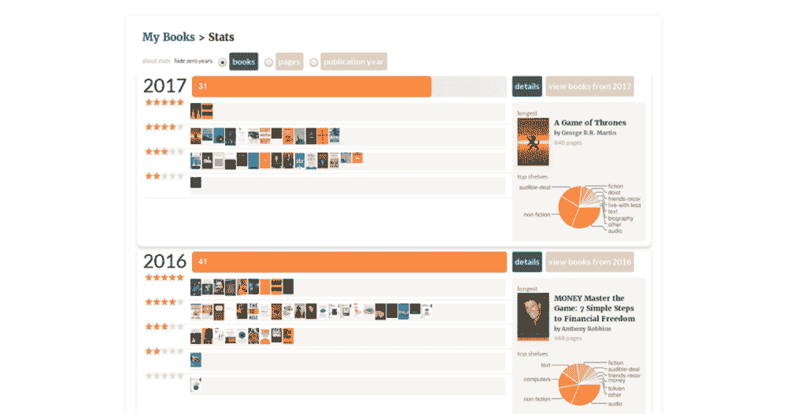

You can also a breakdown of how you’ve rated the books you read.

年度报告可以帮助你了解你是否选择了正确的书籍。如果你的评分不是一直很高，你可能想改变寻找下一本书的方式。

我也可以回去阅读我的评论，以记住我的外卖是什么。如果你不记得你学过的东西，读书有什么用？

## 阅读文章📰

如果你按年查看 Goodreads 报告，你可能会注意到，在 2016 年之前，我读的书要少得多。为什么我没有进步？我知道我读了很多书，但不是书，所以我决定记录我每个月读了多少文章。

我的第一个想法是使用[Todoist](http://todoist.com/)——我选择的任务管理器——来跟踪我的阅读清单。我试过这样的东西:

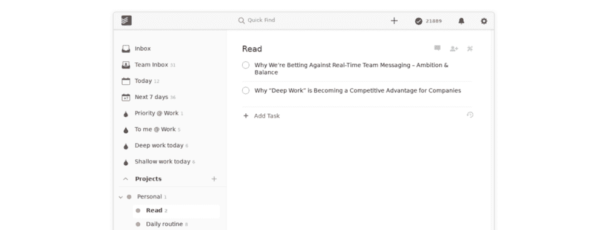

I’ve tried keeping track of the articles I read in a Todoist project.

它工作正常，但是我的方法有三个问题:

1.  数据提取过程过于手动。
2.  我不认为阅读一篇文章是一项任务，我喜欢使用 Todoist 专门用于任务。
3.  一些网站有很好的内容，但糟糕的设计/阅读体验。

一个朋友推荐我试试[口袋](https://getpocket.com/)。它与许多平台集成，工作方式类似于“稍后阅读”应用程序，解决了第二个问题。

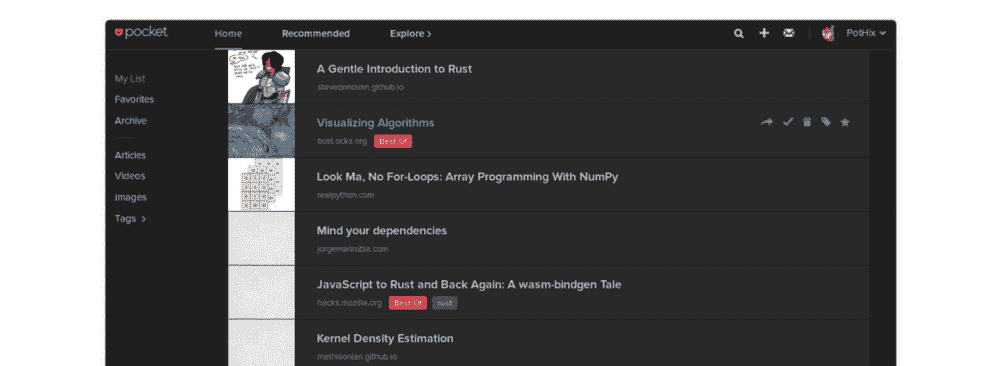

I discovered that Pocket isn’t just handy for saving things to read for later, it’s also a useful tool for tracking the things you’ve read.

它还从网页中提取内容，并给你一个界面来阅读，你可以根据自己的需要定制，解决了第三个问题。

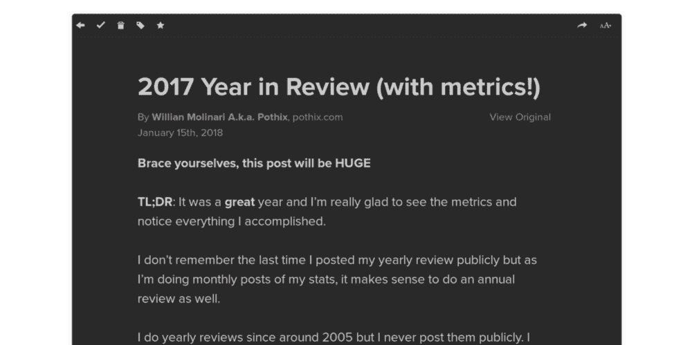

Plus, it’s a beautiful reading experience.

这仍然是第一个问题。找不到什么好的 app 从 Pocket 中提取数据，只好自己处理。

### 开发人员解决方案

我是一名开发人员，所以我根据他们的[导出 HTML](https://help.getpocket.com/article/1015-exporting-your-pocket-list) 文件特性构建了我需要的东西来获得我想要的结果。我只是下载了他们的文件并运行了这段代码:

`var pocket = {"unread":1420,"unread_pct":4.79,"read":1020,"read_pct":1.18}`

`var uls=document.body.getElementsByTagName("ul");unread=uls[0].children.length,pocket.unread_pct=+(100*(1-pocket.unread/unread)).toFixed(2),pocket.unread=unread,read=uls[1].children.length,pocket.read_pct=+(100*(1-pocket.read/read)).toFixed(2),pocket.read=uls[1].children.length,console.log(JSON.stringify(pocket));`

第一行是上个月的结果，看起来像这样:

`{"unread":1446,"unread_pct":1.8,"read":1050,"read_pct":2.86}`

在这种情况下，我有 **1446** 篇文章未读， **1050** 篇文章已读。未读项目的百分比增加了**1.8%**，已读项目的百分比增加了**2.86%**。对于这个特定的月份，我阅读了 30 篇文章，这是上个月(“阅读”:1020)和这个月(“阅读”:1050)的差异。

### 非开发人员解决方案

在写这篇文章的时候，很明显这种方法对于很多人来说是不可行的。我决定考虑一个非开发人员的解决方案。感谢我们的编辑 Becky，我正在使用 IFTTT + Pocket 构建一个简单的流程原型。

我创建了一个公共的 [applet，将 Pocket 链接到 Google 电子表格](https://ifttt.com/p/pothix)。不幸的是，Pocket 没有*存档日期*的字段，所以我使用标签来跟踪我阅读文章的月份。结果将如下所示:

The spreadsheet that I automatically populated with all the article I’ve read on Pocket using an IFTTT recipe.

**D** 列与这篇文章被添加到 Pocket 的时间相关。我决定保留它，这样我就可以很容易地看到从添加到阅读的时间。每次我读一篇文章都要添加一个标签，这不是很优雅，但似乎还行。

现在我们有了电子表格，检索我们想要的数据就变得简单了。第**栏和第**栏中的每月日期标签是数字，使得文章易于分类和计数。我还没有这些数据的图表，但根据我想要追踪的趋势，它们很容易在 Google Sheets 中建立。

## 音乐🎵

当我工作时，我通常听音乐。有时我用它来给自己补充能量，有时帮助我集中注意力。我用 [last.fm](http://last.fm/user/pothix) 来报告我什么时候在听什么。甚至有可能将这些歌曲与你最有效率的时间联系起来。你可以手动或者使用像 [Exist.io](https://exist.io/) 这样的自我数据聚合工具。

Last.fm 通常也会发送年度报告，它们非常棒:

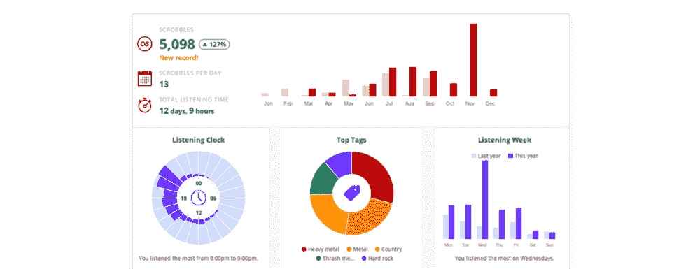

Last.fm’s yearly report

## 播客🎙

每当我通勤或做一些不需要很高认知力的事情(洗碗、遛狗等)时，我都会听播客(或有声读物)。).我使用[播客上瘾安卓应用](https://play.google.com/store/apps/details?id=com.bambuna.podcastaddict&hl=en)已经很多年了。这是免费的，但我捐款是为了移除广告，并为更好的应用程序做出贡献。如果你没有安卓设备，你可以试试[口袋施法](https://www.shiftyjelly.com/pocketcasts/)，但你必须一次性支付 9 美元。

这两款应用都提供了你收听时间的统计数据。对于 Podcast Addict，在“设置”>“统计”下会有这样的内容:

My podcast listening stats from Podcast Addict.

不幸的是，他们不容易提取数据。当我把所有的月份加起来写我的年度回顾时，我不得不手动完成。总的来说，你只要想想你正在消费的内容的数量，以及它对你个人发展的贡献就足够了。

## 电视📺

我尽量避免漫不经心地看电视(我说的漫不经心指的是漫无目的地:坐在沙发上翻频道找东西)，但我确实关注许多电视节目。我一般会事先找到喜欢的电视剧，预留时间和家人一起看。由于这需要花费一些时间，我显然想跟踪它(您可能在这里看到了一个模式)。

我用[电视时间](https://www.tvtime.com/en)来追踪我看的所有节目。这仍然是一个手动输入过程——我必须记得去应用程序并标记为观看——但它很快成为一种习惯。每当我观看一集精彩的节目时，我都会在应用程序中看到有趣的模因，所以会有即时的奖励。

当然，更长期的回报是看到我的月度/历史统计数据:

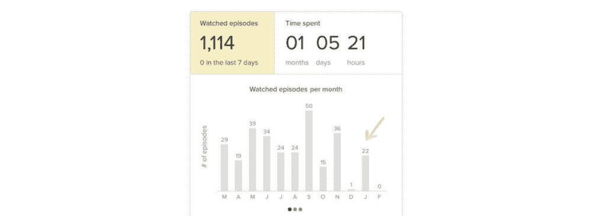

My TV watching stats from TV Time.

看你最喜欢的节目是没问题的，只要记住你在上面投入的时间，好好想想。值得吗？由你决定。对我来说，花时间是值得的。我的妻子和我享受在一起的时光，当然还有所有的后集分析和未来集的假设，讨论起来很有趣。

我唯一怀念的电视节目是电影跟踪。出于这个原因，我决定也尝试一下 [trakt.tv](https://trakt.tv/) ，这样我就可以同时跟踪两者。

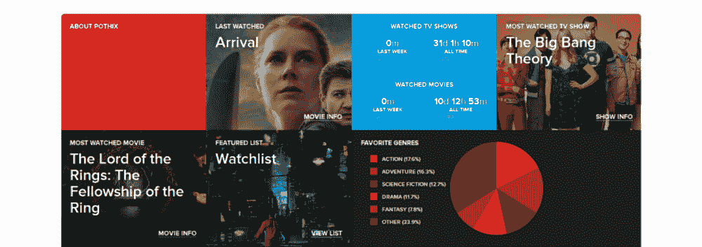

To track the movies I watch, I use trakt.tv.

如果 trakt.tv 和 TV Time 之间有某种集成就好了，可惜不存在。电视时间有一个很棒的 Android 应用程序，但不支持电影。Trakt.tv 支持电影，但你必须使用其他社区开发的应用程序来跟踪和发送你的统计数据。所以现在，我两个都用。

## 时间跟踪:自动⚙️

有了自动跟踪应用程序，你只需设置好就可以忘记它们了。该应用程序在后台运行，并跟踪你在做什么，以及你花了多少时间。对于这个类别，我使用根据自己的需要配置的[救援时间](https://www.rescuetime.com/ref/1403570)。

您可以自定义应用程序记录您的电脑使用情况的时间和/或它将观看的应用程序。例如，你可以告诉 RescueTime 只跟踪你在 Excel 中花了多少时间，如果你愿意，可以忽略所有其他应用程序。

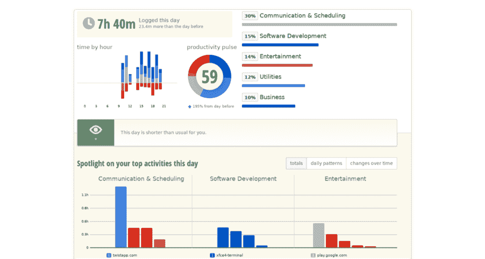

RescueTime tracks you computer usage in the background. No extra effort required.

我经常从这些报告中获得关于如何更好地打发时间的宝贵见解。例如，我可以看一看每一类应用程序，然后问自己这些活动是否值得我在一天中花费的时间。(我会推荐《当 时 *[这本书，来理解为什么你活动的时机很重要。)随着时间的推移，我可以使用这些数据来优化我的时间表，以适应我的能量水平和其他因素。](https://www.goodreads.com/book/show/35412097-when)*

## 时间跟踪:手动⏳

不幸的是，自动跟踪只能带你到这里。知道回复邮件所花费的总时间是很重要的，但是这是给哪个客户的呢？它们是工作邮件还是私人邮件？这同样适用于你追踪的几乎所有应用程序。手动时间追踪器需要你采取行动——比如启动计时器和选择类别——但是一旦你养成了习惯，它只需要很少的额外时间。

对于手动时间跟踪，我是 [Toggl](https://www.toggl.com/app) 的超级粉丝。它有一个友好的界面，易于使用，有许多集成(包括[一个 Todoist web 应用](https://toggl.com/todoist-time-tracking/?utm_source=doist_blog&utm_medium=referral&utm_campaign=quantified_self)，和许多平台的应用(包括 Linux)。

我为客户、类别和项目创建了一个简化的 Toggl 系统，以方便提取我感兴趣的报告，同时最大限度地减少日常活动中的官僚主义。

我的“客户”及其项目的一些例子:

*   Doist
*   浅薄的工作
*   深耕
*   会议
*   我自己
*   健康
*   金融
*   波希克斯
*   介绍会；展示会

三个顶级类别将我的日常工作、职业生活和我的兼职项目分开。我跟踪会议花费的时间，这样我可以评估它是否值得。如果我发现时间花得不值得，我可以和我的团队讨论，并制定策略使一些会议更有用或完全取消其他会议。

我决定只保留几个项目在 *Doist* 客户端下，以减少选择我目前正在做的项目所需的认知负荷。想要更精确的数据和防止自我跟踪占据你的生活之间总是有一个权衡。

当我全神贯注于一项任务，没有分心的事情时，我会使用“深度工作”项目——关掉手机，关闭即时通讯，等等。(例如编码)和当我在做一些不需要激光聚焦的事情时的“肤浅工作”(在我们团队的异步通信应用程序 [Twist](http://twistapp.com/) 上响应事情，做项目管理等)。

(如果你不知道深度工作和浅层工作的概念，我会推荐卡尔·纽波特的《深度工作:在分心的世界中专注成功的规则 》一书。)

我 99.99%的时间都在远程工作。在 Toggl 中跟踪时间有助于我了解是时候停下来了，还是我有更多的工作要做。我尽量把我的工作日保持在八小时。跟踪这段时间让我更有目的地计划我的一天，更聪明地工作，以确保我能完成每一件事。

这是 Toggl 报告中一周的示例:

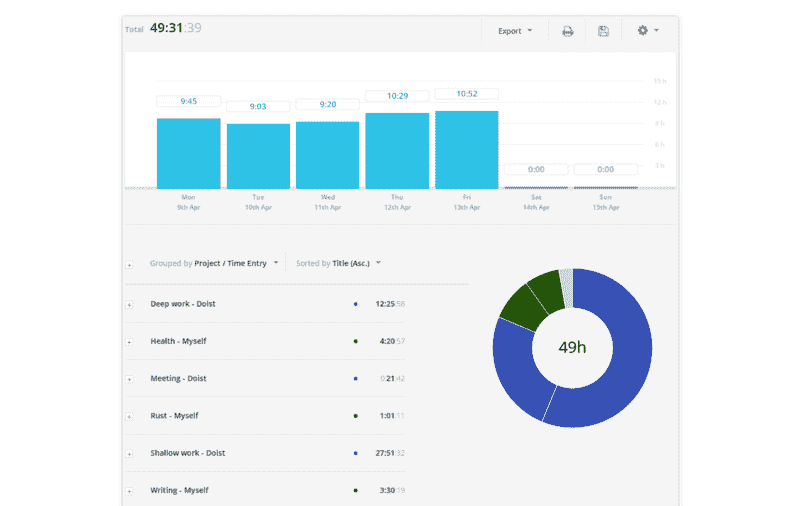

I think manual time tracking is worth the effort. This is an example report from Toggl.

**记住**:手动追踪很费时间，你不用什么都追踪。追踪对*你来说至关重要的*！

## 你去了哪里📌

我已经追踪我的位置有一段时间了。我是谷歌纬度的用户，直到它退休，现在我在使用 T2 的谷歌时间线。我通常不会在社交网络或其他地方分享我的位置，但我喜欢追踪我访问过的地方的好处。

Google 每月都会发送一份简讯，其中包含您的位置数据摘要:

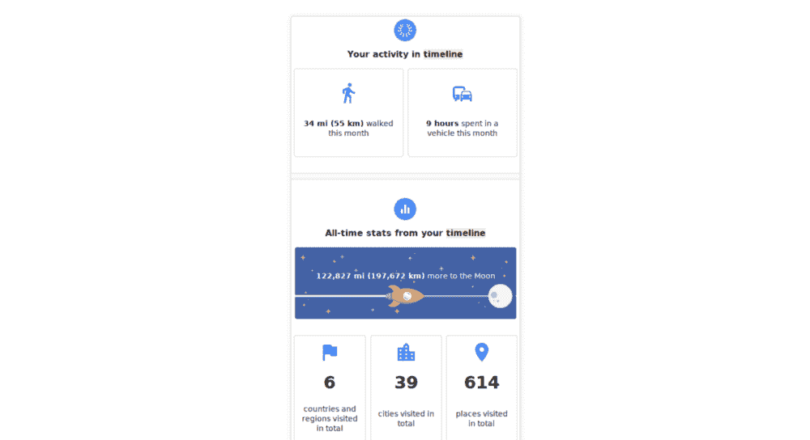

I use Google to track the places I traveled to (and how much time I spend in a car).

当我在办公室工作时，在汽车里度过的时间特别有助于我理解通勤的时间。看到我在[远程工作](https://blog.doist.com/remote-first-workplaces/)后花在车上的时间真的很好。

我不能提取那么多信息来关联我的位置数据，但是能够看到我过去去过的地方是很好的，尤其是当我在旅行的时候。

## Tasks ✅

这可能看起来有点偏见，但在我看来，我几乎从一开始就一直是 Todoist 用户——确切地说是 2007 年——在我 2017 年开始为 [Doist](https://blog.doist.com/) 工作之前整整十年。

An email I sent to Doist’s founder Amir back in 2007\. Proof I’m not just recommending Todoist because I work here!

申请 API & Integrations 开发人员职位的主要原因是因为我热爱产品和公司价值观。在这 10 年间，我尝试过很多任务清单，但总是决定回到 Todoist，因为这是我需要的一切。

Todoist 有一个(最近改进的)生产力视图，你可以看到你在什么时候完成了什么的高级统计数据。我不太喜欢保持每天和每周的任务目标(如果你喜欢，你可以改变它们，让它变得更容易，或者如果你喜欢，挑战自己)，但我确实喜欢每个月在每周视图中看到大图:

My Karma stats and productivity breakdown in Todoist.

此报告显示我如何按项目拆分一周的任务。红条表示个人任务，蓝条表示工作。我平时有很多和日常有关的个人小任务，工作任务大多是大的，值得深入的工作。为了使这个视图更有用，请确保您按照想要跟踪的高级类别对项目进行颜色编码。

像这样的报告结合 Toggl 和 RescueTime 提供的报告让我怀疑我是否花了太多时间阅读我的 [Twist](http://twistapp.com/) 线程。

我是一个早起的人，我通常在早上花更多的时间阅读 Twist，而此时我应该做更深入的工作。我的计划是在早上浏览一下我的思路，然后把我需要跟进的对话直接从应用程序变成[待办任务](https://twist.zendesk.com/hc/en-us/articles/115003991429-How-to-use-Twist-and-Todoist-together)，这样我就可以在下午处理它们。(把我的扭念保持在零让我感觉更好，我可以在 Todoist 中更好地推进后续工作。)

有了这些数据，我可以根据以前没有注意到的趋势得出一些结论。

同样值得一提的是，Todoist 每年一月发布的年度“年度回顾”不仅有趣，还包含有用的个人见解:

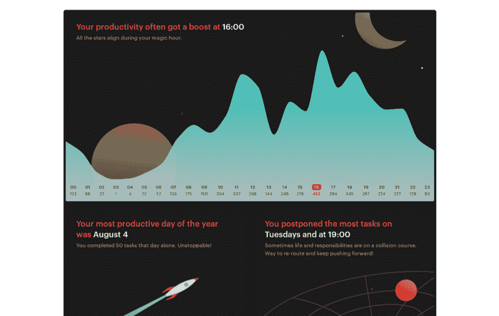

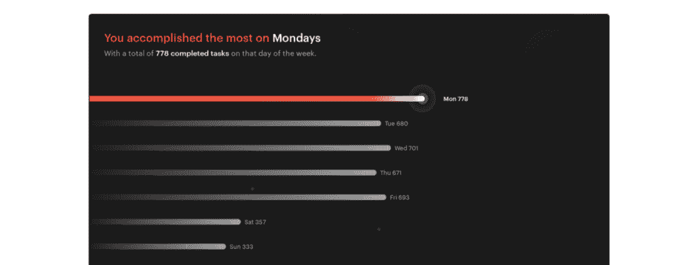

The Todoist Year in Review is filled with interesting stat about how many tasks I completed when.

## 写作📝

你知道你一个月写多少字吗？你用英语写作时会犯多少错误呢？语法上的可以帮助回答这两个问题。

我推荐使用它，尤其是如果你的母语不是英语。它识别容易被忽视的常见错误(如介词)。

Grammarly 每月给你发一份时事通讯，上面有你上个月的统计数据。看起来是这样的:

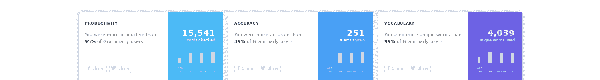

My writing stats from Grammarly.

不幸的是，时事通讯是 Grammarly 唯一的度量来源，但是我做了一些手工提取来创建这个电子表格:

A graph I set up myself to track my Grammarly stats over time.

很高兴看到写的字数在增加，但修改的数量却没有。看来我在进步！

当然，你也可以挑战自己每月的字数目标。

## 开发人员的代码跟踪👩‍💻

这一节是对那些每天写代码的人的奖励。如果你想记录你花了多少时间写代码，以及你使用了哪些语言/编辑器，我强烈推荐使用 [Wakatime](https://wakatime.com/i/PotHix) 。

我在[我的“现在”页面](https://pothix.com/now/)中使用了他们的嵌入式图表(基于[德里克·西弗斯的“现在”页面](https://sivers.org/now))。我最喜欢的图表之一是我的语言分类:

My programming language breakdown.

为了让它工作，你必须在你的 IDE/文本编辑器上安装他们的插件，但是这个过程非常简单。

## 身体与健康💪

对于这个类别，有很多追踪器。其中大多数都是可穿戴设备，你可以支付一些(有时是很多)钱，它们会跟踪你一天中的各种事情。你可以购买它们，但是你也可以保持简单，免费做一部分或者只花最少的钱。

### 步伐👣

是的，我知道步数不是衡量你健康或活跃程度的完美标准，但是走路是一件健康的事情。如果你像我一样，关心你每天走了多少路， [Google Fit](https://fit.google.com/) 可能是一款适合你的应用。

Google Fit 跟踪你的步数和距离，并试图猜测你正在进行的体育锻炼(虽然目前在最后一项上不太成功)。这很简单。你只要装上它，把手机带在身边。

您可以在 fit.google.com 上获得如下月度报告:

My steps from Google Fit

就我而言，我用一个 30 美元的腕带(下面有更多信息)来跟踪我的脚步，它还可以跟踪你的睡眠…

### 睡眠💤

有移动应用程序可以跟踪你的睡眠，但是，就我个人而言，我不喜欢靠近手机睡觉。出于这个原因，我决定买一个带，除了让我的步数更准确之外，还可以跟踪我的睡眠模式。

你可以在那里找到几十个乐队，从几十美元到几百美元不等。我挑了一款不太贵又能满足我需求的 [mi-band 2](http://www.mi.com/en/miband2/) ，但它们中的任何一款都可能适合这个。每天一整天戴在手腕上的东西，是非常个人化的选择。

下图是我从 Mi Fit 伴侣 app 得到的睡眠报告:

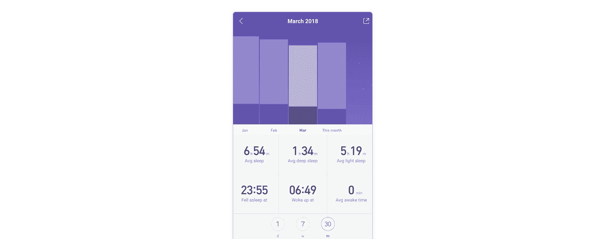

My sleep stats from mi fit.

可以按天、按周、按月查看睡眠情况。上面的截图特别有用，因为我不仅可以比较我的睡眠时间，还可以比较我和前几个月的睡眠质量。深紫色代表着基于我夜间活动的深度睡眠。

有了这些报告，我每月分析我的数据，并决定它是否足够好，或者我是否应该改变我的日常习惯，以改善我的睡眠时间和/或质量。上面屏幕上的一个很好的例子是我的平均睡眠时间:少于 7 小时并不好，所以我可能会在接下来的几个月里想出一个计划来改善它。

### 食物🥘

我发现的跟踪食物和锻炼的最好的应用程序是 [MyFitnessPal](https://www.myfitnesspal.com/) 。他们的食物数据库是无与伦比的。我再次追踪我每天的食物摄入量和运动量，但这不是我一直做的事情。我以前在节食的时候做过这种跟踪，体验很突出。

通过使用 MyFitnessPal，你可以记录你的卡路里、宏量营养素、食物种类、运动项目、饮水等。这是一个手工的过程，但是如果你在这方面努力提高自己的话，这个价格是值得的。

Example visualizations of my nutrition stats from My Fitness Pal.

很难跟踪你的食物摄入量，因为这是一个手动过程，如果你在遵循某种饮食，结果是最有价值的。但有时只是在这里或那里跟踪一周，就能提供一个有用的数据点，说明你是否总体上吃了正确种类和正确数量的东西。

## 金钱💸

钱是我追踪的最重要的东西之一。我已经忠实地做了很多年了。请记住，跟踪你的钱和控制你的开支不是一回事。你可以追踪你的钱，而不需要改变你的生活方式。最棒的是，你可以看看你的开销，决定它们是否给你的生活增加了价值。你还可以查看过去的支出数据，以决定你是否能负担得起大宗购买——比如一栋房子或一次长假。

我使用一个免费的本地应用程序，并连接到我的银行来获取我的费用。他们使用您的数据将信用公司与您联系起来。如果你同意的话，这是一个简洁的应用程序，可以为你节省很多分类费用的时间，但它只在一个不以英语为母语的国家有用。

在这个应用程序中，我可以生成这样的图像，其中每个百分比是一个类别(例如，娱乐，家居，旅游等)。):

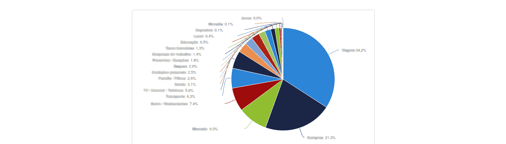

A breakdown of my spending. In case you’re wondering, the big blue chunk is Travel. I consider it one of my best investments.

我建议 [YNAB](https://youneedabudget.com/) (你需要预算)，而不是推荐一个你们大多数人都不会用的 app。这款应用内置了特定的个人理财理念和系统(顺便说一句，这真的很有效)，但它们也具有与我使用的应用相同的功能:

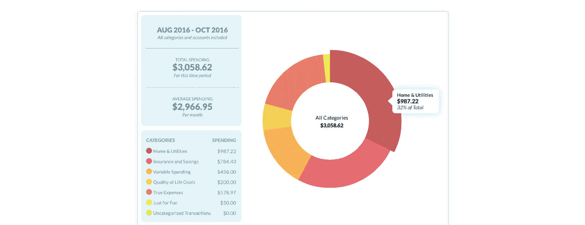

For most people who want to track expenses and/or budget, I recommend YNAB.

YNAB 的问题是，它是一个付费应用，所以你必须决定是否要投资它。薄荷和[净度钱](https://claritymoney.com/)是流行的“免费”(或者至少是免费)替代品，但我对这两者都没有亲身体验。

## 您自己的衡量标准📊

有时你想追踪一些没有应用程序提供的特定信息。在这种情况下，你可以回到 [Google Spreadsheets](https://sheets.google.com/) 并建立自己的指标。举个例子，我设定了一个目标，在一年内做 20 次公开演讲，并且每个月记录一次。

下图是我去年的最后一张图表:

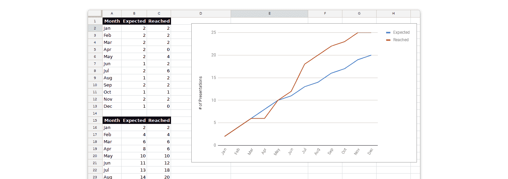

This is a custom metric I decided to track myself using Google Sheets.

很高兴能理解我那个月的计划。你可以看到，当我发现我在四月份落后于计划时，事情发生了变化。

你可以为任何指标——阅读书籍、发表文章、跑步里程、收入等——创建一个“目标与实际”的折线图。这里有一个来自 Lucid Chart 的[伟大指南，它将带你完成如何设置它。](https://www.lucidchart.com/techblog/2017/10/18/make-killer-data-dashboard-with-google-sheets/)

如果你保持你的谷歌表单跟踪你想要关注的一两个主要目标，可视化你的进展(或缺乏进展)的额外动机可能是值得手工努力的。(在 Todoist 中添加每周或每月的[周期性任务可能会有助于提醒您坚持下去。)](https://get.todoist.help/hc/en-us/articles/360000636289-Set-a-recurring-due-date)

如果你不想向第三方提供数据，电子表格软件实际上是一个很好的工具，可以用来跟踪我在本指南中提到的任何东西。你可以使用谷歌电子表格、Excel 或者 [OpenOffice Calc](https://www.openoffice.org/product/calc.html) 来构建你自己的带有图表等的简单系统。请记住，创建和维护这种 DIY 跟踪系统需要一些时间和精力，但对于那些不喜欢安装应用程序来跟踪他们的活动的人来说，这是一个选择。

## 如何开始收集和分析你的数据📈

我倾向于使用最便宜、最定制化的追踪系统，但有时即使我们不得不为此付费，为我们精心设计也是件好事。让我们评估一种**免费**和一种**付费**的方式来开始聚合你的数据。

### 自由的

你不需要同时使用所有这些应用和策略来获得跟踪的好处。如果你想开始收集关于你自己的指标，你可以从这些应用程序/策略中挑选*一个*应用到*你生活中的某个*特定领域。

例如，您可以从 RescueTime 开始。它不需要每天手动输入(只需要在开始时对应用程序的类别进行一些配置)，几周后你就会开始看到有趣的模式。

### 有报酬的

如果你不介意使用应用程序来跟踪你的数据，并愿意为有帮助的服务付费，我建议尝试一下 [Exist.io](https://exist.io/?referred_by=pothix) 。这是一项付费服务，但你可以免费试用 30 天，如果你被推荐，可以试用 60 天。如果你想试用两个月，我提供的链接是我的推荐。

你可以把它想象成一个个人仪表板，把你所有的数据集中到一个易于查看和分析的地方。该应用程序将引导您浏览他们连接的应用程序，您也可以连接您使用的应用程序:

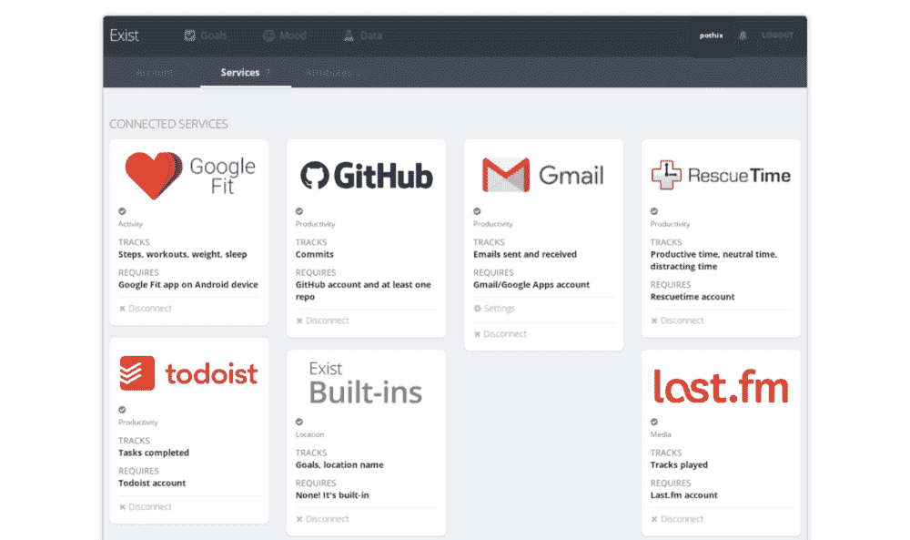

Exist.io will bring all your stats into one place.

您很快就会看到这样的图表:

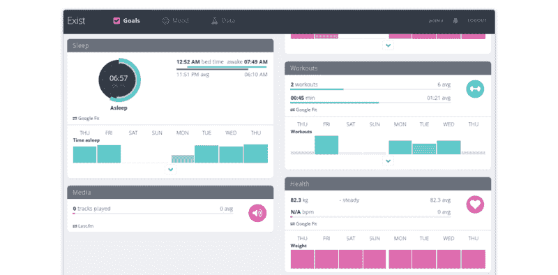

The app generate awesome charts like these.

除了集中您的数据，该应用程序还允许您为您的日子添加自定义标签，并自动发布有趣的见解，如生产力和锻炼之间的相关性，甚至体重和您访问过的地点。它还根据你当前的平均水平设定个性化的目标，甚至还有内置的情绪跟踪功能，这不是我在本指南中讨论的领域。

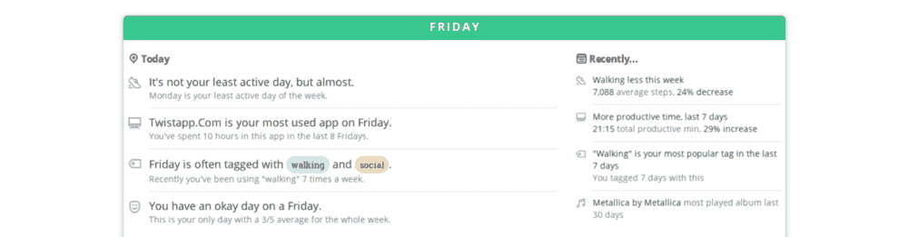

Exist.io 也会自动突出有趣的见解和关联。相当整洁。

这是一个很好的服务和很好的公司。

## 你从这些追踪中得到了什么？🏅

简而言之，持续改进。好习惯很难养成。坏习惯很难改掉。如果不把有意识的意识带入你的生活，很难做到这两件事。

跟踪你的数据可以让你诚实地看待你实际上是如何度过时间的(而不是你认为你是如何度过时间的)。这不是对过去行为的责备或内疚。这是关于注意模式和做出有意识的决定，以便在下个月做得更好。它给你机会成为一个更好的人——不管对你来说是什么样子。

知道你正在以一种切实的、可衡量的方式将你的生活与你的价值观和优先事项联系起来，这种感觉也很好。

以下是在定期检查我的指标后，我可以(并且已经)改进的地方的总结:

*   检查我是否落后于 4 月份的预期结果后，提高我的演讲表现
*   改变我选择阅读书籍的方式，因为我的评分不是很好
*   换工作是因为(除了其他原因)我不能专注于我喜欢做的事情。
*   停止每天阅读我的新闻，因为我正在往口袋里添加很多我没有时间阅读的文章。
*   减少我听播客的数量。我正试着把注意力放在有声读物上，因为我发现它们给我的生活增加了更多的价值。
*   如果我在一天内使用电报超过 30 分钟，添加一个提醒来通知我。
*   记录我每天工作的时间。通过增加时间的硬性限制，我不得不专注于必须做的事情，更聪明地工作。有了它，我可以改善我的工作/生活平衡。

这些变化给我的生活增加了很多价值。你可能不会得出同样的结论。正如每个人都喜欢说的，没有放之四海而皆准的解决方案。你可以阅读所有的生活和工作建议，但最终每个人都是独一无二的。收集你自己的数据可以让你优化你的生活，达到你想要的效果。你可能永远也不会完全达到你自己的理想(无论如何那会很无聊)，但是你会在这个过程中不断进步。