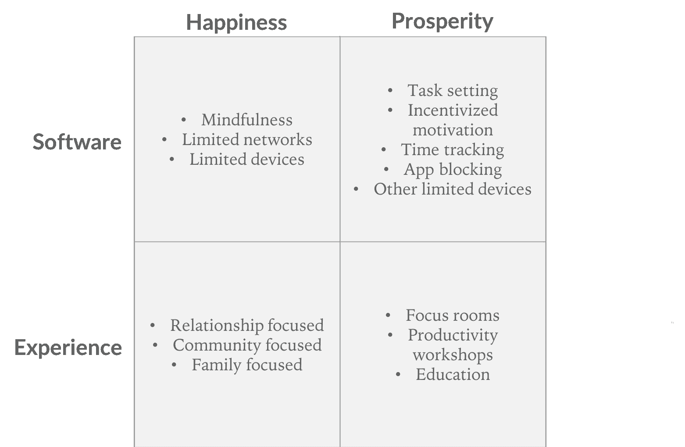

# 解决技术成瘾是一个被低估的市场机会

> 原文：<https://loupventures.com/solving-tech-addiction-is-an-underappreciated-market-opportunity/?utm_source=wanqu.co&utm_campaign=Wanqu+Daily&utm_medium=website>

智能手机让我们成为超人，因为它赋予我们指尖上世界信息的智能；然而，很少有人会不同意我们无处不在的设备也会产生不良后果。我们在手机上花了太多时间，以至于忽略了我们周围的真实世界和真实的人。[研究](https://www.theatlantic.com/magazine/archive/2017/09/has-the-smartphone-destroyed-a-generation/534198/)表明，技术成瘾会导致不快乐和更高的[自杀率](https://variety.com/2018/digital/features/smartphone-addiction-apps-apple-facebook-google-1202724489/)，因为我们有意义的关系更少了。

在 Loup，我们经常讨论技术对人类的影响。虽然我们同意没有技术是纯粹的好或坏——所有的事情都有权衡——但我认为技术本身不会产生新的问题，它放大了人类心理固有的现有问题。技术的目的是增强人类的体验，因此这种增强会以积极和消极的方式发生，这是显而易见的。

人类在生物学上被激励去寻求快乐和避免痛苦。这不仅是我们生存本能的基础，也是所有上瘾的基础，包括技术。

### 定义由技术成瘾引起的问题

该研究称，科技让我们不快乐，大多数人将其归咎于我们的智能手机；然而，让我们不快乐的不仅仅是我们的智能手机，而是我们在智能手机上消费的信息。该设备是内容的管道。在 Instagram 上，我们被过着完美生活的漂亮人轰炸。在 Twitter 上，我们被关于政治和其他事情的简短、愤怒的争论轰炸。在 YouTube 上，我们被没完没了的有趣视频轰炸，这些视频一直在播放，直到我们停止播放。

我们收到的源源不断的通知和信息给我们带来了令人愉快的多巴胺，诱使我们返回，并助长了我们的瘾，尽管这不是建设性的或健康的。似乎有三种与内容相关的核心机制导致了不快乐:自卑、愤怒和分心。

1.  **自卑。**大概从我们在石器时代嫉妒邻居的四居室洞穴开始，“与邻居攀比”的观念就已经成为人类的心理现实。科技拉近了世界的距离。在一些平台上，尤其是 Instagram，每个人看起来都很漂亮、迷人、富有。我们觉得每个人都是我们的邻居，我们必须与他们保持一致，这是不可能的。如果我们看到朋友们玩得开心，而我们却不在，我们也会有被冷落的风险。
2.  **愤怒。不幸的是，愤怒比理性讨论更有吸引力。当我们生气时，我们觉得有必要回应并捍卫自己的观点。然后，我们与我们认识的每个人分享这种回应，这样他们也可以回应。如果世界认同我们，我们的愤怒是合理的。如果世界不同意我们的观点，我们就会进行道德斗争，变得更加愤怒。因为媒体平台主要通过广告赚钱，而广告是通过参与来销售的，所以促进基于情感而不是逻辑的讨论更有利可图。**
3.  **分心。注意力分散是前面提到的寻找快乐的直接副产品。每当我们收到通知或下一个自动播放视频开始时，这是一个快乐的机会，如果我们错过了，那可能会被视为痛苦。通过回复每一个通知，我们无法集中注意力，这导致了拖延、表现不佳和压力。**

### 我们不能依靠科技巨头来解决科技成瘾问题

为了有意义地减少技术成瘾，苹果、谷歌和脸书可以消除我们从他们的产品中收到的通知流。我们不需要知道每次有人在 Instagram 上发布新图片，或者在 Chrome 上看到谷歌新闻为我们策划的故事，甚至是收到一封新邮件。

不幸的是，取消应用程序或通知会妨碍这些业务的最重要指标:设备销售、平台参与度和付费客户。这些公司是世界上最有社会意识的公司之一，但它们仍然依赖股东和靠利润生存的员工。虽然苹果、谷歌和脸书开始提供工具来更好地了解我们使用他们的设备和服务的程度，但这些公司无法有效地解决技术成瘾问题，因为他们的业务阻止他们这样做。

### 那么，我们该如何应对科技成瘾呢？

就像任何被社会视为问题的事情一样，尤其是当上瘾是一种风险时，政府有可能进行监管。我们在 20 世纪初尝试禁酒令。最近，我们试图在纽约限制软饮料的数量。

保护人们免受伤害似乎从来都不太管用。自由和安全是永恒的权衡。大多数理性的个人不愿意让别人以他们的安全为名为他们做决定，而是以他们的自由为代价。我们想要决定什么是对自己最好的，即使我们的选择不正确。

解决技术上瘾的真正答案是可持续地解决大多数问题的答案:资本主义刺激的创新。一个新的企业群体需要出现，让我们能够选择自助，重新发现脱离的好处。

节食可能是这里最有用的类比。在美国，我们中的许多人偶尔或经常饮食不佳。我们中很少有人有长期良好饮食的习惯来优化我们的健康。当我们体重增加过多时，我们会花钱请私人教练或节食计划或一本书或一个应用程序来让我们回到正轨。

我们都因过多使用科技而严重超重，我们需要节食。

### 解决方法

我们看到两种解决技术成瘾的方法:基于软件的方法和基于经验的方法。基于软件的解决方案是帮助我们了解我们在使用技术上花费了多少时间，甚至阻止我们使用某些技术的软件工具。主要的科技公司正在提供一些这样的工具，比如苹果在 iOS 上提供了宕机。第三方公司提供了更加激进的时间管理应用程序版本。基于经验的解决方案较为罕见，但例子包括一对一的成瘾咨询和禁止使用智能手机的地点。

迄今为止，解决技术成瘾的方法被认为是限制负面影响。我们跟踪或限制我们花了多少时间。然而，正如我们注意到的政府干预，“不要这样做，因为这对你不好”是一个糟糕的推销。提供有意义的解决技术成瘾的解决方案的公司需要首先销售利益，甚至可能不会谈论技术成瘾。

人们为饮食和锻炼付费，因为健康和看起来更好对身体、精神和社会都有好处。人们会为两个核心利益而与技术断开连接:幸福和繁荣。快乐与消除自卑感和愤怒最相关。成功来自避免分心的专注努力。

总之，我们看到两种类型的解决方案:基于软件的解决方案和基于经验的解决方案，每一种都能够提供两个核心好处:幸福和繁荣。我们可以考虑在矩阵中管理技术成瘾的机会:

来源:Loup Ventures

每个象限中列出的机会都是示例，并不详尽。每个类别中都有我们已经看到或希望看到的想法。最好的想法不太可能包括在内，但这里有一些我们认为最有趣的关于上面几个概念的额外想法:

*   **有限的设备。**限制我们使用的设备可以从源头上避免成瘾行为。这将发生在操作系统层；然而，如上所述，苹果和谷歌不太可能在他们最近实现的跟踪和提醒功能之外设置真正的限制。功能与十年前相似的手机是有意义的。一部只能打电话、发短信和一些其他功能的手机可能有助于增加幸福感。没有互联网或在操作系统层建立了严格限制的互联网访问的笔记本电脑可以提供专注的生产力，从而带来繁荣。如果某人不能进行上瘾行为，他们就不会。至少在他们的受限设备上没有。
*   激励的动机。激励推动行动。你从通知铃声中获得的兴奋刺激让我们回到手机上，但是我们可以改变这个概念，让我们停止使用手机。如果用户已经使用手机 10 分钟或更长时间，应用程序可以向用户提供频繁的提醒，让他们回去工作或放下手机。进一步说，如果他们实现了目标，可能会有一些财务或其他的激励(也许用户会为购买他们想要的东西而储蓄一些钱)。通过打破我们从事的任何非生产性活动的魔咒或增加摩擦，我们有机会锻炼意志力，将我们的注意力转移到其他地方。我们可能无法让生产力像 Instagram 一样让人上瘾，但我们应该可以接近。
*   **焦点房间**。每一个共同工作的空间和办公室都应该有一个禁止使用电话和限制上网的房间——一个分散注意力的办公室沙漠中的生产力绿洲。强制执行是这里要解决的关键问题，这可能需要一个监视器来确保客户不会违反设备限制。焦点室也可以作为对其他人的社会证明提醒，鼓励他们采取行动来抑制他们对联系的成瘾。

### 结论

我们的手机不会消失；我们的社交网络也是如此。完全技术化的脑叶白质切除术甚至都不可取，因为它会去除好的和坏的。人类总会找到进化的方法，解决技术成瘾的方法也不会不同。由市场自由激发的创造力将创造各种解决方案，帮助我们管理技术成瘾。使用这些方法来有效抑制消极习惯的人最终会比其他人更快乐、更富裕，就像以前一样。这个激励怎么样？

免责声明:我们积极撰写我们投资或可能投资的主题:虚拟现实、增强现实、人工智能和机器人技术。有时，我们可能会写一些我们投资组合中的公司。作为投资组合的经理，我们可能会从该投资组合中赚取附带权益、管理费或其他报酬。本网站上的内容包括对特定技术主题的意见、市场评估以及对上市公司或私营公司的评估和评论，这些内容不用于做出任何投资决策，仅用于提供信息。我们没有义务更新我们的任何预测，本网站上的内容不应被依赖。我们对我们做出的任何估计或意见不做任何保证。