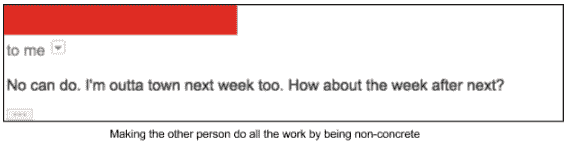
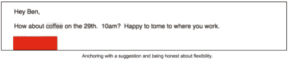
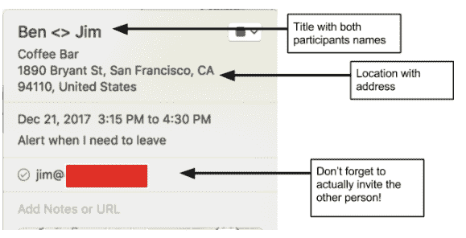

# 书呆子网络

> 原文：<http://benjaminreinhardt.com/networking-for-nerds/?utm_source=wanqu.co&utm_campaign=Wanqu+Daily&utm_medium=website>

“网络。”多好的一个词。当我在 2015 年离开研究生院时，社交网络是为头发光滑的推销员、前运动员和一般的社会寄生虫准备的。真正的英雄造出了更好的捕鼠器，世界找到了他们。但是后来我看了看真正的成功实际上做了什么——它们在联系和建设之间引领了一个平衡的行为。尽管爱迪生、爱因斯坦、马斯克(以及任何你可能听说过的人)都做了真正的工作，但如果他们不认识正确的人:合作伙伴、员工、支持者、支持者，他们的项目就会胎死腹中或失败。

我一直是科学方法的奴隶，我以“网络可能有用”为假设，做了许多实验。有些是成功的，有些则不那么成功。在这个过程中，我制定了一套策略，释放了许多机会——在 Susa Ventures 担任 EIR，在巴西和 SXSW 的会议上发言，并创办了一家公司。(我喜欢这样想)这些都是建立在一扇真正有价值的门上，但战术网络建设提供了关键。

以下是我开发的一些具体策略。在一天结束的时候，所有这些都归结为一件事——让对方容易记住你，帮助你，和你见面。

### 策略 1:预测模型

为什么有些人似乎到处都有拥护者？他们为自己创造了一个小小的心理模型，让他们遇到的每个人都感到轻松。

每个人都有一个“投影”——一个他们认识的生活在他们头脑中的每个人的小代表。你知道那个朋友是谁吗？他是“那个想进入机器学习和咨询领域的坏蛋界面设计师？”她有惊人的投射能力，让机会很容易找到她。投射可以是清晰的——“本正在寻找 X，Y，Z，并且可以帮助 A，B，c。”或者它可以是模糊的——“本是那个卷发的家伙，我想我在那个聚会上见过他，我们谈论了一堆有趣的事情。”

如果很明显，每当 X 出现在对话中，你会立刻想到它，你会收到这样的信息:“我们正在讨论 X，希望你能成为我们的顾问。”

以我的经验来看，我创造独特形象的能力和人们帮助他人的能力之间有着直接的联系。当我是“对演讲感兴趣的 AR/VR 人”时，一位新朋友向我介绍了巴西的一个组织，该组织正在开设一门关于未来技术的课程，在圣保罗演讲，结交了新朋友，并开启了几项合作。

诀窍是投影很小，只能容纳几条信息(经验法则——大约三条)。)为了最大化你的投射效果，弄清楚你想在人们的脑海中联想到哪些东西，并对它们感到兴奋。没有什么比明显的兴奋更令人难忘了。同样，试着找出驱动你与之交谈的人的事物，并将它们融入你对那个人的心理描述中。鼓励人们把你记在心里的最好方法就是把他们记在心里。(注意:许多人将这一点发挥到极致，直截了当地问:“我能帮上什么忙？”这正是你应该有的情绪，但这会让你的对手觉得你实际上没有在听)

#### 讲个故事:

你如何建立一个强大的投影？一个有力的故事。故事比其他任何东西都更能留在人们的脑海里。确保你有一个好的。你所需要的是一个简短的叙述，至少有一个引人注目的角色(你)，一个吸引人的主题，和某种[叙述弧线](https://en.wikipedia.org/wiki/Story_arc)。把你的生活想象成由一条道路连接起来的一系列城镇，这些城镇是由你的主题连接起来的背景的相关部分。坦白说，大多数人根本不会记得那些城镇。他们只会本能地记得这个主题是否得到了有力的支持。

讲故事并不意味着你应该撒谎或夸大其词——人们会看出来的。对于我们这些书呆子来说，让他们感到不舒服的一件事是从经验上看毫无关联的事件中寻找意义。

### 策略 2:了解你的要求

#### 让帮助变得容易

在一天结束的时候，每个人都有很多事情要做，如果你能在那里存在，那就是一个奇迹。你如何最大化获得宝贵的大脑空间的机会？使用故事并提出明确的问题。

#### 磨练你的提问

现实检查:人们最多会记住你的三件事。确保其中一个是你的**问题**——他们能为你做的最有影响力的事情。为了最大化你的提问，让它简短、清晰、一步到位。否则，记忆和执行会更加困难。对于聪明的成功人士来说，提出要求通常是不舒服的——你希望自己过得很好，变得很了不起，让别人知道如何自己帮助你。这是不会发生的。另一方面，如果你有一个明确的可操作的要求，人们会迫不及待地去做。

几年前，每当我要去某个地方旅行时，我都会被动地发布“我要去城里，谁想出去逛逛？”如果我幸运的话，也许会有一两个人回应。现在我主动问在那里生活过的朋友“你认识的最棒的人是谁？你能帮我联系他们吗？”结果呢？友谊和冒险。

一些提问的好例子:

*   “我希望与老年人护理行业的主管级或以上人员取得联系”

*   "我需要在旧金山买一套 2200 美元以下的新公寓，最好是在教堂里."

*   “我正在寻找机器人领域面向客户的工作，这种工作可以利用我独特的技术技能和人际技能组合”

他们为什么好？

**单个动作执行-** 与人连接，或互联网上的一个链接。

他们不会强迫你问一些澄清性的问题。

#### 什么时候问

提问的时机很微妙。在极限中，你显然不想走到一个陌生人面前说“嘿，我在找工作。”你也不想等到别人邀请你参加他们的婚礼后才告诉他们你需要什么。与其考虑时间，不如考虑兴趣。一旦有人对你感兴趣，不管他们认识你多久，他们都可能记得他们能帮上什么忙。我在一分钟内就谈到了这一点——当我提到我正在做关于老年人护理的研究时，他的眼睛亮了起来，告诉我“哦！我有一个在那个领域工作了 20 年的姐姐。”(兴趣)“太好了！她会有兴趣聊天吗？”(问。)

### 策略 3:会前动议

由于关系是通过 1-1 的互动建立的，没有 1-1 的会面，你无法建立有意义的关系。我花了很长时间才意识到，在会议开始之前，你可以做很多事情来让会议变得精彩。

#### 行程安排

让我们假设你没有私人助理来安排你的会议。让我们也假设你没有足够的筹码，可以发短信给某人“接下来的一个小时，我会在仪式咖啡闲逛。来找我。”这里有一些让日程安排变得简单的战术上的注意事项。

**Do:** 在邮件中说出你想在会议中谈论的内容。这让他们很容易就答应了，也给了你们两个人一个小小的提醒，让你们在开会前回去查看邮件。

不要:使用“我想征求你的意见……”这种说法会让人觉得“我不愿意跑腿提出具体的问题和话题。”

尽可能多地提供信息- *“我在使团工作，周四下午我在索马。”*

当你不忙的时候，不要含糊其辞或者假装很忙。为了避免含糊不清，我最喜欢的一句话是:“我在时间和地点上都很灵活，但我喜欢提供一个具体的建议……”

**Do:** 围绕时间和地点，用 2-3 个选项来引导对话。时间之窗完全没问题。*“你愿意在周四或周五下午 2-4 点在 Stable Cafe 喝咖啡见面吗？”*

**不要:**问“什么时候对你最合适？”或者说“我们应该去喝杯咖啡！”没有锚定时间。这看起来很好，因为你给了他们所有的选择，但你也把所有的工作放在他们的桌子上，没有给他们任何关于你的偏好的信息。

日历邀请- 这似乎是显而易见的，但许多人仍然会搞砸会议的收尾工作——日历事件。忙碌的人按照他们的日历生活，所以让他们容易记住会议——在哪里/什么时候举行，和谁在一起，可能是关于什么的。这是我日历上的一个小例子:

如果我把它命名为“Ben <> Jim 讨论人工智能策略”或者把主题放在注释部分，那就更好了。

#### 研究

开会前做功课。在网上跟踪一下你的同事。阅读他们的推特/博客，浏览他们的 LinkedIn、Github 等等。整个目标是更多地了解他们是谁，他们做了什么，什么让他们兴奋。当有人在对话中提到你的网页时，这也是一种恭维。

### 让它变得简单

在一天结束的时候，所有这些都可以归结为让事情变得简单的方法——让人们记住你，帮助你，和你交流。如果你把这种启发记在心里，将这些策略内化并想出你自己的策略将是轻而易举的事情。

如果你喜欢这篇文章，请分享给你的朋友，如果你有任何问题，请联系我们。

