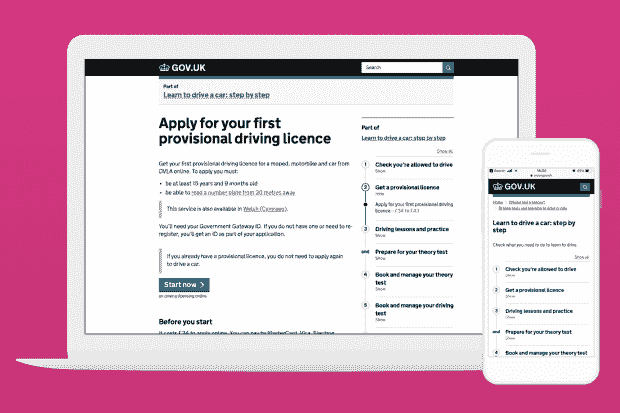
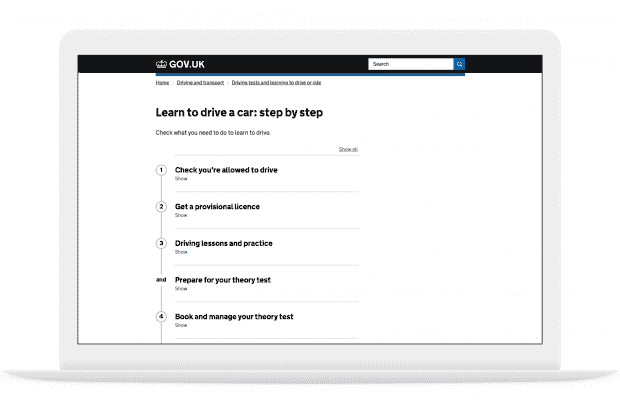
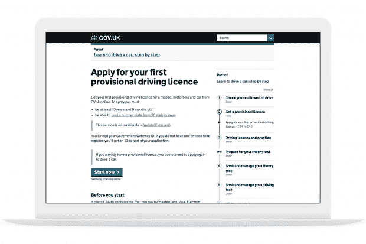

# 建设一个更好的 GOV.UK，循序渐进-政府数字服务

> 原文：<https://gds.blog.gov.uk/2018/10/17/building-a-better-gov-uk-step-by-step/?utm_source=wanqu.co&utm_campaign=Wanqu+Daily&utm_medium=website>

The 'Apply for your first provisional driving licence' step by step navigation page

自 6 年前推出以来，GOV.UK 一直是政府在线内容的大本营，也是在线服务的起点。

每周都有数百万人使用 GOV.UK 完成复杂的、有时会改变生活的任务，比如学习驾驶、出生登记或创业。

我们想让这些任务尽可能简单——让内容简单，让用户的旅程直观。这对用户来说很好，因为它可以更快地完成工作。这对政府也有好处，因为它减少了不必要的接触和个案工作。

## 为什么我们需要考虑端到端服务

我们知道用户在执行任务时会面临挑战。首先要查找大量信息。根据任务的不同，可能需要预约、填写表格、申请和测试。

更难的是，每一步都需要在正确的时间以正确的顺序完成。

这就是为什么政府需要关注这项任务的每一步。从用户做的第一件事，到他们需要做的最后一件事。我们需要从头到尾地审视服务。

政府在试图简化这一过程时面临的困难是，人们的现实任务并不总是与政府部门和机构的组织方式完全一致。

例如，一家企业想要雇用他们的第一名员工，在雇用他们之前，需要来自 5 个不同政府部门的信息和服务:

| **步骤** | **政府部门或机构** |
| --- | --- |
| 检查你是否有能力雇佣一名员工 | 工作和养老金部 |
| 注册为雇主 | 英国税务海关总署 |
| 检查潜在员工在英国工作的权利 | 内政部 |
| 检查潜在雇员的犯罪记录 | 披露和禁止服务 |
| 建立养老金计划 | 养老金监管机构 |

## 按主题和任务组织 GOV-UK

我们没有围绕政府结构组织 GOV.UK，而是致力于围绕用户需求组织内容。因此，GOV.UK 上的内容不再是按部门组织的，而是被组织成一个以用户为中心的单一网站系统。

这种主题结构将为搜索和浏览网站提供新的方法，使信息更容易找到。

但是我们想更进一步——我们想让事情更容易做。

因此，大约一年前，我们开始为用户尝试一种新的方式来导航 GOV.UK。这些实验演变成了我们现在所说的逐步导航。

在 GOV.UK 上看起来是这样的:

This page outlines the process for learning to drive a car

这意味着，我们第一次可以向用户展示他们完成任务所需的一切，无论是[学习驾驶](https://www.gov.uk/learn-to-drive-a-car)还是[雇佣某人](https://www.gov.uk/employ-someone)。

导航会跟随你的整个旅程，指示你现在和下一步要做什么。它还显示了您可能遗漏的先前步骤。例如，在预约驾驶理论考试之前获得临时驾驶执照。

Step by step navigation appears alongside content of each step

逐步导航旨在与 GOV.UK 上的所有现有内容类型和交易一起工作。在适当的情况下，可以使用单独的[任务列表模式](https://design-system.service.gov.uk/patterns/task-list-pages/)进一步细分交易。

## 开发设计

该设计经过了 8 轮研究和迭代，包括在 Neath 卓越的[数字无障碍中心](http://digitalaccessibilitycentre.org/)的深入审查。

在实验室研究进行到一半时，我们开始在 GOV.UK 上测试这种模式。分析数据显示，第一批分步导航的例子获得了大量流量。例如,《学车》前 6 个月就用了 124 万次。

我们询问用户关于“这有用吗？”的反馈调查横幅在网站的每一页的底部。这表明用户发现它很有用。

The 'Is this page useful?' banner

我们还进行了一项远程用户研究，我们要求用户在发布 3 个循序渐进的旅程之前和之后完成一系列任务。

该研究表明，逐步导航导致用户成功完成任务的显著增加，以及他们使用 GOV.UK 查找所需内容的信心增加。

## 扩展方法

随着令人鼓舞的数据的到来，在过去的 6 个月中，我们一直在努力扩展这种方法，以便它可以用于用户需要完成的更复杂的任务。其中包括:

如此表所示，这些旅程中的内容通常跨越多个政府部门，我们需要一种协作方法来使这些旅程更好地为用户服务。为了支持这一点，创建一个新的跨政府工作流程与设计一种新的导航方式同等重要。

在过去的 6 个月里，我们与超过 15 个不同的部门合作出版了 25 部《一步一步的旅程》。

我们还要感谢司机和车辆标准局的团队，他们帮助我们绘制了第一次旅程的地图:[学习驾驶](https://www.gov.uk/learn-to-drive-a-car)和[成为驾驶教练](https://www.gov.uk/become-car-driving-instructor)，当时我们的工作还处于原型形式。他们为[写了一篇关于这个过程](https://dvsadigital.blog.gov.uk/2018/05/09/building-a-smoother-road-to-becoming-a-driving-instructor/)的博文。

## 后续步骤

我们将继续与各部门合作，为政府内部一些最优先和最复杂的用户旅程绘制和发布逐步导航。当我们这样做时，我们将密切关注性能数据，以确保这种方法对用户仍然有效。

## 更新时间:2019 年 2 月

通过与一系列部门合作，我们现在已经在 [GOV.UK](https://www.gov.uk/) 上绘制并发布了 36 个循序渐进的旅程

其中包括:

> 如果你在一个部门或代理团队，并希望与我们合作，把一步一步的旅程，我们很乐意听到你的意见。您可以[给我们发送电子邮件](mailto:modelling-services@digital.cabinet-office.gov.uk)。
> 
> [在 Twitter 上关注萨姆](https://twitter.com/samdub?lang=en)和[关注加布里埃尔](https://twitter.com/gabytheresa)还有[记得注册博客提醒](https://gds.blog.gov.uk/subscribe/)。