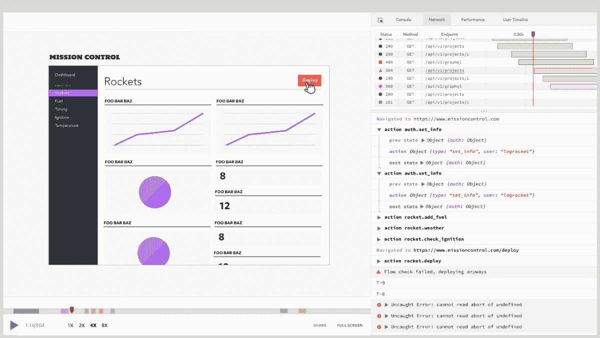

# 不要再用无限滚动建网站了！- LogRocket 博客

> 原文：<https://logrocket.com/blog/infinite-scroll/?utm_source=wanqu.co&utm_campaign=Wanqu+Daily&utm_medium=website>


TL；DR:虽然无限滚动确实在某些情况下提供了一个解决方案，但对用户来说可能不够理想。

无限滚动会让你迷失方向，T2 无法控制，T4 会让你的用户感到压力。

在这篇文章中，我们将解释为什么你需要停止建设无限滚动网站。但是首先，让我们看一下滚动的简史。

## 滚动的简史

为了理解*卷轴*到底是什么，让我们看看术语[卷轴](https://www.etymonline.com/search?q=scroll)的来源。

***卷轴(n.):*** *约 1400 年，《羊皮纸或纸卷》*

卷轴最初用于信息变得冗长时(如宗教内容)。如此多的内容变得难以管理、读取和写入。

当计算机进入我们的生活时，我们仍然需要一种浏览大量内容的方式。

### 1.行(和列)

在互联网的早期，UX 的设计师们发明/探索了许多翻页/滚动内容的方法。在网络流行之前，我们在屏幕上滚动线条。

水平滚动使滚动不仅成为阅读内容的工具，也成为在计算机屏幕上导航的一种方式。

### 2.Windows(不是操作系统)

使用滚动条浏览屏幕鼓励人们创建窗口。使用 windows，您将能够同时查看多条内容。


<noscript></noscript>

Windows 3.1 “Program Manager” has multiple scrolls.


### 3.网页

滚动解决了我们在浏览网页时遇到的一个非常基本的问题。然而，滚动会给用户带来许多问题，并且会对用户体验产生负面影响。让我们仔细看看。

## 为浏览网页而发明的体验

我将尝试定义*开发者*和*设计者*如何创造体验来导航他们网页中的用户。

让我们从学习一些后端分页系统开始:

这是最著名的分页系统。在这项技术中，首先，我们必须找出需要分页的项目数量:

```
-- All posts count
SELECT COUNT(*) AS total FROM posts
```

清点完所有项目后，我们必须计算页数。让我们假设每页显示`10`个项目:

```
-- First page items
SELECT * FROM posts LIMIT 10
```

如果我们想跳到第`3`页，我们需要使用`OFFSET`跳过第`30`项:

```
-- Third page items
SELECT * FROM posts LIMIT 10 OFFSET 30
```

我们将向客户端发送分页信息，如下所示:

```
{
  "pagination": {
    "items_count": 100,
    "current": 3,
    "total_pages": 10
  },
  "items": [...]
}
```

### 基于偏移量的分页的利与弊

*   **👍**好:容易跳转到任何页面
*   👍好:客户端体验更自由
*   **👎**不好:性能问题
*   **👎**错误:如果数据发生变化，可能会显示重复项目

大数据很难计算表的数量，因为它在不断增长(想想 Twitter)。因此，开发人员想出了更新的技术来对数据进行分页:**游标。**

每一行都必须有唯一的游标。您不必计算整个表格，这样就不可能知道实际的页数:

```
-- Get extra 1 item to get its cursor.
SELECT * FROM posts ORDER BY id DESC LIMIT 11
```

假设每篇文章都有一个惟一的光标字段(或本例中的 ID)来帮助分页。客户端将具有如下分页信息:

```
{
  "pagination": {
    "next": 1234 
  },
  "items": [...]
}
```

您可以使用光标进入下一页:

```
-- Offsetting records using 1234 cursor
SELECT * FROM posts WHERE id >= 1234 ORDER BY id LIMIT 11
```

### 基于光标分页的利与弊

*   **👍**好:更高的性能，无表计数
*   👍好:如果有人在表格中央插入一行，则不可能显示重复的项目
*   👎不好:无法跳转到任何页面
*   👎坏:客户不自由的经验，总页数和当前页不计算在内

让我们来看看一些导航技术。

### 下一个和上一个

**体验:**点击型

**技术:**基于偏移量还是基于光标

这主要用于导航博客。这是最古老的无限滚动版本。使用这种方法，用户可能不知道内容在哪里结束。


<noscript></noscript>

WordPress pagination.


**体验:**点击型

**该技术:**基于偏移

这是最有用的导航类型。它使用基于偏移的分页，允许您跳转到您想要的页面，或者只需单击一下就可以跳到结尾或开始。


<noscript></noscript>

Bootstrap styled pagination bar examples.


谷歌在搜索结果中使用这种导航:


<noscript></noscript>

Google’s pagination.


### 加载更多

**体验:**点击触发式

**技术:**基于光标— *也可以基于偏移，但会很笨拙*

这是最新的分页技术之一，它也使用了以前版本的无限卷轴。


<noscript></noscript>

A “Load more” button.


在上面的例子中，用户点击“加载更多”按钮来查看更多内容。

**体验:**滚动式

**技术:**基于光标— *也可以基于偏移，但会非常笨拙*

无限滚动是基于光标的分页技术的最新体验。

> ***休·e·威廉姆斯**自称 [**他于 2005 年在微软**上发明了无限卷轴。](https://hughewilliams.com/2012/03/06/ideas-and-invention-and-the-story-of-bings-image-search/)*

> *[**Metafizzy**](https://github.com/metafizzy/infinite-scroll) 也创造了一个帮助开发者构建无限卷轴的工具。*


<noscript></noscript>

Infinite scrolling makes users scroll the page to the infinity.


到此为止，我们已经回顾了我们是如何走到这一步的。现在我们来谈谈为什么这里这么烂。

页脚是一个非常基本的网页解剖单位，就像页眉一样。网站在页脚保留一些详细信息和链接，如电话号码、地址以及帮助和支持链接。如果用户正在搜索这些详细信息，他们通常会向下滚动来找到页脚。

* * *

### 更多来自 LogRocket 的精彩文章:

* * *

对于无限滚动，用户可能很难找到页脚。无限滚动使得不可能找到页面的结尾。不能到达一个网站的底部会让用户有压力(这并不好)。

具有无限提要的网站(如 Twitter)解决了页脚问题，将所需信息和链接放在侧边栏中。侧边栏是这个问题的解决方案，但不是一个好的解决方案。页脚应该留在页脚。


<noscript></noscript>

Twitter’s footer on the right sidebar.


社交媒体应用需要时间。用户的意图是浏览过去。在这种情况下，无限滚动使导航更容易。在这里，无限滚动有利于提高性能，尤其是在移动设备中。

但是如果你有一个电子商务、新闻、杂志或博客网站，而用户的意图是在项目或文章周围移动，无限滚动就成了他们的噩梦。在基于时间线的列表中，人们通常不会寻找一个日期或独特的时刻。在基于项目的列表中，用户希望找到一个项目。无限滚动让你的用户几乎不可能找到你的项目。

### 给用户更多的控制权

当用户感觉他们不能控制 ui 时，他们通常不喜欢它。

滚动事件并不是有意要做什么。人们浏览页面，如果他们想调用一个动作，他们通常点击或触摸(称为触发器)。他们通知 UI 他们的决定。但是滚动是在没有任何决定的情况下触发的。

无限滚动使得用户很难控制页面。用户也可能遇到跳跃故障。

而不是无限滚动，放一个“加载更多”按钮，这是一个触发器。这将把控制权交给用户。(我更喜欢老式的编号分页，但我们假设现在使用基于光标的分页)。

### 允许用户去他们想去的任何地方

人们在页面间导航，给其中一些做书签，与朋友分享页面，等等。

然而，无限卷轴不能通过其设计来保持状态。用户无法共享他们的当前状态，这也意味着您无法使用分析工具跟踪用户的行为。

如果您的后端分页技术是基于光标的，那么几乎不可能允许您的用户去任何地方。如果你有一个电子商务网站，给用户导航到他们想要的产品的控制权。

此外，如果您的列表中有“排序”功能，您必须向用户显示分页。在一个按字母顺序排列的列表中，你不能强迫用户向下滚动到以 k 开头的产品。他们会被这种体验弄疯的。

你应该允许用户看到他们在哪里。用户滚动一段时间，因为这是一个无状态的设计，他们不知道“下一页”加载了多少次。当他们刷新页面时，他们会一直重置回原始页面。然后，用户必须向下滚动才能找到他们之前所在的位置。

## 结论

无限卷轴在少数情况下很好，但它们通常不是问题的解决者，而是问题的制造者。UX 人不应该认为无限滚动是解决他们分页问题的灵丹妙药。停止用无限滚动建立网站。

## [LogRocket](https://lp.logrocket.com/blg/signup) :全面了解您的网络和移动应用

[

<noscript></noscript>](https://lp.logrocket.com/blg/signup) 

LogRocket 是一个前端应用程序监控解决方案，可以让您回放问题，就像问题发生在您自己的浏览器中一样。LogRocket 不需要猜测错误发生的原因，也不需要向用户询问截图和日志转储，而是让您重放会话以快速了解哪里出错了。它可以与任何应用程序完美配合，不管是什么框架，并且有插件可以记录来自 Redux、Vuex 和@ngrx/store 的额外上下文。

除了记录 Redux 操作和状态，LogRocket 还记录控制台日志、JavaScript 错误、堆栈跟踪、带有头+正文的网络请求/响应、浏览器元数据和自定义日志。它还使用 DOM 来记录页面上的 HTML 和 CSS，甚至为最复杂的单页面和移动应用程序重新创建像素级完美视频。

[Try it for free](https://lp.logrocket.com/blg/signup)

。

* * *

