# 栈溢出长大后想成为什么？

> 原文：<https://blog.codinghorror.com/what-does-stack-overflow-want-to-be-when-it-grows-up/?utm_source=wanqu.co&utm_campaign=Wanqu+Daily&utm_medium=website>

我有时会被现实世界中的普通人问及我以什么为生，以下是我的 15 秒回答:

> 我们为计算机程序员建立了一个类似维基百科的网站来发布问题和答案。叫做[栈溢出](https://stackoverflow.com)。

截至上个月，我和 Joel Spolsky】开始堆栈溢出已经 10 年了。我现在在做[的其他东西](https://blog.codinghorror.com/civilized-discourse-construction-kit/)，我从 2012 年就开始做了，但如果我死后会因什么而出名，显然这将是一个不错的老堆栈溢出。

在这里，我通常会继续谈论堆栈溢出有多棒，以及作为创始人我有多棒，等等。

[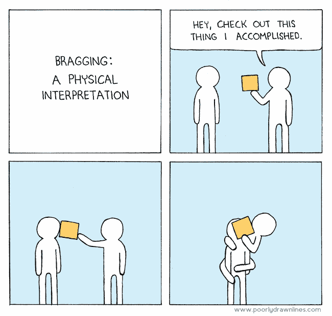T2】](http://www.poorlydrawnlines.com/comic/bragging/)

我不在乎这些。

不过，我真正关心的是*栈溢出对工作的程序员是否有用*。让我们来看看[我的偶像之一](https://blog.codinghorror.com/you-dont-need-millions-of-dollars/)，约翰·卡马克。从我认为是当今最伟大的程序员之一的角度来看，堆栈溢出有多有用？

我不会说谎，2013 年 9 月 17 日是一个非常好的日子。当我读到这句话的时候，我真的打了个寒颤，这不仅仅是因为我总是从卡尔·萨根的声音中读出“数十亿”这个词。这也是令人愉快的相反，几乎每隔一天我就在推特上浏览一个压抑的、没完没了的人类苦难和人们互相尖叫的故事。这提醒了我，我应该[查看一下我的推特](https://twitter.com/codinghorror)，看看今天网上还有谁错了。

栈溢出为整整一代程序员打开了公共事业的大门，这让我既荣幸又谦卑。但是*我没有那么做*。

*   *你*做了，当你对栈溢出贡献了一个经过充分研究的问题。
*   *你*做到了，当你对栈溢出贡献了一个简洁明了的答案。
*   *你*做了，当你在栈溢出上编辑一个问题或答案使它更好的时候。

所有这些由来自世界各地的工作程序员共同贡献的“有趣大小”的问答单元最终建立了一个[知识共享资源](https://wiki.creativecommons.org/wiki/Case_Studies/StackOverflow.com)，在我们的领域内真正与维基百科匹敌。那是...实际上，难以置信。

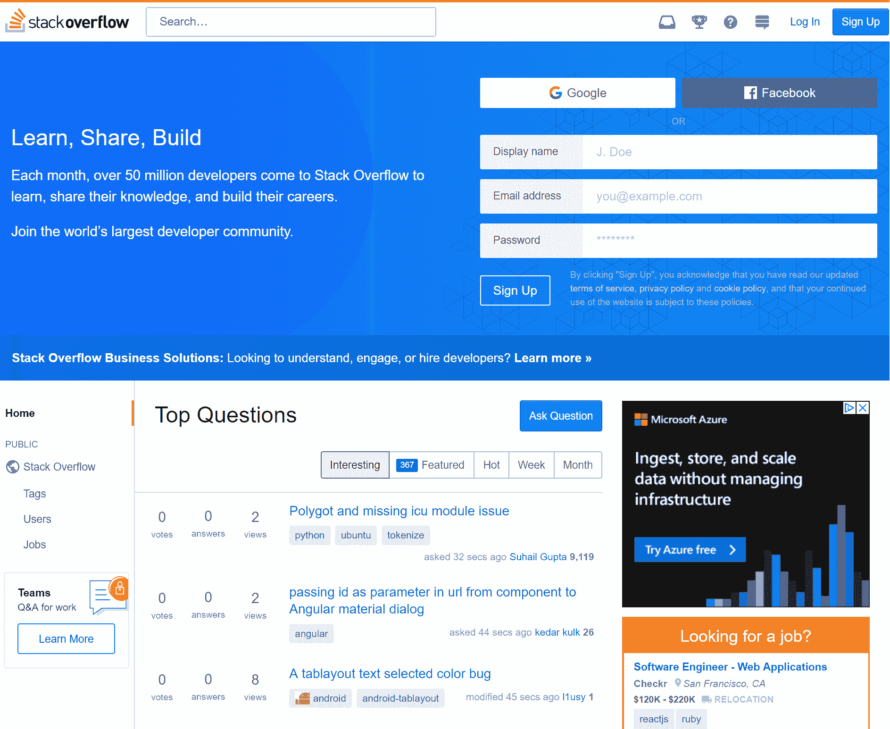

但是成功的故事很无聊。这个世界上到处都是幸运的人，他们不停地告诉人们这一切都是他们的努力和莫邪成就的。我发现失败更有教育意义，当建立企业和规划未来时，我扮演 Abyss Domain Expert 的角色，开始一场凝视比赛。这只是我喜欢做的一件小事，你知道吗...*对我来说*。

[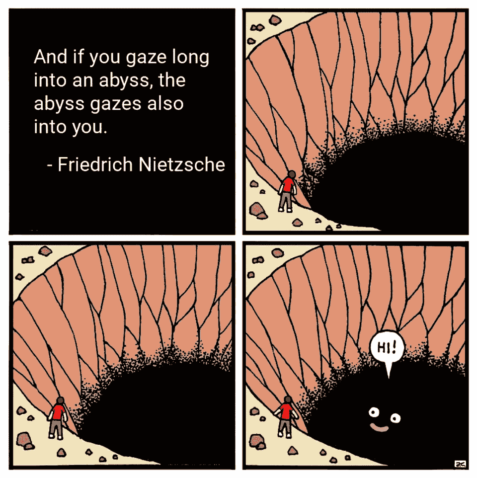T2】](https://www.reddit.com/r/comics/comments/8a4c2h/abyss_oc/)

因此，我现在想做的是凝视那辉煌的深渊一会儿，反思一下我看到的未来 10 年堆栈溢出所面临的挑战。在我开始之前，我确实想对几件事情非常清楚:

1.  自 2012 年 2 月以来，我再也没有以任何身份在 Stack Overflow 工作过，从那以后，我几乎没有任何日常操作输入，这是我自己的选择。我对事情应该如何做有意见吗？呃，你见过我吗*？*我会时不时地给人们发电子邮件表达我的观点吗？我可能会，但老实说，我会尽量减少，我认为我的电子邮件存档记录是合理的。

2.  在 Stack 工作的人非常棒，他们中的大多数人(包括 Stack Overflow 社区的大部分人，当我在那里的时候)能够比我离开的时候更好地阐述使命——也许还没有那么暴躁。我会把生命托付给他们吗？不。但我会把乔尔的性命托付给他们！

3.  堆栈溢出练习的全部意义在于，它不依赖于我、乔尔或任何其他伟大的人。堆栈溢出之所以有效，是因为它赋予了全世界普通的日常程序员力量，就像你，就像我一样。我想在我看来这就像是为人父母。我们的目标是让你的孩子最终健康成长，成为不再需要(或者说，*真的希望*你在身边)的成年人。

4.  了解你正在阅读的内容~~弱意见强烈持有~~ [强意见弱持有](https://blog.codinghorror.com/strong-opinions-weakly-held/)一位联合创始人在 Stack Overflow 的前四年花了大量时间与社区合作，以制定网站的规则和规范来满足他们的需求。这些仅仅是我的观点。我喜欢认为它们是*有见识的*观点，但这并不一定意味着我能预测未来，或者我甚至有资格去尝试。但我从未让“合格”阻止我做任何事，今晚我也不会开始。

### 堆栈溢出首先是一个 wiki

栈溢出最终与维基百科有更多的共同点，而不是一个论坛。我的意思是关于堆栈溢出的问题和答案主要不是根据它们对特定个人的有用性来判断的，而是根据**有多少*其他*程序员随着时间的推移这些问题或答案可能会有所帮助**。从 2008 年发布日起，我就尽我所能强调这种关系。请注意维恩图中谁的账单最高。

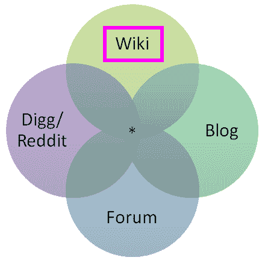

Stack Overflow 后来增加了一个非常简洁的功能，在用户资料中突出了这一核心价值，它显示了到目前为止，你贡献的问题和答案潜在地帮助了多少人。

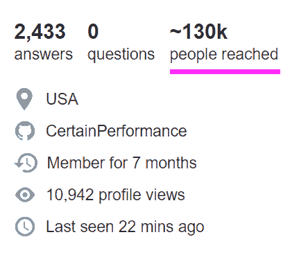

我看到的关于堆栈溢出的最常见的抱怨通常是这种基本误解的结果，这种误解是关于网站上的问题和答案最终是谁对的*，以及为什么在整个过程中涉及如此多的严格性。*

我不断地惊讶于许多人，甚至在今天的黑客新闻上，他们没有意识到每一个问题和答案在栈溢出时都是可编辑的，即使是作为一个完全匿名的没有登录的用户。这是有道理的，对吧，*因为栈溢出是一个 wiki* ，这就是 wiki 的工作方式。任何人都可以编辑它们。来吧，如果你不相信我，现在就试一试——在任何可以改进的地方按下“改进这个答案”或“改进这个问题”按钮，并做到这一点。

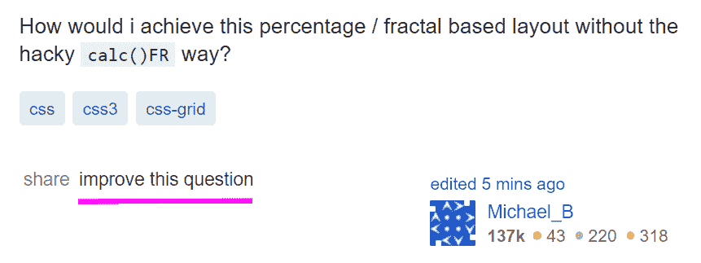

这种误解的责任完全在于栈溢出(我指的也是我自己，至少直到 2012 年)。我猜逻辑是“到现在为止，10 年来，每个程序员都肯定见过、使用过并理解堆栈溢出”，但是...我认为这是一个冒险的假设。每天每一秒钟都有新的程序员诞生。更复杂的是，堆栈溢出有三层用法，从最大到最小，呈倒金字塔式:

1.  **我被动搜索编程答案。**

    被动地搜索和阅读出现在 web 搜索结果中的高排名堆栈溢出答案可以说是堆栈溢出的主要目标。如果堆栈溢出像它应该的那样工作，98%的程序员应该从阅读搜索结果页面中获得他们需要的所有答案，并且在他们的整个职业生涯中不需要问或回答一个问题。这是好事！甚至很棒！

2.  当我遇到一个非常棘手的问题，而搜索又无济于事时，我就会参与堆栈溢出。

    只在你特别困的时候参与是完全有效的。然而，我觉得这一层是大多数人在栈溢出问题上容易遇到困难的地方，因为它涉及到的人可能对栈溢出本身并不陌生，但对提问来说是个新手，而且对他们来说也是在压力和紧张的精确时刻，他们*必须*由于他们面临的问题而得到答案…他们没有时间或倾向于处理栈溢出对研究工作、格式、展示以前的工作以及引用他们在以前的搜索中发现的内容的严格的 wiki 类型要求。

3.  为了职业发展，我参加了 Stack Overflow。

    在这个层次上，你谈论的是有经验的堆栈溢出用户，他们贡献了许多答案，因此对什么是一个好问题有很好的想法，那种他们想要自己回答的问题。因此，他们不会问很多问题，因为他们通过彻底的搜索和研究进行自我治疗，但当他们问一个问题时，他们的问题是典型的。

(从技术上来说，这里有第四层，是为那些想无私地贡献知识共享问题和答案的人准备的，以推动整个软件开发领域向前发展，造福下一代软件开发人员。但是谁有时间给圣人😇你们让我们其他人都很难看，所以别闹了，斯基特。)

如果人们在第一层快乐地度过了*年*，然后在到达第二层时得到一个不愉快的惊喜，我一点也不会感到震惊。在我看来，处理这个问题的主要地方是一个**大规模修改和改进的 ask page** 。同样值得注意的是，人们可能不明白，当问一个关于堆栈溢出的问题时，他们通过隐含地承诺“努力确保它对更多人有用，而不仅仅是你自己”的 wiki 标准，签署了一份相当大的工作，然后对其他人认为没有充分研究的问题的负面反应感到厌恶。

Stack Overflow 吸收了大量采用 wiki 内容标准带来的压力。即使你事先知道这个要求，也不总是清楚“有用”是什么意思，同样，也不总是清楚什么主题、什么人和什么地方值得拥有维基百科页面。海里埃塔·拉克丝，绝对的，但是你在奥马哈的表弟戴夫和他古怪的 PHP 5.6 版本呢？

### 随着时间的推移，复制品变成了巨大的雷区

这里有一件事[我真的真的预见到了](https://stackoverflow.blog/2009/04/29/handling-duplicate-questions/)的到来，老实说，我有点高兴我在 2012 年离开了，之前我不得不处理它，因为它涉及到令人难以置信的技术难度:**重复**。在我听到的所有关于堆栈溢出的抱怨中，这是我迄今为止最同情的一个。

如果你接受 Stack Overflow 是一个 wiki 类型的系统，那么出于同样的原因，你显然不能在 Wikipedia 上有五篇不同的关于意大利的文章， **Stack Overflow 不能允许关于完全相同的编程问题的重复问题**。当人们键入问题时，有相当多的代码可以进行先发制人的搜索，再加上*许多*劝告在你提问之前搜索，在你问第一个问题之前，在你看到的强制页面上有一个诱人的搜索栏和按钮...

[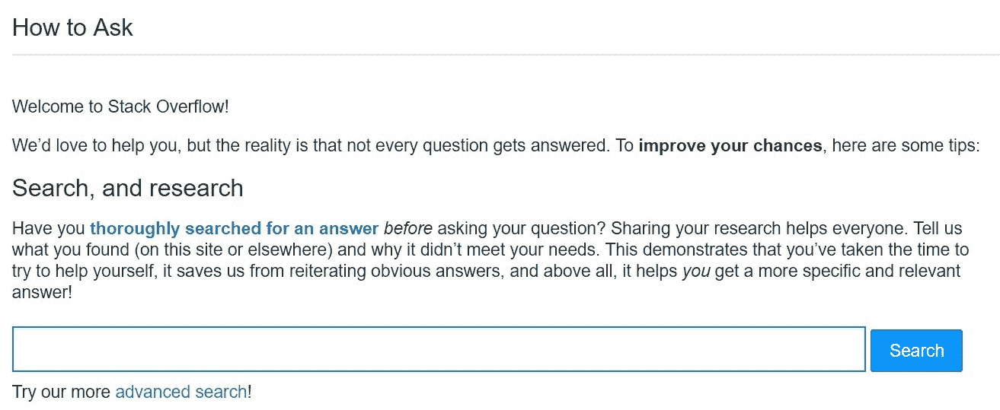T2】](https://stackoverflow.com/questions/ask/advice)

...定位和识别重复内容是一个非常困难的问题，即使对于像谷歌这样的公司来说也是如此，它已经专门研究这个问题 20 年了，拥有一支名副其实的世界上最有才华的工程师队伍。

当你在一个不允许重复提问的网站上提问时，一个有 100 万个问题的网站的问题空间与一个有 1000 万个问题的网站的问题空间是完全不同的...或者一亿。问一个独特的问题从轻度困难到几乎不可能完成的任务，因为你的问题需要在这个巨大的现有技术问题领域中穿过一条狭窄的路径，而不要在这个过程中踩到任何看起来模糊相似的地雷。

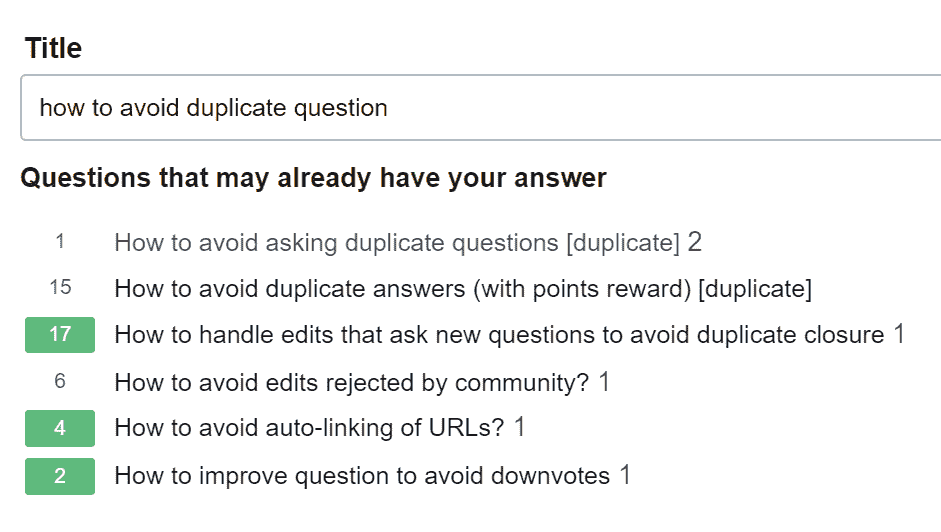

但是等等！越来越难了！

*   相似问题中的一些差异是可以的，因为 10 个不同的人会用 10 组完全不相关且没有重叠的词来问一个几乎相同的问题。我知道，这听起来很疯狂，但是相信我:人类在这方面是惊人的。我们希望所有这些重复的问题都存在，这样他们就可以*指向*他们重复的主要问题，同时仍然是那些用不寻常或罕见的词提问的人的有效搜索目标。

*   很难确定你的问题是否真的是重复的。在一个编程问题成为另一个的重复之前，有多少重叠是足够的？谁下的定义？众说纷纭。这取决于人类的解释，而人类是..不靠谱。没有人会对这个系统完全满意，很大程度上是设计使然。这种紧张感是永久的，永远的。

对于重复的问题，我没有任何真正的答案，随着时间的推移，这个问题只会变得更糟。但是我要指出的是，在 Stack Exchange network 上有很多先例[将站点划分为规则集略有不同的“专家”和“初学者”区域。我们已经在数学与数学溢出、英语与英语学习者、Unix 与 Ubuntu 中看到了这一点...**也许是时候让更多初学者关注堆栈溢出了**，在这里重复不那么令人不快，对话规则也稍微宽松一些？](https://stackexchange.com/sites#traffic)

### 栈溢出是同行评议的竞争体系

堆栈溢出确实是一个相当有竞争力的系统，但有一点需要注意的是“总有不止一种方法可以做到这一点。”这个设计选择是基于我多年的观察，激励任何程序员的最佳方式..巧妙地暗示*另一个*程序员可能会做得更好。

[T2】](http://www.geekherocomic.com/2008/11/14/the-best-way-to-improve-code-performance/)

这体现在 Stack Overflow 上的公共声誉系统中，一个数字的[不可思议的力量印在某人的名字](https://blog.codinghorror.com/for-a-bit-of-colored-ribbon/)旁边，放大显示。栈溢出中所有的声誉都来自于同行的认可，从来不是“体制”。

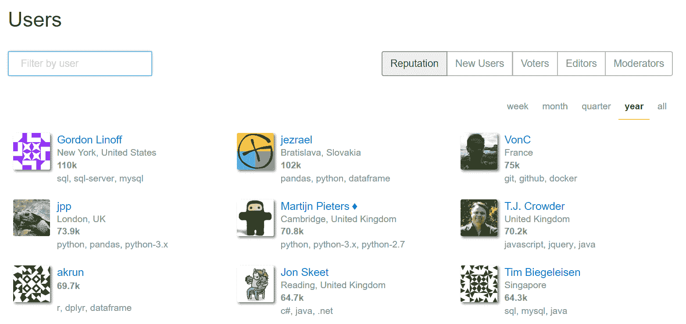

一旦你的问题被提出，或者你的答案被发布，它就可以被你的同事戳、戳、编辑、标记、关闭、打开、向上投票、向下投票、[折叠和旋转](http://www.cs.mun.ca/~harold/Courses/Old/CS1400.W15/Diary/Lubar1992.pdf)。*的意图*是让 Stack Overflow 成为一个同行评审和友好竞争的系统，就像来自你在公司不同部门从未见过的同事的代码评审。一个程序员同事质疑你的问题的前提也是完全公平的，只要用一种很好的方式。例如，[你*真的*想用那个正则表达式来匹配 HTML 吗？](https://stackoverflow.com/questions/1732348/regex-match-open-tags-except-xhtml-self-contained-tags)

我完全承认**竞争性同行评审系统并不适合所有人**，因此让同行评审你的问题的整个过程可能并不总是感觉很好，这取决于你在该领域的情况和背景——尤其是*当与围绕实用程序的巨大压力和已经从其维基元素吸收的重复堆栈溢出相结合时。有点双重打击。*

 *我听说有人把在 Stack Overflow 上提问的过程描述为焦虑诱导。对我来说，在 Stack Overflow 上发帖*应该*包含一种健康的轻微“让我一定要展示我最好的作品”焦虑:

*   给你的同事做报告的焦虑
*   对考试取得好成绩的焦虑
*   和你欣赏的有才华的同事一起去新工作的焦虑
*   第一天和和你同龄的学生一起上学的焦虑

我想象着一个没有焦虑的系统，我只能想到那些我很久以前就不再关心工作的工作，因此对于我是否在任何一天去上班都没有焦虑。这怎么可能是好事呢？只能说我不是零焦虑系统的粉丝。

也许竞争并不适合你。会不会有一个竞争不那么激烈的问答系统，一个没有反对票的系统，一个没有票数接近的系统，在这个系统中，永远不会对发布任何东西感到焦虑，只是一个超级支持你的人的网络，他们相信你，希望你无论如何都能成功？绝对的！我认为互联网上应该有许多可供选择的网站，这样人们就可以选择符合他们个人喜好和目标的体验。堆栈应该构建替代方案吗？已经建好了吗？这是个悬而未决的问题。请在评论中随意指出例子。

### 堆栈溢出是为有经验的程序员设计的

另一个令人困惑的地方是栈溢出的目标受众是谁。这一点很简单，从第一天开始就是如此:

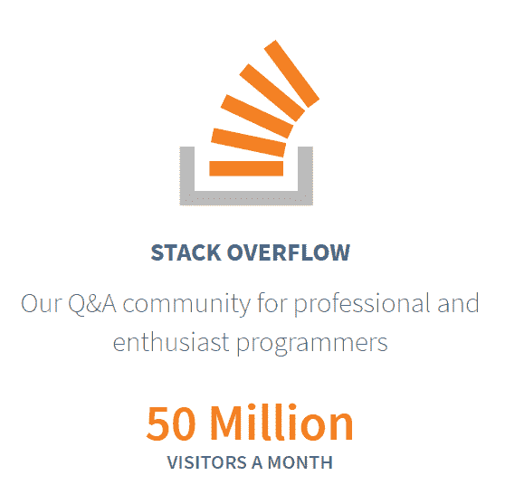

面向**专业和狂热程序员**的问答。我们的意思是

> 已经有一份程序员工作的人，或者如果他们想成为程序员的话，有可能被雇佣的人。

是的，如果你想知道，这部分是一个公开的商业决定。要想赚钱，你必须拥有一群拿着程序员薪水的人，或者正在找工作想成为程序员的人。整个 Stack Overflow 网络可能是 Creative Commons 许可的，但它从来不是一个非营利的游戏。它从一开始就被规划为一项可持续发展的业务，这就是为什么我们在 Stack Overflow 事件发生一年后就推出了 Stack Overflow Careers...老实说，回想起来，比我们应该做的要早得多。职业生涯已经被聪明地归入 stackoverflow.com/jobs[的 Stack Overflow proper，以获得一个更加完整、肯定比 2009 年更好的体验。](https://stackoverflow.com/jobs)

观众的选择并不意味着以任何方式进行排斥性的决定，但 Stack Overflow 绝对是作为一个相当严格的同行审查系统而设计的，这对于已经从业的专业人士来说是很好的(显然是 IMNSHO)，但几乎是你作为学生或初学者想要的一切*而不是*。这就是为什么当 Twitter 上的人提到他们已经指出他们的学生堆栈溢出时，我非常害怕，几乎把自己翻了个底朝天。对于编程领域的初学者或学生来说，你想要的几乎是与堆栈溢出完全相反的*:*

*   一对一指导
*   实时协作屏幕共享
*   在线聊天
*   理论和背景课程
*   初学者任务和练习
*   进行实验的游乐场

这些都是非常好的事情，但是堆栈溢出从设计上来说并没有做到这些。

*能否*利用堆栈溢出从基本原理开始学习编程？嗯，从技术上讲，你可以用任何软件做任何事情。如果你是受虐狂，你可以尝试在 Reddit 上进行真正的对话。但答案是肯定的。从理论上来说，如果你是一个对轻度竞争方面(声誉、成交、否决)感到舒适的天才，并且完全愿意根据对他人的效用来定义你对网站的所有贡献，而不仅仅是你自己作为一个试图学习东西的学生，你可以学习如何在栈溢出上编程。但是我*不会推荐它。T4 有更好的网站和系统来学习成为一名程序员。堆栈溢出能像这样构建初学者和学生友好的系统吗？我不知道，当然也不是我说了算。🤔*

仅此而已。我们现在可以继续正常的非深渊凝视。或者在这个时代被视为正常的东西。

我希望这一切不会给人以负面的印象。总的来说，我认为筹码数量非常多。但是我怎么想重要吗？2008 年是这样，2018 年也是这样。

> **栈溢出的是*你*。**
> 
> 这是可怕的部分，堆栈溢出是基于信念的巨大飞跃:信任你的程序员同事。选择参与堆栈溢出的程序员是让它发挥作用的“秘方酱”。你是我继续相信开发者社区是学习和成长的最大源泉的原因。你是我不断收到如此多关于堆栈溢出的正面电子邮件和推荐的原因。这不是我的功劳。但是你可以。
> 
> 很久以前，我在撰写关于编程恐惧的文章时，就了解到了我的程序员同事们的集体力量。这个社区比我聪明得多。我所能要求的——我们所有人所能要求的——就是在这条道路上互相帮助。
> 
> 如果你的程序员同事决定为此认可你，那么我说你完全值得。

栈溢出的强度始于并止于为站点提供动力的[程序员社区。栈溢出长大后应该是什么样的？**无论我们做什么，一起。**](https://meta.stackoverflow.com/)

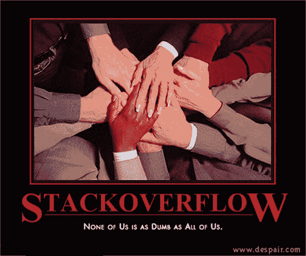

p.s .十周年快乐堆栈溢出！

* * *

<small>也可以看乔尔的《10 年栈溢出》[《栈溢出时代》](https://www.joelonsoftware.com/2018/04/06/the-stack-overflow-age/)[《游戏化的一点灰尘》](https://www.joelonsoftware.com/2018/04/13/gamification/)，[奇怪而令人抓狂的规则](https://www.joelonsoftware.com/2018/04/23/strange-and-maddening-rules/)。</small>* 