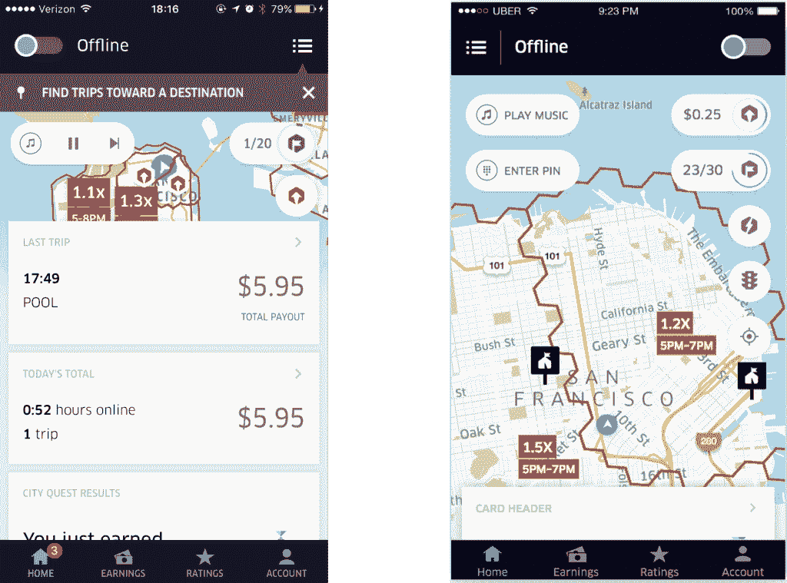

# 为什么我们决定重写优步的司机应用程序|优步博客

> 原文：<https://eng.uber.com/rewrite-uber-carbon-app/?utm_source=wanqu.co&utm_campaign=Wanqu+Daily&utm_medium=website>

*本文是[系列](https://eng.uber.com/tag/carbon/)的第一篇，报道了优步的移动工程团队如何开发我们最新版本的司机应用，代号为 Carbon，是我们拼车业务的核心组件。在其他新功能中，该应用程序可以让我们超过 300 万的司机伙伴找到票价，获得方向，并跟踪他们的收入。我们在 2017 年开始结合我们的司机合作伙伴的反馈设计新的应用程序，并在 2018 年 9 月开始投入生产。*

【2017 年初，优步决定重写我们的司机应用。StackOverflow、的首席执行官乔尔·斯波尔斯基曾将这种决策称为“任何软件公司都会犯的最严重的战略错误”

重写风险极高，耗费大量资源，而且需要很长时间才能给用户带来切实的好处。对于这一特定的重写，数百名工程师以某种身份做出了贡献，更不用说设计师、产品经理、数据科学家、运营、法律和营销人员了。实际上，我们的重写花了一年半的时间来实现并在全球推广。

我们的案例是所有组织中的工程师都面临的一个问题的极端例子。如果你是一家初创公司的工程师，正在考虑重写一些代码或功能，你可能会问:“我们正在燃烧多少跑道？”如果你在一个大型组织的一个小团队中工作，你可能会问，“这些变化值得我们不去构建的特性吗？”一个好的工程师和好的团队在接受重写的挑战之前会考虑这些更广泛的问题。

因此，虽然重写 *流程* 涉及许多重要的技术决策(将在以后的文章中讨论)，但是 *重写决策* 涉及技术考虑和更广泛的业务关注的组合。虽然这些问题很难回答，但对上述问题的好答案将有助于你证明对你的组织或团队进行重写的合理性。

最终，这些决定不是在真空中做出的。我们做出重写应用程序的决定，并不是因为理论架构的考虑(“我们的代码可能会更好，如果我们……”的话)，而是因为一个密集的、为期三个月的研究过程，涉及数百页的文档和广泛的、跨组织的认同。在接下来的章节中，我们将讨论我们重写优步驱动程序的决定以及我们在这个过程中的发现。

## 设置舞台

简单地认识到对新架构的需求，并不总是自然而然地产生重写的需求。重写是昂贵的，虽然工程组织经常想要重写代码，但是工程师的时间上还有其他需求，不涉及用更闪亮的架构网格一遍又一遍地重写相同的特性。对于驱动程序来说，有三个趋势帮助推动了重写的决定:

### 技术债务

首先，司机应用程序本身存在真正的技术债务。这一债务是优步快速增长以及产品需求变化的结果(将在下一节讨论)。除此之外，技术债务来自于对 修复以前的技术债务 的渴望:应用程序本身陷入了多次正在进行的迁移，这使得功能看起来越来越复杂。

另外值得指出的是，当时存在于驱动程序中的技术债务并不是理论上的。我们看到了持续停机和维护成本对开发人员工作效率造成的实际业务影响。2016 年底，我们不得不暂停应用程序的开发，以修复多个功能退化。在我们解决这些问题之前，实现和推出新功能都变得很困难。

我们的司机应用程序的任何中断都是一个巨大的问题，因为用户依赖这个应用程序谋生。在我们的世界里，任何低于 99.99%的正常运行时间都是不可接受的，但是我们经常发布在应用的核心流程中经历重大倒退的版本

### 产品挑战

我们在之前版本的驱动程序应用中面临的最大问题之一是，该产品不能很好地适应新的业务用例。虽然优步的司机应用程序的最早版本是为简单的 UberX 旅行设计的，但我们的服务已经发展到包括优步拼车、Uber Eats，以及特定市场的体验，如现金支付的旅行等。

除了出行，我们发现司机还需要额外的功能来管理自己的财务和个人业务。例如，收入和评级透明度对司机体验至关重要，而这一点在优步司机应用的早期迭代中投资不足。当我们扩展产品体验时，我们需要为这些功能提供空间。

Figure 1: In our previous driver app, tabs at the bottom became stretched beyond their original intention (left). The map display also became overloaded with overlays and annotations for features we didn’t initially forecast (right).

我们在 2015 年和 2016 年采取了一些初步措施来缓解这些担忧，发布了应用程序的迭代版本。不幸的是，我们已经将 UI 的各个部分分开，让不同的团队来构建，而不是围绕驱动程序需求和工作流程来设计。如果你在这个时候看我们的用户界面，你会看到一个收入标签，一个评级标签，一个设置标签，以及一个主页标签。每隔一个功能的桶变得更大，收入和评级标签经常被重新用于它们最初没有被设计的功能。

我们从这款应用的迭代中吸取的经验教训，以及我们的长期产品愿景，实际上已经促使我们完全重新思考驱动程序应用应该如何寻找我们的驱动程序合作伙伴。即使一个 *改写* 不是必然的，一个 *重新设计* 才是。

### 工程对准

我们的工程团队之前投资了一个新的方向。特别是，随着 2016 年对骑手应用程序 的 [重写，我们引入了新的移动架构，我们称之为](https://eng.uber.com/new-rider-app/) [肋骨](https://github.com/uber/RIBs/wiki) (对 [毒蛇](https://github.com/MindorksOpenSource/iOS-Viper-Architecture) 的变体)，以帮助我们应对不断增长的规模。它为我们在驱动程序中认识到的大多数问题提供了解决方案:一个可扩展扩展点的框架，一个令人信服的应用程序结构，以及一个有说服力的内存管理模型。我们在 2017 年向开源社区发布了 RIBs 架构。

虽然 RIBs 架构确实改进了我们的 rider 应用程序，但它也代表了我们移动组织的一个新的工程方向。我们核心平台组的未来投资将主要涉及对 RIBs 的改进。支持具有不同架构的多个应用程序将比在 RIBs 上实现标准化更加昂贵。

## 做出我们的决定

鉴于 UI 重新设计和新架构的背景，我们基本上有三种不同的选择:重新设计不带 rib 的驱动程序；将现有驱动程序迁移到 RIBs 架构；或者基于排骨对 app 做一个完整的重写。

### 无肋建筑

我们看到的第一种方法是没有 肋骨的重新设计。我们首先考虑这一点的原因是，我们知道迁移到 RIBs 将是资源密集型的。RIBs 提供了许多新的库，但也提供了一种新的方法来构建具有分层作用域结构的应用程序，这种结构将业务逻辑与表示逻辑相分离。RIBs 架构提供了一个雄辩的，但是非常固执己见的内存管理系统。

首先，我们考虑现有的应用程序是否能够处理我们正在考虑的主要产品变更。我们发现，因为我们的应用程序支持对 [视图控制器包容](https://www.objc.io/issues/1-view-controllers/containment-view-controller/) 的轻微改变，我们的许多业务逻辑与视图表示紧密耦合。这意味着 UI *的重新设计* 无论如何都不可避免地会涉及到业务逻辑的大量更改。

其次，如前所述，现有驱动程序应用程序体系结构存在一些需要解决的问题。这些问题在一定程度上与应用程序的逻辑有关，在某些地方(特别是在 Android 上)，这种逻辑演变成了一种移动开发人员非常常见的模式:一种不同版本的 MVC，一个 Massive View Controller，我们的大部分核心代码都包含在一个数千行的 Controller 文件中。因此，我们不愿意去 bat 为现有的移动架构，这是越来越复杂和难以发展。

最后，即使我们以前的驱动程序架构非常完美，从战略角度来看，采用 RIBs 来避免我们在优步分裂应用架构的情况仍然是有意义的。有了单一的 cogent 架构，我们的平台级投资变得两倍有价值，并且在组织的一个部分(例如，rider)中编写的代码可能在另一个部分(例如，driver)中重用。

如果我们无论如何都要收养肋骨，我们该怎么做呢？

### 迁移

许多组织喜欢谨慎的迁移，允许他们在系统底层架构改变时继续特性开发。虽然这种方法在大多数情况下完全有效，但过去我们在优步发现过一些问题。

首先，我们分析了过去几年我们在优步尝试的 10 个主要移动迁移，发现它们的不完成率很高。也就是说，我们将开始迁移一个给定的底层库，但是却不能完全迁移。新的特性是用新的库构建的，一些旧的特性被迁移了，但是我们的遗留代码仍然在代码库中执行。

经过进一步的调查，我们发现驱动程序应用程序中许多技术债务的根本原因就是这种迁移的结果。例如，我们有 [竞争条件](https://en.wikipedia.org/wiki/Race_condition) ，因为我们的应用程序发布/订阅模型在 Android 上是分支的。我们的核心应用程序结构，从利用 Android 上的片段开始，部分迁移到内部框架。这种不完全的迁移导致了适配器层和一般开发人员的困惑。这些不完整的架构最终会导致直接影响我们用户的停机。

第二，我们经常发现，迁移在发生时会造成大量的不稳定。我们经历了无数次由旨在改进底层应用程序框架(如我们的网络协议)的迁移导致的停机。从技术上来说，这些应该不会对我们的用户产生直接、切实的影响，但最终会破坏应用程序的核心功能。

最后，根据我们的经验，即使是持续功能开发的承诺也常常无法兑现。如果一个团队依赖于正在进行的迁移，那么在迁移完成之前，他们通常会被阻止。这也导致了回滚迁移通常意味着我们也必须回滚许多功能。

因此，当我们评估是否要进行完整的产品重新设计和采用 RIBs 架构时，不完全迁移或无休止的适配器层和外观会大大增加应用程序的不稳定性，这种风险太高了。

### 重写

从某种程度上来说，我们是通过否定做出这个决定的(其他选项，无 RIBs 架构和迁移是不成立的)，但是重写也有积极的好处，它增强了我们对最终决定的信心。

首先，重写将释放我们重新设计应用程序的能力，而不受对应用程序构建方式的预先定义的理解的限制。这意味着它的设计对更大范围的可能流动是开放的。

第二，选择重写应用程序意味着我们的架构会干净得多，因为它从一开始就源自一个令人信服的战略方向。如果我们选择了迁移，我们可能会被遗留的代码所困扰，这些代码是我们为了权宜或方便而重用的。

第三，重写应用程序让我们回到绘图板，更全面地思考我们希望产品朝什么方向发展。因此，应用程序中的某些主要框架最终被重写。

对于一名工程师来说，重写是一个做一些令人惊奇的工作的机会，我们很兴奋能够开始。

## 结论

值得强调的是，我们重新编写驱动程序的决定并不是基于“如果我们能从头再来会更好”的推测性想法事实上，一些工程师可能会惊讶地听到，即使经过重写，我们发布的应用程序不仅有新的功能和新的架构，甚至还有一点新的技术债务。

也就是说，你永远不会把这些事情做到完美。阅读这篇文章的工程师应该不会轻易得出“移植永远不会成功，重写会产生完美的代码”的结论相反，重要的是要认识到重写的决定是在非常有形的组织、业务和技术需求的背景下做出的。

如果我们在几个月前没有创建一个全新的移动架构，我们可能不会重写这个应用程序。如果我们没有一个产品团队愿意研究这个决定，我们可能不会重写。如果优步的移民在过去更成功，我们可能不会重写。当然，驱使我们重写的并不是重写本身就是好的，甚至不是一个好主意。

相反，驱动程序应用程序的重写是在为我们的用户构建更可靠、更强大的产品体验的背景下进行的，同时，增强了我们组织执行这一愿景的能力。这个决策过程可能没有发明下一个最佳抽象层的愿望那么令人兴奋，但它也是驱动创建一个成功的和完全改进的移动应用程序的决策演算。

#### 优步司机 app 系列文章索引

1.  为什么我们决定重写优步的驱动程序
2.  [在 RIBs 中设计优步的新驱动程序](https://eng.uber.com/driver-app-ribs-architecture/)
3.  [优步的新驱动程序如何克服网络延迟](https://eng.uber.com/driver-app-optimistic-mode/)
4.  [在妖孽中缩放现金支付](https://eng.uber.com/driver-app-cash-payments/)
5.  [如何在不影响整个业务的情况下发布应用重写](https://eng.uber.com/carbon-dual-binary-mobile-app/)
6.  [为司机构建可扩展的可靠地图接口](https://eng.uber.com/building-a-scalable-and-reliable-map-interface-for-drivers/)
7.  [工程优步信标:匹配 24 位 RGB 颜色的骑手和驾驶员](https://eng.uber.com/uber-beacon-bluetooth-mobile-app/)
8.  [为驾驶员偏好设计一个安全、可扩展且由服务器驱动的平台](https://eng.uber.com/carbon-driver-app-preferences-ribs/)
9.  [在优步的新司机应用中内置实时收入跟踪器](https://eng.uber.com/real-time-earnings-tracker/)
10.  [作为依赖的活动/服务:重新思考优步新驱动 App](https://eng.uber.com/activity-service-dependency-android-architecture/) 中的 Android 架构

*对开发下一代移动应用感兴趣？考虑* [*加入我们的团队*](https://www.uber.com/careers/list/?city=&country=&keywords=&subteam=all&team=engineering) *！T13】*

[*订阅我们的快讯*](http://uber.us11.list-manage1.com/subscribe?u=092a95bfe05dfa7c27877ca59&id=381801863c) *跟上优步工程的最新创新。T9】*