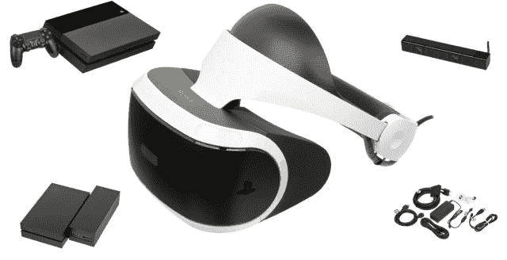
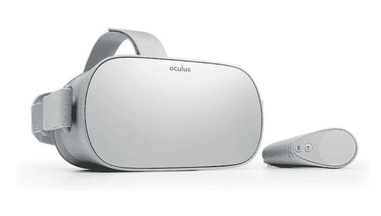

# 脸书和虚拟现实的问题——策略

> 原文：<https://stratechery.com/2018/the-problem-with-virtual-reality/?utm_source=wanqu.co&utm_campaign=Wanqu+Daily&utm_medium=website>

信不信由你，脸书实际上已经让虚拟现实变得更好了，至少从一个角度来看是这样。

我的第一台 VR 设备是 PlayStation VR，计算很简单:我有一台 PS4，没有 Windows PC，这意味着我有一台与 PlayStation VR 兼容的设备，没有一台与 Oculus Rift 或 HTC Vive 兼容的设备。

我只用了一次。

[T2】](https://i0.wp.com/stratechery.com/wp-content/uploads/2018/10/psvr2.jpg?ssl=1)

问题是，实际上连接虚拟现实耳机太复杂了，有太多的电线，而且鉴于我当时住在一个相对较小的公寓里，当我不使用它时，让整个东西都连接起来是不可行的。我终于搬到了一个新地方，但坦白地说，我不记得我是否打开了它。

今年早些时候，脸书推出了 Oculus Go。

[T2】](https://i0.wp.com/stratechery.com/wp-content/uploads/2018/10/oculus-go-lrg-1021x580.jpg?ssl=1)

这款 Go 的硬件大约相当于一款中档智能手机的水平，价格与之相当:199 美元。重要的是，它是一个完全独立的设备:不需要控制台或 PC。当然，质量没有那么好，但是方便很重要，特别是对于像我这样偶尔玩游戏或看电视或电影的人来说。穿上翼装或观看一些 NBA 集锦会令人惊讶地有趣，而且非常简单。至少只要我有这个外出的当然，还有嘱咐。很难想象还会有别的想法。

#### 虚拟现实利基

这是虚拟现实的第一个挑战:它是一个目的地，不仅是你虚拟去的地方，更重要的是，它是现实世界中深思熟虑的最终结果。一个人体验虚拟现实不是偶然的:这是一种选择，而且通常——就像我的 PlayStation VR 一样——是一种相当复杂的选择。

这不一定是个问题:去看电影是一种选择，在游戏机或 PC 上玩视频游戏也是一种选择。两者都是非常合法的赚钱方式:2017 年全球票房收入为 406 亿美元，在电影典型的发行窗口中，所有其他发行渠道都赚了数十亿美元；视频游戏早已成为一个更大的交易，去年在全球产生了 1090 亿美元。

尽管如此，这仍比智能手机等产品产生的收入少一个数量级。例如，苹果公司去年销售了价值 1580 亿美元的 iPhones 手机；2017 年，整个行业的价值约为 4787 亿美元。这种差异不应该令人惊讶:与电影或视频游戏不同，智能手机是你到达目的地途中的一个陪伴，而不是目的地本身。

乍一看，这似乎有悖常理:成为人们关注的焦点难道不是一件好事吗？然而，这个中心只能被一种东西占据，而可进入的市场受到时间的限制。假设八个小时睡觉，八个小时工作，几个小时，你知道，实际导航生活，那最多剩下六个小时去争取。这就是为什么旨在增加生活而不是取代生活的设备总是更有吸引力:一个人醒着的每一刻都值得关注。

换句话说，虚拟现实市场从根本上受到其本质的限制:因为它是对现实生活的暂时退出，而不是对现实生活的补充，所以虚拟现实的空间远不如其他任何数量的科技产品。

#### 脸书令人挠头的收购

顺便提一下，这包括脸书:社交网络的力量是违反直觉的，就像虚拟现实是违反直觉的，但方式完全相反。没人打算去脸书:我们当中有谁在日历上设定了“脸书时间”呢？然而，绝大多数有能力的人——全世界超过 20 亿人——每天都会花几分钟时间去脸书。

事实是，每个人都有大量的时间在有意的时刻之间:排队，乘坐公交车，使用洗手间。这是脸书的领域，它远比初看起来更有价值:不仅可用时间的总量比你想象的要多，而且从定义上来说，这也是人类大脑较少参与的时间；我们去脸书寻求刺激，并不太在意这种刺激是来自朋友和家人、绝望的媒体公司还是付费的广告商。他们的收入在去年达到了 480 亿美元——超过了全球票房，占视频游戏总收入的近一半。

可能让你感到惊讶的是，脸书偶然发现了这个金矿:在本世纪初，该公司拼命试图建立一个平台，也就是说，一个第三方开发者可以与客户建立直接联系的地方。这一直是硅谷远见者的既定目标，但总的来说，对平台的追求有点像颠覆性的宣言:在口头上广为流传，但在现实中却少之又少。

脸书也是如此:该公司的盈利能力和估值的大幅上升——尽管是在过去三个月——都是基于该公司*不是*是一个平台，至少不是一个面向第三方开发者的平台。毕竟，给第三方开发者空间是 T2 而不是 T3 给广告商空间，至少在移动领域是这样，而正是移动为脸书提供了填补这些空白的平台。[正如我在 2013 年](https://stratechery.com/2013/mobile-makes-facebook-just-an-app-thats-great-news/)提到的，移动广告部门再好不过了。

这就是为什么脸书在 2014 年收购 Oculus 是如此令人挠头；我立刻表示怀疑，写在[脸上的不是未来的](https://stratechery.com/2014/face-future/):

> 暂且不谈实现细节，很难想象有比手表和 Occulus 耳机更大的对比，用[脸书首席执行官马克]扎克伯格的话说，“戴在家里”相对于 PC 而言，移动设备之所以如此重要，是因为它无处不在。虚拟现实耳机实际上是一种回归，在这种回归中，你的计算体验被整齐地分离成你故意做的事情。

然而，扎克伯格首先未能在 PC 上建立一个平台，然后[在手机上惨败](https://stratechery.com/2013/the-facebook-flop/)，他不会满足于仅仅是一个应用程序；他会有自己的平台，虚拟现实会给他机会。

#### 脸书的 Oculus 戏剧

当宣布收购 Oculus 时，扎克伯格写道:

> 我们的使命是让世界更加开放和互联。在过去的几年里，这主要意味着开发移动应用程序，帮助你与你关心的人分享。我们在移动领域还有很多事情要做，但在这一点上，我们认为我们可以开始专注于下一个平台，以实现更有用、更有趣和更个性化的体验…

回想起来，这是一个令人着迷的说法。当然还有对移动业务的轻率拒绝，这将使脸书的估值增加十倍，因为脸书只是一个应用程序，而不是一个平台。然而，更令人震惊的是扎克伯格的评估，即脸书现在可以专注于其他地方:在国家支持的干预和关于脸书对社会的广泛影响的合法问题被披露后，这似乎是相当误导的。

> Oculus 的使命是让你体验不可能。他们的技术开启了全新体验的可能性。沉浸式游戏将是第一个，Oculus 已经有了不会改变的大计划，我们希望加快步伐。游戏社区对 Rift 寄予厚望，开发人员对这个平台的建设也很感兴趣。我们将专注于帮助 Oculus 开发他们的产品，并发展合作伙伴关系来支持更多的游戏。Oculus 将继续在脸书独立运营以实现这一目标。

这和本周 Oculus 和脸书上新闻的原因有关； [TechCrunch 报道](https://techcrunch.com/2018/10/22/oculus-co-founder-is-leaving-facebook-after-cancellation-of-rift-2-headset/)Oculus 联合创始人布伦丹·伊里贝(Brendan Iribe)离开公司，原因是关于下一代基于计算机的 VR 头戴设备的争议；脸书说，基于计算机的虚拟现实仍然是未来计划的一部分。

> 但这仅仅是开始。在游戏之后，我们将使 Oculus 成为许多其他体验的平台……这真的是一个新的交流平台。通过感受真实的当下，你可以与生活中的人分享无限的空间和经历。想象一下，不仅仅是在网上与朋友分享瞬间，而是分享整个经历和冒险。这些只是一些潜在的用途。通过与整个行业的开发人员和合作伙伴合作，我们可以一起构建更多。有一天，我们相信这种身临其境的增强现实将成为数十亿人日常生活的一部分。

不过，这让人觉得 TechCrunch 有所发现。令微软沮丧的是，它发现 Xbox One 服务于游戏玩家和服务于消费者是两个非常不同的命题，任何被前者视为有利于后者的举动都会损害销售，并损害蓬勃发展的生态系统的发展。然而，对脸书来说，问题在于公司的根本性质——更不用说扎克伯格的平台野心了——依赖于为尽可能多的客户服务。

我怀疑这不是 Oculus 创始人的首要任务:虚拟现实是一个难题，即使是最好的技术——毫无疑问，这意味着连接到 PC——也不够好。为此，鉴于他们的优先事项是虚拟现实第一，reach 第二，我怀疑 Oculus 的创始人宁愿花更多时间来改善 PC 虚拟现实，而不是花更少时间来销售智能手机内部。

#### 脸书和 Oculus 的问题

尽管如此，我不能否认，Oculus Go 虽然可能动力不足，但在一些重要方面——尤其是便利性——更好使用，而这些方面被技术专家一再低估。正如我在开始时提到的，脸书的影响力，特别是其接触尽可能多的用户的愿望*和*控制整个体验——这两个愿望可以通过独立设备得到满足——可能确实会使虚拟现实比 Oculus 仍然是一家独立公司的情况下更加广泛。

然而不可避免的是——从脸书收购 Oculus 的那一天起就一直不可避免的是——这将是脸书犯下的一个错误。如果脸书想在虚拟现实领域有所作为，最好的可能途径和它在移动领域采取的一样:成为一个应用公开的服务，在所有设备上都可用，由广告资助。从扎克伯格在主题演讲和财报电话会议上的言论来看，他似乎无法或不愿意接受脸书在科技价值链中的位置这一基本事实，这让我一直感到苦恼，不仅是在 2014 年，甚至是在今天。

事实上，扎克伯格关于虚拟现实的言论暴露出的不仅仅是缺乏战略意识:[他在 2016 年 Oculus 开发者大会上的主题演讲](https://www.facebook.com/oculusvr/videos/886145024820346/)，回想起来，是该公司关于其对世界影响的天真广告:

> 我们的目标是让虚拟现实成为下一个主要的计算平台。在脸书，这是我们真正致力于的事情。你知道，我是一名工程师，我认为工程思维的一个关键部分是这种希望和信念，即你可以采用任何现有的系统，并使其比今天好得多。任何东西，无论是硬件，还是软件，一个公司，一个开发者生态系统，你都可以把任何东西做得更好。当我今天向外看时，我看到许多人都有这种工程思维。我们都知道我们想要改进的地方，以及我们希望虚拟现实最终实现的地方…

我当时写道:

> 或许我低估了扎克伯格:他不想为了拥有一个平台而想要一个平台，他的重点不一定是脸书这个企业。相反，他似乎被驱使去创造乌托邦:一个在各方面都比我们现在居住的世界更好的世界。当然，拥有一家虚拟现实公司可能是实现这一目标最显而易见的途径…
> 
> 不用说，2016 年表明，这种方法的结果并不乐观:当我们的个体现实在现实世界中发生碰撞时，其结果对维系社会的规范具有难以置信的破坏性。毫无疑问，扎克伯格给了一个令人印象深刻的演示，展示了当脸书在虚拟现实中控制你的眼睛时会发生什么；我担心的是脸书控制每个人的注意力的真实世界的结果，唯一的目标是告诉我们每个人我们想听到的。

接下来的几年只是证实了这一分析的正确性:在脸书面临的无数问题中——有些是合理的，有些是不公平的——最令人担忧的是，该公司似乎甚至无法承认自己并不是一股明显的向善力量。

#### 脸书的错配

尽管如此，撇开脸书不谈，虚拟现实比你想象的更有吸引力。在虚拟现实提供的完全沉浸式环境中，有些体验确实更好，仅仅因为未来更接近游戏主机(充其量)而不是智能手机，这没有什么好道歉的。然而，更引人注目的是增强现实:前景是，像智能手机一样，它是你一天的陪伴，而不是中心，这意味着它的潜在用途要大得多。为此，你可以肯定，任何一位脸书高管都会很乐意解释为什么虚拟现实和 Oculus 是朝着这个方向迈出的一步。

这在技术上可能是正确的，但同样，服务的基本性质和商业模式都是错误的。脸书制造的任何东西都必然偏向于让每个人都能接触到，这是创造一个新市场时的一个问题。在技术成熟之前，集成产品进步更快，而且可以溢价销售；由此可见，做市商更有可能采用基于硬件的商业模式来细分市场，而不是试图覆盖所有人的基于服务的商业模式。

为此，很难不对苹果最终超越 Oculus 和其他所有公司的机会感到乐观。思考苹果的最佳方式一直是将其视为一家个人电脑公司；随着时间的推移，唯一的不同是计算机变得越来越个人化，从桌子到膝盖到口袋，今天到手腕(和耳朵)。face 是合乎逻辑的下一步，没有一家公司证明自己在实现这一目标所需的硬件工程方面做得更好。

至关重要的是，苹果还拥有正确的商业模式:它可以以溢价向用户群出售勉强够好的设备，这些用户群购买这些设备只是因为它们来自苹果，然后从那里找出一个用例，而无需接触到每个人。我对 Apple Watch 的这种做法非常不满— [从发布会的主题演讲中可以明显看出,](https://stratechery.com/2015/apple-watch-and-continuous-computing/)苹果根本不知道这个很酷的硬件工程会被用来做什么——但是，随着 Apple Watch 在健康和健身设备领域占据一席之地，并从那里慢慢扩展，我更加欣赏简单地运送一个伟大的硬件并让现实世界来解决它的价值。

这触及了脸书的根本问题:该公司正从一个用例开始——社交网络，或者用他们喜欢的短语“连接人们”——并退回到硬件和商业模式。这是一种过于规范的方法，这正是你对应用支持的服务的期望，与你对实际平台的期望相反。换句话说，做平台不是选择；这是命运，脸书的命运总是朝着不同的方向发展。

### *相关*