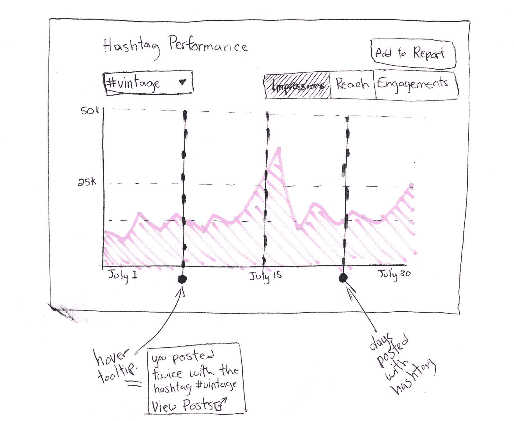
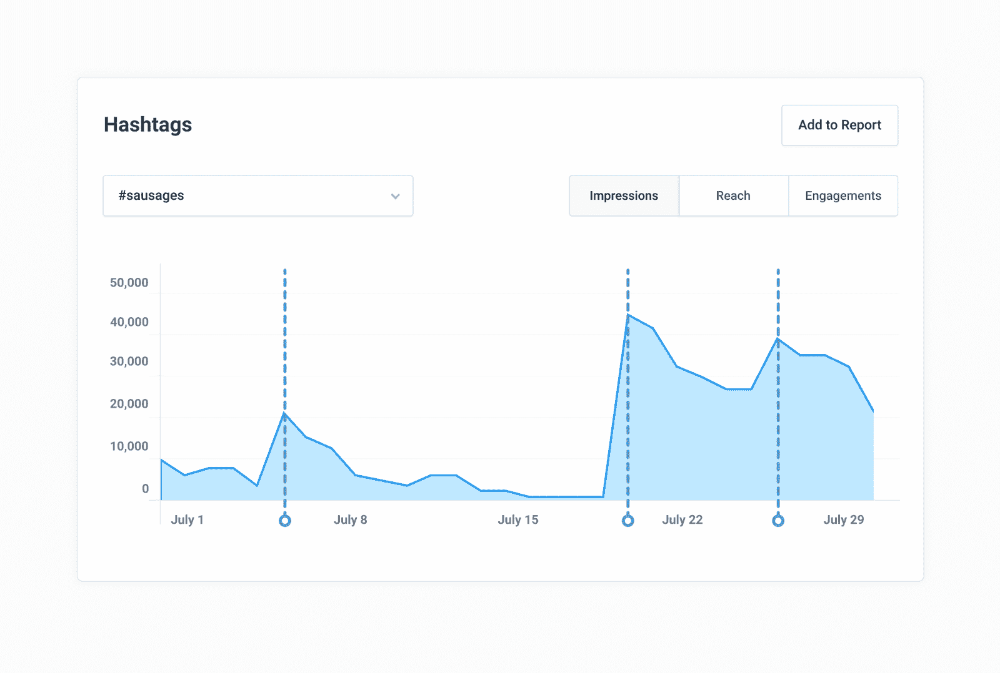
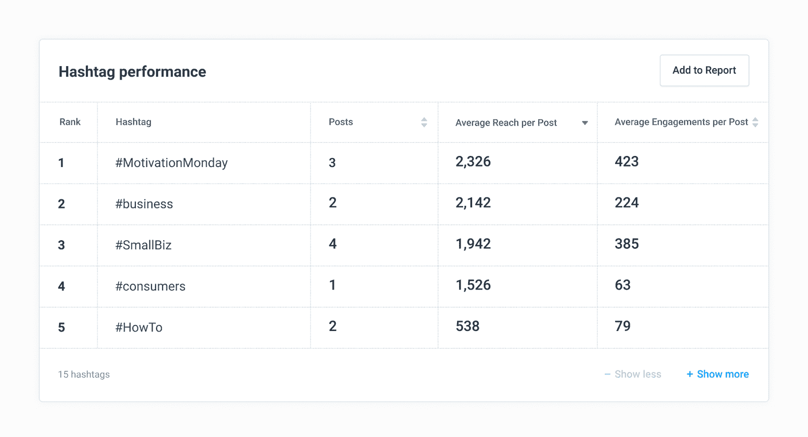
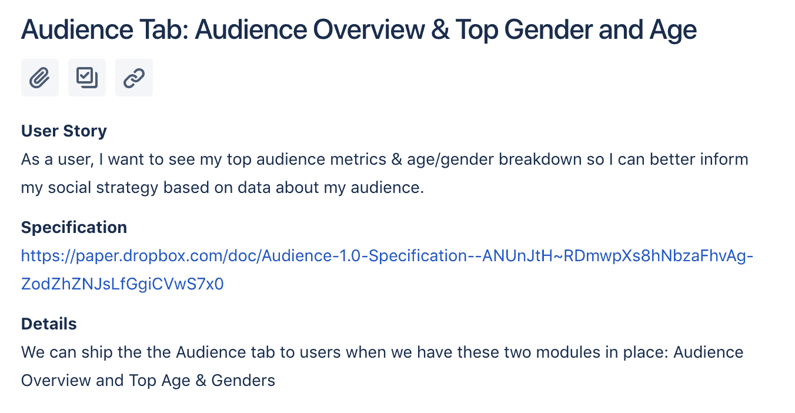
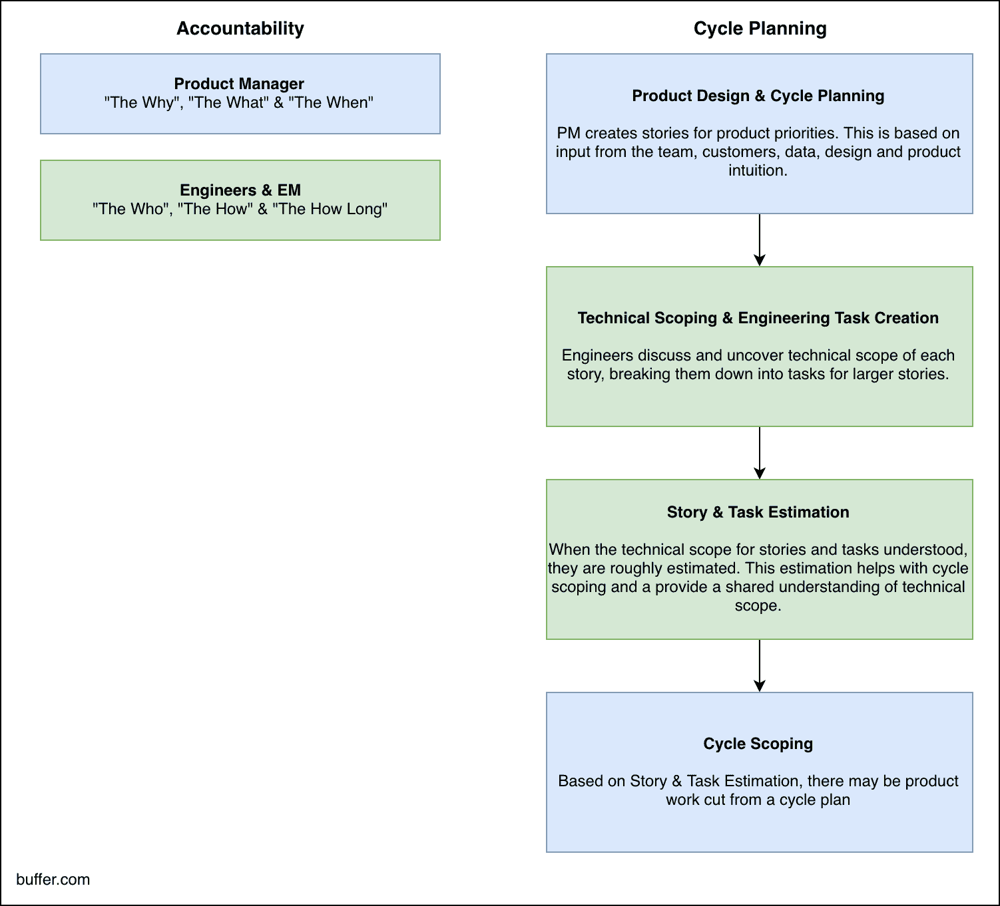

# 产品范围:通往最小可爱产品的道路

> 原文：<https://open.buffer.com/product-scope/?utm_source=wanqu.co&utm_campaign=Wanqu+Daily&utm_medium=website>

在过去的一年里，我和我的团队一直在 Buffer 内部构建一个全新的社交分析解决方案，名为 Buffer Analyze。我们已经尽最大努力将研究、数据和直觉提炼为一个精简、可爱的解决方案，并且我们很幸运地发现了产品/市场契合的早期迹象。

(目前，Analyze beta 对商业客户的[缓冲区开放。你可以](https://buffer.com/business)[在这里](https://buffer.com/analyze?utm_source=open-blog&utm_campaign=scope-post)了解更多关于 Analyze 社交分析功能的信息。)

我们想用 Analyze 做的事情太多了，因为我们确信有太多的事情会带来价值。同时，作为 Buffer 中的一个非常小的团队，我们受到资源的严格限制。

老实说，我不会有任何其他方式。严格的约束迫使产品设计和开发采用创造性的、严格的和批判性的方法。

[发微博给☝️](https://ctt.ac/nDjoR)

该产品是平衡权衡的结果。

我很高兴能分享更多关于这些权衡的信息:我们如何在约束下工作，我们如何确定新产品功能的范围，以及我们如何为客户创造和释放价值。继续阅读以了解更多信息，并随时在[评论](#comments)或[在 Twitter 上给我留言](https://twitter.com/redman)中提出任何问题。

* * *

## 在我们审视之前:先有大梦想，再有小目标

当谈到实现产品功能时，我通常是先有大梦想，再有小梦想。

一旦我认为我已经确定了我们最大的机会(这是一个配得上它本身的过程！)，我将与我们的分析设计师 [James](https://twitter.com/moreofmorris) 一起回顾几种可能的解决方案。最终，我们会找到一个我们认为符合目标的设计，我们会充实许多细节，我们会建立相关工作流程的原型。我们也总是让工程师参与到这个过程中，以便对设计和想法进行早期反馈。

例如，这是我们为新的 hashtag 分析工具开发的一个解决方案。我们最终建造了非常不同的东西！

A lo-fi version of a product feature exploration

A hi-fi version of the same product feature exploration as above

这种探索的结果通常是一个可点击的原型，以及一个详细的规范——我们简称它们为“规范”——我们在这个过程中所做的选择。(我们的规范是非传统的:我们用自然语言编写我们的规范，对我们提出的解决方案进行合理的分解，而不是长篇的、高度技术性的、结构化的文档。)

设计和规格通常代表了理想的，如果我们能做到的话的功能版本。

但是，当然，我们不能做到这一切…我们也不应该！

在一个资源有限、机会成本很高的小团队中，优化**值**而不是**完整性**最符合我们用户的利益。

很多时候，特性完整性并不直接服务于核心的[工作，而是提供便利。便利本身并不是没有价值，但是当一个产品处于非常早期的阶段，](https://jtbd.info/2-what-is-jobs-to-be-done-jtbd-796b82081cca)[通过传递核心价值找到产品/市场契合度](https://buffer.com/resources/measure-productmarket-fit-product-feature/)是最重要的。确认你在做正确的事情比其他任何事情都重要。

因此，有了我们功能齐全、方便易用的原型，是时候退后一步，评估一下设计了。

我们需要建造所有这些东西吗？

几乎所有时候，答案都是否定的；我们不需要所有这些来传递核心价值。

在我们实际构建一个特性之前，我们要经历三个阶段的范围界定:

1.  产品范围
2.  技术范围界定
3.  循环范围界定

#### 是时候打开我们的望远镜了！

## 第一步:产品范围和用户故事

在产品范围阶段，产品经理和设计师一起设计我们希望在即将到来的开发周期中解决的一个或多个特性。我们最终得到的是一个特定的、功能全面的、如果我们能做到这一切的功能版本。这几乎总是比我们最初构建的范围要大。

一旦我们设计好了我们的功能，我们将明确地花时间缩小范围，并确定**最小可爱版本**，这是产品的最小版本，但仍然为用户提供物质价值。

任何小于最小可爱版本的东西都不能完成任务，因此不值得建造。

* * *

*快速提示！*

你几乎总能推出比你最初想象的更小的版本！本着快速出货和快速学习的精神，推动自己变小。

典型案例:当我研究 Analyze 的最小版本时，我的研究和直觉都告诉我，我们需要一个简单的比较工具作为基线和最小功能。我相信没有它没人会为我们的产品付钱，但我错了。构建比较功能比我们计划的时间要长一点，我们决定在没有它的情况下发布 Analyze，看看会发生什么。瞧，即使没有比较工具，我们也赢得了第一个快乐的付费客户！

这是一个极好的机会来检验我的假设，即人们需要比较工具来获得足够的价值，而这个假设被愉快地否定了。这一经历让我渴望对新产品或新功能的每个“必备”方面进行深入的质疑。

* * *

例如，我们发现用户可以从更好地理解他们的标签如何影响到达和参与中获得很多价值。在几个设计探索之后，我们得到了这个功能齐全的，如果我们能做到的话，我们的标签分析模块的所有版本:

This is the full-featured, if-we-could-do-it-all version of our Hashtag Analysis module

下面是我们实际建造的。

And this is the version that we actually built

请注意范围是如何显著变小的，但是它提供的价值几乎是相等的。我非常相信 80/20 法则,它也适用于这里:这个特性的最小版本是初始范围大小的 20 %,然而它提供了预期值的 80%。这对于解决我们用户的挑战(理解 hashtag 性能)来说是绰绰有余的。在产品开发领域，这是一个很好的权衡。

一旦我们指定了我们的全功能解决方案，我将把它分成用户故事。

用户故事是面向用户的价值的离散块。我们使用以下格式:

“作为一个<type of="" user="">，我要<some kind="" of="" goal="">，这样我才能<some reason="">”</some></some></type>

然后附上设计、细节和验收标准。

有时候一个故事足以代表一个完整的特性，但是更多的时候，一个特性会以几个用户故事结束:每一个都是离散的、可交付的价值块。

Example of a user story: One of our three user stories for Analyze’s upcoming Audience section

然后，我们将用户故事的完整列表缩小到一个更小的子集，这将代表我们最小的可爱版本。例如，一个原型可能会产生五个用户故事，但是我们的最小版本将只有这五个中的两个。

## 第二步:技术范围和评估

设计就绪，产品规格在手，我们的用户故事被删减并准备就绪，我们作为一个整体团队见面并一起浏览用户故事。工程师经常会问一些澄清性的问题，我们会根据需要一起调整我们故事的细节。

一旦工程师对问题和我们提出的解决方案有了充分的理解，他们就会将用户故事分解成工程任务。

工程任务是离散的任务，用一组有意粗略的可能估计值进行估计:一天、三天或一周。任何超过一周的预计工作都应该进一步细分。

评估由工程师合作得出，有两个主要目的:

1.  确保所有工程师在每项任务所需的工作量方面大致一致
2.  为产品经理提供周期计划的一般检查。

估算不被用作工程师责任的衡量标准。我们只想知道我们在评估工程任务方面还算过得去(众所周知，这是一件很难做好的事情！)，而且我们都同意这些任务需要什么。

## 第三步:周期范围和规划

现在我们有了一个用户故事和代表他们现实的工程任务的列表，我使用这个信息来计划我们的开发周期。我们目前正在进行为期六周的开发周期，但我的目标只是在一开始就计划前四周。在这个周期的第三周，我会评估我们所处的位置，重新安排事情的优先次序，并计划下半个周期。

有了工程任务，我就能够在可用时间的背景下优先考虑我们的用户故事。我们经常一次开发两个甚至三个特性，评估将帮助我决定哪个应该优先。

例如，如果我们有三个用户故事，我可能仍然会选择先构建“最没有价值”的一个，如果它比其他的花费更少的时间。这让我们的用户更快获得价值。

请耐心听我说，除了我们最可爱的版本，我还会“扩大”一些故事。

我知道，我知道！我一直在宣扬先缩小范围再缩小范围的好处。

但是想象一下一个能装下五块石头的罐子。即使你放不下第六块石头，五块石头之间还有空间，也许我们可以在这个空间里放 10 块鹅卵石。

在这个类比中，罐子是我们的六周周期，石头是满足我们最低可爱特性需求所需的用户故事，鹅卵石是超出我们最低需求的更小的用户故事或工程任务。这是一个很好的方法，可以将一些“令人惊叹的因素”融入到一个功能或产品中，而这些功能或产品并不是交付价值所严格要求的。

Rocks & Pebbles: How we think about keeping scope small and adding the “wow factor” to new product features

总之，**周期范围界定在很大程度上是一个平衡的问题，既要让用户更快地获得价值，又要交付最大的价值**(有时你很幸运，这些事情都是一样的！).这种平衡决定了我们建造什么以及何时建造。

## 让我们回顾一下

**产品范围界定(产品经理负责)**

*   设计你手头问题的解决方案
*   为解决方案创建规格分解
*   将规范转化为用户故事
*   变小:定义这个特性的最小版本，以提供价值

**技术范围界定(工程经理负责)**

*   获得整个团队对规范和用户故事的一致和理解
*   将用户故事分解成技术任务
*   估计技术任务

**周期范围界定(产品经理负责)**

*   基于评估，选择哪些故事和任务将在当前开发周期中完成
*   把所有剩下的留到下一天

如果您想知道在这个范围界定过程中谁负责什么，看起来是这样的:

How we break down the accountabilities for new feature development on Buffer Analyze

## 轮到你了

这个过程是多次迭代的结果，并且随着时间的推移而不断发展。这绝不是产品开发的最佳方法，但我们发现它在我们特定的产品开发周期中是有效的。也就是说，我们一直在积极寻找方法来改进我们的流程，让团队更加舒适和高效。

如果这引发了任何问题或想法，请不要犹豫，在下面留下评论或发推文给我。我会很高兴收到你的来信！