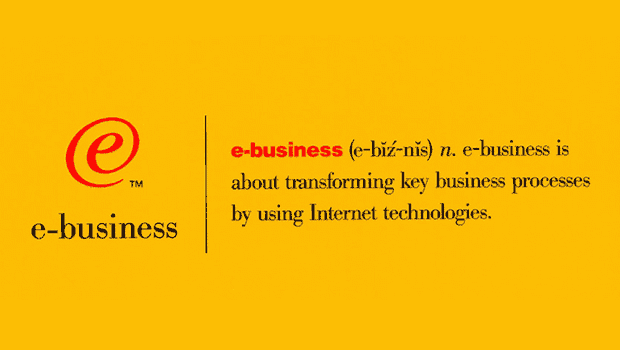
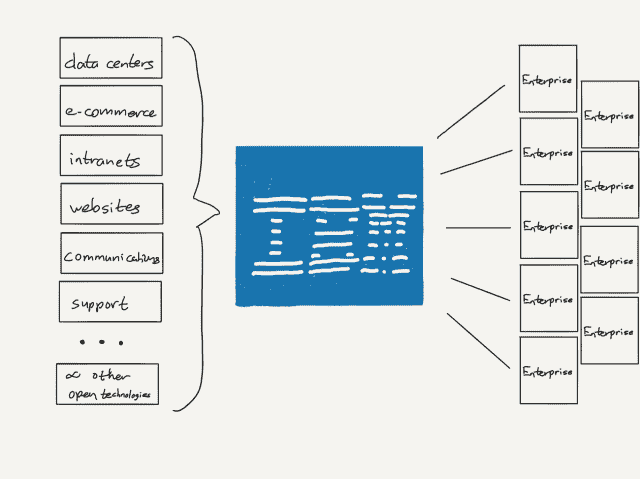
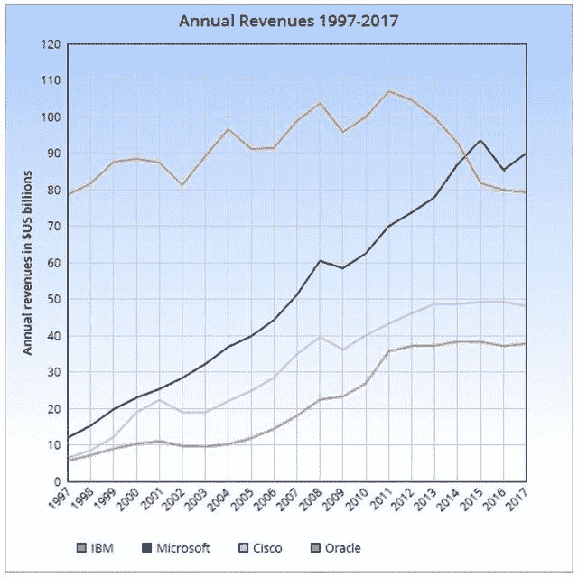
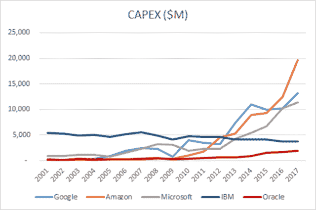
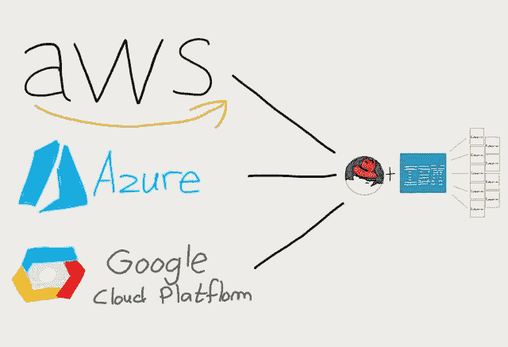

# IBM 的老剧本——本·汤普森的战略

> 原文：<https://stratechery.com/2018/ibms-old-playbook/?utm_source=wanqu.co&utm_campaign=Wanqu+Daily&utm_medium=website>

理解 Red Hat 如何从开源软件中建立起数十亿美元业务的最好方法是从 IBM 开始。创始人鲍勃·扬在 2014 年的[万物开放大会上解释道:](https://www.youtube.com/watch?v=FJVEAXlPadg)

> 没有灵丹妙药。跟上你的客户并理解和思考机会在哪里是一项艰巨的工作。市场上的其他供应商没有为这些客户做什么，而你可以为他们做得更好？有一个很好的例子可以让你知道我们很早就受到了什么样的启发，我们很早就在谈论马克·尤因和我没有足够的业务来支付我们的公寓租金，但我们仍然关注[卢·郭士纳和] IBM…
> 
> 郭士纳进入 IBM 并在三年内扭转了局面。这真是不可思议…郭士纳的见解是，他四处与一大群 IBM 客户交谈，发现这些客户实际上并不喜欢他的任何产品。他们还不错，但是每当他坐下来与任何一个客户交谈时，总会有人比 IBM 做得更好……他说，“那你为什么要从 IBM 购买呢？”客户说“IBM 是唯一一家在我们做生意的地方都有办公室的技术公司”，结果郭士纳明白他不是在卖产品，而是在卖服务。
> 
> 他公开谈到这一点，所以我们在 Red Hat 说，“好吧，我们没有产品可以卖，因为我们的产品是开源的，每个人都可以尽快使用我们的创新，所以我们不是在卖产品，但 IBM 的郭士纳告诉我们，客户不买产品，他们买服务，让他们更成功的东西。”这是我们对我们正在做的事情的早期见解之一，即我们实际上是在服务业务中，甚至在我们销售收缩包装的 Linux 盒子时，我们就认为这是让我们足够大的过渡步骤，我们可以与真正的客户签署服务合同。

昨天，当 IBM 以 340 亿美元收购 Red Hat，比 Red Hat 周五收盘价溢价 60%时，杨的故事又回到了起点。IBM 希望它也能回到原点:重拾郭士纳的魔力，这不仅取决于他对服务的洞察力，还取决于企业计算的长期转变。

#### 郭士纳如何改变 IBM

我以前写过郭士纳的 IBM 转型，当时塞特亚·纳德拉试图在微软做同样的事情，郭士纳的观点是，虽然文化极难改变，但改变自然是不可能的。从[微软的垄断后遗症](https://stratechery.com/2017/microsofts-monopoly-hangover/):

> 垄断的伟大之处在于，一家公司可以做任何事情，因为没有竞争；坏的一面是，当垄断结束时，公司仍然能够在中等水平上做任何事情，但在高水平上什么也做不了，因为它变得又肥又懒。换句话说，对于一个曾经的垄断者来说，“大”是唯一真正差异化的资产。这是郭士纳在规划 IBM 的未来时的关键见解…在郭士纳的愿景中，只有 IBM 有能力提供解决方案而不是产品。

然而，以提供解决方案为前提的战略需要一个问题，而使郭士纳的转变成为可能的另一件事是互联网。到 20 世纪 90 年代中期，企业面临着一套全新的技术，这些技术名义上与过去 15 年的 IT 项目相似，但实际上完全不同。郭士纳在《谁说大象不会跳舞》中描述了这个问题/机会:

> 如果战略家们是正确的，云确实成为了所有这些交互的中心，它将引发两场革命——一场是在计算领域，另一场是在商业领域。它将改变计算，因为它将把工作负载从个人电脑和其他所谓的客户端设备转移到公司内部更大的企业系统和云——网络——本身。这将扭转使个人电脑成为创新和投资中心的趋势——对依靠个人电脑技术发家致富的 IT 公司有着明显的影响。
> 
> 更重要的是，云所描绘的大规模全球连接将在数百万企业、学校、政府和消费者之间的互动中创造一场革命。它将改变商业、教育、医疗、政府服务等等。这将引发自 20 世纪 60 年代引入数字数据处理以来最大的商业变革浪潮……像“信息高速公路”和“电子商务”这样的术语不足以描述我们正在谈论的内容。我们需要一个词汇表来帮助行业、我们的客户，甚至 IBM 员工理解我们所看到的超越了数字信息和在线商务。它将重塑企业和个人之间每一种重要的关系和互动。最终，我们的营销和互联网团队提出了“电子商务”这个术语

你们中与我同龄或比我年长的人肯定记得很快成为 IBM 无处不在的“e”:

[T2】](https://i0.wp.com/stratechery.com/wp-content/uploads/2018/10/us__en_us__ibm100__ebusiness__logo__620x350.gif?ssl=1)

IBM 继续花费超过 50 亿美元营销“电子商务”，郭士纳称这项投资是“我职业生涯中见过的最好的品牌职位之一。”它之所以有效，是因为它是真实的:大企业，其中大多数都只是通过批发商、分销商和零售商的漫长链条与客户间接互动，突然有了与最终用户直接互动的能力——甚至是责任。这可能是一个简单的网站，或电子商务，或客户支持，更不用说实时进入价值链的所有其他部分的能力。技术挑战和商业可能性——问题集，如果你愿意的话——是巨大的，郭士纳将 IBM 定位为能够解决这些新问题的公司。

对于几乎所有非科技公司来说，这都是一个有吸引力的提议:20 世纪 90 年代互联网面临的挑战是，底层技术如此多样，而且相当不成熟；不同的问题空间有不同的公司兜售产品，其中许多是没有大型企业工作经验的初创公司，即使他们有更好的产品，也没有 IT 部门希望管理和集成众多供应商。另一方面，IBM 提出了众所周知的“一个喉咙哽住”；他们承诺解决与这种新型互联网产品相关的所有问题，此外，IT 部门对 IBM 也很熟悉。

这也是一种有可能从价值链中榨取利润的战略:

[T2】](https://i0.wp.com/stratechery.com/wp-content/uploads/2018/10/Paper.stratechery-Year-One.380.png?ssl=1)

作为互联网基础的实际技术是开放的和商品化的，这意味着 IBM 可以形成一个集成点并获取利润，这正是所发生的事情:IBM 的收入和增长稳步增长——往往很快！—在接下来的十年里，随着该公司管理从数据中心到内部网络到外部网站到电子商务运营的一切，以及将它联系在一起的所有中间件(当然是由 IBM 制造的，这是该公司的大部分利润来源)。IBM 包揽一切，慢慢锁定客户，又一次肥了懒了。

#### 当 IBM 失去了云

*最后一段谁说大象不会跳舞？*郭士纳这样评价他的继任者彭明盛:

> 我一直是个局外人。但那是我的工作。我知道山姆·帕米萨诺有机会和过去建立联系，而我却永远做不到。他的挑战将是在不倒退的情况下实现这些目标；要知道，驱使 IBM 闭关自守的离心力在公司内部依然强大。

帕米萨诺惨败，没有比他在 2010 年宣布公司的 2015 年路线图更好的例子了，该路线图的核心是承诺到 2015 年实现每股 20 美元的利润。彭明盛当时说:

> (普遍观点是)产品周期将推动行业增长。这个行业正在整合，最终消费者技术将会抹杀过去 20 年的所有计算机科学。我是东海岸人。我们会有一个稍微不同的观点。产品周期不会推动可持续增长。未来的客户会要求他们的投资有可量化的回报。他们不会购买时尚和潮流。企业会有自己独特的模式。你不能在云中做我们正在做的事情。

与此同时，亚马逊网络服务比帕米萨诺的声明早了整整四年零两个月；不只是简单地嘲笑云的想法，而是在面临生存威胁的情况下承诺一个利润数字，这是极其愚蠢的，因为这种威胁是基于在基础设施上投入绝对大量的资金。 [1](#fn1-3775 "This footnote is a repeat from <em>Microsoft’s Monopoly Hangover</em>; Gerstner predicted the public cloud in the first appendix of his book, which was published in 2003, four years before AWS was launched:

<blockquote>

  Put all of this together—the emergence of large-scale computing grids, the development of autonomic technologies that will allow these systems to be more self-managing, and the proliferation of computing devices into the very fabric of life and business—and it suggests one more major development in the history of the IT industry. This one will change the way IT companies take their products to market. It will change who they sell to and who the customer considers its “supplier.” This development is what some have called “utility” computing.

  The essential idea is that very soon enterprises will get their information technology in much the same way they get water or electric power. They don’t now own a waterworks or power plant, and soon they’ll no longer have to buy, house, and maintain any aspect of a traditional computing environment: The processing, the storage, the applications, the systems management, and the security will all be provided over the Net as a service—on demand.

  The value proposition to customers is compelling: fewer assets; converting fixed costs to variable costs; access to unlimited computing resources on an as-needed basis; and the chance to shed the headaches of technology cycles, upgrades, maintenance, integration, and management.

  Also, in a post-September 11, 2001, world in which there’s much greater urgency about the security of information and systems, on-demand computing would provide access to an ultra-secure infrastructure and the ability to draw on systems that are dispersed— creating a new level of immunity from a natural disaster or an event that could wipe out a traditional, centralized data center.")

郭士纳明确指出了彭明盛错在哪里:他“向内看，只顾自己”，以至于他想象不出比 IBM 的定制解决方案更好的企业解决方案。然而，这并没有抓住要点。我在 2014 年的每日更新中写道，当时该公司正式放弃了 2015 年的利润目标:

> 事实是，IBM 服务的企业——也是 IBM 拥有市场的全部原因——并没有购买定制的技术解决方案来让自己感觉良好；他们购买它们是因为它们帮助他们实现了商业目标。郭士纳的关键见解是，许多公司都有一个只有 IBM 能解决的问题，而不是定制解决方案就是一切。因此，随着普遍提供的云服务缓慢但肯定变得足够好，IBM 不再垄断问题解决。

自那以后，该公司一直声称它致力于在公共云领域迎头赶上，但事实是，帕米萨诺在十年前投资失败时就决定了该公司的云命运；事实上，收购 Red Hat 最重要的收获之一就是承认 IBM 的公共云努力实际上已经死亡。

#### IBM 的挣扎

那么，IBM 收购 Red Hat 的确切目的是什么，如果它与 Lou Gerstner 有什么关系呢？

首先，IBM 已经有一段时间表现不佳:去年的年收入是自 1997 年以来最低的，部分原因是郭士纳的转型；当然，正如 ZDNet 的这篇文章所指出的，1997 年的 790 亿美元相当于今天的 1200 亿美元。

From [ZDNet](https://www.zdnet.com/article/ibm-shows-growth-after-22-straight-quarters-of-declining-revenues-but-has-it-turned-the-corner/)

该公司在连续 22 个季度下滑后，终于在今年早些时候恢复了增长，只是在上个季度再次下滑:IBM 的古代大型机业务增长了 2%，传统服务业务增长了 3%，但技术服务和云平台表现平平，认知解决方案(即沃森)下降了 5%。

与此同时，前面提到的对云的承诺主要是对现有业务重新分类的会计虚构；更相关的数字是该公司的资本支出，2017 年为 32 亿美元，低于 2016 年的 36 亿美元。查尔斯·菲茨杰拉德在平台经济学上写道:

> [T2】](https://i0.wp.com/stratechery.com/wp-content/uploads/2018/10/clip_image003_thumb.png?ssl=1)
> 
> 我们看到 IBM 的资本支出慢慢减少，就像公司本身一样。早在云时代之前，IBM 就已经在资本支出上投入了大量资金(在他们辉煌的过去，每年高达 70 亿美元)，所以我们不能假设投入的绝对数量是朝向云的。三大巨头在 2012/13 年的资本支出都超过了 IBM。在抵制我们从所有其他云供应商那里看到的资本支出上升的过程中，IBM 根本没有参与超大规模的云游戏。

#### 红帽收购案

这就是收购 Red Hat 的原因:虽然 IBM 肯定会很高兴拥有该公司产生现金的 RHEL 订阅业务，但真正的奖励是 Openshift，这是一个用于构建和管理 Kubernetes 容器的软件套件。我在 2016 年的[中写了关于 Kubernetes 谷歌如何挑战 AWS](https://stratechery.com/2016/how-google-cloud-platform-is-challenging-aws/) 的文章:

> [2014 年](https://www.wired.com/2014/06/google-kubernetes/)谷歌发布了 Kubernetes，这是一款基于谷歌内部 [Borg](https://research.google.com/pubs/pub43438.html) 服务的开源容器集群管理器，它抽象了谷歌的大规模基础设施，使得任何谷歌服务都可以立即访问他们需要的所有计算能力，而不必担心细节。核心规则是容器，这是我在 2014 年写的[:工程师们构建一个标准接口，保留(几乎)完全的灵活性，而不需要了解任何底层硬件或操作系统(这是超越虚拟机的一个进化步骤)。](https://stratechery.com/2014/docker-integrated-open-source-company/)
> 
> Kubernetes 与 Borg 的不同之处在于它是完全可移植的:它运行在 AWS 上，运行在 Azure 上，运行在谷歌云平台上，运行在内部基础设施上，甚至可以在家里运行。与本文更相关的是，它是 AWS 在基础设施即服务方面十年领先的完美解药:虽然 Google 在自己的基础设施产品方面取得了长足的进步，但 Kubernetes 的潜在影响，特别是广义的基于容器的开发，将使您使用哪个基础设施提供商变得无关紧要。难怪它是有史以来增长最快的开源项目之一:没有锁定。

这正是 IBM 所指望的；该公司在宣布交易的新闻稿中写道:

> 此次收购汇集了同类最佳的混合云提供商，将使公司能够安全地将所有业务应用程序迁移到云中。如今的公司已经在使用多种云。然而，研究表明，80%的业务工作负载尚未迁移到云，这受到了当今云市场的专有性质的限制。这妨碍了数据和应用程序在多个云中的可移植性、多云中的数据安全性以及一致的云管理。
> 
> IBM 和 Red Hat 将在解决这一问题和加速混合云的采用方面处于有利地位。它们将共同帮助客户更快地创建云原生业务应用，在多个公共云和私有云之间提高数据和应用的可移植性和安全性，所有这些都通过一致的云管理实现。在这一过程中，他们将利用他们在关键技术方面的共同领导地位，如 Linux、容器、Kubernetes、多云管理以及云管理和自动化。

这是一个赌注:在 20 世纪 90 年代，互联网的复杂性使企业很难上网，为 IBM 提供了销售解决方案的机会，而今天，IBM 认为云计算减少到三个集中式提供商，使企业不愿意承诺任何一个。IBM 打赌它可以再次提供解决方案，与 Red Hat 结合，构建无缝连接私有数据中心和所有公共云的产品。

#### IBM 毫无准备的头脑

这一战略的最佳之处在于它的实用主义:IBM 十年前放弃了在公共云领域竞争的潜力，过去五年一直在伪装，现在终于承认其最佳选择是建立在其他所有人的云之上。不过，这触及了该战略的弱点:它似乎更适合 IBM 的需求，而不是潜在客户。毕竟，如果企业担心锁定，IBM 真的是更好的选择吗？如果答案是“红帽是开放的”，那么越来越复杂的企业在什么时候会自己构建它呢？

IBM 的问题在于，他们不是在为被令人眼花缭乱的开放技术弄得不知所措的 IT 部门构建解决方案:相反，他们是在三家云提供商的基础上构建的，其中一家(微软)专门从事 IBM 瞄准的混合解决方案。不同之处在于，因为微软实际上把钱花在了基础设施上，他们从价值链中赚钱的能力相应更高；IBM 必须支付租金:

[T2】](https://i0.wp.com/stratechery.com/wp-content/uploads/2018/10/Paper.stratechery-Year-One.382-copy.jpg?ssl=1)

不过，也许更大的问题要追溯到郭士纳:在 IBM 能够利用互联网之前，该公司需要彻底改革其文化；该公司将在多大程度上成功利用对红帽的收购，将取决于类似的转型。不幸的是，这似乎不太可能；现任首席执行官 Ginni Rometty 于 2012 年初接管该公司，她不仅支持帕米萨诺灾难性的 2015 年路线图，实际上她承担了实现这一目标所需的大部分削减和金融工程，最终在 2014 年放弃。与此同时，该公司最突出的营销一直围绕着沃森，其能力已被严重高估；在令人失望的推出之后，销售萎缩不足为奇。

郭士纳知道转变是艰难的:就他在 IBM 的任期而言，他称互联网的到来是“幸运的”。但是，正如路易斯·巴斯德所说，“幸运青睐有准备的人。”郭士纳已经确定了一项战略，并开始改变 IBM 的文化，这样当问题到来时，公司已经准备好了。今天，IBM 声称它发现了一个问题；这个问题是否真的存在还是一个未知数，但不幸的是，如果这个问题真的存在，IBM 真的准备好利用它的证据就更少了。

### *相关*