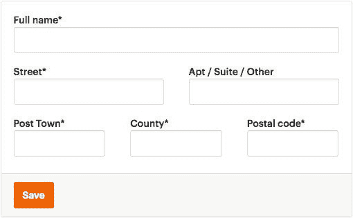
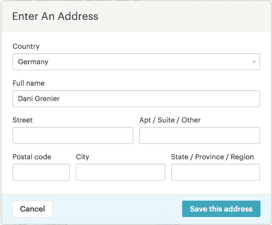
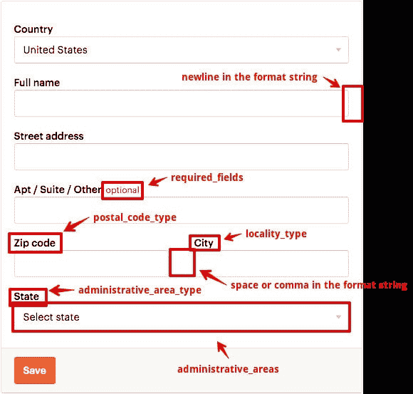
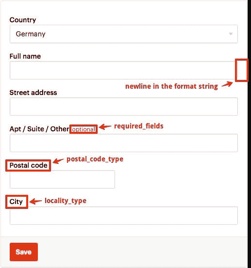
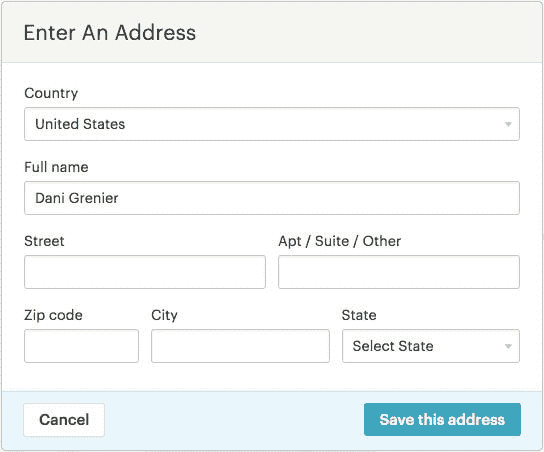
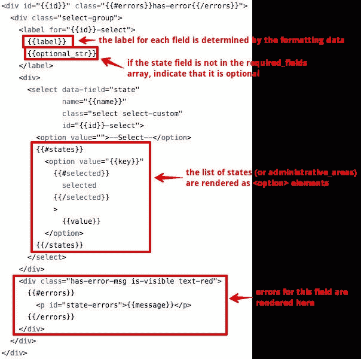

# Etsy 工程| Etsy 如何本地化地址

> 原文：<https://codeascraft.com/2018/09/26/how-etsy-localizes-addresses/?utm_source=wanqu.co&utm_campaign=Wanqu+Daily&utm_medium=website>

想象一下，有一天你正在你价格昂贵的加州公寓里浏览网页，你发现了一个整洁的新网站，里面有一些非常酷的东西。您挑选一些商品，将它们添加到您的购物车中，然后开始结帐过程。你到了他们询问你送货地址的部分，这是你看到的表格:



开始很容易，你填写你的名字，你的街道，你的公寓号码，然后你到达标有“邮政城”的字段。什么是“邮镇”？哼。接下来你看到的是“县”。你知道县是什么，但你什么时候开始在你的地址里写它了？然后是“邮政编码”。你可能会认出这是美国所谓的“邮政编码”，但看起来还是很混乱。所以现在你真的不知道该做什么，对吗？你把你的城市或者你的州放在哪里？你只是把你的地址塞进表格里，然后希望你能拿到订单吗？或者你放弃了你的购物车，决定不再从这个网站购买任何东西？

事实上，这是我为这个练习准备的一个假表格，但是当我们向美国以外的会员展示一个以美国为中心的地址表格时，它准确地展示了他们的感受。

Etsy 在 200 多个国家开展业务，重要的是我们的会员在提供送货地址和下订单时感到舒适和自信。他们需要知道他们的订单会到达他们手中。此外，当新卖家加入 Etsy 时，我们会要求他们提供几个地址，如账单和银行地址，我们希望他们能够放心地提供这些信息，并相信我们会知道如何支持他们并满足他们的需求。

#### 在这篇文章中，我将介绍:

*   我们从哪里开始:通用地址格式
*   国际地址应该是什么样的？
*   构建本地化地址体验

## 我们从哪里开始:通用地址格式

当我们第一次开始这个项目时，我们的地址表单是用各种各样的技术设计的，只有很少的本地化。大多数地址形式对美国成员来说工作得很好，我们为加拿大和澳大利亚成员显示了适当的形式，但是其他国家的成员显示的是通用的、未本地化的地址形式。

### 美国


我们的会员地址表单看起来很好——我们希望看到的所有字段都在那里，没有任何意外的字段。

### 德国(等)



这是我们展示给德国(和大多数其他国家)的表格。我们要求输入邮政编码、州、省或地区。对于不熟悉德国地址的人来说，这乍一看似乎不错。但是如果我告诉你德国的地址没有州呢？更糟糕的是，在这个表单中，state 是必填字段！

这种形式让我们的许多德国成员感到困惑，他们最终在那个领域投入了许多东西，只是为了能够前进。这让我们找到了保存的地址，如:

**Ets Y. Crafter** **柏林 123 大街** **柏林 12435** **德国**

在这种情况下，成员只是在 state 字段中输入了城市。这还不是最糟糕的情况，运送到这个地址的任何东西可能都会顺利到达。

但是这个地址呢？

**Ets Y. Crafter** **主街 123 号** **加州柏林 12435** **德国**

有时，成员在州字段中输入美国的州。这让卖家和邮政工作人员都很困惑——我们有包裹被运到美国的真实例子，因为一个州被包括在内，尽管列出的国家完全不同！

**Ets Y. Crafter** **123 大街** **柏林，dadssaklkllg****德国**

成员甚至可以在 state 字段中输入乱码。再一次，这让卖家和邮政服务有点困惑。

## 非美国地址应该是什么样的？

下面是一个德国地址的例子:

**Ets Y. Crafter** **123 大街** **12435 柏林** **德国**

如果你想邮寄东西到这个地址，你需要指定收件人，街道名称和号码，邮政编码和城市，以及国家。我们可以使用这个地址来确定德国的地址格式，但是 Etsy 支持的近 200 个其他国家呢？我们真的不想查找每个国家的地址样本，并猜测地址格式应该是什么。

谢天谢地，我们不必那样做。

在编制不同国家的地址格式列表时，我们利用了 3 个不同的来源。

*   我们的大部分数据来自谷歌的地址数据服务。
*   我们还利用万国邮政联盟(或称万国邮联)做了一点理智检查，这是一个总部设在瑞士的国际组织，基本上是为了确保世界上所有不同的邮政运营商能够协同工作。
*   我们还咨询了我们的国际员工，以确保德国和日本等特定市场的数据是正确的。

#### 那么我们得到了什么样的数据呢？

我们得到的最重要的信息是一个格式字符串，它告诉我们:

*   哪些字段是地址的一部分
*   它们应该显示的顺序
*   每个字段之间的任何分隔符(空格、逗号、换行符)

我们还获得了其他格式化数据，包括:

*   ISO 标准国家代码
*   指示完整地址需要哪些字段的数组
*   行政区域(州)数据
*   邮政编码验证的正则表达式(regex)模式
*   每个字段的详细名称(如州、省、地区或县)

以下是几个不同国家的格式数据，以及如何使用这些数据来组合该国家的本地化地址表单。

### 美国

```
$format = [
  209 => [
    'format' => '%name\n%first_line\n%second_line\n%city, %state %zip\n%country_name',
    'required_fields' => [
      'name',
      'first_line',
      'city',
      'state', 'zip',
    ],
    'uppercase_fields' => [
      'city',
      'state',
    ],
    'name' => 'UNITED STATES',
    'administrative_area_type' => 'state',
    'locality_type' => 'city',
    'postal_code_type' => 'zip',
    'postal_code_pattern' => '(\\d{5})(?:[ \\-](\\d{4}))?',
    'administrative_areas' => [
      'AL' => 'Alabama',
      'AK' => 'Alaska',
      //...
      'WI' => 'Wisconsin',
      'WY' => 'Wyoming',
    ],
    'iso_code' => 'US',
  ]
]; 
```



德国

```
$format = [
  91 => [
    'format' => '%name\n%first_line\n%second_line\n%zip%city\n%country_name',
    'required_fields' => [
      'name',
      'first_line',
      'city',
      'zip',
    ],
    'uppercase_fields' => [
      'city',
    ],
    'name' => 'GERMANY',
    'locality_type' => 'city',
    'postal_code_type' => 'postal',
    'postal_code_pattern' => '\\d{5}',
    'input_format' => '%name\\n%first_line\\n%second_line\\n%zip\\n%city\\n%country_name',
    'iso_code' => 'DE',
  ],
]; 
```



所以，现在我们有了所有这些关于近 200 个国家的地址应该是什么样子的信息。我们如何将这些数据转化为本地化的地址体验？

## 构建本地化地址体验

完整的本地化地址体验需要两个组件:地址输入和地址显示。换句话说，我们的成员需要能够使用对他们有意义的表单来添加和编辑他们的地址，并且他们需要看到他们的地址以他们熟悉的格式显示。

### 地址输入

您已经看到了我们未本地化的地址表单的样子，但是这里有一个快速提示，让您知道德国会员在输入他们的地址时看到了什么。


这是一个静态表单，这意味着我们有一个大模板和一堆标签，还有一点 JavaScript 来处理与表单的交互。对于一些选定的国家，如加拿大和澳大利亚，我们在模板中添加了条件语句，根据需要交换不同的州或省列表。这导致了一个相当混乱的模板。

在决定如何处理地址格式时，我们知道我们不希望有一个包含足够条件语句的模板来处理数百种不同的地址格式。相反，我们决定采用合成的方法。

每个地址表单都以国家输入开始。这将提示成员首先选择他们的国家，因此我们可以在他们开始输入地址之前呈现本地化的表单。我们确定了地址表单中所有可能的字段:first_line、second_line、city、state、zip 和 country，并且认识到所有这些字段都可以使用一些通用模板来呈现。这些模板将允许我们指定定制标签，指示字段是否是必需的，显示验证错误，并通过在为每个字段呈现模板时提供不同的数据来呈现其他定制内容。

### 文本输入

一个非常基本的文本输入可以用于第一行、第二行、城市和邮政编码地址字段，以及州字段，具体取决于国家。下面是我们的文本输入模板的样子:



 


### 状态选择输入

对于拥有州(即行政区域)数据的国家，我们创建了一个选择输入模板:



有了这些模板和适当的地址格式数据，我们可以为将近 200 个国家生成地址输入表单。

### 地址显示

在这个项目之前，显示本地化地址也是由静态模板处理的。它基于美国地址格式，并假设所有地址都具有与美国地址相同的字段。它看起来像这样:

```
 < p>{{name}}< /p>
  < p>{{first_line}}< /p>
  < p>{{second_line}}< /p>
  < p>{{city}},{{state}}{{zip}}< /p>
  < p>{{country_name}}< /p> 
```

虽然这不像我们处理地址输入的方式那样有问题，但仍然不理想。国际会员的地址会显示不正确，造成不同程度的混乱。对于德国成员来说，差别还不算太大:

但是对于像日本这样的国家的成员来说，这种差异是非常显著的:

为了本地化地址显示，我们再次采用了组合方法，将每个字段视为单独的一部分，然后按照指定的顺序组合它们，并使用格式字符串指示的分隔符。

```
 < span class="name">EtsY.Crafter< /span>< br>
  < span class="first-line">123MainStreet< /span>< br/>
  < span class="zip">12345< /span>< span class="city">BERLIN< /span>< br/>
  < span class="country-name">Germany< /span>< br/> 
```

我们进一步增强了我们的地址显示库，创建了一个 PHP 类，可以用明文或完全可定制的 HTML 呈现本地化的地址，以支持在 Etsy 和我们的内部工具中显示地址的多种方式。

## 结论

没有更多令人困惑的地址形式！虽然我们离本地化地址还远着呢，但到目前为止我们已经取得了很大的进步。我们希望我们的会员会更加享受他们的体验，因为他们对地址的关注更少了。我们从这个项目中学到了很多东西(比如我们如何在整个网站上用本地化的地址表单替换未本地化的地址表单！)，所以要留意以后的博文。感谢阅读！