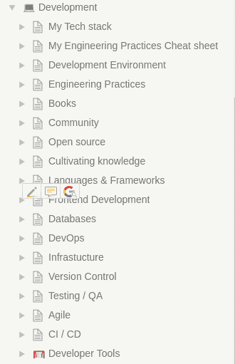

# 作为一个软件工程师开发社区，我如何组织我的知识👩‍💻👨‍💻

> 原文：<https://dev.to/brpaz/how-do-i-organize-my-knowledge-as-a-software-engineer-4387?utm_source=wanqu.co&utm_campaign=Wanqu+Daily&utm_medium=website>

总的来说，软件开发和技术是发展速度非常快的领域，持续的学习是必不可少的。在互联网上，在 Twitter、Medium、RSS feeds、Hacker News 和其他专业网站和社区中浏览几分钟，就足以从文章、案例研究、教程、代码片段、新应用等等中找到大量有用的信息。

保存和组织所有这些信息可能是一项艰巨的任务。在这篇文章中，我将展示一些我用来做这件事的工具。

关于知识管理，我认为非常重要的一点是避免锁定在特定的平台上。我使用的所有工具都允许以 Markdown 和 HTML 等标准格式导出数据。

请注意，我的工作流程并不完美，我一直在寻找新的工具和方法来优化它。此外，每个人都是不同的，所以适合我的不一定适合你。

## 知识库与 NotionHQ

对我来说，知识管理的基础是拥有某种个人知识库/维基。一个地方，你可以保存链接，书签，笔记等有组织的方式。

为此，我使用了 [NotionHQ](https://www.notion.so/) 。我用它来记录各种主题的笔记，拥有按编程语言分组的大型库或教程等资源列表，用书签标记有趣的博客帖子和教程，等等，不仅与软件开发有关，还与我的个人生活有关。

我真正喜欢的概念是，创造新内容是多么简单。你用 Markdown 写它，它被组织成树。

以下是我的“发展”工作区的顶层页面:

[T2】](https://res.cloudinary.com/practicaldev/image/fetch/s--uMbaRUtu--/c_limit%2Cf_auto%2Cfl_progressive%2Cq_auto%2Cw_880/http://i.imgur.com/kRnuvMV.png)

概念有一些不错的其他功能，如集成的电子表格/数据库和任务板。

你需要订阅付费的个人计划，如果你想认真地使用观念，因为免费计划是有限的。我认为它值这个价钱。概念允许您将整个工作空间导出到 Markdown 文件。导出有一些重要的问题，如松散的页面层次结构，但希望概念团队可以改善这一点。

作为一个免费的选择，我可能会使用 [VuePress](https://vuepress.vuejs.org/) 或 [GitBook](https://www.gitbook.com/?t=1) 来托管我自己的。

## 用口袋保存有趣的物品

口袋是我最喜欢的应用之一！有了 Pocket，你可以创建一个网上文章的阅读列表。
每次我看到一篇看起来有趣的文章，我都会用它的 Chrome 扩展把它保存到 Pocket。稍后，我会阅读它，如果我发现它足够有用，我会使用 Pocket 的“存档”功能来永久保存该文章并清理我的 Pocket 收件箱。

我试着保持阅读清单足够小，并保存我处理过的信息。Pocket 允许您标记文章，这将使以后搜索特定主题的文章变得更加简单。

你也可以在 Pocket 服务器上保存文章的副本，以防原始站点消失，但是你需要 Pocket Premium。

Pocket 还有一个“发现”功能，可以根据你保存的文章推荐相似的文章。这是寻找新内容的好方法。

## 用 SnippetStore 进行片段管理

从 GitHub 到 Stack Overflow answers，再到 blog posts，经常可以找到一些你想保存下来的代码片段。它可能是一些很好的算法实现，一个有用的脚本或者一个如何用 Y 语言做 X 的例子。

我尝试了许多应用，从简单的 GitHub Gists 到 [Boostnote](https://boostnote.io/) ，直到我发现了 [SnippetStore](https://github.com/ZeroX-DG/SnippetStore) 。

SnippetStore 是一款开源的代码片段管理应用。SnippetStore 与众不同之处在于它的简单性。您可以按语言或标签组织代码片段，也可以有多个文件代码片段。它并不完美，但它完成了任务。例如，Boostnote 有更多的功能，但我更喜欢用更简单的方式组织 SnippetStore 的内容。

对于我日常使用的缩写和代码片段，我更喜欢使用我的编辑器/ IDE 代码片段功能，因为它使用起来更方便。我使用 SnippetStore 更像是参考编码示例。

Cacher 也是一个有趣的选择，因为它集成了许多编辑器，有一个 cli 工具，并使用 GitHub Gists 作为后端，但对于其 pro 计划来说，每月 6 美元，这在我看来太多了。

## 使用 DevHints 管理备忘单

Devhints 是 Rico Sta 创建的一个备忘单集合。克鲁兹。它是开源的，由最流行的静态站点生成器 Jekyll 提供支持。

备忘单是用 Markdown 编写的，带有一些额外的格式，比如对列的支持。

我真的很喜欢这个界面的外观，Markdown 使得添加新内容和保持更新以及版本控制变得非常容易，不像 PDF 或图像格式的备忘单，你可以在像 [Cheatography](https://cheatography.com) 这样的网站上找到。

由于它是开源的，我创建了自己的 fork，删除了一些我不需要的备忘单，并添加了一些。

我使用备忘单作为如何使用一些库或编程语言或记住一些命令的参考。拥有一个单独的页面非常方便，例如，拥有特定编程语言的所有基本语法。

我仍然在试验这个，但是到目前为止效果很好。

## Diigo

Diigo 允许你标注和高亮显示网站的部分内容。我用它来注释学习新主题时的重要信息，或者保存文章中的特定段落、堆栈溢出的答案或 Twitter 上的灵感引语！；)

* * *

就这样。在一些工具的功能方面可能会有一些重叠，但是正如我在开始时所说的，这是一个不断发展的工作流，因为我总是在尝试和寻找改进和提高生产力的方法。

你呢？你如何组织你的知识？。请在下面随意评论。

感谢您的阅读。