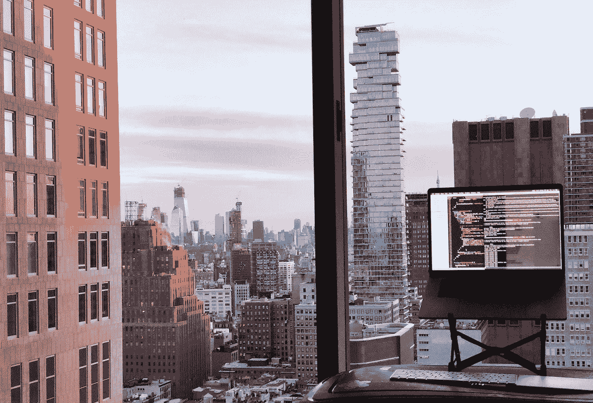
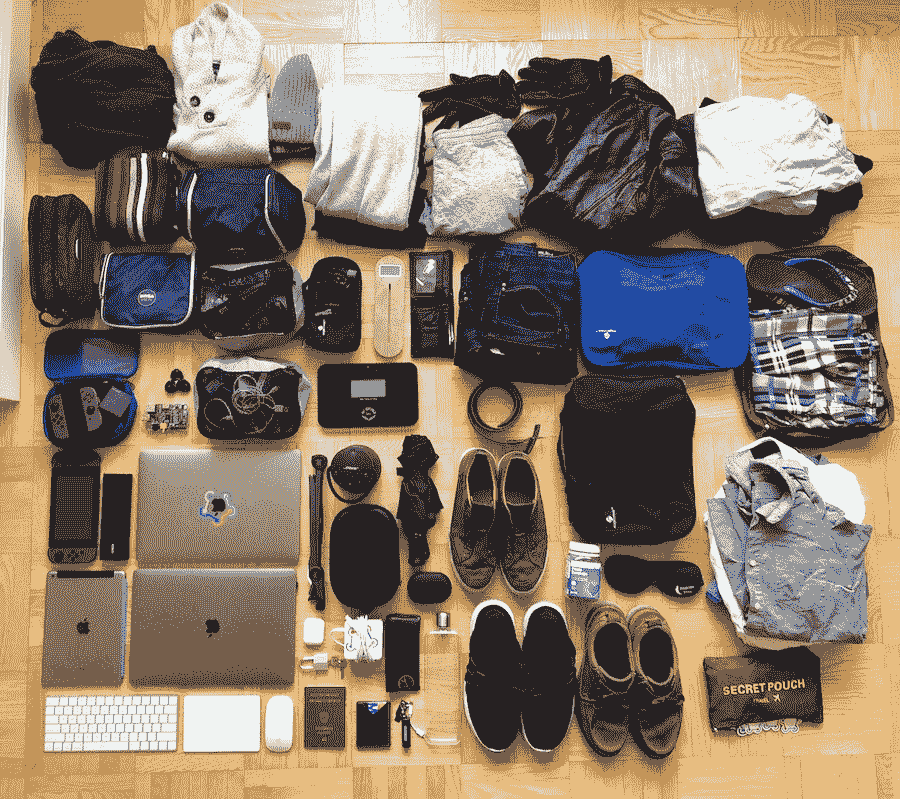
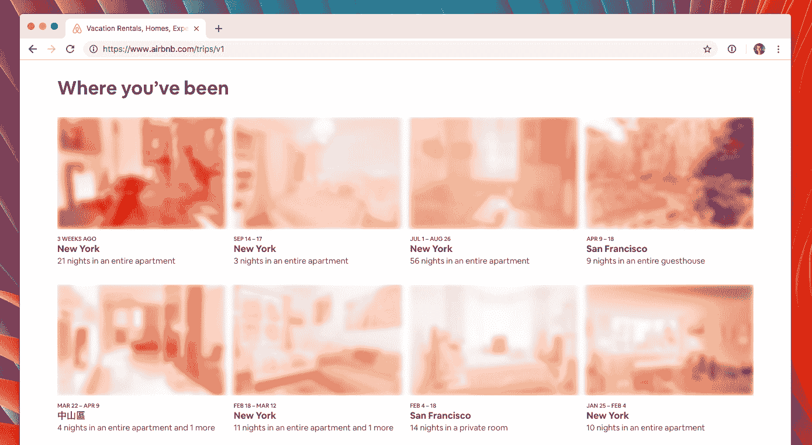
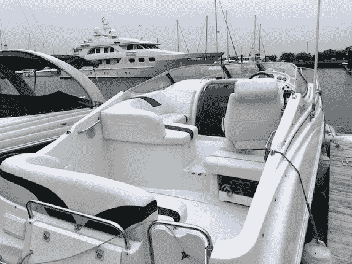
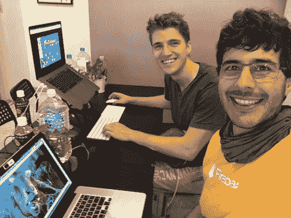
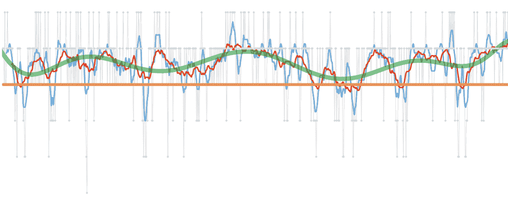
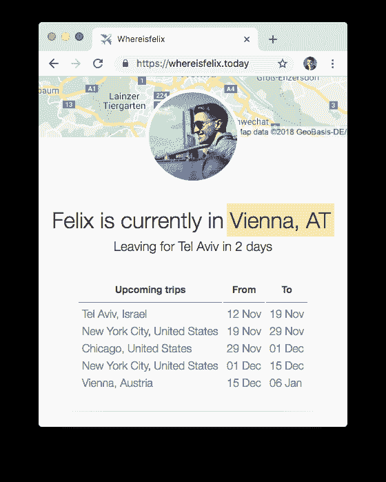
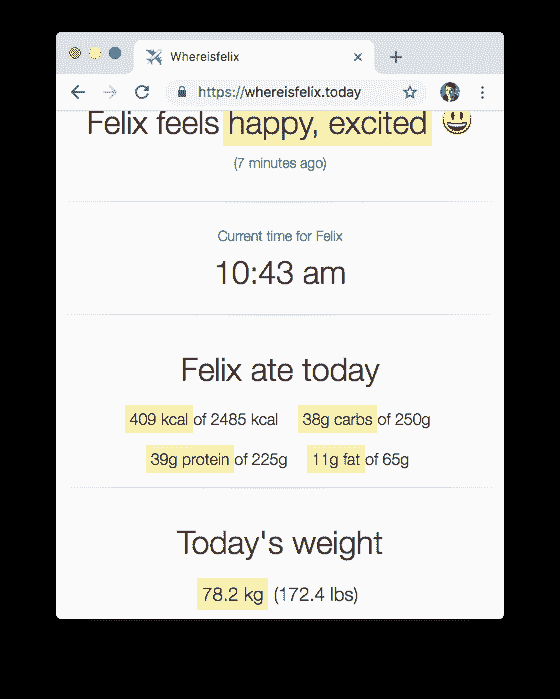
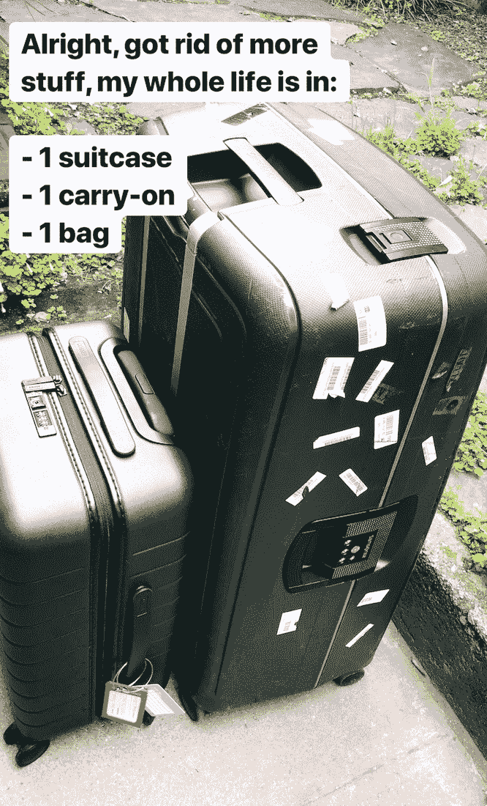

# 一年游牧——回顾费利克斯·克劳斯

> 原文：<https://krausefx.com/blog/one-year-nomad?utm_source=wanqu.co&utm_campaign=Wanqu+Daily&utm_medium=website>

## 背景

一年前的今天，我决定扔掉所有的东西，住在行李箱里。这是从一个我没想到会持续很久的实验开始的。然而，365 天没有一个固定的家，我不打算改变我目前的设置。

总结一下[去年关于为什么我想停止租赁的想法](/blog/going-nomad):

*   钱:我只在家里呆了大约 200 个晚上，差不多有半年没用过
*   常规:我不喜欢在地方、地铁和通勤方面有一个常规
*   维修:我不喜欢花时间布置我的公寓&修理东西

大多数数字游牧民经营着自己的生意，或是自由职业者/顾问。我是谷歌的全职员工，在纽约市的快车道上工作。

[T2】](https://instagram.com/krausefx)

## 到目前为止游牧生活怎么样？

*   我喜欢随心所欲地改变城市和社区的灵活性
*   用手提箱和手提行李生活的效果出奇的好:虽然我不得不限制我拥有的物品数量，但我在这方面没有遇到任何麻烦。熬过纽约的冬天有点棘手，所以我在纽约和欧洲各留了一件冬季夹克
*   保持健身进度更加困难，主要是因为每次搬家都要更换厨房
*   有一次我呆在🛥的一艘船上
*   我在纽约的 8 个不同的街区待过
*   我总是带着 12 天的衣服
*   我从来不会忘记东西，因为我总是把所有东西都带在身边，没有“我旅行时没带 X”这样的事情

[T2】](https://instagram.com/krausefx)

## 金钱

开始我的游牧生活的主要动机之一是省钱。今天我算了一下，看看它是否真的有效。

**过去的 365 天我:**

*   在俄罗斯、奥地利、美国、塞尔维亚和挪威共 7 次会议上发言
*   为团队和 WWDC 访问旧金山湾区 3 次
*   我和家人在奥地利待了总共两个月
*   在纽约/旧金山的“家”住了总共 **231 晚**，总共支付了**26，130 美元**(占一年中住宿天数的 63%)

正如我在之前的一篇文章中提到的，Airbnb 一室公寓的平均租金大约是 3000 美元。如果你想让[在曼哈顿下城](https://www.rentcafe.com/average-rent-market-trends/us/ny/manhattan/)拥有自己的公寓，包括水电、家具和其他与公寓相关的费用，你可以轻松地每年支付大约**4 万**美元。

这意味着我通过游牧生活节省了大约 14，000 美元，同时承担的责任更少，并且每个月都能看到新的地方和社区。

## Airbnbs

我住在纽约 Airbnbs 的大部分时间里，到目前为止，我的体验都很好。登记通常是从附近熟食店的钥匙咖啡馆拿钥匙。这一部分相当棘手，因为我必须带着我所有的东西进入熟食店，然后爬楼梯，因为纽约市大多数古老的建筑都没有电梯。

我在 Airbnb 工作的朋友对我每次预订支付的费用很满意:)

有一件事已经被证明非常有用，那就是使用你能得到的最好的旅行信用卡:通过对每笔与旅行相关的购物收取 4.5%的返现，我通过住在 Airbnbs 并使用我的信用卡，每年可以免费获得超过 1000 美元。

我通过 Airbnb 在纽约的一艘船上住了几个晚上，每晚的费用和我所有其他 Airbnb 一样(注意:是前面那个小的)。

一个亮点是和 [@taquitos](https://twitter.com/taquitos) 一起去台北工作两周，而不是在旧金山或纽约见面。

## 会议

当被邀请在会议上发言时，会议组织者会在你逗留期间支付旅馆费用。他们每天晚上为我节省大约 100 美元(假设旧金山/纽约的租金价格)，因为我在那段时间不用支付租金。我通常在一次为期数周的旅行中参加多个会议，并在其间住酒店，而不是来回飞。

## 朋友和幸福

[T2】](https://instagram.com/krausefx)

这是我在[原创游牧博客](/blog/going-nomad)中谈到的事情:如果你每隔一周去一个新的城市旅行，你将很难和朋友建立亲密的关系。这就是为什么我一直是当前设置的忠实粉丝:我留在同一个城市，但在其中移动，这意味着我可以与同一群人一起出去玩，与他们共度美好时光，同时仍然享受游牧生活的好处。

自 2018 年 2 月以来，我每天跟踪 3 次我的心情和幸福水平，以下是迄今为止的结果:

我每天三次用我的[开源电报机器人](https://github.com/KrauseFx/mood)回答这个问题，从 0 到 6 分，我感觉如何

> 如果今天是我生命中的最后一天，我会做今天要做的事情吗？每当答案连续很多天都是“不”的时候，我知道我需要改变一些事情了。

正如生活中的一切事物一样，事物都有起有落。总体趋势以绿线显示，这显然是一波周期性波动。我将`I'm feeling average`级标记为橙色。理想情况下，我不希望任何其他颜色的线在它下面。低于该值的一次性值通常显示为浅灰色点。看着图表，每次蓝线下降到橙线以下，都会发生一些影响我整体情绪的事情。很高兴看到这条线很快恢复正常。

## 健康

我花了很多时间致力于在 2018 年达到我的健身目标，效果出奇的好:

*   在过去的几年里，我主要做力量举重，所以我也增加了大量的脂肪。截至 2018 年 2 月，我想在外表上下功夫，并希望专注于清洁的饮食以及不同的锻炼
*   我在 6 个月内减掉了 25 磅(11 公斤)，同时保持了大量的肌肉
*   我不再在家做饭了，因为如果你只呆一两个星期，在新厨房找东西和布置一切是行不通的。相反，我的饭菜 100%来自谷歌办公室，而且是在外面吃的。这使得遵循一个严格的营养计划变得更加困难，因为我无法跟踪准确的宏指令，也无法控制使用的脂肪
*   根据 DEXA 扫描(这是测量身体脂肪的唯一一种相当精确的方法)，我设法减少了 6%的身体脂肪百分比，总共减少了 8.9%
*   我每天早上用自己的[体重秤](https://www.amazon.com/gp/product/B00D5FGR2C/ref=oh_aui_search_detailpage?ie=UTF8&psc=1)来追踪我的体重
*   我在 MyFitnessPal 上追踪我吃的所有东西。跟踪食物是一个游戏改变者，不管你认为你吃得有多好，如果你过去没有跟踪过宏，MyFitnessPal 很可能会告诉你相反的结果(非常感谢我的健身教练 [@faronsalisbury](https://instagram.com/faronsalisbury) 说服我这么做)
*   我通常会在冰箱里储备一些必需品，比如冷冻鸡胸肉、冷冻蔬菜、黑豆、燕麦片和一些无糖汽水。
*   有一个常规，你自己的厨房会让你更容易达到健身目标

## howisFelix .今天

我在 2018 年 2 月开始的一个笑话项目: [howisFelix.today](https://howisFelix.today)

由于旧金山/纽约的人们经常旅行，所以通常很难安排见面的时间。大多数对话以“嘿，你什么时候回纽约？”。我决定为了好玩而买下这个域名，并把我的旅行时间表放在那里。

当我把这个链接发给人们时，他们的反应非常好。我现在甚至可以在我的 Mac 电脑上使用快捷方式来输入域名。

[T3】](https://howisFelix.today)

这是一个实时仪表盘，显示我目前所在的城市，以及我即将到来的旅行日程。在过去的几个月里，我向它添加了越来越多的信息，包括我当前的心情(我用我的[开源电报机器人](https://github.com/krausefx/mood)跟踪它)、我今天吃的宏、当前时间、体重和最近的 Instagram 图片。

我以这个项目为借口，学习了一些我还没用过的东西:TypeScript、node.js、Angular 和 [Zeit](https://zeit.co) 上的不可变部署。

网站本身也在 GitHub 上[开源。](https://github.com/krausefx/howisFelix.today)

## 下降趋势

*   事实证明，政府机构和银行对数字游民的概念并不熟悉，当你告诉他们你没有家庭住址，也没有水电费账单或租赁协议时，他们会不高兴。我很高兴在这次改变之前我打开了所有的财务账户，因为这肯定会让事情变得更复杂一些。
*   搬来搬去累死人，哪怕只提着行李箱+包。搬到一个新地方还需要 3 个小时左右。
*   如果我不是一个流浪者，关于健身的一切，从跟踪、烹饪到购买大量食物，再到准备饭菜，都会变得容易得多
*   媒体:我不怎么看电视，也不怎么玩游戏，但当我看的时候，让事情运转起来是很烦人的。设置东西需要时间，而且通常不值得。我最后只能在手机上看网飞，我唯一的控制台是任天堂 Switch，因为没有电视我也能玩。音响系统也是一样:我最终买了自己的便携式扬声器，这样我就不用学习每个公寓的音响系统是如何工作的了。
*   找到好的 Airbnbs 要花很多时间，很多主机没有回应，你必须提前计划
*   我怀念在办公室外有一个合适的工作环境:有一个外接显示器和一个立式办公桌是我真正学会欣赏的东西。正如这篇文章中的图片所示，我随身携带了一个[移动 MacBook 支架](https://www.therooststand.com/)，以及苹果键盘、触控板和鼠标。

## 结论

旅行箱生活伴随着挑战。你对自己了解很多，你需要什么，你欣赏什么，以及如何在不拥有很多的情况下优化你的生活。

我真的很感激每次搬家都有机会重新制定你的日程表。你会学到很多不同种类的公寓，以及你最常使用的东西。

事实证明，呆在一个城市里，并在这个城市里生活，对于提高工作效率、结识新朋友以及与朋友保持亲密关系来说，是非常有效的。

没有固定的作息时间，没有烹饪，也有可能达到你的健身目标，然而这确实让事情变得更有挑战性。拥有一个在你所在城市有多个连锁店的健身会员是关键🔑。

我真的很高兴我做出了改变，到目前为止这是一个伟大的旅程。