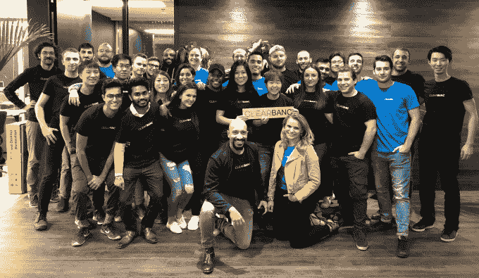
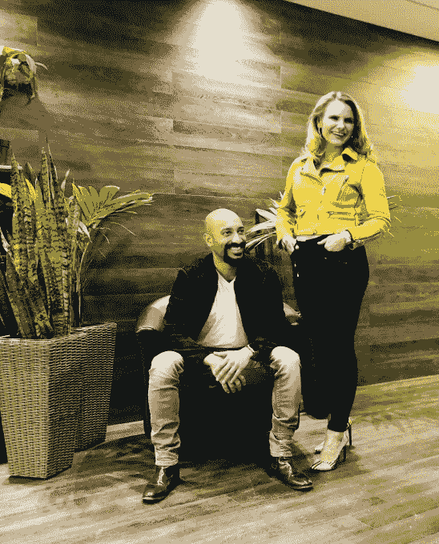

# Clearbanc 筹集 7000 万美元，为初创公司提供 rev 份额的广告资金 TechCrunch

> 原文：<https://techcrunch.com/2018/11/12/clearbanc/?utm_source=wanqu.co&utm_campaign=Wanqu+Daily&utm_medium=website>

对于初创公司来说，出售股权来购买脸书和谷歌的广告是一笔糟糕的交易。Clearbanc 提供了另一种筹资方式。对于从营销支出中可靠赚取销售额的快速增长的企业，Clearbanc 提供 5000 至 1000 万美元的资金，以换取稳定的收入份额，直至其回报加上 6%的费用。Clearbanc 通过开发扫描商户条纹、脸书广告和其他账户的技术来评估财务健康和发展势头，从而挑选出符合条件的商户。今年已经发放了 1 亿美元。

联合创始人兼首席执行官 Andrew D'Souza 告诉我:“随着企业成功扩大规模，我们将继续为他们提供持续的资本。“我们的目标是成为成功企业的第一个也是最后一个支持者，让企业家不必参加数百次推介会议来维持公司资金。”

自从 2015 年被发现以来，Clearbanc 基本上一直在雷达下飞行，现在它自己有了一些重大的融资消息。它现在已经从种子基金和新一轮 A 轮融资中筹集了 7000 万美元，来自 Emergence Capital、Social Capital、CoVenture、Founders Fund、8VC 等，Emergence 的 Santi Subotovsky 加入了董事会。

“风险资本已经转移。“今天，40%的风险资本不是资助真正的研发，而是直接用于购买谷歌和脸书的广告，”德索萨声称(对于一些电子商务初创公司来说，这可能是真的，但 TechCrunch 无法验证所有初创公司的统计数据)。“股权是资助数字广告支出和可重复增长的最昂贵的方式。所以我们创造了新的东西。”

Clearbanc 诞生于两位连续创业者之间的天使投资联盟。D'Souza 建立了 Andreessen Horowitz 资助的社交招聘网站 Top Prospect，USV 支持的教育科技公司 Top Hat 和万事达卡组合生物认证可穿戴初创公司 Nymi。在麦肯锡工作一段时间后，他帮助筹集了超过 3 亿美元的风险投资，当时他开始与米歇尔·罗曼诺(Michele Romanow)共同投资，后者是加拿大版电视节目《鲨鱼池》(Shark Tank)的风险投资人。她创办了购物中心 Buytopia，收购了其他 10 家电子商务公司，并在 2014 年将折扣搜索 SnapSaves 出售给了 Groupon。

“我们开始一起投资一些我们将在龙穴看到的交易，并经常发现股权投资不是这些消费品公司的正确结构。“他们有很好的经济效益，也找到了合适的客户群，但往往在任何时候都不想退出这个行业，”德索萨回忆道。他们需要钱来获得更多的客户，扩大他们的营销努力和在线广告支出。所以我们开始做这些收入分成交易。"

他们都是工程师，建立了自动尽职调查的技术，寻找具有健康单位经济和客户获取成本的公司。这种合作发展成了 Clearbanc 和浪漫。“我们也是一对夫妇，所以我们经常在一起，”德索萨写道。初创公司之间的约会可能会有问题，但迄今为止似乎对 Clearbanc 有效。

Clearbanc 的团队

现在 Clearbanc 在 2018 年向 500 家公司注入了超过 1 亿美元，比如 Vinebox。订阅 wine box 公司利用 Clearbanc 增加会员数量，同时筹集 A 轮资金用于开发新产品。Clearbanc 的公司支付 5%的收入分成，直到投资加上 6%的回报。这对那些已经被证明是赚钱的公司来说是一笔大买卖，比如 Hunt A .黑仔，这是一个谋杀推理游戏订阅箱，已经筹集了 1 万美元，销售迅速。它不需要风险投资，现在已经从 Clearbanc 获得了 800 万美元来扩大业务。

Clearbanc 联合创始人 Andrew D'Souza 和 Michele Romanow

Clearbanc 在有机增长渠道关闭之际崛起。脸书、Instagram 和 Twitter 对算法反馈的无情优化压制了营销内容，除非企业愿意付费。如果没有免费的病毒传播机会，公司必须依靠风险投资或贷款来扭转局面，并向大型广告平台支付资金。这笔新资金也来自 iNovia Capital、Real Ventures、Portag3、Precursor、WTI、伯格鲁恩和 FJ 实验室，Clearbanc 计划在美国和加拿大完成交易后向海外扩张。它还将投资于建立意识和数据科学能力。

D'Souza 和 Romanow 必须对他们的技术有信心，因为一个错误的投资意味着他们可能永远无法收回他们的现金。“我们非常关注我们的承销和决策过程，因为如果我们犯了一个错误，我们可能会损失很多钱。与风险投资不同，我们不希望我们的大多数公司都失败，让赢家来弥补损失，”德索萨说。一个重大失误可能会让一系列其他投资的收益化为乌有。

与此同时，它必须打破企业融资的常规。初创公司立即寻求传统的风险或债务融资，这些融资可能依赖于他们资本表上已经存在的花哨名称，而商人则转向剥削性的在线贷款机构，这些贷款机构要求个人担保，并根据创始人自己的信用历史而不是业务来做出决定。

虽然风险较高、需要数年时间才能上市的硬科技初创公司仍需要风险投资，但一批新的直接面向消费者的产品和其他快速赚钱的初创公司已经在蓬勃发展，可以通过使用 Clearbanc 避免稀释他们的团队和投资者。德索萨总结道，“我们的整个职业生涯都是作为企业家度过的，我们希望建立一个新的资产类别来帮助企业家成长。”