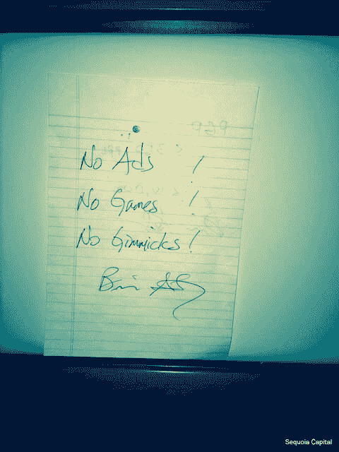
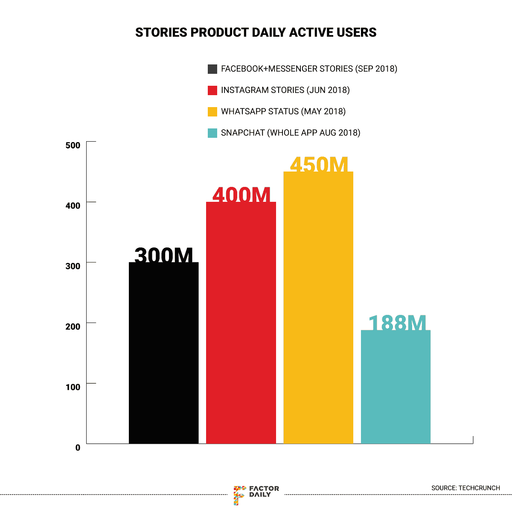
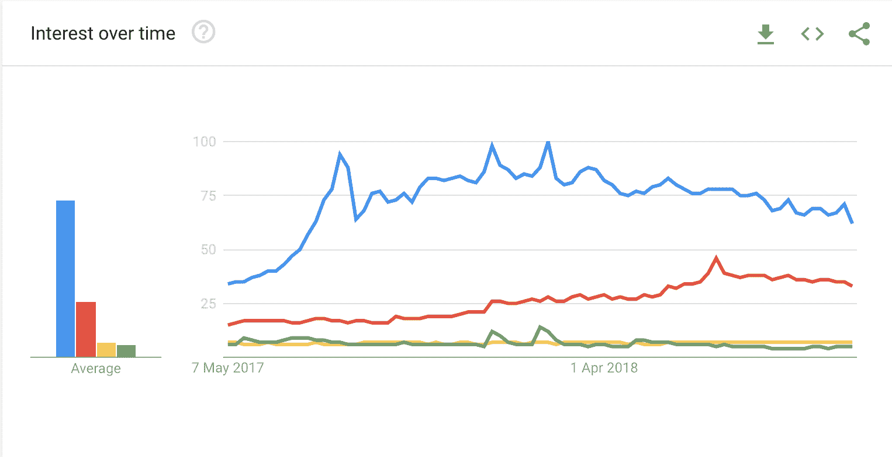
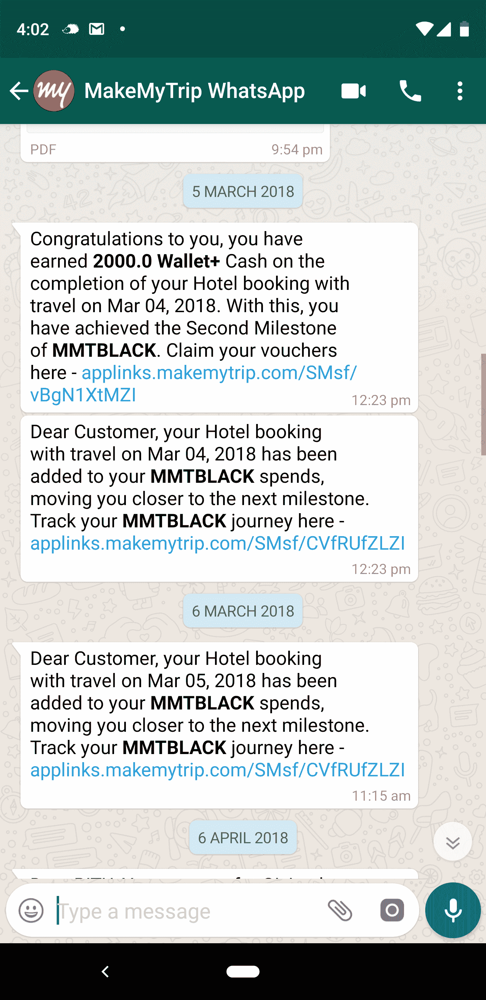

# WhatsApp 即将到来的商业化对该公司及其 15 亿用户意味着什么

> 原文：<https://factordaily.com/whatsapp-monetisation/?utm_source=wanqu.co&utm_campaign=Wanqu+Daily&utm_medium=website>

WhatsApp 是月活跃用户数[超过 10 亿](https://techcrunch.com/2018/01/31/whatsapp-hits-1-5-billion-monthly-users-19b-not-so-bad/)的即时通讯应用中唯一一款尚未开始真正盈利的应用。2016 年 11 月，报道 WhatsApp 测试版新功能的第三方网站 WABetaInfo、[报道称](https://twitter.com/WABetaInfo/status/794294922367082496)WhatsApp 将在[推出](https://www.androidauthority.com/whatsapp-testing-snapchat-stories-like-status-feature-726697/)类似 Snapchat Stories 的功能。我发现这非常有趣，并预测这一功能将导致 WhatsApp 上的广告。
我的预言在 2018 年 8 月实现了。

*我的预测(链接略详细一点的[这里](https://www.facebook.com/HalfRebel/posts/10154707384864766)脸书*上
我的思路接着就这样走了。尽管 WhatsApp 当时一贯的公开立场是反对任何形式的广告(我将在下面的文章中更多地谈到这一点)，但我认为 Stories 是一个公共订阅源，用户的隐私不会受到侵犯，引入广告也不会让人感觉像垃圾邮件。在正常的 P2P 消息传递体验中，在聊天对话之间添加广告可能会感觉非常垃圾，并且如果用户在紧急情况下使用 WhatsApp，例如当用户在医疗情况下需要亲密朋友或亲戚的紧急帮助时，可能会引起用户的极大不适。WhatsApp 是一家高度以用户为中心的公司，它似乎不太可能通过引入广告来损害 P2P 即时通讯体验。然而，考虑到 WhatsApp 尽管购买了 230 亿美元，但并没有做任何重要的事情来实现商业化，在我看来，它可能会在用户的个人隐私似乎不会受到太多阻碍的公共订阅源上进行广告试验。可以肯定的是，我不是唯一一个答对的人。采访过 WhatsApp 两位创始人的《福布斯》记者帕米·奥尔森(Parmy Olson)在 2017 年 2 月独立做出了[相同的猜测](https://www.forbes.com/sites/parmyolson/2017/02/20/whatsapp-status-snapchat-snap-stories/#f5b21264e1f7)关于 WhatsApp 上通过类似故事功能(我的预测是去年 11 月)出现的广告。WhatsApp 在 2018 年 8 月宣布，它将通过 WhatsApp Status 在其平台上推出[广告，这是一个应用程序上的小型内容提要，用户发布的内容在发布 24 小时后就会消失，类似于 Instagram 或脸书或 Snapchat Stories。在同一份声明中，WhatsApp 还表示，它将推出](https://gadgets.ndtv.com/apps/news/whatsapp-status-ads-coming-in-2019-1894258)[商业应用编程接口账户，以帮助企业](https://marketingland.com/facebook-looks-to-monetize-whatsapp-with-new-business-api-ads-that-open-chats-in-the-messaging-app-245311)接触 WhatsApp 上的客户，并允许企业在脸书上投放广告，以开始与 WhatsApp 上的客户进行对话。这三项举措有望启动 WhatsApp 的商业化。
披露:2012 年至 2015 年，我在微信工作，微信是 WhatsApp 在全球的竞争对手。然而，WhatsApp 的商业化故事并不像在一个拥有超过 15 亿用户的平台上投放广告那么简单。这款应用被认为是一款反广告应用，全球每一个智能手机用户都可以用它来与他人交流，并在这个过程中取代短信。当脸书在 2014 年收购 WhatsApp 时，它承诺 WhatsApp 完全独立，早期迹象表明，WhatsApp 将继续其最初的使命，因为它在其平台上推出了端到端加密，这使得 WhatsApp 上几乎不可能出现任何形式的广告，因为该应用当时没有也无法捕捉几乎任何有意义的数据来提供有针对性的广告。但在敌意收购比友好收购更常见的一系列事件中，脸书接着强迫 WhatsApp 和脸书的其他产品共享数据，这在很大程度上淡化了 WhatsApp 的反广告立场，让该公司的创始人感到失望和痛苦，并退出了他们自己的公司和产品，我将在下面详细解释这一点。随着 WhatsApp 的发展，它也成为了假新闻的温床，通过实现宣传共享和因未经检查的错误信息造成私刑暴民而夺走生命，威胁着民主。
尽管存在这些纠纷和负面发展，WhatsApp 仍然是一款深受数十亿人喜爱的应用。但是，尊重用户隐私与实现盈利广告之间的摩擦，以及让企业与用户沟通与控制错误信息和垃圾邮件的传播之间的摩擦，仍然是该公司的公开问题，这可能是商业化仍然没有在平台上公开推出的原因。在这篇文章中，我研究了 WhatsApp 宣布的每一项商业化举措可能会取得怎样的成果，它们成功的几率，以及它们对该应用用户的潜在影响。首先，有必要快速回顾一下 Whatsapp 与广告“理念”的混乱关系。

## WhatsApp 最初是建立在反广告风气的基础上的

众所周知，WhatsApp 从一开始就有反对广告的公开立场。WhatsApp 的两位联合创始人之一布莱恩·阿克顿(Brian Acton)几乎从内心深处厌恶广告，他曾在 WhatsApp 的另一位联合创始人兼原首席执行官简·库姆的办公桌上贴了一张“没有广告，没有游戏，没有噱头”的纸条，几乎可以说是 WhatsApp 的指导原则。在 WhatsApp 之前，WhatsApp 的两位联合创始人都曾在雅虎工作，雅虎是当时领先的科技公司，过去几乎所有的收入都来自广告。在脸书收购案后接受《连线》采访时，阿克顿解释了他对广告的反感，他说:“我在雅虎工作！在购物领域，人们一直在争论是否应该在页面上放置更多的广告和标识。它留下了不好的味道。”

布里安·阿克顿的笔记，就保存在简·库姆的书桌上。来源:红杉资本

在商业化方面，WhatsApp 最初在除 iOS 之外的所有平台上都是免费的，在 iOS 上，它的终身费用为 1 美元(后来改为每年 1 美元的订阅费)。收购脸书后，WhatsApp 在所有平台上都免费了。即使在 2014 年 2 月脸书收购后的采访中，创始人也自豪地展示了“没有广告，没有游戏，没有噱头”的口号，并谈到他们对基于广告的商业模式的蔑视和对用户隐私的尊重。至于商业化，Koum 在 WhatsApp 博客上写了一篇[文章，他提到了探索非广告收入模式，写道:](https://blog.whatsapp.com/615/Making-WhatsApp-free-and-more-useful)

“自然，人们可能会想，我们计划如何在没有订阅费的情况下保持 WhatsApp 的运行，以及今天的声明是否意味着我们正在引入第三方广告。答案是否定的。从今年开始，我们将测试一些工具，让你可以使用 WhatsApp 与你想听到的企业和组织进行交流。这可能意味着与你的银行沟通最近的交易是否是欺诈性的，或者与航空公司沟通航班延误的情况。我们今天都在其他地方获得这些信息——通过短信和电话——所以我们想测试新的工具，让这在 WhatsApp 上更容易做到，同时仍然给你没有第三方广告和垃圾邮件的体验。”

出于对隐私的关注，WhatsApp 甚至在 2016 年 4 月在平台上推出了[端到端加密。
消息和社交应用的另一种盈利模式主要是由腾讯建立的，腾讯拥有微信，这是一款在中国非常受欢迎的消息应用，它已经建立了一个由打车、支付、电子商务等组成的超级应用生态系统](https://techcrunch.com/2016/04/05/whatsapp-completes-end-to-end-encryption-rollout/)。在消息传递体验之上。腾讯是全球最大的游戏公司之一，它使用消息作为社交层，帮助用户发现并与朋友和社区一起玩游戏。但到目前为止，WhatsApp 从未表现出任何建立这样一个超级应用生态系统或游戏平台的倾向，坚持其作为一家专注于技术的公司的根基。

## WhatsApp 如何逐渐向广告开放

当 WhatsApp 被出售给脸书时，两家公司最初都声称不会在两个实体之间共享数据，它们将继续完全独立运行。甚至脸书的首席执行官马克·扎克伯格也对[说](https://techcrunch.com/2014/02/19/whatsapp-will-monetize-later/)“我个人不认为广告是信息货币化的正确方式。”然而，在 2017 年 4 月，也就是在 WhatsApp 上实施端到端加密后的一段时间，脸书改变了立场，转而[强迫 WhatsApp 用户与脸书](https://twitter.com/PrivacyMatters/status/1055376877311922176)分享他们的一些个人数据点，或者完全停止使用 WhatsApp，导致 Koum 和 Acton 出现裂痕，最终导致 WhatsApp 的[联合创始人离开](https://www.theguardian.com/technology/2018/apr/30/jan-koum-whatsapp-co-founder-quits-facebook)。这种数据共享包括移动号码的关键[数据点和某些其他特征，例如最后看到的、设备标识符、操作系统，以及可能与](https://techcrunch.com/2016/08/25/whatsapp-to-share-user-data-with-facebook-for-ad-targeting-heres-how-to-opt-out/)聊天的人的移动号码[等。脸书声称这样做是为了减少 WhatsApp 上的垃圾邮件，并通过在脸书上提供更好的朋友建议和提供更好的脸书广告来改善用户体验。虽然 WhatsApp 或脸书没有解释这到底是如何运作的，但一种可能的情况是，如果一个人经常在 WhatsApp 上与一个人聊天，但在脸书不是这个人的朋友，那么这个人现在可能会在脸书上显示为朋友建议。类似地，这些信息也可以用于改善脸书的新闻推送，方法是优先显示来自 WhatsApp 上密友的内容(他们经常在 WhatsApp 上聊天)，因为印度等新兴市场的大多数 P2P 对话实际上都发生在 WhatsApp 上，而不是 Facebook Messenger 上。因此，脸书有可能使用 WhatsApp 对话图中的信号来改善其好友建议和新闻推送体验。
由于脸书和 Whatsapp 在收购 WhatsApp 时](https://gizmodo.com/people-you-may-know-a-controversial-facebook-features-1827981959)[没有披露这种数据共享的可能性](https://twitter.com/RMac18/status/1044922916197081088)，欧盟[对脸书罚款 1.22 亿美元](https://www.reuters.com/article/us-eu-facebook-antitrust/eu-fines-facebook-110-million-euros-over-whatsapp-deal-idUSKCN18E0LA)。但在某种程度上，这整个事件预示着未来的事情，因为从这一刻起，脸书和 WhatsApp 都成了改善广告的同谋，即使是在脸书。关于在 WhatsApp Status 上投放广告，我个人认为这并没有从根本上违背 WhatsApp 的核心精神。在收购时，库姆在公司的博客上写道:“你(WhatsApp 用户)仍然可以指望绝对不会有广告打断你的交流。”由于在 WhatsApp 上放置广告不会中断两个用户之间的 P2P 通信，因此可以认为这并没有真正打破 WhatsApp 的核心理念。《华尔街日报》报道了库姆在脸书的最后一天，证实了库姆个人对 WhatsApp 上的广告没有意见，这不是脸书强加给 WhatsApp 的。这个故事描述了 2018 年 4 月 Koum 与 WhatsApp 和脸书员工的[全体会议:](https://www.wsj.com/articles/behind-the-messy-expensive-split-between-facebook-and-whatsapps-founders-1528208641)

“一名员工向他(库姆)询问了 WhatsApp 的广告计划。据了解库姆言论的人说，他首先回应说，他对广告的反感是有据可查的。但据知情人士透露，库姆补充说，如果真的有广告，把它们放在 Status 中是侵入性最小的方式。

从根本上打破脸书在收购 WhatsApp 时的独立性承诺的，不是在 WhatsApp 的状态上引入广告，而是脸书通过强制在 WhatsApp 上共享数据，损害了 WhatsApp 的用户隐私核心价值。虽然强制数据共享对脸书从 WhatsApp 上赚更多钱的计划至关重要，但这一举措也有更深层次的影响。尽管是一个端到端的加密网络，但脸书今天几乎知道大多数 WhatsApp 用户的一切，以便在 WhatsApp 状态上向他们显示完全有针对性的广告，从而侵犯了他们的用户隐私。

## 如果没有有意义的用户数据，WhatsApp 上的广告定位将如何工作？

WhatsApp 推出广告的棘手之处在于，它是一个端到端的加密平台。所以它对消息对话的内容一无所知，包括[语音和视频](https://blog.whatsapp.com/10000646/Group-Calling-for-Voice-and-Video-Is-Here)通话、[直播地点](https://blog.whatsapp.com/10000634/Share-your-live-location)，或者 [WhatsApp 状态](https://blog.whatsapp.com/10000630/WhatsApp-Status)。因此，除了[的基本信息](https://www.forbes.com/sites/thomasbrewster/2017/01/22/whatsapp-facebook-backdoor-government-data-request/#a45818d1030c)之外，比如用户的手机号码、姓名(可选)、最后一次见面时间以及聊天对象的手机号码，它知道的不多。即使可以，它选择[不收集](https://blog.whatsapp.com/529/Setting-the-record-straight?) GPS 位置。虽然 WhatsApp 拥有超过 15 亿的月活跃用户，但在其平台上发布广告需要解决一些与广告工作方式相关的基本问题。WhatsApp 没有任何目标信息，如年龄、性别、兴趣、行为数据等。运行没有任何针对性的广告会伤害 WhatsApp 用户的体验，也会浪费广告商的营销资金。例如，向有新生婴儿或学步儿童的父母展示尿布广告可能会为尿布制造商带来一些有利可图的转化，但同样的广告可能会浪费在单身汉或老年人身上。
在缺乏任何有意义的目标数据的情况下，WhatsApp 别无选择，只能依靠脸书或 Instagram 提取用户的目标数据来投放广告。由于用户可能会在 WhatsApp 以及脸书和 Instagram 上使用同一个手机号码，WhatsApp 可以从后两者获得目标数据，这两者都有足够的用户数据来开展优质的营销活动，这一点在脸书公司数字广告的市场份额不断增加中显而易见。
然而，由于这种策略依赖于电话号码作为匹配身份，因此，想要避免在 WhatsApp 上做广告的用户可以选择从脸书和 Instagram 上删除他们的电话号码，或者只是在他们的脸书和 Instagram 个人资料中添加一个不同的手机号码(在印度等经常使用双卡手机的国家，这很容易做到)。另一个选择是使用广告 id，这是一个对每个移动设备都是唯一的标识符，由移动操作系统提供给互联网广告玩家，作为脸书系列应用程序之间的通用标识符。由于 WhatsApp 是一款移动消息应用程序(访问网页版需要 WhatsApp 移动应用程序处于活动状态并连接到互联网)，而且大部分脸书和 Instagram 用户都通过手机访问这些服务，因此一个通用的广告 id 可以更容易地在脸书的应用程序家族中识别出同一用户。
最近，10 月 17 日，WABetaInfo 注意到 WhatsApp 测试版中的一个功能，用户将被要求[将其 WhatsApp 账户链接到 Instagram 或脸书账户](https://wabetainfo.com/whatsapp-is-developing-a-linked-accounts-feature-vacation-and-silent-modes/)。WABetaInfo 希望这项功能能够通过 WhatsApp 恢复一个人的脸书账户，或者将一个人的 WhatsApp 状态更新自动分享到 Instagram 和脸书。后者看起来像是真正的消费者价值，因为它消除了创建一条内容并手动将其发布到多个脸书应用家族的痛苦。它还有助于为脸书的核心产品植入内容，随着年轻用户避开脸书，这一产品的使用逐渐减少。但作为一个额外的优势，WhatsApp 和脸书/Instagram 账户之间的联系也有助于解决广告定位问题。在缺乏明确的用户同意的情况下，或者在用户已经将他们的手机号码从脸书和 Instagram 上解除链接，但用户已经明确链接了帐户的情况下，基于脸书全球通用手机号码或跟踪广告 id 的假设的广告模式可能会受到监管机构的质疑。

## WhatsApp 上的广告有积极的迹象，但也有一些担忧

WhatsApp 商业化的好消息是，WhatsApp 状态用户的数量一直在持续上升。在所有脸书应用中，WhatsApp 的 Stories 功能版本的日用户数最高，为[4.5 亿用户](https://techcrunch.com/2018/05/01/whatsapp-stories/)。由于脸书预计故事[很快会超过 Feed 分享](https://techcrunch.com/2018/05/02/stories-are-about-to-surpass-feed-sharing-now-what/)，这对 WhatsApp 的盈利是个好兆头。

谷歌趋势分析也证明了这一点。

来源: [Google trends](https://trends.google.com/trends/explore?date=2017-05-07%202018-11-09&q=whatsapp%20status,instagram%20story%20%2B%20instagram%20stories,facebook%20story%20%2B%20facebook%20stories%20%2B%20messenger%20story%20%2B%20messenger%20stories,snapchat%20story%20%2B%20snapchat%20stories)
显然，WhatsApp 版本的 Stories 功能似乎有着非常好的使用率和参与度。然而，脸书的首席运营官雪莉·桑德伯格在最近的一次投资者电话会议上提到，这些报道可能会对盈利产生担忧，他说:“问题是，这些(报道)会像新闻一样赚钱吗？我们真的不知道。”由于故事广告目前是可以跳过的，用户可以很容易地跳过它们。由于脸书预计新闻报道在分享方面将超过新闻推送，投资者开始担心新闻报道是否会为脸书带来丰厚的利润。然而，TechCrunch 的 Josh Constine 预计，脸书的应用程序世界将在故事中实现不可抓取的广告，并以高价将其变现。技术和战略方面的知名作家 Ben Thompson 认为，由于故事导致更高的视频内容消费，它实际上是品牌广告的理想选择，因此是脸书更适合的商业化形式，该公司长期以来一直试图将其定位从业绩驱动的营销平台转变为品牌广告做得好的地方。
尽管 WhatsApp 的使用状况看起来很健康，但 WhatsApp 的主要用户群还是在新兴市场，如印度、巴西、墨西哥、印尼、俄国、西班牙等。与美国、德国、日本等发达市场相比，这些市场的广告收入可能较低。WhatsApp 用户较少的地方。因此，尽管从长期来看，WhatsApp 上的广告可能会成为脸书的赢家，但在新兴市场赶上之前，绝对收入数字在短期内可能会较低。

## 货币化的其他领域呢

WhatsApp’s other approach to monetisation is [business API](https://www.whatsapp.com/business/api) accounts where businesses would be charged a certain amount of money for sending messages to users on WhatsApp. These messages, too, are [end-to-end encrypted](https://developers.facebook.com/docs/whatsapp/faq/). The pricing of these messages is at a premium compared to SMS costs. Taking the example of India which is the largest market for WhatsApp with [200 million](https://mashable.com/2017/02/24/whatsapp-india-200-million-active-users/) monthly active users, the typical costs for a business to send a message on WhatsApp would be almost [7x compared to routine SMS](https://twitter.com/kshashi/status/1024910896546627584?s=09) costs (10 paise versus 70 paise), though businesses may still use WhatsApp because of high delivery rates for WhatsApp compared to SMS. In India, SMS usually have 50% failure rate due to incorrect numbers, or users changing numbers often due to India largely being a pre-paid market, or the number being on the do-not-disturb registry mandated by the government. To make the deal sweeter, WhatsApp has announced plans to provide an [incentive of lower messaging costs](https://techcrunch.com/2018/08/01/whatsapp-business-api/) to businesses who respond to their customers faster.
As compared to other messaging platforms like Messenger, WeChat and LINE, the business API account experience on WhatsApp is different in the sense that a user doesn’t have to go and follow the business account explicitly on WhatsApp by himself/herself. Instead, whenever a user does a transaction at an external service like a ticket booked on MakeMyTrip or a movie on BookMyShow etc., after the purchase, the user get a “default opt-in” option to receive alerts and messages related to the booking on WhatsApp. (One can choose to opt out but most users usually always go ahead with the default option.) Hence, instead of receiving transactional alerts on SMS after booking a transaction, one would start receiving such messages and alerts on WhatsApp. From a consumer’s point of view, the benefit is that one usually gets the ticket or booking details in a richer media format such as image rather than a plain SMS text.
However, the risk with such an approach is that in the long term, it could devolve into a very spam-like experience for the end-users. Currently, WhatsApp has opened up its business account APIs to only a limited set of businesses and from my private conversations with a couple of Facebook account managers, it seems it is still open to only around 90 to 100 businesses in India such as MakeMyTrip, BookMyShow etc. However, as this scales to a self-serve model similar to how Facebook Pages or Twitter accounts with a self-serve advertising model are currently run, there is a big risk of WhatsApp users suffering from spam. Since WhatsApp isn’t really validating at its end whenever a user is actually giving consent for receiving messages from a business, spammers and unscrupulous businesses can keep creating new WhatsApp business API accounts, send spam on WhatsApp, get blocked after reporting, and again create new accounts. Spam on WhatsApp is even more problematic than Facebook or Instagram since each WhatsApp message arrives as a notification and, hence, breaks a user’s attention. To avoid this, WhatsApp would have to ensure that WhatsApp business API accounts are manually approved only to high-quality businesses. While this last step may ensure quality, it also means monetisation may remain limited.
In any case, businesses may choose to create gamification-based scenarios which aren’t really about useful informational alerts. Here, I am sharing a personal experience of an alert message from online travel agent MakeMyTrip, where it is spamming me about its in-app currency and loyalty program that I have no interest in. Since MakeMyTrip is an important app which I often use for booking hotels and flights, I don’t really wish to block or unfollow its WhatsApp account but there is no way for me to unsubscribe from, say, “promotional” alerts or specific alerts related to “MMT Wallet+ Cash”.

Screenshot of MakeMyTrip spamming me about its loyalty program/wallet called MMTBlack, which I have no interest in using or getting updates about.

How do other messaging apps manage this? In the case of Messenger, Facebook’s other messaging app, businesses can only send messages to those users who are following them on Messenger. Hence, there is technically no “spam” there. If a business account sends too many notifications and messages to a user, it is likely to get unfollowed.
In the case of WeChat, It creates two categories of business accounts: [Subscription accounts and Service accounts](https://walkthechat.com/wechat-public-accounts-difference-subscription-service-accounts/). Subscription accounts can send one message per day to the user, and all the messages from a Subscription account go inside a specific sub-section which never sends any notifications or alerts to users. If a user is explicitly interested in a business, s/he can go inside the sub-section and then consume the content and messages sent by the businesses. The second category of business account on WeChat – a Service account – can only send one message per week and those messages appear in the main messages section. Usually, a very limited number of accounts are allowed to become a service account and the content has to be purely transactional in nature. In both subscription as well as service accounts, if a user replies to a business’s message, the business can then reply to the user any number of times for the next 48 hours. If users complain about the account’s content or unfollow it, the account is quickly blocked. In either case, WeChat doesn’t charge the businesses for sending messages to users and, hence, isn’t critical to the app’s monetisation.
Going ahead, to control the problem of too many business messages cluttering up the inbox of users, one may expect that WhatsApp would probably follow a similar model with regards to its business accounts where it would push the messages from businesses into the background. But this also means that businesses may question why should they pay a premium pricing over SMS to WhatsApp for delivering a message. If WhatsApp is able to build capabilities to organise messages like some apps in India have done with SMS inboxes (e.g.: Microsoft [SMS Organizer](https://www.androidcentral.com/microsoft-sms-organizer-perfect-messaging-app-you-can-only-use-it-india), TrueCaller, PayTm, [Walnut](https://play.google.com/store/apps/details?id=com.daamitt.walnut.app) etc.), it may be able to provide a better experience. (Disclosure: I work at Walnut, an SMS-based personal expense manager.) Even Apple, with its new iOS 12 update, seems to be moving towards a similar SMS spam [reporting solution](https://9to5mac.com/2018/06/09/ios-12-spam-calls-and-texts/), that’s open to third-party developers. So, it’s not clear yet if businesses moving their alerts from SMS to WhatsApp is a better experience for the end-users.
Lastly, WhatsApp’s third initiative for monetisation is around allowing businesses to run ads on Facebook or Instagram to start a conversation with their customers on WhatsApp. As Shannon Liao of [The Verge notes](https://www.theverge.com/2018/8/1/17636418/facebook-whatsapp-ads-monetize) that a similar initiative on Facebook Messenger hasn’t seen much traction, “The message function on WhatsApp is nearly identical to the one on Facebook, where you can go to a business’s page and send a message. Business communications on Messenger haven’t been super successful to begin with, and Facebook has had to [roll out additional chat](https://www.theverge.com/2017/11/30/16720458/facebook-messenger-customer-chat-open-beta-public) extensions to compensate.“ While theoretically this ability to start a conversation with a business from an ad or a company’s website might be genuinely useful from a consumer point of view, the revenue from this initiative ideally should really go into Facebook’s bucket, as the actual ad is being run on Facebook or Instagram newsfeeds. The problem with this kind of advertising is that it also risks undermining Facebook’s advertising model itself. After all, once a consumer clicks on a Facebook ad to start a conversation with a business on WhatsApp, that business may not need to advertise on Facebook in future. It can just keep messaging the customer directly on WhatsApp by providing personalized deals, offers and content, thereby, risking the core business model of Facebook which is that brands and businesses have to use Facebook to reach to their consumers consistently and repeatedly.

## WhatsApp 支付呢？

WhatsApp 支付功能目前只在该即时通讯平台最大的市场印度推出。WhatsApp Payments 基于支付基础设施层 UPI，该层允许从任何印度银行账户向任何印度银行账户进行即时转账。谷歌已经在印度推出了独立的 UPI 支付应用程序，Google Pay，并声称该应用程序每月有 2200 万活跃用户。合众国际社支付领域的其他主要参与者包括 PayTm(由中国阿里巴巴支持)和 Flipkart 支持的 PhonePe (Flipkart 现由沃尔玛所有)，以及一些银行应用程序。虽然 WhatsApp 也在大约六个月前[在其应用程序上推出了 UPI payments](https://qz.com/india/1307771/whatsapp-is-testing-payments-feature-in-india-with-a-million-users/) ，但只有[的支付玩家](https://economictimes.indiatimes.com/tech/internet/whatsapp-feels-payment-services-are-getting-unfair-treatment-in-india/articleshow/65523355.cms)仍未获得必要的[批准](https://economictimes.indiatimes.com/news/economy/finance/whatsapp-it-ministry-asks-payments-corp/articleshow/64408662.cms)将支付规模扩大到超过 100 万用户，除非它遵守所有当地法律法规，例如仅在印度本地存储支付数据和适当的多因素认证。与此同时，WhatsApp 的本地竞争对手 PayTm 和 PhonePe 一直在[游说](https://blog.phonepe.com/data-localization-why-this-kolaveri-di-6d5680e3f012)针对 WhatsApp 的[更强有力的监管](https://www.businesstoday.in/technology/news/paytm-boss-vijay-shekhar-sharma-furious-whatsapp-upi-feature-approach-authorities/story/270722.html)使其处于劣势。然而，尽管有这些问题，WhatsApp 最终应该能够在其应用程序上推出 UPI 支付，而且由于几乎每个拥有智能手机和活跃互联网连接的印度人都在使用它，人们普遍预计 WhatsApp 应该能够从 P2P 支付中获得可观的份额。
随着印度不断发展的监管和[激烈的](https://www.medianama.com/2018/09/223-policy-wars-after-whatsapp-paytm-trains-its-guns-on-google-pay/) [游说](https://yourstory.com/2018/09/google-pay-clarifies-privacy-policy-following-paytms-notice-npci/)场景，谷歌或 WhatsApp(以及脸书)等公司很可能无法将 UPI 支付数据用于任何与支付无关的目的，例如建立用户的广告档案。虽然从短期来看，这限制了 WhatsApp 支付的商业化潜力，但从长期来看，通过 WhatsApp 支付的用户可能会更关注该应用，并可能会在该应用上花费更多时间。此外，印度的许多银行计划通过向用户提供透支 UPI 手柄向他们提供小额贷款，这是一种基于 UPI 的信贷产品，Google Pay 已经在推出这一功能。WhatsApp 最终也将提供同样的服务，如果 WhatsApp 获得有意义的支付份额，当消费者选择通过透支 UPI 手柄向商家和企业付款时，WhatsApp 也可以获得一小部分贷款收入。

## 我们应该从 WhatsApp 的商业化计划中期待什么

在许多方面，WhatsApp 最近已经成为脸书应用程序世界中的一个问题儿童。虽然它拥有超过 15 亿每月活跃用户的惊人用户群，他们喜欢使用该应用程序，但该平台上未经检查的假新闻和错误信息已经在世界许多地方引发了暴力、私刑和骚乱。由于该平台是端到端加密的，WhatsApp 声称，除了实施一些纯粹的技术解决方案，如限制“每次转发 5 个人的聊天”，显示“转发”的消息标签，以及授权群组管理员限制谁可以在群组中发送消息，谁不可以，等等，它无能为力。今年早些时候，Harsh Taneja 和我在《哥伦比亚新闻评论》中写道，WhatsApp 可以在不破坏端到端加密的情况下，通过仅使用元数据并在“报告”消息中添加一个允许内容审核的功能，来遏制假新闻在其平台上的传播。在巴西，研究人员[认为](https://www.nytimes.com/2018/10/19/technology/whatsapp-brazil-presidential-election.html)WhatsApp 应该增加对转发的严格限制，尽管有新闻报道称[已经成功地通过找出新的黑客手段绕过了](https://www1.folha.uol.com.br/poder/2018/10/empresarios-bancam-campanha-contra-o-pt-pelo-whatsapp.shtml) WhatsApp 的转发限制。然而，由于其商业应用编程接口账户，存在一个巨大的风险，即希望传播宣传的政党或坏人可能会滥用 WhatsApp 向数百万人分享错误信息。一个人需要做的就是在 WhatsApp 上获得一个商业 API 账户，考虑到脸书最近的经历，这个过程似乎已经很容易被滥用，上传一个电话号码列表，声称每个人都允许被联系，并向数百万人发送宣传信息。尽管 WhatsApp 正试图在其平台上打假新闻之战，但通过其商业 API 账户途径实现商业化仍然充满了潜在的滥用，在最糟糕的情况下，可能会危及生命。WhatsApp 和脸书都需要小心行事。考虑到 WhatsApp 仍未获得任何收入，人们可以预计，脸书正面临越来越大的压力，要求 WhatsApp 实现某些商业化。根据公开的媒体证据，包括引用 WhatsApp 联合创始人和脸书高管的话，商业化和尊重用户隐私之间的斗争似乎是 WhatsApp 创始人离开公司的根本原因。当 WhatsApp 强制要求与脸书共享手机号码等一些基本信息时，起初许多观察人士认为这无关紧要，因为 WhatsApp 仍保持端到端加密，聊天内容仍禁止进入脸书。然而，正如我在上面解释的那样，这个看起来简单的行为现在意味着所有 WhatsApp 用户的用户隐私已经被永久泄露，这一行为将永远困扰 WhatsApp 的创始人和全球其他隐私活动家。就广告收入而言，正如我在这篇文章中所说，假设 WhatsApp 能够解决广告定位和[监管审查的问题，那么从长远来看，WhatsApp 即将推出的广告很可能是赢家。至于 WhatsApp 的其他商业化举措，如商业应用编程接口账户，尽管可能有用，但也存在风险，即它们可能加剧困扰该平台的错误信息问题，导致潜在的垃圾邮件问题，或者可能无法证明企业或消费者从短信转向 WhatsApp 消息的合理性。尽管 WhatsApp 每月有 15 亿活跃用户，但它仍需要做一些工作来证明其 230 亿美元的收购价格。但由于它在用户增长或参与度方面没有遇到任何问题，因此它继续拥有充裕的时间，这在当今世界是罕见的。](https://techcrunch.com/2018/03/14/whatsapp-will-not-share-user-data-with-facebook-until-it-complies-with-gdpr-ico-closes-investigation/)

—

***关于作者:** Himanshu Gupta 是一位数字营销专业人士，对消息传递和社交平台有着浓厚的兴趣。他目前负责金融科技初创公司 Thumbworks Technologies 的增长。 Himanshu 在 2013 年至 2015 年期间领导了腾讯在亚洲的热门即时通讯应用微信的印度营销&战略。可以通过他的[博客](https://medium.com/@halfrebel)或[推特](https://twitter.com/halfrebel)账号关注他。*