# 程序化搜索引擎优化策略扎皮尔曾经达到 1.4 亿美元 ARR

> 原文：<https://ryanberg.co/how-zapier-reached-35m-arr-with-this-saas-seo-strategy/?utm_source=wanqu.co&utm_campaign=Wanqu+Daily&utm_medium=website>

> **2022 年 7 月更新:**我最初在 2018 年末写了 Zapier 的 SEO 策略。当时，程序化搜索引擎优化相对来说是闻所未闻的。
> 
> 跳到 2022 年，虽然程序化搜索引擎优化仍处于起步阶段，但它正迅速成为搜索引擎优化最令人兴奋的领域之一。无代码工具使得快速推出成千上万的 SEO 页面比以往任何时候都更容易。人工智能写作工具正在模糊编程和编辑内容之间的界限。
> 
> 如今，Zapier 的程序性登录页面比以往任何时候都更加成功。但是，在过去的几年里，情况发生了很大的变化，对于希望推出程序化 SEO 策略的公司来说，有很多新的考虑(和竞争)。
> 
> 因此，我想对这个案例研究做一个全面的修改，以探索今天的程序化 SEO 正在发生什么，以及接下来可能会发生什么。下面大约 70%的内容是全新的。让我们跳进来吧！

想通过 SEO 为你的 SaaS 带来更多的搜索流量吗？

在这个 SaaS SEO 案例研究中，我们将跳出大多数 SaaS 公司使用的常规内容营销策略。看看 Zapier 是如何利用 SEO 每月吸引数百万高意向搜索者购买他们的产品的。

这种策略与博客无关(尽管我们稍后会看看他们是如何添加博客来增强这种方法的)。

我们还将走过…

*   他们如何创建 70，000 个搜索优化的登录页面。
*   他们如何用独特的内容填充这些页面，而不用自己写。
*   他们如何启动每个页面，以产生一堆高质量的反向链接。
*   以及他们如何利用有机搜索创造更强大的网络效应。

Zapier 公司概述

Zapier 是一个应用程序集成和自动化平台，允许用户(主要是中小型企业)在不同的应用程序之间设置触发的操作和工作流。他们始于 2011 年，仅筹集了 130 万美元的风险资金，主要是

[bootstrapping their way to $140M ARR.](https://sacra.com/research/zapier-netflix-productivity/)

目前，他们的平台上有超过 5000 个应用程序。

## 每月捕获数百万高意向搜索者

根据 SimilarWeb 的数据，Zapier 每月有 580 万的访问量。

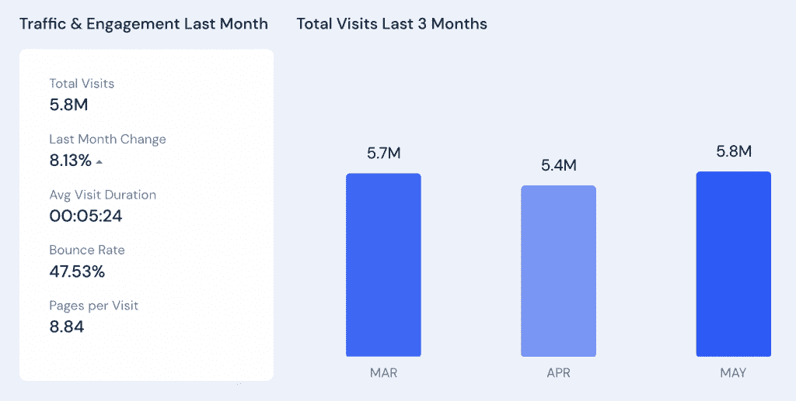

### 总流量中，超过一半来自搜索。

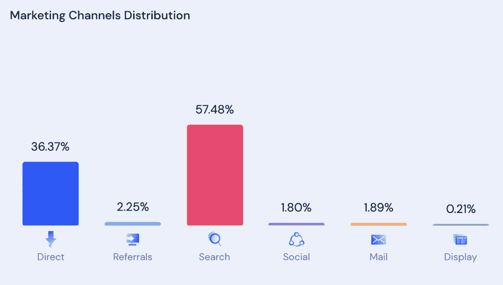

## 如何让看不见的东西凸显出来

像 SaaS 的其他中间件一样，Zapier 面临着拥有一个“看不见的”产品的挑战。他们的应用程序没有执行面向客户的操作，而是在幕后形成连接，以从现有应用程序中释放新的功能和价值。

Zapier 没有试图向用户推销集成工具的价值，而是在早期就意识到人们已经在寻找特定的集成。为了抓住这个现有的意图，Zapier 决定让他们的集成生态系统中的应用程序合作伙伴成为他们营销的明星，并利用他们的成功。

为此，他们为生态系统中的每个应用创建了三层登录页面:

1.  应用程序本身的登录页面。
2.  每个应用程序到应用程序的集成都有一个单独的登录页面，例如一个关于连接 Gmail 和 Trello 的页面。
3.  每个应用程序都有单独的登录页面，每个应用程序之间都存在应用程序触发的工作流或“zap”。

无论某人是在寻找一个应用的一般信息，如何将两个应用集成在一起，还是一个特定的应用到应用的用例或场景，Zapier 都有一个准备好的登录页面来捕捉这种意图。

这就产生了大量的登陆页面。根据 Ahrefs 的数据，这些登陆页面中有 69263 个排名在谷歌的前 100 位。**其中 18585 个页面至少有一个关键词的首页排名。**

## Zapier 关于扩展 70，000 个搜索优化登录页面的剧本

创建 70k 的登录页面是那些听起来疯狂的事情之一，没有一些黑客或变通办法。但是扎皮尔的“黑客”看起来更像是持续的努力，结合了智能系统思维和对 T2 SaaS 搜索引擎优化的深刻理解。

对于这种规模的登录页面，您可能会尝试使用某种可重复的内容模板，因为内容创建是最耗时的。只需为每个应用程序更改几个关键词，瞧，对吗？但是 Zapier 认识到了每一页独特的相关内容的 SEO 价值。

虽然他们的页面确实有模板化的结构和布局，但每个页面都有人工创建的应用程序描述和每个集成的摘要。我们不只是在谈论几行独特的文本，许多页面都有多段概述，深入探讨更深入的功能和优势。

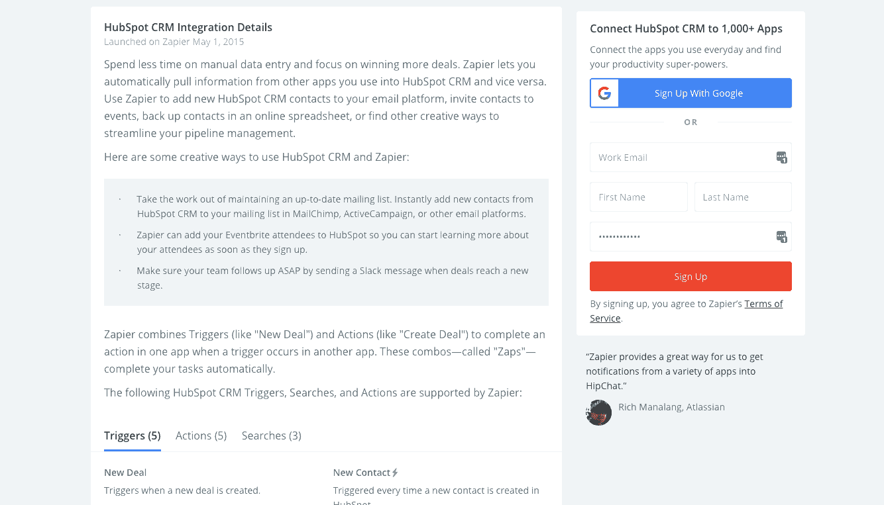

### *将 SEO 内容外包给合作伙伴*

但是，Zapier 没有自己编写所有这些内容，而是为加入和推出新的应用程序合作伙伴创建了一个剧本。入职流程的一部分包括让应用合作伙伴为这些登录页面编写内容。如果需要，它还包括 Zapier 团队的编辑指南，以清理内容，使其完全适合每个登录页面。

这不仅释放了最耗时的 SaaS SEO 元素之一，而且还从最了解每个应用程序用例的人(应用程序创建者自己)那里生成了最相关的内容。

### *将链接建设外包给合作伙伴*

Zapier 还利用合作伙伴的帮助来获得一些新登录页面的初始反向链接。他们的新应用入职流程包括:

*   让合作伙伴在他们的网站上建立一个链接到 Zapier 的整合页面。
*   让合作伙伴在他们的博客上发表文章宣布整合。
*   直接在合作伙伴的应用程序中添加几个热门“zaps”的链接。

这些合作伙伴推广策略不仅为 Zapier 带来了一批新用户，还提供了一组初始反向链接来帮助提升页面排名。然后是最初的曝光，这可能会让整合被写在行业博客上，或在社交媒体上分享。获得更多的反向链接。

## Zapier 从编辑驱动过渡到纯粹的编程方法

自从我最初在 2018 年概述他们的方法以来，Zapier 所做的最大变化之一是简化上述原始内容编辑流程。当时，他们已经使用合作伙伴编写的原创内容创建了大约 25，000 个登录页面。

跳到 2022 年，你可以看到他们已经在每个应用程序合作伙伴登录页面上切换到更短的原始内容片段。Zapier 的新应用程序合作伙伴在其他模板化的登录页面上只收到一行独特的文本，而不是合作伙伴编写的多段原创内容。

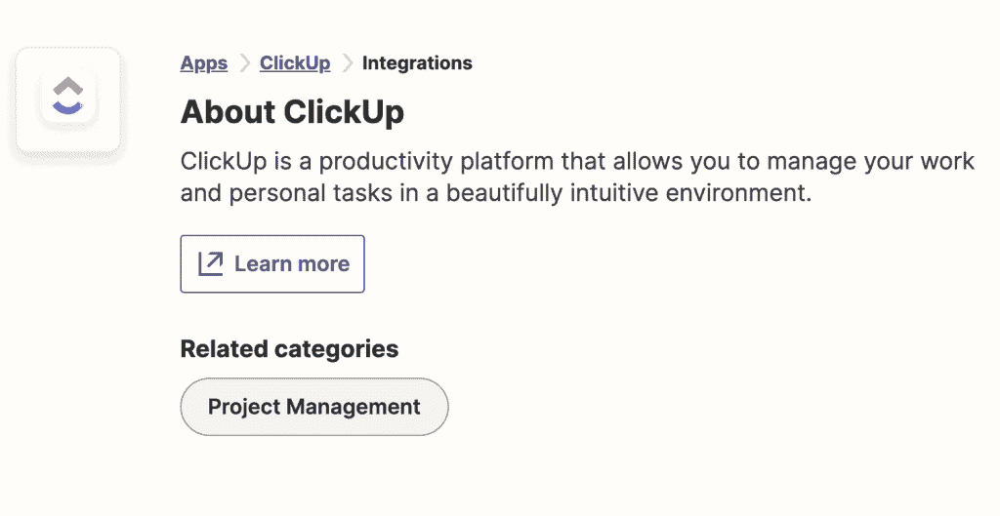

很难确定这一变化对 Zapier 的程序性页面排名的确切影响。

然而，如果我们看看 Ahrefs 的历史排名数据，我们可以看到，在过去几年中，Zapier 的登录页面的首页排名缓慢而稳定地下降。

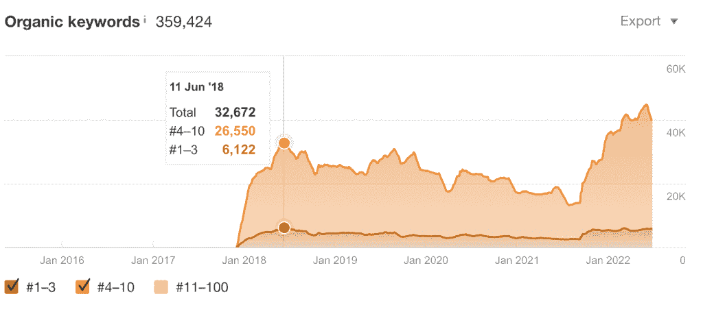

*Snapshot of ranking positions in the 1st-10th range*.

另一方面，我们可以看到，在过去的一年中，排名大幅提高，这表明纯粹的编程方法仍然非常有效(记住，旧的应用程序合作伙伴登录页面仍然包含较长形式的原始内容；只有较新的登录页面具有较短的原始内容片段)。

最近排名的上升很可能是由于最近引用域名(反向链接)的激增。然而，它仍然表明，通过正确的反向链接策略，具有最少原始内容的纯编程式登录页面可以获得很好的排名。

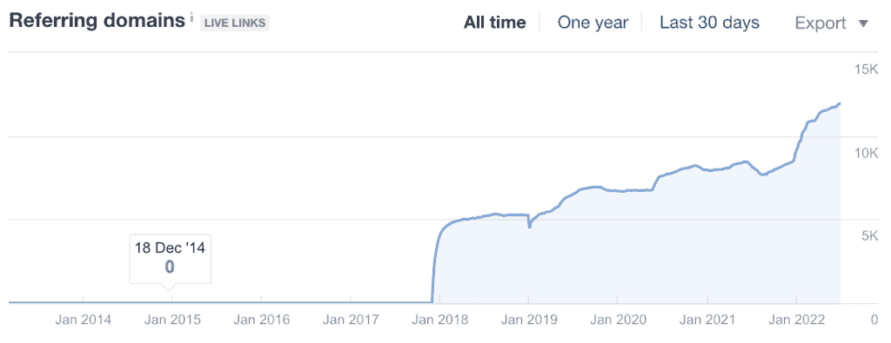

*Number of referring domains to app landing pages*.

## 用搜索引擎优化放大和保护你的网络效应

像 Zapier 这样的中间件 SaaS 平台是 SaaS 网络效应最明显的例子之一。随着 Zapier 将新的应用程序合作伙伴添加到其集成列表中，其平台对最终用户来说变得更具吸引力和价值。平台吸引的终端用户越多，希望加入平台的应用就越多。这是一个良性循环。

Zapier 的程序化搜索引擎优化策略无缝地嵌入了这种网络效应，并放大了它的影响。每个新的应用程序合作伙伴都会带来一系列新的应用程序登录页面，这扩大了 Zapier 捕获高意向搜索者的能力。Zapier 从这种搜索流量中产生的新用户越多，该平台对新的应用合作伙伴就越有吸引力。这导致了更多的应用程序登录页面。又一个良性循环。

这些登录页面还对 Zapier 不断扩大的网络产生了保护作用，基本上围绕着一个“收购护城河”，如果竞争对手想要有效地与 Zapier 竞争，他们必须跨越这个“收购护城河”。这给进入同一领域的新竞争者增加了额外的难度。

这与付费搜索和付费广告等获取渠道形成对比，付费搜索和付费广告可以让你迅速扩大你的受众范围，但由于维持付费获取的成本较高，这对于长期保护你的网络并不理想。

## 但是程序化搜索引擎优化能提供多大的保护呢？

四年过去了，我们对 Zapier 的程序性登录页面“护城河”在隔离竞争方面的有效性有了更清晰的认识。

对于长尾来说，这些登录页面在 Zapier 的主要竞争中茁壮成长的低竞争关键词要么是 a)本地集成知识库页面，要么是 b)其他类似于 Zapier 的连接器服务。

由于这些关键字的低竞争性质，竞争对手很容易在结果的第一页与 Zapier 的类似程序性登录页面一起登陆。

然而，在许多情况下，Zapier 仍然处于领先地位——在结果中比竞争对手出现得更高。

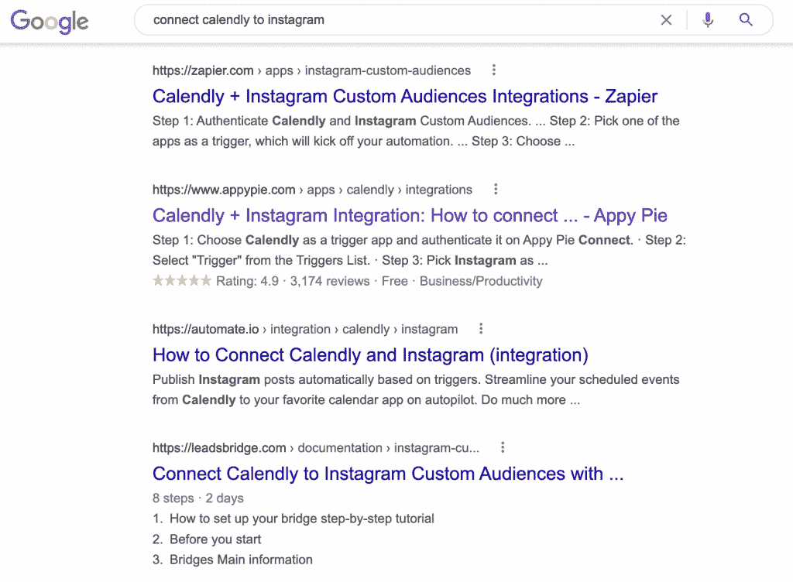

虽然出现在搜索结果的第一页可能看起来无关紧要，但这可能意味着 Zapier 正在从这些搜索中获得最大份额的流量。下面你可以看到来自 [Backlinko](https://backlinko.com/google-ctr-stats) 的数据，这些数据凸显了你的排名对你从搜索者那里获得的真实点击量有多重要。

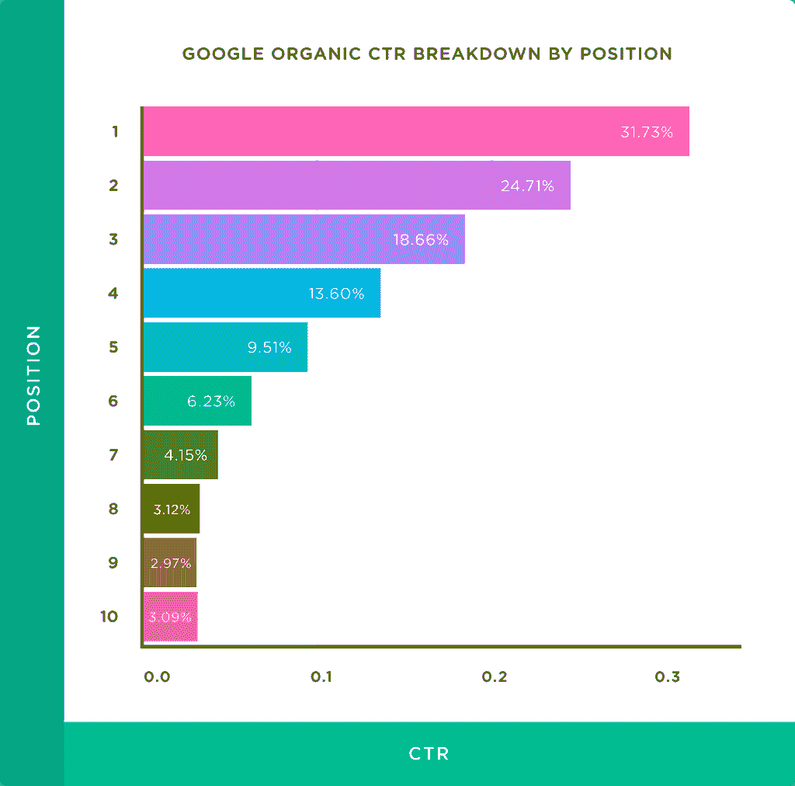

Zapier 的排名高于竞争对手的能力可能归结于他们的反向链接权限。对于任何一个在竞争对手都在遵循类似策略的领域考虑程序化 SEO 策略的人来说，这是一个关键点。为了赢得短期和长期的排名，一个有效的反向链接策略是必不可少的。

但是反向链接是与程序化 SEO 正面交锋并取得胜利的唯一途径吗？

## 超越反向链接:新的程序化搜索引擎优化战场

正如我们到目前为止所讨论的，Zapier 之所以能够保持其程序性页面的主导地位，很大程度上是因为其强大的反向链接权限。

我们还强调了一个假设，即扎皮尔的排名可能会随着时间的推移而下降，因为他转向了纯粹的程序化方法；在新的登录页面中只添加单行的合作伙伴应用程序的独特描述，而不是像以前那样为每个应用程序添加多段编辑内容。

事实上，在反向链接之外的 SEO 竞争中，一个关键的方法是在页面内容上创造更多更好的原创，而不是竞争页面。如果让谷歌在一个只有少量独特内容的模板页面和一个有许多相关独特内容段落的页面之间做出选择，后者可能会胜出，其他条件都一样。

这里的关键词是**相关**内容**。**这是许多模板化编程方法失败的地方。仅仅通过替换每个页面上的简短文本片段，很难在成千上万的页面上保持高水平的相关性。今天的谷歌算法在如何理解被搜索主题上下文中的语义文本方面极其复杂。并且模板化页面可能难以匹配具有编辑内容的页面，该编辑内容包括与目标主题和关键词更紧密对齐的语义文本。

当制定您的程序化 SEO 策略时，有两种新的方法值得考虑来解决这个问题:

### 添加更多独特的文本片段以改善语义上下文

手动编写的文本片段当然是一种选择。正如本文前面所述，通过适当的流程，它们甚至可以扩展(就像 Zapier 最初是如何将文本描述外包给他们的应用程序合作伙伴的)。

然而，向工作流中添加任何类型的编辑内容开发都不可避免地会在某种程度上限制速度和规模。这可能是为什么 Zapier 自己转向更简单的编程方法。

但是，有没有一种更有效、更可伸缩的方式来扩展编程页面上的原始内容呢？

最简单的方法是简单地添加更多独特的文本片段，最好是从某种现有的数据库中添加。一个很好的例子是 [Pitchbook](https://pitchbook.com/profiles/company/56017-63#overview) ，它将几十个独特的片段整合到他们的公司简介页面中。

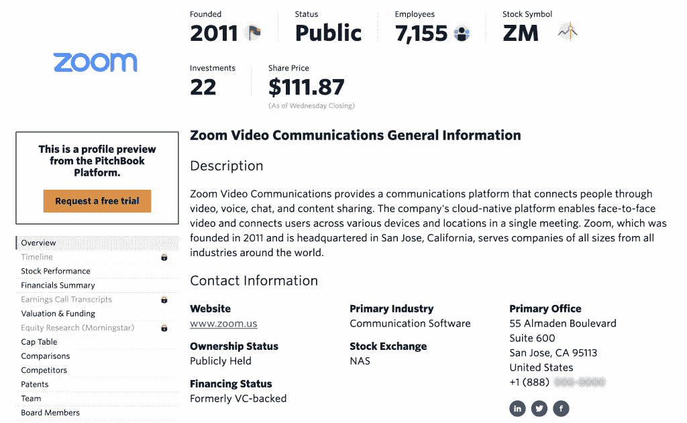

Pitchbook company profile for Zoom, incorporating many unique data and content snippets.

Pitchbook 的页面遵循一个清晰的编程模板。但是模板中填充了几十个占位符，用于存储 Pitchbook 数据库中的独特数据。

SaaS 公司在利用这种方法方面处于独特的地位，因为他们更有可能获得相关的专有数据，这些数据可以合并到模板页面中。

关于专有数据的这一点值得在这里强调。如果你的 SaaS(或任何类型的产品)的性质意味着你已经收集了一个有用信息的数据库，你已经建立了以某种有意义的方式分享的道德权利，这将使你在没有这些数据的情况下比竞争对手拥有巨大的潜在优势。您有能力创建更丰富、更高上下文的编程页面，这对竞争对手来说是一个挑战。这意味着你可以更容易地长期统治这些有机搜索关键词类别。

但是，即使你不能独占访问相关数据片段的数据库，我们生活在一个 API 的世界里，它允许你访问各种有趣的数据和信息。只要有一点创意，谁知道如何将它们混合并匹配成一组非常有价值的网页，将访问者引导到你的产品解决方案中。

### 负责任地使用新兴的人工智能写作工具

我认为另一个很有潜力扩展编程页面功能的领域是新兴的人工智能写作工具，如 [Jasper.ai](https://www.jasper.ai/) 或 [Writesonic](https://writesonic.com/) 。

现在，您可以利用人工智能写作助手为您撰写草稿文本，并大大加快您的内容开发工作流程，而不是依赖手动编写的文本片段来添加到您的编程模板中。

就目前的情况而言，我认为这些内容不应该不受监督地发布，也就是说，仍然应该有一个人工编辑流程来确保内容质量。而且它们对每一个程序化的 SEO 用例都没有意义。

但我认为编程页面是开始尝试人工智能写作工具的最佳地方之一，因为你从一个坚实的人工引导的内容结构和页面模板开始，人工智能写作的内容可以添加到其中。这将使你能够确保你的网页提供真正的价值，并实现搜索的意图。并避免这些工具不可避免地带来的垃圾堵塞互联网的潜在问题。

今天，很容易想象一个人工智能作家可以访问 Zapier 的每个应用程序合作伙伴网站，并编写一份关于该产品的精彩摘要，以及每个应用程序的主要功能和优势列表。

## 使用内容营销增加搜索流量，并在客户旅程的早期创造需求

Zapier 的应用和集成登录页面网络在吸引访问者搜索特定应用或集成方面非常有效。然而，也有很多人在搜索更一般的应用类别和用例，而这些登录页面的排名并不好。

这些搜索者尚未将搜索范围缩小到某个特定的应用程序，而是对某个特定类别的应用程序进行漏斗中期研究。或者他们正在对特定问题或用例的解决方案进行漏斗研究，甚至可能没有意识到应用程序是解决他们问题的好方法。

为了与这些搜索者建立联系，Zapier 创建了一个博客和内容营销策略，专注于探索不同的应用用例，并审查不同类别的应用。

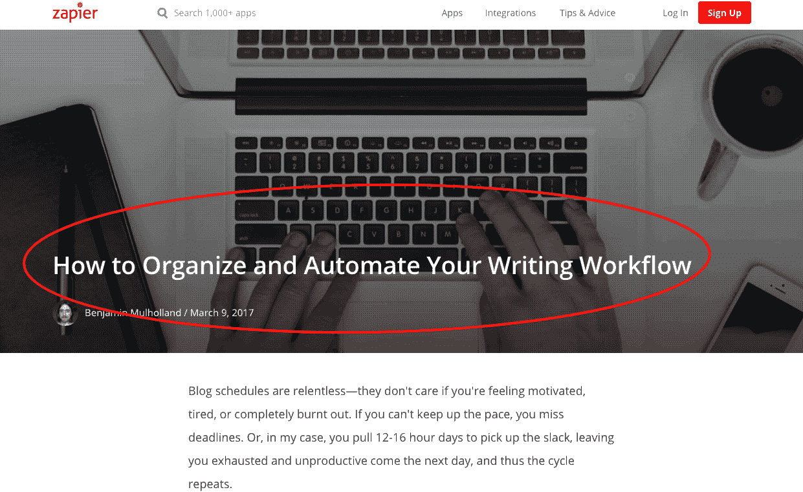

通过不等到特定集成的需求出现，并在客户旅程的早期向用户展示 Zapier 的集成，Zapier 能够覆盖更广泛的网络，并为其服务产生新的需求。

这也将 Zapier 的集成定位为选择应用程序和构建软件堆栈时的一个关键考虑因素，而不是当你试图填补现有堆栈中的空白时的一个事后想法。

## 程序化搜索引擎优化作为早期增长策略，同时增加长期博客排名

关于 Zapier 的整体 SEO 策略，最有趣的事情之一是，他们在公司成长的早期使用他们的编程页面来驱动底部漏斗，高意向访问者。不要忽视博客流量的长期潜力。

从下面的 Ahrefs 快照可以看出，这些程序性页面在发布后相对较快地获得了可观的流量。可能是因为这些登录页面所针对的长尾品牌关键词的低竞争性质。

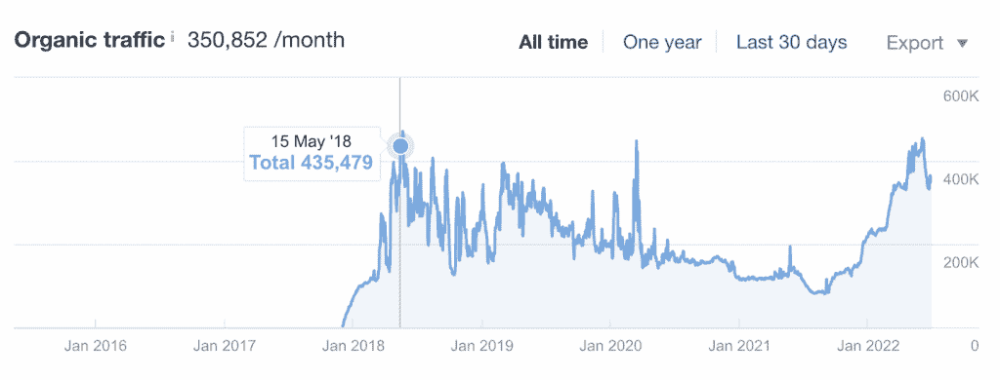

Organic traffic history for Zapier’s app landing pages. Source: Ahrefs

但是像竞争加剧这样的因素(在我们之前讨论过的其他因素中)，意味着这些程序性页面的流量或多或少处于平稳状态。尽管随着时间的推移，应用程序和编程页面的数量不断增加。

即使没有其他进入应用程序集成领域的公司竞争类似的术语，以低竞争、低容量关键词为目标的程序性页面仍可能很快趋于平稳。如果网页由于低竞争而获得好的排名，除了扩展到其他关键词目标之外，就没有额外的增长空间了。

然而，Zapier 并不仅仅关注他们的程序页面。虽然这些应用程序登录页面在早期大量产生新客户，但他们继续专注于缓慢而稳定地建立博客内容和反向链接权限。

下面，你可以看到同一时期 Zapier 博客流量的快照:

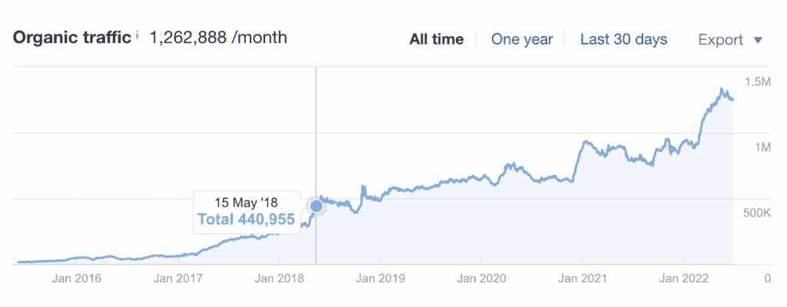

Organic traffic history for Zapier’s blog pages. Source: Ahrefs

2018 年 5 月 15 日，博客和程序页面基本上与它们产生的流量捆绑在一起。

但是，尽管编程式登录页面或多或少地达到了那个流量水平的峰值，博客还是继续增长。如今，它获得了 3 倍的流量，是公司的主要有机流量引擎。

这突出了博客内容以竞争激烈的高容量关键词为目标的缓慢增长的本质。博客往往需要更长的时间来获得牵引力，因为必须建立大量的反向链接权威，以便对更具竞争力的关键词进行排名。通过这种方式，当博客还在发展的时候，程序页面就像一个很好的早期助推引擎。

### 在你的内容漏斗中创造协同效应

程序化登陆页面可以成为你的 SEO 和内容营销策略中非常有效的一部分。事实上，我认为可以公平地假设，即使 Zapier 的博客今天获得了 3 倍的流量，他们的编程页面实际上可能会推动更多的新用户注册，因为这些页面的关键词具有底部漏斗的性质。

然而，Zapier 的全漏斗内容策略显然胜于直接的计划性策略。每个月，他们都会吸引数百万新访客进入他们的生态系统，以适合每位访客在 Zapier 潜在客户旅程中所处阶段的方式接受培养和教育。

博客也有助于建立大量的反向链接权限，通过其广泛吸引人的博客内容吸引外部链接。这种反向链接权限通过如下所示的内部链接流回编程页面，有助于提升整个内容漏斗的排名。

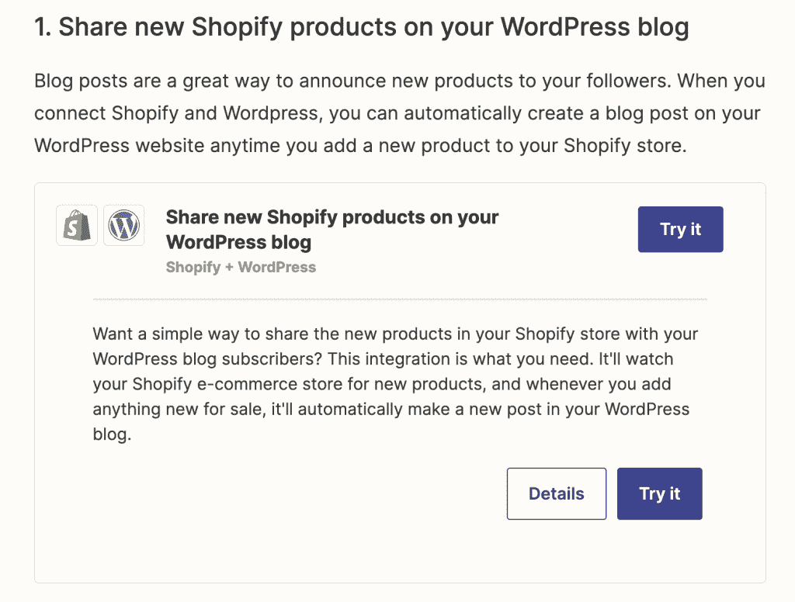

## 程序化搜索引擎优化的未来

Zapier 提供了一个如何成功利用程序化搜索引擎优化来推动 SaaS 增长的领先例子，尤其是在搜索引擎优化项目的早期阶段。但新兴技术和日益激烈的竞争已经在推动更新、更有效的规划战略的发展。

在 SEO 向前发展的过程中，程序化方法似乎会成为一个更大的焦点。但不仅如此，我还看到它越来越多地融入到各种其他 SEO 策略中。在未来，SEO 策略之间的界限将变得越来越模糊——混合方法将发挥更大的作用。

例如，已经有许多网站提供用户生成的内容，这些内容也有编程元素(如 [Leafly](https://www.leafly.com/) 或 [Tripadvisor](https://www.tripadvisor.com/) )。很容易想象编程数据和内容片段如何丰富编辑内容，用最新的上下文信息赋予网页生命。

与此同时，自然语言处理算法[继续快速发展](https://medium.com/sciforce/what-is-gpt-3-how-does-it-work-and-what-does-it-actually-do-9f721d69e5c1)，并出现在易于使用的人工智能写作工具中。当与计划性策略相结合时，潜在地创造了新内容营销可能性的完美风暴。

最终，将由我们所有人来决定我们是否要永远使用这些新技术和新方法；开发创造性的方法来提取有价值的新见解并与网民分享。或者我们是否会屈服于轻易赢得 KPI 的诱惑，用更多无用的垃圾堵塞互联网。

### 常见问题

What is programmatic SEO? 程序化 SEO 是一个术语，用于描述以编程方式生成的搜索引擎优化网页的开发。更具体地说，编程页面往往遵循搜索优化模板。并且涉及将独特的数据和信息片段插入到模板中，以便快速缩放数百或数千个页面。 What are some examples of programmatic SEO? 像 Zapier、Pitchbook、Leafly 和 Tripadvisor 这样的网站都使用编程方法来扩展搜索优化网页的巨大库。 Is Webflow or WordPress better for programmatic SEO? 虽然扩展可以用来自动将数据导入 WordPress 页面模板，但是 Webflow 有更多的本地特性来创建一个完全可定制的编程网站。如果你想从零开始建立一个网站，并有一个程序化的 SEO 策略，Webflow 将是最容易的选择。