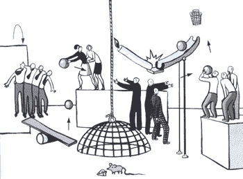

# 互联网时代的企业文化

> 原文：<https://www.strategy-business.com/article/10374?utm_source=wanqu.co&utm_campaign=Wanqu+Daily&utm_medium=website>

就在圣诞季开始前不久，我收到了一封隐约有些痛苦的电子邮件，发自我以前的一个名叫简的学生，她刚刚在纽约一家电子商务咨询公司找到了一份工作。她说，该公司拥有所需的一切:超出其处理能力的客户数量(包括几家试图进入互联网时代的“实体”零售商)、稳定的收入、充足的风险投资、快速增长的强大开发人员，以及两个亲力亲为、富有魅力的创始人。但是那里似乎没有人知道如何完成这项工作。

虽然简几个月前才加入，但她已经是一个经验丰富的老手，是员工需要解决纠纷时去找的“老前辈”。有很多争议。“上周，我们的两个人焦躁不安，”她写道，“客户被复制了整个电子邮件交流。他们两个坐在一起，但他们依赖电子邮件，因为面对面需要太多时间。”每个人一周工作 65 个小时(“80 小时并不是闻所未闻，”她说)，但他们花了很多时间在事后纠正彼此的错误。创始人说，他们想让每个团队都自治，但他们坚持批准所有对客户的重大询问。Jane 已经开始为公司的工作写标准，这是一种跟踪他们是否满足客户需求的方法，但在她走远之前，她被拉到了另一个项目——一个收费项目。为了应对这一切，她浏览了“快速公司”网站，阅读了她能在其他地方找到的所有关于组织学习的资料。“但这一切都是为了改变老公司。我在一家创业公司。我感觉像是在大海捞针。我也不确定下一步该去哪里。”

我隐瞒了简的真实姓名、公司名称及其业务的确切性质，但其余的细节都一丝不苟地准确无误。在纽约的熨斗区，在华盛顿特区环城高速公路的互联网企业，甚至在硅谷，像这样的抱怨越来越多。如果你看到互联网公司惊人的市值增长，感到羡慕和震惊，那么你可能会从简氏的故事中得到一些安慰。这些公司正在播下自我毁灭的种子，它们可能会对与之建立合作关系的老牌制造和零售公司造成更大的损害。

克里斯托弗·迈耶(Christopher Meyer)是 1997 年出版的《无情的增长》(suspensive Growth)一书的作者，该书以硅谷原则为基础，他说，“互联网繁荣的肮脏小秘密是，无论是创业奇才还是为他们提供资金的风险投资家，都不太了解在战壕中进行管理。”

特别是在过去的几个月里，越来越多的人感到有些不对劲。网络公司的高管们开始尝试与主流的《财富》500 强公司相同的“员工赋权”措施:谈论价值观，建立共同愿景，甚至雇佣主持人来主持会议。六个月前，这些想法中的大部分会被认为过时得无可救药而不予考虑。但在 1999 年圣诞节电子商务旺季的狂热中，管理时尚发生了变化。硅谷管理顾问比尔·安德伍德(Bill Underwood)在 11 月份表示:“我有一个客户在他的第五次创业中，他决定这次要以不同的方式来做。”“他将‘创造一种文化’这是第四个人告诉我类似的事情了。"

然而，任何试图创造一种文化的人都知道，这不可能在互联网时代实现。文化不是设计出来的。他们煨；他们溃烂；随着人们了解到什么样的行为在特定的公司行得通，什么样的行为行不通，它们不断酝酿，演变出自己特定的气质。建立文化的最关键因素是企业领导人的行为，他们为其他所有人树立榜样(通过他们做什么，而不是他们说什么)。从这个角度来说，大部分电商面临的核心问题不是文化缺失；太有文化了。他们已经有两种重要的文化在发挥作用——一种是炒作，一种是工艺。

当然，这些炒作和工艺文化并不局限于互联网和电子商务企业。从公司历史开始，它们就存在于主流的制造和零售公司中；事实上，他们在行业协会和股份公司中很突出，公司形式就是从这些行业协会和股份公司发展而来的。宣传和工艺通常是公司早期最强的两种文化，分别体现在创始人/企业家和第一个 R&D/工程/生产团队的文化中。但在 20 世纪的大部分时间里，随着公司成熟为主流企业，其他文化——那些金融、劳资关系、营销和管理官僚主义的文化——盖过并压倒了宣传和工艺文化。

只有在少数几个行业中，炒作和工艺仍然是企业文化的重要组成部分。不知是巧合还是出于某种根本原因，这些行业包括了互联网时代最关键的行业:个人电脑、互联网技术(但不是主流电信)、软件和媒体内容。这些行业中的大多数人已经学会在炒作和工艺之间保持微妙的平衡。但在抢占互联网市场份额的高速压力下，这种平衡正在失去平衡，许多电子商务公司因此而步履蹒跚。

那么，考虑一下炒作文化。这代表了风险资本驱动的硅谷的明显风气，在这里，25 岁的想成为首席执行官的人从一家风投公司来到另一家风投公司，推销他们的商业计划，住在自己的车里，前一周还付不起手机账单，下一周就获得了数百万的股票期权。

如果许多互联网和电子商务创业公司的企业文化感觉像一种兄弟会精神，在每个截止日期都有傲慢自大的主张和对男子气概的考验，那是因为创始人往往来自互联网战略规划和推广的背景。他们的收入和成功取决于他们能达成的交易的数量和重要性；能够说他们已经为一个著名的客户——比如说易贝或 Brooks Brothers——接受了一份工作，这给了他们筹集更多资金的声望。很自然地，他们很容易被吸引到原来的范围之外，从开发 200 页的网站跳到开发带有数据库引擎的巨型页面门户，这些引擎可以动态地组成无限数量的页面。毕竟，规模就是钱所在:承担整个全球零售基础设施转换的销售人员不能害羞。

大多数与互联网相关的创业公司和部门都是由大肆宣传的人经营的，他们熟悉筹集资本、将人们聚集在一起以及阐明新风险的方法。他们被推向“互联网速度”不仅仅是因为他们对行动和联系的热爱，也是因为创业成长的巨大成本——需要保持快速扩张以主导市场并抵御同样贪婪的竞争对手。在电子商务中，这些成本由于电子商务交易引擎出乎意料的高成本而加剧，电子商务交易引擎是一种数据库驱动的软件，它显示商品，跟踪和履行订单，主动从服务器调用页面，并与每笔交易中涉及的所有合作伙伴和中介进行协调。因为这些技术太新了，所以电子商务软件没有普遍接受的标准构件。因此，数量惊人的公司感到被迫以巨大的成本建立自己的或修改现有的软件包。“他们认为一个商业引擎将花费 50 万美元，”企业家肯·凯奇指出，他是六家互联网创业公司的创始人或董事会成员。“但最终花费了几百万。然后，他们必须根据股价来证明这些成本的合理性。”

与此同时，工作必须完成，承诺必须兑现。于是，第二种文化，工艺文化就来了。程序员、设计师和信息架构师这一新职业的从业者本质上都是工匠。像行业协会的成员一样，他们喜欢深入研究一个项目，达成共识，并提供一个优雅的解决方案。即使当个体工匠同情炒作伦理时(或者当他们准备从中赚取数百万时)，工艺文化也是天生的吹毛求疵、桀骜不驯和多疑。(必须如此，因为手工艺工作需要进入一个没有炒作、反思的精神空间，在那里除了工作的嗡嗡声什么都没有，努力在半意识的水平上进行，写作和设计在头脑中流动，不会因为一个新的、更坚持的客户到来而突然改变方向。)一个工匠/开发者一个音符一个音符地组成一个网站的结构，这是其他人无法做到的。这种心态与说服风投投资一家公司所需的心态是对立的。这两种心态不可能同时存在于同一个人身上。

炒作的人，如果他们聪明，学会保护手艺人，而不是榨干他们。他们知道，有经验的工匠需要清晰的界限来做出选择，需要思考的时间，以及表达自己想法的机会。类似地，聪明的手艺人在他们职业生涯的某个时候逐渐学会重视炒作文化的战略首要性和开创性的胆识。他们甚至学会了有效地与战略家交谈。但是 20 出头的 HTML 和 Java 奇才通常还没有学会如何做到这一点，而且在圣诞节网站截止日期的枪口下他们也不会学会。

结果是削弱和完全不必要的文化冲突。给炒作者带来成功的管理风格使他们很难有效地管理工艺人员。我认识一位年轻的旧金山互联网制作人/设计师(我们姑且称他为 Jim ),他在这个领域工作了几个月后负责一个客户网站。他极度渴望被允许告诉他的客户:“你不可能在这个网站上拥有你想要的所有功能。在我们现有的时间范围内是不可能的。不符合您的预算。”但是吉姆的老板，一个熟练的投资来源和客户的侍臣，已经学会了阻止这样的消息。吉姆也没有经验知道如何为了项目的利益去反驳老板的要求。

因为对帮助的需求如此之大，最后期限又如此紧迫，工匠们正要求前所未有的巨额资金。这几乎是老生常谈，无论你现在给一个熟练的网站架构师提供什么，其他人都会在一个月内加倍。然而，手艺人不像炒作人那样受金钱的驱使。总的来说，他们想要舒适的生活，他们对股票期权的想法感到高兴；股票期权意味着组织重视它们。然而，最重要的是，他们想有机会看看他们在队里或队外能做些什么。他们不希望决策被炒作所驱使；他们想知道他们能为自己的工作感到自豪。硅谷组织发展顾问莱斯利·希金斯(Lesly Higgins)指出:“他们有动力打造优雅的东西。"他们没有动力去满足一个通常需要优雅妥协的最后期限."

炒作的人原则上会认同“优雅”——谁不会呢？但当他们陷入筹集现金的速度时，他们不想听到这些。相反，他们接受新的业务。“我们需要提升，”他们说。因此，手工艺者默认了他们剩下的唯一奖励形式:要求更高的工资或更好的股票期权，这反过来增加了炒作者的紧迫感，这给手工艺带来了更大的压力，等等，直到电子商务行业在相互误解的疯狂漩涡中旋转。

但不一定非要这样。互联网和电子商务初创公司——以及进入这些新业务的老牌公司——可以考虑三件事来维持自己的过去，比如说，今年夏天，而不是自觉地试图建立一种企业文化，或者模仿他们正在取代的恐龙公司最糟糕的官僚主义倾向。这些想法很难以极快的速度实现，除非你愿意从一开始就考虑好你的工作设计。在某种程度上，它们与炒作文化和工艺文化都是违反直觉的，因为它们始于对两种文化之间的差异的明确评价——这些差异通常是不可观察的。

**1。培养团队文化**

在 Jane(给我发邮件的年轻信息架构师)工作的电子商务咨询公司，一个团队大约由 20 人组成:12 或 15 名程序员，一名项目经理，五六名设计师。他们总是为三到四个客户工作，在客户的办公室里分配时间。他们应该同步工作，但经常忘记腾出时间聚在一起。一些客户的员工与他们密切合作，实际上，客户加入了咨询团队，而不是相反。净效应是，当炒作文化在公司范围、战略层面运作时，工艺工作发生在团队层面。如果简的公司垮了，她的团队可以很容易地振作起来，几乎完好无损地转移到另一家公司。这比简单地从零开始创建另一个团队要有效得多。

现在流行的说法是，传统的、紧密结合的实体公司的指导关系已经死亡，个人现在对自己的发展和职业成长负责。不幸的是，这种观点是不可持续的；即使在高速增长的经济中，也有太多的风险和太多的人力浪费。培养人才的任务将从公司转移，因为公司不够稳定；它将转移到团队层面。换句话说，如果成功依赖于建立一种新的“文化”，那么这种努力在团队层面的效果要比在整个公司层面的效果好得多。有理由预计，在动荡的电子商务商业环境中，公司不一定会进化出完整的文化。但是团队有；正如一位电子商务资深人士所言，它们是“其他一切都不稳定的地方的稳定之岛。”

在查尔斯·弗格森精彩的回忆录《高风险，无囚犯》(High Stakes，No Prisoners)中，他描述了制作弗米尔首页的团队在微软收购该公司后如何保持团结，在更大的公司内保持完整，甚至有点反主流文化，只要他们产生成果，就一直团结在一起。弗格森先生(和其他人一样)将微软的成功部分归因于对这种结构的依赖。同样，苹果与其说是一种单一的企业文化，不如说是一种独特团队的文化，这是支撑该公司度过许多艰难时期的一个关键因素。正如 Ferguson 指出的，这种结构化模仿了软件架构的模块化结构，但也是大多数财富 500 强公司实现创新的方式。在企业文化的雷达下，不管有没有管理层的批准，团队都能创造奇迹。有时这些团队存在多年，从一个项目转移到另一个项目，并随着团队成员内化彼此的思想而不断变得更有能力。

但许多电子商务团队缺乏他们最需要的东西:一个清晰的问责链，一个既能管理团队又能选择成员的领导者。这位领导者需要了解工艺和炒作文化，因为团队成员将来自这两个领域，并向这两个领域报告。团队应该有足够的深思熟虑的团队过程实践，即使在最后期限的混乱中，让不同的炒作和工艺人员学会一致地思考。团队应该定期进行事后分析，例如，每隔几周开一次会，回顾他们过去的工作，思考未来的变化。

只有通过各种项目甚至各种公司母公司呆在一起的团队，才能建立他们的集体能力:他们的技能和个性的无缝补充。只有完整的团队才能通过协作决策的尴尬阶段，达到他们知道如何一起思考的程度，并且他们的工作大大加快了速度。与简单地把人当作商品的团队相比，明确地促进这种发展的团队将变得对人更有吸引力，尤其是工艺人员。人们会被吸引到他们真正想为之工作的团队，而不是公司。这些团队也会变得对客户更有吸引力，因为他们会更容易产生结果。

**2。创建支持团队间学习的基础设施**

因此，对于互联网创业公司的创始人来说，最重要的工作可能不是筹集资金，而是为团队创造一个环境——不受功能失调的内部政治的支配。他们需要知道什么时候不妨碍团队，也要知道什么时候妨碍团队——有了组织基础设施，团队就可以自然、轻松地交换知识，根据需要相互借用关键人员，并相互学习。极少数互联网公司，如 Viant Corporation，已经将这一教训铭记于心。

创建一个基础设施可能意味着建立一个轮换的任务，在这个任务中，人们离开一个团队，转到一个公司范围内的支持小组，如规范编写或客户服务，然后回到原来的团队。这可能意味着(像 Viant 一样)非常重视团队之间的电子通信，或者共同定位:随着团队的发展，改变人们办公桌的位置，这样他们就可以更非正式地与关键的同事合作。这可能意味着一套精心设计的跨团队座谈会，高级经理定期出席(就像通用电气公司董事长兼首席执行官小杰克·f·韦尔奇通过定期出席通用电气纽约克罗顿维尔培训中心的会议建立通用电气的“粘合剂”一样)。这并不意味着为人力资源和其他共同职能建立一个复杂的工作人员支助结构；这些应该由团队自己处理，并尽可能由直线经理处理，否则他们将成为自我封闭的官僚机构。

这是一个看似浪费时间的领域——例如，召集一组团队的经理为公司的项目建立标准——可以节省更多的时间。很多公司的团队甚至没有意识到他们在互相推倒重来，因为没有人告诉他们。通常，客户、猎头和竞争对手会比主角先知道。解决这个问题的唯一方法是留出时间来交换意见，让创始人尽可能地了解情况。

炒作文化的人往往会忽略这一点。他们认为知识是为了利益而囤积和持有的东西，甚至在他们自己的公司内部也是如此——对于一个建立在“信息想要免费”理念基础上的行业来说，这是一个具有讽刺意味的立场。但是，向员工隐瞒自己的内部知识和观点的创始人，肯定会削弱公司的能力。知识共享软件，无论设计得多好(或多贵)，也只能到此为止，除非有一种文化倾向，愿意花时间在相互询问上。这意味着公司高层必须参与这些在线交流。(例如，微软公司董事长兼首席执行官比尔·盖茨以关注内部电子邮件而闻名。)尤其是手艺人，他们可以从炒作经验中学到很多东西，他们会用更有效的工作来回报这些知识，并带着一种高科技公司无法产生的忠诚。

**3。在团队层面推动实验**

最后，我向简建议，除非她愿意去找她的老板，也就是创业公司的创始人，说这样的话，否则世界上所有的组织学习技巧都不会给她带来任何好处:

“如果您让我建立自己的团队，选择和培养人才，我愿意接受[此处为艰难、富有挑战性的项目名称]。但是我想认真对待我们自己的发展。我想尝试一些组织工作的新方法，定期评估它们，并尝试学习如何在这个新领域管理自己。几个月后，我们将一起回来，看看我们已经完成了什么，以及哪些创新可能适用于这里的其他团队。但只有当你给我们的团队足够的自主权从我们的实验中学习时，这才会奏效。”

然后，创始人应该公开谈论他们的成功标准:什么会让他们认为一个项目运行良好？(如果他们没有明确的标准——而且数量惊人的炒作者从未在工艺层面上考虑过这个问题——那么就更有理由让这些实验团队蓬勃发展。)每隔六个月左右，实验者们可以聚在一起思考他们的创新和错误，这种短暂的静修是有价值的。

这意味着让工艺人员负责管理生产(并在客户关系上有更多的自主权。)这意味着开创一个先例，让手艺人有理由长期忠于公司，不仅因为他们将获得股票期权，还因为他们将被视为知识渊博的专业人士。另一种选择是一种文化，在这种文化中，手艺人感觉不断受到竞争对手更高出价的诱惑，而炒作的人不得不更加专注于为下一波扩张筹集资金。

所有这三种方法都是基于这样一种假设，即高科技公司的变化来自自下而上(从工艺到宣传)和自上而下(从宣传到工艺)。毕竟，底部离顶部并不远。如果大肆宣传的人(他们通常在高层，因为他们更接近融资)认为工艺人员仅仅是被雇佣和部署的“资源”，那么整个企业将类似于商品。如果炒作和工艺人员认识到他们必须从彼此身上学习什么，以及他们的业务在多大程度上依赖于他们两人，那么他们可以创造出一种大于其各部分之和的文化，也许这种文化有足够的弹性来承受未来几年的动荡。这种文化可能是基于团队的，因为团队比公司能提供给人们更多。

重印编号 00103

| **Authors**

* * *

**Art Kleiner

[art@well.com](/contact-form?recipient=u8%2BFFaeXqVE7DnkCHmgQptGV4YH5Uj2mFAosRw%3D%3D&surl=https%3A%2F%2Fwww.strategy-business.com%2Farticle%2F10374&recipient_key=UHJO8Msph0xOLAoo.1668242517) is a columnist of "Cultural & Change" and *Strategy+Business [ He teaches in the Interactive Telecommunications Project of new york University. His website is in www.well.com/user/art. Mr kleiner is the author of The Age of Pagans. His next book, Who Really Matters: A Core Group Theory of Power, Privilege and Business Success, will be published by Shuangri Money Press in August 2003\.***  |