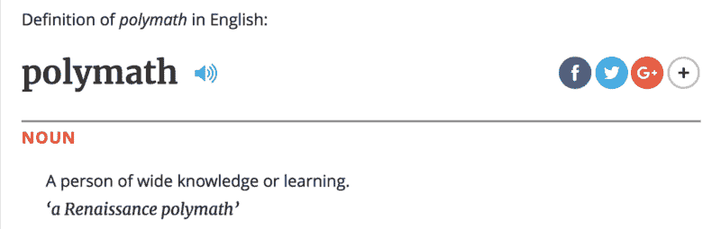
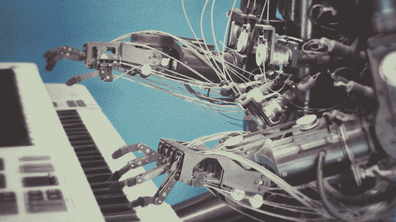
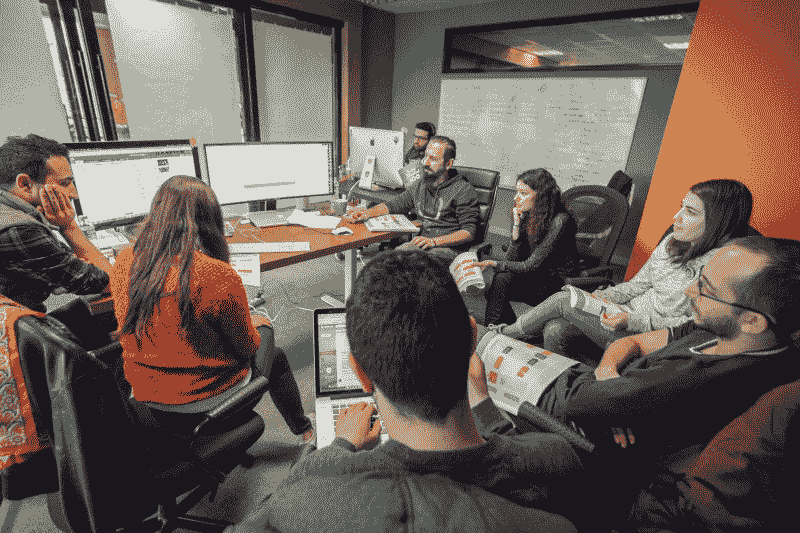
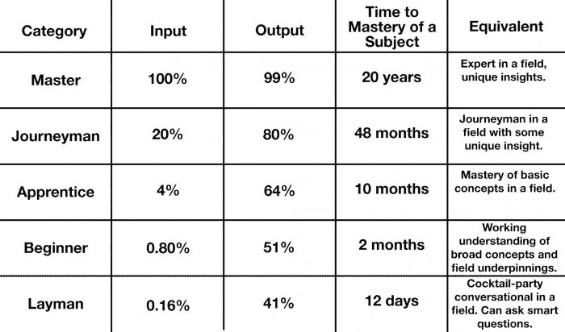

# 为什么这个世界需要多面手，而不是专家

> 原文：<https://www.jotform.com/blog/the-world-needs-polymaths/?utm_source=wanqu.co&utm_campaign=Wanqu+Daily&utm_medium=website>

这是一次思想的聚会——世界上三个最非传统的思想家在一个令人愉快的传统环境中的聚会。

烛光的光芒。新鲜牛至的香味。

房间里充满了激烈的辩论声，偶尔还夹杂着阵阵笑声。

这是一次晚宴，宾客组合出人意料。一个人说希腊语。另一个意大利人。又一个英国人。

三人通过戴在耳机上的电子翻译器进行交流。如果你偷听他们的谈话，你可能会认为他们是老朋友。

然而，你可能错了。

这些人不是老朋友；他们只是老了。

一个人出生于 1706 年。另一次发生在 1452 年。老大？公元前 384 年。

在时间机器的帮助下，参加晚宴的客人被带到了未来。

他们坐在我的餐桌旁。

尽管他们有明显的不同，但他们有一个共同点:他们都是在各自的时期打破现状的博学之士。

他们的名字？亚里士多德、列奥纳多·达·芬奇和本杰明·富兰克林。

显然，这个故事纯属虚构。但当被问及我会和哪三位历史人物一起进餐时，这是我的回答。

尽管角色可能会改变——基于我碰巧读到的任何东西——但我的脑海里总是浮现出那些博学的人。为什么？因为世界上最有趣的个人一直是“深度通才”。

我相信今天的组织、公司和社区的持续成功依赖于跳出框框思考的博学之士。

未来最具创新性的发展——在商业、科学和艺术领域——将来自那些将独特学科与技术技能相结合的创造性通才。

### 到底什么是博学者？

这个问题出乎意料地难以回答。牛津词典是这样定义它的:

这个词来源于 17 世纪早期的一个希腊术语，意思是“学到很多”

当不严格地使用时，这个术语可以适用于任何有一系列兴趣、爱好或知识的人。然而，第二个定义暗示了更深层的含义。

斯坦福大学化学家兼文学作家卡尔·翟若适在接受经济学家*的采访时[强调了“学者”和“爱好者”之间的区别](https://www.1843magazine.com/content/edward-carr/last-days-polymath):*

> “这意味着你的博学者活动通过了竞争对手在每个领域施加的某种质量控制，”Djerassi 说。“如果他们以他们的水平接受你，那么我认为你已经达到了那种状态，而不仅仅是涉猎。”

畅销书作家兼媒体撰稿人迈克尔·西蒙斯(Michael Simmons)进一步阐述了这一观点，他将现代博学家定义为:

> 在至少三个不同的领域变得有能力，并将它们整合成 1%的顶尖技能的人。

尽管世界上对博学的人有巨大的需求，但这些人似乎相当稀少。

这是因为社会提倡专业化而不是普遍化，基于一个长期存在的假设:你专业化越深，你就越容易找到工作。

另一个好处？

成为专家是有利可图的。医生、律师和投资银行家都对他们辛苦获得的知识收取高额费用。

然而，有证据表明，我们对单向专业化的崇敬将很快结束。

### **人工智能将改变这一切**

专家预测大多数工作最终会被人工智能淘汰。会留下哪些角色？那些需要创造性解决问题，创新和人性。

人工智能革命可能是未知的领域，但这种情况本身并不陌生。

在工业革命期间，我们看到机器取代了以前由人类完成的体力工作。这种变化导致了基于认知责任的新工作的发展。

在许多方面，这种模式正在重演；只不过，这一次，专业知识与技术技能的结合正在淘汰工作岗位。

> “在 50 到 100 年的时间里，机器将会是超人，”新南威尔士大学人工智能教授托比·沃尔什说。“因此，很难想象人类会比机器做得更好。这意味着剩下的唯一工作将是那些我们*喜欢*人类去做的工作。”

换句话说，每一个可以想象的领域，最终都将与技术相结合，取代工作。谁是实现这一目标的人？当然是博学的人。

具有讽刺意味的是，大多数人类最大的突破并不是来自专家；他们来自多方面的个人。

例如，诺贝尔奖获得者弗朗西斯·克里克将他的[物理学背景](https://profiles.nlm.nih.gov/ps/retrieve/Narrative/SC/p-nid/141)归功于对 DNA 结构的直觉——这是一个以前被现代生物学家认为无法解决的问题。

另一位诺贝尔奖获得者理查德·费曼在自助餐厅里观察一个人用手指旋转盘子时，产生了他关于量子电动力学的想法。在费曼重新投身于物理学之外的兴趣之后，他才意识到这一点。

类似的故事还有很多，它们都指向同一个结论:严重的专业化扼杀了创造性解决问题的能力。

这正是现代工作场所所需要的——能够跳出那些说“办不到”的框框思考问题的人。

虽然专业化对知识的进步很重要，但它经常与一个很少讨论的缺点相吻合:[认知偏差](https://study.com/academy/lesson/cognitive-bias-definition-examples-quiz.html)。

该术语指的是由于错误的假设和思维模式而忽略潜在解决方案的过程。在某个时候，我们都经历过这种“从众效应”

这种现象在政党、宗教团体和科学界等团体中显而易见。

《HBR》撰稿人兼企业家凯尔·威恩斯也认为过于严格的专业化限制太多。这也是他积极推动团队脱离特定角色继续学习的原因:

> “我们鼓励我们的技术人员学习编程，”他说。“我们甚至买了一台激光切割机来帮助我们的设计师修补。在一起，我们通常会发现一个解决方案，如果我们都被困在自己的小知识隔间里，我们就不会发现这个方案。”

在 Jotform，我们做类似的事情；我们的员工在[小型跨职能团队](https://www.jotform.com/blog/build-a-team-you-love/)中工作。每个小组都像一个小公司一样运作，并被鼓励做出自己的决定。事实证明，这一过程不仅能放大个人才能，还能让工作日变得更加有趣。

虽然我们的杂交尚未创造出像[仿生学](https://biomimicry.org/what-is-biomimicry/)这样创新的东西——一个从自然中寻找现代问题解决方案的新兴领域——但我们的一些最好的想法来自于最全面的员工。

> Gelt Venture Capital 的创始人杰克·查普曼(Jake Chapman)说:“作为一名投资者，如果我要挑选一个完美的团队，那应该是一群拥有单一主题专家作为资源的摇滚明星般的博学之士。”。

如前所述，成为一名真正的博学者意味着在两个或更多的领域培养深厚的知识。基于人工智能的日益流行，我的预测是，对于大多数未来的博学者来说，其中一个领域将是技术。

因此，问题变成了:**我们怎样才能找到时间来发展不止一个领域的专业知识？**

查普曼似乎在帕累托原理中找到了答案。

### **如何成为现代学者**

根据意大利经济学家、**的说法，80%的结果来自 20%的原因**。换句话说，少量的工作产生了大部分的结果。

这个原则有几个应用，但在寻求精通新事物时特别有用。例如，[通晓多种语言的 Benny Lewis](https://www.fluentin3months.com/most-common-300-words/) 建议初学语言的人把注意力放在目标语言的 300 个最常用的单词上。为什么？

因为这些词代表了他们最终会在对话中使用的词的大约 65%。

在 TechCrunch 发表的一篇文章中，查普曼将[多元化学习](https://techcrunch.com/2015/10/17/specialization-polymaths-and-the-pareto-principle-in-a-convergence-economy/)的过程分为五个阶段:

这一原则在实践中最有力的含义是什么？重塑自我永远不嫌晚。

例如，一位花了 18 年时间独自抚养孩子的母亲可以通过战略学习迅速精通一个新领域。这意味着她可以通过竞争重新进入劳动力市场并获得就业，尽管有潜在的职业挫折。

此外，希望成为现代博学家的人可以通过适当的多样化打造独特的职业道路。

假设有人花了四年时间专门从事后端软件开发，从而达到了“熟练工”的地位。那个人可能也希望在将两个学科融合在一起创造出独特的东西之前，能够精通音乐创作。

会很容易吗？不会，但这将比人类历史上任何一次都要容易。

任何人只要能上网并有学习的真诚愿望，只需点击一个按钮就能获取大量信息。

像 iTunes U T1、T2 可汗学院 T3 和 T4 edX T5 这样的资源教授从市场营销到微积分的一切。

你甚至可以在午休时通过谷歌的代码大学学习编码。这就是[迈克尔·塞曼](https://en.wikipedia.org/wiki/Michael_Sayman)在高中做的事情；如今，他是全球 100 大应用之一的 *4 Snap* 的开发者。

在一个前所未有的技术进步的环境中，我们都必须在某种程度上接纳我们内心的博学。

那些能够以独特的方式结合他们的技能的人将成为明天的领导者、创新者和问题解决者。他们总是被邀请到我家吃饭。

我迫不及待地想看看他们接下来会想出什么。