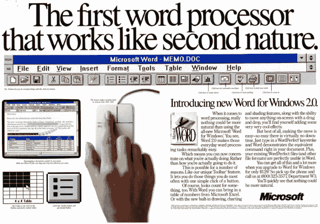
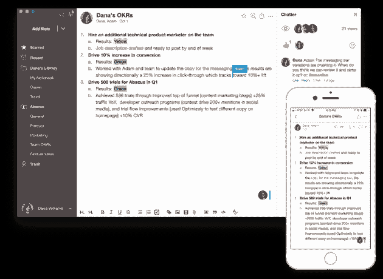
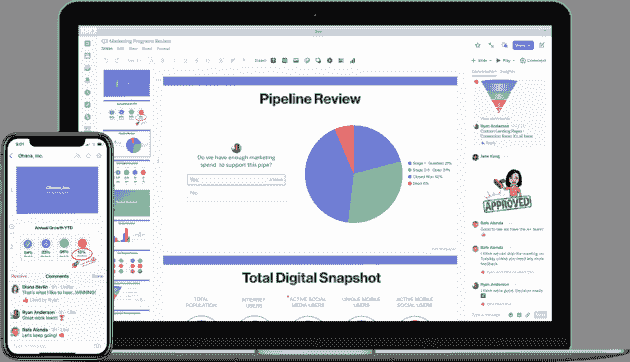
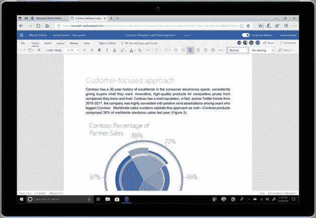
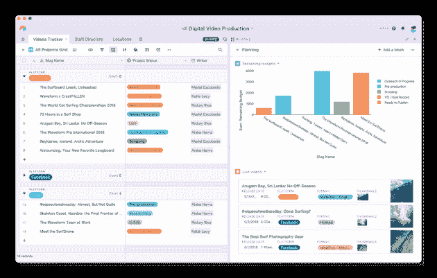

# 新的文字处理器战争:一批新的生产力应用程序正试图重塑我们的工作日——geek wire

> 原文：<https://www.geekwire.com/2018/new-word-processor-wars-fresh-crop-productivity-apps-trying-reinvent-workday/?utm_source=wanqu.co&utm_campaign=Wanqu+Daily&utm_medium=website>

Microsoft’s vision for work is alive and well. An advertisement for Word for Windows 2.0 from 1991\. (Microsoft Image)

微软比地球上任何其他机构都更能塑造我们的工作方式和思考方式。如果你整天呆在办公室里(如果你经常不在办公室的话)，你所做的一切都是围绕着一个微软普及的模型:Outlook 中的电子邮件。Word 文档。Excel 中的数字和项目管理。和演示文稿。不管你喜不喜欢，你生活和呼吸着微软的工作愿景。

20 世纪 60 年代，IBM 发明了最早的文字处理器，1979 年，Micropro International 推出了第一台商业上成功的文字处理器 [WordStar](https://www.thoughtco.com/wordstar-the-first-word-processor-1992664) 。其他早期的生产力软件紧随其后，包括 WordPerfect 和 Lotus 123。但正是微软 Office 首次打包了这类应用，并超越了工作场所，创造了我们今天仍在使用的工作模式

在微软 Office 问世近 30 年后，它已经融入了几乎所有生产力应用的 DNA 中。即使你使用谷歌的 G 套件或苹果的 iWork，你仍然在遵循微软的模式。

<aside class="pullquote"> Employees were lucky to have two, three, five modern applications in the 90s. Now they have almost unlimited ways of being productive.</aside>

但这种思考工作的方式已经有点过时了，提供不同方法来完成工作的新应用程序每天都在涌现。围绕我们的工作方式有一场新的战争，旧的“办公套件”正在围绕快速讨论线程、快速共享和轻便简单的界面进行改造，所有工作都在一个窗口内完成。近年来，科技领域的流行语是“人工智能”和“移动”。今天，你可以将“协作”添加到这个列表中——如今，每个人都想在他们的应用程序中建立类似 Slack 的通信。

对于笔记和文档，有 [Quip](https://quip.com/) ， [Notejoy](https://notejoy.com/) ， [Slite](https://slite.com/) ， [Zenkit](https://zenkit.com/en/) ，[idea](https://www.notion.so/)和[议程](https://agenda.com/)。对于电子表格，有华盛顿贝尔维尤。基于[的 Smartsheet](https://www.smartsheet.com/about) ，以及 [Airtable](https://airtable.com/) ， [Coda](https://coda.io/welcome) 以及 [Trello](https://trello.com/) ，尽管它对电子表格有很大的不同。这份清单看似无穷无尽，很大程度上是因为开发者可以相对容易地在云中发布软件。

“工作已经完全改变了，”在线存储公司 [Box](https://www.box.com/home) 的联合创始人兼首席执行官亚伦·列维(Aaron Levie)说，该公司正在围绕从令人眼花缭乱的云应用程序组合中统一数据和消息制定战略。“在 90 年代，员工很幸运拥有两个、三个或五个现代应用程序。现在，他们几乎有无限的生产方式。”

Notejoy, like other new productivity apps, combines the word processor with Slack-like collaboration. (Notejoy Image)

从根本上来说，这些应用程序中有许多并不是建立在触摸屏或人工智能等新技术之上，而是重新发明了我们大多数人仍然可以完成工作的方式——在物理键盘上和显示器前打字。在这种新环境下，员工不再满足于 IT 提供给他们的应用程序。他们希望在他们已经习惯的手机消费应用程序中找到相同的简单用户界面，他们厌倦了费力地通过基于经典 Windows 和 Mac OS 结构的标准问题文件目录。

这意味着开发者让公司使用他们软件的方式也发生了变化。在旧的做事方式下，供应商必须赢得 IT 部门和管理层的支持。现在，开发人员正直接接触最终用户——一线工人——并依赖口碑。

一些公司将员工使用的许可程序的数量限制在四到五个，这表明了生产力市场的分化程度。原因是:如果一个团队的文档分散在一大堆编写应用程序和交流平台上，没人能完成任何事情。Quip 的联合创始人兼首席执行官凯文·吉布斯(Kevin Gibbs)如是说，Quip 是一个集文档、电子表格、项目经理和通信中心于一体的应用，于 2016 年被 Salesforce 收购，可能是最有可能挑战微软 Office 的单一应用。

“有这么多的工具…正在挑战旧办公套件的前提，”吉布斯说。“(微软)Office 并没有真正改变，但我们周围的世界已经发生了如此大的变化。”

Salesforce-owned Quip mixes productivity apps and messaging in a single window. (Quip Image)

对微软有利的是，革命正在慢慢发生。专家说，微软仍然是生产力软件领域压倒性的巨头，而且这种情况看起来不会很快改变。根据 Gartner 的最新数据，去年微软的办公套件控制了近 88%的市场份额。谷歌基于云的文档、电子表格和演示应用 G Suite 以 9.7%的份额远远落后于第二名。

Gartner 分析师克雷格·罗斯(Craig Roth)表示，他十年前就预测初创公司的竞争对手将开始侵蚀大型科技公司的市场份额，但这种情况尚未发生。他说，其中一个原因是，当最后期限临近时，员工会匆忙回到他们所知道的东西上，而他们所知道的就是微软 Office。

然而，虽然没有一个较新的生产力应用程序看起来会在不久的将来取代微软，但 Quip 的 Gibbs 说，无休止的选择意味着一群应用程序可能会共同蚕食微软的市场份额。“这是成为消费者的大好时机，”吉布斯说。“他们正在获得最好的工具……他们真的渴望改变他们的工作方式。”

微软正在通过简化其用户界面和将更新和越来越受欢迎的应用程序中的功能融入 Office 365 来应对这一新局面。去年，它推出了类似 Slack 的沟通工具 Teams。微软表示，Teams 是该公司历史上增长最快的商业应用程序，有 32.9 万个组织和 87%的财富 100 强企业(包括通用汽车和通用电气)在使用它，这表明员工对这些新型快速协作应用程序的需求有多大。

Microsoft Word’s recently redesigned interface. Microsoft is responding to the new wave of productivity apps, in part, by simplifying Microsoft Office’s user experience. (Microsoft Image)

Office 365 产品营销高级总监罗布·霍华德(Rob Howard)表示，微软还简化了 Office 的用户界面——长期以来,[一直认为](https://bit-tech.net/reviews/tech/software/why-the-microsoft-office-ribbon-is-still-ru/2/)混乱而令人困惑——并将其简化为横跨屏幕顶部的单行“丝带”。霍华德说:“我们非常重视用户体验的更新简化，让它变得更加简单。”。"在过去的几年里，Word online 取得了长足的进步."

微软还收购了一些生产力公司，包括 [Wunderlist](https://www.wunderlist.com/) 、 [Yammer](https://products.office.com/en-us/yammer/yammer-overview) 和 [Intentional Software](https://www.intentsoft.com/) ，它们帮助开发了微软的[白板](https://products.office.com/en-us/microsoft-whiteboard/digital-whiteboard-app)协作应用。霍华德表示，微软也非常依赖人工智能来吸引员工。例如，他说，你现在可以用 Excel Android 应用程序扫描电子表格的纸质副本，并将图像转换为功能完整的 Excel 电子表格。

正是谷歌在 2006 年推出了谷歌文档(Google Docs)，让这个基于网络的生产力应用的新时代成为可能，并及时证明你可以在基于云的应用中完成所有工作。微软发现了其生产力业务的危险，并在 2010 年推出了自己的在线版 Office。

G Suite 提高了雷德蒙德的血压，并赢得了包括 Verizon Communications Inc .和高露洁棕榄公司在内的大牌客户，但它并没有打破生产力软件的模式。协作笔记应用 Notejoy 的首席执行官 Sachin Rekhi 说，谷歌反而专注于复制微软 Office，随着时间的推移，痴迷于内置 Office 的所有或大部分关键功能，因此企业会认为它是一个可行的替代方案。

<aside class="pullquote"> They nailed it. But then they just put their entire focus on going after Microsoft’s market share … They’re just trying to do the same old things that Microsoft does.</aside>

“他们做到了，”他谈到谷歌文档作为在线文字处理器的有效性。“但之后他们就把全部精力放在了追逐微软的市场份额上……他们只是想做和微软一样的老一套。”

Rekhi 说，这“导致了文字处理器市场的停滞”，并为像 Notejoy 这样采用不同方法进行文字处理的公司创造了机会。就连十多年前出现的笔记先锋 Evernote 也遇到了麻烦。其领导团队中的一大部分人最近逃离了，该公司[刚刚更换了首席执行官，并解雇了 54 名工人，这相当于其劳动力的 15%。

与此同时，云驱动的文档创建工具的新作物正在获得牵引力。Smartsheet 自称是 Excel 和微软项目管理软件的竞争对手，今年第二季度的收入为 4240 万美元，比去年增长了近 60%。Smartsheet 表示，财富 100 强公司中有 92 家使用其软件。Smartsheet 的竞争对手 Airtable 表示，超过 80，000 个组织在使用它。

Quip 没有透露用户数量，但 Gibbs 说它的客户包括亚马逊、花旗银行和安进。

这些较新的工作工具采用了旧的文字处理器、电子表格和幻灯片，并在其中加入了评论线程，这样人们就可以在文档中实时谈论他们正在创建的内容。每当有人更新时，这些应用程序的用户也会收到提醒。

这个想法是为了减少创建和共享文档所需的步骤。考虑创建文档并与您的团队共享的传统流程:

1.  在 Word 或其他文字处理软件中打开文档。
2.  浏览文件系统并将文档保存在正确的文件夹中。
3.  编写和修改文件的内容。
4.  当你准备好分享你的作品时，为文档设置正确的权限，这样只有合适的人才能看到它。
5.  *打开 Outlook，然后 wend 再次通过文件系统找到正确的文件夹，并将正确的文件附加到邮件中。*
6.  在你的电子邮件中输入几个段落，解释你分享的内容和原因。
7.  在“收件人”和“抄送”行中包含正确的人(您可能需要仔细检查一两个别名)。
8.  起草一个主题行，然后按发送。

差不多有八步。但我们还没有完成:每个收到文档的人都必须打开它，确保他们在编辑时没有覆盖原始内容，附上评论，然后再次打开 Outlook，并在电子邮件回复中总结他们的想法。现在，为了创造新的信息并获得反馈，我们大概要讨论十几个步骤。

从这个角度来看，“即使是谷歌文档也开始感到非常沉重，”Notejoy 的首席执行官 Sachin Rekhi 说，note joy 是一款旨在简化这一过程的应用程序。“我们只是试图成为这些工具的对立面。”

Notejoy 和 Quip 等其他较新的生产力工具旨在通过按项目和团队对文档进行分组，允许所有相关人员实时查看和评论工作，在文档中聊天(而不是通过电子邮件),并在有人有话要说时获得类似文本的提醒，从而减少五六个步骤。这种新的生产力应用程序还强调在一个应用程序中完成所有事情(而不是在谷歌表单、幻灯片和文档之间切换)，快速和可定制的搜索，以及创建新类型的存储库，消除旧的文件管理目录。

“我记得很清楚…感觉即使采用了当时最流行的工具，完成工作仍然很难，”Quip 的 Gibbs 谈到使用最初的生产力套件时说。他说，他仍然遇到许多人“实际上感觉被老方法卡住了”。

Airtable is a new take on Excel, emphasizing words over numbers, and the easy creation of databases. (Airtable Image)

所有这些都提出了新的生产力应用格局与旧格局之间的一个重要差异:越来越多的是员工选择新软件，而不是 it 部门。回想一下，在过去，一家软件公司会向 IT 员工和高层管理人员出售一个软件包。

现在，员工们正在通过口口相传和媒体了解应用程序。他们认为管理项目和共享信息可能会更快、更简单。几乎所有这些应用程序——包括现在的微软 Office 365 都提供免费层，因此很容易试用。例如，Notejoy 为多达五个用户提供免费协作。

Rekhi 称之为“it 消费化”他说，员工正在“将自己的工具带入企业”，应用程序开发人员最好采用“自下而上”的策略，即让一些人试用一款应用程序，“然后它会在组织内发展。”

电子表格和数据库应用程序 Airtable 的联合创始人兼首席执行官 Howie Liu 表示:“我们日常注册或收入的绝大部分来自于那些因为口口相传而采用该产品的人。”。

<aside class="pullquote"> The vast majority of our daily signups or revenue comes from people who have adopted the product because they heard about it from word of mouth.</aside>

刘说，他创建 Airtable 是因为他看到大多数人在 Excel 中输入的是文字，而不是数字。他说，团队正在使用 Excel 来跟踪项目、管理联系人和计划活动——所有的词语都被输入到一个为处理数字数据而设计的程序中。他说，相比之下，Airtable 的设计目的是为单词创建数据库，它不仅允许公司从 Excel 转换，还允许公司从笨重的专业软件转换。刘举例说，一个牧场主抛弃了使用多年的牲畜追踪软件，转而使用 Airtable。据该公司称，Slack、Box、Target 和 Buzzfeed 也使用 Airtable。

这证明了应用程序如何提升自己的形象，不是通过试图消灭竞争对手，而是通过找到微软或谷歌没有提供的利基市场——或者增强最突出的生产力应用程序，以便客户可以以新的方式使用它们。

云存储公司 Box 可能是这种方法的缩影。在该公司所谓的“瑞士战略”中，Box 旨在连接来自微软、谷歌和其他公司的任意数量的在线应用。今年夏天，Box 宣布了一个统一的活动流，该公司表示，这让人们更容易看到他们的工作如何在 DocuSign、Salesforce 和 Slack 等在线应用程序之间联系起来。Box 用户还可以根据他们与团队成员的关系来评论、共享和组织文件。

“我们认为这都是工作，”Box 首席执行官列维说。“我们知道将会有(员工)想要的混合解决方案……这与谷歌和微软的观点不同。”