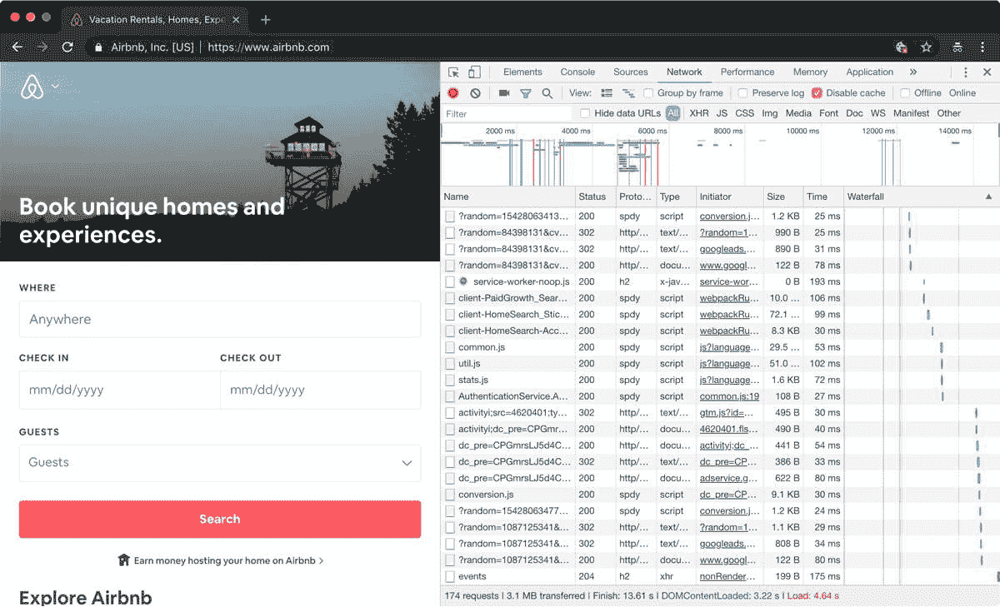
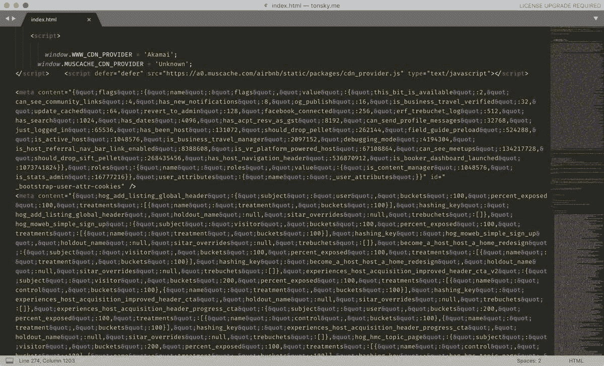
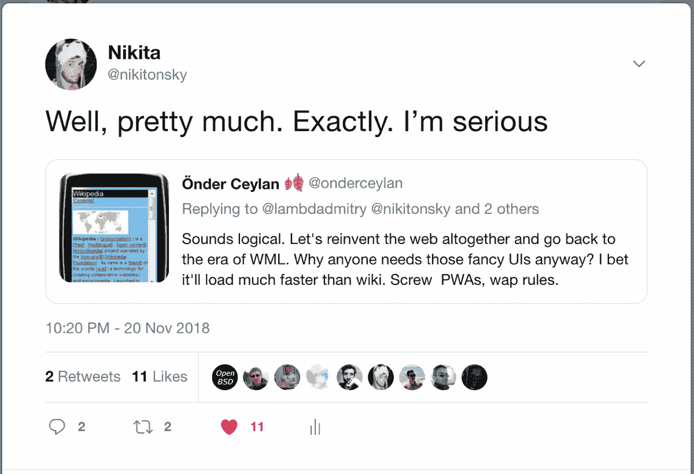

# 你既不需要 PWA 也不需要 AMP 就能让你的网站快速加载@ tonsky.me

> 原文：<http://tonsky.me/blog/pwa/?utm_source=wanqu.co&utm_campaign=Wanqu+Daily&utm_medium=website>

# 你既不需要 PWA 也不需要 AMP 来使你的网站快速加载

*翻译:[俄语](https://habr.com/ru/company/timeweb/blog/555094/)T3】*

网络上出现了一种新的“革命性”技术趋势，基本上让你可以做几十年前可能做的事情。

# 安培

第一，AMP(加速移动页面)。想想看:网络，总的来说，不能很快，所以谷歌发明了一个平行的网络，他们只是不让你使用 JavaScript。哦，他们还允许你使用一些谷歌认可的 AMP JS 组件。但是等等，常规 web 没有 JavaScript 就不能运行吗？当然可以。常规 web 可以包含自定义 JS 组件吗？你打赌。能快吗？网飞[最近发现](https://medium.com/dev-channel/a-netflix-web-performance-case-study-c0bcde26a9d9)如果他们从一个静态(！！！)网页加载速度会更快，用户通常会更高兴。谁会想到呢，对吧？

那么，为什么需要 AMP 呢？嗯，基本上谷歌需要锁定内容提供商，通过谷歌搜索提供服务。但是他们需要一个好的封面故事。他们选择将其作为性能解决方案进行推广。

问题是，web 开发人员不相信性能。他们说他们有，但实际上没有。他们相信的是炒作。因此，如果你用一个新的名字宣传旧的技巧，那么开发者可以说“现在，我终于可以开始编写快速应用了。谢谢谷歌！”。就像谷歌曾经阻止你这样做一样。

> “但是 AMP 是新的！`<amp-img>`比``做的多得多！”

有可能，但是如果谷歌真的打算帮忙的话，有什么能阻止它作为一个普通的 JS 库发布呢？

因此，大肆宣传奏效了，许多开发人员买了封面故事，匆忙为他们提供的每个网页创建了一个并行版本，具有“AMP-enabled”性能提升。

之前:

> "嘿，老板，让我们重写我们的网站，让它加载速度更快！"
> “滚蛋！”
> “但是研究表明，加载时间的每一秒……”
> “我说滚蛋！”

现在:

> “嘿老板，让我们用 AMP 重写我们的网站。这是谷歌的新技术…"
> "放下一切！这里，拿$$"
> "它也可能会改善……"
> "我不在乎。马上上来！”

我并不是说 AMP 提倡的实践是不好的或无用的。它们是良好的实践。但是没有什么能阻止你在普通网站上关注他们。从网络诞生之初，没有什么能阻止你编写高性能的页面。谷歌几乎没有发明 CDNs 和异步脚本加载。但是没人在意，因为旧技术和好的实践永远没有被打上“新”标签的东西有吸引力。

# 艾滋病患者

输入 PWA。渐进式网络应用。或者应用程序。渐进式网络应用。随便啦。

因此，我们的想法是能够创建一个类似本地的体验，但使用 web stack。网络缺失了什么？安装应用程序。离线模式。通知(Ew)。在后台工作。对，基本就是这样。就是这样。

再说一遍，我不会说这些事情是错的。他们不是。如果你想使用 web 技术创建一个类似本地的应用程序，你必须使用类似的东西。这对于购物清单或者闹钟这样的应用来说是有意义的？

PWA 的问题是，有两个问题。

首先，大多数应用作为网站比作为应用更好。网站根据需要逐渐加载每个资源，不像应用程序必须在安装时获取所有资源(这就是为什么应用程序捆绑包的大小通常比网站大得多)。网站效率更高，但你不能在离线时使用它们。

但是今天的大多数“应用程序”都是在线的！离线时你不能给优步打电话，否则你为什么要打开优步的应用程序？Tinder 离线没用。你不能和空聊天屏幕约会。没有网络连接，你无法参加 Meetup.com 的聚会。你不能选择或预订酒店，不能转账或离线查看账户余额。没有人想重读 Twitter 上缓存的旧推文或 Instagram 上的昨天的照片。这没有任何意义。

所以，是的，我更希望那些“应用”只是网站。信不信由你，这是有好处的。我喜欢较小的下载大小，尤其是如果我偶尔访问一个网站只是为了快速浏览的话。我喜欢网站不在后台消耗我的资源。当我关闭它的时候，它会卸载并且不会经常下载新版本的库，而这些库是开发者经常需要部署的。我已经准备好为此牺牲离线模式了。

PWA 的第二个问题，也是与我们的主题更相关的问题，是它以某种方式[与性能](https://www.thinkwithgoogle.com/intl/en-154/insights-inspiration/case-studies/trivago-embrace-progressive-web-apps-as-the-future-of-mobile/)相关联。

问题是，这和表演没有关系。我的意思是，没有什么新的东西。您总是能够缓存资源，以便在页面之间快速导航，浏览器在这方面做得很好。使用 HTTP/2，您可以有效地批量获取资源，甚至从服务器推送资源，以获得“更即时”的体验。

因此，对于一个服务工作者来说，自己管理资源缓存似乎更像是一种负担，而不是一种福气。HTTP 缓存也是声明性的，在这一点上经过了很好的测试和理解，换句话说，很难搞砸。你不能说你的服务人员。缓存是计算机科学中两个最难的事情之一。我个人[和 Meetup.com PWA](https://twitter.com/nikitonsky/status/1064899552069722112)有过一次糟糕的经历，当时他们缓存代码中的一个错误导致整个网站无法使用，以至于无法打开 meetup 页面。而且不像 HTTP，重置起来没那么容易。不，刷新没有帮助。

但是，如果 ServiceWorker 是一种折衷，那也没什么:你付出了复杂性的代价，但却获得了令人兴奋的新功能。但你没有。使用 ServiceWorker 所能做的任何有用的事情，都不能用 HTTP cache/AJAX/REST/Local Storage 来做。这只是一个复杂的洞，你会在里面投入无数的工作时间。

PWA 和 AMP 一样，甚至不能保证你的网站是“快速”或“即时”的。Tinder 案例研究显示登录屏幕(一个文本输入、一个按钮、一个 SVG 标志和一个背景渐变)在 4G 连接下需要 5 秒钟才能加载，这有点滑稽！我的意思是，他们必须在 2-5 秒内添加加载程序，这样用户就不会立即关闭这些垃圾。他们称之为快速。

这很快:

<video autoplay="" muted="" loop="" preload="auto" playsinline="" controls=""><source src="./wikipedia.mp4" type="video/mp4"></video>

他们是怎么做到的？通过他妈的关心性能。就这么简单。

哦，也没有提供大量的 JavaScript 包，也没有通过 fetch polyfill 在 GraphQL 上使用 React 在客户端上呈现。这可能也有帮助。

ServiceWorker 或 AMP，如果你的登录页面有 170 多个对 3.1 Mb 的图片和 4 个表单字段的请求，无论你扔给它多少新的框架，它都不能快速加载。

# 裁决

那么结论是什么？要用 AMP 和 PWA 编写快速的网站，你仍然需要深入理解性能优化。否则，你唯一的选择就是跟着炒作走。

但是请记住，AMP 和 PWA 都不会神奇地让你的网站比普通的重写更快。

 Airbnb famous 800Kb index page. I would expect more care perf-wise from 900+ developers with average salary of $290,000/year. Even SublimeText gives up highlighting this bullshit at some point.

一旦你理解了性能，你会发现你既不需要 AMP 也不需要 PWA。停止胡说八道，web 突然开始工作*立即*。AMP 没有发明 CDN 和`<noscript>`。PWA 没有发明缓存。静态 web 仍然围绕着任何现代大肆宣传的框架运行。

“但是用户！他们想要我们有趣的互动。他们要求动画！”

我告诉你一件事。没有人喜欢盯着屏幕看 5 秒钟。加载器被动画化没有任何区别。如果你不能进入性能，至少不要假装它是一个功能。

嗨！

我是尼基塔。这里我写一下编程和 UI 设计 [订阅](/blog/how-to-subscribe/)

我也创造开源的东西:Fira Code，AnyBar，DataScript 和 Rum。如果你喜欢我所做的事情，并且想尽早看到我的文章(以及其他好处)，你应该在 Patreon 上支持我。

