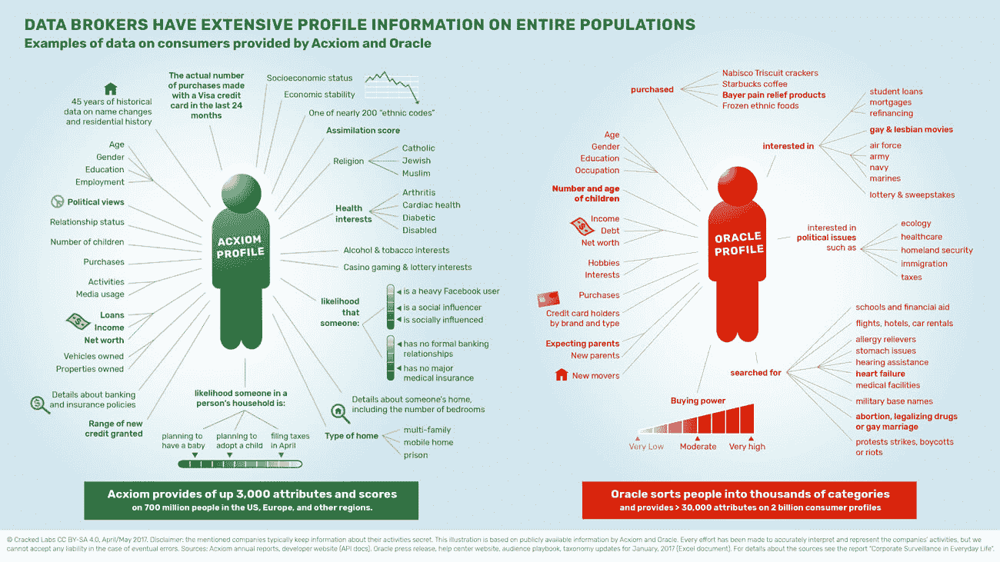
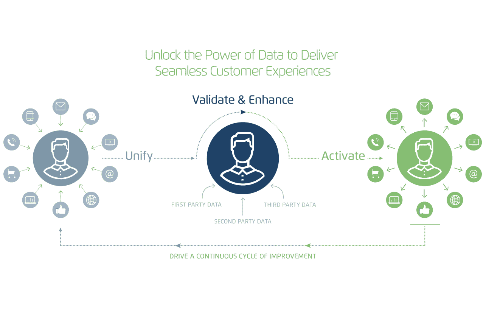
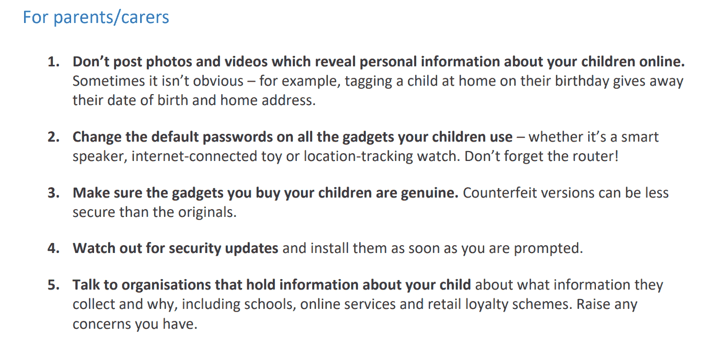

# 不要在网上发布你的孩子

> 原文：<https://thenextweb.com/lifehacks/2018/11/12/dont-post-your-kid-online/?utm_source=wanqu.co&utm_campaign=Wanqu+Daily&utm_medium=website>

当我们开始两个小时的车程时，我怀孕的女朋友告诉我，她不希望任何人，包括我们自己，在社交媒体上分享我们孩子的照片。我完全反对，我们发生了激烈的争吵。

回家的路上，争论持续了大部分时间。我不明白其他人看到我们无疑是美丽的孩子，我们的幸福，以及他们进化成人的问题。

我不明白我们如何告诉别人不要分享我们孩子的照片。我不想成为‘那种类型的人’；那种回避技术，强迫周围的人屈从于他们意愿的人。

最重要的是，我不明白其他人围绕我们选择分享的图片创作自己的故事有什么问题。

但是我的女朋友没有退缩，我非常感谢她没有退缩。

## 谁关心你的孩子？

我如此反对的主要原因，是因为我认为她的论点微不足道。谁在乎别人怎么看我们的孩子，我们怎么养，他们怎么说我们的小家庭？

但是我越想，她的观点就越有道理。不仅因为我试着对别人的想法不感兴趣，还因为我们的家庭和世界其他地方之间的平台。

问题是，不仅仅是人们会围绕着我们这个小小的人类形成观点、先入之见和叙述。是谷歌、Facebooks、亚马逊、爱普生以及所有成千上万的数据收集公司[围绕我们的在线角色以及我们与他人、事物和想法的关系创建了个人资料](https://motherboard.vice.com/en_us/article/bjpx3w/what-are-data-brokers-and-how-to-stop-my-private-data-collection)。

*一片凉爽(又恐怖！)数据经纪商 Epsilon 的营销视频，看着看着就不寒而栗*

我最想避免的是网上对我目前未出生的孩子的描述——这个孩子可能已经不可阻挡地从我们访问的婴儿网站、我们购买的尿布、我们阅读的文章以及我们交朋友的其他准父母那里发展起来了。

一篇名为 *[的报道谁知道我呢？英国儿童专员本月出版的《T2》和《T3》强调了这种感觉。该报告概述了“儿童数据的收集和共享”，实际上为现在或未来的父母提出了一些很好的观点。](https://www.childrenscommissioner.gov.uk/wp-content/uploads/2018/11/who-knows-what-about-me.pdf)*

在前言中，儿童专员安妮·朗菲尔德列出了一些重要的数据:“到 13 岁时，父母已经在社交媒体上发布了 1300 张他们孩子的照片和视频。”

根据他们提供的报告，这比 2016 年的近 300 张图片和视频有所下降，但仍然是一个相当大的数字。比这个数字更糟糕的是，人们倾向于在重大场合分享照片，无意中泄露了他们孩子的个人信息。

## 放弃一切

例如，在孩子生日那天分享一张照片，可以告诉广告商孩子的生日是什么时候。如果你忘记关闭位置数据，他们会知道他或她住在哪里。

如果是其他地方的生日聚会，它可以告诉广告商他们喜欢什么——例如自然历史博物馆的恐龙，或者木乃伊，或者皇家后代，或者迪士尼。

报告指出，不要忘记“‘第一天上学’的照片，这些照片通常会通过学校标志和街道标志等细节无意中泄露孩子的位置或身份”。

许多人(选择)忘记的是，在 Instagram 或任何其他服务上分享照片会启动一种机制，吸收照片中包含的数据——谁在照片上，照片在哪里，照片是用什么设备拍摄的，照片中的人的关系等等——将照片分割，并与任何发现这些数据有用的公司分享。

Credit: [CrackedLabs](http://crackedlabs.org/en/corporate-surveillance)

An infographic made by CrackedLabs on what info some data brokers collect on you and yours

<noscript></noscript>

其中一些可能最终会出现在大公司的数据库中，这些大公司编制具有商业利用价值的个人资料。其中一些可能会被用来向父母投放孩子可能感兴趣的玩具广告。其中一部分可能会被存起来，潜伏起来，直到保险公司或银行需要它，或者设定保释金。

这种不直接提供给社交平台的数据在报告中被称为“提供的”或“推断的”数据。这些数据没有明确给出，而是由脸书、Instagram(属于脸书)或谷歌等公司从你可能会自豪地分享你的小天使的看似无辜的帖子中提取的。

所有这些都与系统中已经存在的其他数据相结合，描绘出您孩子的数字图像，这可能不完全准确，但仍被许多公司用来做出有关他们的决策。

报告称，你分享的一切“可能会对孩子的生活产生真实而持久的影响”。

我们稍后会谈到这些真实的、长期的影响的缺点，因为并非一切都是可怕的，选择性地分享数据甚至可能会有一些好处。

## 好的，简单来说

并非所有数据都是平等的。在 Instagram 上分享的图片是数据，但匿名的健康记录也是数据。数据收集者也不是都来自同一块布料。

《卫报》报道，在一个例子中，英国地方当局从儿童和父母那里收集数据，使用预测分析成功地向社会工作者标记出有虐待风险的儿童。这可以被看作是对数据的“好”利用——如果你能透过模糊的奥威尔式面纱看过去的话。

但是和任何其他数据收集一样，永久收集的数据可能会留下一份记录，这份记录往好了说可能很难被动摇，往坏了说可能会被完全滥用。

## 坏的，广泛地

CCO 报告指出，他们听说犯罪分子收集父母共享的信息——出生日期、家庭住址和全名——一旦孩子年满 18 岁，他们就用这些信息申请欺诈性贷款和信用卡。

像母亲的娘家姓、第一只宠物的名字、学校或汽车等常见安全问题的答案也越来越容易从“分享”中收集到，因为该报告称一些父母倾向于分享他们孩子生活的一切。

现在，上述案例可能是极端和罕见的，但像脸书和 Instagram 这样的“合法”实体所能做的可能更令人担忧——因为你不能真的向警方报案。

CCO 报告详细说明了基于共享数据的儿童特征分析是一个严重的长期风险:

> 概要分析是一个过程，其中使用算法和机器学习来分析关于一个人的数据，“以分析或预测与该自然人的工作表现、经济状况、健康、个人偏好、兴趣、可靠性、行为、位置或运动有关的方面。”

它指出，这些档案可以用来确定偏好，预测行为，并对个人做出决定。在最简单的情况下，这对于广告商决定向孩子(或他们的父母)展示什么产品以及何时展示非常有用——比如在他们生日前后，你可以方便地分享他们的生日。

在更严重的情况下，侧写可以用来确定某人是否可以申请抵押贷款、某种医疗保险、大学甚至保释。下次你想发布一些你的孩子做过的可爱、聪明或愚蠢的事情时，你可以考虑一下。

## 这一切都说明了

个人档案汇集了各种不同来源的信息——有时甚至在孩子出生前就开始了——所以你所做的一切，无论看起来多么无辜，都会累积起来。

最重要的是，作为便便蛋糕上黏糊糊的糖衣，一些对个人数据(或任何数据)进行分析的机器，如报告所称，“不公平地简化”，这意味着它们不会友好地对待细微差别、借口或不一致。一个“不良行为”数据点，比如一张未付的账单，可能标志着你不值得信任，即使你是一个模范人类。

最重要的是算法偏差，因为机器训练的数据集在某种程度上是倾斜的，或者因为人类训练有某些意识或无意识的偏差。这是一个糟糕的例子，但如果训练大学申请算法的人讨厌非常高的人，因为他们在音乐会上总是站在前面，这可能会教机器拒绝这些申请。

## 还有呢！

A screenshot of data broker Acxiom’s cute diagram that shows how much data they collect and what they help companies do with it. The man in the middle could be your kid :(

<noscript></noscript>

我只讨论了分享对孩子的未来意味着什么，但还有更多，从孩子的在线行为汇总到联网玩具和设备(如婴儿监视器)收集的数据。CCO 报告在详细描述这些风险方面做得很好，但是考虑到本文的篇幅，我将把这些留到以后的恐怖文章中。

## 还有希望吗？

CCO 报告的结尾是一些正在采取的措施，包括立法和教育措施，以及一些对政府、公司、学校和家长显而易见但没有效力的建议。

Screenshot from the Children’s Commissioner report

<noscript></noscript>

此外，像 GDPR 这样的法规可能会让我们对正在收集的关于我们和我们孩子的数据有更多的控制权，如果它最终被强制执行的话。就在这个月，隐私国际[在 GDPR 的领导下对几家最大的数据聚合商提出了正式的投诉，指控他们侵犯数据保护。](https://privacyinternational.org/advocacy-briefing/2426/our-complaints-against-acxiom-criteo-equifax-experian-oracle-quantcast-tapad)

给你一个规模的概念，被告之一是 Acxiom，一家数据经纪人，自称拥有“对全球约 7 亿消费者的多源洞察，我们的数据产品包含来自数百个来源的 5，000 多个数据元素。”这些来源包括社交媒体，其中一个消费者可能就是你的(未出生的)孩子。

## 所以，努？

当我看到这篇文章的统计数据时，我可能会失望地注意到，大多数人在读到第三句时会感到厌烦，不会应用上面任何细微的建议来尽可能地保持他们孩子的形象。

所以我将它归结为一个简单的方法来确保这一点。这种方式将我们带回到我执着的女朋友和她对此事的立场，但也将它扩展到不仅仅是照片。

确保你的孩子不会因为你的过度分享而遭受不良后果的最简单的方法就是不要分享。