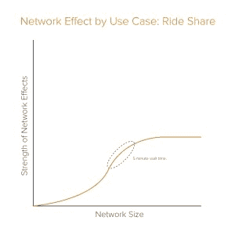
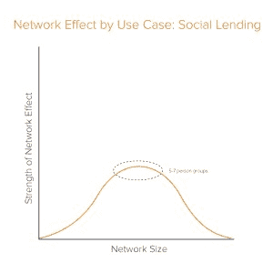
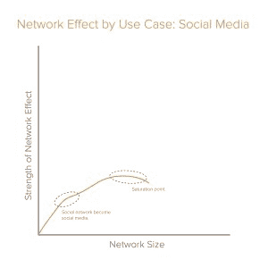
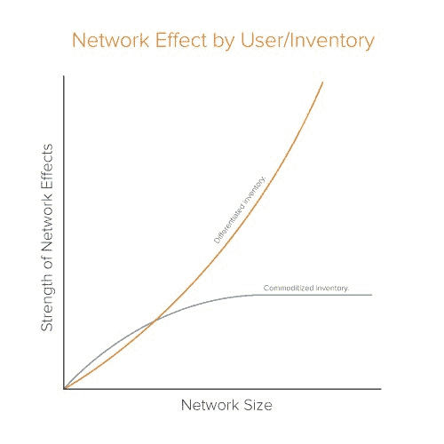
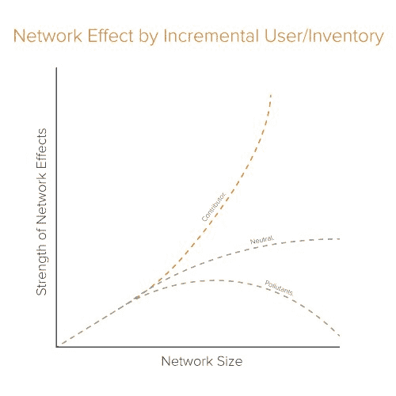

# 网络效应的动力学|安德森·霍洛维茨

> 原文：<https://a16z.com/2018/12/13/network-effects-dynamics-in-practice/?utm_source=wanqu.co&utm_campaign=Wanqu+Daily&utm_medium=website>

互联网时代最成功的公司和产品都是基于 [网络效应](https://a16z.com/2016/03/07/all-about-network-effects/) 的概念，随着越来越多的人使用网络，网络对用户变得越来越有价值。对于亚马逊和谷歌这样的公司来说是如此，对于维基百科和一些加密货币这样的开源项目来说也是如此。[网络效应背后的理论](https://en.wikipedia.org/wiki/Metcalfe%27s_law) 表明，具有网络效应的平台和产品随着规模变大而变得更好——不仅仅是对用户的价值，还在于积累更多资源来 [改进他们的产品](https://a16z.com/2018/07/20/after-product-market-fit-marc-andreessen-elad-gil/) ，从而加强“飞轮”。

但最近，现实似乎与理论有所背离。

我们没有看到赢家通吃的市场，而是看到各种网络效应公司——从消息应用到运动鞋市场——*在多个参与者之间分割* 市场。此外， 即使是那些看起来已经初步赢得了市场，并且似乎已经建立了一条深沟——从约会应用到交易平台——的公司，也在努力维持自己的地位，以对抗模仿者和新进入者。只要看看 Instagram Stories [正在做什么](https://www.socialreport.com/insights/article/115005343286-Instagram-Stories-Vs-Snapchat-Stories-2017-Statistics) 来抓拍， [最近甚至在](https://www.businesswire.com/news/home/20181022005679/en/Piper-Jaffray-Completes-Semi-Annual-Generation-Survey-8600) 其专门的青少年人口统计中超过了它。

所有这些是否意味着我们所知的网络效应已经死亡？不，但是他们比以前更有活力了。

虽然我们知道并非所有的网络效应都是一样的，但它们的发展也不尽相同。每种产品都有不同类型的网络效应，随着时间的推移，这些效应会以不同的方式成熟和发展。如果有什么不同的话，大多数网络特效公司的变化比以往任何时候都要快。那么，企业家和创始人如何才能驾驭这个看似网络效应逐渐减弱的时代呢？诀窍是知道你的网络效应今天是什么样子，但也要预测它们将如何随着时间的推移而演变。为此，你需要了解你的公司的三个方面，以及它们如何改变未来: **1)你的价值主张**、 **2)你的用户/库存**和 **3)你的竞争生态系统**。否则你可能会措手不及，声称网络效应已经死亡。

这里有一些预测未来网络影响的原则，超越了目前的静态观点。然后，一旦你知道你有网络效应，看看[这篇文章](http://a16z.com/2018/12/13/16-metrics-network-effects/)如何测量和保持它们。

### **1)价值主张:并非所有产品都生而平等**

随着公司或产品的成长，其网络效应并不总是保持在收益递增(甚至直线)的轨迹上；它可能渐近线，或达到拐点，甚至逆转。创始人的关键是知道什么价值主张驱动他们的网络效应，了解他们是弱还是强，然后密切关注他们将如何演变——特别是当你迭代到 *新的价值主张和产品与市场契合的附加层* 时。

我们来看几个例子:

**拼车。** 在任何地区，司机供给和乘客需求都是相辅相成的，所以更多的司机意味着更短的等待时间，这意味着更多的乘客需求，这意味着更多的司机想开车……飞轮旋转！但这个价值主张有一个问题:一旦你在某个特定的地理位置达到 5 分钟的等待时间，乘客就不会关心网络中是否有更多的司机。一旦多个平台达到相对流动性的水平(例如，足够的司机满足乘客 5 分钟的等待时间)，特定平台对乘客来说就不那么重要了。在这些市场，他们需要在 * 和其他 * 载体上竞争，比如品牌/声誉、价格、用户体验、忠诚度计划等等。换句话说，价值主张需要发展。

**社会借贷。** 有时网络效应的变化不是由相对流动性(如等待时间)驱动的，而是由绝对流动性(如网络中的人数)驱动的。以 Frank 的案例研究为例，它允许人们向朋友和家人借钱或借钱给他们。早期，坦诚群体中的朋友越多，意味着需求越大，流动性越强，这就为人们加入这些群体创造了更大的激励。但是一旦一个团体有超过 7 个人，他们就变得 * 更少 * 可能借出或借出:结果人们只有大约 7 个朋友/家庭成员，他们有那个信任水平！在这种情况下，随着个人的网络超过价值主张，网络效应从积极变为消极。这种模式也适用于许多其他高度社会化的产品。

**社交网络。** 随着脸书的用例从与朋友分享状态更新变成浮出水面的新闻和内容，网络效应减弱了。太多的朋友/关注者意味着人们不愿意分享个人内容，这种体验更多地转移到新闻和公共内容上。价值主张和网络效应也随之转移——从社交网络转移到社交媒体。重要的是，在媒体发现的背景下增加额外的节点比在纯社交网络的早期更没有价值。因此，价值定位的转变意味着网络效应曲线达到了拐点。虽然一些功能(如监管算法、时间线)通过让用户添加更多朋友，同时仍然让内容感到相关，帮助推迟了这一转折点，但最终内容组合、价值主张和网络效应都发生了变化。

**分散平台。** 举例来说，如果你认为比特币是数字黄金，那么网络效应将是更多的买家/卖家意味着更多的流动性，从而为所有人增加平台的价值。但如果你认为比特币是一个支付平台，那么只要它经历网络拥塞或其他摩擦，就不一定越多越好。这是一个值得考虑的有趣案例(不是出于投资目的)，因为这是一个例子，说明同一平台的不同价值主张如何相应地加强或削弱网络效应。这也是一个很好的例子，说明了附加功能(例如，扩展、增加吞吐量和提高交易速度)如何帮助价值主张发展、转变，甚至创造新的网络效应轨迹。

分享上述例子的目的是展示网络效应的细微差别和演变。如果你不注意这些因素，你可能会认为网络效应在某个特定行业中不再存在，而这可能是释放新价值的问题。

### **2)用户和库存:并非所有用户生来平等**

你的产品或平台目前拥有的用户和库存类型，以及你正在添加的类型，对于理解和预测你的网络效应轨迹至关重要。

##### **商品化与差异化供应**

预测网络效应的一个重要因素——尤其是在双边平台/市场中——是用户/库存是否商品化或差异化。

在拼车中，客户(骑手)对基础服务提供商/库存相对不了解，因为他们认为供应(司机/汽车/运输)是可互换的，因此是商品化的。拥有相对商品化库存的平台——从按需存储公司到交付公司——一旦达到流动性的基本水平，就更有可能看到它们的网络效应渐近线。对于拼车这样的类别来说，进入相邻的企业(就像 Lyft 在医疗保健项目上所做的那样，或者优步在食品配送上所做的那样)可以实现差异化——但仍然是可替代的——库存，这可能会增强网络效应的强度。T5】

库存差异更大的平台/市场具有更强、更持久的网络效应，因为它们拥有适合客户独特偏好的多样化库存(同时保持库存的可替代性)。例如，AirBnB 可以向用户显示洛杉矶每晚 225 美元至 325 美元的住宿信息，这与其他人搜索价格在 150 美元至 250 美元之间、有阳台和热水浴缸的信息重叠。因此，这个平台对市场双方来说都比仅仅展示一套商品化的标准客房和行政客房的网站更有价值。网络效应仍然很强，不仅因为它在所有这些不同类型的库存中达到了一个基本的流动性水平(使它们对更多用户有价值)，还因为它还继续看到新供应带来的回报不断增加。

但是越是差异化的库存，平台越需要做好策展和匹配。这本身也增加了平台的整体防御能力，并随着时间的推移保持强大的网络效应曲线。

##### **增量用户类型**

然而，除了用户和库存的商品化本质之外，并不是给定网络的所有成员都是平等的。一些比另一些更有价值，或者更没有价值。例如，一家非常受欢迎并且位于很多用户附近的餐馆比一家不知名但食物很差的餐馆给 OpenTable 网络增加了更多的价值。

当你预测出你的网络效应——更重要的是，你的[增长](https://a16z.com/advice-and-how-to/growth/)战略 以获取和吸引更多用户——你需要关注你可能吸引的增量用户。他们是网络“ [污染物](https://sloanreview.mit.edu/article/confronting-the-limits-of-networks/) ”，“中立者”，还是“贡献者”？对于一个社交网络来说，增加一个脱离其他用户的巨魔是一个去除价值的污染物。添加一个潜伏者是中性的，因为这个人不会增加或减少网络的任何价值。增加一个优秀的内容制作者会给网络带来巨大的价值。

因此，确保激励你想要的用户，同时抑制你不想要的用户，这是关键。这就是为什么大多数伟大的平台也大量投资于监管机制，以筛选和删除不良库存/用户(例如，维基百科的编辑，Airbnb 的评论/入职等)。).不幸的是，这些筛选机制并不总是有效，有时寻找强大贡献者的成本会变得非常高，因此相对于成本的增长计算在这里非常重要。

### **3)竞争:并非所有市场都是平等的**

你的市场以及竞争对手和替代品的性质对于理解和预测网络效应也至关重要。

##### **网络重叠**

虽然网络效应企业在规模上更容易防御，但它们也不能幸免于竞争。但对于这些类型的企业来说，这不仅仅是找出谁是你的直接竞争对手的问题——你还需要考虑 *网络重叠* 。如果其他人拥有与你相似的网络，他们进入你的市场的风险总是存在的。因为他们已经有了一个类似的网络，他们将更容易进入你的空间(Instagram 进军类似 Snapchat 的一次性“故事”就是一个很好的例子)。在竞争对手可能已经注册了你的网络的超集(例如 DoorDash 和 Uber Eats 中国的滴滴和优步)。

##### **转换成本**

竞争对手的低转换成本也能降低网络效应。无缝注册和加入通常有助于向您的产品添加用户，但是如果您的竞争对手也有同样的无缝加入，用户可能会成为多租户。由于进入门槛和转换成本较低，使用多个约会应用程序或地图产品很容易。

##### **满足需求的多租户**

当用户无法使用单一平台来实现他们的目标时，网络效应就会减弱。就业市场是一个很好的例子:公司可能会在多个招聘平台上列出他们的职位空缺(即多租户)，因为招聘是经营企业的一个关键部分，绝对需要完全满足，没有一个平台可能满足他们所有的招聘需求。当一个平台的一方是多租户时，运营商通常会面临更大的压力——在定价、功能和必要的流动性方面——这可能会颠覆经济状况。

在我们的另一篇文章《衡量网络效应的 16 个标准:[http://a16z.com/2018/12/13/16-metrics-network-effects/](http://a16z.com/2018/12/13/16-metrics-network-effects/)中，我们将详细介绍如何衡量所有这些因素。

* * *

快速跟随者可以比以往走得更快。Instagram 的故事可以挑战 Snap in，嗯，Snap。招聘市场可以立刻吸引成千上万的雇主。万物的 API 化使得做任何事情都变得更容易:单单 Stripe 就意味着每个市场都可以在一个小时内整合支付，而以前，易贝通过建立和收购自己的支付系统获得了一些保护。

产品迭代的速度越来越快，网络扩展的速度越来越快，竞争对手的起步也越来越容易，这些都极大地改变了我们对企业网络效应的预测。在赢家通吃的市场中，先行者可能曾经拥有看似持久的优势，而网络效应的变化比以往任何时候都要快。尤其是在特定因素——渐近价值主张、网络重叠、污染物数量增加等。—会降低平台在未来产生可持续网络效应的能力。

这不是要打击任何人！网络效应将继续支撑最具影响力的软件业务。它只是提醒创始人和其他产品开发者要意识到什么会改变以及为什么会改变，这样你就可以做更多的事情来计划和解决这些问题，而不是被它们蒙蔽了双眼。网络效应没有消亡，但它们比以往任何时候都更有活力。通过了解你的网络效应今天是什么样子，明天会走向哪里，创始人可以有意识地设计网络效应和其他护城河，而不是被扔在变革的风中。

网络效应万岁！

*此处表达的观点是引用的 AH Capital Management，l . l . c .(“a16z”)人员个人的观点，并非 a16z 或其关联公司的观点。此处包含的某些信息来自第三方，包括 a16z 管理的基金组合公司。虽然来自据信可靠的来源，但 a16z 没有独立核实此类信息，也没有对信息的持久准确性或其在给定情况下的适当性做出任何陈述。T3】*

*本内容仅供参考，不应作为法律、商业、投资或税务建议。关于那些事情，你应该咨询你自己的顾问。对任何证券或数字资产的引用仅用于说明目的，并不构成投资建议或提供投资咨询服务。此外，本内容不针对任何投资者或潜在投资者，也不打算由任何投资者或潜在投资者使用，并且在决定投资 a16z 管理的任何基金时，在任何情况下都不得依赖本内容。(投资 a16z 基金的要约只能通过私募备忘录、认购协议和任何此类基金的其他相关文件进行，并应完整阅读。)提及、提及或描述的任何投资或投资组合公司并不代表 a16z 管理的投资工具的所有投资，也不能保证这些投资是盈利的，也不能保证将来进行的其他投资会有类似的特征或结果。安德森·霍洛维茨基金管理的基金的投资清单(不包括发行人未允许 a16z 公开披露的投资和某些公开交易的加密货币/数字资产)可在 https://a16z.com/investments/.T3 获得*

*其中提供的图表仅供参考，不应作为投资决策的依据。过去的表现并不代表未来的结果。该内容仅在所示日期有效。这些材料中表达的任何预测、估计、预测、目标、前景和/或观点可能会随时更改，恕不另行通知，并且可能与他人表达的观点不同或相反。更多重要信息，请见 https://a16z.com/disclosures。T3】*