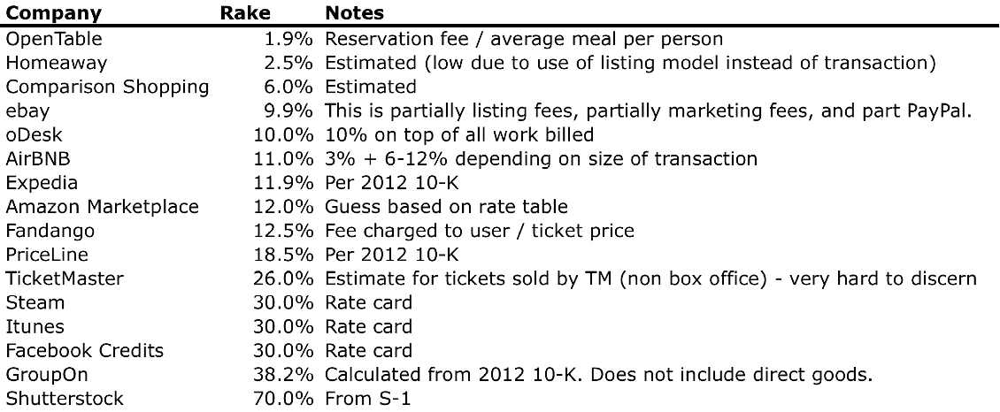
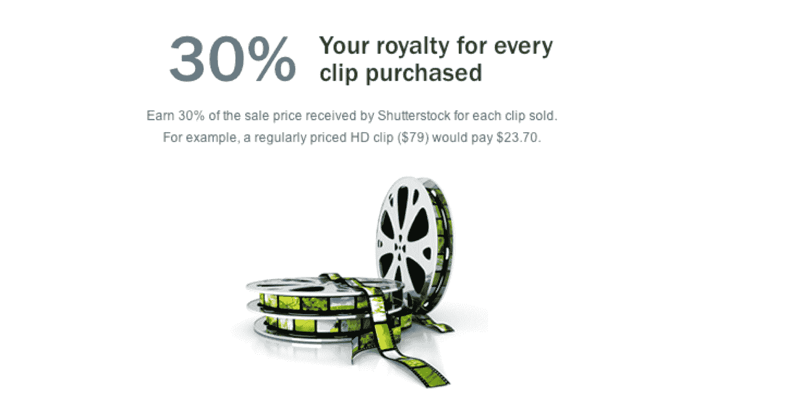
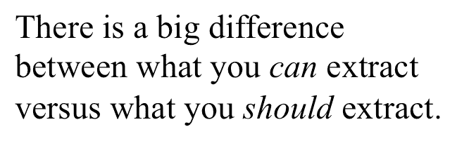
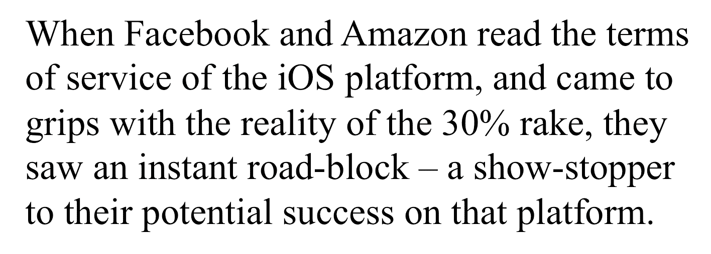

# 一把耙子伸得太远:最佳平台定价策略——超越人群

> 原文：<http://abovethecrowd.com/2013/04/18/a-rake-too-far-optimal-platformpricing-strategy/?utm_source=wanqu.co&utm_campaign=Wanqu+Daily&utm_medium=website>

April 18, 2013:

在赌场中,“rake”一词指的是赌场经营扑克游戏赚取的佣金。每手牌中，庄家会刮走一小部分底池，这实质上成为赌场的“收入”。虽然赌场使用术语“rake”，但存在大量有趣的词汇选择，它们都描述了同一件事——为经营服务的公司保留一点收入。例子包括“佣金”、“手续费”、“通行费”、“税收”、“vig”或“vigorish”、“果汁”、“受贿”和“贪污”(尽管最后一个通常与政治腐败有关)。

[

<noscript></noscript>](https://i0.wp.com/abovethecrowd.com/wp-content/uploads/2013/04/rake-table-2.png?ssl=1) 很多互联网市场也有 rake 或 vig。百分比佣金是市场收取的占 GMS(商品销售总额)百分比的金额，它通常代表市场的净收入。例如，易贝 2011 年的市场收入约为 66 亿美元，而通用汽车约为 686 亿美元，佣金比例不到 10%。收取更高的费用总是更好，收取更多的费用比收取更少的费用更好，这似乎有些重复。但事实上，反过来可能往往是对的。对任何平台公司来说，最危险的策略是定价过高——收取贪婪和过分热情的费用，这可能会破坏平台存在的初衷。

在讨论低收费和高收费的优点之前，让我们先看看互联网上不同收费的例子。上表显示了几个在线业务的估计利润占 GMS 的百分比。不要假设这些数字是特别准确的，因为一些供应商很难推导出这些数字。*此外，在票务等行业，回扣也很常见。你可以看到 iTunes、脸书和 GroupOn 的佣金非常高，而 OpenTable 和 HomeAway 的佣金则特别低。亚马逊市场费用[公布在他们的网站](http://www.amazon.com/gp/help/customer/display.html?nodeId=1161240 "Amazon Fees")上，并根据类别而变化，但基本上在 6-15%的范围内，所以假设平均约为 12%。易贝最近发起了一场咄咄逼人的运动，逐垂直地攻击亚马逊的费率表([这些百分比可以在这里找到](http://tctechcrunch2011.files.wordpress.com/2013/03/amazon.jpg "Ebay Marketplace Rate Changes"))。一家收入惊人的公司是最近首次公开募股的照片购买市场 Shutterstock，内容所有者仅获得总收入的 30%。正如我们将在下面讨论的那样，这实际上可能是一个非常脆弱的局面。

在评估新的市场投资时，我们自然会偏向那些理解降低佣金背后的战略原理的企业家。如果你的目标是在很长一段时间内建立一个赢家通吃的市场，你希望建立一个摩擦最小的平台(包括产品和定价)。高佣金是一种摩擦形式，因为你的佣金成为了消费者到岸价格的一部分。如果你收取过多的佣金，你的市场中的商品价格就会不自然的高(相对于你的市场之外的任何东西)。为了让你的平台成为“确定的”交易场所，你需要行业领先的定价——如果你的 rake 是定价过高的事实原因，这是不可能的。高利润也为供应商寻找其他地方创造了自然的动力，这危及了可持续性。这些原因可能是 GroupOn 核心日常交易业务陷入困境的原因([北美第三方收入在第四季度同比和季度环比均有所下降](http://seekingalpha.com/article/1253541-is-groupon-becoming-a-wholesaler "GroupOn Core"))。对于大约 38%的佣金(这是在要求商家向消费者提供 50%的折扣之后)，供应商从每笔交易中的回收仅为 30%，代表 70%的“有效”佣金。

[

<noscript></noscript>](https://i0.wp.com/abovethecrowd.com/wp-content/uploads/2013/04/Screen-Shot-2013-04-17-at-10.31.32-PM.png?ssl=1) 

高容量结合适度的耙是一个真正的有机市场和可持续竞争优势的完美公式。一个可持续的平台或市场是这样一个平台或市场:在网络中存在的价值明显超过在网络中存在的交易成本。这样，供应商将感到有义务留在平台上，而消费者将不会看到网络提供商负担过重的价格。在这种情况下，每个人都是赢家，尤其是平台提供商。高佣金可以让你更快地实现更大的收入，但它最终将代表一个战略红旗——一个可以被生态系统中的其他人利用的定价保护伞，也许是具有更具破坏性的商业模式的人。正如杰夫·贝索斯喜欢说的，“你的保证金就是我的机会”

许多人不知道这一点，但互联网最惊人的成功故事之一是 Priceline 集团的欧洲分部，它以 Booking.com 品牌运营。Booking.com 是欧洲在线旅游领域无可争议的领导者，在 TPG 令人震惊的 350 亿美元市值中占有相当大的份额。Booking.com 并不总是欧洲的在线领导者——事实上，他们是一个颠覆者，从其他大型在位者那里窃取了旗帜。20 世纪 90 年代末，像 Expedia 和 Travelocity 这样的公司开始迷恋所谓的“[商业模式](http://www.travel-industry-dictionary.com/merchant-model.html)”基本上，这些公司会为消费者“打包”度假产品，并作为捆绑产品出售。商业模式可以产生超过 30%的佣金，因此对 Expedia 这样的公司很有吸引力。Booking.com 采取了更加激进的方法(也许因为这是唯一可行的方法)。他们从 10%的“代理模式”开始，这不仅代表了更低的佣金，还为供应商提供了更好的现金流条件。因此，他们能够注册欧洲几乎所有的小酒店。这为消费者带来了更多的选择，也从供应商那里获得了更多的支持。[Skift.com 大学的丹尼斯·沙尔](https://twitter.com/denschaal)对 Booking.com 如何主宰欧洲的[进行了精彩而详细的描述，同时还有一篇最近的文章论述了](http://skift.com/2012/06/25/how-booking-com-conquered-world/)[行业向低摩擦](http://skift.com/2012/07/30/expedia-turns-hotel-booking-head-you-hear-that-booking-com/)(低风险)代理模式的自然转变所带来的长期影响。

事实证明，Priceline Group 现在的平均佣金甚至更高，因为他们允许商家自愿提高佣金，以获得更好的网络排名(你可以在上表中看到这一点)。这是我最喜欢的市场商业模式之一。你开始时收取较低的佣金，以获得广泛的供应商采用，然后加入市场驱动的定价机制，允许那些希望获得更多销量或曝光率的供应商在选择加入的基础上支付更多费用。这样，没有人会因为过高的费用而离开网络，但由于竞争的动态，随着时间的推移，你最终会获得更高的平均佣金。当价格因投标和竞争而上涨时，供应商会责怪他们的竞争对手，而不是平台(这是谷歌 AdWords 商业模式的一部分)。这也让你可以从那些希望花更多钱来推销自己的供应商那里榨取更多的钱(而不会对那些不愿意的供应商提高税收)。

这是另一个与耙子有关的有趣故事。2006 年，Benchmark 开始在 oDesk 与 Gary Swart 及其团队一起工作。在探索差异时，我们非常迷恋他们的全球技能人才市场，并惊讶于他们在线工作场所的工具如何允许客户雇用、管理和支付分布式团队的工作。结合竞价和信誉系统，oDesk 建立了一个“工作的 ebay”与此同时，市场上出现了几家较大的公司，如自由职业者和编码器租赁公司。在详细讨论了竞争之后，团队想出了将佣金从总成本的 30%(这是行业标准)降低到 10%的主意。我们很高兴听到团队如此激进的战略思想，他们也很高兴听到一位具有长期眼光的投资者的观点(这一变化显然将当期收入减少到当前水平的 1/3)。剩下的就是历史了。到 2009 年，oDesk 超过了最接近的竞争对手，他们现在是迅速崛起的“在线工作”行业的明显领导者(比他们的顶级竞争对手加起来还要大)。

所有这些让我们想到了两个非常有趣的例子，它们是当今互联网的前沿和中心——脸书和苹果。这两家公司都对其平台上的交易收取高达 30%的费用。因为在这些平台上构建的大多数开发人员都是做软件的，所以当他们分享 30%的收入时，他们不会立即感到痛苦。毕竟，边际成本接近于零，因此费用是可以承受的。但真正的问题是:平台之上的 30%市场有助于强化平台本身的战略定位吗？或者这仅仅是一种获取收入的行为？如果是这样的话，从战略的角度来看，是否存在“耙得太远”可能是净负面的风险？
[

<noscript></noscript>](https://i0.wp.com/abovethecrowd.com/wp-content/uploads/2013/04/Screen-Shot-2013-04-17-at-9.42.48-PM.png?ssl=1) 先说脸书。最初几年，脸书的应用平台取得了巨大成功。他们无处不在的平台的分销能力对许多公司来说是一个非凡的工具；尤其是游戏公司。该平台如此迅速地获得成功，以至于许多早期采用该平台的人销售额飙升至数亿美元。Zynga 尤其擅长在脸书浪潮中冲浪，在成立的第六年，它的收入飙升至 10 亿美元！一切看起来不可思议。快进到今天(仅仅几年后)，游戏公司不再把整个公司都押在脸书身上。奇怪的是，他们正在积极地、战略性地寻求扩大非 FB 分销。

确实很难准确指出哪里出了问题。有人可能会质疑脸书将*变成*游戏平台的承诺。一些人可能还会强调 Zynga 的成功缺乏广度，并认为 Zynga 相对于该领域的其他公司来说“太好了”。有些人可能会指出，手机的崛起给脸书带来了平台转型的困难(我们很快就会谈到这一点)。除了这些问题，还有一个强有力的论点是，30%只是一个过度的倾斜。

当你考虑到这些游戏公司中的许多也是脸书广告产品的大买家时，这表明“实际”佣金，即在平台上竞争的实际成本，远高于 30%。鉴于脸书作为全球领先的高准入门槛社交网络的地位，没有必要在第一天就实现收入最大化。更重要的是证明该平台是一个可行且高效的广泛产品和服务分销机制，并让所有合作伙伴相信该平台本身无可置疑的功效。

去年 11 月，Zynga 和脸书一起重新谈判了他们之前的长期商业协议。根据旧协议，Zynga 被要求支付 30%的收入，即使他们在“脸书之外”产生收入。那是一把非常具有攻击性的耙子。现在，Zynga 摆脱了它对脸书平台做出的许多承诺，并被允许在脸书以外建立独立的收入来源。现实是，Zynga 仍然高度依赖脸书。然而，Zynga 股东现在正在跟踪 Zynga 与脸书相关的收入比例，并认为如果他们能够减少这种依赖，这是一件好事。底线是，整个游戏行业已经失去了对脸书平台的一些热情，脸书将很难重现他们曾经拥有的魔力和势头。

苹果的情况更极端，因为影响更大。尽管苹果在其令人难以置信的计算产品上拥有业界领先的硬件利润率，但苹果认为有必要从其应用生态系统创造的收入中抽取 30%，以及从媒体租赁和销售中抽取 30%。回想起来，要求双方都得到报酬是一种过度自信的表现。然而，事实是他们让这个工作了很长时间。许多公司在苹果平台上蓬勃发展，如果没有 iOS，它们以前不存在，将来也不会存在。对于苹果来说，由于其 30%的 rake 取得了惊人的成功，它已经创造了数十亿的高利润收入和相应的底线利润。所有这些都有助于将苹果推向商业层级的最顶端——世界上市值最大的公司。

苹果过高的佣金带来的最大问题是它对潜在的长期战略合作伙伴关系的影响。具体来说，两家有可能*帮助巩固 iOS 平台成功的公司犹豫了一下，然后继续支持一个竞争平台。亚马逊和脸书*本可以*和*本应该*成为苹果的闺蜜。如果苹果能回到过去，他们肯定也会选择做闺蜜。对这三家公司来说，最具威胁的公司显然是谷歌。然而，亚马逊拥有围绕 Kindle 建立的数字媒体业务。如前所述，脸书有 30%的收入用于帮助游戏开发商通过其网络发行游戏并从中获利。当脸书和亚马逊阅读了 iOS 平台的服务条款，并了解了 30%佣金的现实时，他们看到了一个即时的路障——他们在该平台上潜在成功的绊脚石。很难想象他们的商业模式和苹果的商业模式会共存，所以他们最终选择了全力支持 iOS。*

[

<noscript></noscript>](https://i0.wp.com/abovethecrowd.com/wp-content/uploads/2013/04/Screen-Shot-2013-04-17-at-11.02.59-PM.png?ssl=1) 

底线是他们本可以成为很棒的搭档。如果苹果有更低的价格，或者他们对现有价格不那么固执，合作关系可能已经形成(问问好莱坞的任何人——“分裂”可以解决任何问题)。iOS 本可以既是权威的脸书移动设备，也是权威的亚马逊购物设备。他们*可能*从一开始就已经在深层次上被整合:你的社交网络中的联系人；你的亚马逊一键通凭证就在指尖。杰夫·贝索斯、马克·扎克伯格和史蒂夫·乔布斯一起站在舞台上谈论这些公司一起做的真正令人惊叹的事情。本来会很棒的。但事实并非如此。

相反，正如你所知，脸书的新家庭移动应用程序只能在谷歌的安卓系统上运行，而安卓系统是苹果过去十年的主要克星。目前还没有在 iOS 上提供 Home 的计划，谷歌受人尊敬的董事长埃里克·施密特(Eric Schmidt)在最近的一次深入移动会议上表示赞赏，他说:“[我认为这太棒了——我喜欢它](http://venturebeat.com/2013/04/16/google-chairman-eric-schmidt-on-facebook-home-i-love-it/#heJeCBzhzYZ5qIbo.99)”。脸书没有成为苹果的平台区分者，而是在帮助和怂恿苹果唯一真正的竞争对手。

亚马逊相对于苹果的情况更加严峻。苹果对亚马逊“30%”的强硬态度不仅疏远了一个重要的合作伙伴，还推出了一个竞争对手。亚马逊显然是在安卓变种的基础上设计了它的 Kindle Fire 系统。但这只是问题的一半。亚马逊，以真正的亚马逊方式，正在攻击苹果暴露的业务弱点:他们通过收取高硬件利润和高内容佣金获得的丰厚利润。正如在最近给股东的信中概述的那样，亚马逊不认为它的客户应该为硬件和内容支付丰厚的利润。“我们的业务方针是以大致盈亏平衡的价格销售高端硬件。我们希望在人们使用我们的设备时赚钱，而不是在人们购买我们的设备时赚钱。”亚马逊计划对硬件平台进行补贴，只靠内容利润率生存。30%的 rake 基本上推出了一个具有颠覆性定价模式的讨厌的竞争对手。

彼得·德鲁克的五大商业原罪中排在第一位的是“崇拜高利润率和溢价定价”正如德鲁克所言:*“对高价的崇拜总是为竞争者创造一个市场。而且高利润率不等于最大利润。总利润是利润率乘以营业额。因此，最大利润是通过产生最大总利润流的利润率获得的……”*大多数风险资本家鼓励企业家价格最大化，在每笔交易中尽可能多地从他们的生态系统中获取租金。这很可能是短视的。你*能*提取的东西和你*应该*提取的东西之间有很大的区别。水往山下流。

[在这篇文章写完之后，一些读者指出，也许用低价扰乱市场领导者的最惊人的例子是中国的淘宝 vs 易贝。如果淘宝母公司 Alibaba.com 的 IPO 规模只有人们预期的一半，那么这可能是有史以来最大的市场定价胜利。]

请告诉我们你是否有其他名字要添加到表格中，或者你是否认为有些数字需要更正。我将更新表格，并把[滚动更新放在 quora 帖子](http://www.quora.com/The-Internet-2/Has-anyone-compiled-a-comprehensive-list-of-rakes-or-commissions-for-the-Internets-leading-marketplace-companies)关于同一主题的回复中。

### *相关*