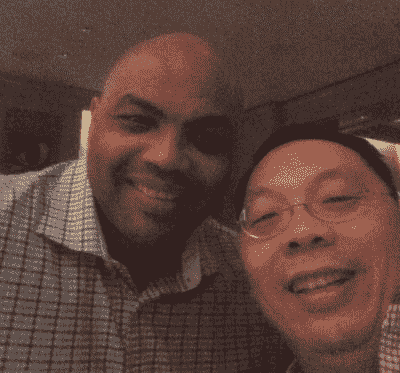
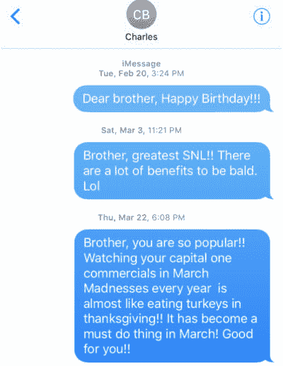
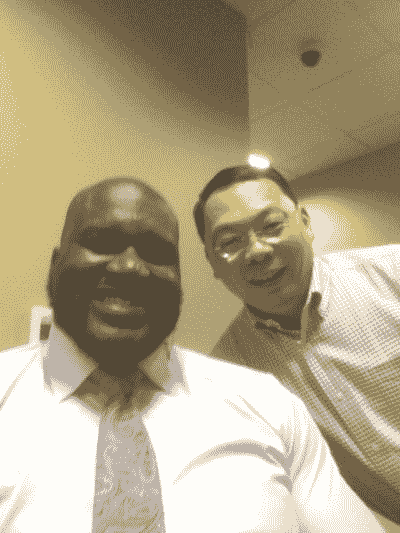
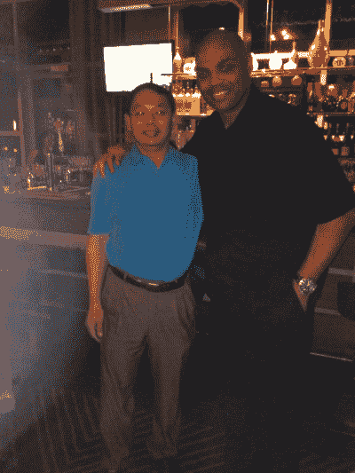
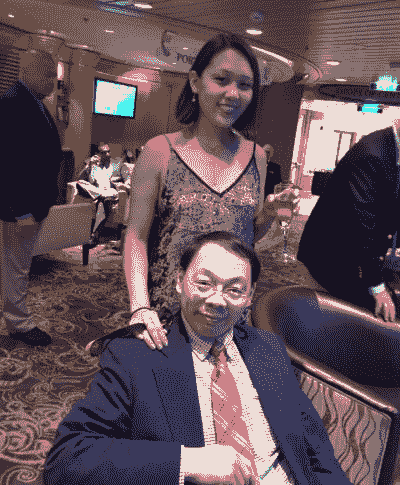
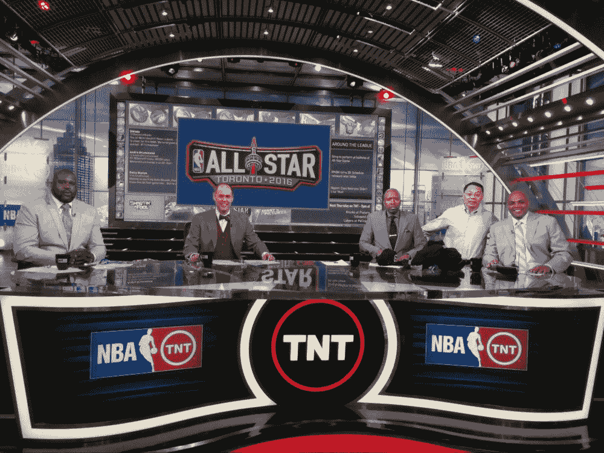

# 我爸和查尔斯·巴克利的友谊|只有一场比赛

> 原文：<https://www.wbur.org/onlyagame/2018/12/14/lin-wang-charles-barkley?utm_source=wanqu.co&utm_campaign=Wanqu+Daily&utm_medium=website>

[*Chinese version of the story*](https://www.wbur.org/onlyagame/2018/12/18/lin-wang-charles-barkley-chinese-translation)

*这个故事在 2020 年 9 月 19 日作为《Only A Game》的一部分被重播。*

*(编者注:请看[来自记者王格的最新报道](https://www.wbur.org/onlyagame/2019/06/14/shirley-wang-lin-charles-barkley-reflection)。)*

当查尔斯·巴克利的母亲查西·格伦于 2015 年 6 月去世时，巴克利的家乡阿拉巴马州的利兹市前来参加葬礼，表达敬意。但也有一位不速之客。

巴克利的朋友们不太能认出他。他不是篮球运动员，不是体育明星，也不是巴克利的家乡人。我可以告诉你的是:他穿着条纹红色 polo 衫，夹在卡其布短裤里，对买一送一的交易非常兴奋。他是个通勤者。他是爱荷华州马斯卡廷的猫砂科学家。简而言之，他是每个人的郊区爸爸。更确切地说，他是我爸爸。

Charles Barkley and Lin Wang (Courtesy Shirley Wang)

“你知道，这显然是一个非常困难的时期，”巴克利最近告诉我。"接下来我知道的是，他出现了。每个人都在问，‘那边那个亚洲人是谁？’我就开始笑。我说:‘这才是我的孩子，林。他们会问，你怎么认识他的？我说，‘说来话长。"

**我爸:王麟**

说来话长，始于四年前。

“你知道，(巴克利)很有个性，”我爸爸王麟去年告诉我，当时我录下了他对巴克利的谈论。

我爸爸告诉我，他早在认识巴克利之前就知道他了。

“嗯，是的，他是 NBA 历史上排名前 50 的球员，”他说。"多年来，他一直是仅次于迈克尔·乔丹的第二号人物."

每当我们参加晚宴时，我爸爸都会谈到他的朋友查尔斯·巴克利。我爸第一次讲故事的时候，我并没有假装知道这个人是谁。我从来不喜欢篮球。

像一个优秀的千禧一代一样，我谷歌了查尔斯·巴克利。他看起来很出名——而且绝对不像任何会和我父亲成为朋友的人。但是，作为一个优秀的千禧一代，我知道人们对“朋友”这个词的定义非常宽泛。

大概两年前，我问我爸能不能看他们的短信。我爸把手机递给我。他们的短信大多是我父亲发来的，以过多的感叹号结尾。

(Courtesy Shirley Wang)

我告诉爸爸，这次谈话似乎是单方面的，并把手机还给了他。

当我和越来越多的人谈论这种关系时，我开始想，要么我的父亲是有史以来最幸运的篮球迷之一——要么这整件事是一个精心设计的笑话，一个“[笨蛋的晚餐](https://www.imdb.com/title/tt0427152/)”类型的情况。

但是不，友谊是真实的。

**起源**

“这就像是最随机的事情之一，”巴克利笑着回忆道。

“我当时在出差，”我爸爸说，“住在一家酒店里，在大厅里散步，我看到了查尔斯·巴克利。”

“我在萨克拉门托的一个慈善活动上发言，”巴克利说。

“所以，我只是去和他打个招呼，拍张照，”我爸爸说。

“我只是坐在酒吧里，”巴克利说。“那里只有我和你爸爸两个人。我们坐下来开始交谈。”

“他是一个超级好的人，”我爸爸说。

故事在下面继续

#### 订阅播客

“在我们意识到之前，我们看着对方，就像是在说，‘哟，伙计，我饿了。我们去吃饭吧，”巴克利说。“这变成了两个小时的晚餐。然后我们真的回到了酒吧，坐在那里又聊了几个小时。剩下的就是历史了。”

第二天晚上，我爸爸和巴克利又在酒吧里见面了。在那之后的晚上。第三天晚上:

“当然，我告诉他我和他聊得很开心，一起出去玩，”我爸爸说。“他对我说了同样的话，还留下了电话号码。他说，‘无论何时你在亚特兰大、纽约或凤凰城，都要来找我。’。如果我在城里，我们会一起出去玩，玩得很开心。"

**和查尔斯·巴克利一起出去玩**

在接下来的几年里，每当我爸爸在这些城市的时候，他都会给巴克利发短信，然后他们一起出去玩。

“我的意思是，这只是一个有趣的时间，”巴克利说。"我的朋友们——沙克、厄尼、肯尼——他们喜欢见到他."

他们一起吃了晚饭。

Lin Wang and Shaquille O'Neal (Courtesy Shirley Wang)

“我想我吃了泰式罗勒面，”我爸爸回忆道。“真不错。我就在办公室里。”

他们在巴克利的 TNT 秀“走进 NBA”的片场呆了一段时间

“他喜欢打扫卫生，”我爸爸说。“他桌子上有几大罐清洁湿巾。每次他坐下来，他都要清理他桌子。”

他们观看篮球比赛。

“那天爱荷华州输给了马里兰州，”我爸爸说。

我很确定他们也参加了派对。但是那个，我不太了解。

“你爸爸是我一生中见过的最幸福的人之一，”巴克利说。“我不是随便说说——我的意思是，想想看:和你的朋友在一起很有趣，你知道吗？因为，老实说，我没有那么多我想待在身边的朋友。我的意思是，你认识很多人。但是当你和你的朋友在一起的时候，就完全不同了。"

**回家...**

在家里，我爸爸的同事会取笑他巴克利，并一直问他这个故事。我爸爸不介意他们不相信他。他甚至为我们社区的中国新年庆祝活动制作了一张他和巴克利在一起的照片幻灯片——完全与节日无关。

我问父亲，他认为是什么让他和查尔斯·巴克利成为了朋友。

“我认为我们谈得很好，”他说。“我们在许多观点上意见一致。

“你知道，他 70 年代在阿拉巴马州长大。他的父亲在他很小的时候就离开了他和他的母亲。他和奶奶、妈妈一起长大。奶奶和妈妈为别人打扫房子来谋生。

“对他来说生活很艰难。但他在职业上很受尊重。这就是他的故事。”

我父亲在 90 年代从中国搬到了爱荷华州。他觉得巴克利和他有相似的经历。

“所以，对我来说，作为一个在美国的亚洲人，我觉得只要我做得好，人们就会尊重我，”我爸爸说。

(Courtesy Shirley Wang)

巴克利和我父亲都努力工作——他们认为，如此努力，以至于他们的肤色并不重要。在中国，我们会说爸爸有时会胡说八道(húShu bādào)——这意味着有时他因吐垃圾而出名。我知道篮球迷可能会说巴克利也经常这样做。

2015 年 6 月，巴克利的母亲去世。当我父亲听到这个消息时，他查找了葬礼的细节，然后登上了飞往阿拉巴马州利兹市的飞机。

“去那些地方不容易，”巴克利说。“我来自一个非常小的城镇。”

我爸爸为了他的朋友出现了。之后，他和巴克利及其家人一起去吃饭。

巴克利说:“你父亲抽空来参加葬礼对我来说意义重大。”。

然后，2016 年 5 月，我爸被查出癌症。他心脏有肿瘤。

我从学校请假了。我爸爸和我一起看黑帮电影。动作电影。功夫电影。当演职员表滚动时，我们会翻到篮球比赛。只有我和他，在我们的客厅看了很多电视。

日子一天天过去。然后是几个月。

然后，又是两年。

我爸从没告诉巴克利他病了。

巴克利说:“我打电话给他，当我发现时，我对他很生气。”“我当时想，‘老兄，我们是朋友。你可以告诉我。你没有打扰我。“你很了解我——如果你在烦我，我会告诉你你在烦我，”"

巴克利不知道的是，我爸几乎每晚都在 TNT 上看他。在他休息和疗伤的时候，我爸爸和巴克利一起大笑。他陪着我爸爸。

**NBA 总决赛**

2018 年 6 月。NBA 总决赛。金州勇士队主场迎战克利夫兰骑士队。我爸爸在医院接受姑息治疗。他热爱勇士队。我拜访了他，并给他读了体育集锦。

他没有看到 J.R .史密斯在第一场比赛中的最后失误。我试图让他笑史密斯运球远离篮筐，因为他认为他的球队领先。

但那是一个周日的下午，我爸累了。夏日的阳光充满了他的房间。然后，天渐渐黑了，开始进入黄昏。

一切结束后，我翻看了我爸的手机，给他所有的朋友发了短信。我写道:

> 你好。这是雪莉。我爸爸刚刚去世了。

葬礼是在 NBA 总决赛后的第二天。我父亲最喜欢的球队，金州勇士队，前一天晚上赢了。

葬礼在爱荷华市郊的一个树林边的房子里举行。我正在和我儿时的朋友聊天，她突然看起来很震惊。我转身向身后看去。

站在那里的是查尔斯·巴克利，他被衣阿华州夏天的汗水湿透了，身高 6 英尺 6 英寸，比房间里的每个人都高。

“我没见过你家里的任何人，”巴克利说。“我不认识那里的任何人。”

每个人都惊讶地看着这个男人——这个我们只在电视上认识的男人，这个世界名人——走过过道，看着我们，叹了口气。

“为什么是我爸爸？”

后来，在这一切之后，我给巴克利发短信，问他:“为什么是我爸爸？为什么他对你这么重要？”最近，我打电话给他，问他:“你们到底谈了些什么？”

“嗯，我认为——首先，很明显，他是一个粉丝，”巴克利说。“但我认为我们谈论的主要是你和你的兄弟。”

Shirley Wang and her father, Lin Wang, pose for a photo on a cruise together. (Courtesy Shirley Wang)

“你们谈了些什么——他说了些什么？”我问。

“我认为他更多的是骄傲，”巴克利说。“因为我也有一个女儿。我真的真的为她骄傲，因为我觉得她是个好人。你爸爸为你和你哥哥感到骄傲。

“听着:作为一个成年人——你现在还太年轻，无法理解这一点——你想要的只是你的孩子快乐。这就是你工作的目的。给你的孩子生命中的一切。”

查尔斯·巴克利和我聊得越多，我就意识到他和我父亲有多亲密。巴克利对我和我的生活了如指掌——尽管这是我和他第一次交谈。

巴克利说:“知道我是他的朋友，给了我美好的回忆和巨大的快乐。”“仅仅是在葬礼上听到他的事情——他所取得的成就和他试图帮助其他人取得的成就，就让我更加——我希望他能更多地吹嘘自己。”

"那么，让我直说吧:你对他印象深刻？"我问。

“是啊，”巴克利说。

**‘我有幸认识他’**

在葬礼上，人们分享了对我父亲的回忆，让我意识到，例如，他不仅仅是一个猫砂化学家——而是一个拥有博士学位的改变行业的科学家，也不仅仅是一个移民——而是一个向中国新来者伸出援手的人。不仅仅是一个有思想的人——而且是一个人们可以信赖的人。我意识到，即使在他去世后，我还会继续了解我父亲。

在我和巴克利挂断电话之前，他还有一句话要说:

“嘿，听着。你保持联系。请代我向你妈妈问好。给她一个大大的吻。代我向你哥哥问好。听着:继续做你自己。现在是你的时候了。不要忘记这一点。这才是最重要的。

“你爸爸让你做好照顾自己的准备。他让你为此做好了准备。我很幸运认识他——也认识你。”

“谢谢你的时间，”我说。

“不客气，宝贝。你悠着点，听见了吗？”

“你也是。”

我知道他和查尔斯·巴克利的友谊对我父亲有多重要。这不仅仅是与一个名人的关系——它揭示了这个世界的可能性。在这个世界里，像他这样的人可以说一些很酷、很迷人的话，并和像查尔斯·巴克利这样的人交朋友。

我很高兴现在我可以分享我父亲的第一晚餐派对故事。

(Courtesy Shirley Wang)

王格是一名自由职业记者，曾为《大众报》、《小村庄》、《美国地铁报》和《WGBH 新闻》发表过文章。你可以在 shirley.wang5615@gmail.com 找到她，也可以在推特上找到她。

