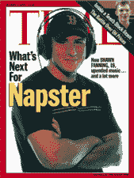
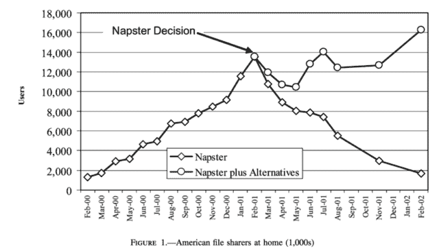
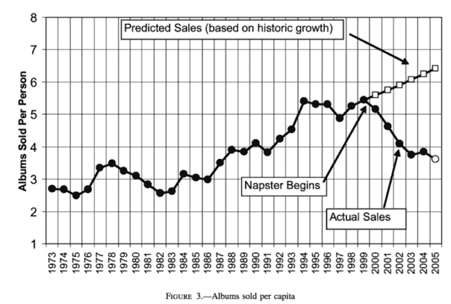
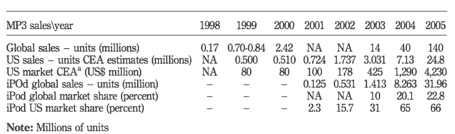
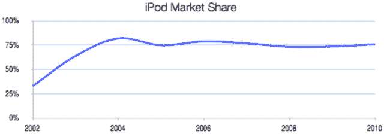
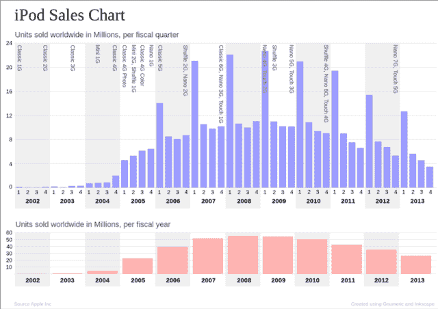
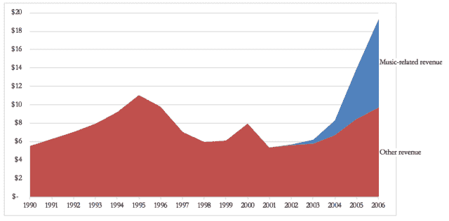
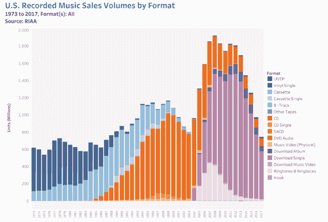
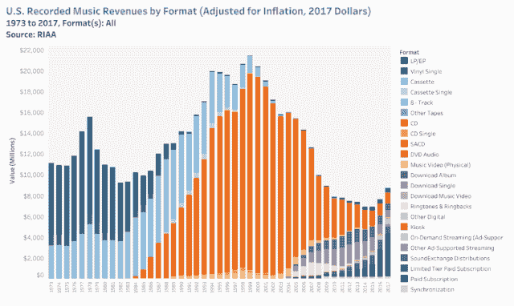

# iTunes 和 MP3 播放器市场竞争的基础|反应轮

> 原文：<http://reactionwheel.net/2018/11/itunes-and-the-basis-of-competition-in-the-mp3-player-market.html?utm_source=wanqu.co&utm_campaign=Wanqu+Daily&utm_medium=website>

[抄送人](https://creativecommons.org/licenses/by/4.0/)。PDF [这里](https://drive.google.com/open?id=1F-rH2jSiHs9cxIQjzInwoPMOG4o9vbba)。

* * *

**iTunes 和 MP3 播放器市场的竞争基础**

官方消息:唯一比 MP3 更受欢迎的是性

所以说滚石杂志 1999 年的 [1](#fn1-2441 "Goodman, Fred, “MP3 Technology Poised to Redefine Music Industry”, Rolling Stone, March 9, 1999\. Retrieved from http://www.rollingstone.com/music/news/mp3-technology-poised-to-redefine-music-industry-19990309") :

> 一年前几乎闻所未闻的 MP3——MPEG 1 Layer 3 的缩写——是一种音频编码技术，它允许将来自 CD 或其他来源的数字音乐文件压缩到适合互联网传输和 PC 存储的大小。一首歌曲的典型数字录音可能会占用 40 兆字节的空间，而一个 MP3 版本将占用大约 3.5 兆字节。同样的文件可以在 10 分钟内下载，而不是两个小时(如果有许多大学和企业的 T-1 连接，速度会更快)。因此，音乐是互联网的一大吸引力。

Karlheinz Brandenburg 早在 20 世纪 80 年代初还是一名博士生的时候就已经开始研究音频压缩系统了。这项工作进展缓慢，直到 1986 年，计算机开始赶上音频压缩算法的复杂性。 [2](#fn2-2441 "Ganz, Jacob, and Joel Rose, “The MP3: A History of Innovation and Betrayal”, NPR, March 23, 2011\. Retrieved from <a href="http://www.npr.org/blogs/therecord/2011/03/23/134622940/the-mp3-a-history-of-innovation-and-betrayal">http://www.npr.org/blogs/therecord/2011/03/23/134622940/the-mp3-a-history-of-innovation-and-betrayal</a>")

> 为了制作一个 MP3，一个叫做编码器的程序获取一个. wav 文件(或其他音频格式),并将其与人类听觉差距的数学模型进行比较。基于许多因素(一些由用户选择，一些在代码中设置)，它丢弃音频信号中不太可能听得见的部分。然后，它重组录音中重复和冗余的数据，并生成一个更小的文件，通常只有原始文件大小的 12%。删除文件中冗余数据的技术称为*压缩*。使用收听者模型来移除额外数据的技术是一种特殊的“有损”压缩，称为*感知编码*。 [3](#fn3-2441 "Ibid, pp. 1-2.")

Brandenburg 和其他人致力于使压缩和解压缩的音频相对忠实于原始音频。研究人员用苏珊·薇格的无伴奏合唱版《汤姆的晚餐》来听不完美之处。布兰登伯格声称，在 MP3 算法的开发过程中，他听了这首歌 500 到 1000 次。

在国际标准组织的支持下，运动图像专家组(MPEG)于 1988 年开始了音乐数字压缩的标准制定过程。MPEG 的目的是开发数字编码运动图像的标准，包括它们的音轨。MPEG 音频小组的第一次会议以呼吁数字音频压缩提案结束，该提案将适用于“各种应用，如音频和视频的 CD-ROM、DAT 记录器、[和]数字音频广播。”[4](#fn4-2441 "Sterne, Jonathan, <u>MP3: The Meaning of a Format</u>, Duke University Press, 2012, p. 139.")1989 年，ISO 收到了来自 14 家公司(后来合并为 4 个团体)的音频编码提案。包括弗劳恩霍夫的工作在内的建议在 1992 年被采纳为标准。T55

这个标准被命名为 MPEG-Layer 3，包括了由 Fraunhofer、Thomson 和 AT&T 开发的技术。同时，MPEG-Layer 1 和 MPEG-Layer 2 也获得了批准。每一层都有不同的权衡:第三层有最高质量的音频和最小的文件大小。第 1 层的音频质量较低，但算法不太复杂。第二层在中间。

第 2 层得到了最初的关注:它被选为视频光盘和卫星广播等的音频标准。甚至第一个提供 MPEG 编码文件的网站，1993 年推出的互联网地下音乐档案馆，最初也使用 MPEG-2 层。Brandenburg 说:“在 1992-1994 年，主要的焦点是找到真正使用 MPEG 音频第三层的公司，除了第一年的一些专业应用，第三层不太走运。其他人都决定选择第二层。”弗劳恩霍夫团队开始相信第二层的成功是因为它得到了老牌音乐公司飞利浦和松下的支持，这是一个政治决定而不是技术决定。有一些早期的采用者:微软在 1995 年购买了使用该规范的许可证，尽管当时微软的应用程序并没有被大量使用。弗劳恩霍夫开始失去希望。

**<u>创建类别</u>**

将 MP3 用于便携式音乐并不是一个显而易见的使用案例:1995 年之前，互联网还没有广泛使用，即使有，带宽也很低。在现实世界中，数字音乐是通过光盘媒介传播的，不需要压缩。但是弗劳恩霍夫愿意尝试任何事情，便携式音乐是他们尝试的一件事。

1995 年，弗劳恩霍夫开发了在个人电脑上播放 MP3 的软件。它被称为 WinPlay3，作为免费软件发行。它很丑，难以使用，没有播放列表或其他简单的功能，只能播放 20 首歌曲，用户必须向 Fraunhofer 支付许可费，并等待激活码被邮寄回来。它很少被使用。(然而，它确实需要一个文件扩展名，而. mp3 就是这个名字的第一个用法。)在 1995 年的一次贸易会议上，飞利浦的一名高管对弗劳恩霍夫的一名代表说:“永远不会有商用 MP3 播放器。” [7](#fn7-2441 "Witt, Steven, How Music Got Free, Viking, 2015, p. 59.")

问题是，如果没有音乐，没有人想要一个播放器，如果没有办法播放音乐，没有人想要以这种格式制作音乐。似乎在 MP3 中获得大量音乐的唯一方法就是让音乐产业接受这个标准。没有音乐产业的合作，似乎没有办法解决这个先有鸡还是先有蛋的问题，而音乐产业——从 CD 重新发行的收入中获利丰厚，并且时刻警惕盗版的可能性——没有理由合作。

但是，消费者对互联网的使用越来越多，这就产生了对通过慢速网络传输音乐文件的需求，而 MP3 在这方面比第二层要好得多。当企业界没有解决这个问题时，一个匿名黑客把它掌握在自己手中。正如勃兰登堡所说:

> 我想是在 1997 年，一些澳大利亚学生从德国的一家小公司购买了专业级的 MP3 编码软件。他用从台湾偷来的信用卡号付款。他查看了软件，发现我们使用了一些微软内部应用程序编程接口…把所有东西都收集到一个档案中，连接了一些瑞典方面[原文如此]，[并]把它和一个自述文件一起放到一个美国大学的 FTP 站点上，上面写着‘这是弗劳恩霍夫的免费软件。'
> 
> 他放弃了我们的商业模式。我们完全没有被逗乐。我们试图追捕他。我们告诉每个人，‘这是偷来的软件，所以不要分发它’，但昂贵的编码器和廉价的解码器的商业模式仍然被完成了。从那时起，我们降低了编码器的成本。有一家名为 Music Match 的公司，它允许人们很早就把 CD 上的音乐读入电脑，然后在电脑上拥有自己的音乐点唱机。他们是合法的，他们支付了专利费，所以没问题。 [9](#fn9-2441 "Ganz and Rose, op cit.") ， [10](#fn10-2441 "Patents became an issue again once the format had become mainstream. Although Fraunhofer was never a primary beneficiary of the growth of the industry, patent licenses generated hundreds of millions of dollars of income for them. There were also multiple lawsuits trying to enforce these patents and others. C.f.  Krazit, Tom, “Apple Settles with Creative for $100 million“, CNET, 8/23/2006, retrieved from https://web.archive.org/web/20130903064854/http://news.cnet.com/apple-settles-with-creative-for-100-million/2100-1047_3-6108901.html; Ogg, Erica, “SanDisk MP3 seizure order overturned”, CNET, 9/7/2006, retrieved from https://web.archive.org/web/20121104164009/http://news.cnet.com/2100-1047_3-6113326.html; Hansen, Evan, “MP3’s Loss, Open Source’s Gain”, Wired, 2//2007, retrieved from https://www.wired.com/2007/02/mp3s-loss-open-sources-gain/; Krazit, Tom, “Microsoft wins reversal of MP3 patent decision”, CNET, 8/6/2007, retrieved from https://www.cnet.com/news/microsoft-wins-reversal-of-mp3-patent-decision/.")

弗劳恩霍夫曾计划授权其专利来开发编码和解码软件。编码软件的许可会很昂贵，弗劳恩霍夫认为只有大公司才会许可。解码软件的许可将会很便宜，弗劳恩霍夫希望围绕它开发出许多产品，他们将从每一个售出的产品中收取一小笔费用。这一愿景——少数几家公司为大量观众制作唱片——从一开始就是唱片业的模式，典型的大众媒体模式。他们算法的广泛非法传播使得这种商业模式没有实际意义，但结果是根深蒂固的音乐产业玩家不再是广泛使用的看门人。

在澳大利亚发布之后，MP3 的使用开始了爆炸性的增长。WinAmp 是继 WinPlay3 之后第一款用于 MP3 的 PC 软件音乐播放器，随后不久也发布了。在最初的 12 个月里，它被下载了 300 多万次。 [11](#fn11-2441 "Bronson, Po, “Rebootlegger”, Wired, 7/1/1998\. Retrieved from https://www.wired.com/1998/07/newmedia-4/") MP3 已经成为数字音乐以及音乐盗版的代名词。到 1998 年，这一类别已经确立，一家主流音乐杂志写道“制作喜爱歌曲的 MP3 副本——然后通过电子方式将这些歌曲传给任何有互联网连接的人——这不仅是一种地下热潮，也是一种国际流行病。” [12](#fn12-2441 "Allen, Harry, “Digital Underground”, Vibe, October 1998, pp. 122-126.")

**<u>创建市场</u>**

1997 年，德国芯片制造商 Micronas 发布了一款 MP3 解码芯片。一家韩国公司，新韩信息系统公司(现在的 TAK 信息系统公司)开始购买芯片来制造第一台便携式 MP3 播放器——新韩 MPMan。MPMan 于 1998 年初引入亚洲。32MB 版本的价格为 39，800 日元(当时约为 400 美元)，可以存储约 6 首歌曲，64MB 版本的价格为 59，800 日元(约 600 美元)。这个设计在 1998 年中期被授权给 Eiger，Eiger 在北美发行，32MB 版本售价 250 美元。同样是 32MB 的钻石 Rio 很快在 1998 年 9 月上市，售价为 200 美元。

第一批 MP3 播放器使用闪存。这使得播放器便于携带，但限制了它们的容量。一些后来的播放器使用硬盘来保存音乐。这些有更高的容量，但更大，更重，更昂贵。例如，HanGo 个人点唱机推出时售价 799 美元，但拥有近 5GB 的存储空间。6x3x1 英寸，对于手持设备来说很笨重。像 I2Go eGo 这样的大容量小体积解决方案，价格大约为 2000 美元。其他创新包括可扩展的内存、更长的电池寿命、录制语音的能力(这三项都包含在 1999 年的 RaveMP 中)、无线电接收(1999 年的 Nomad)、更好的声音(2000 年的 Nomad)、更好的用户界面(苹果的 iPod)、视频支持(2002 年的 Archos Jukebox 多媒体)等。

MP3 标准不是技术上最好的压缩算法。AAC 格式——由 Fraunhofer 创建，并于 1997 年作为 MPEG 标准引入——更好(后来被苹果公司使用)，开源的 Ogg Vorbis 格式也是如此，于 2000 年发布并免费使用(现在被 Spotify 等公司使用)。微软在 1999 年引入了他们自己的格式(WMA)，也许是为了避免支付 Fraunhofer 许可收入。但是，与日益流行的 MP3 标准背道而驰的播放器很难获得任何吸引力。索尼于 1999 年凭借 Vaio MP-P10 音乐剪辑进入数字音频播放器市场。尽管它有创新的设计和小尺寸，但它并不支持 MP3(它使用索尼专有的 ATRAC3 格式，并包括 MP3 到 ATRAC3 的转换软件)，是一个失败。索尼在 2003 年用 NW-MS70D 再次尝试，但它也没有原生支持 MP3，失败了。直到 2005 年的索尼 NW-HD5，索尼才发布了支持 MP3 的播放器。起初困扰 MP3 的同样问题——没有人想推出没有音乐的播放器，也没有人想把音乐编码成一种没人能播放的格式——现在对 MP3 有利了:如果你所有的音乐都是 MP3 格式的，你为什么还要买一个使用不同格式的播放器呢？

**表 1:部分支持 MP3 格式的数字音频播放器**

| **制造商/经销商** | **型号** | **发布日期** | **容量** |
| **萨罕** | MPMan | 1998 年春天 | 32 兆字节 |
| **艾格** | MPMan | 1998 年 5 月 | 32 兆字节 |
| **钻石多媒体** | 里约 | 1998 年 9 月 | 32 兆字节 |
| **感官科学** | 拉温普 2100 | 1999 年中期 | 64 兆字节 |
| **创意实验室** | 流浪者 | 1999 年 6 月 | 32 兆字节 |
| 【T0 声/Compaq】t1 | 个人点唱机 | One thousand nine hundred and ninety-nine | 4.8 GB |
| **I2Go** | 自我 | Two thousand | 2 GB |
| **创意** | 游牧点唱机 | Two thousand | 6 GB |
| **考恩** | iAudio CW100 | 2000 年十月 |  |
| **阿丘斯** | 自动点唱机 6000 | 2000 年 12 月 | 6 GB |
| **英特尔** | 袖珍音乐会 | Two thousand and one | 128 兆字节 |
| **Bang & Olufsen** | BeoSound2 | Two thousand and one | 128 兆字节 |
| **苹果** | iPod 播放器 | 2001 年十月 | 5 或 10 GB |
| **阿丘斯** | 点唱机多媒体 | Two thousand and one | 10 或 20 GB |
| **创意实验室** | Muvo | Two thousand and two | 64 或 128 MB |
| **苹果** | iPod 第二代和第一代 | Two thousand and two | 10 或 20 GB |
| **创意实验室** | 游牧点唱机禅 | Two thousand and two | 20 GB |
| **创意实验室** | 游牧点唱机 Zen NX/Xtra | Two thousand and three | 60 GB |
| **创意实验室** | MuVo NX | Two thousand and three | 128 或 256 MB |
| **苹果** | 第三代 iPod | Two thousand and three | 40 GB |
| **钻石** | 里奥·卡玛 | Two thousand and three | 20 GB |
| **微软** | Zen 便携式媒体中心 | Two thousand and four |  |
| **苹果** | iPod Mini | Two thousand and four | 4 GB |

**<u>唱片业的大背景</u>**
*“家乐不思蜀”*

###### –英国唱片业 1981 年反盗版运动的标志

家庭录音最终没有扼杀音乐，但唱片业从来没有对盗版，即非法复制音乐进行分销的行为不抱幻想。音乐盗版并不是由 MP3 爱好者发明的，但是完美的数字拷贝和全球范围内的即时互联网分发的结合使得这个问题更加严重了几倍。

用于音频存储的盒式磁带于 20 世纪 60 年代问世。早期的音质很差，但技术的进步意味着到了 20 世纪 70 年代初，盒式磁带在音质上可以与八轨磁带相媲美。并非巧合的是，国际唱片业联合会在 1971 年通过了第一个反盗版措施，即日内瓦唱片公约。在 70 年代末和 80 年代初的经济衰退期间，IFPI 将唱片业收入的下降与盒式磁带和录音机销量的增加联系在一起。

但是磁带录音对唱片销售的可能影响从根本上受到了技术的限制:一盘磁带的质量比它的黑胶唱片源要低，一盘磁带的质量更低。听众和原始购买者之间的距离不可能很远。不管怎样，IFPI 估计 1982 年盗版占美国和加拿大总市场的 11%,其他地方更高。因此，当 1987 年随着索尼数字音频磁带(DAT)标准的发布，消费者数字音频录音机开始变得可用，创造了完美复制的潜力时，唱片业进行了反击:美国唱片业协会(RIAA)开始游说法律保护。其结果是，在美国，1992 年的《家庭录音音频法案》( AHRA)强制要求在所有数字录音机中内置一个连续拷贝管理系统。这个 SCMS 芯片阻止了第二代录音。AHRA 还对 DAT 记录器和空白介质征收费用，以分配给现有的唱片业。这削弱了 DAT 的市场，它从未在日本以外的消费者中流行起来。个人电脑行业成功游说，使个人电脑免于 AHRA，考虑到当时个人电脑市场非常小，这并不是一个巨大的让步。

五年后，编码和解码软件的廉价供应以及 AHRA 对个人电脑的豁免为 MP3 在个人电脑上的发展奠定了基础。早期的数字音频爱好者受到限制，因为没有广泛使用 CD 刻录机，市场上也没有 MP3 播放器，歌曲只能在台式电脑上听，不能在汽车上或跑步时播放，也不能在人们听音乐的任何地方播放。在 20 世纪 90 年代，高带宽用户连接互联网的罕见性意味着，即使是一个 3 MB 的 MP3 文件，共享起来也是困难且耗时的。CD 仍然是一种更好的音乐消费方式。

但是当钻石里奥 MP3 播放器在 1998 年秋天上市时，这一切都改变了。RIAA 决定将这种现象扼杀在萌芽状态。Rio 没有 SCMS 芯片，RIAA 认为这违反了家庭录音法案。但是到了 1999 年 6 月，法院裁定，由于 Rio 只是一个存储设备，而不是录音设备，因此它不属于该法案的管辖范围。在个人电脑的豁免和 RIAA 在钻石诉讼中的失败之间，MP3 播放器市场是完全合法的。事实上，这场官司产生的公众效应似乎刺激了 MP3 播放器的销售。 

RIAA 还没有完成。由于无法对设备本身进行监管，他们转向了分销渠道。到 1999 年，“共享”MP3 的最大来源是 Napster。

Napster 是由东北大学的大学生肖恩·范宁开发的。Napster 于 1999 年 6 月发布，它允许用户在其他用户的电脑上查找 MP3 文件，并通过互联网复制这些文件。Napster 发布后不久，用户数量就开始快速增长(见图表 1)，并迅速成为一种现象。《时代》杂志在 2000 年 10 月把范宁放在封面上。

2000 年，乐队 Metallica 在系统中发现一张他们未发行单曲的拷贝后，起诉了 Napster。RIAA 还围捕了几家唱片公司，控告 Napster 协助侵犯版权。一位歌迷似乎对富有的摇滚明星不太同情:“我为什么要为下载 MP3 感到内疚——我看过他们所有的演唱会，我拥有所有的 CD，我买了 t 恤——他们已经拿走了我的钱。”。 [20](#fn20-2441 "Simon, Richard B., “Metallica’s Anti-Napster Crusade Inspires Backlash”, MTV News, 5/31/2000\. Retrieved from http://www.mtv.com/news/971500/metallicas-anti-napster-crusade-inspires-backlash/")

2001 年 2 月，一项基本上是关闭 Napster 的初步禁令被批准，Napster 的使用率迅速下降。但是其他文件共享系统很快取代了它的位置。Limewire、Grokster 和 Kazaa 等新一代文件共享网站以及 gnutella、FastTrack 和 BitTorrent 等文件共享协议没有 Napster 那样的用于索引和对等点发现的中央服务器。法院命令不会轻易关闭它们。

尽管唱片业成功地起诉了文件共享客户端的创建者，但新系统的分散性意味着 RIAA 正在与文件共享者玩打地鼠游戏。数百万人违反版权下载或分享音乐。2003 年皮尤互联网与美国生活调查发现，29%的互联网用户已经将音乐文件下载到他们的电脑上。其中，67%的人说他们不在乎他们下载的音乐是否有版权:

> 美国人对网上版权材料的态度一直是不屑一顾的，即使媒体报道和法律案例的洪流旨在教育公众文件共享对知识产权行业构成的威胁。在一些新闻报道中，消费者认为下载只是补充他们的常规音乐购买习惯，或者作为一种尝试新音乐的形式。一些消费者还被引述说，CD 和 DVD 的价格太高，艺术家获得的利润太少，而其他人则说，他们想要的音乐根本无法在网上获得，因为它已经绝版或很难找到。还有一些人说他们有权“合理使用”他们购买的音乐，通过这些网络与朋友分享。 [21](#fn21-2441 "Lenhart, Amanda and Mary Madden, “Music Downloading, File-sharing and Copyright”, Pew Research Center, July 31, 2003\. Retrieved from http://www.pewinternet.org/2003/07/31/music-downloading-file-sharing-and-copyright/")

专辑销量急剧下降。作为回应，RIAA 在 2003 年开始起诉个人文件共享者。虽然这是一场宣传灾难，但这项努力似乎对文件共享产生了一些影响。)但行业收入并未做出回应。

**图表 1:文件共享服务用户数量**[23](#fn23-2441 "Liebowitz, Stan J., “File 
Sharing: Creative Destruction or Just Plain Destruction?”, Journal of Law and 
Economics, Vol. 49, No. 1 (April 2006), pp. 1-28.")

许多人，包括唱片公司内部的一些人，认为文件共享者非法获取数字音乐文件是因为没有合法的替代方案，唱片公司早在 1998 年就试图提供 MP3 的替代方案。他们成立了安全数字音乐倡议(SDMI)来提供数字水印，以便共享文件可以追溯到源头。

微软在 1999 年发布了 MS Audio 4.0，声称它比 MP3 速度更快，并且具有数字版权管理(DRM)功能，可以击败复印机。但是唱片公司对微软的意图很警惕，不想失去对发行的控制。正如《纽约时报》的尼尔·史特劳斯所说:“他们只是不想让微软插手他们的生意。” [24](#fn24-2441 "Strauss, Neil, “Record Companies Are Wary Of New Microsoft Technology”, New York Times, April 12, 
1999\. Retrieved from <a href="http://www.nytimes.com/1999/04/12/business/record-companies-are-wary-of-new-microsoft-technology.html">http://www.nytimes.com/1999/04/12/business/record-companies-are-wary-of-new-microsoft-technology.html</a>")

也是在 1999 年，RealNetworks 发布了他们的 RealJukebox 软件。RealJukebox 抓取 CD，允许用户从互联网上下载歌曲。它使用了由美国电话电报公司和 IBM 开发的数字版权管理技术。唱片业也不支持皇马。RealJukebox 仍然允许用户播放 MP3 文件；RealNetworks 试图通过支持领先格式来取悦消费者，并通过支持 DRM 格式来取悦唱片公司。结果两人都没什么印象。

唱片公司寄希望于 SDMI 倡议。但 SDMI 无法应对创建安全音频格式的技术挑战，也无法说服硬件制造商同意这项技术。SDMI 没有取得真正的进展，似乎在 2001 年消失了。相反，唱片公司试图推出自己的数字音乐服务。

**图表 2:人均专辑销量(含数字购买量)**[25](#fn25-2441 "Liebowitz, Stan J., op cit.")

2002 年推出了两个标签支持的在线音乐商店/软件客户端。Pressplay 得到了 Vivendi Universal 和索尼的支持。MusicNet 得到了其他三大唱片公司的支持:美国在线时代华纳、贝塔斯曼和百代唱片公司。这两款产品都是标签内部妥协的结果。这种矛盾心理可以在最终的软件中看到。正如 PC 杂志所说，在他们的文章“有史以来最差的 25 款科技产品” [26](#fn26-2441 "Tynan, Dan, “The 25 Worst Tech Products of All Time”, PC World, May 26, 2006\. Retrieved from <a href="http://www.pcworld.com/article/125772/worst_products_ever.html?page=0">http://www.pcworld.com/article/125772/worst_products_ever.html?page=0</a>") 中:

> 数字音乐是一个如此伟大的想法，以至于在多年的强烈反对后，甚至唱片公司最终也勉强接受了它。2002 年，两家由音乐产业巨头支持的在线服务公司提议给消费者一个合法的选择来替代非法的文件共享。但这些服务令人震惊的脑残功能表明，唱片公司仍然没有明白这一点。

PressPlay 每月收取 15 美元的权利，可以收听 500 个低质量的音频流，下载 50 个音轨，并刻录 10 个音轨到 CD 上。这听起来并不可怕，直到你发现并不是每首歌都可以下载，而且你不能刻录同一位艺术家的两个以上的歌曲。MusicNet 的 100 首流媒体歌曲和 100 次下载费用为每月 10 美元，但每个下载的音频文件仅在 30 天后过期，每次你更新歌曲时，它都会计入你的配额。

每种服务都有来自自己支持者标签的音乐，所以订阅一个意味着用户只有 50%的机会听到他们想要的歌曲。这些服务从未被广泛使用，唱片公司在 2003 年放弃了它们。

**<u>苹果</u>** [二十七](#fn27-2441 "Much of this section is from Walter Isaacson’s 2011 book <i>Steve Jobs</i>, chs. 30-31, and from Kahney, Leander, “Straight Dope on the IPod’s Birth”, Wired, October 17, 2006, retrieved from <a href="http://www.wired.com/gadgets/mac/commentary/cultofmac/2006/10/71956">http://www.wired.com/gadgets/mac/commentary/cultofmac/2006/10/71956</a>")

在世纪之交，苹果遇到了一个问题。个人电脑已经成为一种商品；苹果公司的收入从 1995 年的 110 亿美元下降到 2001 年的 54 亿美元(见图表 5)。但是史蒂夫·乔布斯有远见。苹果的使命是让个人电脑成为家庭的“数字中枢”。电视、音响、照相机和任何其他处理数字信息的设备都可以连接到它。照片、视频和音乐会从电脑传到所有这些辅助设备。

乔布斯是一个臭名昭著的微观管理者。对于任何符合他的严格标准的新产品，苹果都需要控制它。如果苹果电脑将成为数字互联家庭的核心，那么苹果将不得不编写运行互联设备的软件，甚至自己制造设备。苹果将是端到端的。

乔布斯对控制的渴望不仅仅是完美主义，而是战略性的。他知道，客户对个人电脑外围设备(任何设备，甚至是像打印机这样的设备，其全部目的是连接到电脑上)的主要抱怨之一是它们很难工作。通过拥有整个端到端系统，他可以实现无缝体验。此外，如果设备上的许多功能(编辑、组织、管理存储)都在计算机上完成，设备本身可能会更简单、更优雅。

这个策略的第一部分是视频。在 FireWire 互联标准、iMovie、iDVD 和 DVD 刻录机之间，苹果用户可以制作自己的电影。苹果不需要制造摄像机，因为他们认为市场上的摄像机已经足够好了。下一首曲子是音乐。乔布斯看到了 CD 刻录机的流行，以及现有的数字音乐软件是如何糟糕到阻碍了市场的发展。

2000 年 7 月，苹果通过谈判获得了 SoundJam 的独家许可，这是一款由前苹果工程师编写的软件，由小型出版商 Casady & Green 发行。苹果公司雇佣了 SoundJam 的开发者，将它变成了 Mac 电脑上的 Rio 音乐管理器。乔布斯与 SoundJam 团队合作，将软件剥离，使之更简单。2001 年 1 月，改名为 iTunes 的软件发布了。

与摄像机或数码相机不同，苹果团队不喜欢现有的 MP3 播放器。它们要么太小，储物空间太少，要么又大又笨重。他们认为唯一好的是基于富士通新的 2.5 英寸硬盘的电脑。但它们都使用 USB 传输音乐，速度比 FireWire 慢得多，用户界面糟糕，电池寿命最短。苹果开始考虑自己生产。

苹果公司的乔恩·鲁宾斯坦负责建造它。他找到了合适的屏幕和电池。然后在 2001 年 2 月，他拜访了日本的东芝公司，在那里他们向他展示了他们新的 1.8 英寸硬盘。他们不知道它能用来做什么。鲁宾斯坦没有让东芝知道他打算如何处理这些硬盘，而是通过谈判获得了他们可以生产的所有 1.8 英寸硬盘的独家使用权。

苹果制造的 iPod 组件非常少:参考设计由一家名为 PortalPlayer 的小公司授权，iPod 操作系统由另一家名为 Pixo 的小公司提供，现成的部件包括索尼的电池和德州仪器的芯片。一个苹果工程团队整合了这些部分。挑战在于理解和设计现有参与者的不足之处。例如，为了延长电池寿命，苹果公司创造了一个 32 MB 的内存缓冲区，这样硬盘驱动器就可以在需要时停止运转。

该设备本身被设计成坚固的，而不是像其竞争对手那样的廉价塑料玩具。用户界面被简化为最基本的东西:滚轮。任何对滚轮来说过于复杂的功能，比如制作播放列表，都可以在 iTunes 软件中完成。

iPod 于 2001 年 10 月 23 日向公众推出，存储容量为 5GB，售价为 399 美元。它只适用于麦金塔电脑，当时只占美国电脑市场不到 4%的份额。到 2002 年夏天，5GB 型号的价格降到了 299 美元，并推出了 10GB 和 20 GB 型号。

下一步是摆脱获取数字歌曲的繁琐过程。购买 CD 然后翻录似乎效率不高。现有的数字下载网站(合法的和非法的)都不优雅或不完整。乔布斯想建立一个 iTunes 商店。

作为 SDMI 倡议的一部分，2002 年 1 月，美国在线时代华纳的高管来到库比蒂诺，邀请苹果成为他们财团的一部分。他们开始向乔布斯做演示，在他打断他们之前，他用他无与伦比的方式告诉他们，“你们把头放在屁股上。”美国在线时代华纳的领导人史蒂夫·维蒂奇勇敢地回答说:“你说得对。我们不知道该怎么办。你需要帮助我们弄清楚。”乔布斯同意与他们合作。

看到标签发起的商店失败，乔布斯决定建立自己的商店。他知道他需要说服所有的唱片公司，让他提供他们的音乐才能成功。苹果想以 0.99 美元的价格单独出售每首歌曲。苹果将保留 30%，而唱片公司将获得 70%。价格还算合适，但唱片公司不愿单独出售歌曲:他们已经建立了一项业务，在一两首好歌的基础上出售整张专辑。

乔布斯有两个很好的理由来支持这些标签:因为 iTunes/iPod 是端到端的，苹果在通过有效的数字版权管理来防止盗版方面处于独特的地位；而且麦金塔的安装基数如此之小，以至于如果实验不成功，也不会造成什么伤害。虽然微软在 2000 年末的收入为 230 亿美元，员工近 4 万人，市值 2310 亿美元，但苹果相对较小，收入 80 亿美元，员工不到 9000 人，市值 50 亿美元。苹果几乎不是微软的威胁。

乔布斯说服了除索尼之外的所有唱片公司。作为一家硬件制造商和唱片公司所有者，索尼希望他们能成为端到端的提供商。最终，一旦其他所有的唱片公司都签了字，索尼觉得有义务跟着做。

2003 年 4 月 28 日，苹果推出了 iTunes 商店。很快就清楚了这个系统很受顾客欢迎，苹果公司决定扩大市场。2003 年 10 月，在与唱片公司进行了又一轮谈判后，苹果公司宣布了适用于 Windows 的 iTunes。

2004 年，有 50 多种不同型号的 MP3 播放器在销售。但是争夺 MP3 播放器市场的竞争已经结束了，尽管并不是每个人都知道这一点。苹果在美国拥有超过 65%的市场份额(有人估计接近 75%)，这一份额一直保持到 2012 年。 [30](#fn30-2441 "“iPod still has 70% of MP3 player market”, MacTech, 7/24/2012\. Retrieved from <a href="http://www.mactech.com/2012/07/24/ipod-still-has-70-mp3-player-market">http://www.mactech.com/2012/07/24/ipod-still-has-70-mp3-player-market</a>") 苹果于 2017 年停止销售 iPods。 [31](#fn31-2441 "“Goodbye iPod and Thanks for all the Tunes”, Wired, 2/27/2017\. Retrieved from https://www.wired.com/story/goodbye-ipod-and-thanks-for-all-the-tunes/")

**表 MP3 播放器** [销量 32](#fn32-2441 "Abel, Ivan, “From technology imitation to market dominance: the case of iPod”. Retrieved from <a href="http://www.emeraldinsight.com/1059 5422.htm">www.emeraldinsight.com/1059-5422.htm</a>") 

**图表 3: iPod 美国市场份额**[33](#fn33-2441 "Thompson, Ben, “Apple and 
the Innovator’s Dilemma”, Stratechery. Retrieved from <a href="http://stratechery.com/2010/apple-innovators-dilemma">http://stratechery.com/2010/apple-innovators-dilemma</a>")

**图表 4: iPod 销量** 

**图表 5:苹果公司收入，以十亿计**[34](#fn34-2441 "Apple Annual Reports.")

**图表 6[35](#fn35-2441 "Source: RIAA, <a href="https://www.riaa.com/u-s-sales-database/">https://www.riaa.com/u-s-sales-database/</a>, Retrieved October 18, 2018.")**

**图表 7[36](#fn36-2441 "Ibid.")**