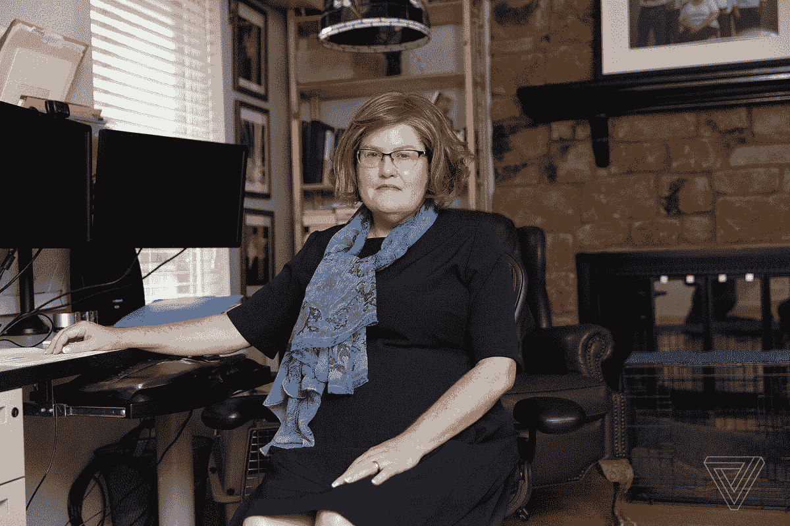
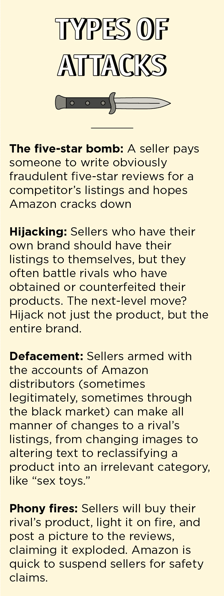
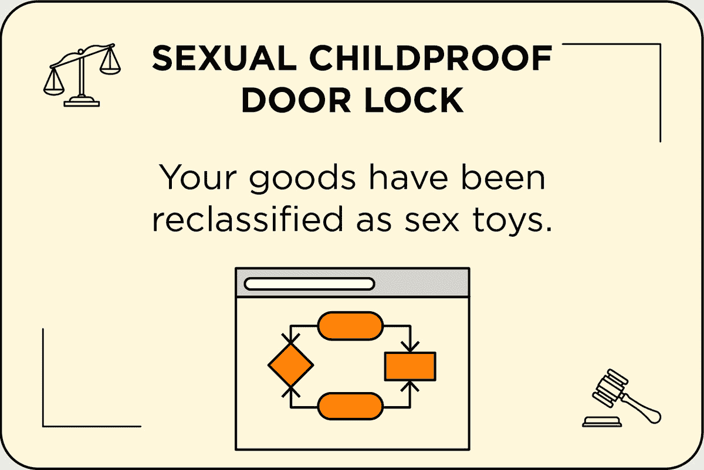
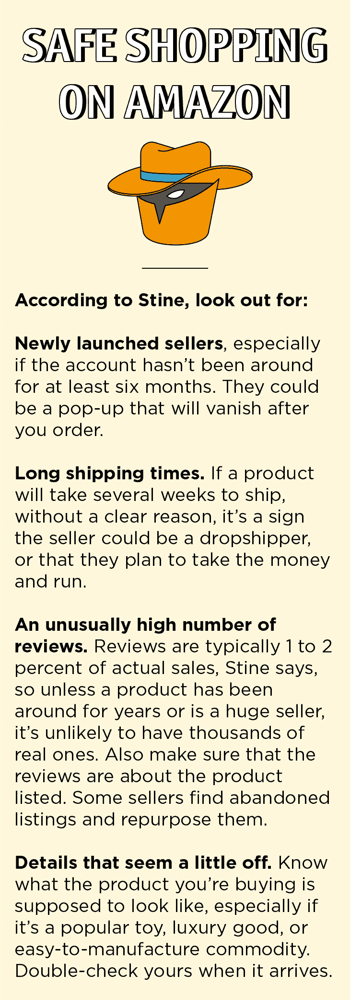
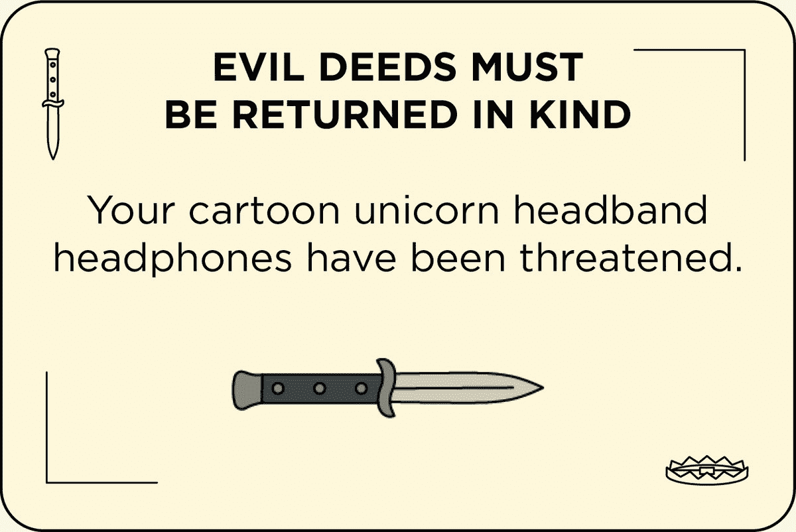

# 价值 1750 亿美元的亚马逊市场的肮脏交易——The Verge

> 原文：<https://www.theverge.com/2018/12/19/18140799/amazon-marketplace-scams-seller-court-appeal-reinstatement?utm_source=wanqu.co&utm_campaign=Wanqu+Daily&utm_medium=website>

去年 8 月，扎克·普兰斯基(Zac Plansky)醒来后发现，他在亚马逊上出售的步枪瞄准镜一夜之间获得了 16 条五星评论。通常情况下，这是一件好事，但评论很奇怪。这个作用域通常一天只有一个评论，而且许多评论都引用了不同的作用域，就好像它们是从别处剪切粘贴过来的一样。“我不知道发生了什么，这是一个小故障，还是有人试图扰乱我们，”普兰斯基说。

为了以防万一，他向亚马逊报告了这些评论。他们中的大多数人几天后消失了——问题解决了——普兰斯基重新沉浸在亚马逊上经营一家有六名员工、价值数百万美元的武器配件企业的工作中。两周后，陷阱出现了。“你操纵了我们网站上的产品评论，”亚马逊的一封电子邮件写道。“这违反了我们的政策。因此，你不能再在 Amazon.com 上出售物品，你的物品已经从我们的网站上删除。”

一个竞争对手诬陷 Plansky 购买五星评论，这在亚马逊世界是一种严重的罪行。他账户里的资金立即被冻结，他的列表也被关闭。拿回他的商店将让他经历长达数周的超现实之旅，穿越亚马逊的官僚机构，首先是点击他的暂停信息底部的一个按钮，上面写着“上诉决定”。

当你在亚马逊上买东西时，很可能你根本不是在亚马逊上买的。普兰斯基是该公司第三方平台亚马逊市场上 600 万卖家之一。它们在很大程度上对顾客是隐藏的，但在任何待售商品的背后，可能有数十个卖家，都在争夺你的点击。根据 [Marketplace Pulse](https://www.marketplacepulse.com/articles/amazon-marketplace-is-the-largest-online-retailer) 的数据，今年 Marketplace 的销售额几乎是亚马逊零售本身的两倍，这使得卖家平台成为美国最大的电子商务业务。

对于卖家来说，亚马逊就是一个准国家。他们依赖于它的基础设施——它的仓库、运输网络、金融系统和数百万客户的门户——并以费用的形式纳税。他们还生活在对其规则的恐惧中，这些规则经常改变并被严格执行。像普兰斯基收到的那封神秘的电子邮件可以让卖家的企业破产，几乎没有上诉的渠道。

亚马逊卖家兼博客作者戴夫·布莱恩特说，卖家更担心在亚马逊上立案，而不是在法庭上。他说，亚马逊的判断更快，也更难预测，现在该公司[控制了美国近一半的在线零售市场，它的裁决可以立即决定你的业务的成败。"亚马逊是法官、陪审团和刽子手."](https://www.cnbc.com/2018/07/12/amazon-to-take-almost-50-percent-of-us-e-commerce-market-by-years-end.html)

亚马逊绝不是唯一一家吞并了人类活动的广阔领域，却发现自己不得不去管理它的科技公司。但亚马逊是唯一一个拥有 1750 亿美元奖金池的平台，吸引人们参与其中，该公司必须不断实施新的规则和处罚，这反过来又成为新的滥用工具，需要更多的规则来监管。它的调节系统的进化已经超负荷了。虽然马克·扎克伯格最近沉思道，脸书可能需要一个类似于[最高法院](https://www.theverge.com/2018/11/15/18097219/facebook-independent-oversight-supreme-court-content-moderation)的机构来裁决纠纷和审理上诉，但亚马逊已经有了一个类似司法系统的东西——一个秘密的、不稳定的、经常令人恐惧的系统。

亚马逊的判断如此严厉，以至于它自己的规则成了持续不断的市场战争中的终极武器。正如普兰斯基所经历的那样，销售者设计出各种复杂的计划来陷害他们的对手。他们冒充、复制、欺骗、威胁、破坏甚至贿赂亚马逊员工以获取竞争对手的信息。

当卖家最终被亚马逊告上法庭时，他们该怎么办？他们可以向辛西娅·斯汀(Cynthia Stine)这样的人求助，她是一个不断增长的咨询行业的一部分，帮助卖家驾驭残酷的市场世界和亚马逊管理市场的拜占庭规则。他们就像律师，只是他们的法律代码是亚马逊服务条款，他们的法院是一个秘密和半自动的公司官僚机构，他们的管辖范围是一个由算法监管的全球集市，充满了劫持新奇袜子和塑料手表上市的阴谋。像 Stine 这样的人是修复者，是亚马逊残酷土地的向导，他们愿意为绝望者提供帮助——当然是有代价的。

<picture class="c-picture" data-cid="site/picture_element-1668359401_8371_216826" data-cdata="{&quot;asset_id&quot;:13632275,&quot;ratio&quot;:&quot;*&quot;}"><source srcset="https://cdn.vox-cdn.com/thumbor/S-jIrdSN8-bevx1soXoRqE7KICM=/0x0:2040x1360/320x0/filters:focal(0x0:2040x1360):format(webp):no_upscale()/cdn.vox-cdn.com/uploads/chorus_asset/file/13632275/lbuckman_181012_3027_0031.jpg 320w, https://cdn.vox-cdn.com/thumbor/YOb0oDVEnYNbgq4dqBQwzDLCqhI=/0x0:2040x1360/520x0/filters:focal(0x0:2040x1360):format(webp):no_upscale()/cdn.vox-cdn.com/uploads/chorus_asset/file/13632275/lbuckman_181012_3027_0031.jpg 520w, https://cdn.vox-cdn.com/thumbor/pEXw4jdkTAQXDqS9wCsITByICWA=/0x0:2040x1360/720x0/filters:focal(0x0:2040x1360):format(webp):no_upscale()/cdn.vox-cdn.com/uploads/chorus_asset/file/13632275/lbuckman_181012_3027_0031.jpg 720w, https://cdn.vox-cdn.com/thumbor/6v2mFg8nDPLOOckDp-Ph1va-qOo=/0x0:2040x1360/920x0/filters:focal(0x0:2040x1360):format(webp):no_upscale()/cdn.vox-cdn.com/uploads/chorus_asset/file/13632275/lbuckman_181012_3027_0031.jpg 920w, https://cdn.vox-cdn.com/thumbor/6yzVjNtYp5vaPGGSCcngS_JgBLQ=/0x0:2040x1360/1120x0/filters:focal(0x0:2040x1360):format(webp):no_upscale()/cdn.vox-cdn.com/uploads/chorus_asset/file/13632275/lbuckman_181012_3027_0031.jpg 1120w, https://cdn.vox-cdn.com/thumbor/LXPTg800KxAUzpKq7qYgne9MHIU=/0x0:2040x1360/1320x0/filters:focal(0x0:2040x1360):format(webp):no_upscale()/cdn.vox-cdn.com/uploads/chorus_asset/file/13632275/lbuckman_181012_3027_0031.jpg 1320w, https://cdn.vox-cdn.com/thumbor/oMGcvszeBxNCHdoPtlkyAnu8udg=/0x0:2040x1360/1520x0/filters:focal(0x0:2040x1360):format(webp):no_upscale()/cdn.vox-cdn.com/uploads/chorus_asset/file/13632275/lbuckman_181012_3027_0031.jpg 1520w, https://cdn.vox-cdn.com/thumbor/mzrYfOvqA5uSJuEd-EPX54m9KVI=/0x0:2040x1360/1720x0/filters:focal(0x0:2040x1360):format(webp):no_upscale()/cdn.vox-cdn.com/uploads/chorus_asset/file/13632275/lbuckman_181012_3027_0031.jpg 1720w, https://cdn.vox-cdn.com/thumbor/KcrCXvWJbDDKOpTGZ5m6br2QbAE=/0x0:2040x1360/1920x0/filters:focal(0x0:2040x1360):format(webp):no_upscale()/cdn.vox-cdn.com/uploads/chorus_asset/file/13632275/lbuckman_181012_3027_0031.jpg 1920w" sizes="90vw" type="image/webp">  </picture>   <cite>Photographed by Laura Buckman for The Verge</cite> 

斯汀在她位于东达拉斯一个绿树成荫的社区的平房里经营着一家 25 人的公司。每天，她坐在双显示器前，在平板电脑上草草记下笔记，接那些收到来自亚马逊的可怕电子邮件、心烦意乱的卖家的电话。在她的墙上:她的家人和她在菲律宾的支持人员的家人的照片；一个钉板，上面有包装带和运输标签，是她过去作为亚马逊卖家生活的痕迹；和一个写着“咖啡...直到该喝酒的时候。”

她外向开朗，乐于离题进入战争故事，讲述一次算法变化暂停了犹太正统珍珠交易行业的一大片业务，或者两家电动轮椅电池销售商之间长达数年的“大屠杀”。但在电话里，她耐心地听着卖家喋喋不休地诉说他们的不满。“你必须让他们离开壁架，其中一个方法就是让他们被听到，”斯汀说。“亚马逊不会给你这个。他们不会和人类说话。”

她称让普兰斯基上当的计划是“肮脏的卖家伎俩”，她以前也见过。随着亚马逊对虚假评论的战争升级，卖家已经意识到，最有效的策略不是为自己购买，而是为竞争对手购买——欺诈性越明显越好。一些热情洋溢的推荐，最好是由 Fiverr 上的一个知名评论供应商用蹩脚的英语写的，关于不相关的产品，不仅可以干掉一个竞争对手，让你在亚马逊的搜索结果中上升一个位置，还可以让你的竞争对手陷入亚马逊悬浮系统令人困惑的泥沼。

Stine 的团队带来了坏消息:她说，从停职中恢复的唯一方法是“坦白和忏悔”，即使你不认为自己做错了什么。“亚马逊不喜欢看到互相指责。”

亚马逊称之为“上诉”，这表明判决有可能被推翻。事实上，它们更像是一份辩诉交易和一份商业备忘录，其核心是一份“行动计划”——解释你将如何把事情做好。为了把事情做好，你需要承认自己做错了。因此，普兰斯基和斯汀的团队坐在一起，寻找可以坦白的东西。在他的上诉中，他承认在亚马逊禁止评论之前为评论提供折扣，并向客户发送电子邮件，告诉他们打印出的射击目标可能被算法误认为贿赂。

“这太疯狂了，”他说。“我觉得我是在为一项我没有犯下的罪行坐牢，唯一的出路就是认罪。”

在某种程度上，普兰斯基过得很轻松。他至少知道他必须承认什么，即使他没有这样做。很多卖家甚至搞不清楚亚马逊到底在指责他们什么。暂停信息通常会列出一个项目，以及一个宽泛且不太相关的违规类别，如“旧的当作新的出售”可以理解的是，卖家的回应是发送发票，显示商品确实是新的。Stine 说，实际上，这种暂停通常与正在使用的物品无关，而是与盒子上剥落的标签有关。“亚马逊希望你改变的是买家的看法，”斯汀说。“仅仅向亚马逊证明你的商品是新的是不够好的，因为亚马逊希望你解决*为什么*买家*认为*它们是旧的。”一名卖家将典型的过程描述为亚马逊说，“我把你关进监狱，但不告诉你你做了什么，现在给我一个理由，为什么我应该让你出来，你不会再这样做。”

<aside id="mg18nu"><q>“A Kafkaesque bureaucracy with bad writing”</q></aside>

上诉过程如此混乱，以至于催生了像 Stine 这样的整个咨询行业。亚马逊前员工克里斯·麦凯布(Chris McCabe)于 2014 年开店。纽约长滩的律师 CJ Rosenbaum 现在自称是“亚马逊卖家律师”，拥有一个“亚马逊法律图书馆”，里面有*亚马逊法律，第 1 卷*(亚马逊上售价 95 美元)。Stine 的公司每月处理约 100 起暂停申请，每次上诉收费 2500 美元(如果你想要加急上诉，收费 5000 美元)，这符合行业规范。这是许多人愿意付出的代价。“对人们来说，这可能是生死攸关的事情，”麦凯布说。“如果他们拿不回自己的亚马逊账户，他们可能会资不抵债，裁员 10 人、12 人、14 人，甚至更多。有人求我帮忙。我已经让人们无计可施了。有人为我哭泣。"

Stine 的大部分工作包括翻译亚马逊神秘的暂停信息，然后挖掘卖家账户中的每一条评论、指标和信息，只是为了找到她需要设计补救措施的违规之处。她坐在自己的工作站上，像机械师一样在引擎盖下摆弄着卖家界面，主要是自言自语。她看到一条警告信息。“亚马逊疯了。”她看到一个狗狗玩具的列表，人们抱怨这些玩具对他们的狗狗来说太难嚼了。"这将很快触发亚马逊的怪胎计量器."

实际的违法行为可能是轻微的，也可能是广泛的。Stine 有一个客户，他的一个乡村谷仓木画框被认为不安全而被撤下；事实证明，这是一个单一的客户评论，提到了得到一个碎片。(顾客实际上给了它五颗星。)当卖家承诺在他的列表中添加“安装时戴手套”时，他被允许回来。另一名卖家因出售“与描述不符”的耐克鞋而被停职。在他一次又一次地上诉证明鞋子是真的耐克之后，斯汀的团队发现了问题:一些买家抱怨鞋子太小。该卖家在承诺在列表中增加一行建议顾客穿薄袜子后，又被放了回去。

<aside id="0y2KB7"><q>“Amazon is a clear monopoly that is somehow being allowed to destroy industry after industry.”</q></aside>

“这就是我们所说的‘说话的亚马逊’，”斯汀说。“在我的脑海中，我想象一个清单，它甚至不一定有意义。只是之前的上诉没有包括他们将要采取的这一非常重要的主动措施，以防止有人抱怨鞋子太紧。”

JC Hewitt 的律师事务所经常与亚马逊卖家合作，他称该系统的强制性认罪，武断的判决和模糊的语言是“一个写作糟糕的卡夫卡式的官僚主义”。难以理解的规则就像从黑匣子里冒出来的一样。处理停赛的表演队没有电话号码；没有人要求澄清。与他们互动的唯一方式是提起上诉，当上诉被驳回时，卖家通常不知道为什么。卖家可以打电话给亚马逊的另一个部门，卖家支持，但这些工作人员不能提供关于业绩团队的信息，只能提供关于卖家可能做错了什么的一般性建议。

这种秘密令人沮丧，以至于卖家去西雅图或亚马逊的伦敦办公室试图找到一个人，但没有成功。一名卖家从中国嵊州飞到西雅图，住在他在 Craigslist 上买的本田 Pilot 里，同时他在亚马逊的办公室徘徊，试图找到人听他的案子。接待员给了他同一个电话号码，他已经试了几个星期了。

<picture class="c-picture" data-cid="site/picture_element-1668359401_3506_216828" data-cdata="{&quot;asset_id&quot;:13635853,&quot;ratio&quot;:&quot;*&quot;}"><source srcset="https://cdn.vox-cdn.com/thumbor/7EbY8G99uGzEDBGRxqLdvigV6g4=/0x0:730x1938/320x0/filters:focal(0x0:730x1938):format(webp):no_upscale()/cdn.vox-cdn.com/uploads/chorus_asset/file/13635853/VRG_ILLO_3135_SB_02.png 320w, https://cdn.vox-cdn.com/thumbor/AzsaybXnT6TlCYLnZ9wviTEQgZc=/0x0:730x1938/520x0/filters:focal(0x0:730x1938):format(webp):no_upscale()/cdn.vox-cdn.com/uploads/chorus_asset/file/13635853/VRG_ILLO_3135_SB_02.png 520w, https://cdn.vox-cdn.com/thumbor/ZFwpFpnWAnyj7-etGnC6KQrUsyg=/0x0:730x1938/720x0/filters:focal(0x0:730x1938):format(webp):no_upscale()/cdn.vox-cdn.com/uploads/chorus_asset/file/13635853/VRG_ILLO_3135_SB_02.png 720w, https://cdn.vox-cdn.com/thumbor/m-Ufk9d_vFxTyPDUvm-BgqRPu9k=/0x0:730x1938/920x0/filters:focal(0x0:730x1938):format(webp):no_upscale()/cdn.vox-cdn.com/uploads/chorus_asset/file/13635853/VRG_ILLO_3135_SB_02.png 920w, https://cdn.vox-cdn.com/thumbor/gA4Q80eEfBl04nqp_k1JZU0827I=/0x0:730x1938/1120x0/filters:focal(0x0:730x1938):format(webp):no_upscale()/cdn.vox-cdn.com/uploads/chorus_asset/file/13635853/VRG_ILLO_3135_SB_02.png 1120w, https://cdn.vox-cdn.com/thumbor/ClkXG9rQA-LmJ8F6BpuFVSHECAI=/0x0:730x1938/1320x0/filters:focal(0x0:730x1938):format(webp):no_upscale()/cdn.vox-cdn.com/uploads/chorus_asset/file/13635853/VRG_ILLO_3135_SB_02.png 1320w, https://cdn.vox-cdn.com/thumbor/k2fr8xUez7he0oIwwMrbHX5D-28=/0x0:730x1938/1520x0/filters:focal(0x0:730x1938):format(webp):no_upscale()/cdn.vox-cdn.com/uploads/chorus_asset/file/13635853/VRG_ILLO_3135_SB_02.png 1520w, https://cdn.vox-cdn.com/thumbor/Qt1vAl53rcBojgYv7HmZObMQGCs=/0x0:730x1938/1720x0/filters:focal(0x0:730x1938):format(webp):no_upscale()/cdn.vox-cdn.com/uploads/chorus_asset/file/13635853/VRG_ILLO_3135_SB_02.png 1720w, https://cdn.vox-cdn.com/thumbor/EDm1bL01-iUK86V7niJXzWLCMI4=/0x0:730x1938/1920x0/filters:focal(0x0:730x1938):format(webp):no_upscale()/cdn.vox-cdn.com/uploads/chorus_asset/file/13635853/VRG_ILLO_3135_SB_02.png 1920w" sizes="(min-width: 1221px) 846px, (min-width: 880px) calc(100vw - 334px), 100vw" type="image/webp">  </picture> 

凯文·哈蒙(Kevin Harmon)在北卡罗来纳州夏洛特(Charlotte)的仓库里卖书和 DVD，他把去年 7 月的停职称为“他一生中最糟糕的一个月”他的账户被暂停，账户中的 20，000 美元因一张损坏的 Lilo & Stitch DVD 和其他九件物品被冻结。在解雇员工并开始清理库存后，他在脸书抱怨公司。“亚马逊是一个明显的垄断者，不知何故被允许摧毁一个又一个行业，”他写道。“他们不会在你小的时候压碎你。他们会等到你有了员工、租赁义务、商业贷款和装满产品的仓库，然后他们会透露他们不再需要你了。”

但最终，最令人恼火的不是悬挂。每当他上诉时，亚马逊总是以同样的请求回应更多的信息。“我被某种人工智能设备困住了，”他说。

事实上，可能有人在阅读哈蒙的呼吁，但据亚马逊前员工称，他们是高度自动化的官僚机构的一部分。一种算法根据一系列指标——客户投诉、退货数量、评论中使用的某些关键词以及其他更神秘的变量——来标记卖家，并将它们传递给印度、哥斯达黎加和其他地方的绩效员工。这些工作人员从几个预先写好的广告中选择发送给卖家。雷切尔·格里尔(Rachel Greer)说，他们可能会看到实际问题是什么，或者上诉中缺少的关键项目，但他们不会比表格允许的更具体，她在成为卖家顾问之前曾在亚马逊担任欺诈调查员。“这感觉像是一个机器人，但实际上是一个人，他们对不得不这样工作感到非常沮丧，”她说。

绩效工作者的激励倾向于拒绝。根据 McCabe 和其他人的说法，他们必须每四分钟处理大约一个索赔，恢复某个后来被停职的人的职务对他们不利。Stine 说，当他们落后时，他们通常会发送更多信息的请求，就像 Harmon 经历的那样。

当被问及对暂停过程苛刻和混乱的投诉时，亚马逊发表声明回应称，该公司支持通过其平台销售的企业。“为了保护顾客和卖家，我们有所有卖家都同意的销售政策，我们会对违反这些政策的人采取迅速行动，”该公司写道。“我们有一个上诉程序，卖家可以解释他们将如何防止违规行为在未来发生，或者让我们知道他们是否认为他们是合规的。”

有很多合理的暂停。容易进入的全球市场前景吸引了伪造者、洗钱者和赃物击剑手。Stine 有一个客户因试图出售手榴弹而被停职，另一个客户认为他找到了一生的交易，从盐湖城的一个仓库里购买了一袋袋儿童服装，结果却在合法所有者报告服装被盗时被停职。她在一个技术问题上让他回来了:该公司联系了亚马逊平台上的卖家，这本身就违反了规定。她说，作为一个典型的卖家，他更关心的是如何回到亚马逊，而不是当他度假返回美国时，警察可能正在等着他。

Marketplace Pulse 的 Juozas kaziuknas 说，亚马逊向消费者隐藏其市场混乱的能力是该公司早期成功的一部分。易贝显然是一个集市，而亚马逊看起来像一个传统的零售商。事实上，亚马逊越来越多的份额也是一个开放的市场，其机制既促进了激烈的竞争，也促进了类似零售的体验。有了亚马逊的履行，所有卖家要做的就是把他们的货物运送到亚马逊的仓库；亚马逊处理存储和交付，并在他们的清单上打上一个主要的勾号，承诺快速免费送货和轻松退货。在幕后，卖家在价格和一系列其他指标上相互竞争——主要与客户满意度有关——以“赢得购买箱”并成为列表中的默认卖家。在一个受欢迎的列表上，利润率迅速下降到零，以至于卖家开始寻找更环保、更模糊的领域:微纤维洗车手套或燃气壁炉原木等利基类别。

<aside id="4gcvKL"><q>“Dear Mr. Bezos,” they wrote. “We desperately need your help.”</q></aside>

Stine 从 2010 年开始玩这个游戏。她经营着一家小型公关公司，每月需要额外的 1500 美元来支付她有特殊需求的儿子的学费。因此，她转向了 19 年前从托尼·罗宾斯(Tony Robbins)的磁带课程中学到的决策过程，当时她厌倦了住在皇后区的地下室，与不负责的男人约会，搬到了达拉斯:想象解决方案。答案原来是从图书馆和清账处买书，然后在亚马逊上转售。她很快意识到她几乎可以卖任何东西，所以她用挂绳上的条形码扫描仪和臂章上的电话袭击了当地的目标。她使用一款应用程序在亚马逊上查询价格，寻找可以转售获利的商品。用业内人士的话来说，她成了“扫描猴”。

亚马逊上有两种卖家。第一个是经销商:像 Stine 这样的扫描猴子，以及它们的表亲产品转移者、再进口商和灰色市场大亨。他们在让亚马逊成为“一切商店”的过程中扮演着一个隐藏但重要的角色。拒绝与亚马逊合作的品牌通常会通过这些渠道在平台上找到他们的产品。

第二种是“自有品牌”卖家。他们不是与在同一列表上销售同一产品的数十个其他卖家竞争，而是打造自己的品牌，这给了他们自己的列表。其中一些卖家推出了原创产品，类似于传统企业，尽管几乎完全基于亚马逊，但许多卖家只是在来自中国的潮流商品上贴上一个标志，创建了烦躁纺纱工和牛仔靴、成人涂色书和生存装备的电子目录。其结果是出现了寒武纪品牌大爆发，只有在亚马逊上才能找到销售大体相同产品的品牌。最近，他们的队伍得到了新一代卖家的壮大，这些卖家位于中国，可以更直接地接触到工厂。

<aside id="OH07K9"><q>“These schemes really require the mind of someone whose depravity knows no bounds.”</q></aside>

尽管自有品牌的卖家仍然面临着来自其他卖家的竞争，这些卖家购买或假冒他们的产品，并在他们的清单上跳来跳去，但他们在很大程度上摆脱了对购买盒子的争夺。相反，他们发现自己在一个新的领域竞争:亚马逊的搜索排名。亚马逊上约 70%的搜索是通用产品，如“跑鞋”或“牛奶泡沫”，而不是品牌，亚马逊让购物变得如此简单，以至于顾客经常会购买他们看到的第一件有优质运输的东西。如果一个卖家能够利用亚马逊的算法为自己的品牌赢得优势，他们就能卖出家喻户晓的品牌。但是搜索排名就是一切。格里尔说有一个常见的笑话:哪里是埋葬尸体的最好地方？在亚马逊搜索结果的第 10 页，因为从来没有人去过那里。

就像围绕购买框的竞争导致通用品牌激增一样，围绕搜索排名的竞争也产生了意想不到的后果:卖家不是在竞争价格和质量，而是在竞争谁最能破坏高于他们的列表。如果破坏者在亚马逊的方式上足够熟练，他们可以在亚马逊法庭的超现实的地狱边缘困住他们的对手。

普兰斯基一收到虚假的五星评论就进行了举报，在他被停职后，他遵守了亚马逊的规则，并承认了一切可能被视为操纵评论的行为。但最终，这还不够。提交上诉几天后，他收到一封电子邮件，称上诉被驳回。亚马逊不会把同样的上诉读两遍，所以现在普兰斯基不得不寻找另一个违规行为来坦白。他什么也想不出来，完全被激怒了，他和斯汀的团队决定给亚马逊 CEO 杰夫·贝索斯发电子邮件——这是最后的手段。“一旦你去了杰夫，就没有别的地方可去了，”斯汀说。

<aside id="t4eQuz"><q>Where people used to mostly game Amazon’s platform to rank higher, Stine says, now they game it to take each other out</q></aside>

给世界首富发电子邮件实际上是提升亚马逊卖家吸引力的标准方法。它被称为杰夫炸弹，或者斯汀更喜欢，杰夫信。“亲爱的贝佐斯先生，”他们写道。“我们迫切需要你的帮助。”

可能不是贝佐斯在读这些邮件，尽管麦凯布说，在亚马逊工作期间，他收到了几封只有一个问号的上诉，这是贝佐斯不满的信号。一般来说，幸运的卖家会让贝佐斯的员工同情并回应。

普兰斯基写给杰夫的信从未得到回复，但在他寄出后，一位亚马逊销售伙伴在当地的一次聚会上给了他一个公司“高层”的名字。他给他们发了邮件，不久之后，他拿回了自己的账户。(斯汀坚持认为是杰夫的信干的。)总的来说，他估计他的停职让他损失了大约 15 万美元的销售额。

Stine 意识到悬挂系统经常是不公平的和不必要的困惑，但是她对整个系统有信心。有时她将其比作达尔文进化论，或政府通过税收和惩罚塑造社会的方式。除此之外，在亚马逊的情况下，最终目标是“更好的买家体验”，好到你永远不会想到去实体店。她说，该公司有一个“上帝的视角”，它暂停的每个人都犯有某种罪行，即使只是出于天真。她认为自己在做亚马逊的工作，向卖家展示如何改革他们的业务，以符合“亚马逊的方式”。

“顺从，”她喜欢说，“是成长的基础。”

但她开始遇到越来越多像普兰斯基这样的案例，即使根据亚马逊奇怪的规则，卖家也是无辜的。他们被陷害了。

约翰·哈里斯知道在亚马逊上销售是一种“持续的战争状态”，他已经采取了防御措施。他卖生存装备——点火器、指南针、带 paracord 腕带的组合点火器指南针手表——在亚马逊的世界里，他的账户是一个带避难室的上锁的地堡。他为自己的商品注册了商标，并在亚马逊注册了自己的品牌，这给了他一个将劫机者从他的清单上赶走的简单方法。他甚至开发了自己的软件，当有人试图偷他的购物箱时，他会立即发出停止通知函。

通常情况下，迅速的法律威胁足以吓跑竞争对手，但去年 9 月的一个早晨，他醒来时发现一名闯入者整夜都在他的列表上。奇怪的是，哈里斯意识到，他们也找到了盗用他自己卖家名字 SharpSurvival 的方法。他的账户已经变成了通用销售 123。他向亚马逊举报了这个冒名顶替者，就像他之前无数次做的那样。但这一次，什么都没发生。

在接下来的几天里，哈里斯意识到有人已经针对他将近一年了，准备了一个复杂的陷阱。虽然哈里斯已经在亚马逊注册了他的手表和他的品牌“死胡同生存”,但他并没有注册他的亚马逊卖家账户名称“SharpSurvival”。于是这位闯入者照做了，向专利局提交了一张从哈里斯的亚马逊列表中拍摄的照片作为他拥有这些商品的证据，其中包括哈里斯自己用他的生存手表的扣子点火的照片。劫机者随后将该商标带到亚马逊并注册，这使他有权将哈里斯从自己的列表中除名，并强占他的名字。

<aside id="NC7MBg"><q>“All of a sudden brands could take people down like *that*,” Stine says, snapping her fingers</q></aside>

“这是非常，非常，非常精心策划和研究的，”哈里斯说，为了避免来自竞争对手的进一步攻击，他想用这个化名。“从客户的角度来看，这个骗局非常天衣无缝。顾客认为他们还在从我们这里购买产品。”

相反，根据法庭文件，消费者开始收到假冒哈里斯的生存装备，并在评论中嘲笑他的产品。他向亚马逊发送了数十封电子邮件和呼吁，试图解释这种情况，因为他眼睁睁地看着自己的商品在亚马逊的搜索中失败，却被告知他必须与合法的品牌所有者解决问题。接下来是报复:骗子厌倦了哈里斯徒劳的攻击，将哈里斯从他的列表中完全删除，向亚马逊举报他侵犯了自己的品牌。“我们认为侵犯知识产权的指控是一件严重的事情，”亚马逊在一封电子邮件中警告说。

像这样的攻击在亚马逊上越来越常见。更多的顾客和更多的卖家意味着对顶级搜索结果的更多竞争，以及通过赢得它获得更多。该平台上可能有 5 亿种产品，但高搜索量和亚马逊畅销书徽章只有这么多。去年，只有大约 20，000 名卖家(0.3%)的年销售额超过 100 万美元，Kaziukenas 称这是一项可行的全职业务。Stine 说，过去人们主要利用亚马逊的平台来获得更高的排名，现在他们利用这个平台来相互竞争。

<picture class="c-picture" data-cid="site/picture_element-1668359401_6984_216830" data-cdata="{&quot;asset_id&quot;:13643683,&quot;ratio&quot;:&quot;*&quot;}"><source srcset="https://cdn.vox-cdn.com/thumbor/mFjpPifhog6yq5RvyT2QIcbv1_w=/0x0:1254x838/320x0/filters:focal(0x0:1254x838):format(webp):no_upscale()/cdn.vox-cdn.com/uploads/chorus_asset/file/13643683/Card_2_02.png 320w, https://cdn.vox-cdn.com/thumbor/VdhYAKkqQKFTkbhJRXvWgOyeISQ=/0x0:1254x838/520x0/filters:focal(0x0:1254x838):format(webp):no_upscale()/cdn.vox-cdn.com/uploads/chorus_asset/file/13643683/Card_2_02.png 520w, https://cdn.vox-cdn.com/thumbor/o_28gmKK5T3K0u8EwPNiMa4G4dk=/0x0:1254x838/720x0/filters:focal(0x0:1254x838):format(webp):no_upscale()/cdn.vox-cdn.com/uploads/chorus_asset/file/13643683/Card_2_02.png 720w, https://cdn.vox-cdn.com/thumbor/Xr4Om9S2osKucRVUx5HQaz5-4M0=/0x0:1254x838/920x0/filters:focal(0x0:1254x838):format(webp):no_upscale()/cdn.vox-cdn.com/uploads/chorus_asset/file/13643683/Card_2_02.png 920w, https://cdn.vox-cdn.com/thumbor/kTyrV2c0azWMveaveGWp4OqdWRQ=/0x0:1254x838/1120x0/filters:focal(0x0:1254x838):format(webp):no_upscale()/cdn.vox-cdn.com/uploads/chorus_asset/file/13643683/Card_2_02.png 1120w, https://cdn.vox-cdn.com/thumbor/1oT3WukEj0k3MtQ8pkMKACXYvv8=/0x0:1254x838/1320x0/filters:focal(0x0:1254x838):format(webp):no_upscale()/cdn.vox-cdn.com/uploads/chorus_asset/file/13643683/Card_2_02.png 1320w, https://cdn.vox-cdn.com/thumbor/q5ORRnuXk3julD9tqWsArBOHJkY=/0x0:1254x838/1520x0/filters:focal(0x0:1254x838):format(webp):no_upscale()/cdn.vox-cdn.com/uploads/chorus_asset/file/13643683/Card_2_02.png 1520w, https://cdn.vox-cdn.com/thumbor/6Uo7b8748JjKGWbm1anlUIzPwlo=/0x0:1254x838/1720x0/filters:focal(0x0:1254x838):format(webp):no_upscale()/cdn.vox-cdn.com/uploads/chorus_asset/file/13643683/Card_2_02.png 1720w, https://cdn.vox-cdn.com/thumbor/8dJsHW8YUd6Eb3HCx2_ioga3kNI=/0x0:1254x838/1920x0/filters:focal(0x0:1254x838):format(webp):no_upscale()/cdn.vox-cdn.com/uploads/chorus_asset/file/13643683/Card_2_02.png 1920w" sizes="(min-width: 1221px) 846px, (min-width: 880px) calc(100vw - 334px), 100vw" type="image/webp">  </picture> 

在亚马逊建立的竞争激烈的世界中，该公司清理卖家不当行为的任何努力都很快变成卖家相互攻击的武器。对虚假五星评论的打击引发了五星炸弹计划。在悬浮滑板在 2016 年[开始爆炸](https://www.cnbc.com/2018/06/02/amazon-not-liable-for-exploding-hoverboard-marketplace-argument-wins.html)并且亚马逊对安全声明变得更加警惕之后，卖家开始购买彼此的产品，放火焚烧，并在评论中发布照片。诱捕哈里斯的计划利用了一个名为“品牌注册”的程序，亚马逊去年对该程序进行了彻底检查，以给公司提供更有效的方法来防止假冒。任何拥有商标的卖家都可以在亚马逊注册他们的品牌，并获得工具来迅速拿下他们声称侵权的卖家。

“突然之间，品牌可以把人们击垮，就像 T1 一样，”Stine 掰着手指说。“我不知道为什么亚马逊天真地认为他们只会这么做，人们不会用它来打倒他们的敌人。”

骗子已经有效地将亚马逊的防伪计划武器化了。攻击已经变得如此普遍，以至于他们甚至将美国专利和商标局(US Patent and Trademark Office)拉了进来，后者最近发布了一则警告，称人们正在通过其电子备案系统进行未经授权的更改，这可能是“在第三方‘品牌注册处’注册他人商标的计划的一部分。”“骗子已经开始交换他们竞争对手商标文件上的电子邮件地址，这可以在没有密码的情况下完成，并使用新的电子邮件在亚马逊注册他们竞争对手的品牌，从而控制他们的清单。正如哈里斯所遇到的，亚马逊似乎不检查一个列表是否属于一个已经在品牌注册中注册的品牌。Stine 有一个客户将他们的 party supply 品牌注册为商标，并在亚马逊注册，结果却让一个竞争对手改变了他们的商标文件，在亚马逊注册，并劫持了他们的袜子列表，这些袜子的鞋底上写着“如果你能阅读这个，请带上咖啡”之类的东西。

<picture class="c-picture" data-cid="site/picture_element-1668359401_9870_216831" data-cdata="{&quot;asset_id&quot;:13637741,&quot;ratio&quot;:&quot;*&quot;}"><source srcset="https://cdn.vox-cdn.com/thumbor/0nZ8fkxZykqwhr5c65l6Yldb4GY=/0x0:730x2080/320x0/filters:focal(0x0:730x2080):format(webp):no_upscale()/cdn.vox-cdn.com/uploads/chorus_asset/file/13637741/VRG_ILLO_3135_SB_03_03.png 320w, https://cdn.vox-cdn.com/thumbor/CM5reZ6SUPGOsEJlHbsGzeAxfoM=/0x0:730x2080/520x0/filters:focal(0x0:730x2080):format(webp):no_upscale()/cdn.vox-cdn.com/uploads/chorus_asset/file/13637741/VRG_ILLO_3135_SB_03_03.png 520w, https://cdn.vox-cdn.com/thumbor/R-H4b9NE2bovY4SyDwoQLEqbO3A=/0x0:730x2080/720x0/filters:focal(0x0:730x2080):format(webp):no_upscale()/cdn.vox-cdn.com/uploads/chorus_asset/file/13637741/VRG_ILLO_3135_SB_03_03.png 720w, https://cdn.vox-cdn.com/thumbor/b-_PuVaxsYqo6ZRY7SJQigsmKyw=/0x0:730x2080/920x0/filters:focal(0x0:730x2080):format(webp):no_upscale()/cdn.vox-cdn.com/uploads/chorus_asset/file/13637741/VRG_ILLO_3135_SB_03_03.png 920w, https://cdn.vox-cdn.com/thumbor/CGkSefLen5ecPrP5M8IuXyGbwts=/0x0:730x2080/1120x0/filters:focal(0x0:730x2080):format(webp):no_upscale()/cdn.vox-cdn.com/uploads/chorus_asset/file/13637741/VRG_ILLO_3135_SB_03_03.png 1120w, https://cdn.vox-cdn.com/thumbor/5uVkadZwyHO1AYhU9_9LTzGlb_M=/0x0:730x2080/1320x0/filters:focal(0x0:730x2080):format(webp):no_upscale()/cdn.vox-cdn.com/uploads/chorus_asset/file/13637741/VRG_ILLO_3135_SB_03_03.png 1320w, https://cdn.vox-cdn.com/thumbor/PDBlMRRRS-YXr5wUfDAD1W-vlpc=/0x0:730x2080/1520x0/filters:focal(0x0:730x2080):format(webp):no_upscale()/cdn.vox-cdn.com/uploads/chorus_asset/file/13637741/VRG_ILLO_3135_SB_03_03.png 1520w, https://cdn.vox-cdn.com/thumbor/DTKVXixSkAuEWU7r6VswnCR6D_Y=/0x0:730x2080/1720x0/filters:focal(0x0:730x2080):format(webp):no_upscale()/cdn.vox-cdn.com/uploads/chorus_asset/file/13637741/VRG_ILLO_3135_SB_03_03.png 1720w, https://cdn.vox-cdn.com/thumbor/zlPuhFQDC9vsLZA11BtZeagdkTo=/0x0:730x2080/1920x0/filters:focal(0x0:730x2080):format(webp):no_upscale()/cdn.vox-cdn.com/uploads/chorus_asset/file/13637741/VRG_ILLO_3135_SB_03_03.png 1920w" sizes="(min-width: 1221px) 846px, (min-width: 880px) calc(100vw - 334px), 100vw" type="image/webp">  </picture> 

当被问及卖家攻击时，亚马逊表示，不良行为者代表了网站上活动的一小部分，该公司使用机器学习和其他工具来阻止他们。关于品牌注册攻击，亚马逊表示，它“正在与品牌、美国专利商标局和其他机构密切合作，继续加强我们的保护，并领先于这些坏人。”

“这些计划真的需要邪恶无止境的人的头脑，”布拉德·塔克说，他为 Stine 处理大多数侵权索赔。他之前的工作是调查信用卡诈骗；他在亚马逊上看到的计划更狡猾，更有创意。他最近最喜欢的一个杯子上写着“最近晋升为爷爷”有人举报该马克杯的主要照片侵犯了知识产权，导致其被撤下，一张坐在摇椅上的爷爷图像成为主要图像，这违反了*亚马逊的另一项*政策，即不允许没有白色背景的图像。随着该列表在亚马逊搜索结果中的下降，马克杯盗版者制作了他们自己的列表，带有原始图像，定价略高。布拉德认为，该计划是为了满足降级上市的任何订单，净赚几美元的利润。

还有更微妙的破坏方式。卖家有时会为竞争对手购买不相关产品的谷歌广告，比如链接到洗发水列表的狗粮广告，这样亚马逊的算法就会发现点击率转化为销售额下降，并自动降低他们的产品。他们会在黑市上购买或租赁拥有特殊编辑权限的卖家帐户，并使用它们来改变竞争对手产品的颜色或描述，这样他们就会因为太多客户抱怨商品“不像描述的那样”而被暂停他们会将竞争对手的列表放逐到一个不相关的类别中——比如，将一个在办公室类别中带有“畅销书”徽章的产品转移到草坪护理，将徽章据为己有。

“他们拿了一个为 6 到 12 岁儿童制作的玩具，然后把它改成了性玩具，”一个愤怒的卖家告诉我。这是一个常见的举动，因为亚马逊会隐藏该类别的产品，除非客户点击一个按钮，表明他们已超过 18 岁。另一名卖家一直在与假冒他的儿童安全锁和插座盖的人斗争，他收到了中文威胁，称虽然很难建立像他这样的清单，但很容易摧毁。“小心点，”这条信息警告道。后来，他也被放逐到性玩具。他说，除非你真的搜索“儿童安全门锁”，否则它不会出现在搜索结果中。(他没有销售。)

考虑到被争夺的商品，竞争的恶性程度可能令人惊讶，但亚马逊的规模改变了传统的造假动态。与其山寨奢侈品，不如追逐人们日常购买的普通商品:USB 线、餐具收纳器、各种挤压成型的塑料制品，这可能会有利可图。Stine 有一个客户，他的鞋楦生意受到虚假侵权索赔、劫持和威胁电话的困扰，她最终提到了联邦调查局。调查亚马逊“婴儿”类别的婴儿床坐垫和安全锁，Stine 看到了一个混乱和冲突的世界。“所有这些可爱的小产品肯定是潜在的目标，”她说。“我们告诉人们:无论何时你在亚马逊取得成功，你背后都有一个目标。”

<picture class="c-picture" data-cid="site/picture_element-1668359401_2147_216832" data-cdata="{&quot;asset_id&quot;:13635963,&quot;ratio&quot;:&quot;*&quot;}"><source srcset="https://cdn.vox-cdn.com/thumbor/rDJ5rfI75ySQQAF44Gh0oJpxNoI=/0x0:1254x838/320x0/filters:focal(0x0:1254x838):format(webp):no_upscale()/cdn.vox-cdn.com/uploads/chorus_asset/file/13635963/VRG_ILLO_3135_CARDS_06.0.png 320w, https://cdn.vox-cdn.com/thumbor/0O2l-kY927r-XafKSgieC8jf8SU=/0x0:1254x838/520x0/filters:focal(0x0:1254x838):format(webp):no_upscale()/cdn.vox-cdn.com/uploads/chorus_asset/file/13635963/VRG_ILLO_3135_CARDS_06.0.png 520w, https://cdn.vox-cdn.com/thumbor/CMoohZG0dmQnMpa7C7wCFNboogk=/0x0:1254x838/720x0/filters:focal(0x0:1254x838):format(webp):no_upscale()/cdn.vox-cdn.com/uploads/chorus_asset/file/13635963/VRG_ILLO_3135_CARDS_06.0.png 720w, https://cdn.vox-cdn.com/thumbor/ZIE4WyVihzfd9iPgdQWnS5Znkx8=/0x0:1254x838/920x0/filters:focal(0x0:1254x838):format(webp):no_upscale()/cdn.vox-cdn.com/uploads/chorus_asset/file/13635963/VRG_ILLO_3135_CARDS_06.0.png 920w, https://cdn.vox-cdn.com/thumbor/bTsslrPEoLrslEab6-f9NAz4ao8=/0x0:1254x838/1120x0/filters:focal(0x0:1254x838):format(webp):no_upscale()/cdn.vox-cdn.com/uploads/chorus_asset/file/13635963/VRG_ILLO_3135_CARDS_06.0.png 1120w, https://cdn.vox-cdn.com/thumbor/quF_WJ29G3atTSqzmliPZpZ9rSk=/0x0:1254x838/1320x0/filters:focal(0x0:1254x838):format(webp):no_upscale()/cdn.vox-cdn.com/uploads/chorus_asset/file/13635963/VRG_ILLO_3135_CARDS_06.0.png 1320w, https://cdn.vox-cdn.com/thumbor/W1y5IdKNmj3QEskQxlQ5-vq-QT4=/0x0:1254x838/1520x0/filters:focal(0x0:1254x838):format(webp):no_upscale()/cdn.vox-cdn.com/uploads/chorus_asset/file/13635963/VRG_ILLO_3135_CARDS_06.0.png 1520w, https://cdn.vox-cdn.com/thumbor/i7Z7IQV_lja0UfD8nzSjib8VShs=/0x0:1254x838/1720x0/filters:focal(0x0:1254x838):format(webp):no_upscale()/cdn.vox-cdn.com/uploads/chorus_asset/file/13635963/VRG_ILLO_3135_CARDS_06.0.png 1720w, https://cdn.vox-cdn.com/thumbor/lvKhPFl6sgNtxdH2814oWw2Gr88=/0x0:1254x838/1920x0/filters:focal(0x0:1254x838):format(webp):no_upscale()/cdn.vox-cdn.com/uploads/chorus_asset/file/13635963/VRG_ILLO_3135_CARDS_06.0.png 1920w" sizes="(min-width: 1221px) 846px, (min-width: 880px) calc(100vw - 334px), 100vw" type="image/webp">  </picture> 

保罗·米勒建立了一个销售带衬垫的耳挂式耳机的好生意，他对亚马逊赞不绝口，他说是亚马逊在他的餐馆生意失败后拯救了他。然而，他必须不断与虚假的侵权索赔和威胁作斗争。他在黄金日之前因侵权被带走，损失了 10，000 美元，黄金日与黑色星期五一起，总是会出现攻击激增。最近，米勒报告了一个冒名顶替者侵犯了他的卡通独角兽头带耳机，并遭到报复性侵权索赔，引用了一个毛绒独角兽玩具的无关专利。“我们的技术团队将对 CozyPhones 进行毁灭性的打击，”一条中文信息警告说。“亚马逊圈子很小。恶行必须以德报怨。”

最近，亚马逊市场的激烈竞争引发了赤裸裸的贿赂。9 月，*报道称，亚马逊正在调查美国和中国的员工向卖家泄露内部数据以换取贿赂。一个月后，[报纸报道](https://www.wsj.com/articles/amazon-says-third-party-seller-got-some-customers-email-addresses-1538772883)一名员工被解雇，电子邮件被泄露的客户已经得到通知。*

 *The Verge 查看了提供亚马逊数据宝藏的微信帖子截图，并与遇到经纪人提供内部访问的卖家进行了交谈，其中一些是在亚马逊宣布解雇该员工之后。在 *The Verge* 看到的一段对话中，卖家分享了似乎是客户的电子邮件和电话号码，这对卖家来说是一种联系购物者并试图让他们改变评论的宝贵方式。 *The Verge* 看到的几份价格表包括客户联系信息、订单数据、新卖家账户以及其他卖家的数据。另一份内部报告在广告中承诺“监视你的竞争对手！”

“这是亚马逊永远不会给你的信息，它的价值相当于黄金，”Stine 在看过价目表后说道。这就是为什么卖家最终会挑选出一双特别的新奇袜子作为有利可图的劫持对象。“他们会得到这些数据，这将是他们的目标清单。”

*The Verge* 还通过业绩团队的联系人与一家承诺在三个工作日内保证恢复的经纪人进行了交谈，并查看了业绩团队在暂停和恢复卖家时使用的界面截图。Stine 听说过卖家支付数千美元立即恢复的传言，这种事情只有在公司内部有人干预的情况下才会发生。

当被问及内部数据和恢复的明显市场时，亚马逊发表声明回应说，公司对员工和审计信息访问有严格的行为准则。该公司写道:“我们对滥用我们的系统零容忍，如果我们发现有不良行为者参与了这种行为，我们将迅速采取行动，包括终止他们的销售账户，删除评论，扣留资金，并采取法律行动。”

这个黑市是 Stine 和 McCabe 这样的顾问唯一无法抗衡的。“如果你是卖家，如果有人能保证‘明天我会把你送回来’，你为什么不想花大价钱呢？大多数卖家几乎愿意支付任何价格，”斯汀说。“我们不能保证。”

在我采访的 20 多名卖家中，他们都形容自己在停职法庭的日子是噩梦般的，并表示他们计划尽快回到亚马逊上销售。“不在亚马逊上感觉不像是一个选择，”普兰斯基说。在他离线期间，他的搜索排名下降了。为了夺回自己的位置，他正在购买亚马逊的广告。

哈里斯陷入的陷阱太复杂，无法用亚马逊解决，Stine 让他去找一位名叫 Jeff Breloski 的军队检察官兼专利律师。Breloski 住在亚特兰大，在一次卖家会议上发言后，他偶然进入了亚马逊的世界，他现在估计亚马逊的案例占了他业务的 80%。事实上，他以前遇到过哈里斯的劫机者，一个住在多伦多的名叫 Georgi Marhasin 的人，他用类似的策略窃取了新泽西州帕塞伊克的一个鞋拔子卖家和南达科他州布兰登的一个魔术卖家的列表。(不管出于什么原因，鞋用品似乎是亚马逊黑社会最喜欢的目标。)

今年 5 月，北佐治亚州地方法院下达了一项临时限制令，禁止马尔哈辛出售山寨手表和点火器，但他对此置之不理。亚马逊也只会按照法院的最终命令行事。10 月 31 日，在哈里斯的清单首次被劫持一年多后，法院下令对马尔哈辛进行缺席判决，判哈里斯获得 200 万美元的法定赔偿金。哈里斯表示，他可以再次出售自己的商品，但在专利局网站更新之前，亚马逊不会重新注册他的品牌，所以他不得不与劫机者打交道。他追回损失的希望很小。

马尔哈辛没有回应记者向他商标申请中列出的电子邮件以及他在 LinkedIn 上的个人资料反复发出的置评请求。MarhasinWarehouse 网站上列出的地址收到了一封电子邮件，这是一个基本页面，上面有哈里斯的照片和“当今快节奏的数字世界”的其他商品。该网站现在似乎处于脱机状态。

<aside id="G4qN1K"><q>“I figure I’m going to get everything I can out of it while the getting’s good”</q></aside>

对于大多数卖家和越来越多的传统企业来说，亚马逊是如此之大，以至于成为人们购物的默认场所，以至于他们会想方设法容忍不断的破坏，这只是做生意的另一个成本。从某种意义上说，平台的混乱助长了自身的增长。获得在亚马逊上监管你的品牌的工具的唯一方法是加入，就像耐克去年做的那样，经过多年的抵制。当卖家陷入客户投诉或假冒产品攻击的困境时，解决方案通常是更充分地与亚马逊融合——加入其履行计划，购买[亚马逊的标签](https://brandservices.amazon.com/transparency)以确保产品不被转移，甚至让他们的品牌[成为亚马逊的独家](https://amzadvisers.com/what-is-the-amazon-exclusives-program-and-how-can-you-join/)，这带来了特殊的保护。许多卖家来到亚马逊，为他们的零售业务寻找新的分销渠道或启动公司的方式，但他们发现亚马逊已经成为他们的广告公司和店面，他们的仓库和发货人。对一些人来说，是他们的银行和中介收取他们的销售税。它制定规则并强制执行。

这是一个适合亚马逊的安排，亚马逊能够外包管理库存和供应商关系的成本。来自卖家佣金和其他费用的收入增长速度远远快于亚马逊的整体在线销售，该公司今年上半年的收入约为 190 亿美元，比去年同期增长 41%，约占公司总收入的 18%。在反垄断问题出现的地方，它们主要涉及亚马逊用自己的品牌与其他卖家竞争的做法。监管机构更难抓住一家公司，而不是垄断一个市场，成为市场本身。

对于 Stine 来说，业务正在蓬勃发展，她说亚马逊已经成为她生活中的一股力量。从食品杂货到家用电器，她经常用它来买东西。就在我们说话的时候，她收到了一本詹姆斯·帕特森新小说的 Kindle 提醒。在其平台上销售让她摆脱了困境。她用亚马逊的工具出版了关于亚马逊销售的书籍。现在，她已经建立了一个解释其规则和系统的企业，她正在世界各地飞行，在亚马逊卖家的聚会上发表演讲。她认为公司只会增长，它会扩大其商业供应市场，为办公室提供咖啡，为工厂提供机器，有一天，我们会醒来，这将像科幻迷斯汀说的*拆迁人，西尔维斯特·史泰龙的角色从冬眠中醒来，发现每家餐馆都是塔可钟。*

她最近了解到，亚马逊可能会让卖家顾问喜欢她网站的一部分。她还不知道它到底会是什么样子——可能是卖家仪表盘上亚马逊批准的金融、广告和其他支持服务的列表——但她渴望加入。她已经接受了几次采访，解释她的业务，甚至自愿飞往西雅图与亚马逊代表会面。她也很谨慎。她知道亚马逊是如何运作的，她给了公司很多关于她的业务的数据。

“我想趁一切顺利的时候，我会尽我所能地从中获益，”她说着，伸手去拿另一部科幻小说。“我的意思是这就像博格人。总有一天，我们都会被同化。”*