# 我从一个笨手笨脚的骗子那里学到了什么

> 原文：<https://mtlynch.io/upwork-scammer/?utm_source=wanqu.co&utm_campaign=Wanqu+Daily&utm_medium=website>

多年来，我通过一个名为 Upwork 的网站雇佣自由职业者。这个网站吸引了许多不同的专业人士，所以我用它找到了从漫画家到软件开发人员再到文字编辑的所有人。有些是伟大的，有些是灾难性的，但没有一个曾经试图彻底欺骗我。

直到我遇见了利齐。

[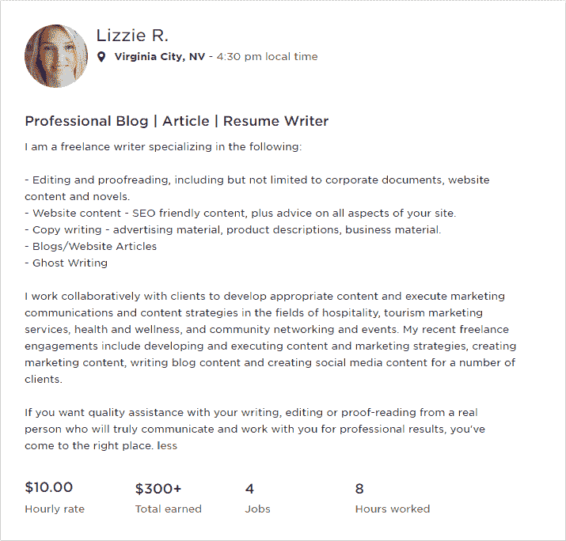](https://mtlynch.io/upwork-scammer/lizzie-r-profile.png)

莉齐在 Upwork 上的自由职业者简介

我需要作家为我正在建设的 keto diet 网站写稿。作为一个生活在美国的英语母语者，Lizzie 似乎是一个潜在的匹配者。[她的简介](https://www.upwork.com/o/profiles/users/_~019b8bbe4e49ebe61c/)没有明显的语法错误，这在受雇作家中是非常罕见的品质。最棒的是，她每小时只收 10 美元。

好吧，我知道你在想什么:每小时 10 美元，她显然是个骗子。或者一个糟糕的作家。Upwork 上的大多数作家每小时收费 30-60 美元，那么为什么会有人接受这么低的费率呢？

但这是 Upwork 冒险的一部分。我合作过的一些最优秀的人打出了可疑的低价广告，因为他们想建立一个良好的评级历史。利齐只做过几份工作，但她对所有工作都有完美的评价。

如果她被证明是有才华的，我会以惊人的价格得到一个伟大的作家。如果她写了一些可怕的东西，我至少可以看到每小时 10 美元的写作是什么样子。

## 用 50 美元换一张空白单据[🔗︎](https://mtlynch.io/upwork-scammer/#exchanging-50-for-a-blank-document)

收到我的工作邀请后，利兹欣然接受了。我给她分配了三份报告，并给她提供了如何写报告的指导。

我设定了五个小时的限制，并告诉她如果她没有在 4.5 小时内完成，她应该用最后 30 分钟把她的所有进展放到我们共享的谷歌文档中。

第二天，Upwork 报告说 Lizzie 给我开了整整五个小时的账单，但是谷歌文档是空的。她也没有给我发任何信息。

## 救援介入式监视[🔗︎](https://mtlynch.io/upwork-scammer/#intrusive-surveillance-to-the-rescue)

在检查利齐的时间表时，我意识到她用 Upwork 的官方间谍工具“工作日记”记录了自己的工作时间。它捕捉自由职业者的屏幕图像，记录他们的击键，并将所有信息发送给 Upwork 和客户端。

工作日记让我毛骨悚然。我从不要求自由职业者来经营它，但是 Lizzie 选择了经营它，而不是简单地为她的时间向我开发票。这意味着我没有任何结果，但我有截图显示她是如何度过她向我支付的五个小时的。

[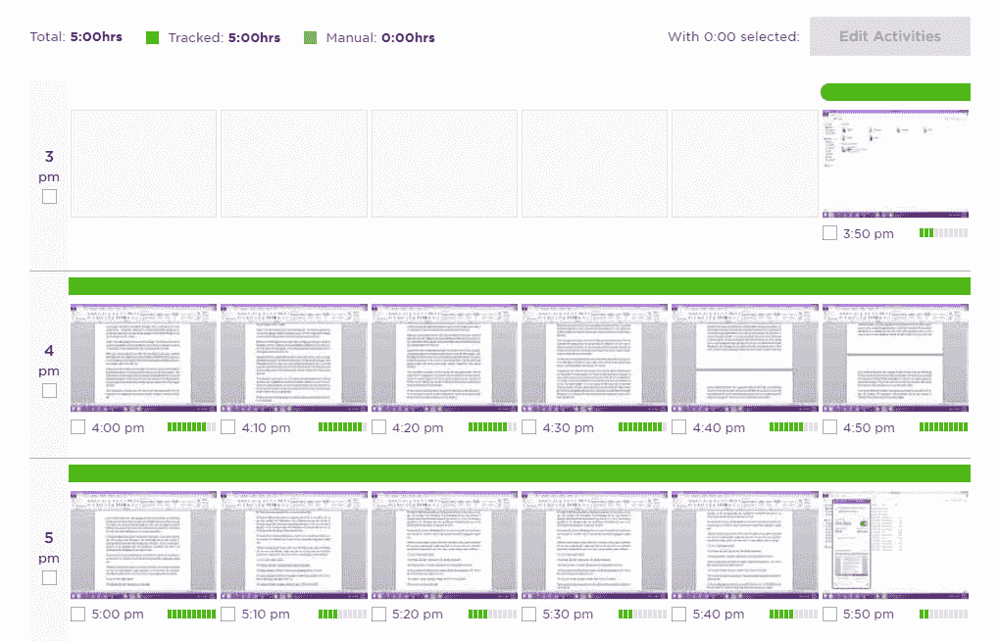](https://mtlynch.io/upwork-scammer/workdiary-dashboard.png)

利齐在工作日记中的活动概述

在早期的截图中，她正在写一份关于印度教咒语的文件。这肯定与我的项目无关，但她为此向我收费。

[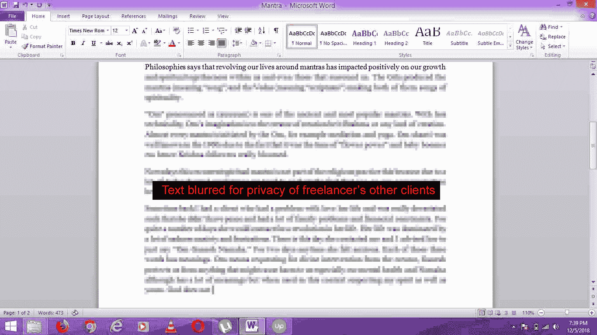](https://mtlynch.io/upwork-scammer/workdiary-2.jpg)

利齐让我为另一个客户写一篇关于咒文的文章

后来，她改变了思路，开始写一篇关于塔罗牌的文章。除非 keto 世界出现了一种新趋势，将塔罗牌读数整合到食物选择中，否则这似乎也与我的项目无关。

[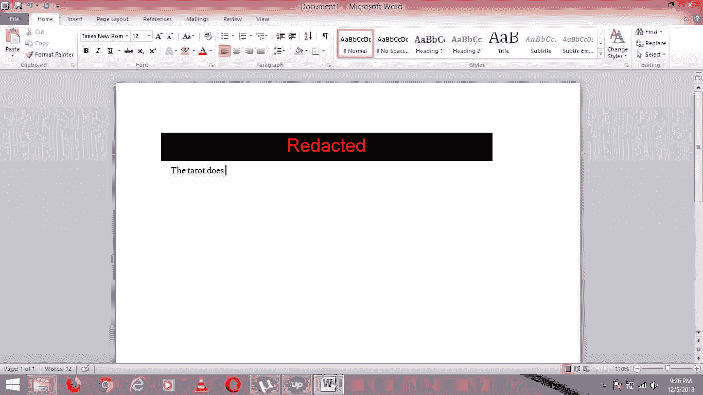](https://mtlynch.io/upwork-scammer/workdiary-4.jpg)

利齐为另一个客户写的关于塔罗牌的文章向我收费

## 这是怎么回事？[🔗︎](https://mtlynch.io/upwork-scammer/#whats-going-on-here)

然后，事情变得更有趣了。一张截屏显示 Lizzie 使用 Upwork 的消息界面与她的其他客户通话:

[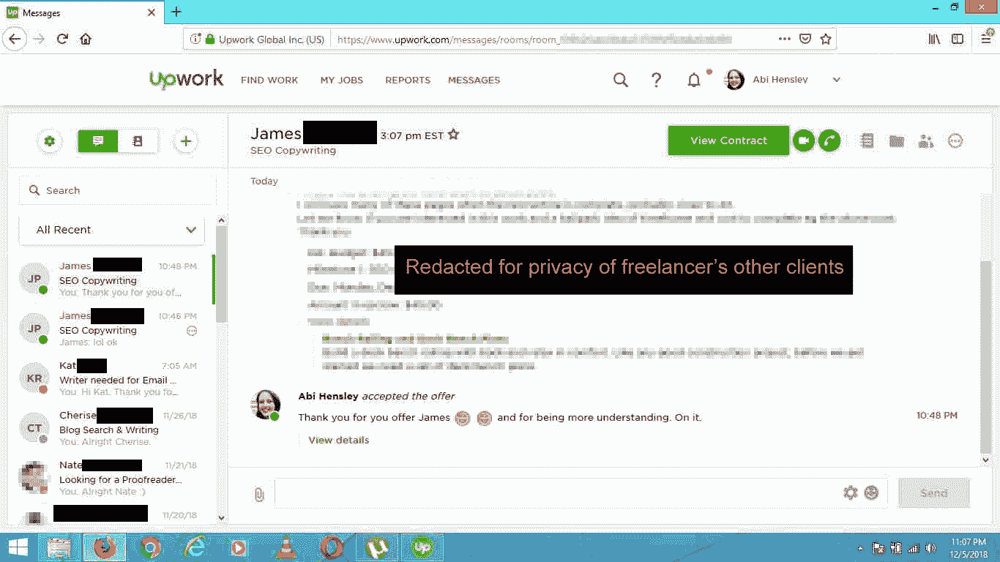](https://mtlynch.io/upwork-scammer/workdiary-5.jpg)

显示 Lizzie 向其他客户发送消息的屏幕截图

一开始我很困惑，因为它显示了两个人在说话，但他们都不是利齐。哦！她以另一个 Upwork 用户的身份登录，名字是“阿比·汉斯莱”

在 Upwork 上快速搜索就能找到 Abi 的简介。果然，它有完全相同的文字和每小时的费用作为 Lizzie:

[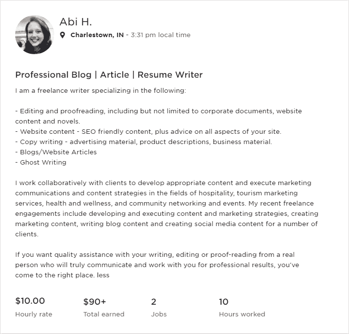](https://mtlynch.io/upwork-scammer/abi-h-profile.png)

“Abi H .”的向上工作配置文件，具有与“Lizzie R .”相同的文本

这解释了为什么她的任务栏上有四个不同的浏览器。她可能对每个 Upwork 身份使用单独的浏览器。

[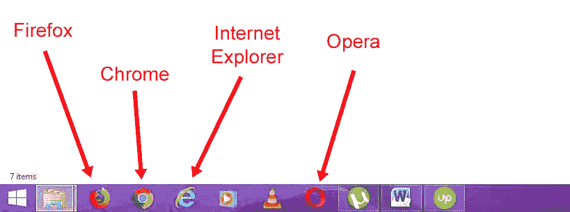](https://mtlynch.io/upwork-scammer/many-browsers.jpg)

Lizzie 的桌面截图，显示安装了四种不同的 web 浏览器

## 格蕾丝是谁？[🔗︎](https://mtlynch.io/upwork-scammer/#who-is-grace)

其中一张截图显示了 Lizzie 的文档文件夹:

[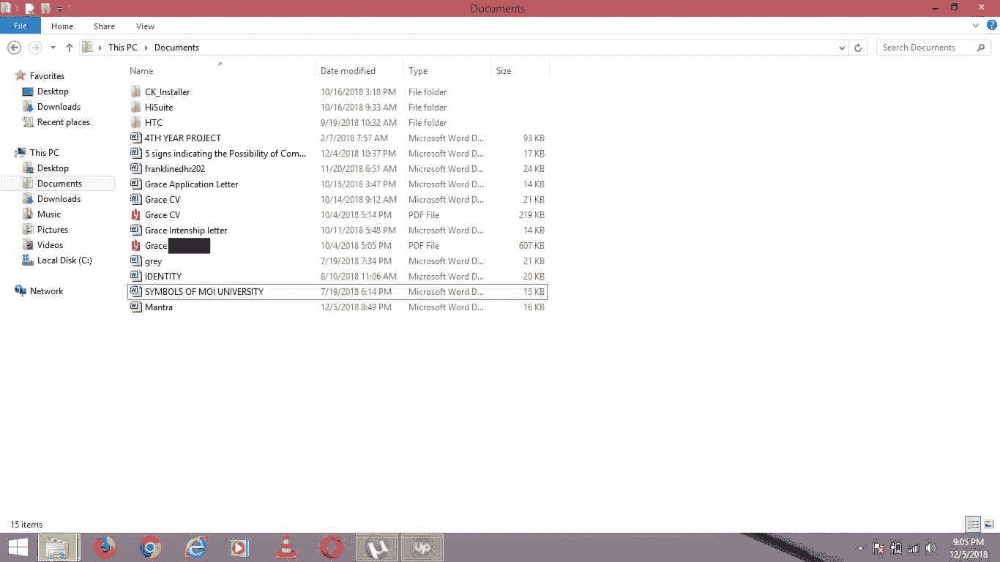](https://mtlynch.io/upwork-scammer/workdiary-6.jpg)

工作日记截图显示了 Lizzie 的文档文件夹

它揭示了几个标题中带有“Grace”名称的文件:

*   “宽限期申请信”
*   “格蕾丝简历”
*   " Grace Intenship[*sic*letter "

最后，有一个 PDF 文件，它的文件名是“Grace ”,后面跟了一个看起来像是姓的东西。全名非常独特，以至于谷歌只找到了一个匹配结果:一个肯尼亚教师的脸书简介:

[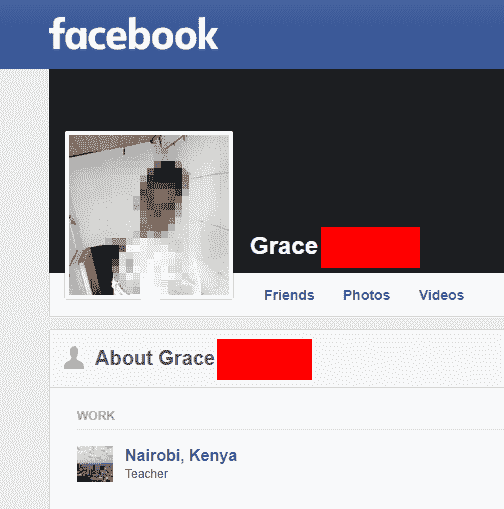](https://mtlynch.io/upwork-scammer/grace-facebook.png)

利兹的真实身份，潜在的

## 现在是晚上 9 点。你知道你在哪里吗？[🔗︎](https://mtlynch.io/upwork-scammer/#its-9-pm-do-you-know-where-you-are)

截图中还隐藏着另一个微妙的线索:时区。

Upwork 在格林威治标准时间下午 6 点 15 分拍摄了这张照片，但这位自由职业者的时钟显示的是晚上 9 点 17 分。

[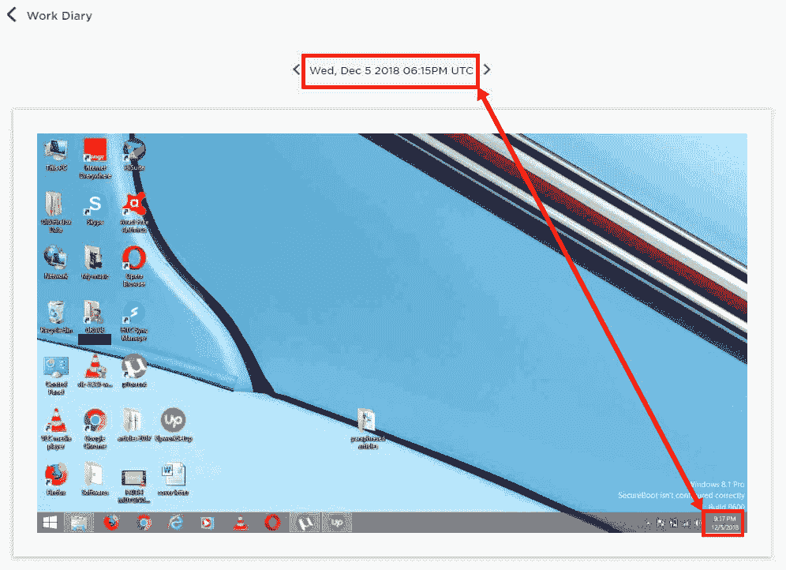](https://mtlynch.io/upwork-scammer/time-comparison.jpg)

利齐的钟比格林威治标准时间快三个小时

那会是什么时区呢？果然，这是肯尼亚内罗毕的时区:

听起来不像是一个[出生者](https://en.wikipedia.org/wiki/Barack_Obama_citizenship_conspiracy_theories)，但是在肯尼亚名字和肯尼亚时区之间，看起来“Lizzie”实际上可能是肯尼亚人。

## 那个侧写怎么样？[🔗︎](https://mtlynch.io/upwork-scammer/#what-about-that-profile)

我又看了一眼最初让我雇用利兹的 Upwork 个人资料。一些谷歌搜索显示，利兹抄袭了整件事——这是一个 LinkedIn 简介和另一个 Upwork 简介的混搭。

[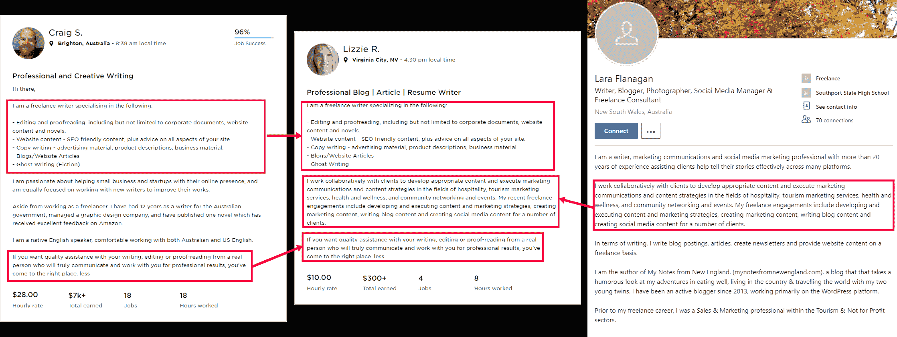](https://mtlynch.io/upwork-scammer/profile-stitching.png)

利齐通过拼接另外两张照片创建了自己的个人资料

## 这是诡计吗？[🔗︎](https://mtlynch.io/upwork-scammer/#is-this-a-trick)

这个骗局看起来如此笨拙和明显，以至于我担心这是一个更精心策划的骗局的第一步。她本可以给我发一张 50 美元的普通发票，为什么要上传截图来证明她没有做这项工作？那为什么给我开账单并扣留报告？自然，那会提示我检查截图历史。

在电影中，骗子总是让他们的受害者认为他们已经发现了骗局，但是允许受害者揭露虚假的骗局是真正的*骗局的一部分。然后，就在他们认为自己已经占了上风的时候，受害者却直接陷入了真正的骗局。这里还有另一层欺骗吗？*

[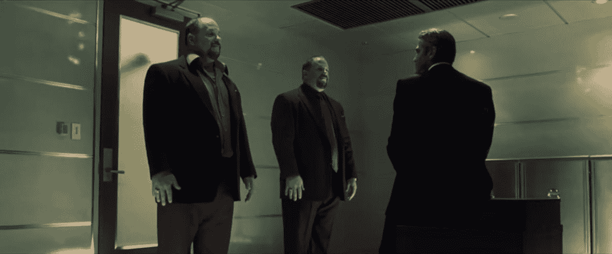](https://mtlynch.io/upwork-scammer/oceans-eleven.jpg)

“我把丹尼·欧森锁在了我金库旁边的一个房间里，并付钱让他的朋友看守他。现在他再也不能抢劫我了！”

## Upwork 怎么会漏掉这个？[🔗︎](https://mtlynch.io/upwork-scammer/#how-did-upwork-miss-this)

令我震惊的是，Upwork 迫使自由职业者安装入侵性间谍软件，大概是为了捕捉欺诈，但他们忽略了许多巨大的欺诈指标:

*   两个自由职业者使用相同的电脑和 IP，同时声称位于相距 2000 英里的城市。
*   两个自由职业者有完全相同的侧写。
*   一个自由职业者从同一个网站上一个更成熟的用户那里剽窃了他们个人资料的很大一部分。
*   两个自由职业者都声称住在美国，但他们的时钟设置为内罗毕时间，很可能有肯尼亚的 IP 地址。

## 结果，最后[🔗︎](https://mtlynch.io/upwork-scammer/#results-finally)

我一看到截图就关闭了合同，并向 Upwork 举报了欺诈行为。利兹目睹了合同的结束，但对我对她的任何评论都不知情。

第二天，利齐给我发信息，问我为什么终止合同。她没有提到她给我开的异常工作时间的账单，但她附上了一份 Word 文档，里面包含了我完成的三份报告。

这是她关于可口可乐是否适合酮饮食的报告:

> **可口可乐**
> 
> ***简短描述***
> 
> 可口可乐不含酮，因为它含糖量高，不含脂肪。
> 
> ***详细描述***
> 
> 根据可口可乐的营养价值，它不是酮友好的。每份食物含 10.6 克碳水化合物**【Ed:实际含碳水化合物量为 39 克】**。此外，它不含脂肪和蛋白质。也许，你可以考虑可口可乐的其他变种，如零度可乐或健怡可乐。

语法还不错，但这进一步证实了利齐的母语不是英语。最响亮的赠品是“健怡可乐”前的定冠词美国人从来不会说，“我想要一杯提神的健怡可乐。”

[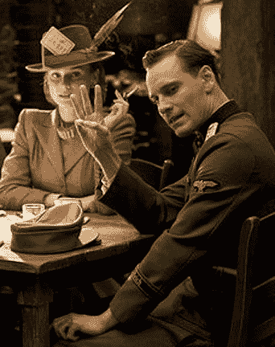](https://mtlynch.io/upwork-scammer/three-glasses.jpg)

请给我三杯健怡可乐。

## Upwork 如何处理欺诈[🔗︎](https://mtlynch.io/upwork-scammer/#how-upwork-handles-fraud)

在我举报 Lizzie 的账户有欺诈行为的两天后，Upwork 在我的支持票上贴了这样一条信息:

> 根据您的报告，我已经检查了帐户，并按照我们的服务条款采取了行动。为了保护我们所有成员账户的机密性，我不能报告我们的调查结果。

不能报告结果吗？我希望他们关闭利齐所有的假账户，这个结果对我来说应该是显而易见的。

自从我向 Upwork 报告 Lizzie 以来已经三个星期了。在我提交报告的几天后，这些个人资料就被保密了，但 Upwork 仍然显示他们处于活跃状态，并接受工作邀请:

Upwork 确实退还了我 50 美元，这很好。

## 为什么我的反馈没有显示出来？[🔗︎](https://mtlynch.io/upwork-scammer/#why-isnt-my-feedback-showing-up)

在我给 Lizzie 的工作后反馈中，我指出她的简介是欺诈性的。我小心翼翼地避免任何基于猜测的指控。我的评论集中在客观事实上:Lizzie 给我开了不相关工作的账单，她的工作日记显示她在操作重复的 Upwork 配置文件。

奇怪的是，Upwork 将其翻译为“未给出反馈”:

[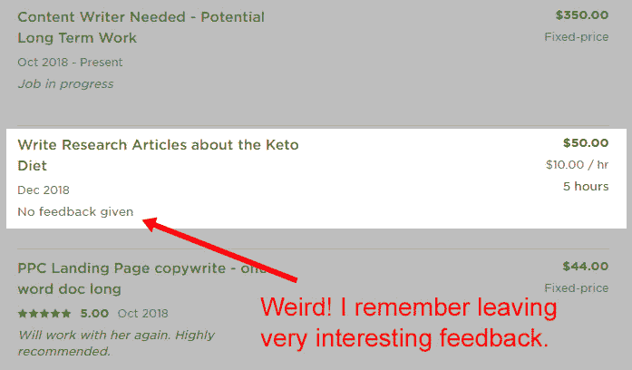](https://mtlynch.io/upwork-scammer/lizzie-feedback.jpg)

Upwork 在她的 Upwork 个人资料中隐藏了我对 Lizzie 欺诈账户的评论。

**更新**:[Reddit](https://www.reddit.com/r/Upwork/comments/a9zsj6/what_i_learned_about_upwork_from_a_bumbling/eco5p6y/?st=jq7drkdw&sh=85d5b50b)上的评论者指出，Upwork 总是在批准工作退款后隐藏客户反馈。

## 警告其他客户端[🔗︎](https://mtlynch.io/upwork-scammer/#warning-other-clients)

我发现利齐恶作剧的那天，我联系了她的另一个客户。他通过 Lizzie 的“Abi”个人资料雇佣她撰写销售文案。他回答说，他仍在等待她的工作，但几天后又跟我联系，说他也终止了她的合同。

很明显，Upwork 从未通知这位客户欺诈，尽管他们在他与 Lizzie/Abi 仍有未结合同时“检查了账户并采取了行动”。

## Upwork 的交叉污染问题[🔗︎](https://mtlynch.io/upwork-scammer/#upworks-cross-contamination-problem)

Upwork 的客户名单是私人的，所以我应该无法联系我的自由职业者的其他客户。但是 Lizzie 在她的截图里放了足够多的信息，我找到了另一个雇佣她的人的联系方式。

这带来了 Upwork 的工作日记功能的另一个有趣的问题:交叉污染。

如果一个自由职业者申请为你工作，并在求职信的结尾写道:

> 顺便说一下，我经常运行软件，将我整个屏幕的截图发送给未披露的第三方。希望你不介意！

你可能会立即拒绝这个候选人。但如果每个 Upwork 用户用工作日记来记录他们的时间，他们就会含蓄地这么说。

作为客户，你无法阻止这一点。客户既可以要求他们的自由职业者使用工作日记，也可以让它成为可选项，但没有禁止它的选项。即使你可以，其他客户可能仍然需要它。

如果你雇佣的一个自由职业者在为另一个客户开账单的时候碰巧检查了你的信息，或者打开了一个包含你工作的窗口，工作日记就会把你的私人信息泄露给其他人。对于自动全屏捕捉，这种泄漏是不可避免的。

## 最终想法[🔗︎](https://mtlynch.io/upwork-scammer/#final-thoughts)

这次经历让我看到了 Upwork 的一些缺点。一方面，他们错过了许多我希望他们抓住的危险信号，却没有采取什么措施来防止继续虐待。另一方面，这确实说明了一点，这是我这么多年来第一次雇佣诈骗犯。

虽然我从来没有爱上过 Upwork，但像 Fiverr 或 Freelancer.com 这样的替代平台对我来说更糟糕。我将继续使用 Upwork，但这一事件给了我另一个理由对授权自由职业者访问私人数据持保守态度。