# 数字营销和分析综合指南

> 原文：<https://www.analyticsvidhya.com/blog/2018/12/guide-digital-marketing-analytics/?utm_source=wanqu.co&utm_campaign=Wanqu+Daily&utm_medium=website>


## 介绍

进入数字分析领域的最大挑战之一是数字营销的前景极其复杂。很难找到既懂数字营销又懂数据科学的专业人士。充足的人才供应严重短缺，而数字营销的支出却持续增长。

这种支出在发达经济体中相当普遍。但好消息是——发展中国家开始迎头赶上，并没有落后太多。查看下表，亲自了解印度数字营销支出份额的增长情况:

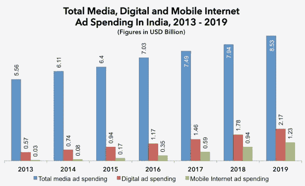

**图来源:eMarketer**

我看到数字分析领域的职位空缺已经很多年了，因为缺少这样的利基人才，加上这个领域的巨大增长。在过去的几个月里，我花了一些时间试图理解数字营销的前景，以及它如何与我们的数据科学领域相结合。在这篇文章中，我分享了我的编辑笔记，这些笔记应该可以简化这个复杂的数字营销世界，并帮助您了解如何在这个领域中使用您的数据科学工具。

兴奋了吗？很好。让我们从最基本的问题开始，从那里开始！

## 目录

*   是什么让数字媒体优于传统媒体？
*   作为一名数字分析专家，我为什么要关心数字媒体？
*   数字媒体的子渠道
*   考虑一个真实的场景
*   谷歌搜索网络与谷歌显示网络
*   谷歌是如何为每次搜索选择广告及其位置的？
*   Adwords(现在的谷歌广告)与 Adsense
*   出版商的双击(DCP)与广告商的双击(DCA)
*   双击搜索与双击投标管理系统
*   Cookies、像素和标签容器
*   DSP 与 SSP 和 Ad 交换
*   数据管理平台
*   身份解析
*   数字分析工具

## 是什么让数字媒体优于传统媒体？

营销就是要做好 4 件事——在正确的**时间**通过正确的**渠道**接触正确的**客户**和正确的**产品**。营销也需要大量的测试，看看哪种组合对这 4 个因素有效，所以我们需要一个投放市场所需时间最短的渠道。传统媒体渠道，如有线电视、传单、广播、实体横幅等。将这四件事都做好会面临很多挑战。仅举几个例子:

1.广告一旦印刷或播出，就不能更改。

2.上市时间到了。这对于任何一个有活力的行业来说，其实都是一个很大的挑战。许多优惠要求快速响应时间(如亚马逊 Prime 销售)，广告商不希望事先宣布销售，以确保客户定期来到他们的网站查看优惠。

3.无法准确衡量广告浏览量。我们只知道广告活动的反应。

4.接触特定受众的方式有限。

5.即使我们设法接触到正确的客户，我们也可能不会在正确的时间接触到他们。例如，如果我们在目标观众观看的特定电视节目中做广告，我们实际上并不知道目标客户在播放广告时是否在看电视。类似地，如果我们给当时正在旅行的特定潜在客户发邮件，那就失去了机会。

6.鉴于来自这些渠道的低响应，这些传统方法中的大多数具有高的每次获取成本。

数字营销能够克服上述所有挑战。随着我们在本文中讨论其他相关主题,“如何”将变得更加清晰。随着互联网在全球的渗透率达到 60%以上，并且还在快速增长(见下图)，数字媒体现在是吸引观众注意力的理想场所。


**图来源:研究门**

今天，我们可以通过数字媒体接触到 40 多亿互联网用户。另一项调查(如下)显示，印度成年互联网用户每天花费 2 小时 28 分钟。请注意，所有成年人花费的平均时间是 1 小时，所有互联网用户的平均时间应该在 1 小时到 2.5 小时之间(比如 2 小时)。互联网上每天可用的广告机会估计为 40 亿*2 小时= 80 亿小时/天。

即使我们假设只有 1%的互联网时间可以通过广告货币化，我们仍然在谈论 8000 万小时/天！T3】

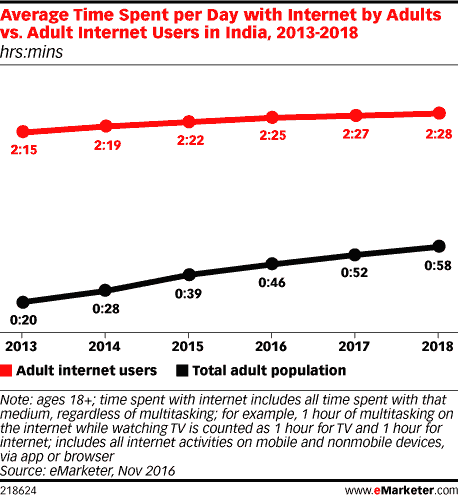

**图来源:eMarketer**

这个练习会让你感受到数字营销的巨大商机。作为一名分析师，你肯定会注意到互联网用户和平均上网时间的增量曲线。鉴于这一渠道的规模和精确度，数字媒体呈现出多种广告方式。让我们大致分类这些数字媒体的子渠道。

## 作为一名数字分析专家，我为什么要关心数字媒体？

数据科学家可以在任何领域和任何行业做出贡献。例如，在创造新药物、智能语音助手(如 Google Home)、定位策略等方面，有数据科学的角色。对于这些角色中的每一个，数据科学家可能只需要很少的领域知识，但仍然可以利用我们拥有的工具做出巨大贡献。例如，为了建立一种新的药物，你不需要知道它背后的所有生物学知识。你只需要知道一个目标函数和需要优化的参数。在这些场景中，你可以很容易地将工作分成业务人员需要告诉的和你已经需要知道的。

然而，数字分析略有不同。鉴于行业动态的快速变化，我们每天都在获得更好的数据。作为分析师，您需要决定:

*   哪些数据有用？
*   如何准确地捕捉这些数据？
*   如何使用您创建的数据科学工具？

在这个领域，业务人员和分析师之间的界限变得非常模糊。以下是公司对数字分析所需的新技能的描述:

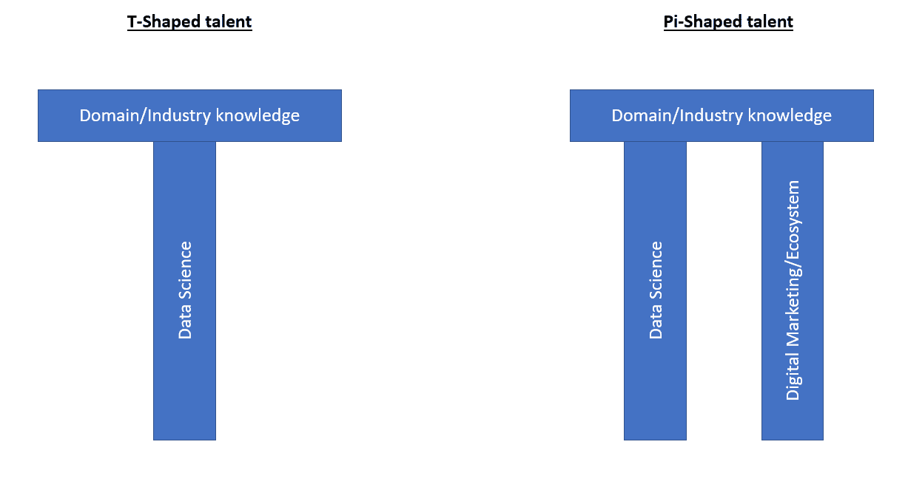

T 型人才足以胜任不同领域的大多数数据科学家角色。然而，数字分析专业人士需要π型人才才能成为摇滚明星。如果你已经了解了数据科学的世界，那么这篇文章将帮助你掌握π型人才要求的第二个方面，即数字生态系统，并为你打开一片充满机会的土地。这篇文章不可能囊括数字营销领域的所有内容，但这是开始你的旅程的最好地方。

## 数字媒体的子渠道

我们通常谈论 3 种类型的数字媒体——自有媒体、付费媒体和付费媒体。以下是对每种方法的描述:

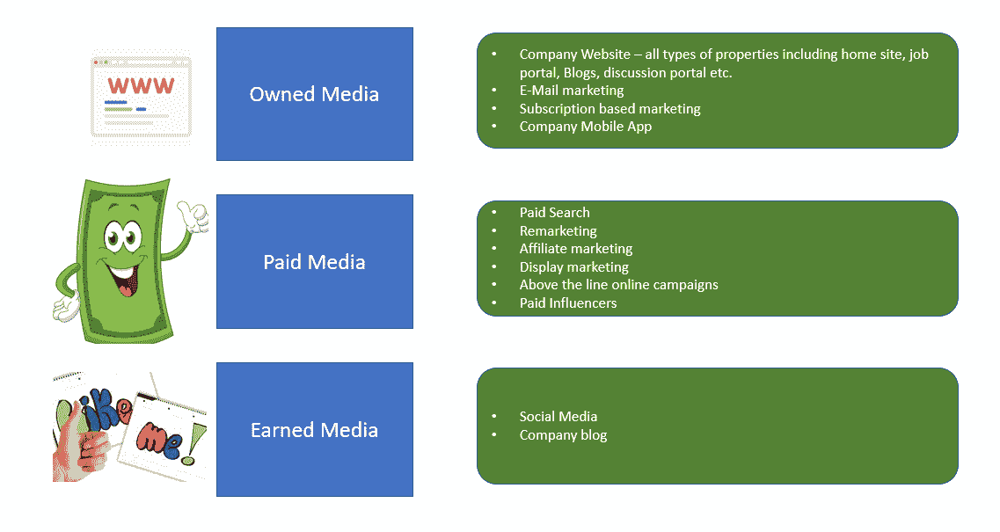

数据科学在这三种媒体中都有很强的应用。在我们进入数据科学的实际应用之前，让我们先将潜在客户的旅程大致分为几个阶段。

**客户获取的不同阶段**

获取客户包括三个阶段。

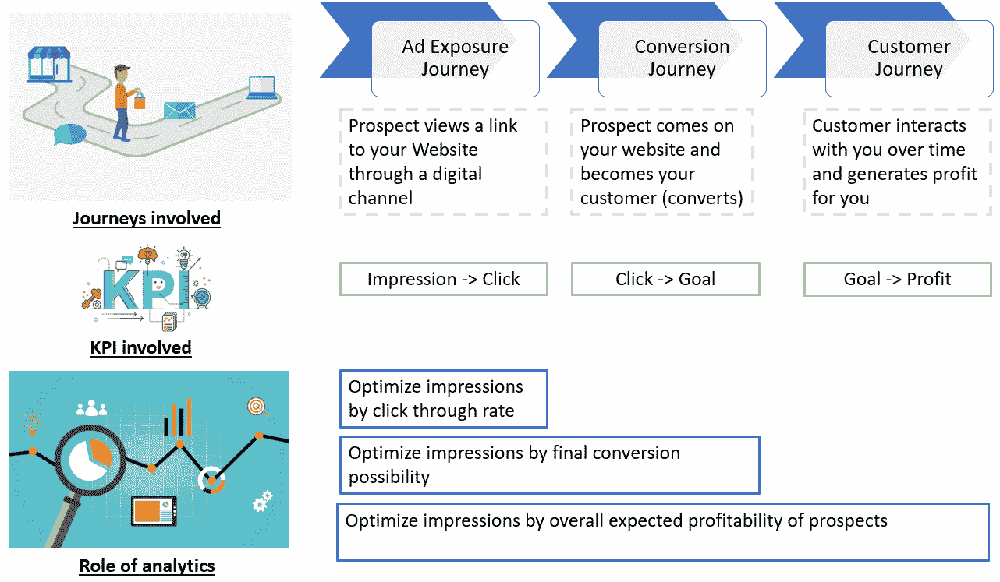

> 我们成功营销活动的最终目标是只向那些有强烈盈利倾向的潜在客户展示广告。

看起来很简单，对吧？但在现实世界中，真的不是！原因如下:

*   **广告曝光之旅**通常由数字媒体/广告服务公司管理，如谷歌、脸书等。
*   **转化之旅**可以由你的内部团队或外包数字分析公司如 Adobe Site-catalyst 和 Google 来管理
*   最后，**客户旅程**由您的内部分析团队管理，因为这是高度机密的公司信息。

正如您可能已经猜到的那样，在所有三个阶段之间进行协作以确保活动成功变得非常困难。让我们来看一个现实生活中的场景，它将使这一挑战变得更加清晰。

## 考虑一个真实的场景

X 公司销售人寿保险，通过付费数字媒体获得 50%的客户。典型的人寿保险开始时利润很低，因为涉及到所有的管理费用，并在 2 到 4 年内逐渐增加到最大利润。从第 5 年开始，优质客户开始离开保险公司，去市场上买更好的产品，因此利润开始下降。请看这张显示年度利润的说明性表格:

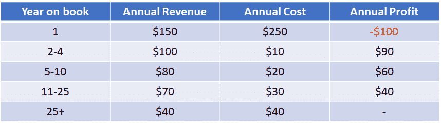

仅仅依靠平均值往往具有欺骗性。对你的公司来说，似乎每一笔收购都价值(终身价值)1，130 美元，但所有客户都是不同的，作为分析师，我们试图找到利润最高的部分。现在，假设您发现有一个属性，即客户到目前为止持有的保单总数，它可以将高利润的客户与其他客户区分开来。这条规则有多简单:

```
For customer with #insurance policy <= 2 => Customer lifetime value  = $4000
For customer with #insurance policy > 2 => Customer lifetime value  = -$50
```

现在，挑战来了。为了符合监管机构的要求，您不能仅仅因为盈利原因而拒绝保单。因此，你能设计收购组合的唯一方法是你能控制谁在看你的广告。简单来说，假设你 50%的收入直接来自你的网站，剩下的来自谷歌的付费搜索。直接进入你网站的收购很难控制，因为这些潜在客户已经进入了转化漏斗。

所以你能做的就是控制谁会看你的付费搜索广告。控制付费搜索目标看起来很简单——只要告诉谷歌向那些#insurance policy <= 2 的人显示广告。但是这样做有一些挑战:

1.  这条规则是你的知识产权，你肯定不希望把这块宝石交给其他保险竞争对手正在接洽的一家集成商
2.  谷歌可能真的没有这个变量来应用你的规则
3.  谷歌不会公开分享他们的印象等级变量，以帮助你用谷歌可用的变量来制定这个规则

所以你看到了挑战——广告服务器公司可用于实时定位的变量对你来说是不可用于连接盈利能力的。同样，企业也不能让谷歌获得与盈利能力相关的信息来进行特定的定位。尽管付费媒体很难直接锁定目标，但我们仍有很多方法来应对这一挑战。

我们将在本文后面更多地讨论这些目标受众方法。在我们继续讨论数字媒体上的目标受众方法之前，让我们先弄清楚一些术语。理解这些行话术语的最好方法是将它们相互对照。

## 谷歌搜索网络与谷歌显示网络

当一个普通人想到谷歌时，我们会想到搜索引擎(嗯，至少我想到了！).当我们搜索一个关键词时，我们会看到一个链接列表。广告商必须为排名靠前的赞助广告付费。有机搜索中的链接列表是免费的，排名由谷歌专有的页面排名算法决定。在下图中，Adobe 已经为赞助广告付费，而它下面的 Google Analytics 链接是一个有机搜索。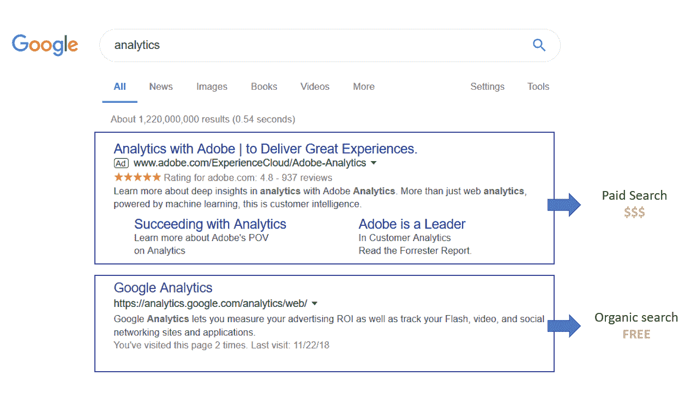

谷歌搜索网络不仅仅是搜索引擎。它目前包括:

*   **谷歌属性:**谷歌搜索、谷歌游戏、谷歌购物、Youtube 和谷歌地图
*   其他合作伙伴:亚马逊、纽约时报、W3Schools 和谷歌定制搜索网站

谷歌显示网络(GDN)怎么样？

除了搜索网络，谷歌还与 200 万个可以在其网站上发布广告横幅的网站合作。GDN 覆盖了大约 90%的互联网用户。GDN 最大的挑战是回复率低，因为这些访问者并不是真的关注你的产品。这些访问者只是在看新闻、天气预报或观看视频等。

因此，我们将这样的访客归类为漏斗顶端的潜在客户，因为他/她在购买之前还有很长的路要走。这种显示网络的另一个挑战是归属。因为顾客可能今天看了你的广告，很久以后才购买，这些购买的归属变得非常主观。GDN 在品牌认知和多点接触收购方面非常成功(这要求客户在最终购买前多次查看你产品的广告)。如果 GDN 和谷歌合作，你可能会在你喜欢的网站上看到他们的广告。这里有一个例子:

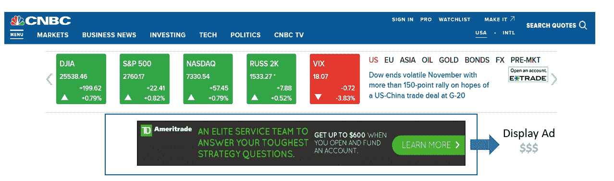

你现在应该对谷歌的核心业务广告有所了解。这是谷歌的主要收入来源。每个公司都想与谷歌合作来宣传他们的产品/服务。但是谷歌如何选择哪些广告必须显示以及何时显示呢？在我们跳到数字营销术语之前，让我们简单回顾一下谷歌广告拍卖。

## 谷歌是如何为每次搜索选择广告及其位置的？

你会惊讶地知道谷歌是如何做到这一点的。让我们通过一个说明性的例子来理解其中的逻辑。

我在谷歌搜索上搜索了 ***【保险自由互助】*** 这个词。在这一点上，谷歌为这一个实例广告库存主持一个现场拍卖。此次拍卖将在毫秒/微秒内进行，获胜者将获得赞助广告位的最高位置。你只需要一个高出价就能获得第一名吗？当然不是。因为我搜索的是 liberty mutual insurance，所以没有其他竞争对手会理所当然地占据首位。否则，谷歌的客户将很难找到相关链接(谷歌提供的核心技能)。以下是谷歌搜索这个词的结果:

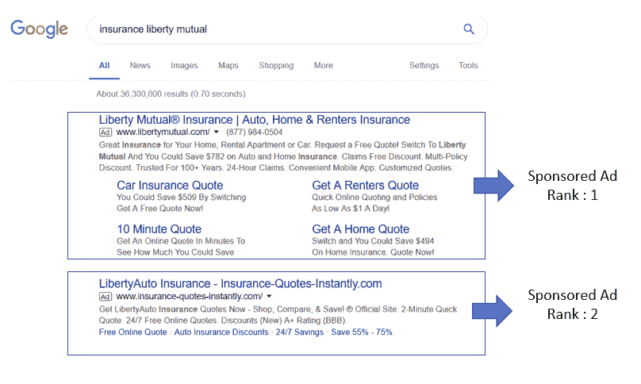

正如你所看到的，“保险报价即时”也参加了这次拍卖，但没有赢得自由互助。那么，谷歌如何引入相关性这一维度来消除货币偏见呢？谷歌对每个排名都有一个质量分数的概念，这是一种有机搜索的页面排名分数。这个质量分数然后乘以出价来计算广告分数。该广告分数最终用于对搜索实例的广告进行排序。

这里有一个关于幕后发生的事情以及广告商如何为他们的广告收费的简单观点:

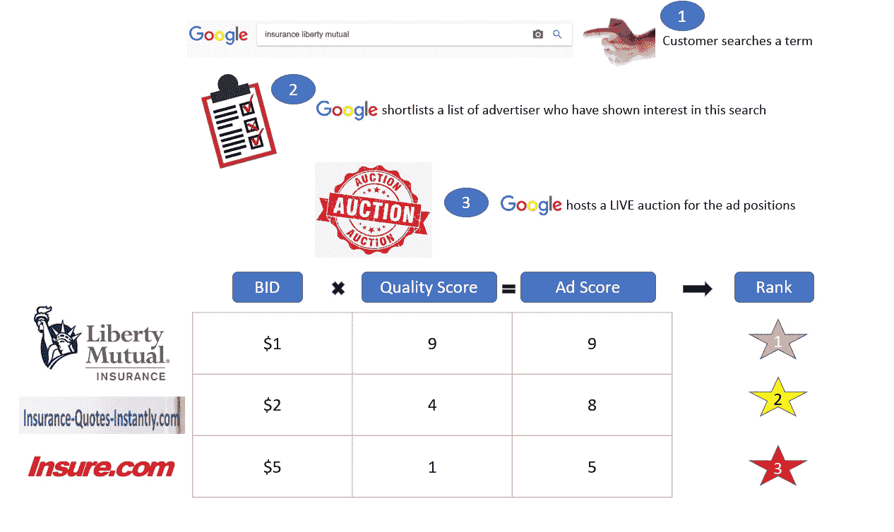

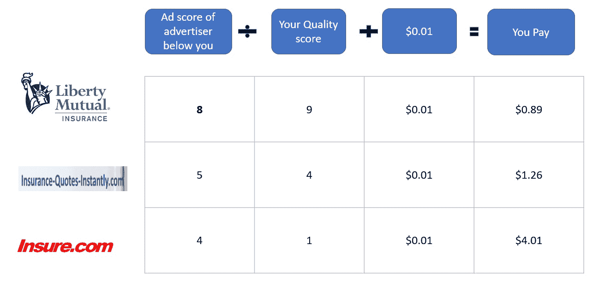

在这个谷歌拍卖模式中，你应该注意到几件事:

1.  你不需要总是出价很高来赢得广告排名拍卖。举例来说，人们正在寻找你，你将赢得最低成本的投标。
2.  你总是支付赢得竞标战所需的最低金额。即使 Liberty Mutual 在这次拍卖中出价数百万美元，他们也只会支付 0.89 美元
3.  这是很容易捍卫你的专有关键字相对较低的价格，因为高质量的分数

**CPC vs CPM 竞价**–快速记录我们在搜索和展示网络上的竞价类型。CPC 竞价是指广告客户希望对他们愿意为一次点击支付的价格进行竞价。CPM 竞价是基于每 1000 次展示。这实际上取决于广告商想要达到的目标类型。如果广告商的目标是品牌，那么最重要的是印象。然而，如果广告客户希望客户在转换漏斗中进步，他们通常会对每次点击费用出价。

这里的一个例外是多视图购买，在这种情况下，客户通常会在多次查看广告后做出决定。在这种情况下，即使目标是转化，广告商也可能对 CPM 出价。

## Adwords(现在的谷歌广告)与 Adsense

简而言之——广告客户使用 Adwords 在谷歌的展示和搜索网络上发布广告。Adsense 被出版商用来将他们的内容货币化。Adwords 管理广告库存的需求方，而 Adsense 管理供应方。下图很好地说明了这个概念:

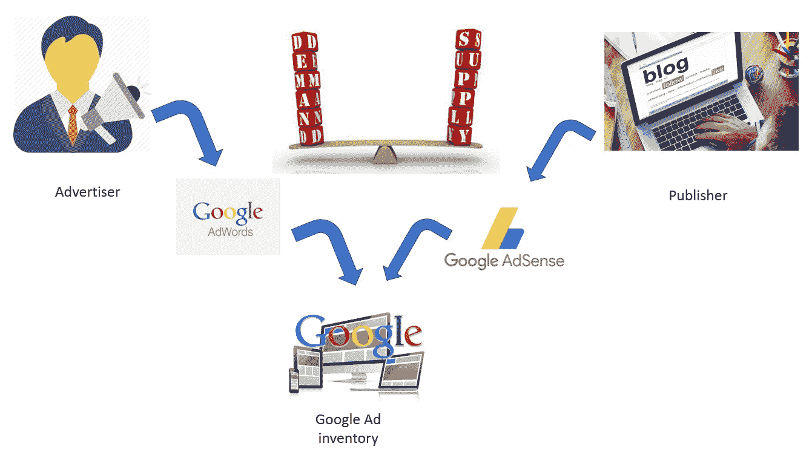

尽管谷歌在广告服务方面为出版商和广告商做了大量的工作，但它仍然提供了许多工具来将正确的广告匹配到正确的位置。这就是分析发挥如此重要作用的地方。谷歌通过三种方式向出版商的广告空间投放广告:

1.  **上下文定位:** Google Bot 在页面中爬行，通过分析文章主题，使用自然语言处理(NLP)对页面进行分类。只分析文本，而忽略图像/视频
2.  **投放目标:**单纯基于投放的竞价。在这里，广告客户手动选择他们希望展示广告的出版商，并简单地为位置出价
3.  **基于兴趣的广告:**最后，广告商可以基于推断的兴趣来定向广告。这一条是专门针对访问者的，而不是内容。例如，如果用户访问航空公司网站，然后来到分析 Vidhya。尽管机票预订广告与 AV 内容并不真正相关，但它们仍然可以基于基于兴趣的广告出现

***出版商*** 有什么杠杆可以在竞标他们的广告空间的池中选择子集？

1.  排除特定类别的广告:例如，一个婴儿博客可能不太喜欢交友网站的广告。这些类别通常非常敏感，如政治观点、成人内容等。
2.  **排除特定投标人/域名:**您可以排除您的竞争对手
3.  **创造受众:**发行商如果看到非常强势的模式，也可以创造受众。例如，您可能与一家航空公司聚合器有联系，并希望向那些已经访问过该聚合器的人显示航空公司广告，以推动他们的购买行为。你也可以创建复杂的变量
4.  **选择位置和允许尺寸:**您可以选择广告的确切位置和尺寸。这些可以在折叠之上或之下。折叠线以上不需要向下滚动，而折叠线以下只有当访问者向下滚动时才会出现在屏幕上。您也可以选择是否要包含小于您在拍卖中定义的尺寸的广告
5.  文本与视觉广告:您还可以选择是否希望广告窗口中只显示文本，或者显示图像/视频等视觉效果。您可以进一步选择广告位的背景颜色和其他格式选项

***的广告客户*** 有什么杠杆可以在为他们的广告空间竞价的池中子集？

我们将在稍后的谷歌分析部分讨论这个话题。现在，请注意，您可以利用人口统计和行为属性来锁定广告清单。此外，您可以选择关键字来精确选择您希望参与的拍卖。

## 出版商双击(DFP)与广告商双击(DFA)

DoubleClick 是一家广告服务公司，于 2008 年被谷歌以 31 亿美元收购。简单来说，DoubleClick for Publishers 让出版商更容易将他们的内容 moni 化。它还可以有效地跟踪您的内容在广告环境中的表现。

另一方面，广告客户双击可以帮助广告客户优化他们的搜索和展示活动。谷歌最近将 DFP 更名为谷歌广告经理。当你希望在谷歌展示网络之外管理你的广告时，DFP 比 AdSense 强得多——包括附属品牌、实时广告交换等。让我们看几个例子，看看我们分析师如何使用 DFP 完成的广告跟踪。

假设你拥有一个旅游博客，并使用 DFP 来管理你的广告库存。你的博客有 4 个主要部分——食物、目的地、人物和最新交易。在每个博客页面上，你有 3 个横幅——排行榜、摩天大楼和广场。下面的图片将帮助你在你的博客页面上看到这些职位:

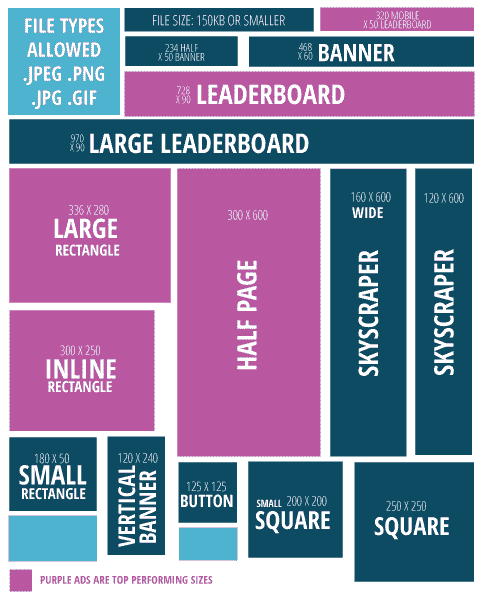

下表涵盖了 DoubleClick 默认发布的关键指标:

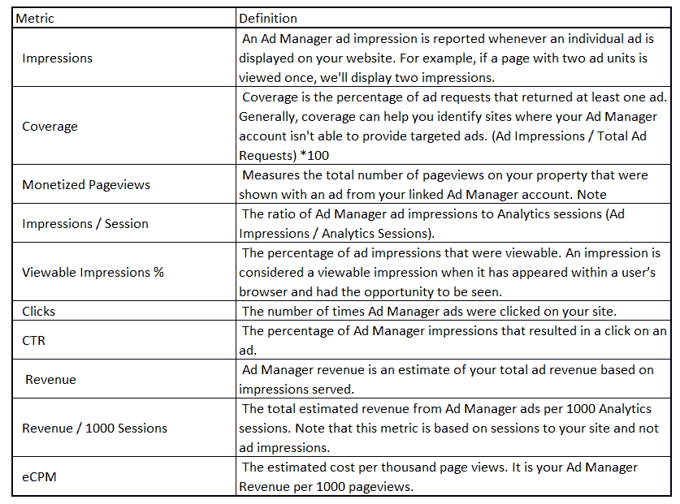

如果配合 Google Analytics 360 使用 DFA，会得到无穷的维度。然而，Google Analytics 360 要求你放弃一大笔钱，这不是每个人都能负担得起的。所以让我们坚持一些基本的维度，以及我们能用它们做什么。这里有几个维度，你可以用来分析你的网站在广告收入方面的表现:

1.  页面名称
2.  页面类别
3.  广告时段号
4.  来源/媒介

这些维度只是您可以用来分割信息的维度示例。让我们看一下维度指标视图，了解更多信息。

从基本视图开始，查看每个类别的表现如何:

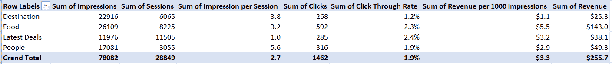

显然，尽管目的地类别获得了大部分印象，但食品部分带来了大部分收入(50%以上)。目的地类别的点击率(CTR)和每 1000 次展示的收入都处于最低值，这表明我们的广告没有针对该类别进行优化。看起来是个巨大的机会，对吧？按流量来源进一步细分目的地类别会得出以下结果:

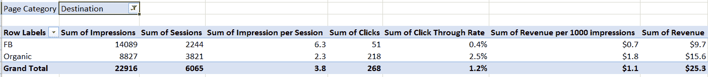

上表显示，餐饮是我们目的地类别的主要流量来源。但是，这种来源在点击率和收入方面的表现都不理想。这进一步缩小了我们的搜索范围。我们提供的信息是否与来自脸书的客户所期望的不同？我们可以通过检查这些观众的跳出率来寻找这些信息。我们将在以后进行讨论。让我们也回顾一下每种横幅广告在页面上的表现:

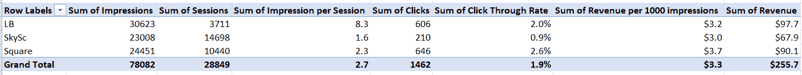

排行榜(LB)有最大数量的印象，这是有意义的，因为它出现在顶部，应该出现在大多数访问中。摩天大楼的点击率和每 1000 次展示的收入较低，表明这些横幅广告可能不完全可见(肯定有改进的余地)。我们可以使用 DoubleClick 更深入地分析有效的目标定位，但是我们将在以后的文章中继续讨论。

## 双击搜索与双击投标管理系统

双击是谷歌提供的一套产品。下图将有助于解释 DoubleClick 在数字媒体领域提供的服务类型:

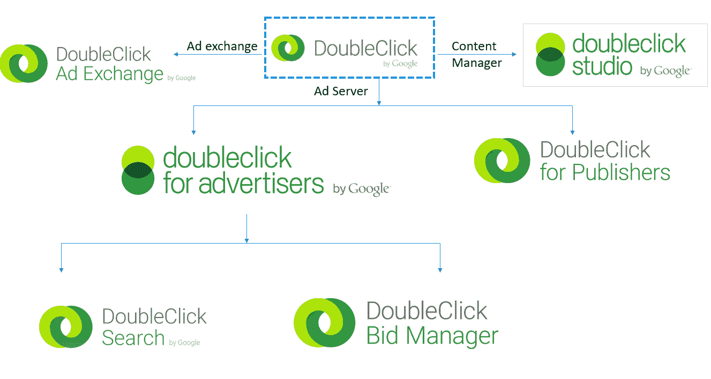

双击搜索主要由广告商用来管理他们在多个搜索引擎上的广告，包括谷歌搜索网络。双击竞价管理器用于管理谷歌展示网络和实时竞价平台上的展示广告。DoubleClick Ad Exchange 就像纽约证券交易所一样，是买卖广告库存的地方。DoubleClick 也像 DoubleClick Studio 一样提供活动管理服务。

## Cookies、像素和标签容器

Cookies 是通过访问者浏览的网站放在他们机器上的小文本文件。cookie 包含访问者返回时可以使用的一些关键信息。例如，许多网站使用 cookies 来保存 ID 和密码。其他人在客人回来时用它们来装满收银台的购物车。这些主要是第一方 cookies。

像双击、LiveRamp 等服务。放置一个第三方 cookie，他们用它来跟踪整个网络空间的用户活动。这里需要注意的重要一点是，您只能读取您放置的那些 cookie，因为所有 cookie 都有独特的属性。例如，亚马逊无法读取富国银行放在访问者浏览器中的 cookie。

像素(标签)通常是不可见的单个像素。当网页被加载并捕获关于访问者的重要信息时，这些像素会发光，或者 JAVA 代码会执行(两者的意思相同)。Pixels 还可以在访问者的浏览器中放置一个新的 cookie，或者检查是否已经有一个 cookie。网站需要在站点源代码中嵌入这个 Java 脚本，看起来大概是这样的:


标签容器可以包含多个像素或标签。一个标签可以触发另一组标签，依此类推。因此，容器被用来作出有条件的决定，决定一组像素是否应该激发。

**谷歌标签管理器(GTM):** 现在，你应该已经意识到数字世界就是要维护这些标签。为什么？因此，您可以衡量营销活动，并为潜在客户创造新的受众。

这里有一个简单的例子——汤姆经营着一个美食博客。他积极利用 Adwords 进行付费搜索。如果客户有一段时间没有回来，他还会重新营销他的客户，让他们回到他的博客。此外，他还使用谷歌分析跟踪自己的在线流量。他甚至利用 DoubleClick 来定位谷歌网络之外的展示广告。想象一下汤姆可能需要在他的网站上放置多少个标签——一个用于 Adwords，一个用于再营销，一个用于双击泛光灯，以及一些用于特定再营销活动的定制 DMP/DSP 标签。

在站点的源代码中处理如此多的标签对 Tom 的博客来说是非常危险的。谷歌标签管理器是这个问题的解决方案。Google Tag Manager 提供了一个 Java 脚本，Tom 需要将这个脚本放入他的源代码中，这样他就可以直接从 GTM 界面管理他网站上的所有标签。此外，Tom 在对标签进行小的更改时不需要通知他的 IT 团队，因为标签和站点源代码是两个独立的实体，表面上由 Google Tag Manager 链接在一起。以下是 Google 标签管理器可以为您管理的标签列表:

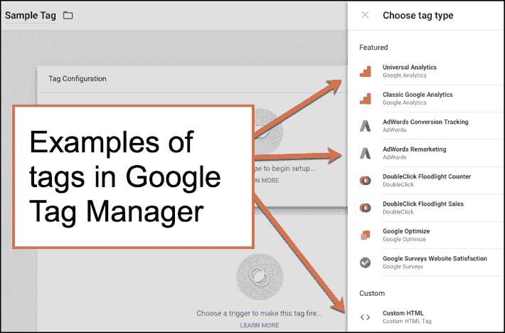

**数据层**是你应该知道的另一个关键概念。这个组件使得谷歌标签管理器成为如此强大的工具。简单地说，你可以把它看作是你的站点和 GTM 之间的数据桥梁。GTM 可以与数据层进行双向通信。然后，GTM 会将这些数据提供给其中的所有标签。

想想这给动力带来的额外能力！现在，您的营销标签和分析标签可以直接拉动你用现场和 DMP 数据创建的访问者细分市场。这可以帮助您在异地实现与现场相同的目标定位能力。以下示意图将使该过程变得清晰:


**泛光灯标签快速说明:** DoubleClick 使用泛光灯标签来记录访客活动和销售。他们提供两种类型的标签-FL 柜台和 FL 销售。FL 计数器主要用于将一些转化与广告曝光联系起来。因此，它被用来跟踪访问者点击广告后的订阅情况。FL 销售主要是存储具有美元价值的交易。它可以帮助你优化广告总支出，而不是最大化转化率。

## DSP 与 SSP 和 Ad 交换

我必须承认，这是数字营销最令人困惑和困难的方面。如果太复杂，可以跳过这一部分。我会尽力让这些概念尽可能的简单。所有这些术语都与主要用于显示媒体的技术有关。所以在进入这些技术之前，让我们先试着了解一下显示媒体生态系统。

搜索媒体总是通过程序化购买，然而，显示媒体可以直接或程序化购买。程序化购买基本上是媒体的技术辅助购买。考虑以下场景:

维克多经营着一个非常受欢迎的旅游博客。他一个月大约有一百万次访问。他现在想通过在文章底部的正方形位置放置一个广告横幅来赚钱。在这 100 万次访问中，50 万次访问是在与酒店住宿相关的博客上，其余 50 万次访问是在与其他主题相关的博客上。Victor 希望酒店博客专门包含与酒店相关的广告。他利用各种广告销售选择来销售他所有的广告空间。

1.  **直接销售给广告商:** Victor 发现一家旅游咨询网站有兴趣直接从 Victor 的酒店相关博客中购买广告。这个广告商只需要 10 万个固定价格的展示，而不考虑一年中的时间
2.  **程序化保证销售:** Victor 找到一家国际连锁酒店，他们有兴趣从 Victor 购买直接广告库存，但仅限于每年 5 月至 7 月。在此期间，他们至少需要 30 万次展示，因此 Victor 能够说服他们支付高于市场价的固定费用。一般来说，这是会发生的事情——担保需要额外的费用
3.  **程序化优先销售:** Victor 还找到了一家当地酒店，该酒店希望购买广告库存，但只针对美国东海岸的人群。他们也负担不起额外费用，所以不会对展示次数设置任何门槛。他们将为这些广告支付固定的费用。Victor 预计大约 50%的访问者来自东海岸，因此预计售出的印象数将为 5 万
4.  **私人拍卖:** Victor 预计上述 3 笔交易完成后，还会剩下 50k 的广告库存。他收集了一份 50 家酒店的名单，这些酒店有兴趣参与一场私人拍卖来购买这份广告清单。没有其他广告客户可以参与拍卖
5.  **公开交易/实时竞价(RTB):** 最后，Victor 计划在公开交易中出售剩余的 50 万广告库存，以获得市场上的最佳价格。任何广告客户都可以对这个广告清单投标，并且有可能获胜

上面的列表是按照广告清单分发的优先顺序排列的。下图提供了更清晰的层次结构:

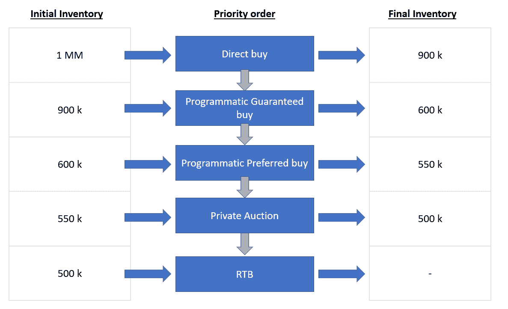

为了使整个过程成为可能，我们使用了 DSP、SSP 和 Ads 交换等技术。下面是它通常如何工作的示意图:

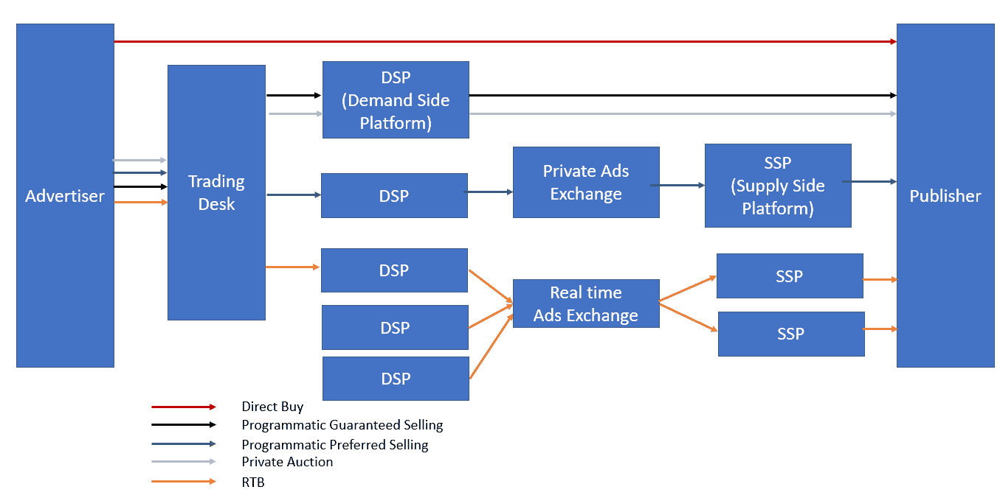

*   **DSP(需求方平台):**用于进行广告购买的软件广告主
*   **SSP(供应方平台):**用于制作可供购买的广告库存的软件广告客户
*   **Ads 交换:**DSP 和 SSP 之间的 Ads 实时交易

从图中可以清楚地看到，直接购买是在不涉及任何交易的情况下完成的。程序化保证销售是通过 DSP 向发行商进行的。如果库存在这两个选项中未售出，它将在进入 Ads 交换池之前成为首选 Ads 买方。最后，我们分别经过私人拍卖和 RTB 阶段。

Google DoubleClick Bid Manager 是一个需求方平台。然而，由于多种原因，Adwords 并不是真正的需求方平台——它将广告库存仅限于谷歌展示网络。没有程序化直接购买或私人拍卖的选项。

## 数据管理平台

数据管理平台是展示营销分析的核心。我们试着用一个例子来理解一下。首先，一个简单的概念——**再营销**是一种赢回曾经访问过你的网站但没有立即购买或询价的潜在客户的方法。你可能已经见证了亚马逊的广告在网上追随你——这就是再营销。

XYZ 公司是一家电子商务公司，希望为展示营销创造一个利基受众。他们只想为客户使用展示渠道:

*   谁在添加笔记本电脑 A 后离开了购物车
*   在过去的一年中，至少购买了 5000 美元
*   至少检查了笔记本电脑 3 次
*   应该是数据科学爱好者

这款笔记本电脑的再销售广告将提供 5%的折扣。XYZ 希望通过在广告交易中竞价来发布这些广告。XYZ 如何执行如此复杂的目标选择？

***简答——通过数据管理平台(DMP)。**T3】*

如果您想知道如何做到这一点的技术细节，请继续阅读本节。否则，你所需要知道的就是 DMP 可以使特定的目标成为可能。DMP 还提供第三方数据，如偏好、兴趣等。如果您想忽略技术细节，可以跳过本节的其余部分。

以下是幕后的真实情况:

1.  *游客来到 XYZ 网站*
2.  DMP 激发一个像素，在访问者的浏览器中放置一个 cookie(如果还没有的话)。这个 cookie 有一个特定的 ID(比如说–DMP 1)
3.  DSP 激发一个像素，并在访问者的浏览器中放置一个 cookie(如果还没有的话)。这个 cookie 有一个特定的 ID(比如 DSP1)
4.  *DMP 服务器尝试将该访问者与第三方数据进行匹配，并尽可能收集所有信息。它还带来了来自 XYZ 的第一方信息*
5.  *DMP 决定该访问者是否属于广告商定义的类别*
6.  *DMP 服务器与 DSP 服务器同步以告知 DSP(DSP 1 = DMP1 ),并且如果 DMP 1 落入在步骤#5 中找到的目标段中*
7.  现在，访问者去阅读一个博客。这个博客连接到同一个 DMP 和一个 SSP
8.  *DMP 再次激发一个像素，发现 cookie 已经出现在访问者的浏览器中(DMP1)*
9.  SSP 激发一个像素，并在访问者的浏览器中放置一个 cookie(如果还没有的话)。这个 cookie 有一个特定的 ID(比如 SSP1)
10.  *DMP 服务器与 SSP 服务器同步以映射 DSP1 = SSP1*
11.  *DMP 现在通知 DSP DSP 1 = ss P1，并要求 DSP 在拍卖中积极出价*

以上 11 个步骤发生在不到一秒钟的时间内！DMP 用于许多不同的使用情形，例如:

1.  通过向广告商和发行商提供额外的第三方信息，实现目标定位的模型构建
2.  为广告商提供寻找相似受众的解决方案
3.  压制选定的观众
4.  可用于现场个性化的第一方信息的集合
5.  再行销

## 身份解析

这是最让我着迷也最让我害怕的概念。我们已经知道，整个网络世界都在通过 cookies 跟踪访问者。饼干已经存在很长时间了。使用 cookie DoubleClick 确实可以缝合一个人物角色——例如，一个阅读 AV 博客的访问者点击了一个在线分析课程，但没有转化。同一个访问者回到另一所大学的分析课程，由于他/她被标记为分析爱好者，这所新大学通过现场优化为他/她提供了课程 20%的折扣。游客最终转化并在 60 天内完成课程。诸如此类…

所以，基本上我们知道访客的一切。还剩下什么？一个非常关键的信息，那就是，“这位访客是约翰·贝尔”。

这个新信息有什么重要的？这是个人身份信息(PII ),不会随时间而改变。Cookies 总是会被删除。但是如果我们能把这些饼干和 PII 联系起来，我们不仅有了一个能描述一小部分人的角色，而且我们直接有了一个只能描述地球上一个人的个体。

这正是身份解析所做的。让我们试着大致了解一下身份解析目前在行业中是如何工作的:

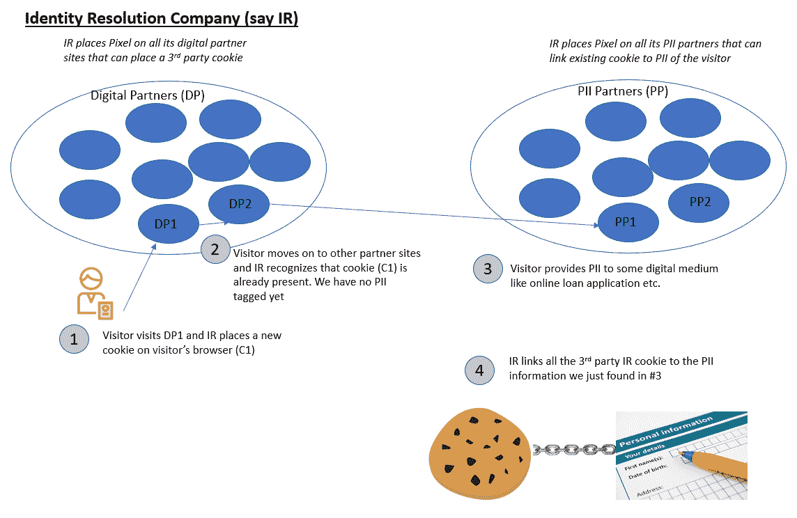

## 数字分析工具

给定所有的背景信息，现在让我们来讨论一下您可以使用的各种工具，这些工具可以处理来自多个渠道的大量数据。这些有助于您实时分析数据并实施您的策略。尽管市场上有许多解决方案，但大多数公司(无论大小)都在使用其中的一个——Google Analytics 或 Adobe Analytics。让我们通过比较几个关键属性来简要回顾一下它们:

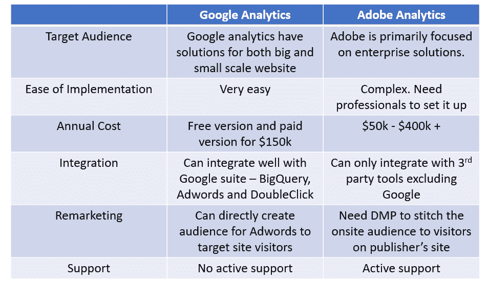

这两种工具各有利弊。如果你是一家小公司，选择谷歌分析是显而易见的。即使你是一家大公司，选择也很棘手，因为一方面 Adobe 提供积极的支持，但谷歌与管理良好的广告库存无缝集成。请注意，Adobe 也可以集成第三方工具用于广告定位，但并不是所有的工具都管理良好，可能容易受到僵尸攻击，从而浪费您的广告支出。

## 尾注

您可能已经意识到，我们在本指南中介绍的每个概念都是相互紧密联系的。全面的视图对于欣赏整个数字生态系统非常重要。相信我，不可能在一个地方找到所有这些信息。作为一名数据科学家，我们在工作中努力学习所有这些概念。所以我决定把所有的东西都放在一个地方，目的是帮助任何未来的分析师快速上手，跟上这个动态发展的行业的步伐。

借助本文提供的知识，您不仅会了解如何构建一个成功的数字分析驱动战略，还会开始欣赏您的战略如何融入更广阔的数字营销世界。这种知识的结合在业内是极其罕见的，因为大多数专业人士只关注其中的一个方面。如何在数字媒体上创建一个成功的营销活动，取决于数字生态系统、营销和分析的结合点。

### *相关*

