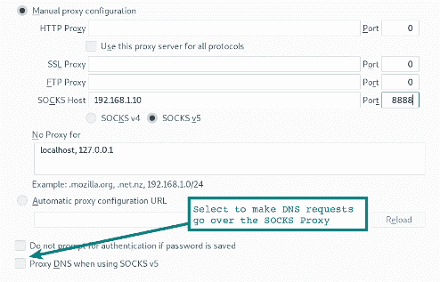

# 22 个 SSH 示例、实用技巧和隧道| HackerTarget.com

> 原文：<https://hackertarget.com/ssh-examples-tunnels/?utm_source=wanqu.co&utm_campaign=Wanqu+Daily&utm_medium=website>

实用 [SSH](https://en.wikipedia.org/wiki/Secure_Shell) 示例让你的**远程系统管理**游戏更上一层楼。不仅使用`SSH`而且掌握在网络中移动的方法的命令和提示。

知道几个`ssh`窍门，任何一个**系统管理员**、**网络工程师**或者**安全专业人士**都会受益。

*即使你是一个经验丰富的 ***nix 大师**也有几个例子只能在 [OpenSSH](https://www.openssh.com/releasenotes.html) 的更高版本中找到。看看[代理跳转 **-J**](#ssh-jump) 和[反向动态转发 **-R**](#ssh-tunnel-reverse-proxy) 。*

 *## 首先是基础知识

#### 分解 SSH 命令行

下面的`ssh`示例命令使用了连接到远程`SSH`服务器时常见的参数。

```
localhost:~$ ssh -v -p 22 -C neo@remoteserver
```

-v :打印调试信息，在调试认证问题时特别有用。可多次用于打印附加信息。
-p 22 :指定连接到远程 SSH 服务器上的**端口。 **22** 不是必需的，因为这是默认设置，但是如果任何其他端口正在监听，则使用`-p`参数连接到该端口。使用`Port 2222`格式在`sshd_config`文件中配置监听端口。
-C :使用此参数在连接上启用压缩。如果您在慢速链接上使用终端或查看大量文本，这可以加快连接速度，因为它会压缩传输的数据。
neo@ :符号 **@** 前的字符串表示通过远程服务器验证的用户名。省略**用户@** 将默认使用您当前登录的帐户的用户名(~$ whoami)。也可以用`-l`参数指定用户。
remoteserver :主机名`ssh`正在连接，这可以是一个完全合格的域名，一个 IP 地址或本地机器主机文件中的任何主机。要连接到解析为 **IPv4** 和 **IPv6** 的主机，您可以在命令行中指定参数`-4`或`-6`，以便正确解析。**

除了 remoteserver 之外，以上每个参数都是可选的。

#### 使用配置文件

虽然许多用户都熟悉`sshd_config`文件，但是还有一个用于`ssh`命令的客户机配置文件。默认为`~/.ssh/config`，但也可以通过`-F`选项指定为参数。

```
Host remoteserver
     HostName remoteserver.thematrix.io
     User neo
     Port 2112
     IdentityFile /home/test/.ssh/remoteserver.private_key

Host *
     Port 2222
```

在上面的**示例 ssh 配置**文件中，你可以看到**两个主机条目**。第一个是配置了**端口 2112** 的特定主机条目，以及自定义的身份文件和用户名。第二个是通配符值 ***** ，它将匹配所有主机。请注意，将使用找到的第一个配置选项**，因此最具体的应该在配置的顶部。更多信息可在手册页(`man ssh_config`)中找到。**

通过在任何时候与特定主机建立连接时包含高级配置快捷方式，配置文件可以节省大量输入。

#### 使用 SCP 通过 SSH 复制文件

`ssh`客户端附带了另外两个非常方便的工具，用于通过**加密的 ssh 连接**移动文件。这些命令是`scp`和`sftp`。基本用法见下面的例子。注意，`ssh`的许多参数也可以应用于这些命令。

```
localhost:~$ scp mypic.png neo@remoteserver:/media/data/mypic_2.png
```

在这个例子中，文件**mypic.png**被复制到**远程服务器**的文件系统位置**/媒体/数据**，并被重命名为 **mypic_2.png** 。

不要忘记**端口参数**的不同。这是一个每个人都在命令行上使用`scp`的陷阱。端口参数是`-P`，而不是`ssh`客户端中的`-p`。！。你会忘记的，但别担心，每个人都会忘记。

对于熟悉命令行`ftp`的人来说，许多命令在使用`sftp`时都是相似的。你可以**推**，**放**和 **ls** 到你心里渴望的地方。

```
sftp neo@remoteserver
```

## 实际例子

在许多这样的例子中，我们可以使用几种方法来获得结果。在我们所有的[教程](https://hackertarget.com/research/#tutorial)和示例命令表中，重点是完成工作的实际例子。

### 1.使用 SOCKS 的 SSH 上的代理流量

SSH 代理特性被放在第一位是有原因的。它比许多用户意识到的更强大，让你可以使用几乎任何应用程序访问远程服务器可以到达的任何系统。`ssh`客户端可以使用带有 quick one liner 的 **SOCKS** 代理服务器在连接上传输流量。需要理解的一个关键点是，到远程系统的流量将来自远程服务器。例如在网络服务器日志文件中。

```
localhost:~$ ssh -D 8888 user@remoteserver

localhost:~$ netstat -pan | grep 8888
tcp        0      0 127.0.0.1:8888       0.0.0.0:*               LISTEN      23880/ssh
```

这里，我们启动运行在 TCP 端口 8888 上的 socks 代理服务器，第二个命令检查该端口现在是否正在侦听。`127.0.0.1`表示服务只在本地主机上运行。我们可以使用稍微不同的命令来监听所有接口，包括以太网或 wifi，这将允许我们网络上的其他应用程序(浏览器或其他)连接到 **ssh socks 代理**服务。

```
localhost:~$ ssh -D 0.0.0.0:8888 user@remoteserver
```

现在我们可以配置浏览器来连接 socks 代理。在 Firefox 中选择**首选项** | **常规** | **网络设置**。添加浏览器要连接的 IP 地址和端口。



注意表单底部的选项**强制浏览器 DNS 请求也通过 socks 代理**。如果您使用代理来加密本地网络上的 web 流量，您肯定会希望选择此选项，以便 DNS 请求也通过 SSH 连接进行隧道传输。

##### 在 Chrome 上启用 Socks 代理

在启动 Chrome 时使用命令行参数将使用 **socks 代理**以及通过 socks5 代理来自浏览器的**隧道 DNS** 请求。信任但验证，使用 [tcpdump](https://hackertarget.com/tcpdump-examples/) (tcpdump 非端口 22)确认 DNS 请求不再可见。

```
localhost:~$ google-chrome --proxy-server="socks5://192.168.1.10:8888"
```

##### 通过代理使用其他应用程序

请记住，还有许多其他应用程序可以利用 **socks 代理**。网络浏览器是最受欢迎的。一些应用程序将具有使用代理的配置选项。其他人可能需要一些帮助，通过使用一个助手程序来讨论 socks 协议。这方面的一个例子是[代理链](https://github.com/haad/proxychains)。使用这个工具，我们可以通过 socks 代理使用微软 RDP。

```
localhost:~$ proxychains rdesktop $RemoteWindowsServer
```

socks 代理的配置选项是在 proxychains 配置文件中设置的。

热门提示:从 Linux 到 Windows 使用远程桌面？试试

[FreeRDP](https://github.com/FreeRDP/FreeRDP)

客户。比更现代的实现

`rdesktop`

互动更加顺畅。

##### SSH Socks 代理的用例

你在咖啡馆或酒店里，不得不使用有点粗糙的 WIFI。从我们的笔记本电脑上，我们在本地运行`ssh`代理，并使用我们本地的 Rasberry Pi 建立一个进入我们家庭网络的`ssh`隧道。使用为 SOCKS 代理配置的浏览器或其他应用程序，我们可以访问家庭网络上的任何网络服务，或者通过家庭网络连接浏览互联网。我们的笔记本电脑和家庭服务器之间的一切(通过 WIFI 和互联网到家里)都在 SSH 隧道中加密。

### 2.SSH 隧道(端口转发)

最简单的形式是，SSH 隧道在您的本地系统上打开一个端口，连接到隧道另一端的另一个端口。

```
localhost:~$ ssh  -L 9999:127.0.0.1:80 user@remoteserver
```

让我们分解一下 -L 参数。把 -L 当成本地监听方。所以在我们上面的例子中，端口 9999 正在监听本地主机，并且端口转发到 **remoteserver** 上的端口 80 ，注意 127.0.0.1 指的是远程服务器上的本地主机！

让我们更进一步。在下面的示例中，正在侦听的端口可以从本地网络中的其它主机连接到该端口。

```
localhost:~$ ssh  -L 0.0.0.0:9999:127.0.0.1:80 user@remoteserver
```

在这些例子中，我们连接的端口是一个监听 web 服务器。它也可以是代理服务器或任何其他 TCP 服务。

### 3.SSH 隧道转发到辅助远程主机

我们可以使用上面看到的相同选项，让隧道从远程服务器连接到运行在辅助系统上的**另一个服务。**

```
localhost:~$ ssh  -L 0.0.0.0:9999:10.10.10.10:80 user@remoteserver
```

在本例中，我们将隧道从 **remoteserver** 转发到运行在 10.10.10.10 上的 web 服务器。来自**remote server**->-**10 . 10 . 10**的流量**不再在 ssh 隧道**内。 **10.10.10.10** 上的 web 服务器会将 **remoteserver** 视为 web 请求的来源。

### 4.SSH 反向隧道

在这个场景中，我们希望在远程服务器上设置一个监听端口，该端口将连接回本地主机(或其他系统)上的本地端口。

```
localhost:~$ ssh -v -R 0.0.0.0:1999:127.0.0.1:902 192.168.1.100 user@remoteserver
```

随着 ssh 会话的建立，到远程服务器端口的连接将被转发到本地客户端的端口 902。

### 5.SSH 反向代理

在本例中，我们用 ssh 连接建立了一个 SOCKS 代理，但是代理在远程服务器端监听。现在，到远程 socks 代理的连接作为来自本地主机的流量从隧道中出现。**需要 OpenSSH 版本 7.6+** 。

```
localhost:~$ ssh -v -R 0.0.0.0:1999 192.168.1.100 user@remoteserver
```

##### 远程 SSH 隧道故障排除

如果您在让远程 SSH 选项工作时遇到问题，请使用`netstat`检查监听端口也连接到哪个接口。即使我们在上面的例子中指定了 **0.0.0.0** ，如果 **GatewayPorts** 在 **sshd_config** 中设置为 no，那么监听器将只绑定到 **localhost** (127.0.0.1)。

**安全警告**
注意，当你打开隧道和 socks 代理时，你可能会将内部网络资源暴露给不受信任的网络(比如互联网！).这可能是一个严重的安全风险，所以请确保您了解什么是监听，以及它可以访问什么。

### 6.通过 SSH 建立 VPN

进攻型安全团队(pentesters / red teams / etc)中的一个常见术语是转向网络。一旦在一个系统上建立了连接，该系统就成为进一步访问网络的网关点。这就是所谓的旋转，可以在网络中横向移动。

我们可以为此使用 SSH 代理，并且使用**代理链**，但是有一些限制。例如，我们不能使用原始套接字，因此 [Nmap](https://hackertarget.com/nmap-online-port-scanner/) `SYN`扫描不能用于内部网络的端口扫描。

使用这种更高级的 VPN 选项，我们将连接向下移动到第三层。然后，我们可以使用标准网络路由通过隧道路由流量。

这种技术使用`ssh`、`iptables`、`tun interfaces`和路由。

首先我们需要在`sshd_config`中设置这些选项。由于我们正在远程系统和客户端系统上进行接口更改，我们将**需要两端的 root 权限**。

```
PermitRootLogin yes
PermitTunnel yes
```

然后，我们将使用请求初始化`tun`设备的参数建立我们的`ssh`连接。

```
localhost:~# ssh -v -w any root@remoteserver
```

现在当你显示接口(`# ip a`)时，你应该有一个`tun`设备。下一步是向隧道接口添加 IP 地址。

SSH 客户端:

```
localhost:~# ip addr add 10.10.10.2/32 peer 10.10.10.10 dev tun0
localhost:~# ip tun0 up
```

SSH 服务器端:

```
remoteserver:~# ip addr add 10.10.10.10/32 peer 10.10.10.2 dev tun0
remoteserver:~# ip tun0 up
```

现在我们应该有了到另一台主机(`route -n`和`ping 10.10.10.10`)的直接路由。

现在可以通过另一端主机路由任何子网。

```
localhost:~# route add -net 10.10.10.0 netmask 255.255.255.0 dev tun0
```

在远程端，我们需要启用`ip_forward`和`iptables`。

```
remoteserver:~# echo 1 > /proc/sys/net/ipv4/ip_forward
remoteserver:~# iptables -t nat -A POSTROUTING -s 10.10.10.2 -o enp7s0 -j MASQUERADE
```

嘣！**通过 SSH 隧道实现第三层 VPN**。这才是胜利。

如果有问题，试试[和](https://hackertarget.com/tcpdump-examples/)看看哪里坏了。因为我们在第 3 层玩，我们的`icmp`包应该通过隧道跳跃。

### 7.复制您的 SSH 密钥(ssh-copy-id)

有多种方法可以实现这一点，但是这个命令是一个节省时间的快捷方式。它实际上是做什么的？该命令复制您也可以手动执行的操作。从您的系统中复制`~/.ssh/id_rsa.pub`(或默认)密钥，并将其添加到远程服务器上的`~/.ssh/authorized_keys`文件中。

```
localhost:~$ ssh-copy-id user@remoteserver
```

### 8.远程运行命令(非交互式)

`ssh`命令可以与其他命令链接在一起，以获得常见的管道乐趣。将您想要在远程主机上运行的命令作为最后一个参数用引号括起来。

```
localhost:~$ ssh remoteserver "cat /var/log/nginx/access.log" | grep badstuff.php
```

在本例中，在日志文件被推送到`ssh`会话之后，在本地系统上执行`grep`。如果文件很大，通过将管道和`grep`用双引号括起来，在远程端运行`grep`会更有效。

另一个例子执行与尖端 7 中的`ssh-copy-id`捷径相同的功能。

```
localhost:~$ cat ~/.ssh/id_rsa.pub | ssh remoteserver 'cat >> .ssh/authorized_keys'
```

### 9.Wireshark 中的远程数据包捕获和查看

我从我们的 [tcpdump 示例](https://hackertarget.com/tcpdump-examples/)中抓取了这个。使用它进行远程数据包捕获，并将结果直接输入到您的本地 Wireshark GUI 中。

```
:~$ ssh root@remoteserver 'tcpdump -c 1000 -nn -w - not port 22' | wireshark -k -i -
```

### 10.SSH 将文件夹从本地复制到远程

一个巧妙的技巧是使用`bzip2`(这是`tar`命令中的-j)压缩文件夹，然后在另一端提取`bzip2`流，在远程服务器上创建文件夹的副本。

```
localhost:~$ tar -cvj /datafolder | ssh remoteserver "tar -xj -C /datafolder"
```

**将远程文件夹复制到本地 tar 存档**

另一方面，将远程文件夹复制到本地存档。方便快速备份远程资源。

```
localhost:~$ ssh user@remoteserver "tar -jcf - /path/to/backup" > dir.tar.bz2
```

### 11.支持 SSH x11 转发的远程 GUI 应用程序

如果客户端和远程服务器都安装了 X。可以远程运行 GUI 命令，窗口显示在您的本地桌面上。这个特性从一开始就有了，但是仍然非常有用。像我在这个例子中所做的那样，运行一个远程 web 浏览器，甚至是 VMWawre 工作站控制台。

```
localhost:~$ ssh -X remoteserver vmware
```

需要`sshd_config`中的`X11Forwarding yes`。

### 12.使用 rsync 和 SSH 远程复制文件

使用`rsync`比`scp`有很多优点，如果周期性地需要备份一个目录、大量文件或者非常大的文件就应该使用它。它能够从失败的传输中恢复，并且只拷贝两个位置之间的差异，从而节省带宽和时间。

这里的例子使用了`gzip`压缩(-z)和包含递归复制的归档模式(-a)。

```
:~$ rsync -az /home/testuser/data remoteserver:backup/
```

### 13.Tor 网络上的 SSH

匿名的 **Tor 网络**可以通过使用`torsocks`命令来传输 SSH 流量。以下命令将通过 Tor 网络代理`ssh`连接。

```
localhost:~$ torsocks ssh myuntracableuser@remoteserver
```

[Torsocks](https://github.com/dgoulet/torsocks) 将使用 **localhost** 端口 **9050** 代理流量。与往常一样，在使用`tor`时，必须认真考虑了解正在隧道传输的流量以及其他**操作安全** (opsec)问题。**您的 DNS 请求去往何处**？

### 14.到 EC2 实例的 SSH

当使用 SSH 连接到 Amazon 中的 EC2 实例时，您需要使用一个私钥。下载密钥(扩展名。pem)并更改权限(`chmod 400 my-ec2-ssh-key.pem`)。将此密钥保存在安全的地方或放在您的`~/.ssh/`文件夹中。

```
localhost:~$ ssh -i ~/.ssh/my-ec2-key.pem ubuntu@my-ec2-public
```

-i 参数告诉`ssh`客户端使用这个密钥。这将是一个理想的例子，说明在连接到 ec2 主机时，在哪里使用`~/.ssh/config`来自动配置密钥的使用。

```
Host my-ec2-public
   Hostname ec2???.compute-1.amazonaws.com
   User ubuntu
   IdentityFile ~/.ssh/my-ec2-key.pem
```

### 15.通过 ssh/scp 使用 VIM 编辑文本文件

对于所有那些用户来说，这个可以节省一些时间。使用`vim`我们可以用一个命令通过`scp`编辑文件。使用这种方法在本地系统的`/tmp`中创建一个文件，然后在我们将该文件写入`vim`后将其复制回来。

```
localhost:~$ vim scp://user@remoteserver//etc/hosts
```

注意格式与常规`scp`略有不同。在主持人之后我们有一个双`//`。这引用了绝对路径。单斜杠将有一个相对于用户主目录的路径。

```
**warning** (netrw) cannot determine method (format: protocol://[user@]hostname[:port]/[path])
```

如果看到此错误，请仔细检查命令的格式。这通常意味着有语法错误。

### 16.使用 SSHFS 将远程 SSH 位置装载为本地文件夹

使用`sshfs`-`ssh`文件系统客户端，我们可以将一个本地目录挂载到一个远程位置，所有的文件交互都通过加密的`ssh`会话进行。

```
localhost:~$ apt install sshfs
```

在基于 Ubuntu 和 Debian 的系统上，我们安装`sshfs`包，然后挂载远程位置。

```
localhost:~$ sshfs user@remoteserver:/media/data ~/data/
```

### 17.使用控制路径 SSH 多路复用

默认情况下，当您已经使用`ssh`连接到一个远程服务器时，使用`ssh`或`scp`的第二个连接将建立一个新的会话，开销为认证。使用`ControlPath`选项，我们可以将现有会话用于所有后续连接。这将大大加快速度。即使在本地网络上也很明显，但在连接到远程资源时更是如此。

```
Host remoteserver
        HostName remoteserver.example.org
        ControlMaster auto
        ControlPath ~/.ssh/control/%r@%h:%p
        ControlPersist 10m
```

**控制路径**表示由新连接检查的套接字，以查看是否存在可以使用的现有`ssh`会话。上面的 **ControlPersist** 选项意味着即使在您退出终端后，现有会话仍将保持打开 10 分钟，因此如果您要在这段时间内重新连接，您将使用现有的套接字。更多信息参见`ssh_config` `man`页面。

### 18.使用 VLC + SFTP 通过 SSH 传输视频

当你需要通过网络观看视频时，`ssh`和`vlc`(视频局域网客户端)的长期用户并不总是知道这个方便的选项。使用`vlc`选项归档|打开网络流，用户可以输入位置作为`sftp://`位置。如果需要密码，将出现验证详细信息的提示。

```
sftp://remoteserver//media/uploads/myvideo.mkv
```

### 19.双因素认证

大多数读者都会理解使用**双因素认证**的价值，同样适用于你的银行或谷歌账户的好处也可以适用于你的 SSH 服务。

当然,`ssh`附带了一种双因素功能，即一个密码短语和一个 SSH 密钥。使用基于硬件的令牌或[谷歌认证应用](https://hackertarget.com/ssh-two-factor-google-authenticator/)的优势在于，它们通常来自第二个物理设备。

参见我们的 8 分钟指南，开始使用 [Google Authenticator 和 SSH](https://hackertarget.com/ssh-two-factor-google-authenticator/) 。

### 20.用 ssh 和-J 在 jump 主机间跳跃

当网络分段意味着您要跳过多个`ssh`主机才能到达最终目的网络或主机时，这种跳过主机的快捷方式可能正是您所需要的。**需要 OpenSSH 版本 7.3+** 。

```
localhost:~$ ssh -J host1,host2,host3 user@host4.internal
```

这里需要理解的一个关键点是，这与`ssh host1`然后`user@host1:~$ ssh host2`不同，`-J`跳转参数使用转发欺骗，因此**本地主机**正在与链中的下一个主机建立会话。所以在上面的例子中，我们的 **localhost** 正在与 **host4** 进行认证；意味着我们的**本地主机密钥**被使用，并且从**本地主机**到**主机 4** 的会话被**端到端加密**。

要在`ssh_config`中使用该功能，使用 **ProxyJump** 配置选项。如果您经常需要在多个主机之间跳转；使用配置文件和你的别名来`host4`将会节省你很多时间。

### 21.用 iptables 阻止 SSH 暴力攻击

任何在互联网上管理过 **SSH** 服务并查看过日志的人都会意识到每天每小时都有大量的 SSH **暴力攻击**。减少日志中噪音的一个直接方法是将 SSH 移动到一个不同于 **22** 的端口。使用**端口##** 配置选项在`sshd_config`文件中进行更改。

使用`iptables`,我们还可以阻止来自达到某个阈值的源连接到该端口的尝试。一种方法是使用 [OSSEC](https://hackertarget.com/enable-ossec-active-response/) ，因为这不仅会阻止 SSH，还会执行一系列其他基于主机的入侵检测功能(HIDS)。

### 22.在与~C 的会话中修改端口转发

最后一个`ssh`示例是在现有的`ssh`会话中动态修改端口转发。想象一下这个例子。你深陷于一个关系网中；也许您已经跳过了半打跳转主机，并且需要您工作站上的一个本地端口转发到您发现的旧 Windows 2003 系统上的 Microsoft SMB(有人是 ms08-67 吗？).

点击`enter`后，尝试在你的终端中输入`~C`。这是会话中的控制转义序列，允许对现有连接进行更改。

```
localhost:~$ ~C
ssh> -h
Commands:
      -L[bind_address:]port:host:hostport    Request local forward
      -R[bind_address:]port:host:hostport    Request remote forward
      -D[bind_address:]port                  Request dynamic forward
      -KL[bind_address:]port                 Cancel local forward
      -KR[bind_address:]port                 Cancel remote forward
      -KD[bind_address:]port                 Cancel dynamic forward
ssh> -L 1445:remote-win2k3:445
Forwarding port.
```

您可以在这里看到，我们已经将本地端口 1445 转发到我们在内部网络上找到的 **Windows 2003** 主机。现在启动`msfconsole`，我们就可以开始了(假设你计划在**上利用那个主机**)。

## 包扎

这些`ssh`例子、提示和命令旨在给你一个起点；使用`man`页面(`man ssh`、`man ssh_config`、`man sshd_config`)可以获得每个命令和功能的更多详细信息。

能够在世界上任何地方的系统上运行命令一直让我着迷。通过使用像`ssh`这样的工具来发展你的技能，无论你玩什么游戏，你都会变得更加高效。

感谢您的阅读，如果您有任何意见或建议，请使用联系表格给我留言。玩得开心！

了解你的攻击面

从 OSINT 到漏洞识别*