# 新手营销漏斗:综合指南

> 原文：<https://ahrefs.com/blog/marketing-funnels/?utm_source=wanqu.co&utm_campaign=Wanqu+Daily&utm_medium=website>

 你有一个伟大的产品或服务，但似乎没有人购买？你需要一个营销漏斗。

在 [Ahrefs](https://ahrefs.com/) ，我们已经连续三年将[的 8 位数 ARR 增长了+65%](https://entrepreneurshandbook.co/how-we-grew-our-8-figure-arr-by-65-two-years-straight-with-a-team-of-30-and-no-vc-8b28146b7960) 。

<noscript>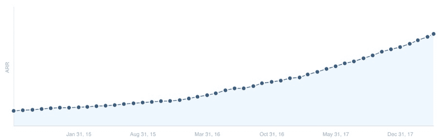</noscript>

我们 ARR 增长图。

我们是一家制造搜索引擎优化工具的 B2B 公司。然而，我们在没有销售人员的情况下做到了这一点。没有陌生电话。也没有增长黑客。

由于我们简单而有效的营销漏斗，我们的许多客户都来找我们——这是一个旨在[推动流量](https://ahrefs.com/blog/how-to-drive-traffic-to-your-website/)的系统，将人们转化为客户，并让他们爱上我们的品牌。

在这篇文章中，我将向你展示如何建立你自己的营销漏斗来获得更多的业务，而不诉诸咄咄逼人的销售策略。

在此之前，让我们看看营销漏斗是什么样子的。

## 什么是营销漏斗？

营销漏斗是一个系统，旨在吸引和转化顾客(或客户)到你的企业。

简单来说，它是如何工作的:

<noscript>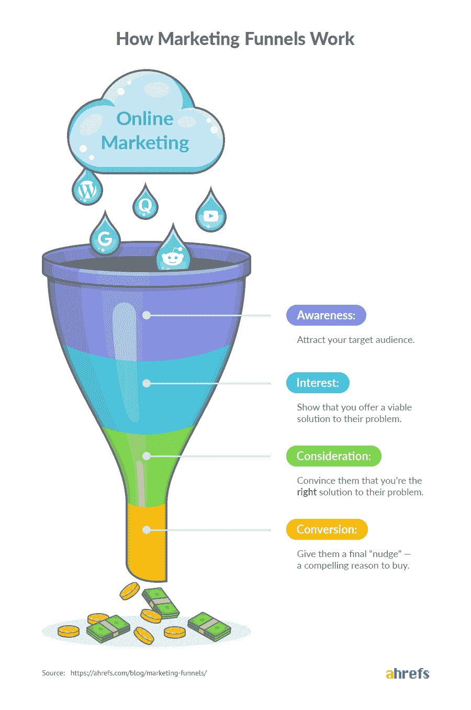</noscript>

T3】

如果你想知道为什么它是漏斗形的，那是因为有些人倾向于在漏斗的每个阶段“退出”。

我举个例子解释一下:

想象一下，你拥有一家销售头巾帽的电子商务商店。

注意:这是为跳街舞的人准备的有衬垫的帽子。

一百个人因为不戴帽子做发夹动作而掉头发。因此，他们求助于谷歌来寻找解决问题的方法。

因为你在谷歌上的排名是“头针帽”，其中有 40 个点击进入你的网站。在你的网站上，你提供 20%的折扣来换取他们的电子邮件地址。

二十个人接受了你的提议。

生活碍事，所以只有十个人用优惠券从你的店里买了一顶帽子。由于人们在每个阶段都有所下降，所以顶部(认知)总是大于底部(转化)。你可以看到数字在减少:100 -> 40 -> 20 -> 10。

这导致了漏斗形状。

听起来很简单，对吗？

营销漏斗对新手来说似乎很复杂，因为它们在最深处跳跃。他们看到一个漏斗图，上面有很多箭头和 if/else 条件，他们很难找出答案。

这里有一个例子:

<noscript>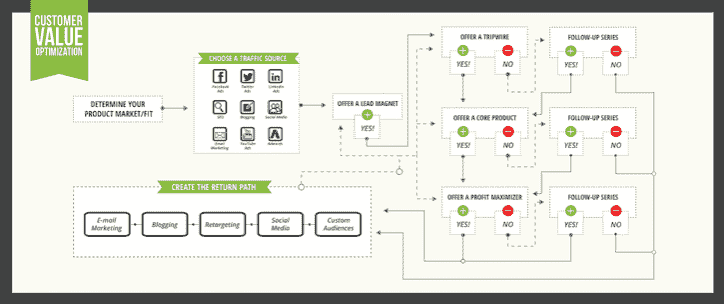</noscript>

来源:https://www . digital marketer . com/LP/training/conversion-funnel-mastery/

如你所见，这对营销漏斗新手来说太复杂了。

我们会避免的。相反，我们将讨论一个简单的版本。

现在，让我们学习如何建立自己的漏斗。

重要的

如果你没有一个优秀的产品/服务或一个愿意购买它的市场，营销漏斗无法拯救你的企业。最好把你的注意力和资源放在寻找产品/市场的契合点上。

漏斗的第一阶段是意识。这是有某个问题的人开始了解你的产品、公司或品牌的地方(因为你在某种程度上与那个问题有关)。

这可能以多种方式发生:

*   他们在[媒体](https://medium.com/@timsoulo)上读了你的一篇文章；
*   他们会听一段播客，主持人会给你一个大喊；
*   他们看到你在脸书的一个广告；
*   他们[在谷歌](https://ahrefs.com/blog/top-google-searches/)上搜索一些东西，找到你的网站；
*   他们参加一个会议，其中一个发言者提到了你；
*   他们在 YouTube 上观看了你的一个视频。

不管是什么，他们现在知道你的存在了。事实上，如果问题让他们感到足够沮丧，少数人(可能小于 1%)甚至可能马上成为顾客或客户。

其余的呢？大概不会。

不过没关系。由于他们现在对你很熟悉，他们会在心里记下你的品牌与他们遇到的问题有关。这就是营销人员的用武之地。

你的工作就是多谈谈这个问题。提高对该问题的认识。说服这些人，这很重要，应该处理和解决。教育他们如何解决。将问题与你的品牌、产品或服务联系起来。

在这个过程中，你要让尽可能多的人了解你。

要做到这一点，你必须广撒网。如果可能的话，你应该出现在所有可能的营销渠道中。

如果没有，至少，你应该出现在你的客户出没的主要渠道。

### a)谷歌

你有问题。你去哪里寻找你的答案？

很可能是谷歌。

你的顾客是一样的。如果他们有问题，他们会谷歌一下。如果他们需要答案，他们会谷歌一下。

统计数据也证明了这一点。谷歌每天处理大约 35 亿次搜索。它占据了超过 90%的搜索引擎市场。

在 Ahrefs，大多数顾客都是这样发现我们的。

我们在 Ahrefs 的博客上发布内容。这些帖子在谷歌排名很好。人们搜索相关术语，找到我们的内容并阅读它。他们在心理上认为我们与[数字营销](https://ahrefs.com/blog/digital-marketing-strategies/)有关。如果他们在未来寻找与数字营销相关的内容，他们可能会想到我们，这要归功于[的曝光效应](https://en.wikipedia.org/wiki/Mere-exposure_effect)。

我们的流程是什么？

我们做关键词研究。我们使用自己的工具——[关键词浏览器](https://ahrefs.com/keywords-explorer)——找到目标客户正在搜索的相关主题。在这个阶段，因为我们希望接触到尽可能多的人，所以我们经常瞄准更广泛的主题，如“营销漏斗”

我们深入搜索引擎优化指标，以确保我们写的每一篇文章都有潜在的搜索流量。然后，我们遵循我们的 [8 步 SEO 内容公式](https://ahrefs.com/blog/seo-content/)，以确保每篇文章排名尽可能好。

<noscript>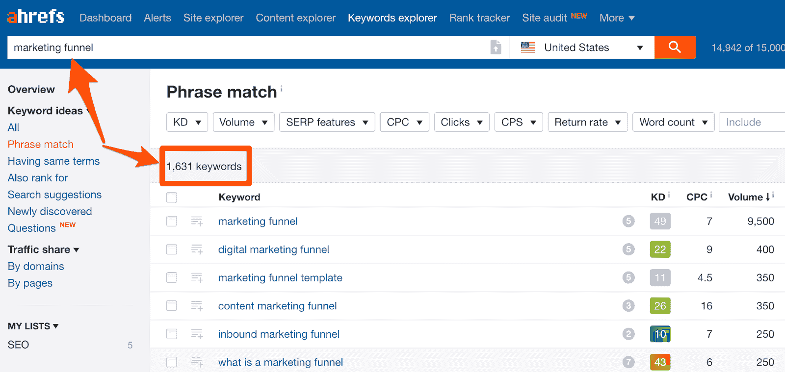</noscript>

Ahrefs 的[关键词浏览器](https://ahrefs.com/keywords-explorer)中种子关键词“营销漏斗”的约 1，631 个关键词创意

对你来说，过程可能不一样。但是你仍然需要关键词研究。因此，这里有一个[关键词研究框架](https://ahrefs.com/blog/keyword-research/)，你可以根据你的需求、资源和行业进行高度调整。

你不一定需要 Ahrefs 来做我们做的事情(即使那是我们用的。)有很多免费的 SEO 工具。我们在这里展示了大量的照片。挑选一个或几个，开始你的 [SEO 进程](https://ahrefs.com/blog/seo-process/)。

### b) YouTube

突击测验:

世界第二大搜索引擎是什么？

如果你猜的是 YouTube，你答对了！

旁站。

谷歌图片比 YouTube 更受欢迎。然而，在我看来，谷歌图片属于谷歌的保护伞，当然，谷歌是最受欢迎的搜索引擎。

我们都知道 YouTube。这是一种文化现象。它改变了我们的生活。过去，我们不得不抢着看 DVD。现在，数百万个视频只需点击一下鼠标。

然而，有趣的是:尽管 YouTube 自 2005 年就已经存在，但营销人员仍在讨论视频营销，就好像它是新事物一样。这里的[被描述为 2019 年跟随](https://www.singlegrain.com/digital-marketing/11-digital-marketing-trends-you-can-no-longer-ignore-in-2018/)的营销趋势。

尽管拥有 10 亿用户，YouTube 仍然被企业忽视。

你应该在那里。

在 Ahrefs，YouTube 也是人们发现我们的主要途径之一。截至今天，我们已经积累了 32，000 名订户，在我们的 YouTube 频道上获得了约 200 万次观看。

<noscript>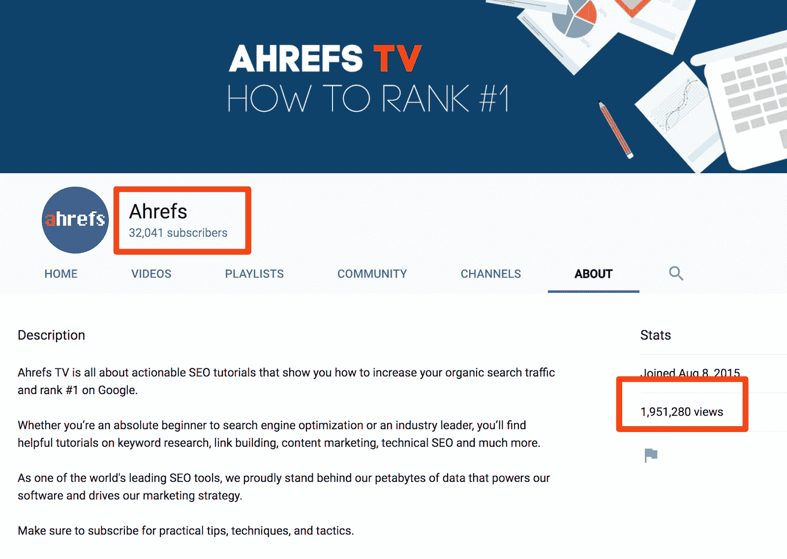</noscript>

T3】

YouTube 的流程与谷歌相同。我们进行关键词研究，以确定我们应该创造什么，然后制作高质量、可操作的视频，在 YouTube 上排名。

结果呢？我们的一个以关键词为中心的视频在大约 5 个月内获得了 40K+的浏览量！

<noscript>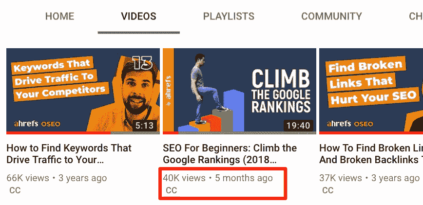</noscript>

T3】

### c)在线社区

谷歌很棒。对于世界上几乎任何问题，谷歌都有答案。

但是，如果你有一个问题，你需要一个个性化的，细致入微的答案呢？如果是一个没有明确答案的问题，而你只是想说说呢？

进入:在线社区。

在线社区(Reddit、[脸书集团](https://ahrefs.com/blog/facebook-seo-groups/)、 [Slack 社区](https://ahrefs.com/blog/seo-slack-communities/)等。)是有共同兴趣的人聚集的地方。在这里，他们讨论相关话题，提出问题，分享问题，戏谑和交朋友。此外，每个可以想象的话题都有一个社区。

如果你想接触到你的目标受众，没有比这更好的地方了。其中一些网站每月接待数百万的访问者，你可以把他们带到你的网站。

比如 Reddit 接收[140 亿次页面浏览量(！)每月](https://www.redditinc.com/):

<noscript>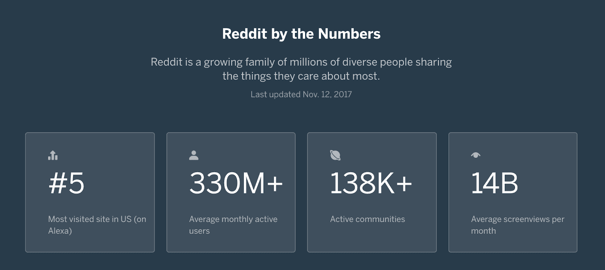</noscript>

T3】

在 Ahrefs，我们了解这些社区的力量。这就是我们定期分享技巧并参与讨论的原因。例如，我在 Quora 上相当活跃，在那里我回答与营销相关的问题:

<noscript></noscript>

T3】

虽然对于在线社区来说没有放之四海而皆准的策略，但有几条原则是适用的:

*   阅读规则并遵守它们。每个社区都有自己的规则。找出它们是什么，并观察它们。藐视规则会让你被踢出去，甚至更糟，被禁止。
*   **加值**。没有人喜欢一个只会推销和硬推销的社区成员。
*   **参与和贡献。当你证明自己是团队中有价值的一员时，人们更有可能相信你说的话。**
*   不要发垃圾邮件。不要只是进入一个群，丢下一个你网站的链接就离开。这会让你比说“营销漏斗”还快被封杀

一旦团队将你视为有价值的成员，你就可以开始温和地推广你的品牌、产品或服务。

### d)其他人的受众

你所在行业的一些人已经拥有了一大批忠实的读者、听众和观众。

为什么不利用这一点呢？

通过与这些“影响者”合作，你可以将你的品牌、产品或信息展示给一群全新的人。

想想看:有影响力的人已经从有价值的内容中建立了受众。创造有价值的内容是困难的。如果你能让有影响力的人相信你能提供很棒的内容，他们会很乐意把你介绍给他们的观众。

这是我们在 Ahrefs 推行的战略。我们的首席营销官 Tim 定期出现在播客上:

<noscript></noscript>

T3】

播客的出现并不是唯一的出路。你可以出现在网上研讨会上，出席会议，[成为电子邮件简讯的客座编辑](https://us3.campaign-archive.com/?u=bef9184a01d1b7f05e7155972&id=e645df4520)，或者[客座博客](https://ahrefs.com/blog/guest-blogging/)。你希望如何与有影响力的人合作取决于你。

无论哪种方式，首先[建立一个你希望与之合作的影响者的名单](https://ahrefs.com/blog/blogger-outreach/)，然后[找到他们的电子邮件地址](https://ahrefs.com/blog/find-email-address/)。接下来，发送一封[个性化拓展邮件](https://ahrefs.com/blog/outreach/)，看看他们是否愿意与你合作。向他们展示对他们有什么好处，你成功的机会将会大增。

漏斗的第二阶段是*兴趣*。

在这个阶段，你的潜在客户已经“上钩”了他们已经消费了您的内容，现在他们想了解更多。他们想更深入地研究这个课题。

很有可能，他们会开始:

*   通过使用更多特定的谷歌查询来改进他们的搜索。例如，不是搜索“[如何推广你的网站](https://ahrefs.com/blog/how-to-promote-your-website/)”，他们可能会开始寻找搜索引擎优化特定的术语，如“链接建设”和“网页搜索引擎优化”；
*   寻找专家和有影响力的人跟随。例如，他们可能会寻找“[最佳搜索引擎优化博客](https://ahrefs.com/blog/seo-blogs/)”或“[最佳搜索引擎优化播客](https://ahrefs.com/blog/best-seo-podcasts/)”，以快速了解搜索领域正在发生的事情。

因此，你在这里的工作是双重的:

*   对这些特定的搜索查询进行排名，以便他们找到您的内容；
*   成为他们想追随和学习的专家。

总而言之，你要通过展示你的产品或服务如何解决他们的问题，轻轻地推动他们进入下一阶段。

这里有几种方法可以做到这一点:

### a)对具有高商业潜力的主题进行排名

在早期阶段，你的客户有一个问题。这个问题范围更广，定义更少。

例如，如果他们正在经营一项业务，他们不会寻找搜索引擎优化。他们的问题是“流量不够”因此，他们正在寻找改善这种状况的方法。他们正在搜索[营销创意](https://ahrefs.com/blog/marketing-ideas/)或[数字营销技巧](https://ahrefs.com/blog/marketing-tips/)。

但是，一旦他们过了意识阶段(在阅读了我们或其他人的大量内容后)，他们就会开始以不同的方式思考。他们知道自己想要有机流量，也知道获取的途径是 SEO。

他们开始进行更具体的搜索。

他们开始寻找像“如何获得反向链接”或“如何做关键字研究”这样的术语。他们想要的不是随机的营销想法，而是具体的搜索引擎优化技巧。

对我们来说，这些术语具有很高的商业潜力。

它们不仅与我们的业务相关，而且也是我们的产品解决的问题。

我们的目标是为他们排名。

记住:在这个阶段，你的工作是慢慢地把他们推进到下一个阶段。是的，你应该教他们如何解决问题。但是你也应该告诉他们如何使用你的产品或服务来解决他们的问题。

想想吧。他们唯一关心的是结果——问题是否得到解决。如果你的产品真的有助于解决这个问题，你不提它会给他们带来伤害。

因此，在教他们如何解决问题的同时，展示你的产品使问题变得多么简单。

这就是我们在 Ahrefs 所做的。

这里有一个例子。我们有一个叫做[站点审计](https://ahrefs.com/site-audit)的工具。网站审计抓取，分析和监控您的网站超过 100 现场技术搜索引擎优化问题。

人们面临的一个问题是学习如何对他们的网站进行搜索引擎优化审计。因此，我们决定[创作一篇文章](https://ahrefs.com/blog/seo-audit/)，教他们如何做，并向他们展示我们的工具使之变得多么简单:

<noscript></noscript>

T3】

我们分享了如何进行搜索引擎优化审计的技巧，以及网站审计如何使其变得更加容易。

这篇文章在谷歌的排名也很好:

<noscript>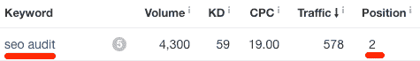</noscript>

T3】

作为我们的首席营销官，[蒂姆·索罗](https://ahrefs.com/tim)曾经告诉我:

> *“我的理论是，人们不会注册你的[产品]，然后学习如何使用它。事实上恰恰相反。他们首先学习如何使用你的[产品]，他们注册是因为他们已经* **知道如何使用**。

### b)让他们跟着你

他们已经消费了你的内容。他们认为它很有价值。他们从中受益。

干得好！但这还没有结束。他们可能是你的粉丝，但还不是顾客。

也许他们对你的产品有一些异议，而你没有设法解决。也许他们还不明白如何正确使用你的产品。

不管是什么原因，你在这个阶段的工作就是让他们跟随你。这给了你更多的机会来解决他们的一些异议。

他们应该跟踪你到哪里？

这个完全取决于你所在的行业。如果你的定位更侧重于社交媒体，你可能希望他们在 Twitter 或 Instagram 上关注你。如果你在 YouTube 上制作内容，那么你可能希望他们订阅你的频道，如果你写博客，那么你可能希望他们注册你的电子邮件列表。

无论你使用哪种渠道，都要发出号召，提醒他们喜欢、订阅、关注或注册。

这里有一个来自我们博客的例子:

<noscript></noscript>

T3】

在 Ahrefs，我们为他们提供多个接触点来跟踪我们。他们中的一些人注册了我们的电子邮件通讯。有些人订阅了我们的 YouTube 频道。他们中的许多人是我们 [Ahrefs Insider](https://www.facebook.com/groups/ahrefsinsider/) 脸书集团的成员。他们中的一些人在推特上关注我们，我们的一些粉丝也在推特上关注蒂姆！

这些接触点让我们能够与粉丝交流，了解他们的需求。这也让我们有机会沿着漏斗移动他们，更接近销售。

漏斗的第三阶段是考虑。

在这个阶段，你的潜在客户知道问题所在。他们知道解决办法。他们知道您可以为他们提供解决方案。

有一个条件。

他们知道你能做什么，知道你如何帮助他们，并不意味着他们会选择你。机会是:有大量可能的解决方案供他们选择。

他们会寻找替代方案。如果是大件物品，尤其如此。

想想看:了解 iPhone 的一切并不一定意味着你会选择它而不是谷歌 Pixel 3 或三星 S9。

因此，你在这里的工作就是让他们相信你是这份工作的合适人选、合适产品或合适公司。

你是怎么做到的？

### a)帮助你的潜在客户发现他们为什么应该选择你

你给了他们解决问题的建议。你甚至向他们展示如何使用你的产品做到这一点。

但是，你是唯一能提供这种价值的产品或服务吗？

如果你的答案是肯定的，那么恭喜你！你有独特的销售主张(USP)。但是你可能不是他们唯一想要的产品或服务。

所以你需要帮助你的潜在客户发现为什么你是那个人。

在 Ahrefs，我们最引以为豪的是我们的[大数据](https://ahrefs.com/big-data)。我们的工具由它驱动。这就是我们的产品如此独特的原因。

所以，我们炫耀它。

我们使用我们的数据进行搜索引擎优化研究，比如这篇关于 91%的内容如何获得零搜索流量的文章。这有助于巩固我们有一个巨大的数据库的想法(事实上我们有)。我们关于 [SEO 指标](https://ahrefs.com/blog/seo-metrics/)的博文是展示我们数据和指标准确性的一种方式。

此外，由于我们的数据，我们在第三方平台上获得评论(这些是我们的潜在客户在购买前检查的地方):

<noscript>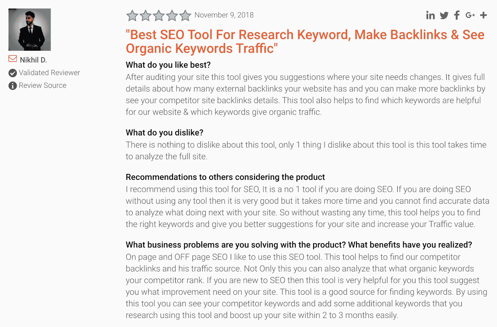</noscript>

T3】

最重要的是，我们的用户会定期撰写非常详细、深入的文章(如[这篇](https://www.gotchseo.com/ahrefs/)和[这篇](https://www.robbierichards.com/seo/ahrefs-review/))，介绍如何使用 Ahrefs 以及为什么我们是这项工作的最佳工具。这些不带偏见的客户评价在说服潜在客户购买方面最为有效。

### b)支配类似“最佳”、“顶级”和“vs”的修饰关键字的 SERPs

假设你打算购买一部新手机。除了品牌忠诚度，你会怎么做？

你会比较产品。你会阅读评论。

你可以去谷歌，输入“iPhone XR vs Samsung S9”这样的术语，看看其他人怎么说。或者，如果你不知所措，你可能会寻找“2018 年最佳智能手机”，并看到最新的建议。

你的顾客也会这样做。

这就是为什么您应该尝试使用像“vs”、“best”和“top”这样的修饰词来主导搜索查询的 SERPs。

您可以通过使用 [Ahrefs 关键字浏览器](https://ahrefs.com/keywords-explorer/)中的“包含”功能添加“vs”、“best”和“top”来轻松实现这一点:

<noscript></noscript>

T3】

在 Ahrefs，我们知道潜在客户会通过搜索“Ahrefs vs _____”等术语将我们与竞争对手进行比较

虽然我们不做比较文章(作为一个原则问题)，但我们确实会发表博客文章，谈论我们的独特之处。这有助于展示我们与竞争对手的不同之处。

### c)设计一个培养序列，促使他们选择你

他们在跟踪你。但他们还是不买账。

那么，你如何继续推动他们进行销售呢？

考虑创建一个培养序列。通常以电子邮件为基础，培育序列是一系列专门设计来解释你为什么与众不同，为什么他们应该从你这里购买，并让他们做好购买的准备。

创造这个序列的最好方法是把它想象成一部电影。像任何好故事一样，电影有一个优点:

**叙述。**

简而言之:它是你试图传达的最重要的信息或故事。例如,《魔戒团契》实际上是关于佛罗多克服一切困难摧毁魔戒的故事。

同样，你的序列需要有一个“北极星”——一个指导性的叙述。这种叙事的选择取决于你。通过叙述，你可以创造出序列中的每一个元素。这通常是单独的电子邮件。

创建电子邮件序列时，确保每封电子邮件从一封到另一封的逻辑流程。

如果你被卡住了，这里有一些电子邮件的想法，你可以用来建立序列:

*   介绍一个新的想法或概念(例如，如果他们在草地、红土和硬地比赛，他们需要不同的鞋子)；
*   教他们一些与你的产品相关的东西(例如，关于网球鞋、网球步法等的东西。);
*   宣布一些关于你的产品的事情(例如，一双新鞋的发布)；
*   展示你的产品的价值(例如，告诉他们你的网球鞋是专门为防止像扭伤脚踝这样的常见伤害而制作的——当然，如果这是真的)；
*   讲述一个关于你为什么做某事的大故事(例如，你为什么要开一家网球鞋店)；
*   回答常见的问题或异议；
*   将您的产品/服务与竞争对手的产品/服务进行比较。

虽然电子邮件是最常见的方法，但它不一定是唯一的方法。如果你是一家服务企业，你可以免费拨打咨询电话。如果是复杂的产品，你可以让他们和你一起参加网上研讨会。

在 Ahrefs，我们没有电子邮件序列。相反，我们有商业博客。

商业博客是一门在线课程，教你如何获得更多的搜索流量和客户。好的一面是:你可以从课程中获得大量有价值的见解，而无需使用 Ahrefs。但是你会看到有了我们的工具，策略变得简单多了。

漏斗的第四个阶段是转化。你的潜在客户*几乎*确信**你是他们问题的正确解决方案**。

你所要做的就是给他们一个最后的“推动”——一个让他们现在点击“购买”的令人信服的理由。

在 Ahrefs，我们通过提供 [Ahrefs 网站管理员工具](https://ahrefs.com/webmaster-tools)让这变得简单。通过注册，潜在客户可以测试我们在教程中提到的所有功能。

对你来说，可能会有所不同。在这里你可以做很多事情，比如:

*   利用紧迫性。如果一个产品很快就要断货了，你可以委婉地提醒他们。(这个请不要造假！);
*   确保结账体验流畅轻松；
*   向他们提供折扣以说服他们购买(顺便说一句，这不是我们鼓励或使用的策略！[阅读这篇文章](https://blog.close.io/b2b-sales-discounts)找出原因。)

如果购买体验令人愉快，你的潜在客户会很乐意购买。

转换阶段也是包含一些追加销售的好时机。本质上，追加销售是向客户销售他们已经购买的产品的附加产品。

当你从 Apple Store 购买 MacBook 时，他们会问你是否需要 AppleCare。那是促销。当你在麦当劳买一顿饭，他们问你是否想扩大你的饭量，这就是促销。

坦率地说，追加销售不是我们在 Ahrefs 追求的战略。因此，如果你想了解更多关于追加销售以及如何在道德上包括它，这里有一个关于这个的[伟大指南。](https://blog.close.io/b2b-sales-discounts)

## 如何堵住你营销漏斗中的漏洞

所有营销渠道都有漏洞。这是他们的天性。漏斗形就是这样形成的。

有些人不感兴趣。有些人永远不会买。

因此，一定程度的“泄漏”是正常的。

你应该担心的是“过度泄漏”。当漏斗的一个阶段(如认知)远大于下一个阶段(如兴趣)时，就会出现过度泄漏。

看起来是这样的:

<noscript>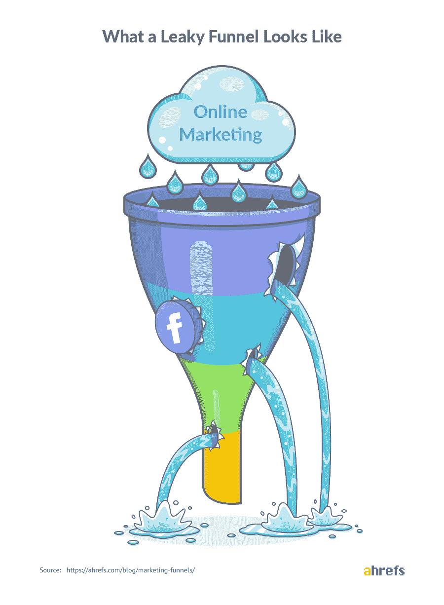</noscript>

T3】

幸运的是，修复过度泄漏并不像你想象的那么困难。(上图有线索！)

你已经有了一个好的开始。有了漏斗，就更容易诊断哪里发生了过量泄漏。

你可以这样做:

在构建漏斗时，您应该为每个阶段分配一些指标。

*   **认知度:**访问网站的人数；
*   **兴趣:**邮件列表报名人数；
*   **考虑:**邮件序列的点击率(CTR)；
*   **转化:**购买其产品的人数。

开始测量它们。

您可以逐月比较这些指标。如果你注意到数量急剧下降，这意味着你有问题。

虽然您可能不会立即知道问题是什么，但这些数字让您可以轻松地开始。您可以直接找出原因(例如，季节性、来自一个频道的流量下降、关键字排名丢失等)。)

从那里，你可以修复它。

要启动这一过程，请在漏斗的所有阶段应用这两大策略:

### a)重定目标

想象你刚刚发了一堆关于“网球鞋怎么洗”的付费流量到你的帖子里。

让你感到恐惧的是，这些人仅仅是读了这篇文章就离开了。他们没有买任何东西，也没有选择下载你的免费电子书《擦得亮亮的干净网球鞋的 9 个小技巧》。

嗯，看起来你唯一要洗的东西是 1000 美元……就在下水道里！

但如果我说你有另一个机会来改变这些人呢？

这正是**重定目标所做的**。

重定向是在线广告的一种形式，允许你锁定已经离开你网站的访问者。这让你有机会说服游客回来重新考虑购买。

它是如何工作的？

你可以在你的网站上安装一些 JavaScript 代码(也称为像素)。这个像素将在访问者的浏览器中放置一个匿名 cookie。当访问者离开您的网站并开始浏览其他网页时，cookie 允许您的广告平台向他们显示您的广告。

获取像素很容易。大多数主流广告平台(脸书、谷歌、Quora 等。)允许您生成一个像素，您可以将它添加到网站的``部分。

<noscript>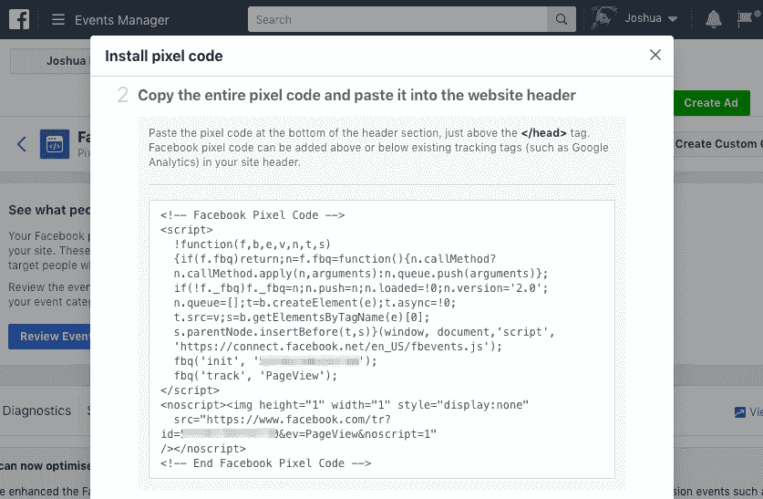</noscript>

脸书像素安装页面

然而，知道提供什么作为重定目标的一部分是具有挑战性的部分。幸运的是，有了营销漏斗，这也很容易解决。

了解你的客户在哪里下车，并根据你的漏斗的下一个阶段的报价重新定位他们。

例如，如果你在你的网站上看到很多流量，但没有人转换到你的电子邮件列表，你可以通过提供加入你的列表来重新营销他们。把他们发送到一个登陆页面，在那里他们可以下载你的免费电子书，因为他们第一次就错过了！

一旦你熟悉营销渠道和重新定位，你也可以在渠道的每个阶段建立重新定位活动，并为下一阶段提供相关的优惠。

### b)实时聊天

有时候，人们离开是因为他们找不到问题的答案。

他们可能正在阅读您的内容，并希望对某些部分进行澄清。或者，他们可能会查看您的定价页面，并对购买过程提出一些问题。

如果他们找不到这些问题的答案，他们会离开去寻找不同的解决方案。

实时聊天解决了上述所有问题。

潜在客户在你的营销漏斗中的位置并不重要。实时聊天允许您回答任何迫切的问题，同时温和地引导他们进入下一阶段。

使用像[对讲机](https://intercom.com/)(我们在 Ahrefs 使用的[)这样的工具，你还可以相应地对他们进行细分，并向他们发送自动消息，鼓励他们进入下一步！](https://ahrefs.com/blog/marketing-tools/)

(你甚至可以附上报价，就像你在重定目标时做的那样。)

<noscript></noscript>

T3】

## 最后的想法

我希望这篇文章已经清楚地解释了什么是营销漏斗以及它们是如何工作的。

如果你还没有营销漏斗，是时候开始建立一个了。从一小步一小步开始，集中精力做一个简单的漏斗，解决问题，发现成长的机会。

之后，你可以考虑在传统漏斗之外进行更多阶段的扩展，比如保留和宣传。例如，你可能会决定创建一个美妙的入职体验或一个[仅限客户的社区](https://www.facebook.com/groups/ahrefsinsider/)，鼓励讨论并在需要时提供帮助。

记住:这不仅仅是获得新客户。你想鼓励他们忠诚，并推荐他们所有的朋友。