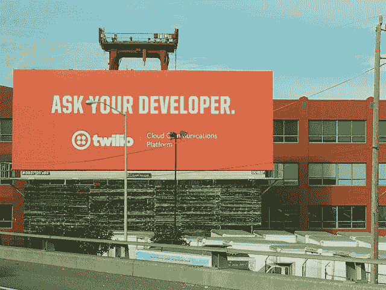
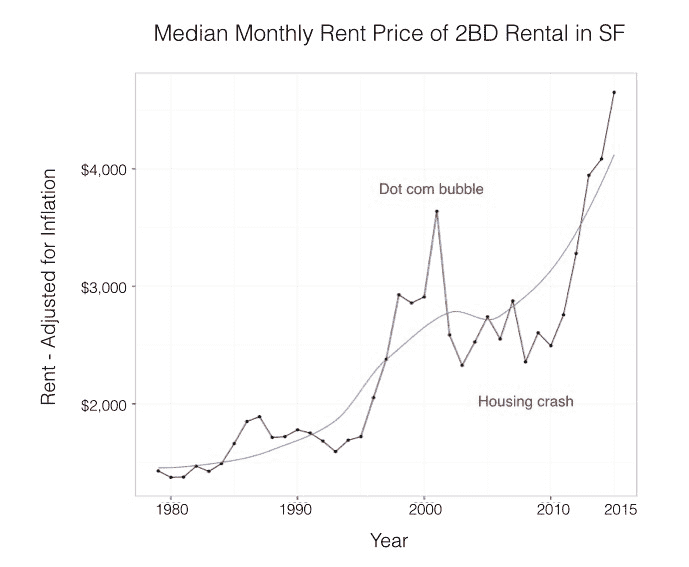
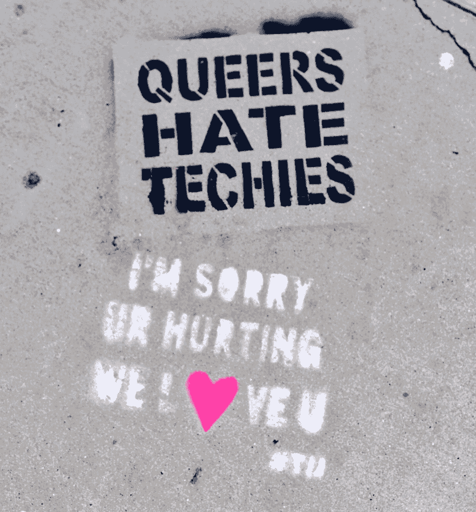
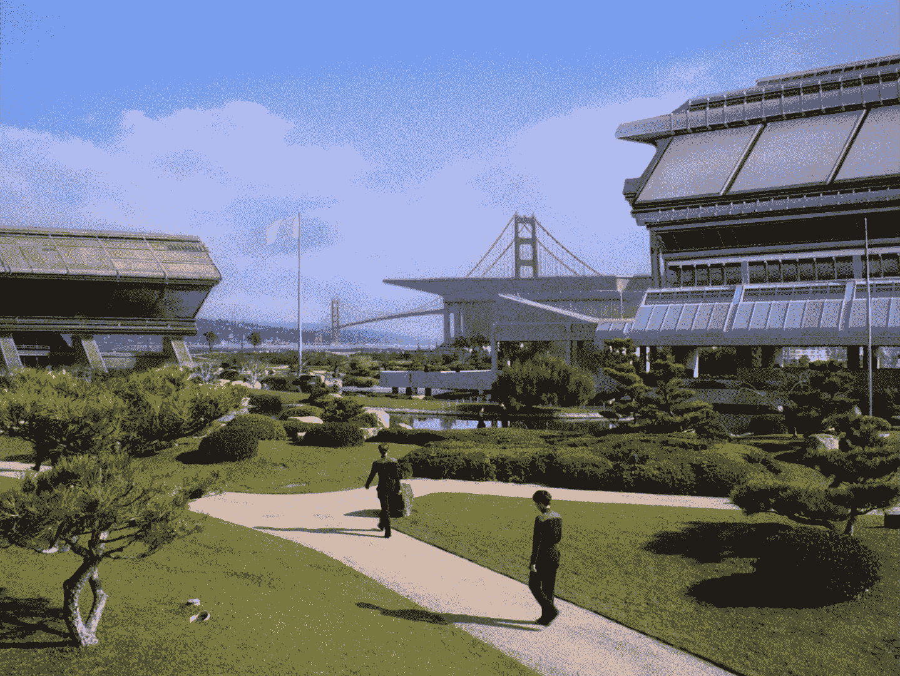

# 在旧金山当了一年软件工程师

> 原文：<https://evertpot.com/a-look-back-at-sf/?utm_source=wanqu.co&utm_campaign=Wanqu+Daily&utm_medium=website>

2017 年，我在多伦多工作的公司被 Yelp 收购了。我公司的软件工程师(包括我自己)被要求搬到旧金山。2017 年底我们搬家了，我在那里度过了 2018 年的大部分时间。随着一年即将结束，我想这可能是一个很好的时间来反思我在那里的时间。

作为一名软件工程师，人们经常认为你还没有真正达到顶峰，除非你在旧金山湾区工作。我不同意这种想法，但很容易看出为什么有些人会有这种感觉。

在我第一次去旧金山的时候，这已经很能说明问题了。从多伦多机场起飞时，我注意到了比平常更高的科技主题 t 恤、笔记本电脑上的贴纸和黑色终端。相当刺激！一次偶然的机会，我去市区的优步司机告诉我，他正在申请谷歌提供的免费机器学习课程。在路上我注意到高速公路旁边的广告牌是直接针对开发商的。

[T2】](https://flic.kr/p/BhbaZE)

旧金山感觉像是科技的麦加，也是资本主义的中心。有很多钱，但没有很多财富。工资是我见过的最高的，但生活费用也是。

作为一名软件工程师，这或多或少是公平的(与多伦多相比，我在那里生活和工作了很长时间)，但如果你不在这个行业，这就很难了。

在我搬到旧金山之前，我从未想过要搬到旧金山湾区。这不是我的目标。但当机会出现时，我们觉得为了这次旅行是值得的，我们真的不想降低我们的生活水平，我们想要一个两居室的公寓和一个合理的通勤。最终这意味着我们的房租是每月 4250 美元，而且我们工资的很大一部分都花在了房租上。如果我们住得久一点，我们肯定会想办法找一个更便宜的地方住，存更多的钱。

 

Median Montly Rent Price of 2BD Rental. ([source](https://medium.com/@mccannatron/1979-to-2015-average-rent-in-san-francisco-33aaea22de0e)).

你可以想象在这样的价格下，很多人很难在旧金山生活。在过去的 30 年里，生活成本激增，许多人将此归咎于科技行业。

时不时地，你会面对这样一个事实:有人[‘讨厌我们’](https://twitter.com/EricZ_FamilyMan/status/745850889466953729/photo/1)。以谷歌通勤巴士遭遇的[攻击为例。](https://gizmodo.com/apple-google-reroute-employee-buses-after-series-of-at-1822182686)

 

Grafiti on the street in Mission District

就我个人而言，我可以强调这种情绪。尽管我不认为谷歌巴士中 20 多岁的程序员应该对这种差异负责，但无品牌的谷歌巴士是新阶级制度的有力象征。

我从未见过如此多的贫困和无家可归。在许多主要街道上，穿平底鞋是绝对不允许的，因为用过的针头随处可见。看到人们在市场街上注射毒品是很正常的。

我觉得这不一定是坏事。我想，在许多城市，这种成瘾和贫困可能更多地局限于某些街区。如果你没看到它，假装它不存在要容易得多。科幻小说中的一线希望是有很多地方可以安全地吸毒。

但这是一个奇怪的并列。有时我们的工程团队会在芳草地花园吃午饭，如果你朝一个方向看，你会看到电动滑板车和 T2 独轮车飞驰而过，这让我想起了《星际迷航》中有星际舰队学院的那集。我不是一个愤世嫉俗的人，这感觉像是一个未来的地方。但是，从另一个角度看，你可能会看到有人在街上大便。这绝对不是夸张。三藩市有[便便问题](https://www.theguardian.com/commentisfree/2018/aug/18/san-francisco-poop-problem-inequality-homelessness)。

?file=Starfleet_Academy,_2368.jpg) 

Starfleet Academy

科技行业的一些人对此感到非常糟糕，其他人则是完全没有同理心的反社会分子，[高兴地传播](http://valleywag.gawker.com/happy-holidays-startup-ceo-complains-sf-is-full-of-hum-1481067192)他们的真实感受(那个特定的人在他的评论产生影响后翻开了新的一页，但这篇文章值得一读，以了解不同的人对此的看法)。

当我第一次搬到旧金山时，我的一个朋友在电话中告诉我“大约需要 1-2 个月才能不再真正看到无家可归者”。虽然他不是字面上的意思，但我采访过的大多数人在旧金山住了一段时间后都适应了无家可归的问题，并形成了一种认知失调。对我来说，最初的震惊在一段时间后逐渐消失，它变成了生活的事实。偶尔，当特别令人震惊的事情发生在你面前时，你会被拉回现实。与朋友分享这些事件通常会导致人们评论一切是多么荒谬，或者人们分享他们自己最近的轶事。

在那里的时候，我花了很多时间思考这种情况下的道德问题，以及我的责任是什么。事实是，除了为那些问我要三明治的人买了几个三明治，我几乎什么都没做，为此我觉得自己像个伪君子。

我在荷兰的一个小镇长大。人口 6000。我从小就认为我会是那种当有人寻求帮助时会伸出援手的人，但我慢慢发现我实际上不是那种人。有一次我看到一个家伙躺在街上，旁边是他的轮椅。他看起来很困惑，可能很兴奋，我没有问他是否需要帮助。我有地方要去。我明白了对和我最相似的人产生共鸣是最容易的，因为我能和他们产生共鸣。如果你有精神问题，表现出任何“奇怪”的行为，我只会做出“战斗或逃跑”的反应，不会考虑建立联系。

对我来说，有更安全的方式来做贡献，但我也没有这样做。我没有捐赠或志愿做任何事。我有时证明这一点的方式是，我的大多数同龄人也不这样做，如果我不这样做，也不会使我成为一个坏人。其他时候我只是觉得自己像个伪君子。我 99%的同情心都给了我认识的人。

现在是 2019 年，我们离开了旧金山。Yelp 不是我希望的那样。我听起来对旧金山持否定态度，但事实是我真的很喜欢这个城市。尽管它有很多缺点，但我在那里过得很愉快，交了一些非常好的朋友和回忆。我在下一份工作的工作签证上遇到了一些问题，这让我回到了多伦多。如果不是因为我的签证问题，我们可能会留在旧金山。

这很有趣，因为我负担得起，也因为我是受益于这一制度的那一类人。我不禁想知道，硅谷和湾区如此繁荣的唯一原因是因为在这个国家，人们通常对拥有如此多的财富感到舒适，但却有如此多的人生活在贫困线以下。

因此，如果你是一名软件工程师，并考虑搬到湾区，你可能会有一个很好的时机。就我而言，我为 Yelp 工作，看起来他们在福利、多样性、薪酬和所有现代公司应该有的东西方面都做得很好。(至少如果你是开发者的话)。但当你下班回家时，也要准备好看到你的行业作为副产品创造的反乌托邦。

1.  给我发电子邮件，我可以在这里发布你的回复。
2.  你可以回复[这条推文](https://twitter.com/evertp/status/1080856477542305793)在这里自动看到你的回复。
3.  如果你是一个开发者，你也可以发送一个[拉请求](https://github.com/evert/evert.github.com/blob/master/_posts/2019/2019-01-03-a-look-back-at-sf.md)并在这篇文章中编辑你的评论。

**德梅恩·柯林斯**2018 年 1 月 3 日:

> 作为在那里长大的土生土长的旧金山人，这个城市真的变得更糟/更好了，这取决于谁在受益。
> 
> 我已经不住在湾区了，但我还是会去拜访住在那里的亲戚。关于无家可归者和吸毒者，你的文章写得很对。
> 
> 在科技行业工作和生活在城市的少数民族的数量方面，人口结构也发生了巨大变化..我最大的担忧之一是旧金山会成为全国其他城市效仿的榜样吗？随着科技公司接管并赶走“不受欢迎的人”。
> 
> 你是对的，如果你不从事技术行业，赚技术钱，你就没有机会生存和舒适地生活，这就是为什么会有无家可归、愤怒、肮脏和对穷人的完全漠视。
> 
> 对于一个历史上以自由主义著称的城市来说，很难理解富人和穷人之间经济平衡的这种转变为何如此普遍。我每次去都很沮丧。这是新的现代罗马。

**苏聪明**2018 年 1 月 7 日:

> 嗨 Evert，
> 
> 我饶有兴趣地读了你的文章。
> 
> 我生活在二分法中，因为我的女儿们在科幻的技术世界里卓有成效地工作。另一方面，我在学术界工作，工资低得可怜，尽管在学术界工作需要很多学位。
> 
> 我必须说，虽然我提出了我的女儿作为一个单身母亲。十多年来，我住在东湾，每天通勤去硅谷。那是我的孩子们还很小的时候。我忍受着没完没了的通勤和心脏停止跳动的恐惧，担心接孩子会迟到。
> 
> 我永远也负担不起住在帕洛阿尔托的费用，当时我在那里工作。我从来没有用这个借口在帕洛阿尔托或任何城镇的街道上露营。我现在住在一个小公寓里，但我对自己的生活很满意。
> 
> 这些问题比你的文章所允许的要深刻得多。我对事情如何改善有一些激进的想法。人们被要求参加考试来获得驾驶许可和其他一切，他们应该被要求参加考试来生孩子。这个世界上有太多的孩子，在像美国这样的发达国家，应该有一些制衡措施。有太多不负责任的人会不顾一切地把他们的孩子带到街上。难以置信的残酷。
> 
> 这看起来好像跑题了，但事实并非如此。如果人们表现出如此糟糕的判断力，他们应该在这个过程中有一些制衡。监禁不是解决问题的办法，而是对所有相关方、看护者、父母等进行教育和咨询。将是一个伟大的工具，让人们过上负责任和幸福的生活。
> 
> 另一件事，在旧金山有很多贪婪的人，尽管他们能够负担得起市场租金，却住在租金受控制的单元里。如果这些人被迫搬出，为城市中较贫困的居民腾出空间，就会腾出大量住房。就我个人而言，有很多人住在租金受控制的大楼里，花 1200 美元买了一套两居室，却不肯让步。这些人受雇于:高科技，查尔斯·施瓦布等。那是贪婪。这座城市没有表现出任何解决这个问题的意愿。
> 
> 无论如何，一个比你想得到的更长的回复，我敢肯定！

**梅利·希门尼斯·阿拉亚**2018 年 1 月 7 日:

> 我能理解你在这篇文章中所说的大部分内容。我也是旧金山的一名技术人员，没有一个星期，我的通勤中至少有一天不涉及哭泣。与我的许多同龄人不同，我无法关闭我的同情心，看到所有这些财富在这里和世界各地产生的混乱的负罪感从内到外侵蚀着我。由于我的家庭和未来都依赖于我的工作，我不能就这样完全退出，所以有时我会觉得自己被困在特权泡沫中，喝着精致的抹茶冰沙，买着 18 美元的鳄梨吐司，而这个城市的其他人再也负担不起，他们的家庭世代居住在这里的人正在流离失所。科技资本主义是罪魁祸首。旧金山可能是一个令人厌恶的地方。走在市中心的金融区，周围是西装革履的人，背景是几个街区外的贫困，这让我感到恶心。这些财富中的一部分值得它所造成的痛苦。这些有钱的混蛋也不开心。他们只是消费而损害了其他人。我感到高兴的是，我的职业生涯让我在经济上稳定下来，可以保护自己，但每当我后退一步，看看这些系统在创造什么，我就不能再孤立我的经历了。我想我唯一真正的动机是让自己工作到一个地方，在那里我可以摆脱这种令人厌恶的状况，参与行动主义，用我的技能做一些实际上有助于世界的事情。愿上帝或上帝或任何你相信的东西怜悯这些骑摩托车的混蛋的灵魂。

**尼尔·罗兹**2018 年 1 月 7 日:

> 谢谢你的文章。
> 
> 作为一个 45 年前来到旧金山的人，我对这个城市的体验与你描述的完全不同。当然…几十年来它发生了巨大的变化，上帝知道；有些变好了，有些变坏了。但是，哪个大城市没有呢？45 年前从纳什维尔来到这里，和你一样震惊。是的，45 年前但仍然相似。这是一个世界性的大都市，自然展现了各种各样的人、生活和环境。
> 
> 我住在市内，但不在市中心，虽然我偶尔会去市中心，也会为了生意在市内各处旅行，从一端到另一端。我的印象是，这仍然是一个居住的好地方，几十年来一直如此。是的，我很稳定，也很舒适，但我的眼睛、耳朵和毛孔仍然敞开着，接受着这个美妙的城镇提供给渴望自由、有创造力或越来越有自我意识的灵魂的所有潮流，既令人愉悦又令人痛苦。我不要求 SF 符合我的预期。我喜欢适应、发现和顺应令人惊讶的潮流，它从来没有让我想要…..但总是支持我去面对和发现更多关于我自己和我周围的世界。
> 
> 的确，无家可归的人已经失去控制，这令人心碎，所以看到这么多的苦难，这个城镇正在处理它。但是产生这种痛苦的时代精神正困扰着我们这个该死的国家。这座城市一直以来都很宽容，并且真诚地同情那些在公开场合展示个人轨迹的人，现在依然如此。我们甚至欢迎那些在这里扎营一年，然后搬回家发表对我们的负面评论的人。我们可以接受，因为我们知道把这个地方称为家是多么幸运。
> 
> 喜欢这个地方。

**塞尔吉奥·布兰东**2018 年 1 月 7 日:

> 我是在嬉皮士时代在旧金山长大的。1981 年，49 人队首次赢得超级碗，巴迪和我得到了我们的第一套公寓。两居室，每月 350 美元。很可能是今天售价 4250 美元的那辆。我现在住在离城市一小时路程的地方，在东湾工作。我妈妈住在我们长大的房子里。她花了 55000 美元买下了它，现在它的价值略高于 100 万美元。有些事情必须改变，否则你的咖啡师星巴克将无法为你调制饮料，你最喜欢的餐馆将不会有服务员。我画了一个大圆，需要均匀地转动，但是现在它有一个大的平点。

**约翰·霍恩**2018 年 1 月 7 日:

> 我在旧金山生活了 30 年，住在市民中心区的租金控制公寓里，做过几份平面设计工作和其他各种领域的工作。对于“技术人员”是否正在毁灭科幻小说，我持相当中立的态度。这是不可避免的，当数字技术出现，当互联网出现，当手机出现，将会有一个重大的范式转变。这就是事物变化的方式，尽管我确实谴责许多艺术家、音乐家和作家(更不用说学校老师了)因为价格太高而无法在这里生活的事实。尽管我对史蒂夫·乔布斯的遗产有点敬畏(撇开他难相处的个性不谈)，但我确实认为马克·扎克伯格是个讨厌鬼。
> 
> 我是一个老自由主义者，通常对无家可归的人表示同情。但是有许多“街头”人是非常有问题的人，有精神疾病、虐待性成长或物质滥用问题等。在我家附近，机会犯罪的发生率相当高，比如汽车入室盗窃、吸毒露营、夜间尖叫以及其他令人讨厌的怪异行为。我很同情，但当有人在凌晨 1 点在街上破坏我的车辆，或者在离我公寓窗户 20 英尺的地方做一个不文明的混蛋时，我的同情心很快就消散了。

**匿名**2018 年 1 月 7 日:

> 所以，我们在 2001 年 8 月从波士顿搬到了旧金山。我每月乘坐一次的飞机于 911 在宾夕法尼亚州坠毁。我们住在东湾的普莱森顿，没有明显的无家可归者。我会通勤到山景城、旧金山和圣何塞。其他城市从来都不是问题。但是到了城里，我看到了你所说的很多东西。我很幸运，在家工作。然而，每隔几个月，我和一位同事就要去一趟教堂(他住在城里，知道如何操作和注意什么。我们送去了一瓶水、一包粉状的东西、袜子和一条格兰诺拉麦片。我当时觉得自己太老了，不适合做这件事，因为对于一个身材走样的胖子来说，拖着水在城市里走来走去是一件很严肃的工作。肖恩会警告我哪些人不要太靠近，但人们感到的感激是令人尴尬的。人们对一个简单的人类善良表现出如此的感激。
> 
> 看到世界上最富裕的国家里有这么多的人处于困境，我们总是感到愤怒。我们从未告诉任何人，因为这不是我们这么做的原因。虽然我是一个虔诚的无神论者，但我仍然相信现在显然是共产主义的信条，给饥饿的人以食物，给赤裸的人以衣服，给受苦的人以安慰，给无家可归的人以住所。

**特德·米勒**2018 年 1 月 8 日:

> 谢谢你的精彩阅读。
> 
> 几十年前，旧金山是一个普通的城市，居住着工人阶级和少数民族。该地区的科技繁荣改变了这一切。
> 
> 无家可归等问题并不是旧金山独有的，而是存在于加州所有的沿海地区。作为一名前城市规划师和住房工作人员，我认为在纽约、加利福尼亚、喜州等地缺乏负担得起的住房和高无家可归率之间的相关性是因果关系，而不是巧合。相对于与就业相关的发展而言，住房建设的短缺导致住房短缺和高价格。
> 
> 加州通常被认为是美国最自由的州(使用美国词汇)。这也许是真的，也许不是，但它肯定被 D 牢牢控制着。(所有无家可归率最高的州也是如此。)
> 
> 你在科幻小说中看到的问题是公共政策的结果还是加剧了公共政策？我会说是的。缓解一小部分最糟糕情况的补救措施是一件美好的、感觉良好的事情，但对改变根本问题的主要驱动因素毫无作用。
> 
> 不幸的是，我没有看到任何迹象表明加州的公共政策会改变，以解决那里发生的事情的核心原因。它似乎更有可能像癌症一样扩散到美国的其他地区。