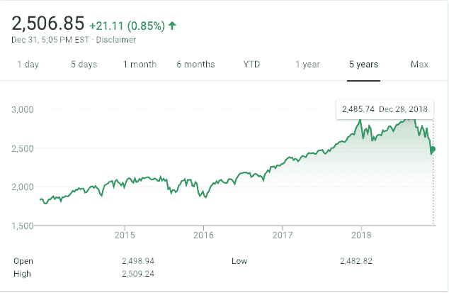
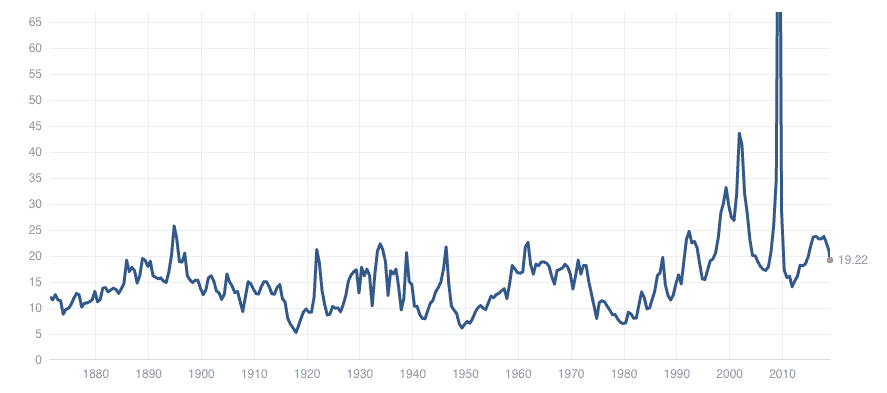
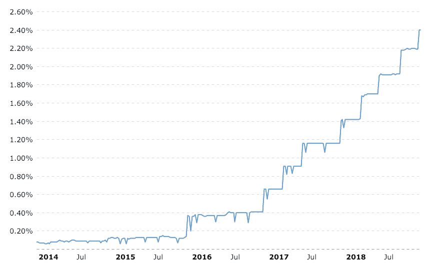
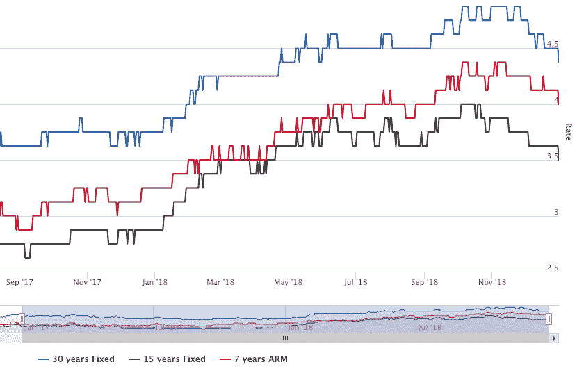
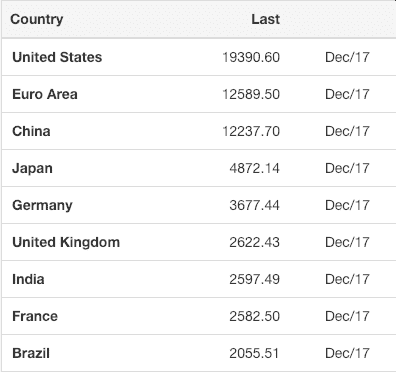

# 2019 年将会发生什么- AVC

> 原文：<https://avc.com/2019/01/what-is-going-to-happen-in-2019/?utm_source=wanqu.co&utm_campaign=Wanqu+Daily&utm_medium=website>

大家好。2019 快乐。

今天，作为我新年第一天的习惯，我要尝试一下新的一年将会带来什么。我发现思考我们的处境是有益的。它帮助我投资，并为我们投资的公司提供建议。就像我们的投资一样，我会得到一些正确的，一些错误的。但是当在一个充满不确定性的世界中运作时，拥有一个观点，一个基础，是非常有帮助的。

我相信并一直告诉我周围的人，我认为 2019 年将是一个“疯狂的一年”。我认为我们会看到美国领导层的重大变动，股市的熊市，疲软的经济，全球经济的许多问题，包括混乱的英国退出欧盟和疲软的中国。所有这些都将导致投资者对创业经济采取更加谨慎的态度。尽管 2019 年将会有生命的迹象，但 crypto 将不会成为这一切的避风港。

让我们按照我提到的顺序逐一讨论。

我相信，到 2019 年底，我们会有一个不同的美国总统。这一变化的催化剂将是罗伯特·穆勒发布的一份极具破坏性的报告，该报告概述了我国总统几十年来的非法活动历史，包括他在总统竞选中的非法活动。

众议院将对穆勒的报告做出反应，投票弹劾总统。这将在参议院进行审判。这场审判对总统来说非常不利，他将像他的前任尼克松一样，谈判辞职，这将导致他和他身边的人的所有行为都被赦免，迈克·彭斯将在 2019 年的某个时候成为美国总统。

我相信这部剧将在 2019 年的大部分时间里上演。我预计穆勒报告将在冬末/初春的某个时候发布，我预计众议院将在夏季之前进行弹劾投票，导致参议院在今年下半年进行审判。

华盛顿的戏剧性事件将对美国经济产生严重影响，首先是我们的资本市场。

美国股票资本市场在不稳定的基础上进入 2019 年。虽然今年的最后一周给我们带来了宽慰的反弹，但市场正在应对更高的利率，2019 年经济疲软的一些早期迹象(可能是由于利率上升)，当然，我们已经讨论过的华盛顿戏剧的可能性。这是标准普尔 500 过去五年的图表:

我预计标准普尔 500 将在 2019 年的某个时候达到 2000 点，然后在今年的大部分时间里围绕底部反弹。这将意味着 S&P 的追踪市盈率下降到 15 倍左右，鉴于美国股票市场的近期历史，我认为这是一个底部:

S&P PE Multiple (source http://www.multpl.com/)

在过去的三年里，美国的利率一直在逐步上升。美联储已经将联邦基金利率从三年前的基本为零下调至如今的近 2.5%。

Source: https://www.macrotrends.net/2015/fed-funds-rate-historical-chart

消费者和企业可获得的利率随之下降，我预计这种情况将在 2019 年继续。以下是美国三种最受欢迎的抵押贷款产品的利率图表:

Source: https://www.amerisave.com/graphs/

当借贷成本变得更高时，边缘项目就得不到资助。边际上发生的事情对经济的影响比大多数人理解的要大得多。难怪总统想解雇美联储主席。

我预计，利率上升、华盛顿的不确定性和全球的乌云(我们很快就会看到)将导致美国的商业领袖在招聘和投资方面变得更加谨慎。消费者会做出本质上相同的计算。这将导致美国经济在 2019 年走弱。

全球情况也好不到哪里去。随着英国以某种形式脱离欧盟(英国退出欧盟)，欧元区将经历几十年来最重大的变化。目前还不清楚这将如何发生，这本身就在非洲大陆制造了许多不确定性。我不指望欧洲的大多数企业在 2019 年除了防守之外还会做什么。

全球经济最大的未知因素可能是中美之间持续的贸易紧张局势的解决。似乎不可避免的是，中国将向美国做出一些让步，以解决这些贸易紧张局势。但是，当然，华盛顿发生的事情(第一期)可能会影响所有这一切。与此同时，围绕贸易和出口的不确定性笼罩着中国经济。近年来，随着中国实现了与美国和欧元区的相对平衡，其国内生产总值(GDP)一直在放缓:

Source: https://tradingeconomics.com/china/gdp

中国的任何重大贸易让步都可能影响其 2019 年及以后的增长前景，这将使今年全球增长的最强大引擎消失。

因此，所有这些都是对 2019 年更广泛的宏观环境的悲观看法。所有这些将如何影响创业/科技经济？

创业/科技经济在某种程度上不受宏观趋势的影响。在 2008 年和 2009 年的上一次金融危机中，许多初创公司和大型科技公司得以发展壮大。一些非常重要的科技公司甚至是在那些年成立的。

技术/创业经济首先是由技术和创新(即商业模式)驱动的。这不受宏观环境的影响。

因此，我预计我们将继续看到大型科技公司投资和发展业务，并在 2019 年表现良好。我预计我们将看到优步/Lyft/Slack 等大牌公司的 IPO，尽管我也预计这些交易的定价将远低于他们目前心中的崇高期望。部分原因是美国股市疲软，但 2018 年的大多数 IPO 定价也低于创始人、经理、董事会及其银行家的崇高“进入”预期，这也是事实。很长一段时间以来，公开市场对价值的看法都比晚期私人市场乐观得多。

然而，我确实认为美国艰难的宏观商业和政治环境将导致投资者在 2019 年采取更加谨慎的立场。看到 2019 年的风险投资总额比 2018 年下降，我不会感到惊讶。我认为，我们将看到融资需要更长时间，对新投资的尽职调查实际发生，即使是最有吸引力的机会，估值也将面临压力。

但所有这些都将发生在边缘。我预计 2019 年将是科技/创业行业又一个坚实的一年，因为我们正处于从工业经济向信息经济的可能长达一个世纪的转变中，科技/创业相对于经济其他部分的顺风仍然存在且强劲。

如果没有一些关于加密的想法，我在这个博客上对 2019 年的任何预测都是不完整的。这就是我对这个话题的看法。

我认为我们正在寻找大的、流动的、持久的加密令牌的底部。但我认为，这个过程可能需要 2019 年的大部分时间才能完成。我预计我们将看到一些牛市，随后抛售压力将带我们回到重新测试低点。我认为这个触底反弹的过程将在 2019 年的某个时候结束，我们将慢慢进入加密的新牛市阶段。我认为，随着 2017 年做出的许多承诺中的一些在 2019 年实现，下一个牛市阶段的催化剂将会到来。具体来说，我认为我们将看到一些知名项目的发布，如我们投资组合公司 [Protocol Labs](https://protocol.ai/) 的 [Filecoin](https://filecoin.io/) 项目，以及我们投资组合公司[algrand 的](https://www.algorand.com/)[algrand 项目](https://www.algorand.com/apply-for-test-network/)。我认为我们将会看到许多“下一代”智能合约平台的发布，并挑战以太坊在密码领域这一超级重要领域的领导地位。我还预计以太坊开源社区将在 2019 年对其系统进行大量重要改进，并捍卫他们在智能合约领域的领导地位。

我希望在 2019 年看到有意义的进展和消费者采用的其他加密领域是 stablecoins、NFT/加密资产/加密游戏以及赚取/消费机会，特别是在发展中国家。

2019 年，加密行业也将面临压力。我最担心的领域是被误导的监管者采取的行动，他们会瞄准高质量的项目并损害它们。我们将继续看到各种各样的失败，从诈骗、黑客攻击、失败的项目，以及投资的损失都会拖累这个行业。但新兴技术总是如此，它让任何人都可以开店并开始工作。随着时间的推移，未经许可的创新会产生最大的收益，但也会带来不可避免的不良行为。

这就是我在 2019 年的想法。我听起来悲观吗？我想我知道，但我不是。我非常乐观，就像我的搭档艾伯特一样，迫不及待地想在新的一年开始行动，让事情发生。这将会是一场狂欢。