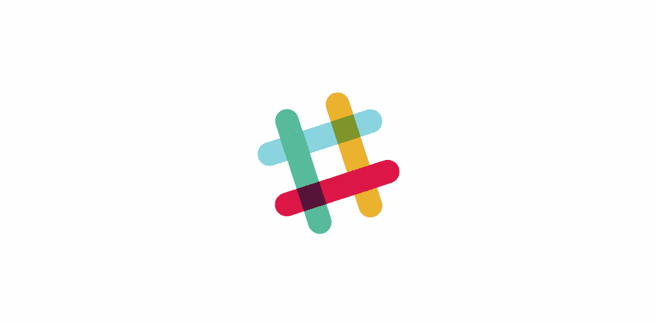
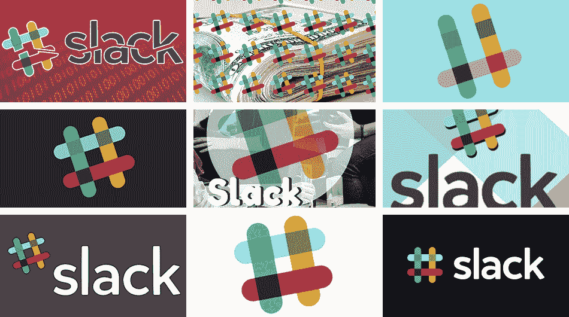
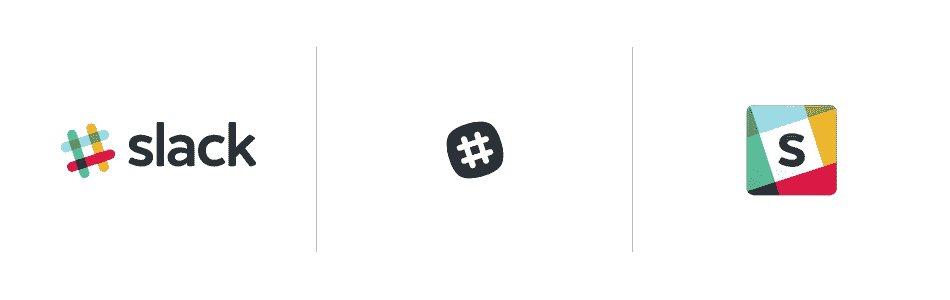
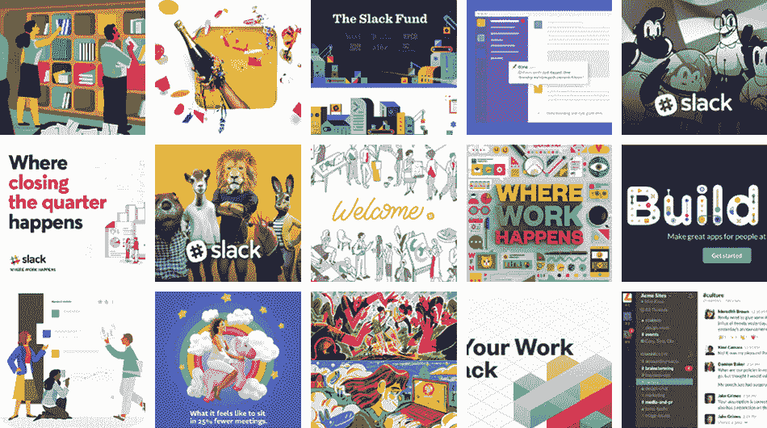
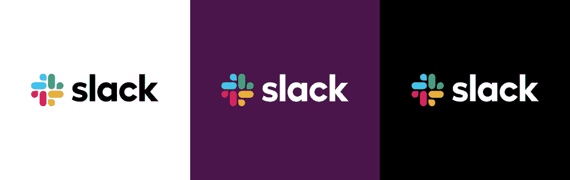
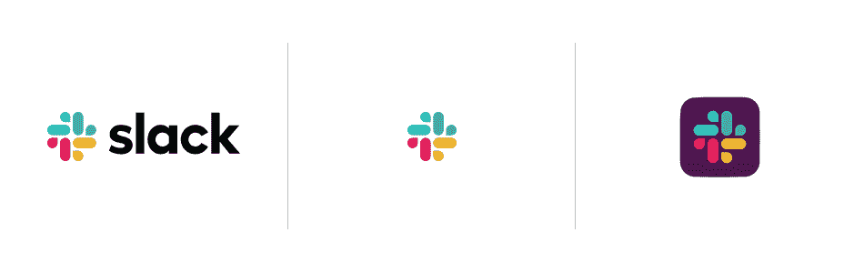

# 打个招呼，新 logo | Slack

> 原文：<https://slackhq.com/say-hello-new-logo?utm_source=wanqu.co&utm_campaign=Wanqu+Daily&utm_medium=website>

今天，我们将推出新的 标志，开始全面更新我们的形象。我们喜欢我们的旧标志，看，知道很多人都有同样的感觉。然而，在这里我们要解释为什么我们决定发展它。

首先，这不是为了改变而改变。也就是说，改变是不可避免的，是值得拥抱的，等等。等等。，但这并不是换个 logo 的足够好的理由。更换 logo 的一个很好的理由是它没有完成你想要它做的工作——因为一个更简单、更独特的演变可以做得更好。

我们的第一个标志是在公司推出之前创作的。它与众不同，很有趣，八叉符号(或英镑符号，或哈希，或任何你知道的名字)类似于你在我们产品的频道前看到的相同字符。    也正是极容易出错。它有 11 种不同的颜色——如果放在除白色以外的任何颜色上，或者放在错误的角度上(而不是精确规定的 18°旋转),或者颜色调整错误，它看起来很糟糕。这让我们很痛苦。就看:

简直糟透了。

我们开发了不同版本的标志来弥补这一缺陷，这些标志适用于不同的目的。但这意味着每一个应用程序按钮看起来都不一样，而每一个按钮又与徽标不同。

他们都很好……但是一点都不团结。作为一个品牌，重要的是无论何时人们在野外看到你，他们都应该认出那是你。反而让人看到了这个:

许多美好的事物——但是没有你所期望的那种凝聚力。所以我们在这里。我们的内部设计和品牌团队与迈克尔·比鲁特和来自[五角星](https://www.pentagram.com/work/slack)的团队一起，努力创造一个新的、更具凝聚力的视觉形象。今天，我们从这个标志开始。

它使用了更简单的调色板，我们认为它更精致，但仍然包含了原作的精神。这是一种进化，可以很容易地扩展，并且在更多的地方工作得更好。

我们不会用新标志的设计思想和每一个角度和曲线的意义来烦你——你是一个忙碌的人，我们这篇文章的主要目的是让你知道这一变化，所以当你的手机/笔记本电脑/平板电脑上的图标看起来有点不一样时，你不会太惊讶。事实上，它们看起来非常相似:

在接下来的几个月里，你会看到 Slack 周围的所有其他视觉效果都围绕着这个新方向:在网站上，在广告中，以及在产品的某些地方(当然，这不会妨碍你完成重要的工作)。还是我们。我们还是很懈怠。但是更一致，我们希望，更容易辨认。

**TL；** 博士:我们换了 logo。

爱，懈怠的团队。👍

*如果你想从五角星本身了解更多的设计， [在这里阅读他们的博客](https://www.pentagram.com/work/slack) 。T9】*