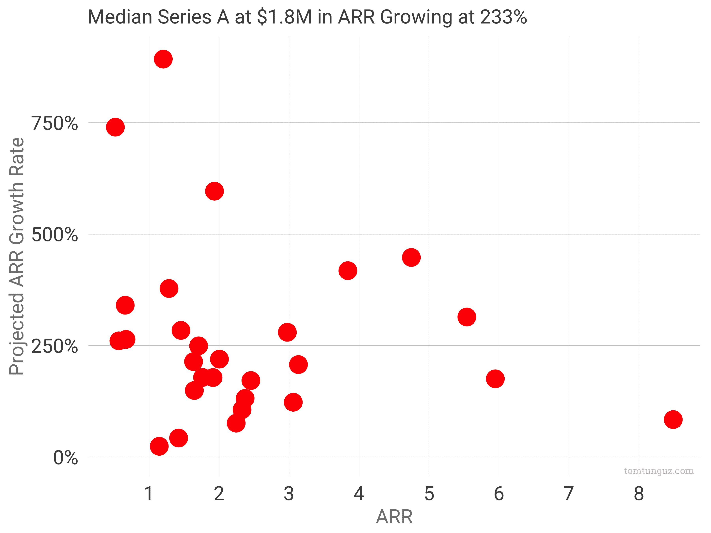

# @ttunguz 的 2018 年 SaaS A 轮创业基准

> 原文：<https://tomtunguz.com/series-a-saas-startup-benchmarks-for-2018/?utm_source=wanqu.co&utm_campaign=Wanqu+Daily&utm_medium=website>

2018 年典型的 SaaS A 系列走了多远？ARR 中值业务为 180 万美元，增长率为 250%。下图显示了 SaaS 系列的代表性样本“ARR”和 2018 年的预计 ARR 增长率。

进一步细分为四分位数，ARR 四分位数为:

| 第二十五 | 第 50 名 | 第 75 届 |
| --- | --- | --- |
| One point four | One point eight | Three |

ARR 增长率四分位数为:

| 第二十五 | 第 50 名 | 第 75 届 |
| --- | --- | --- |
| 140% | 230% | 320% |

这些数字比我预期的要大。公平地说，22%的公司以 0 美元融资。但是平均 MRR 已经从[我上次分析数据的时候](我上次分析数据的时候)大幅增加了。(注意，我这里是从中间值切换到平均值)。

| Two thousand and fourteen | Two thousand and fifteen | Two thousand and sixteen | Two thousand and seventeen | Two thousand and eighteen |
| --- | --- | --- | --- | --- |
| Fifty | One hundred and twelve | One hundred and sixty-three | 不适用的 | Two hundred and three |

在 4 年的时间里，我们看到 seen a 轮公司的 MRR 中值增长了 4 倍。这是相当高的增长率。2017 年我没算过这个数字。

这种增长有两个原因。首先，与 2014 年相比，如今人们对创建 SaaS 公司的科学有了更好的理解。因此，与过去相比，更多的公司能够达到 100 万美元的 ARR，因为它们可以更有效地利用资本。第二，[种子和 A 处的圆形尺寸增大。](https://tomtunguz.com/saas-round-sizes-2017/)更多的钱让初创公司在筹集下一轮资金之前实现更大的里程碑。这两个因素都会增加 a 系列的 ARR。

至于增长率，230%的预计增长率接近 SaaS 普遍采用的三倍、三倍、两倍、两倍、两倍的增长战略。有少数企业预测超过 300%,这在这样一个早期阶段是一个大胆的断言，但也是可能的。

这种数据分析通常需要注意。样本量较小；有些公司以低于其他因素的中值 A 的 ARR 筹集 b 系列资金；这种分析忽略了空间、竞争动态、团队构成和融资的拍卖压力。