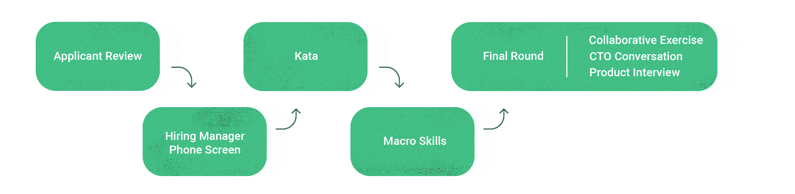
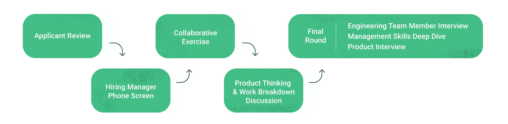

# 我们在 CircleCI 学到的关于雇佣工程经理的知识

> 原文：<https://circleci.com/blog/what-we-ve-learned-about-hiring-engineering-managers/?utm_source=wanqu.co&utm_campaign=Wanqu+Daily&utm_medium=website>

注意(2020 年 8 月):自从发表这篇博文以来，我们已经从几个方面更新了下面概述的招聘流程。我们取消了“协作练习”面试阶段，将“产品面试”与“产品思考&工作分解”合并。这些变化意味着流程更短，有助于我们提高招聘流程的效率。我们重视基于经验教训的持续改进，并将在需要时继续改进流程。

在过去的一年里，我们对 CircleCI 优秀工程经理的理解发生了一些重大转变，并在此过程中了解到了很多关于我们组织的需求和价值观。我们已经从根本上改变了我们的招聘流程，通过这些努力，我们已经聘用了一些优秀的人才，使我们的工程管理团队增加了一倍。今天，我们想与你分享所有这些知识。

### 雇佣工程经理就像我们雇佣工程师一样

去年，我们分享了“[如何面试工程师](https://circleci.com/blog/how-we-interview-engineers-at-circleci/)”。这是我们当时的流程，工程师和工程经理都用。总体而言，在 2018 年，我们有数百名候选人通过了我们的工程招聘流程。我们招聘工程师的流程如下:

*申请人审查>招聘经理电话筛选>形>宏观技能>最后一轮(协作练习、首席技术官对话、产品面试)关于这一过程的更多细节，请参见这篇[博文](https://circleci.com/blog/how-we-interview-engineers-at-circleci/)。*

2018 年初，我们对工程师和工程经理采用了相同的招聘流程。当时，我们对工程经理的招聘主要集中在他们的技术背景和他们团队的技术工作之间的一致性上。正如我们在最初的帖子中所写的，“我们包括一个编码问题，因为发现候选人的价值观和优先事项是否与他们将管理的团队的价值观和优先事项一致是如此重要。”我们与一些工程经理申请人一起经历了招聘过程，并意识到我们经常到现场阶段，只是在结对时才发现他们的管理技能与我们的期望不符——发现这一点为时已晚。

这揭示了一个更大的问题:它让我们意识到，我们试图调整所有招聘流程的努力，导致我们关注并优化了错误的技能组合。曾经有一段时间，我们认为拥有非常技术化的经理是一件好事。我们打算改编 Spotify 模式，让交付团队和经理在不同的团队中按专业分工合作。随着我们对这种组织模型的接受发展到与我们作为分布式工程组织的需求相一致，我们意识到我们想要更多地分配领导。

我们引入了额外的角色来支持我们不同领域的团队:团队领导，负责他们团队的交付，以及技术领导，负责促进技术工作。通过我们新的[工程能力矩阵](https://circleci.com/blog/why-we-re-designed-our-engineering-career-paths-at-circleci/)，我们还将我们对所有级别的所有工程师的领导力期望整理成文。我们从这些变化中见证的早期成功鼓励我们继续发展我们对优秀工程经理的理解。

### 为我们的工程师提供更好的支持

管理不是工程。工程管理是一项根本不同的工作，需要不同的技能，我们需要这样对待它。CircleCI 的工程经理现在致力于人员管理:专注于一系列工程师、技术领导和团队领导的发展。他们定期与向他们汇报的工程师进行一对一的职业发展对话，并负责为他们设定目标、提供反馈、指导和辅导。他们还跨一组团队工作，以确保团队健康、知识共享、业务价值交付和跨团队的一致性。这意味着我们的工程师拥有对他们的个人和专业成长有极大兴趣和投资的经理，团队有专人在产品交付过程中指导他们。

### 使我们的流程适应我们重新关注的价值观

由于了解了工程管理中对我们真正重要的是什么，我们调整了我们的开放职位，使其同时关注人员和业务价值交付。我们还改变了招聘流程和每个面试阶段的设计，以便在面试过程的早期探索这些领域。与此同时，我们对所有申请人采取了更有条理、基于行为的面试流程。

这是我们现在招聘工程经理的流程:

*申请人审查>招聘经理电话筛选>配对练习>产品思考&工作分解讨论>最后一轮(工程团队成员面试、管理技能深度挖掘、产品面试)* *注意:我们一直在寻找改进流程的方法，因此请注意这些阶段可能会发生变化*

使用强调人员管理和业务价值交付的新流程，我们对这些技能的评估如下:

**1。招聘经理电话筛选:**该职位的招聘经理会与候选人谈论他们在不同领域的管理经验。
2**。合作练习:**这是一次合作面试，候选人与我们的一名工程经理配对。他们共同应对了我们过去作为一个组织所面临的两个挑战，这两个挑战今天仍有可能再次发生。就像我们的技术配对练习一样，我们希望确保反映我们正在进行的实际工作，并且作为工程管理团队一起讨论挑战和开发解决方案对于我们的日常工作非常重要。这次面试帮助我们更多地了解候选人应对组织挑战的方法，以及他们如何与同事合作。
**3。产品思考和工作分解讨论:**在这次面试中，候选人和我们工程管理团队的另一名成员讨论一些与他们理解工作和交付能力相关的问题，并从客户价值的角度引导讨论。
**4。工程团队成员面试:**这是一段与候选人将要共事的高级工程师的对话。他们一起讨论我们的团队过去面临的协作挑战。我们希望候选人能够指导技术讨论并为其增值，同时了解自己的局限性，支持技术决策，而不是充当决策者。
**5。管理技能深度挖掘:**这种对话通常是与工程管理团队的一名高级成员进行，对重要的领导技能和候选人的管理经验进行更深入的讨论。
**6。产品面试:**最后一次面试是与我们产品团队的一名成员进行的，重点是候选人对产品、流程和建立健康的工程团队的看法。

### 下一步是什么

以这种方式改变我们的流程有助于我们筛选正确的价值观和技能，并尽早确定哪些候选人符合这些价值观和技能。最终，它使我们能够雇用关心我们的优秀经理，他们的价值观与我们的组织一致，并且能够帮助我们的工程组织进入下一个增长阶段。

目前，我们正在努力确保这一流程与我们新采用的工程管理能力矩阵完全一致(该矩阵尚未公开，但我们的目标是尽快分享)。

如果我们的价值观和工程经理的角色听起来像是你喜欢的东西，请联系我们——我们正在招聘欧洲和北美的[工程经理](/careers/jobs/)！如果你对与一个伟大的团队和一个投资于你成长的经理一起工作感兴趣，加入我们[成为一名工程师](/careers/jobs/)！

您对我们的流程有反馈吗？很想听听大家的意见。给我发邮件:lena@circleci.com

阅读更多信息: