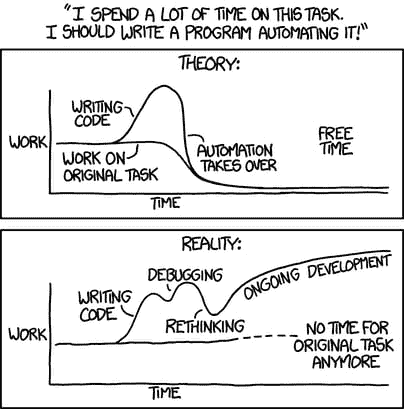

# 作为代码的基础设施，第一部分

> 原文：<https://crate.io/a/infrastructure-as-code-part-one/?utm_source=wanqu.co&utm_campaign=Wanqu+Daily&utm_medium=website>

假设您开发了一个新特性，并且想要发布它。

在发布新版本时，你已经避免了所有典型的陷阱，并且你已经做了所有你应该做的事情。不是星期五，不是下午 5 点，等等。

但是您的组织仍然在进行手动发布。这意味着系统管理员登录到您的每一台生产机器上，并部署最新版本的代码。

在您的组织中，规则要求您提前提交部署请求。在这种情况下，您被授予周二下午的首次展示窗口。您的应用程序更改已经成功部署到临时环境中。测试通过了，其他一切都进展顺利。你感觉很自信。

星期二下午就要到了，是时候发布到生产环境中了。

在第一台机器上部署成功。第二台机器。但是等等。第三台机器出了问题。

原来，第三台生产服务器安装了一组不同的应用程序依赖项。版本不兼容。

您开始调试，但是部署有一个固定的时间窗口，时间不多了...

最终，时间会耗尽。你错过了机会。整个版本被回滚。现在你不得不请求另一次展示。但是利益相关者的批准很慢，所以下一次机会是在一周之后。

该死的。

你花一整天的时间去调查到底哪里出了问题。最终，你会明白的。有人上周登录了第三台机器，手动更新了一些软件。这些变更从来没有传播到其他服务器，或者传播回临时环境，或者开发环境。

这些感觉熟悉吗？如果是这样，你并不孤单。

幸运的是， [*基础设施作为代码*](https://en.wikipedia.org/wiki/Infrastructure_as_Code) (IaC)可以帮助您缓解上述所有问题。在这个 IaC 迷你系列的第一部分中，我将向您介绍基本概念并解释一些好处。

## 介绍

顾名思义，基础设施即代码使用代码来提供、配置和管理基础设施。

使用正确的工具集，很容易创建应用程序应该部署在其上的基础结构的描述。此描述包括虚拟机、存储、软件堆栈、网络配置、安全功能、用户帐户、访问控制限制等的规范。

这种描述是使用代码完成的，通常使用一种声明性的语言。您使用的语言因您使用的工具而异，从通用脚本语言到工具提供的 [*领域特定语言*](https://en.wikipedia.org/wiki/Domain-specific_language) (DSL)。

随着 [*基础设施即服务*](https://en.wikipedia.org/wiki/Infrastructure_as_a_service) (IaaS)和其他基于云的服务的出现，IaC 也在不断发展。IaaS 的可编程性和 IaC 的声明性结合得非常好。您不必每次都手动设置云环境，只需使用 IaC 就可以实现自动化。

但这并不意味着 IaC 将您局限于 IaaS，无论是公共的、私有的还是混合的。只需做一点额外的工作，您就可以使用基础设施配置工具来管理传统的物理服务器集合。

## 可供选择的事物

在我继续发言之前，如果不提及其他选择，那将是我的失职。

我能想到的主要有三个:

*   使用云提供商提供的可视控制台手动设置基础架构。比如用 *Azure Portal* 手工设置你的[微软 Azure](https://azure.microsoft.com/en-us/) 产品，一个一个来。单击界面，创建新的虚拟机，从下拉菜单中选择操作系统，启动它，监控状态，等等。

*   使用云提供商提供的 CLI 工具。

*   您需要管理自己的物理机或虚拟机，而不是使用云提供商。您还编写了自己的配置工具、管理工具、部署脚本等集合。

如果你正在使用云提供商，控制台是一个很好的学习方法。但是，如果您试图像这样管理您的整个设置，这很快就会变得令人厌倦且容易出错。此外，通常没有内置的变更可见性。你必须记住你采取了什么行动，并为团队的其他成员记录下来。

如果您手工管理自己的服务器，开发自己的系统管理脚本也可以。但是这样的系统很容易变成有点不标准的大杂烩。

嗯，事情会很快失去控制...

[T2】](https://xkcd.com/1319/)

## 风景

好了，让我们从高层次来看一下 IaC 的情况。

基本上有两类工具:

1.  *编排工具*用于供应、组织和管理基础设施组件。例子包括 [Terraform](https://www.terraform.io/) 、 [AWS CloudFormation](https://aws.amazon.com/cloudformation/) 、 [Azure Resource Manager](https://docs.microsoft.com/en-us/azure/azure-resource-manager/resource-group-authoring-templates) 。

2.  *配置管理工具*用于安装、更新和管理运行在基础设施组件上的软件。例子包括[盐场](https://saltstack.com/)、[木偶](https://puppet.com/)、[主厨](https://www.chef.io/chef/)和[替身](https://www.ansible.com/)。

此外，就 IaC 而言，有两种管理基础架构的主要方法:

1.  一些工具(例如 SaltStack)将基础设施组件视为*可变的*对象。也就是说，每次对配置进行更改时，都会对已经运行的组件进行必要的更改。

2.  其他工具(如 Terraform)将基础设施组件视为*不可变的*对象。也就是说，当您进行更改时，会创建具有新配置的新组件来替换旧组件。

## 有什么好处？

### 开发者心态

理想情况下，开发人员关心的是创建稳定和可持续的软件。但是当基础设施是“其他人负责的事情”时，开发人员很容易不考虑他们正在构建的软件将如何运行。

当您使用代码管理基础设施并让应用程序开发人员参与到该过程中时，它可以促进思维模式的改变。

这个应用程序将如何部署？一旦开始运行，它将如何维护？升级是如何完成的？您是否考虑过它在生产机器上可能失败的所有方式？你能采取什么预防措施？

当应用程序与 IaC 集成时，所有这些以及更多内容都成为应用程序开发过程本身的一个自然组成部分。

### 版本控制

因为您正在用代码定义您的基础设施，所以它也应该像您的代码的其余部分一样在存储库中被版本化。

[变更控制](https://en.wikipedia.org/wiki/Change_control)为应用程序开发带来的所有好处都可以用于基础设施管理:

*   真相的唯一来源。

*   代码本身以及它的布局方式是一种交流工具，可以用来理解事物的构建方式。

*   更改的历史被记录下来并可供访问，因此您可以了解随着时间的推移发生了哪些更改以及更改的原因。

*   可以开发和维护编码标准。

*   拉请求和代码审查增加了知识共享，并提高了代码的整体质量。

*   实验性的改变可以在分支上进行，也可以单独测试。

*   进行更改并不那么令人畏惧，因为如果出现问题，您可以恢复到以前已知的工作版本。

等等，等等...

### 知识共享

一个组织中的一两个人会积累似乎只有他们才拥有的关键信息，这是一个普遍现象。

在我以前的一家公司，我们保存了一份这样的人的名单，叫做“红色巴士”名单，这样命名是因为他们中的一个人可能会被一个人撞上。艾德。]

不太引人注目的是，这些人像任何人一样休假，有时会生病。所以你应该能应付他们不在身边的情况。

有了使用代码记录的基础设施，理解起来就相对简单了。更重要的是，这是一种应该经常更新的动态文档。

### 更好地利用时间

总的来说，人类不擅长单调重复的任务。我们失去了兴趣，这也是我们最容易犯错的时候。

好在这是机器擅长的。

当你用代码管理你的基础设施时，你把所有乏味的、重复的工作都交给了计算机。因此，您减少了不一致、错误、未完成工作和其他形式的人为错误的机会。

这也允许你的员工把他们的时间和精力花在其他更重要、更有价值的任务上

### 连续累计

[*持续集成*](https://en.wikipedia.org/wiki/Continuous_integration) (CI)是团队成员每天多次将他们的代码变更合并到一个主线分支中的实践。

好处是，您可以根据测试套件不断地验证您的代码，并且当代码库发生变化时，您可以以可管理的、增量的方式适应代码库的变化，而不是在项目结束时一次性完成(这被称为“集成地狱”)。

IaC 改进了 CI，因为对基础设施的更改可以像对应用程序代码的更改一样进行测试。此外，可以为应用程序代码的每次更改提供一个临时测试环境。

### 连续交货

[*连续交付*](https://en.wikipedia.org/wiki/Continuous_delivery) (CD)是每次代码推送到主线分支时，进行定期自动化发布的过程。

CD 和 IaC 是天作之合。

使用 IaC，您可以建立一个部署管道，根据您的测试和发布时间表，自动将不同版本的应用程序从一个环境移动到另一个环境。但在另一篇文章中有更多关于这个话题的内容。:)

## 包裹

基础设施即代码(IaC)在系统管理员和开发人员之间架起了一座桥梁，这样做的目的是:

*   帮助开发人员思考他们正在开发的软件的整个生命周期。

*   为系统管理带来版本控制、代码审查、知识共享和其他好处。

*   使您能够从根本上转变 CI 和 CD 渠道。

*   减少对重复性和易出错任务的需求，让人们有时间从事更令人兴奋的工作。

最终的结果应该是一个更加一致、可靠和易于理解的基础设施，它更易于开发和维护。

在这个迷你系列的第二部分中，我将深入介绍细节，并向您展示我们在 Crate.io 使用 Terraform 供应和管理基础设施的一些方式。

T6】