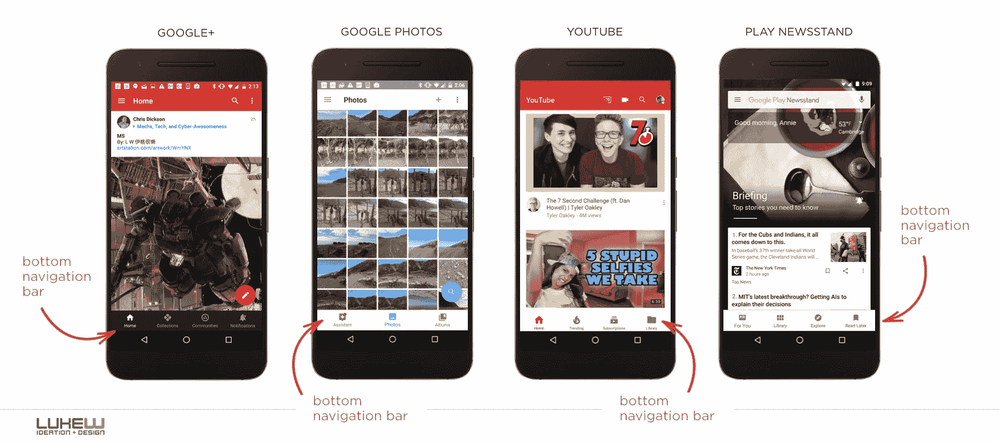

# 航海应该是无聊的——艾伦·派克

> 原文：<https://allenpike.com/2019/navigation-should-be-boring?utm_source=wanqu.co&utm_campaign=Wanqu+Daily&utm_medium=website>

应用应该是有趣的，但不是那样的。

当推出一个产品，尤其是面向消费者的产品时，你希望它有趣。一个新颖、大胆或有特色的用户界面可以让一个应用脱颖而出，令人难忘，并激发好奇心。另外，这很酷。

幸运的是，有很多方法可以让界面变得有趣。你可以使用醒目的颜色，有趣的插图，或深思熟虑的文案。您可以添加动画或声音的奇思妙想。您可以让特性集非常简单，或者非常强大。几乎一个应用程序的任何部分都可以是添加新鲜感的好地方，除了一个:导航。导航不一样。

导航应该很无聊。

[T2】](https://twitter.com/lukew/status/1037763082863312896)

有了令人愉快的无聊导航方案，用户不需要学习如何探索你的应用程序。因此，他们的“注意力范围预算”可以用来考虑你的新东西如何适应他们的生活，而不是试图回忆他们应该从屏幕左侧拖动多少手指来拉出备用的快速访问轮。

虽然有经验的设计和开发团队通常会在短时间内压制最糟糕的导航狂热梦想，但通常仍然有一种诱惑，甚至是明显的压力，来建立新的导航模式。超越标准票价真他妈的令人满足。“如果我们只是在这里尝试一点水平滚动，而在那里*只是一个*双指手势，会不会*如此*糟糕..?"一件事接一件事，你的应用程序的第一次运行体验是一个充满愚蠢箭头和手写提示的屏幕，比如“将标签 A 插入插槽 B 以查看下一张照片”。

如果你对怪异导航持怀疑态度，那么振作起来:数据站在你这边。我见过的 A/B 测试和其他成功指标几乎总是支持清晰、熟悉的导航方法。标签栏比汉堡菜单更有吸引力，许多用户甚至找不到手势，简单的菜单比功能强大的仪表盘更有效。无聊的导航启示比聪明的导航启示能带来更多、更快的导航。正如戴着高贵头盔的交互设计师卢克·乌鲁布莱夫斯基喜欢说的那样，“[总是明显的赢家。](https://www.lukew.com/ff/entry.asp?1945)

当然，度量并不代表一切，有一些产品已经实现了新颖的导航方案，并获得了很好的效果。即使忽略游戏这个明显的例外，多年来发布的许多最有趣的应用程序——从独立端的贾里德·辛克莱的未读应用程序和 Q Branch 的 Vesper，到另一端的 Snapchat 和 T2·脸书的论文——投资了新颖的导航模式和风格，使它们真正与众不同。

这真是太酷了。但也有点悲哀，因为这种类型的投资通常不会有回报。

## 失败的高昂代价

尽管存在可用性陷阱，但新应用不应该有实验性导航方案还有一个更大的原因:成本太高了。

我们知道构建好的产品都是关于迭代的。通常，产品中最需要迭代的部分是新颖的部分。整洁的东西，独特的部分。如果你正在迭代一个声音效果、一个按钮资产，或者更好的一个核心的面向用户的特性，那没有问题。但是，如果你反复思考如何组织、划分和连接你的屏幕，它会很快变得昂贵和浪费。如果你正在进行一项疯狂的导航实验，而 iOS 更新在你能够对它们进行市场测试之前就破坏了你的定制 UINavigationController wall hacks，上帝会帮助你的。一点都不好玩。

一旦你出货，事情就会越来越糟。彻底改造一款生活应用的导航更加耗时，而且通常不会被现有用户接受——即使新方案客观上更好。问问 Snapchat 就知道了:在他们得出古怪的导航方案阻碍了长期增长的结论后，他们推出了更容易使用和赚钱的重新设计的用户界面，但遭到了习惯旧用户界面的用户的强烈反对。或许如果 Instagram 早一点实现清晰导航，他们今天的午餐就不会吃得这么糟糕。

当然，这对 Snapchat 或其他任何人都没有好处。重要的是什么对你的产品和顾客有好处。你今天构建的应用程序。如果你的目标是开发一款与众不同的应用，那么对于 sprint 来说，新颖的导航方案是实现这一目标最糟糕的方式之一。

所以帮你的应用一个忙:保持导航的无趣。至少一开始是这样。在证明你的商业模式时，使用颜色、字体和其他工具来使你的产品有趣和吸引人。当然，在导航上投资——但要投资让它清晰、快速、优质。

也就是说:让它变得无趣。

[T2】](https://twitter.com/lukew/status/1059518636187181056?lang=en)