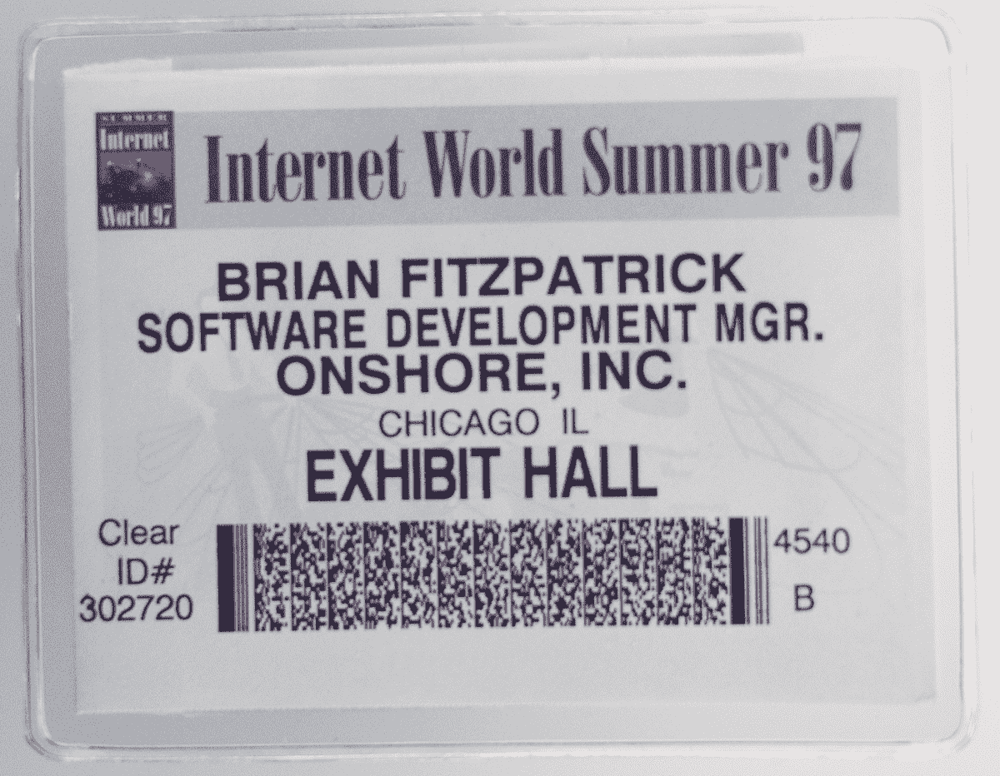
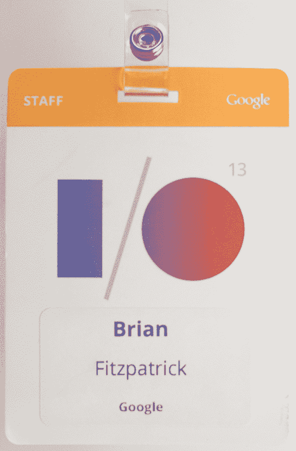
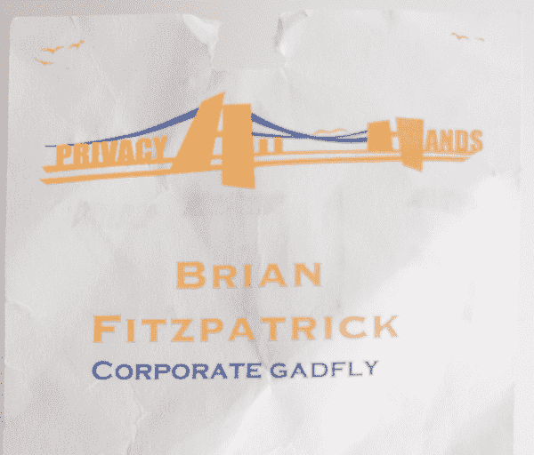
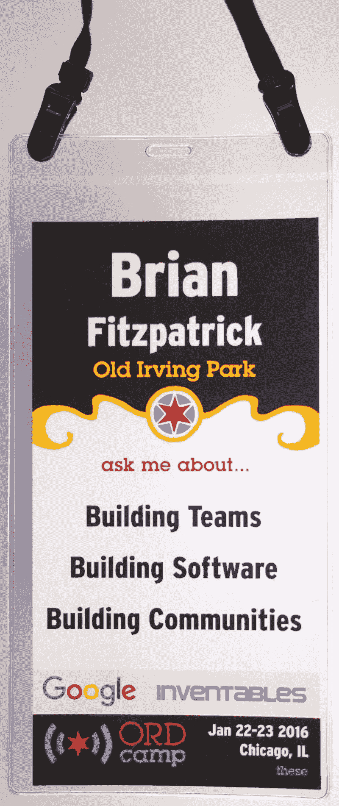

# 徽章评论

> 原文：<https://badge.reviews/10-rules-for-a-better-conference-name-badge/?utm_source=wanqu.co&utm_campaign=Wanqu+Daily&utm_medium=website>

# 打造更好的会议名称徽章的十条规则

在我的职业生涯中，我已经在数百个会议上发言，其中大部分都有一个共同点，那就是蹩脚的名牌。

十年前，当扎克和我开始经营秩序营的时候，我就直面这个问题:我们从蹩脚的名牌开始。意识到这是我们可以控制的，我开始思考什么是好的会议名称徽章，为什么。随后，我在谷歌主持了其他几次内部会议/峰会，这些会议都给了我反复讨论徽章的机会，让我明白什么最能帮助与会者相互认识。

在过去的几年里，我变得，嗯，有点痴迷于徽章，对着能听到的任何人咆哮，在 Twitter 上评价它们，见鬼，我甚至用这些规则的初稿创造了一个可怕的 [Twitter 时刻](https://twitter.com/i/moments/833189960589119488)。

在我所有的名牌中，这可能是最糟糕的。

## 为什么名牌很重要

* * *

人们参加会议通常有两个原因:

1.  学点东西
2.  去认识其他人

这两个原因都是成功会议的重要组成部分。如果会议的目的仅仅是学习一些东西，那么它就不应该是一个会议——它应该是一篇论文，一本书，一个视频，或者一个网上研讨会。

如果你能通过其他方式学到一些东西，结识新朋友就成了会议中最重要的部分。但是在会议上认识新朋友并不是我们所有人都有的。

对许多人来说，结识新朋友可能很难。也许你在会议上不认识任何人。也许你不擅长记名字，忘记了昨晚和你聊了一个小时的人的名字。也许每个人都知道你，因为你是一个演讲者或者在你的领域里很有名，他们去年见过你，但是你感到不舒服，因为你甚至不记得见过他们。也许你在一个会议上遇到了一个你在现实生活中从未见过的人，所以你甚至不知道他们的确切长相，因为他们的 Twitter 头像是他们的猫的照片。不管是什么原因，对于一些人来说，与新朋友见面和联系真的很难，而糟糕的徽章也不会让事情变得更容易。

因此，如果我们知道在会议上很难认识和联系新的人，我们可以也应该在力所能及的范围内做些什么。事实证明，做到这一点非常简单:佩戴姓名牌，让人们更容易建立新的联系！

如果你遵循这些简单的规则，这并不难做到:

### 规则 1
每个人都必须佩戴徽章，没有例外

* * *

这个很容易，因为大多数会议也使用徽章来识别与会者。不过，徽章不应该只在门口检查，所有与会者都应该始终佩戴。

为什么这很重要？

为了便于建立新的联系和认识其他人

### 规则 2
一定要大

* * *

下面会有更多的介绍，但是标签本身需要足够大，以容纳大字体打印的名称和其他一些基本信息。最好是 4 英寸×8 英寸或 4 英寸×6 英寸。

为什么这很重要？

名称需要很大，我们希望徽章上的一些其他信息。

### 规则 3
淡化会议标志

* * *

我知道你想把你的会议和/或赞助商的名字印在每个人的脸上，但是删掉它。把它做得小一点，放在徽章的底部，如果你一定要放在顶部，那就做得小一点，微妙一点。

为什么这很重要？

我们希望尽可能简单地从远处一眼就能读出名字。你在徽章顶部的明亮和分散注意力的标志使这变得更加困难。

### 规则 4
名字必须在至少 15 英尺外可读

* * *

“如果又大又丑，那就是不够大。”

我的名字用 13 号字体写在这个标签上。非常抱歉。

你应该能够从远处快速、不明显/不延迟地瞥一眼来阅读徽章**。使用非衬线字体，这种字体被设计成可以从远处阅读，比如为州际标志设计的[高速公路哥特式](https://www.dafont.com/highway-gothic.font)(免费)或[清晰视野高速公路](http://www.clearviewhwy.com/) ($$)。名称应该是真正巨大的，这意味着至少 64 点类型，最好是 72 点。**

为什么这很重要？

认识新朋友的一个重要部分是知道他们的名字，所以如果你想让参加会议的人认识新朋友，你应该让他们尽可能容易地知道彼此的名字。

有了一个好的徽章，介绍就容易多了，碰到一个你认识但忘记名字的人也不会那么尴尬。重要的是:如果佩戴徽章的人是女性，你不会要求其他与会者盯着她的胸部看，这对佩戴徽章的人来说是非常不舒服的。劝阻猥琐！

### 规则 5
给人们另一个看名牌的理由

* * *

我指的不仅仅是雇主或头衔(事实上，我不鼓励人们在大多数徽章上使用雇主或头衔，因为这对一些人来说会不舒服)，而是一些有趣的东西，比如一些你有兴趣谈论的话题(比如我标签顶部的“问我关于什么”)。允许你的与会者选择在他们的徽章上添加代词也很好。

为什么这很重要？

感兴趣的话题可以成为很好的话题引子！如果我对排版超级兴奋，而你的徽章上写着“问我关于排字的问题”，你可以确定我会和你开始对话。此外，如果你加入一小群人聊天，而你不认识其中一个，你就有借口四处看看徽章，看看每个人的名字。最后，如果你发现自己处于可怕的“我忘记了那个人的名字”的状态，你就有借口看他们的标签了。

### 规则 6
不要全部大写

* * *

这种难以辨认的低对比度全大写标签在佩戴的第一个小时就撕破了。

为什么这很重要？

因为远距离看全大写比较难。

### 规则七
不准翻动

* * *

挂绳不应允许徽章旋转、翻转、倾斜或做其他任何事情，而是平放在佩戴者身上。

为什么这很重要？

如果徽章的挂绳有一个连接点，它会旋转，除非你在两面都印上相同的东西(你不应该这样)，否则一半的与会者会带着显示议程或位置地图的徽章四处走动。这完全违背了佩戴姓名徽章的初衷，所以要找一个系在徽章夹两个顶角的挂绳(和一个两个角上都有孔的徽章夹)。

当然，你可以在双面打印相同的内容，但为什么不在背面打印一些有用的东西，比如空间地图或基本议程信息呢？如果你这样做了，把它倒过来打印，这样佩戴者就可以很容易地翻阅和阅读。

### 规则 8
挂绳应该是可调节的

* * *

为什么这很重要？

不是每个人都是一样的尺寸/比例，最好允许佩戴者调整标签，以便它看起来适合他们的框架。此外，正如我上面所说的(值得重复)，如果徽章笨拙地挂在一个女人的胸前，它会引起毛骨悚然。劝阻猥琐！

### 规则 9
保持简单

* * *

避免诱惑，使你的徽章成为一个艺术项目。

为什么这很重要？

低对比度的字体、抽象的形状、奇怪的图案以及从上到下或斜着印的名字都使徽章难以阅读。

### 规则 10
扔掉那个二维码！

* * *

如果你需要二维码，那就贴在徽章背面！

为什么这很重要？

他们丑得要命。当有人用手机摄像头对准你的胸部时，他们会制造一个尴尬的局面。劝阻猥琐！

遵守所有规则的 4x8”徽章。

### 奖金

* * *

如果参加会议的人是社交媒体的大用户，找到一种微妙的方式把他们的 Twitter 手柄之类的东西放在他们的徽章上。

### 试试看！

* * *

如果你的与会者无论如何都戴着姓名牌，为什么不能是一个好的呢？

我怀疑大多数会议都有糟糕的徽章有两个原因:

首先，当你在主持一个会议时，你有一百万个活动的部分要担心——这是有压力的和令人疲惫的，并且很容易忽略像徽章这样的细节。

第二，好的名牌很贵。你的普通廉价 spinny 不可调节的 3x4”徽章可能需要大约 0.60 美元，而本文顶部的徽章大约需要 2.00 美元。对于大多数人在会议结束后可能会扔掉的东西来说，这可能看起来太多了(除非你像我一样痴迷于姓名牌)，但在会议期间，一个好的徽章可以帮助与会者做他们在那里最重要的事情(结识新朋友！)的价值远远超过 2 美元；*这是无价的*。

特别感谢 Erica Baker、Lucianne Walkowicz、Conrad Fuhrman 和许多其他人为本文提供了想法。