# 寻求富有成效的生活:我个人基础设施的一些细节——史蒂夫·沃尔夫勒姆作品

> 原文：<https://blog.stephenwolfram.com/2019/02/seeking-the-productive-life-some-details-of-my-personal-infrastructure/?utm_source=wanqu.co&utm_campaign=Wanqu+Daily&utm_medium=website>

**[阅读史蒂夫·沃尔夫勒姆 Reddit AMA 关于此文的评论](https://reddit.com/r/IAmA/comments/axf32h/i_am_stephen_wolfram_founder_ceo_of_wolfram/)**


## 对生产力的追求

我是一个只有当我觉得自己富有成效时才会感到满足的人。我喜欢把事情搞清楚。我喜欢制作东西。我想尽我所能做到更多。能够做到这一点的部分原因是我拥有最好的个人基础设施。多年来，我一直在为自己积累和实施“个人基础设施技巧”。他们中的一些人，是的，相当书呆子气。但是它们确实帮助我提高了工作效率。也许随着时间的推移，越来越多的人会成为主流，就像一些人已经成为主流一样。

现在，当然，我已经为这个世界建立了很长时间的一个巨大的“生产力黑客”是围绕 [Wolfram 语言](https://www.wolfram.com/language/)的整个[技术栈](http://www.wolfram.com/technologies)。对我个人来说，另一个巨大的“生产力黑客”是我的[公司](http://www.wolfram.com)，它是我在 32 年前创立的。是的，它可以(也应该)更大，有更多的商业影响力。但作为一家拥有约 800 名员工的组织良好的私人公司，它是一台非常高效的机器，可以将想法转化为现实，并利用我所拥有的技能来大大提高我的个人生产率。

我可以谈谈我是如何生活的，以及我喜欢如何平衡做领导、做创造性工作、与人交往和做让我学习的事情。我可以谈一谈我是如何尝试建立一些东西的，这样我已经建立的东西就不会让我忙得无法开始任何新的东西。但相反，我在这里要关注的是我更实际的个人基础设施:技术和其他帮助我更好地生活和工作、感觉不那么忙、每天更有效率的东西。

This essay is also in: [***SoundCloud* »**](https://soundcloud.com/stephenwolfram/seeking-the-productive-life-some-details-of-my-personal-infrastructure)

在智力层面上，构建这一基础设施的关键是尽可能地构建、简化和自动化一切——同时认识到当前技术的现实性以及适合我个人的东西。从很多方面来说，这是一次很好的、实用的计算思维练习，而且，是的，这是我花了很长时间构建的一些工具和想法的一次很好的应用。它的大部分可能对许多其他人也有帮助；其中一些非常具体地针对我的个性、我的情况和我的[活动模式](https://writings.stephenwolfram.com/2012/03/the-personal-analytics-of-my-life/)。

## 我的日常生活

为了解释我的个人基础设施，我首先要说一点我的日常生活。经常让人们感到惊讶的是，28 年来，我一直是一个遥不可及的 CEO。我是一个亲力亲为的 CEO。但是我一年只在办公室呆几次。大部分时间，我只是呆在家里，与公司进行高强度的互动——但纯粹是通过现代虚拟手段:

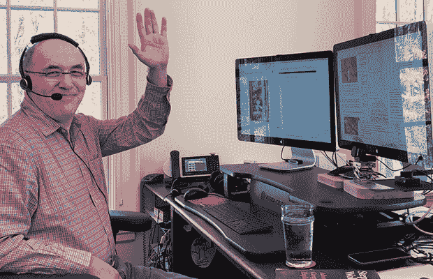

我是那些实际上自己做很多事情的首席执行官之一，也管理其他人做事情。担任远程 CEO 有助于我实现这一目标，并保持专注。在一定程度上，我的公司已经形成了一种非常分散的文化，人们分散在世界各地工作(这都是为了提高效率，而不是为了“露面”):

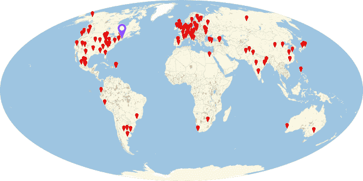

然而，在我的办公桌前，我对这一切的基本看法只是:

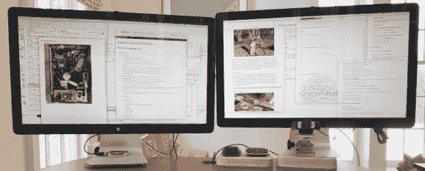

它总是以同样的方式设置。右边是我的主“公共显示”显示器，我将在一天的大部分时间里与我交谈的人分享屏幕。左边是我的第二个“私人显示器”,上面有我的电子邮件和信息以及其他与我正在进行的会议没有直接关系的东西。

在过去一年左右的时间里，我一直在[直播我们的许多软件设计会议](https://writings.stephenwolfram.com/2017/12/what-do-i-do-all-day-livestreamed-technology-ceoing/)——现在有 [250 个小时的存档屏幕共享](https://www.stephenwolfram.com/livestreams/)，全部来自我右边的显示器。

特别是因为我每天大部分时间都坐在办公桌前，所以我试图优化它的人体工程学。键盘处于最佳打字高度。显示器的高度——特别是考虑到我的“电脑距离”多焦点眼镜——迫使我的头在看它们时处于一个良好的位置，而不是弯腰驼背。我仍然使用“滚动”鼠标(在左边，因为我是左撇子)——因为至少根据我最近的测量，我仍然比其他任何指点技术更快。

一按按钮，我的桌子就会升到站立的高度:

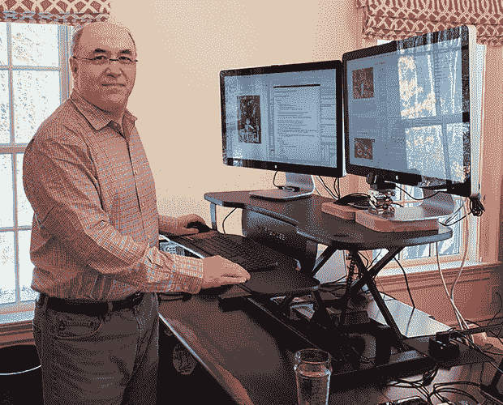

虽然站着可能比坐着好，但我喜欢至少以更活跃的事情开始我的一天，十多年来，我一直确保每天早上散步几个小时。但是我怎么能在走路的时候有效率呢？嗯，差不多 15 年前(也就是早在它流行之前！)我在办公室隔壁的房间里用电脑搭起了跑步机:

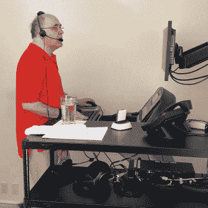

生物力学并不难理解。我发现，通过在我手腕下的正确支点放置一个凝胶条(并将鼠标放在一个平台上)，我可以在走路时舒适地打字。我通常使用 5%的倾斜度，以 2 英里/小时的速度行走——我至少足够健康，我认为没有人能看出我在开会时正在走路。(是的，我试图把可能令人沮丧的会议安排在我走路的时候，所以如果我真的感到沮丧，我可以通过让跑步机跑得快一点来“走开”。)

多年来，我一直在自己身上保存着各种个人分析数据，其中包括连续的心率数据。去年初夏，我注意到有几个星期我的静息心率明显下降了。起初我以为这只是因为我碰巧在系统地做[我当时喜欢的事情](https://education.wolfram.com/summer/)。但是夏天晚些时候，这种情况又发生了。然后我意识到:那是我不在跑步机上行走的时候；相反(出于不同的原因)，我是在外面散步的[。](https://twitter.com/stephen_wolfram/status/1032758995742851075)

多年来，我的妻子一直在赞美户外活动的好处。但是它对我来说从来都不实际。是的，我可以打电话(或者，在极少数情况下，真的和我一起散步的人交谈)。或者，我可能带着平板电脑散步，或许看着别人分享屏幕——去年夏末的一个星期，在我的度假版本中，我就是这么做的，相当不稳定:


事实上，我已经考虑步行和工作很长时间了。二十年前，我想象用一个增强现实显示器和一个单手键盘来做这件事。但是技术还没有出现，我甚至不确定人体工程学是否行得通(例如，它会让我晕车吗？).

但是，去年春天，我参加了一场别开生面的科技活动，我刚好走出了 T2 的一张照片，照片中杰夫·贝索斯带着一只机器狗在散步。我个人对机器狗并不感到兴奋。但真正让我感兴趣的是另一边走出画框的人，他专注地控制着这只狗——使用他绑在面前的笔记本电脑，就像他在卖爆米花一样。

一个人真的能像这样工作吗，打字什么的？在我的“心率发现”之后，我决定我必须尝试一下。我想我必须自己做一些东西，但实际上人们可以买“行走的桌子”，所以我做了。经过小小的修改，我发现我可以用它很好地走路和打字，甚至几个小时。我很尴尬，20 年前我没有想到这么简单的解决方案。但是从去年秋天开始——只要天气好——我就试着每天花几个小时像这样在户外散步:

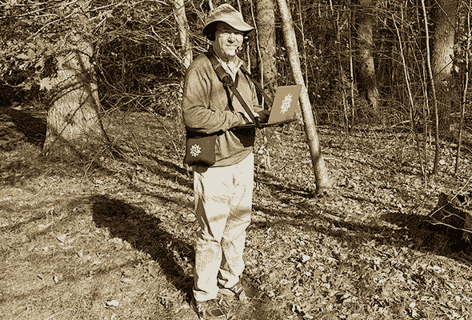

甚至当我全神贯注地盯着电脑时，呆在户外也是一种不错的感觉——是的，这似乎降低了我的静息心率。我似乎有足够的周边视觉——或者也许我只是在“足够简单”的环境中行走——即使我没有有意识地注意，我也没有被绊倒。毫无疑问，这有助于我不在公共场所散步，所以周围没有其他人。当然，这也意味着我没有机会得到 1987 年我第一次走在城市街道上打电话时那种好奇的目光。

## 我的桌面环境

25 年来，我一直用同样的大木头桌子。不用说，我让它具有一些特殊的功能。我关于个人组织的一个理论是，任何平坦的表面都代表着一个潜在的“驻点”,这将倾向于堆积成堆的东西——避免这种堆积的最好方法就是避免永久平坦的表面。但是一个人不可避免地需要一些平坦的表面，如果只是为了签名(它还没有完全数字化)，或者吃零食。所以我的解决办法是穿套头衫。如果有人需要，就拔出来。但是不能把它们拔出来，这样就不会有东西堆积在上面:


这些天我不怎么和纸张打交道。但是每当有什么东西出现在我的桌子上，我都会把它归档。所以在我的桌子后面，我有一系列的抽屉——每个抽屉的顶部都有一个小槽，让我可以立即将东西放进抽屉，而不用打开它:

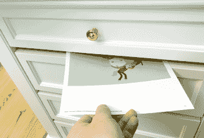

我曾经每隔几个月就往银行的信箱里塞满文件。现在看来需要几年时间。或许作为我变得无纸化的一个标志，我的桌子下面有一台打印机，我很少使用它，以至于我现在似乎每年都要用掉一令纸。

这些年来，还有其他一些事情发生了变化。我一直希望我的主电脑尽可能的强大。多年来，这意味着它必须有一个大风扇来散热。但是因为我真的喜欢我的办公室非常安静(它增加了某种平静，有助于我集中注意力)，我不得不把我电脑的 CPU 部分放在另一个房间。为了实现这一点，我在地板上安装了一个导管，通过它，我不得不走那些经常挑剔的长距离视频电缆。现在，我终于有了一台不需要大风扇的强大电脑，所以我把它放在了桌子后面。(实际上，我还有另外三台不那么安静的计算机，我把它们和跑步机放在同一个房间里，这样当我在跑步机上时，我就可以体验所有三种主要的现代计算环境，用一个 [KVM 开关](https://en.wikipedia.org/wiki/KVM_switch)在它们之间进行选择。)

当我向人们提到我是一名远程首席执行官时，他们经常会说，“你必须做大量的视频会议”。实际上，我基本上没有视频会议。屏幕共享很棒，也很重要。但通常我会发现视频会分散注意力。我通常会开一个会，会上有很多人，以防我们需要得到他们的意见。但在会议的大部分时间里，我不需要所有人都集中注意力(如果他们能完成其他工作，我很高兴)。但是如果视频打开了，看到没有注意的人似乎会从内心扼杀几乎任何会议的气氛。

鉴于我没有视频，音频是非常重要的，我在会议中非常坚持音频质量。没有免提电话。没有不好的手机信号。我自己仍然很守旧。我戴着一个带有标准吊杆麦克风的耳机(添加了填充物以弥补我头顶头发的不足)。而且——部分是出于对整天把无线电发射器放在我头上的谨慎——我的耳机是有线的，尽管有一条很长的电线让我可以在办公室里漫游。

尽管我在会议上不使用“会说话的头”视频，但我在电脑旁边有一个文档摄像头。我会用这个词的一次是当我们谈论手机或平板电脑的时候。是的，我可以把他们的视频直接连接到我的电脑上。但是，如果我们讨论手机的用户体验，能够实际看到我的手指触摸手机通常是有帮助的。

当我想展示一本实体书的页面或各种文物时，文档相机也很方便。当我想画一些简单的东西时，我会使用我们的屏幕共享系统的注释功能。但当我试图画一些更复杂的东西时，我通常会做一些复古的事情，在文件相机下放一张纸，然后用一支笔。我喜欢文档相机的图像出现在我屏幕上的一个窗口中，我可以随意调整大小。(我定期尝试使用绘图板，但我不喜欢它们将我的整个屏幕视为画布的方式，而不是在我可以四处移动的窗口中操作。)

## 在移动中

在某些方面，我过着简单的生活，大部分时间是在办公桌前。但是有很多时候我不在办公桌旁——比如我在家里的其他地方，或者在外面散步。在这种情况下，我通常会带一台 13 英寸的笔记本电脑。当我走得更远时，事情就变得有点复杂了。

如果我要做严肃的工作，或者做演讲，我会带上 13 英寸的笔记本电脑。但是我从来不喜欢没有电脑的生活，13 英寸的笔记本电脑携带起来很重。因此，我也有一台 2 磅重的小型笔记本电脑，我把它放在一个小包里(不用说，包和电脑上都装饰有我们的 [Spikey 标志](https://writings.stephenwolfram.com/2018/12/the-story-of-spikey/)):

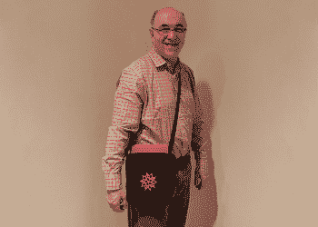

至少在过去的几年里——除非我带着更大的电脑，通常放在背包里——我已经习惯了无论去哪里都“戴着”我的小电脑。我原本想要一个可以完全装下电脑的包，但是我能找到的最好的包有一点突出电脑。然而，令我惊讶的是，这种方法效果很好。当我和某人交谈并快速“画”出我的电脑时，他们看起来很困惑，并问，“这是从哪里来的？”这确实很有趣

我总是把手机放在口袋里，如果我有一点时间，我会把它拿出来。如果我检查邮件，删除或转发一些消息，它会工作得很好。不过，如果我真的想写些严肃的东西，我的小电脑就会出来，带着完整的键盘。当然，如果我站着，试图一只手拿着电脑，另一只手打字是很不切实际的。有时，如果我知道我要站一会儿，我会带一个平板电脑。但其他时候，我只会守着我的手机。如果我用完了当前可以做的有用的事情(或者我没有互联网连接)，我通常会开始查看我在所有设备上保持同步的“要阅读的内容”文件夹。

早在 2007 年，我发明了 [WolframTones](http://wolframtones.com) ，因为我想为我的手机设计一个独特的铃声。但是，尽管 WolframTones 作为算法音乐创作的一个例子在 T2 取得了成功，但它在我手机上的唯一痕迹是我用作主屏幕的 WolframTones 作品的图像:


当我“出门在外”时，我如何记笔记？我尝试了各种技术解决方案，但最终没有一个被证明既实用又能被社会普遍接受。因此，40 年来我一直在做同样的事情:我的口袋里有一支笔，还有一张折叠了三次的纸(所以它大约有信用卡那么大)。技术含量很低，但很管用。当我外出回来时，我总是会花一些时间来抄写我写下的东西，发电子邮件，或者做其他事情。

我随身带着一些“科技求生包”。以下是我背包里的最新物品:

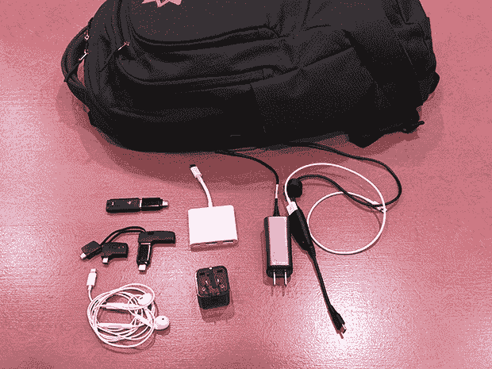

核心是一个微型充电器，可以给我的电脑(通过 USB-C)和手机充电。我带了各种连接器，特别是这样我就可以连接到像投影仪这样的东西。我还带了一个非常轻的 2-3 脚电源适配器，所以我不会发现我的充电器从过度使用的电源插座中掉出。

当我要进行“更严肃的探险”时，我会在装备中加入一些东西:


有一种“充电砖”(不幸的是现在供应不足)，可以让我的电脑运行几个小时。对于像商展这样的活动，我会带一个每 30 秒拍照一次的微型相机，这样我就能记住我看到了什么。如果我真的要去野外，我也会带上卫星电话。(当然，我也总是带着其他东西，比如一顶很薄的软帽、一个轻便的包中包氯丁橡胶包、眼镜巾、洗手液、防蚊巾、名片、巧克力块等等。)

为了让旅行更有条理，我通常会带几个塑料信封:

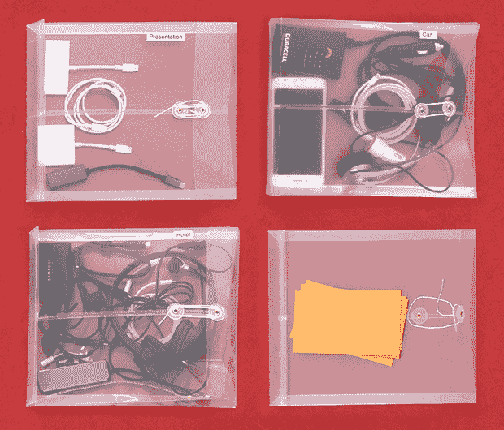

在“演示”中，会有我需要连接到投影仪的适配器(VGA、HDMI 等)。有时会有有线以太网适配器。(对于非常低调的演示，我有时也会带一个微型投影仪。)在“汽车”中，将会有第二部手机可以用作全球定位系统，它有一个磁性背面和一个可以连接到汽车通风口的小东西。将会有一个单声道耳机，一个手机充电器，有时还会有一个为我的电脑设计的微型逆变器。如果我带着卫星电话，还会有一个车载套件，带有一个贴在车顶的天线，所以它可以“看到”卫星。在“酒店”里，会有一个双耳耳机、第二个电脑充电器和一个装有我电脑的加密备份的磁盘，以防我丢失了电脑，不得不购买和配置一台新电脑。第四个塑料信封是用来存放我在旅途中得到的东西的，里面装着小信封——大约一天一个——我把名片放在里面。

几年前，我总是带着一个小的白噪音风扇来掩盖背景噪音，尤其是在晚上。但在某个时候我意识到我不需要一个物理风扇，相反我只是有一个模拟它的应用程序(我以前用粉红噪音，但现在我只是用“空调声音”)。预测一个人将要遇到的外界噪音(比如说，第二天早上)会有多大，以及应该将屏蔽声音设置为多大，这通常是一个挑战。事实上，当我写这篇文章时，我意识到我应该使用 Wolfram 语言的现代音频处理技术来听外部声音，并调整掩蔽声音来覆盖它们。

我旅行时需要的另一件东西是一个钟。现在它只是我电脑上运行的一段 Wolfram 语言代码。但是因为它是软件，它可以有一些额外的功能。我总是让我的电脑处于我的家乡时区，所以“时钟”有一个滑块来指定当地时间(是的，如果我再次处于[半小时时区](https://www.wolframalpha.com/input/?i=time+in+alice+springs)，我必须调整代码)。它还有一个按钮启动睡眠定时器。当我按下它时，它会启动一个倒计时器，不管我的生物钟会怎么说，它都会让我知道我已经睡了多久。(启动睡眠计时器还会发送一封电子邮件，让我的助手知道我是否能参加第二天一早的会议。右上角的“鼠标角”是一个防止电脑进入睡眠状态的黑客。)

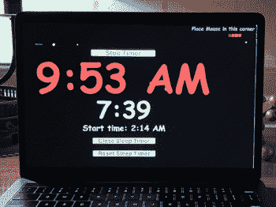

只要可行，我喜欢自己开车去一些地方。在手机出现之前，这是一个不同的故事。但是现在，如果我开车，我就是在打电话。我将召开不需要我查看任何为我的“开车时间”安排的会议(而且，是的，在我的手机中设置标准电话会议号码很好，这样我就可以语音拨号)。我还保留了一份“边开车边打电话”的清单，我可以边开车边打电话，尤其是当我处于一个不寻常的时区时。

我一直有一个问题，如果我试图在别人开车的时候用电脑工作，我会晕车。我以为我什么都试过了。大型汽车。小车。硬悬挂。软悬挂。前排座位。后座。什么都没用。但是几年前，很偶然地，我试着用大的降噪耳机听音乐——我没有晕车。但是如果我在开车的时候想一边用电脑一边打电话呢？好吧，在 2018 年[消费电子展](https://www.ces.tech/)上，尽管我的[儿子](https://www.christopherwolfram.com/)告诫我“不能因为你看不出他们在摊位上卖什么，就认为它很有趣”，我还是在一个摊位前停下来，买了这些奇怪的东西，尽管看起来有点奇怪，但似乎确实可以防止我晕车，至少在大多数时候是这样:

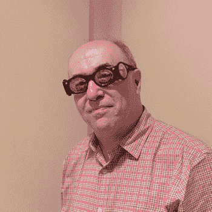

## 发表演讲

我给很多听众做了很多演讲。我特别喜欢谈论我以前没有谈论过的话题。我给最棒的商业、技术和科学团体做演讲。我给小学生演讲。我喜欢与观众互动(问答总是我最喜欢的部分)，我喜欢随性而为。我基本上总是以现场编码结束。

我年轻的时候去过很多地方。早在 20 世纪 80 年代，我就有便携式电脑了(我的第一台是 1981 年的 [Osborne 1](https://en.wikipedia.org/wiki/Osborne_1) ，尽管在那个年代，我保持电脑工作效率的唯一方法是把[工作站电脑](https://en.wikipedia.org/wiki/Sun-1)运到我的目的地。然后在 20 世纪 90 年代初，我决定不再去旅行(尤其是因为我当时正忙于一门新的科学)。所以有一段时间我基本上不做任何演讲。但是后来科技进步了。通过视频会议进行演讲开始变得现实。

我经历了几代技术，但几年前，我在地下室搭建了一个视频会议系统。“布景”可以各种方式重新配置(讲台、桌子等。)但基本上我有一个背投屏幕，在上面我可以看到远处的观众。摄像机在屏幕前面，我正看着它。如果我使用笔记或脚本(实际上很少)，我会有一个自制的提词器，由一面半镀银的镜子和一台笔记本电脑组成，我可以通过它看着摄像机。

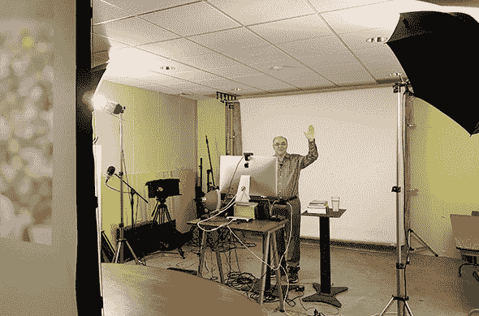

虽然我在现场编码时直视镜头在技术上是可行的，但这让观众觉得我好像在凝视太空，这看起来很奇怪。当我明显在看屏幕的时候，最好稍微向下看。事实上，对于一些设置来说，让观众在屏幕底部看到电脑的顶部是很好的，可以“解释”我正在看的东西。

视频会议在许多场合下都能很好地工作(为了一些额外的乐趣，我有时会使用远程呈现机器人)。但最近几年(部分是因为我的孩子们想和我一起旅行)，我觉得旅行是可以的——我去过很多地方:

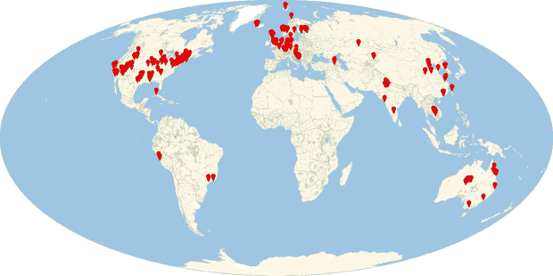

我通常会做演讲——通常一天几次。我也逐渐制定了一份详细的清单，上面列有让它们运转的必要条件。一个高度合适、足够水平的讲台，让我可以在电脑上轻松打字(最好不要太大，以免被观众看到)。可连接的麦克风让我的双手可以自由打字。让我可以连接到我们的服务器的网络连接。当然，为了让观众真正看到东西，一台电脑投影仪。

我记得我在 1980 年使用的第一台电脑投影仪。这是一个[休斯的“液晶光阀”](http://www.hrl.com/about/history)，一旦我把它连接到一个阴极射线管终端，它工作得很漂亮。从那以后的几年里，我在世界各地使用电脑投影仪，无论是在最华丽的视听场合，还是在设备陈旧、基础设施落后的偏远地区。令人惊讶的是它是如此的随机。在人们无法想象投影仪会工作的地方，它会很好。在人们想象不到它不起作用的地方，它会可怕地失败。

几年前，我在 TED 做了一个演讲——用了一些我见过的最先进的视听设备。这是事情失败的地方之一。幸运的是，我们前一天做了一个测试。但是我花了整整三个小时才让顶级的电脑投影仪成功地将我的电脑屏幕投影出来。

作为那次经历的结果，我决定更好地理解计算机如何与投影仪交流。这是一项复杂的工作，包括让计算机和投影仪协商找到分辨率、宽高比、帧速率等。这对他们俩都适用。在底层，有一些被称为 [EDID 字符串](https://en.wikipedia.org/wiki/Extended_Display_Identification_Data)的东西被交换，这些通常会被混淆。近年来，计算机操作系统在处理这方面已经变得更好了，但对于高知名度、高生产价值的事件，我有一个小盒子，它模仿 EDID 字符串，强迫我的计算机发送特定的信号，不管投影仪似乎要求它做什么。

我做的一些演讲完全是即兴的。但是我经常会有笔记——偶尔甚至会有剧本。我会一直把这些写在 Wolfram 笔记本上。然后，我有代码对它们进行“分页”，基本上是在每页的末尾复制“段落”，所以我可以自由地“翻页”。在过去的几年里，我习惯把这些笔记转移到一个 iPad 上，每当我触摸它的屏幕时，我就把它设置成“翻页”。但近年来，我实际上只是同步文件，用我的小电脑记笔记——这有一个好处，我可以在开始演讲的那一刻编辑它们。

除了笔记之外，我有时还会有一些我想立刻带到演讲中的材料。现在我们有了新的[演示工具系统](http://www.wolfram.com/presenter-tools/)，我可以开始创作更多类似幻灯片的材料了。但这不是我传统的工作方式。相反，我通常只需要输入一段我想输入的特定的 [Wolfram 语言](https://www.wolfram.com/language/)代码，而不必花时间明确地键入它。或者，我可能想从“幻灯片农场”中挑选一张我想立即放在屏幕上的图片，比如回答一个问题。(例如，在细胞自动机的[幻灯片中，关于投影仪分辨率有很多技巧，因为除非它们是“](https://www.wolframscience.com/nks/chap-3--the-world-of-simple-programs/)[像素完美的](https://reference.wolfram.com/language/ref/PixelConstrained.html)”，否则它们会混淆——仅仅像典型的幻灯片软件那样缩放它们是不够的。)

那么，我如何处理带进这些材料？嗯，我有第二台显示器连接到我的电脑，它的图像没有被投影。(是的，这可能会导致 EDID 琴弦可怕的缠结。)然后在第二个显示器上，我可以点击或复制一些东西。(我有一个 Wolfram 语言函数，它会记录输入和 URL，并为我制作一个调色板，我可以单击它来输入输入，打开网页等。)

在过去，我们曾经有一个小的第二显示器连接到我的笔记本电脑上，本质上是一个脱离实体的笔记本电脑屏幕。但是把它和投影仪连接到我的笔记本电脑上需要各种各样的组装设备(有时一个是 USB，一个是 HDMI，等等。)但现在我们可以只使用一台 iPad——而且都是纯软件(尽管与投影仪的交互仍然可能很挑剔):

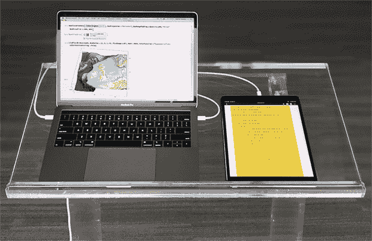

有一段时间，只是为了时尚，我用的是一台外壳上有一个尖钉的电脑，而且是背光的。但是里面的小菱形有点脆弱，所以现在我在电脑上大多只使用“尖尖的皮肤”:


## 我的文件系统

我整天使用的三个主要应用程序是:Wolfram 桌面、网络浏览器和电子邮件。我的主要工作方式是创建(或编辑)Wolfram 笔记本。以下是我今天写的几个笔记本:

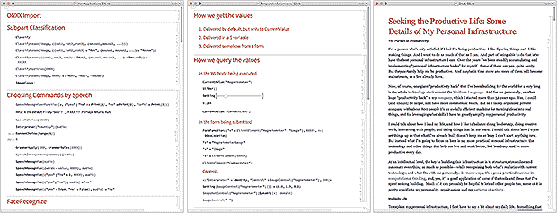

顺利的话，我会在 Wolfram 笔记本上输入至少 25000 个字符(是的，我会记录我所有的击键动作)。我总是将我的笔记本组织成章节和子章节等等(非常方便的是，它们自动存在于分层的单元格中)。有时我会在笔记本上写大部分文字。有时我会从别处截屏一些东西，然后粘贴进去，作为记笔记的一种方式。根据我正在做的事情，我也会在笔记本上进行计算，输入 Wolfram 语言，得到结果，等等。
T3】

这些年来，我已经积累了超过 10 万本笔记本，代表了产品设计、计划、研究、写作，以及基本上我所做的一切。所有这些笔记本最终都存储在我的文件系统中(是的，我与云同步，使用云文件和文件服务器等。)而且我还努力让我的文件系统井井有条——结果我通常可以通过浏览我的文件系统找到我要找的任何笔记本，比我制定搜索的速度还要快。

我相信我第一次认真思考如何组织我的文件是在 1978 年(那也是我开始使用 Unix 操作系统的时候)。在过去的 40 年里，我基本上经历了五代文件系统组织，每一代基本上都反映了我在人生的那个阶段是如何组织我的工作的。

例如，在 1991 年到 2002 年期间，当我在写我的巨著 *[【一种新的科学](https://www.wolframscience.com/nks/)* 时，我的文件系统的很大一部分是简单地按照书中的章节组织的:

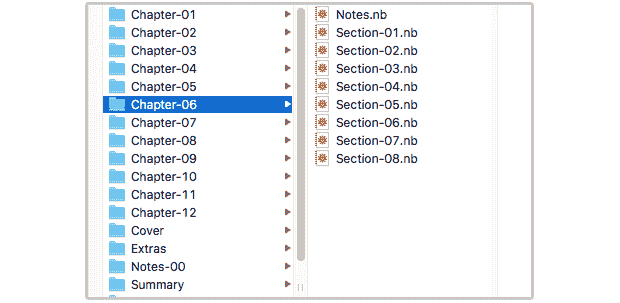

非常令人满意的是，今天我可以立即从书的[在线版本中的图像转到创建它的笔记本(Wolfram 语言的稳定性意味着我可以立即再次运行笔记本中的代码——尽管有时它可以用更简化的方式编写)。](https://www.wolframscience.com/nks/)

这本书的各个部分基本上都放在我的“第三代”文件系统的 NewScience/Book/Layout/ 文件夹中。文件系统的另一部分是新闻科学/图书研究/主题。在这个文件夹中有大约 60 个子文件夹，以我在写书时研究的广泛主题命名。在每个文件夹中，都有我在研究这些主题时所做的特定项目的子文件夹，这些子文件夹通常会变成书中的特定章节或笔记。

我对计算机文件系统的一些想法来自于我在 20 世纪 70 年代和 80 年代对物理文件系统的体验。当我还是一个研究物理的青少年时，我贪婪地复印论文。起初，我认为将这些文件归档的最好方法是将它们分成许多不同的类别，每一类别存放在不同的物理文件夹中。我认真思考了这些类别，常常对将一篇特定的论文与一个特定的类别联系起来的聪明做法感到非常满意。我的原则是，如果一个类别中积累了太多的论文，我应该把它分成新的类别。

所有这一切起初似乎是一个好主意。但很快我意识到事实并非如此。因为很多时候，当我想找到一篇特定的论文时，我不知道是什么样的聪明让我把它和什么类别联系起来。结果是我完全改变了我的方法。我没有坚持狭窄的类别，而是允许宽泛的类别——结果我可以很容易地将 50 篇或更多的论文归入一个类别(通常最终会为一个给定的类别找到多个塞满的物理文件夹):

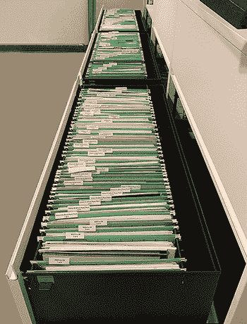

是的，这意味着我有时不得不翻阅 50 多份文件来找到我想要的。但实际上这不会超过几分钟。即使一天发生几次，这仍然是一个巨大的胜利，因为这意味着我实际上可以成功地找到我想要的东西。

今天，我对我的计算机文件系统的某些部分有着几乎相同的原则。例如，当我收集关于某个主题的研究资料时，我会把它们全部放入一个以该主题命名的文件夹中。有时候我甚至会这样做好几年。然后当我准备好做那个题目时，我会浏览文件夹，挑出我想要的。

这些天来，我的文件系统被分为一个活动部分(我不断地将它同步到我所有的计算机上)和一个更具归档性的部分，我将它保存在一个中央文件服务器上(例如，它包含我的老一代文件系统)。

在我的活动文件系统中只有几个顶层文件夹。一个叫做事件。其子文件夹是 years。在每一年里，我都会有一个文件夹，存放我那一年参加的每一个户外活动。在那个文件夹里，我会存放关于这次活动的材料，我在那里演讲时用的笔记本，我在活动中做的笔记等等。由于在某一年我不会参加超过 50 个活动，所以很容易浏览某一年的活动文件夹，并找到特定活动的文件夹。

另一个顶级文件夹叫做设计。它包含了我所有关于 Wolfram 语言的设计工作和我们正在构建的其他东西的笔记。目前大约有 150 个文件夹，涉及不同的设计活动领域。但是也有一个名为档案的文件夹，其中包含了关于不再活跃的早期地区的文件夹。

事实上，这是我的文件系统中面向项目部分的一般原则。每个文件夹都有一个名为 ARCHIVES 的子文件夹。我试图确保主文件夹中的文件(或子文件夹)总是处于活动或挂起状态；任何处理完的东西我都放在档案室。(我把名字用大写字母，这样它在目录列表中就很突出了。)

对于大多数项目，我再也不会看档案中的任何东西。但是如果我想的话，当然很容易做到。简单的事实很重要，因为这意味着我不用担心说“这已经结束了；让我们把它放在档案馆，即使我认为有一些机会它可能会再次活跃。

碰巧的是，这种方法在某种程度上受到了我看到的物理文档的启发。20 世纪 80 年代初，当我在贝尔实验室咨询时，我看到我的一个朋友在他的办公室里放了两个垃圾桶。当我问他为什么时，他解释说，一个是真正的垃圾，另一个是缓冲区，他会把他认为可能再也不想要的文件扔进去。他会让缓冲区的垃圾桶装满，一旦装满，他会扔掉里面较低的文件，因为从他没有把它们捞出来的事实来看，他认为如果它们被永久扔掉，他可能永远不会想念它们。

不用说，我并不完全遵循这种方法，事实上我保留了所有东西，无论是数字的还是纸质的。但关键是,存档机制给了我一种轻松保存资料的方法，同时还能轻松查看所有活动的内容。

我还有一堆其他的约定。当我在做设计时，我通常会把我的笔记保存在名为`Notes-01.nb`或`SWNotes-01.nb`的文件中。这就像我的没有太多文件类别的原则:我不倾向于对设计的不同部分进行分类。我只是按顺序给我的文件编号，因为通常它是最近的——或最近的几个——当我继续一个特定的设计时是最相关的。而如果文件只是按顺序编号，就很容易找到；人们不会试图去记起自己给某个特定的方向或想法取了什么名字。

很久以前，我开始总是把我的顺序文件命名为`file-01`、`file-02`等等。这样，几乎任何排序方案都会按顺序对文件进行排序。是的，我确实经常去`file-10`等地。但是这么多年来，我还没有接近过`file-99`。

## 知道把所有东西放在哪里

当我专门处理一个特定的项目时，我通常只使用与该项目相关的文件夹中的文件。但是在顺利的一天，我会对很多不同的项目有很多想法。我每天还会收到数百封电子邮件，与各种不同的项目有关。但通常要过几个月或几年，我才会真正准备好专注于这些项目中的一个。所以我想做的是把我积累的材料储存起来，这样即使在很久以后，我也能很容易地找到它。

对我来说，东西应该放在哪里通常有两个维度。首先是(毫不奇怪)它的内容。但是第二个是我可能使用它的项目类型。它会与某个产品的某个特性相关吗？它会成为我写的某篇文章的原材料吗？这是学生项目的种子吗，比如说在我们的[年度暑期学校](https://education.wolfram.com/summer/)？诸如此类。

对于某些类型的项目，我存储的材料通常由一个完整的文件或几个文件组成。对于其他人，我只需要储存一个能用几句话或几段话概括的想法。因此，举例来说，学生项目的[种子通常只是一个想法，我可以用一个标题来描述，也许还有几行解释。在任何一年，我只是不断地在一个笔记本上添加这样的项目想法——例如，在我们的](https://writings.stephenwolfram.com/2017/08/high-school-summer-camp-a-two-week-path-to-computational-thinking/)[年度夏季项目](https://education.wolfram.com/summer/)之前，我会查看并总结这些想法。

对于我可能要写的这样的作品，有点不同。在任何给定的时间，可能有 50 篇我正在考虑写的文章。我所做的就是为他们每个人创建一个文件夹。每个文件通常都有类似于`Notes-01.nb`的名字，我在里面积累具体的想法。但是这个文件夹也会包含完整的文件，或者文件组，这些都是我积累的关于文章主题的文件。(有时我会把这些组织成子文件夹，命名为探索和材料。)

在我的文件系统中，我有不同类型项目的文件夹:作品、设计、学生项目等。我发现只有适度数量的这样的文件夹很重要(即使我的生活相当复杂，也不会超过十几个)。当有东西进来的时候——比如一封电子邮件、一段对话、或者我在网上看到的东西，或者只是我的一个想法——我需要能够快速判断出它可能与什么类型的项目(如果有的话)相关。

在某种程度上，这就像“我应该把它放在什么文件中”一样简单。但关键的一点是要有一个预先存在的结构，使它能够快速做出决定，然后让这个结构成为一个我可以随时找到甚至是遥远未来的事情的结构。

有很多棘手的问题。尤其是随着时间的推移，一个人命名或思考一个话题的方式可能会改变。有时这意味着在某个时候我会重命名一个文件夹或类似的东西。但对我来说，最重要的是，在任何给定的时间，我主动放东西的文件夹的总数足够小，我基本上可以记住所有的文件夹。对于不同类型的项目，我可能有十几个文件夹。然后，其中一些将需要关于特定主题的特定项目的子文件夹。但是我尽量把“活动积累文件夹”的总数限制在几百个。

其中一些“积累文件夹”我已经用了十几年了。少数会在几个月内出现和消失。但是大多数最多持续几年——基本上是从我构思一个项目到项目实际完成的这段时间。

这并不完美，但我最终维护了两个层次的文件夹。第一个，也是最重要的，在我的文件系统中。但是第二封在我的邮件里。我将材料保存在电子邮件文件夹中有两个基本原因。首先是即时的便利。收到一封邮件，我想“它与我计划做的某个项目相关”，我想把它放在一个合适的地方。嗯，如果那个地方是一个邮件文件夹，我所要做的就是用一个鼠标动作(或者可能用一个触摸条按钮的按压)来移动邮件。例如，我不必找到一个文件或文件系统文件夹来存放它。

让邮件保持原样还有另一个原因:线程。在 Wolfram 语言中，我们现在已经拥有了[导入邮箱](https://reference.wolfram.com/language/ref/format/MBOX.html)和[连接到实时邮件服务器](https://reference.wolfram.com/language/guide/HandlingLiveMailboxes.html)的能力。人们很快就会发现电子邮件对话的图表(实际上是超图)有多复杂。邮件客户端作为一种查看这些对话的方式当然并不完美，但是使用一个客户端比拥有一组单独的文件要好得多。

当项目定义得相当好，但还不是很活跃时，我倾向于使用文件系统文件夹，而不是电子邮件文件夹。通常来说，关于这些项目的进来的都是相当孤立的(非线程化的)邮件。我发现最好的方法是将这些邮件拖到适当的项目文件夹中，或者将它们的内容复制出来并添加到笔记本中。

当一个项目非常活跃时，可能会有很多关于它的邮件，保留线程结构很重要。当一个项目还没有很好的定义时，我只想把所有的东西都放在一个“桶”里，而不必考虑把它组织到子文件夹、笔记本等等。

如果我查看我的邮件文件夹，我会在我的文件系统中看到许多并行的文件夹。但我看到一些没有，特别是与长期项目概念相关的。我有很多这样的文件夹，已经放了十多年了(我目前的邮件文件夹组织大约有 15 年了)。有时候他们的名字并不完美。但是很少有足够多的文件夹，而且我已经看了足够长的时间，以至于我能感觉到我在它们里面放了些什么，尽管它们的名字并不能很好地表达这种感觉。

当我准备好做一个项目时，我总是非常满意，我打开它的邮件文件夹，开始查看邮件，通常是很久以前的。就在过去的几周里，当我们完成了 Wolfram 语言的一个主要新版本时，我开始向前看，并且我已经浏览了从 2005 年开始的信息的文件夹，等等。当我保存这些信息时，我还没有一个明确的项目框架。但现在我知道了。因此，当我浏览邮件时，我可以快速地将它们放入相应的活动笔记本中，等等。然后我从邮件夹中删除邮件，最后，一旦邮件夹空了，就删除整个邮件夹。(与文件不同，我觉得为邮件准备一个 ARCHIVES 文件夹没什么用；邮件太大了，而且不够有条理，所以要找到任何特定的项目，我可能最终不得不搜索它，当然，我肯定会存储我所有的邮件。)

好，我有我的文件系统，我有邮件。在我们公司，我们也有一个广泛的项目管理系统，以及各种数据库、请求跟踪器、源代码控制系统等。我目前工作的性质并没有让我直接与它们互动，我也没有明确地将我自己的个人产出存储在其中。在不同的时间，不同的项目，我都这样做了。但现在我与这些系统的互动基本上只是作为一个观众，而不是一个作者。

除了这些系统之外，我还有很多基本上通过网页进行互动的东西。这些可能是公共网站，如 wolframalpha.com 的或 wolfram.com 的[的](https://wolfram.com/)。它们可能是我们公司的内部站点。它们可能是未来的[公共网站](http://www.wolfram.com/resources)或基于网络的服务的初步版本(比如“测试”或“开发”)。我有一个个人主页，可以方便地访问所有这些内容:

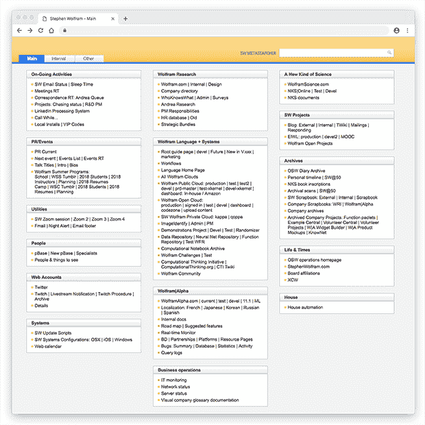

主页的来源是(不用说)一个 Wolfram 笔记本。我可以在我的文件系统中编辑这个笔记本，然后按一个按钮将一个版本部署到 [Wolfram Cloud](http://www.wolfram.com/cloud/) 。我在我的网络浏览器中有一个扩展，这样每当我创建一个新的浏览器窗口或标签时，最初的内容将是我的个人主页。

当我要开始做一件事的时候，我会去几个地方。一个是这个网页，我每天都要访问数百次。另一个是我的电子邮件及其文件夹。另一个是我的桌面文件系统。基本上唯一有意义的是我的日历系统。

时不时会看到别人的电脑，他们的桌面会堆满文件。我的桌面完全是空的，纯白的(方便全屏分享和直播)。如果在我的桌面上看到任何文件，我会感到很尴尬。我认为这是我努力保持工作有序失败的标志。这同样适用于普通文件夹，如文档和下载。是的，在某些情况下应用程序等。会把文件放在那里。但是我认为这些目录是一次性的。我不打算让它们成为我长期组织结构的一部分。它们没有同步到云端，也没有在我不同的电脑上同步。

不管我的文件是怎样组织的，它们的一个特点是我保存它们很长时间。事实上，我最早的文件日期是 1980 年。当时，有一种东西有点像云，只不过它被称为[分时度假](https://en.wikipedia.org/wiki/Time-sharing)。实际上，我丢失了一些分时系统上的文件。但是我在本地电脑上的那些仍然在我身边(尽管，公平地说，一些必须从 [9 轨备份磁带](https://en.wikipedia.org/wiki/9_track_tape)中检索)。

今天，我特意将我所有的文件(和所有的电子邮件)都主动存储在内部。是的，这意味着我的地下室里有这个:

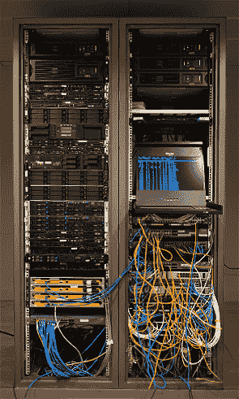

初始存储在标准 RAID 磁盘阵列上。这被备份到我公司总部(大约 1000 英里外)的计算机上，在那里进行标准的磁带备份。(这些年来，我只需要从备份磁带中检索一次。)我还把我比较活跃的文件同步到云端，以及我所有不同的电脑上。

## 所有的小便利

我个人主要的两种输出形式是邮件信息和 Wolfram 笔记本。自从我们首次推出笔记本电脑以来的 30 年里，我们已经优化了我们的笔记本电脑系统，我只需[按一个键就可以创建一个默认的新笔记本](https://reference.wolfram.com/language/ref/menuitem/New.html)，然后我就可以立即开始编写自动变成好看的结构化文档。(顺便说一下，很高兴看到我们[成功地保持了 30 年的兼容性](https://twitter.com/stephen_wolfram/status/1009273778524819456?lang=en):我在 1988 年创造的笔记本仍然可以正常工作。)

然而，有时我会做一个笔记本，与其说是供人使用，不如说是作为一些自动化过程的输入。为此，我使用了各种专门设置的笔记本。例如，如果我想在我们新的 [Wolfram 函数库](https://resources.wolframcloud.com/FunctionRepository)中[创建一个条目](https://resources.wolframcloud.com/FunctionRepository/Unnamed-Function.nb)，我只需转到菜单项(在任何[版本 12 系统](https://twitter.com/stephen_wolfram/status/1097690425832456192)中可用)文件 > 新的 > 库条目 > 函数库条目:


这有效地“提示”我添加条目和部分。当我完成时，我可以按下 Submit to Repository 将笔记本发送到我们的中央队列进行存储库项目评审(并且，仅仅因为我是 CEO 并不意味着我可以避开评审过程——或者想避开)。

实际上，我创建了相当数量的内容，这些内容是为进一步处理而构建的。一大类是 [Wolfram 语言文档](https://reference.wolfram.com/language/)。为了创作这个，我们有一个内部系统，我们称之为 DocuTools，它基于一个经过多年开发的巨大调色板，我经常说它让人想起复杂的飞机驾驶舱:

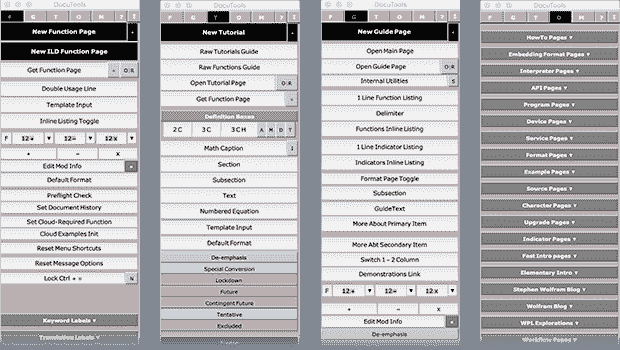

DocuTools 的想法是使创作文档时尽可能符合人体工程学。它有 50 多个子面板(上面显示了几个)，总共不少于 1016 个按钮。如果我想为 Wolfram 语言功能打开新页面，我只需按下新功能页面，弹出:

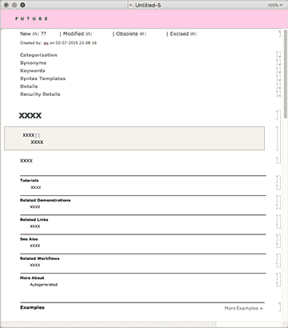

这一页非常重要的部分是顶部写着“未来”的条纹。这意味着，即使页面将被存储在我们的源代码控制系统中，它还没有准备好:它只是我们为未来考虑的东西。构建我们的官方文档的系统会忽略这个页面。

通常我们(实际上通常指的是我)会在函数实现之前为函数编写文档。我们将包括关于函数应该具有的特性的各种细节。但是当该功能实际上第一次实现时，其中一些功能可能还没有准备好。为了解决这个问题，我们(我们称之为“未来化”文档的一部分，给它一个非常明显的粉红色背景。它仍然存在于源代码控制系统中，我们每次查看文档页面的源代码时都会看到它。但是，当人们将看到的文档页面建立时，它不包括在内。


DocuTools 当然是用 Wolfram 语言实现的，大量使用了 Wolfram 笔记本的符号结构。多年来，它已经发展到可以处理许多不完全是文档的东西；事实上，对我来说，它已经成为几乎所有基于笔记本的内容的主要创作中心。

例如，有一个按钮，用于史蒂夫·沃尔夫勒姆博客。按下它，你就可以得到一个标准的笔记本。但是在 DocuTools 中有一系列的按钮，允许用户插入建议和编辑。当我写了一篇博客后，通常会有这样的反馈:

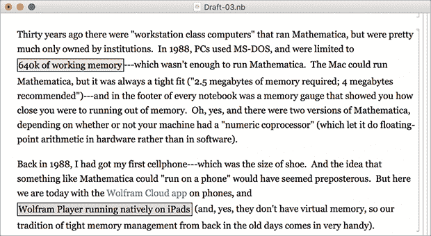

粉色方框表示“你真的需要解决这个问题”；谭是“这里的一个评论”。点击其中一个，出现一个小表格:

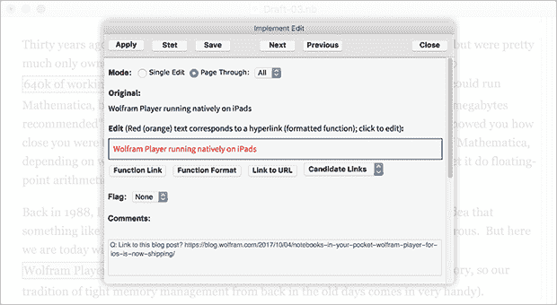

当然，世界上有大量的变更跟踪和标记系统。但是有了 Wolfram 语言，创建一个针对我的需求进行优化的自定义语言变得很容易，所以这就是我所做的。在我有这个之前，通常要花好几个小时来浏览编辑建议(我记得一次可怕的 17 小时飞机旅行，我几乎花了所有的时间来浏览一篇[单篇文章](https://writings.stephenwolfram.com/2014/08/computational-knowledge-and-the-future-of-pure-mathematics/)的建议)。但是现在——因为它都是为我优化的——我可以快 10 倍。

通常，为我定制的工具最终会被修改，这样其他人也可以使用它们。一个例子是用于创作课程和创建视频的系统。我希望能够作为“一个人的乐队”来做这件事——有点像我做直播一样。我的想法是创建一个包含要说的单词和要输入的代码的脚本，然后在我浏览脚本时通过实时屏幕录制来制作视频。但是输入是如何工作的呢？我不能用手输入它们，因为那会打断我正在说的话的实时流动。但显而易见的是，只需将它们直接“复制”到笔记本中。

但是这一切应该如何安排呢？我从一个剧本开始:

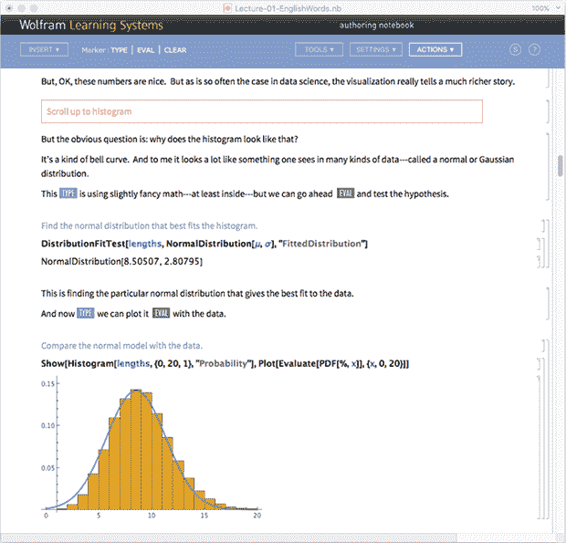

然后我按生成录音配置。一个标题屏幕立即出现在我屏幕的一个区域，我设置了我的屏幕记录系统来记录这个区域。我屏幕上的其他地方是脚本。但是控制呢？嗯，它们只是另一个 Wolfram 笔记本，恰好充当包含按钮的调色板:


但是我如何实际操作这个调色板呢？我不能用我的鼠标，因为那样我会把注意力从正在录制的笔记本上移开。所以我的想法是把调色板放在一个扩展的桌面上，正好显示在 iPad 上。因此，为了“执行”脚本，我只需按下调色板上的按钮。

有一个大大的提前脚本按钮。假设我读到了脚本中的某一点，我需要在笔记本上键入一些内容。如果我想模拟实际打字，我按下慢速打字。这将把输入字符一次一个字符地输入到笔记本中(是的，我们测量了人类打字的[键间延迟分布](https://reference.wolfram.com/language/ref/FindDistribution.html)，并对其进行了模拟)。过了一会儿，看到那些缓慢的打字变得令人讨厌。因此，我只需使用型按钮，即可将所有输入内容立即复制到笔记本中。如果我再次按下按钮，它将执行它的第二个动作:评估。这相当于在笔记本中按下 [`Shift+Enter`](https://reference.wolfram.com/language/workflow/RunAComputation.html) (带有一些可选的额外说明性弹出窗口，适合视频)。

我还可以继续讲述我用 Wolfram 语言构建的其他工具，但这里给出了一种味道。但是我用什么不是 Wolfram 语言呢？嗯，我用的是网络浏览器，通过它可以找到一些东西。尽管如此，我还是经常去 Wolfram Cloud，比如在那里查看或使用云笔记本。

有时我会使用我们的公共 Wolfram 云。但更多时候我会使用私有的 Wolfram 云。我们大多数内部会议的议程都是笔记本，存放在我们内部的 Wolfram 云上。我个人也有一个本地私有的 Wolfram 云在运行，我在上面托管了越来越多的应用程序。

这是目前我电脑上的 dock:


它有一个文件系统浏览器；它有电子邮件客户端。它有三个网络浏览器(是的，我喜欢在多个浏览器上测试我们的东西)。然后我有一个日历客户端。接下来是我们的 VoIP 电话系统的客户端(现在我正在交替使用这个，以及使用音频和我们的屏幕共享系统)。那么，是的，至少现在我有一个音乐应用。我不得不说，我的一天给我一个听音乐的机会是相当难得的。可能我结束做这件事的主要时间是当我在电子邮件上非常落后的时候，当我在数以千计的邮件中苦苦挣扎时，需要一些东西来让我振作起来。然而，当我真正在写一些重要的东西时，我不得不暂停音乐，否则我无法集中注意力。(我必须找到没有人声的音乐——因为我发现如果我听到人声，我就不能全速阅读。)

有时我会启动一个标准的文字处理器、电子表格等。因为我正在打开与这些应用程序之一相关联的文档。但我不得不承认，这些年来，我基本上从未用这些应用程序从头开始创作过文档；我只能用我们的技术来代替。

偶尔我会打开一个终端窗口，直接使用操作系统命令。但是这变得越来越不常见——因为我越来越多地使用 Wolfram 语言作为我的“超级外壳”。(是的，在笔记本中存储和编辑命令非常方便，并且能够立即生成图形化和结构化的输出。)

当我写这篇文章时，我意识到我还没有做一点优化。在我的个人主页上有一些做相当复杂事情的链接。例如，其中一个为我启动了一个计划外直播的过程:它向我们的 24/7 系统监控团队发送消息，以便他们可以接收我的反馈，进行广播，并监控响应。但是我意识到，我仍然有相当多的自定义操作系统命令，可以从源代码库进行更新，我将它们输入到终端窗口中。我需要在我的私有云中设置这些，这样我就可以在我的个人主页上有链接，运行这些命令的 Wolfram 语言代码。(平心而论，其中一些命令非常古老；例如，我的 fmail 命令在未来发送邮件信息，这是近 30 年前写的。)

但是，好吧，如果我看看我的应用程序，有一个明确的优势[尖峰](https://writings.stephenwolfram.com/2018/12/the-story-of-spikey/)的。但是，例如，为什么我需要三个相同的标准 Spikeys 呢？都是 Wolfram 桌面应用。但是它有三个版本。第一个是我们最新的分布式版本。第二个是我们最新的内部版本，通常每天更新。第三个(白色的)是我们的“原型构建”，也每天更新，但有许多“前沿”功能，还没有准备好进行认真的测试。

每天晚上安装这些不同的版本，并向它们正确注册文档类型，需要惊人的操作系统技巧。但是对我个人的工作流程很重要。通常我会使用最新的内部版本(是的，我也有一个包含许多以前版本的目录)，但是偶尔，比如说在某个特定的会议上，我会尝试原型版本，或者我会恢复到已发布的版本，因为有些东西已经坏了。(处理多个版本是云中比较容易的事情之一，我们有一整套不同的配置在内部私有云上运行，有内核、前端和其他版本的各种组合。)

当我做演讲之类的时候，我几乎总是使用最新的内部版本。我发现在观众面前进行现场编码是发现 bug 的一个很好的方法——即使它有时让我不得不解释，正如我所说的，“软件公司首席执行官的疾病”:总是想运行最新的版本，即使它没有经过认真的测试，而且是前一天晚上构建的。

## 存档和搜索

我的个人基础设施的一个关键部分实际上极大地扩展了我的个人内存:我的“元搜索器”。在我个人主页的顶部是一个搜索框。键入类似“犀牛大象”的东西，我会立即找到过去 30 年里我发送或接收的所有出现过它的电子邮件，以及我机器上的所有文件和我档案中的所有纸质文件:

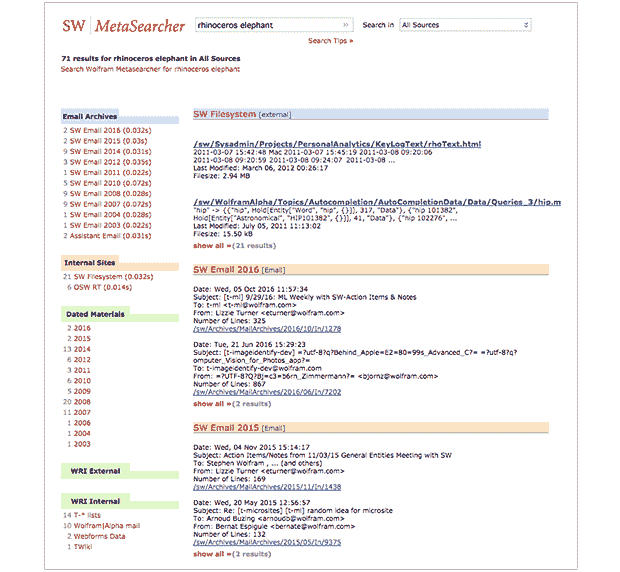

对我来说，按年份统计信息非常方便；它经常帮助我记住我所问问题背后的历史或故事。(在这种情况下，我可以看到 2008 年的一个高峰，那时我们正准备发射[Wolfram | Alpha](https://www.wolframalpha.com/)——我正在处理许多种类的数据，包括物种。)

当然，让我的元搜索器工作的一个关键部分是我已经存储了如此多的东西。例如，我实际上有我在过去 30 年中写的所有 815，000 封左右的电子邮件，以及我收到的所有 230 万封(大多数不是垃圾邮件)电子邮件。是的，我拥有一家拥有组织有序的 it 基础设施等的公司，这对我帮助很大。在过去的 32 年里。

当然，电子邮件有一个很好的特点，那就是它“天生就是数字的”。例如，最初在纸上的东西呢？嗯，在我生命的大部分时间里，我一直是一个“信息包”。事实上，从 1968 年我开始上小学开始，我就一直保存着这些文件。从那以后，它们被重新装箱了三次，现在主要的是这样储存的:

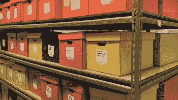

(我也有文件夹存储，用于存储关于人、组织、事件、项目和主题的文档。)大约在 1984 年，我制作纸质文档的速度加快了，但随着我越来越数字化，这一速度迅速下降。我总共有大约 25 万页主要的非批量打印文档——大部分是我早年的文档。

大约 15 年前，我决定需要让这些内容可以被搜索到，所以我启动了扫描所有这些内容的项目。大多数文件只有一页或几页长，所以它们不能用自动送纸器来处理——所以我们用高分辨率相机(当时需要闪光灯)搭建了一个平台。花了几个人一年的工作，但最终所有的文件都被扫描了。

我们自动对它们进行了裁剪和白平衡(使用 T2 的 Wolfram 语言图像处理)，然后 T4 对它们进行了光学字符识别，并将经过光学字符识别的文本作为透明层放入扫描图像中。如果我现在搜索“犀牛”，我会在我的档案中找到 8 个文档。给定搜索词，也许并不奇怪，它们有点随机，包括例如 1971 年复活节我的小学杂志。

OCR 适用于印刷文本。但是手写文本呢？信件，即使是手写的，通常至少会有打印的信头。但是我有很多页手写的笔记，上面基本上什么也没印。纯粹从图像中识别笔迹(没有笔画的时间序列)仍然超出了当前的技术，但我希望我们基于神经网络的机器学习系统能够很快解决这个问题。(方便的是，我有相当多的文档，其中既有我的手写草稿，也有打印版本，所以我希望至少有一个针对我个人笔迹的培训集。)

但即使我不能搜索手写的材料，我也经常可以通过“在正确的盒子里寻找”来找到它。我的主要扫描文件被组织成 140 个左右的盒子，每个盒子涵盖了我生活中的一个主要时期或项目。对于每个框，我可以调出页面的缩略图，分组到文档中。举个例子，这是我 11 岁时学校的地理笔记，还有我演讲的文本:

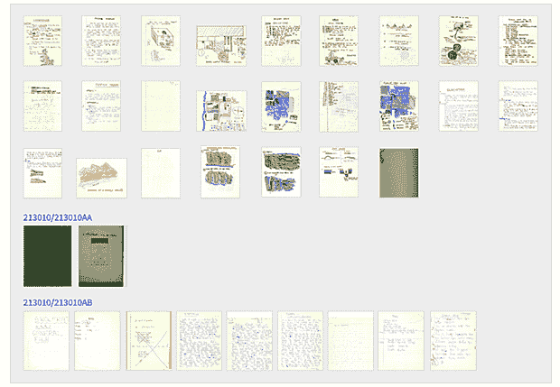

我不得不说，几乎每当我开始翻阅几十年前的扫描文件时，我都会发现一些意想不到的有趣的东西，这些东西经常教会我一些关于自己的事情，以及我如何最终朝着某个特定的方向发展。

它可能是我生活中相当具体的事情，事实上我一直致力于建立长期的东西，以及我在很长一段时间里与许多人保持联系，但我对我几乎每天都遇到的甚至相当古老的个人历史的数量感到惊讶。一些人或一些组织会联系我，我会回头看看 35 年前我与他们的互动信息。或者我会在想一些事情，我会模糊的记得 25 年前我也在做类似的事情，回头看看我做了什么。我碰巧有很好的记忆力，但当我真正看过去的材料时，我总是惊讶于我自己忘记了多少细节。

大约 30 年前，我第一次建立了我的元搜索器。当前版本基于 Wolfram 语言 [`CreateSearchIndex`](https://reference.wolfram.com/language/ref/CreateSearchIndex.html) / [`TextSearch`](https://reference.wolfram.com/language/ref/TextSearch.html) 功能，运行在我的个人私有云上。它使用 [`UpdateSearchIndex`](https://reference.wolfram.com/language/ref/UpdateSearchIndex.html) 每隔几分钟更新一次。元搜索器还“联合”搜索公司网站和数据库的 API 的结果。

但是并不是所有我想要的东西都能通过搜索轻易找到。我找到东西的另一个机制是我的“个人时间线”。多年来我一直想扩展它，但现在它基本上只包含我的外部事件的信息，大约每年 40 次。最重要的部分通常是我的“个人旅行报告”，如果可能的话，我会在 24 小时内认真撰写。

通常旅行报告只是文本(或者至少是笔记本中的文本)。但当我去参加像贸易展览这样的活动时，我通常会带上一个微型相机，每半分钟拍一张照片。如果我戴着一个挂绳姓名标签，我通常会将相机夹在姓名标签的顶部，并将其放在理想的高度，以捕捉我遇到的人的姓名标签。当我写我的个人旅行报告时，我通常会回顾照片，有时会复制一些到我的旅行笔记本上。

但是即使我有各种现有的档案资料来源(现在包括聊天信息、直播等)。)，电子邮件仍然是最重要的。几年前，我决定让人们更容易找到我的电子邮件地址。我的计算是，如果有人想联系我，那么在现代他们最终会找到一种方法做到这一点，但如果他们很容易发送电子邮件，这就是他们联系我的方式。是的，公开我的电子邮件地址意味着我会收到很多来自世界各地我不认识的人的电子邮件。诚然，其中一些[很奇怪](https://writings.stephenwolfram.com/2016/04/who-was-ramanujan/)，但很多都很有趣。我试着查看所有信息，但它也会被发送到一个请求跟踪系统，这样我的员工就可以确保重要的事情得到处理。(人们有时会觉得在电子邮件主题行中看到像 SWCOR #669140 这样的请求跟踪器票证元数据有点奇怪，但我认为这是确保电子邮件得到实际响应的小小代价。)

我可能会提到，几十年来，电子邮件一直是我们([地理位置分散的](http://www.wolfram.com/company/careers/locations/))公司内部的主要沟通方式。有，我们有项目管理，源码控制，CRM 等系统，还有聊天。但至少对我接触的公司部门来说，电子邮件是压倒性的优势。有时是人们之间发送的个人邮件。有时候是邮件群。

长期以来，我们的电子邮件群比员工还多一直是个笑话。但是我们已经很小心地组织了这些组，例如通过名称的前缀来识别不同的类型(t-是项目团队的邮件列表，d-是部门的邮件列表，l-是更开放的邮件列表，r-是自动报告的邮件列表，q- a 请求列表，等等。)至少对我来说，这使我有可能记住我要发送的邮件的正确列表。

## 人和事物的数据库

我认识很多人，他们来自我生活的不同领域。早在 20 世纪 80 年代，我只是把它们的列表保存在一个文本文件中(在那之前是一个手写的地址簿)。但到了 20 世纪 90 年代，我决定需要为自己建立一个更系统的数据库，并创建了我开始称之为 pBase 的东西。最近几年，pBase 的原始技术开始变得有点像旧石器时代，但是我现在有了一个使用 Wolfram 语言的现代实现，运行在我的个人私有云上。

一切都很好。我可以按姓名或属性搜索人，或者，例如，如果我要去某个地方，我可以让 pBase 向我显示一张地图，显示附近有哪些人的最新信息:

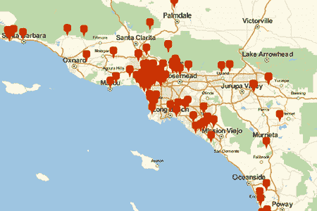

pBase 和社交网络有什么关系？我有一个[脸书账户](https://www.facebook.com/stephenwolfram)已经有很长时间了，但是它的管理很糟糕，而且似乎总是拥有尽可能多的朋友。 [LinkedIn](https://www.linkedin.com/in/stephenwolfram/) 我对待这个问题要认真得多，只有当我真的和他们交谈过的时候，我才会添加他们(我目前有 3005 个联系人，所以，是的，我和很多人交谈过)。

非常方便的是，我可以通过 [`ServiceExecute`](https://reference.wolfram.com/language/ref/ServiceExecute.html) 从我的 LinkedIn 账户中[下载数据来更新 pBase 中的内容。但是 LinkedIn 只抓住了我认识的一小部分人。还不包括我很多比较突出的朋友和熟人，还有大部分学者，很多学生等等。](https://reference.wolfram.com/language/ref/service/LinkedIn.html)

最终，我可能会让 pBase 得到更多的开发，也许会让这项技术普遍可用。但在我们公司内部，已经有一个系统可以说明一些潜在的愿望:我们的内部公司目录，它运行在我们的内部私有云上，基本上使用 Wolfram|Alpha 风格的自然语言理解，让人们提出自然语言问题。

我可能会提到，除了我们的公司名录，我们还维护着另一个数据库，我至少发现它非常有用，特别是当我试图找出谁可能知道一些不寻常问题的答案，或者我们可能会为一些新项目找到谁的时候。我们称之为我们的谁知道是什么数据库。对每个人来说，它提供了一个经验和兴趣的侧面。这是我的条目(而[这是问题细节的来源](https://www.wolframcloud.com/objects/sw-blog/PersonalInfrastructure//WhoKnowsWhatSubmission.nb)):

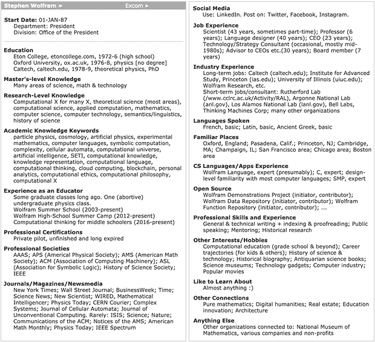

就个人数据库而言，另一个对我有用的是我拥有的书籍数据库。在过去十年左右的时间里，我没有买过太多的书，但在那之前，我积累了大约 6000 册图书，这并不罕见——尤其是当我在做更多以历史为导向的研究时——我会想查阅相当多的书籍。但是应该如何组织它们呢？像[杜威十进制分类法](https://en.wikipedia.org/wiki/Dewey_Decimal_Classification)或[国会图书馆](https://en.wikipedia.org/wiki/Library_of_Congress_Classification)这样的“大”分类法有些矫枉过正，而且也不太符合我个人的主题“认知地图”。

就像我的文件系统文件夹，或者我的文件物理文件夹，我发现最好的方案是把书放入相当广泛的类别中——数量足够少，以至于我可以在空间上记住它们在我的图书馆中的位置。但是图书在一个类别内应该如何排列呢？

好吧，在这里我要讲一个警示性的故事(我妻子经常用它作为例子),告诉你在我的方法中会出什么问题。我总是喜欢了解思想的历史进程，我认为能够按照历史顺序(比如说，按照首次出版日期)浏览书架上的书籍类别会很好。但是这使得很难找到一本特定的书，或者，例如，重新保存它。(如果书的书脊上印有出版日期，那就更容易了。但是他们没有。)

大约 20 年前，我准备把我所有的书搬到一个新的地方，用不同长度的书架。我还遇到了如何在新书架上安排图书类别的问题(“量子场论有多少线性英尺，它能放在哪里？”)所以我想:“为什么不直接测量每本书的宽度，同时测量它的高度和颜色呢？”因为我的想法是，然后我可以制作每个书架的图形，用真实的宽度和颜色显示书籍，然后在图形中放一个箭头来指示特定书籍的位置(从其他书籍的“地标”中很容易识别)。

我买了一个色度计(在普遍的数码相机出现之前),开始进行测量。但事实证明，这比预期的劳动强度要大得多，而且不用说，在书籍不得不被转移之前，它并没有完成。与此同时，在书被搬走的那一天，人们注意到，如果不只是从书架上拿走一本书，而是把其他书放在边上，包装盒就能装下更多的书。

结果是 5100 本书到了，基本上是按照随机顺序排列的。把它们分类花了三天时间。在这一点上，我决定保持简单，在每个类别中按作者的字母顺序排列。这在找书的时候当然很管用。但是我的大型图书清单项目的一个结果是，我现在确实有了一个很好的，[可计算版本](https://datarepository.wolframcloud.com/resources/Books-in-Stephen-Wolframs-Library)至少是所有与写作 *[一种新的科学](https://www.wolframscience.com/nks/)* 有关的书，它实际上在 [Wolfram 数据仓库](https://datarepository.wolframcloud.com/):

|  ```
ResourceData["Books in Stephen Wolfram's Library"]
```  |

## 个人分析

2012 年，我写了一篇关于个人分析和我收集的数据的文章。那时，我的档案里有大约 30 万封待发邮件；现在又多了 50 万封，我可以扩展我每天发送的电子邮件:

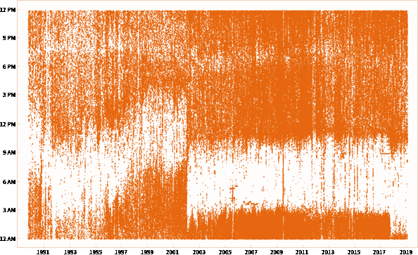

(大块空白区域是我睡觉的时候，是的，因为我改变了项目——例如在 2002 年完成了一门新的科学——我的睡眠习惯也改变了；我现在也在尝试一个早睡的实验。)

我有保存各种数据的系统，包括我输入的每一个按键，我走的每一步，以及我的电脑屏幕每一分钟的样子(可悲的是，这种电影非常乏味)。我还有各种医疗和环境传感器，以及来自与我交互的设备和系统的数据。

偶尔拿起那些 [Wolfram Data Drop](https://datadrop.wolframcloud.com/) databins，并用它们在我的生活中做一些数据科学，这很有趣。没错，从广义上来说，我发现自己非常稳定和习惯——然而每天都有不同的事情发生，让我的“生产力”(以各种方式衡量)来回波动，通常看似随机。

但是关于收集所有这些数据的一件事是，我可以用它来创建仪表板，我发现这些每天都很有用。例如，在我的私有云中运行的是对我的电子邮件的监控系统:

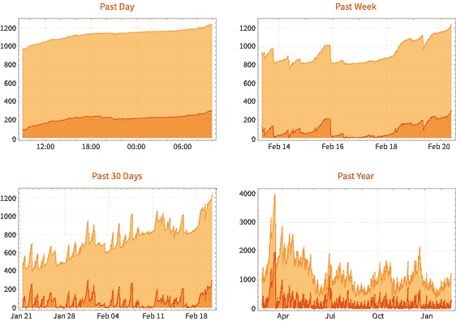

黄色曲线是我的待处理邮件总数；红色是我还没打开的号码。这些曲线对我生活中的各种特征都非常敏感，例如，当我在某个项目上紧张工作时，我会经常看到我的电子邮件“去种子”一小会儿。但不知何故，在尝试调整自己的节奏并决定何时可以做什么时，我发现这个电子邮件仪表板非常有用。

同样有帮助的是，每天我都会收到报告前一天情况的邮件。我敲了多少次键，在什么应用程序中？我创建了什么文件？我走了多少步？诸如此类。

我也保存了自己的各种健康和医疗数据，并且已经保存了很长时间。很久以前就开始测量某样东西总是好的，所以人们可以绘制几十年的时间序列，看看是否有什么变化。实际上，我注意到的事情是，我对某些东西的数值(比如说血液水平)多年来基本上保持不变——但实验室引用的许多“正常范围”到处都在波动。(实际上，实验室从他们观察到的特定人群中推断出正常范围并没有帮助我们。)

我在 2010 年完成了我的全基因组测序。虽然我没有从中学到任何戏剧性的东西，但当我在一篇论文中看到[一些 SNP 变体](https://www.wolframalpha.com/examples/science-and-technology/life-sciences/molecular-biology/genomics/human-genome/human-snps/)时，它确实帮助我感觉与基因组研究联系在一起，我可以立即去看看我是否有它。(尽管有各种各样的变迁，方向和建造数量，我倾向于坚持第一原则，只寻找带有 [`StringPosition`](https://reference.wolfram.com/language/ref/StringPosition.html) 的侧翼序列。)

就像我在这篇文章中描述的许多事情一样，在做个人分析时对我有用的是做容易做的事情。我还没有完全解决这个问题，例如，记录我吃了什么([我们的图像识别](https://writings.stephenwolfram.com/2015/05/wolfram-language-artificial-intelligence-the-image-identification-project/)还不够好，甚至为我制作的应用程序输入食物似乎总是有点太麻烦)。但每当我有一个自动运行的系统时，那就是我成功收集良好的个人分析数据的时候。拥有仪表板和每日电子邮件有助于提供持续的反馈，并能够检查系统是否出了问题。

## 前方的道路

我已经描述了——可以说是相当乏味的细节——我的一些个人技术基础设施是如何建立的。它总是在变化，我总是试图更新它——例如，我似乎最终会有很多不再使用的东西(是的，我几乎会得到我发现的所有“有趣”的新设备或小工具):

[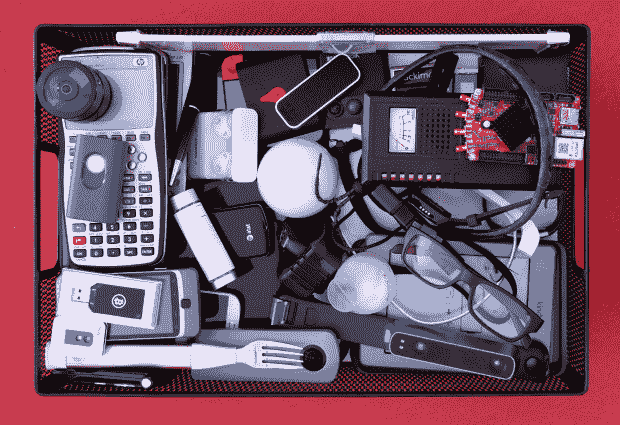T2】](https://content.wolfram.com/uploads/sites/43/2019/02/43-sw-used-devices-2x.png)

但是，尽管设备之类的东西会发生变化，我发现我的基础设施的组织原则却出人意料地保持不变，只是逐渐变得越来越完善。而且——至少当它们基于我们[非常稳定的 Wolfram 语言系统](https://writings.stephenwolfram.com/2018/06/weve-come-a-long-way-in-30-years-but-you-havent-seen-anything-yet/)时——我发现我为实现它们而构建的软件系统也是如此。

未来呢？有些事情肯定会有转机。在写这篇文章时，我意识到我现在可以升级到 4k 显示器(或更高)，而不会影响屏幕共享(提要会自动缩减采样)。也许用不了多久，我就会用 AR 来实时注释我的环境。也许最终我会有办法进行基于 XR 的模拟真人视频会议。也许——正如我 40 多年来一直假设的那样——我最终能够使用类似脑电图的东西更快地打字。诸如此类。

但是更重要的变化是拥有更好的开发和更自动化的工作流程。随着时间的推移，我希望有可能使用我们的[机器学习工具](http://www.wolfram.com/featureset/machine-learning/)来进行自动“计算历史”,例如，为我所做的事情，比如某个特定领域的事情，汇编一个有用的、适当聚类的时间表。

在我努力进行历史研究的过程中，我有机会使用许多人和组织的档案。通常已经做了一定量的索引和标记。(那封信是谁写来的？它是什么时候写的？它的关键词是什么？在哪里归档的？诸如此类。)但事情往往是非常细微的，通常很难确定所发生事情的整体轨迹。

我的第一个目标是让我个人拥有的所有材料对我自己有用。但是我想很快开始公开一些旧的材料给其他人看。而我正在研究如何——在现代，用所有的[云基础设施](http://www.wolfram.com/cloud/)、[机器学习](http://www.wolfram.com/featureset/machine-learning/)、[可视化](https://reference.wolfram.com/language/guide/DataVisualization.html)、[计算文档](http://www.wolfram.com/notebooks/)等。我可以为展示和探索档案建立最好的系统。

当我思考我的一天时，我问自己哪些方面没有得到很好的优化。实际上，很多事情都归结于电子邮件处理，以及花在回答问题上的时间。现在，当然，我已经花了很多努力来尝试组织事情，以便尽可能多的问题变得可以自我回答，或者可以用我们已经建立的技术和自动化来解决。作为首席执行官，我也会尽可能地将工作委托给其他人。

但是还剩下很多。我当然想知道，在我们现在拥有的所有技术中，是否有更多可以自动化，或者委托给机器。也许有一天，我收集的关于自己的所有数据会让一个人基本上制造出一个“我的机器人”。看了这么多我的电子邮件——并能够查看我所有的文件和个人分析——也许实际上有可能预测我会如何回应任何特定的问题。

我们还没到那一步。但这将是一个有趣的时刻，例如，一台机器可以有三个关于如何回应某事的想法，然后向我展示草稿，我可以从中选择并批准。从定义上来说，我想走什么方向的总体问题几乎必须留在我身边，但我希望如何到达那里的细节可以越来越多地自动化。

### 产品详情

在这篇文章中，我提到了各种设备和系统。这是我目前正在使用的特定产品的清单。请注意，我不是在“认可”事情；我只是在解释我碰巧使用的东西，基于我的研究，以及我的特殊限制和历史。

我按照它们在这篇文章中出现的顺序列出了它们，如果它们被多次提到，通常不会重复。请注意，这里的一些项目不再直接可用。

#### 我的日常生活

**Main desk computer** [Apple Mac Pro](https://www.apple.com/mac-pro/specs/)

(12 核；D700 GPUs64 GB 内存；1 TB 固态硬盘)

**主桌面显示器**
苹果 27 英寸影院显示器(1440p)【刚刚发现它可以与屏幕共享一起使用，我现在要升级到 4k 显示器】

**Multifocal glasses** [Varilux lenses](https://www.essilorusa.com/products/varilux)

[我看了阅读频道的宽度和

[Zernike polynomials](https://reference.wolfram.com/language/ref/ZernikeR.html)

等等。对于定制镜片，但我的矫正度勉强超过一个屈光度，所以我没有打扰]

**Heart-rate data** [FitBit Charge 2](https://www.amazon.com/Fitbit-Fitness-Wristband-International-Version/dp/B01KSX392O)

+ Wolfram 语言

[`ServiceConnect`](https://reference.wolfram.com/language/ref/ServiceConnect.html)

[我更喜欢使用

[WHOOP](https://www.whoop.com/)

但鉴于我只在手腕上戴一件东西，我需要它还能给我发短信提醒]

**Tablet** [Apple iPad Pro 10.5″](https://www.amazon.com/Apple-iPad-10-5-inch-Wi-Fi-256GB/dp/B074672S9Q/)

[我用了一段时间 iPad Mini，但我没有发现自己处于减轻重量是缩小屏幕尺寸的良好权衡的情况下]

#### 我的桌面环境

Wolfram 品牌的 Pilot 精确握笔笔【你必须到 Wolfram 的贸易展览摊位才能买到！]

#### 在移动中

**Spikey patch**
【你得是 Wolfram 内部人士，或者来 Wolfram 夏令营等。为了得到一个…]

**电脑包**
Tumi T-Tech 4905DCE

**薄软帽**
Etro 帽(停产型)

**包中包**
【2012 年的 Wolfram swag 单品】

#### 发表演讲

**Screen mirroring software** [duet](https://www.duetdisplay.com/)

#### 我的文件系统

**邮件客户端**
苹果邮件

**Corporate systems**

项目管理:

[Jira](https://www.atlassian.com/software/jira)

；请求跟踪器:

[RT](https://bestpractical.com/)

；源代码管理:

[Git](https://git-scm.com/)

有一些

[CVS](http://cvs.nongnu.org/)

(主要用于包含非文本内容的文件)

**On-premise file server**

运行 Linux 的定制机器

[CentOS](https://www.centos.org/)

7，128 GB 内存

#### 所有的小便利

**DocuTools**

[没有完整版，但有一个简化版

[Wolfram Workbench](https://www.wolfram.com/workbench/)

]

**终端 app**
苹果终端

#### 存档和搜索

#### 个人分析

**Screen capture logger** [ReFog](https://www.refog.com/)