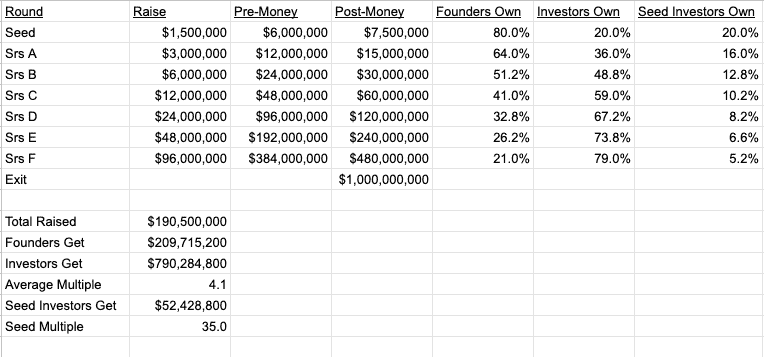
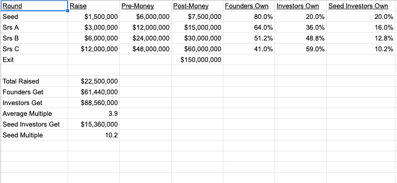

# 筹款的“加倍模式”——AVC

> 原文：<https://avc.com/2019/02/the-doubling-model-for-fundraising/?utm_source=wanqu.co&utm_campaign=Wanqu+Daily&utm_medium=website>

过去一周，我和一个朋友聊天，他正在考察一家早期公司，试图找出如何对它进行估值。

他提到了一家类似的公司，该公司的公开市值为 2.5 亿美元。

我问他，这家早期企业需要完成多少轮融资或多少个重大里程碑，才能达到类似上市公司的水平。

他说，他认为在这次融资后，它将采取三大步骤来实现这一目标。

所以我说，“这一轮过后，它大概值 3000 万美元。”

他说“你怎么确定的？”

我说“如果你假设价值会从一轮到另一轮或从一个里程碑到另一个里程碑翻一番，在三次以上之后，它将价值 2.5 亿美元，那么在这次之后，它应该价值 3000 万美元。”

然后我说“从 2.5 亿美元，到 1.25 亿美元，再到 6200 万美元到 3100 万美元。”

我称之为翻倍模型，三十多年来，我一直用它作为思考创业融资中价值增值的框架。

下面是一个简单的电子表格，展示了这是如何工作的。它不包括员工股权授予的影响，所以如果我添加的话，数字会有点变化。假设员工在退出时拥有公司 20%的股份。

这只是一个框架，仅此而已。

但我发现，这非常有助于思考在公司发展的各个阶段，什么是公平合理的。

你也可以把它缩小。如果一家公司只需要大约 2000 万美元就能获得正现金流，但退出时只有 1.5 亿美元的潜在价值，你会得到这样的结果:

驱动这一框架的两大假设是，一家公司应该始终以每轮估值翻倍为目标，并且每轮稀释不超过 20%。这最大限度地减少了稀释，也给现有投资者带来了安慰和信心，即事情会大致按计划进行。

如果事情进展顺利，你可以一轮接一轮地提高估值，但根据我的经验，下一轮往往会赶上你，结果是持平，这对任何人都不是好事。

一切最终都取决于机会的总规模(TAM)、市场在退出时对其的估价以及实现这一目标的资本要求。这些是创业领域价值的基本驱动力，本框架试图尊重它们。