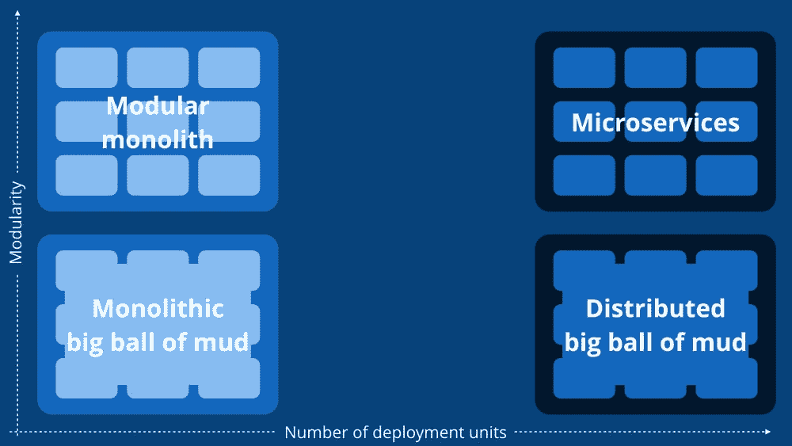
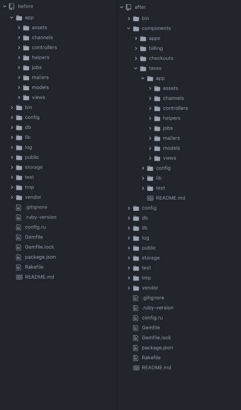
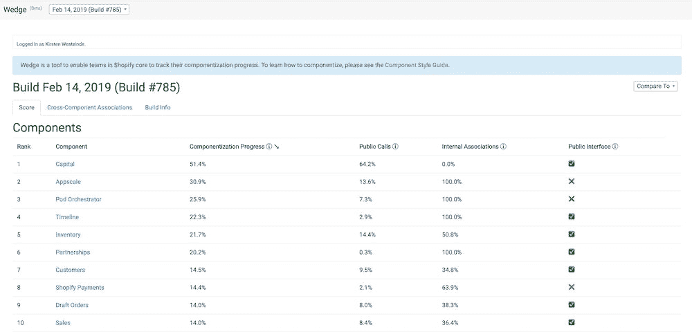

# 解构巨石

> 原文：<https://engineering.shopify.com/blogs/engineering/deconstructing-monolith-designing-software-maximizes-developer-productivity?utm_source=wanqu.co&utm_campaign=Wanqu+Daily&utm_medium=website>

Shopify 是现存最大的 Ruby on Rails 代码库之一。它已经被一千多名开发者开发了十多年。它封装了许多不同的功能，包括向商家收费、管理第三方开发者应用、更新产品、处理运输等等。它最初是作为一个整体构建的，这意味着所有这些不同的功能都构建在同一个代码库中，它们之间没有界限。多年来，这种架构为我们工作，但最终，我们到达了一个点，即整体的缺点超过了好处。关于如何进行，我们必须做出选择。近年来，微服务越来越受欢迎，并被吹捧为解决 monoliths 带来的所有问题的终极解决方案。然而，我们自己的集体经验告诉我们，没有放之四海而皆准的最佳解决方案，微服务会带来自己的一系列挑战。我们选择将 Shopify 发展成一个模块化的整体，这意味着我们将所有的代码保存在一个代码库中，但确保不同组件之间的界限得到定义和尊重。

每种软件架构都有自己的优缺点，不同的解决方案对处于不同发展阶段的应用来说是有意义的。对我们来说，从整体到模块化整体是下一个合乎逻辑的步骤。

## 整体建筑

[根据维基百科](https://en.wikipedia.org/wiki/Monolithic_system "Monolithic System on Wikipedia")，monolith 是  *一个软件系统，其中功能上不同的方面都交织在一起，而不是包含架构上独立的组件*。对于 Shopify 来说，这意味着处理运费计算的代码与处理结账的代码共存，很难阻止它们相互调用。随着时间的推移，这导致了处理不同业务流程的代码之间的高度耦合。

## 单片系统的优势

单片架构最容易实现。如果不强制实施架构，结果很可能是一个庞然大物。在 Ruby on Rails 中尤其如此，由于所有代码在应用程序级的全局可用性，Ruby on Rails 非常适合构建它们。单体架构可以让应用程序走得更远，因为它易于构建，并允许团队在开始时非常快速地将他们的产品更早地呈现在客户面前。

在一个地方维护整个代码库并将应用程序部署到一个地方有很多好处。您只需要维护一个存储库，并且能够在一个文件夹中轻松搜索和查找所有功能。这也意味着只需要维护一个测试和部署管道，根据应用程序的复杂性，这可能会避免大量的开销。创建、定制和维护这些管道的成本可能很高，因为需要齐心协力才能确保所有管道的一致性。因为所有的代码都部署在一个应用程序中，所以数据都可以存储在一个共享数据库中。每当需要一段数据时，只需简单的数据库查询就可以检索到它。

由于单片部署到一个地方，只需要管理一套基础设施。大多数 Ruby 应用程序都有一个数据库、一个 web 服务器、后台作业功能，然后可能还有其他基础设施组件，比如 Redis、Kafka、Elasticsearch 等等。每添加一套额外的基础架构，都会增加您必须戴上 DevOps 帽子而不是建筑帽子的时间。额外的基础设施也会增加可能的故障点，降低应用程序的弹性和安全性。

选择整体架构而不是多个独立服务的最引人注目的好处之一是，您可以直接调用不同的组件，而不需要通过 web 服务 API 进行通信。这意味着您不必担心 API 版本管理和向后兼容性，以及潜在的延迟调用。

## 单片系统的缺点

然而，如果一个应用程序达到一定的规模，或者构建它的团队达到一定的规模，它最终会超越整体架构。这发生在 2016 年的 Shopify 上，构建和测试新功能的挑战不断增加，这一点显而易见。具体来说，有几样东西充当了我们的绊网。应用程序非常脆弱，新代码会带来意想不到的后果。做一个看似无害的改变可能会引发一连串不相关的测试失败。例如，如果计算运费的代码调用了计算税率的代码，那么对我们计算税率的方式进行更改可能会影响运费计算的结果，但原因可能并不明显。这是高耦合和缺乏边界的结果，这也导致测试难以编写，并且在 CI 上运行非常慢。

在 Shopify 中开发需要大量的上下文来进行看似简单的更改。当新的 Shopifolk 加入并开始了解代码库时，他们在生效之前需要接受的信息量是巨大的。例如，加入运输团队的新开发人员应该只需要理解运输业务逻辑的实现，然后就可以开始构建了。然而，现实情况是，他们还需要了解订单是如何创建的，我们是如何处理支付的，以及其他更多的东西，因为一切都是如此错综复杂。对于一个人来说，仅仅为了发布他们的第一个功能，就必须记住太多的知识。复杂的单片应用程序导致陡峭的学习曲线。我们遇到的所有问题都是由于代码中不同功能之间缺乏界限而直接导致的。很明显，我们需要减少不同领域之间的耦合，但问题是如何减少

## 微服务架构

业界非常流行的一种解决方案是微服务。微服务架构是一种应用程序开发方法，其中大型应用程序构建为一套独立部署的较小服务。虽然微服务可以解决我们遇到的问题，但它们也会带来另一整套问题。

我们将不得不维护多个不同的测试和部署管道，并承担每个服务的基础设施开销，同时在需要时并不总是能够访问我们需要的数据。由于每个服务都是独立部署的，因此服务之间的通信意味着跨越网络，这会增加延迟并降低每个呼叫的可靠性。此外，跨多个服务的大型重构可能会很乏味，需要跨所有依赖的服务进行更改并协调部署。

## 模块化整体

我们希望有一种解决方案，能够在不增加部署单元数量的情况下提高模块化程度，让我们既能获得单片和微服务的优势，又不会有那么多的缺点。

*整体服务 vs 微服务由[西蒙布朗](https://www.youtube.com/watch?v=5OjqD-ow8GE "GOTO 2018 - Modular Monoliths by Simon Brown")T5】*

一个模块化的整体是一个系统，其中所有的代码驱动一个应用程序，不同的域之间有严格的边界。

## Shopify 的模块化整体实现:组件化

一旦清楚我们已经超越了整体结构，并且它影响了开发人员的生产力和快乐，一份调查被发送给在我们的核心系统中工作的所有开发人员，以识别主要的痛点。我们知道我们有一个问题，但我们希望在提出解决方案时了解数据，以确保它是为了实际解决我们的问题而设计的，而不仅仅是传闻中的问题。

该调查的结果为拆分我们的代码库的决定提供了信息。2017 年初，一个小型但强大的团队被召集起来解决这一问题。该项目最初被命名为“Break-Core-Up-Into-Multiple-Pieces”，最终演变为“组件化”。

## 代码组织

他们选择解决的第一个问题是代码组织。此时，我们的代码  [就像一个典型的 Rails 应用程序](https://www.tutorialspoint.com/ruby-on-rails/rails-directory-structure.htm "Ruby on Rails - Directory Structure")一样被组织起来:通过软件概念(模型、视图、控制器)。目标是按照现实世界的概念(如订单、运输、库存和账单)重新组织它，试图使查找代码、查找理解代码的人以及理解他们自己的各个部分变得更容易。每个组件都将被构造成自己的迷你 rails 应用程序，目标是最终将它们命名为 ruby 模块。希望这个新的组织能够突出那些没有必要耦合的领域。

*由现实世界概念重组——前后*

提出最初的组件列表需要公司各个领域的利益相关者进行大量的研究和投入。我们通过在一个巨大的电子表格中列出每个 ruby 类(总共大约 6000 个)并手工标记它属于哪个组件来做到这一点。即使在这个过程中没有代码发生变化，它仍然会触及整个代码库，如果做得不正确，可能会有很大的风险。我们通过自动化脚本在一次大爆炸式公关中完成了这一步。由于引入的更改只是文件移动，可能发生的失败将是由于我们的代码不知道在哪里可以找到对象定义，从而导致运行时错误。我们的代码库经过了充分的测试，因此通过在本地和 CI 中无故障地运行我们的测试，以及在本地和测试阶段运行尽可能多的功能，我们能够确保没有遗漏任何东西。我们选择在一次公关中完成所有工作，这样我们只会尽可能少地干扰所有开发人员。这种改变的一个不幸的缺点是，当文件移动被错误地跟踪为删除和创建而不是重命名时，我们在 Github 中丢失了很多 Git 历史。我们仍然可以使用 *git `-follow`* 选项跟踪文件移动的历史，但是 Github 不理解这种移动。

## 隔离依赖关系

下一步是通过将业务领域相互分离来隔离依赖性。每个组件都定义了一个清晰的专用接口，通过公共 API 表达了域边界，并对其相关数据拥有独占所有权。虽然团队无法为整个 Shopify 代码库实现这一点，因为它需要来自每个业务领域的专家，但他们确实定义了模式并提供了完成任务的工具。

我们开发了一款名为 Wedge in-house 的工具，它可以跟踪每个组件朝着隔离目标的进展。它强调了任何违反域边界的情况(当通过除了它的公共定义的 API 之外的任何东西访问另一个组件时)，以及跨边界的数据耦合。为了实现这一点，我们编写了一个工具，在 CI 期间挂钩到 Ruby 跟踪点，以获得完整的调用图。然后，我们按组件对调用者和被调用者进行排序，只选择跨越组件边界的调用，并将它们发送到 Wedge。除了这些调用，我们还发送一些来自代码分析的附加数据，比如 ActiveRecord 关联和继承。然后，Wedge 确定哪些交叉组件(调用、关联、继承)是正常的，哪些是违规的。一般来说:

*   跨组件关联总是违反组件化
*   只有显式公开的事情才允许调用
*   继承将是类似的，但还没有完全实现

然后，Wedge 会计算总分，并列出每个组件的违规情况。

*Shopify 的楔形跟踪每个组件目标的进度*

下一步，我们将绘制分数随时间变化的趋势图，并显示有意义的差异，以便人们可以看到分数变化的原因和时间。

## 加强边界

从长远来看，我们希望更进一步，通过编程来加强这些界限。Dan Manges 的这篇博文提供了一个应用团队如何实现边界执行的详细例子。虽然我们仍然在研究我们想要采取的方法，但是高层次的计划是让每个组件只加载它明确依赖的其他组件。如果它试图访问未声明依赖关系的组件中的代码，这将导致运行时错误。当通过公共 API 之外的任何方式访问组件时，我们也可能触发运行时错误或测试失败。T3】

我们还想通过移除偶然和循环依赖来解开[域依赖图](https://en.wikipedia.org/wiki/Dependency_graph "Dependency Graph on Wikipedia")。实现完全隔离是一项持续的任务，但 Shopify 的所有开发人员都投入了这项工作，我们已经看到了一些预期的好处。例如，我们有一个传统的税务引擎，它已经不能满足我们商家的需求。在本文描述的努力之前，用新系统替换旧系统几乎是不可能的任务。然而，由于我们在隔离依赖性方面投入了大量精力，我们能够用一个全新的计税系统替换我们的税务引擎。

总之，在一个系统的早期，没有架构往往是最好的架构。这并不是说不要实现好的软件实践，而是不要花费数周甚至数月的时间去尝试构建一个你还不知道的复杂系统。马丁·福勒的[设计耐力假说](https://martinfowler.com/bliki/DesignStaminaHypothesis.html "DesignStaminaHypotheis on martinfowler.com")很好地阐释了这一观点，他解释说，在大多数应用程序的早期阶段，你可以通过很少的设计快速前进。用设计质量换取上市时间是可行的。一旦你添加特性和功能的速度开始变慢，那就是投资优秀设计的时候了。

重构和重新架构的最佳时机是越晚越好，因为在构建的过程中，你会不断地学习更多关于你的系统和业务领域的知识。在你拥有领域专业知识之前设计一个复杂的微服务系统是一个有风险的举动，很多软件项目都陷入其中。[据 Martin Fowler](https://martinfowler.com/bliki/MonolithFirst.html "Monolith First on martinfowler.com") ，*“我听说过的几乎所有从零开始构建微服务系统的案例，都以严重的问题而告终……你不应该用微服务开始一个新项目，即使你确定你的应用足够大，值得这么做”*。

良好的软件架构是一项不断发展的任务，适用于您的应用的正确解决方案完全取决于您的运营规模。随着应用程序复杂性的增加，整体式、模块化整体式和面向服务的体系结构也在不断发展。每个架构将适合不同规模的团队/应用程序，并且将被痛苦和折磨的时期所分隔。当您开始经历本文中强调的许多棘手问题时，您就知道您已经超越了当前的解决方案，是时候转向下一个解决方案了。

*感谢 Simon Brown 允许张贴他的 Monolith vs Microservices 图片。[欲了解更多关于模块化整体结构的信息，请查看来自 GOTO18 的 Simon 的演讲。](https://www.youtube.com/watch?v=5OjqD-ow8GE "Modular Monoliths by Simon Brown")T3】*

* * *

We're always on the lookout for talent and we’d love to hear from you. Please take a look at our open positions on the [Engineering career page](http://www.shopify.com/careers/specialties/engineering?itcat=EngBlog&itterm=Post "Engineering Jobs at Shopify").