# 谷歌如何超越搜索，用 G 套件重塑生产力

> 原文：<https://usefyi.com/g-suite-history/?utm_source=wanqu.co&utm_campaign=Wanqu+Daily&utm_medium=website>

从桌面到云的范式转变可以说是自 80 年代我们首次上线以来，我们在现代计算领域看到的最重要的一次转变。特别是在过去的 15 年里，大量公司将其产品从桌面客户端迁移到基于云的服务，而谷歌从一开始就是基于云的免费增值 SaaS 的先驱。

谷歌的 G 套件是许多人第一次尝试基于云的产品。然而，成为世界领先的生产力工具套件之一几乎是从谷歌内部产品的发布开始的。那个产品就是 Gmail，它改变了一切——不仅仅是电子邮件。这代表着该公司在搜索之外的第一次尝试。他们在谷歌文档、表格、幻灯片等工具上取得了成功，这些工具最终成为了 G Suite。

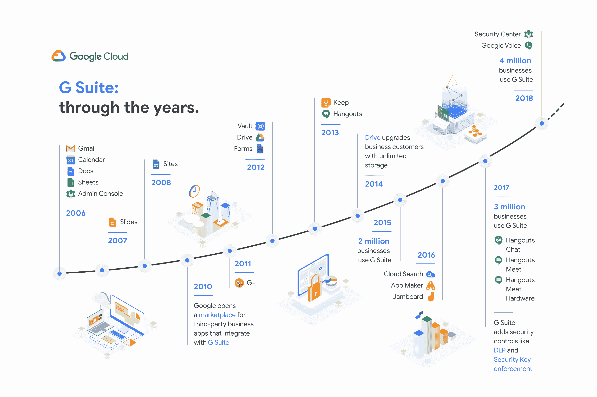

如今，全球数百万个人和企业都在使用 G Suite。尽管 G Suite 无处不在，谷歌也有可支配的资源，但谷歌在这一领域的主要竞争对手——微软——是一个可怕的对手。这两个科技巨头之间的战争没有任何迹象表明会很快结束。

以下是我将在本文中关注的一些内容:

*   谷歌如何将以消费者为中心的设计应用于主要面向企业的产品套件。
*   为什么 G Suite 对一家历来依赖广告收入的公司如此重要？
*   即使在公司大规模发展的情况下，谷歌如何保持其早期开创的实验文化——以及这种文化如何推动 G Suite 的发展。

Gmail 并没有被设计成一个独立的产品，而是一个内部工具。谷歌的最新项目有巨大的潜力，这一点很快变得显而易见——谷歌在探索这一潜力方面没有浪费时间。

## 2004-2010 年:超越搜索

2018 年 10 月，谷歌宣布 Gmail 用户超过 15 亿，成为世界上最受欢迎的电子邮件客户端。最终成为谷歌最受欢迎的产品之一的东西是由一个开发人员 Paul Buchheit 在 2004 年仅用一天时间创造出来的。

Buchheit 从大学时代就开始对基于网络的电子邮件客户端的想法着迷，当时他正在从事一个基于网络的个人电子邮件项目——甚至在 Hotmail 成为 90 年代末第一个基于网络的大型电子邮件服务之前。此前，Buchheit 曾在谷歌团队工作，负责创建“某种类型的电子邮件或个性化产品”，这是一个花费了他 20%时间的项目。

仅仅一天，Buchheit 就用 JavaScript 创建了第一个 Gmail 版本——第一个这样做的电子邮件客户端——并重新利用了谷歌团队的代码。这是谷歌在其核心搜索引擎之外的第一个产品，它将改变谷歌作为一个公司的整个轨迹。

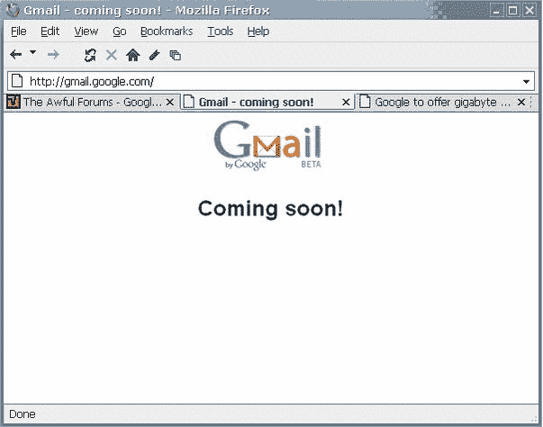

[Source: Time.com](https://time.com/43263/gmail-10th-anniversary/)

Gmail 于 2004 年 4 月 1 日正式亮相。在发布会的新闻稿中，谷歌宣布 Gmail 将为用户提供 1GB 的免费存储空间——是 Hotmail 的 500 倍，Hotmail 是微软在 1997 年以相对微不足道的 5 亿美元收购的。在新闻发布的时间和惊人的存储空间之间，许多人认为该公告是另一个典型的聪明的谷歌愚人节恶作剧。

最初，Gmail 只接受邀请。然而，与 Hotmail 不同的是，谷歌不必依靠在每封邮件底部宣传这项服务来吸引其初始用户。当时大多数电子邮件客户端提供 2-4MB 的存储空间。相比之下，Gmail 的 1GB 存储空间简直令人难以置信。结合该工具简单而高度精确的基于关键词的搜索功能，Gmail 极具吸引力。

随着关于 Gmail 的消息传开，谷歌已经在努力开发下一套将从根本上改变在线生产力的工具。2006 年 2 月，谷歌为你的域名推出了有限的测试版 Gmail。Gmail for Your Domain 允许网站管理员自定义 Gmail 以供业务使用，使他们能够在 Gmail 帐户中使用自定义域，而不是默认的@gmail.com 域。就在几个月后的 8 月，该公司推出了 Google Apps for Your Domain，这是 Gmail for Your Domain 的扩展，集成了三个全新的工具:Google Talk 即时消息客户端、HTML 编辑器 Google Page Creator 和 Google Calendar。

各种规模的组织都面临着一个共同的挑战，那就是帮助他们的用户更有效地交流和共享信息。像 Google Apps 这样的托管服务消除了维护通信基础设施的许多费用和麻烦，这对许多小企业主和 IT 员工来说是一种解脱。”— [戴夫·吉鲁阿德](https://googlepress.blogspot.com/2006/08/google-launches-hosted-communications_28.html)，谷歌前副总裁兼企业总经理

随着 Google Apps for Your Domain 的推出，Google 已经清楚地表明了它的意图。然而，鉴于谷歌对搜索和在线广告的强烈关注，尚不清楚为什么一套基于云的生产力应用程序是谷歌的合理举措。然而，事后看来，这非常简单。

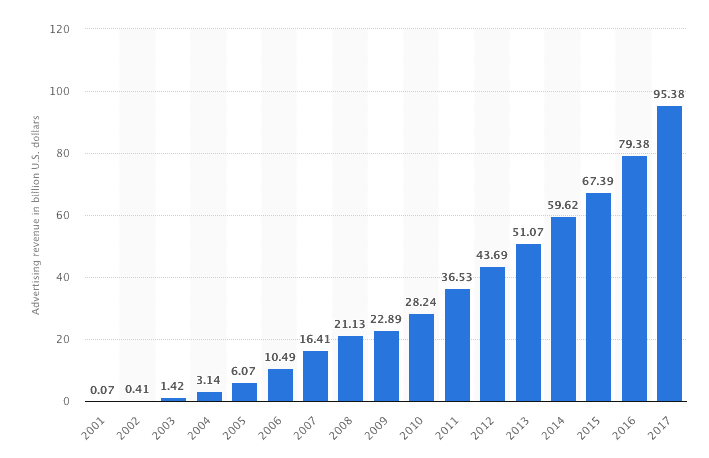

[Source: Statista](https://www.statista.com/statistics/266249/advertising-revenue-of-google/)

AdWords 不仅仅是谷歌的主要收入来源。这是一个巨大的用户数据宝库。甚至在 2006 年，AdWords 就为谷歌创造了超过 100 亿美元的年收入。除了数十亿美元，AdWords 还为谷歌提供了关于小企业主面临的需求和挑战的难以置信的见解。Google Apps for Your Domain 可以帮助他们克服这些挑战。为您的领域推出应用是为小型企业提供端到端生产力工具的第一步。用户可以访问一系列工具来帮助他们经营业务，完全免费，没有任何技术开销，而谷歌对企业主的需求有了更深入的了解。谷歌将自己定位为小企业主不可或缺的一员。

谷歌不想只是帮助人们推广他们的业务。谷歌想成为一个平台，让人们*从头到尾运营*他们的业务。

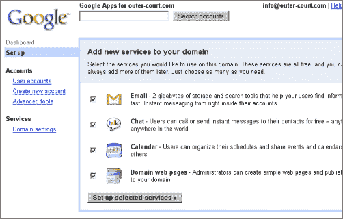

[Source: Google Blogoscoped](https://blogoscoped.com/archive/2006-08-28-n44.html)

谷歌没有浪费时间利用其新工具进一步扩展到生产力领域。2006 年 10 月，谷歌将你的领域应用程序改编成了一款面向教育机构的新产品——谷歌教育应用程序。与你所在领域的应用程序类似，教育应用程序允许学校和大学使用 Gmail、日历和其他带有自己品牌的工具。

与从一开始就具有明显商业潜力的领域应用不同，教育应用是谷歌为了解其产品的新潜在市场而进行的几项实验中的第一项。谷歌很聪明地将其新兴产品套件瞄准了学校。对于合格的学术机构来说，教育应用程序不仅完全免费，而且专门设计为与学校现有的电子邮件和管理系统集成。免费的价格和安装的简便性对于那些多年来一直在老化系统上工作的过度劳累的管理员来说是不可抗拒的。

后来，当谷歌调整其定价时，教育应用实际上是不可或缺的。而且，最重要的是，谷歌通过提前向学生介绍其工具，为他们使用 G Suite 应用做准备。谷歌进入教育领域对该公司来说也是一次宝贵的学习经历。它为谷歌提供了迎合具有遗留软件系统和成千上万用户的机构组织的第一手经验，当它开始积极地瞄准企业时，它可以优化和复制这一过程。

到 2006 年，微软已经在生产力领域独占鳌头十多年了。然而，尽管其 Office 产品[截至 2006 年](https://www.theguardian.com/technology/2006/jul/06/microsoftoffice.microsoft)拥有超过 4 亿用户，微软还是变得自满起来。2000 年代，Office 的增长很大程度上是由它与许多微软 Windows 操作系统的安装捆绑在一起，而不是销售单独的许可证推动的。虽然微软将在其 Office 2007 产品中推出一系列新功能，但当谷歌在 2006 年首次推出面向你的领域的应用程序和教育应用程序时，该公司很脆弱。这是一个大胆的、对抗性的举动，让谷歌追求微软在文档和生产力领域无可争议的统治地位的意图昭然若揭。

2006 年 10 月，谷歌发布了其应用程序产品系列的最新产品:文档和电子表格，其文字处理和电子表格工具。Docs 改编自基于网络的文字处理软件 Writely，该软件由软件开发公司 Upstartle 开发，谷歌于 2006 年 3 月以未披露的金额收购了该公司。这一举措直接针对微软的 Word 和 Excel。

Writely 值得注意的是，它是使用当时新的 Ajax web 开发框架构建的，该框架允许在不中断页面重新加载的情况下更新网页。然而，真正的技术挑战是使这些工具适应实时、多用户协作。让多个用户同时编辑一个文档是一个相当大的技术挑战，这是谷歌优于微软的一个关键领域。

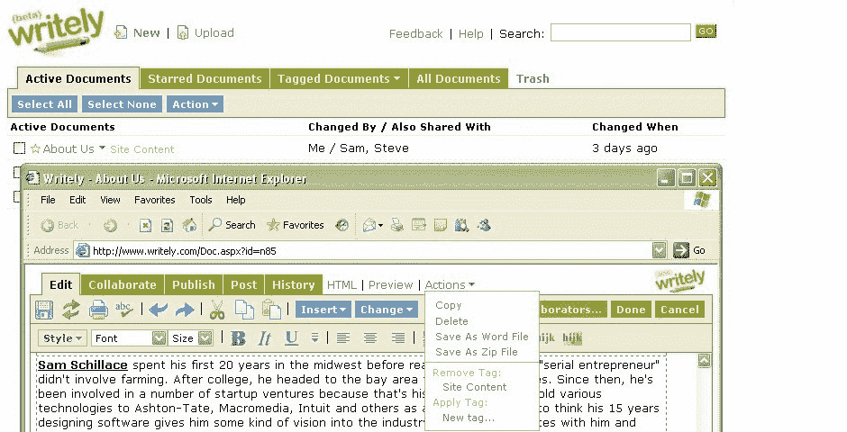

[Source: The Webby Awards](https://www.webbyawards.com/winners/2006/web/website-features-and-design/best-practices/writelycom/)

同样，电子表格是基于谷歌在 2005 年收购的一个工具，由 2Web Technologies 开发的 XL2Web。收购 XL2Web 后不久，谷歌在谷歌实验室推出了电子表格，作为先到先得的有限访问测试，后来推广到所有谷歌账户，以配合 2007 年 2 月推出的谷歌应用程序高级版。

Premier Edition 是谷歌将其新的生产力工具货币化的第一步。Apps Premier Edition 基于谷歌推出的与教育应用程序的集成，最初定价为每位用户每年 50 美元。在 Premier Edition 发布后，Apps for Your Domain 更名为 Google Apps Standard Edition，而 Apps for Education 更名为 Google Apps for Education。当时，有超过 10 万家企业在使用 Apps 标准版。现在，谷歌准备更积极地进入企业。家居用品巨头宝洁公司、CRM 平台 Salesforce 和企业房地产网络保诚优选地产公司是谷歌的首批企业合作伙伴。

宝洁全球商业服务公司已经注册成为 Google Apps 的特许企业客户，Google Apps 是一个成功的消费者产品套件，现已面向企业提供。G 将与谷歌密切合作，塑造这些流行工具的企业特征和需求。— [劳里·赫尔茨利](http://googlepress.blogspot.com/2007/02/google-introduces-new-business-version_22.html)，宝洁全球商务服务部前总监&

谷歌巨大的财政和技术资源为其提供了与微软竞争所需的力量。所有 Premier Edition 用户都获得了 10GB 的个人存储空间，对于这样一个廉价的产品来说，这是以前无法想象的空间。Premier Edition 的服务水平协议同样雄心勃勃，保证企业用户 99.9%的正常运行时间和 24/7 的专门客户支持。

尽管谷歌希望主导企业生产力的意图非常明确，但该公司并没有忽视其标准版应用程序套件。在推出 Premier Edition 的同时，谷歌推出了两款新产品作为 Standard Edition 的一部分:谷歌文档和谷歌电子表格。此时，谷歌基于云的工具无法与微软 Office 等桌面客户端的功能竞争——但幸运的是，他们不需要竞争。谷歌所需要的是它的应用程序比微软的工具更快、更便宜、更容易使用。

在“文档”和“电子表格”加入应用程序家族后，接下来一年左右的时间里，应用程序的重大更新很少。谷歌网站于 2008 年 2 月推出，但下一个主要版本是在一年后，谷歌宣布用户现在可以将他们的 Premier 和教育版应用程序与微软 Outlook 同步。这对谷歌来说是一个巨大的胜利。该公司毫不掩饰其在最有价值的企业市场上与微软竞争的愿望。然而，谷歌要做的是找到一种方法来渗透那些建立在微软产品之上的公司。

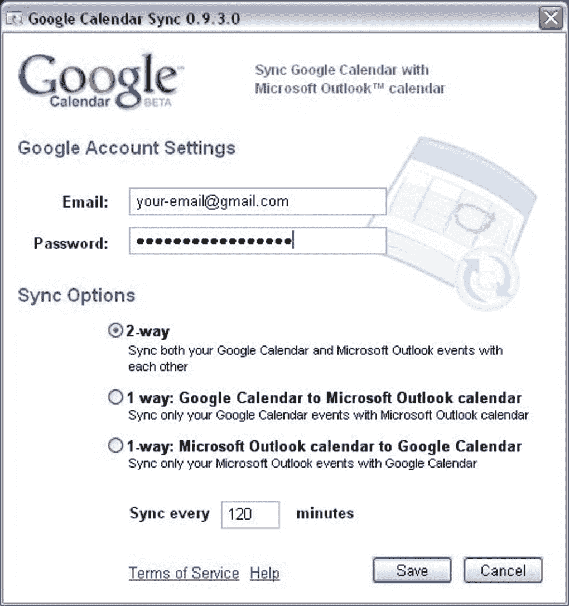

[Source: Softonic](https://google-calendar-sync.en.softonic.com/)

将其 Premier 和教育版应用程序与 Outlook 集成在一起非常出色。公司可以继续使用他们的 Outlook 安装来处理公司的电子邮件，而没有实际使用 Outlook 产品的痛苦，其用户界面甚至在 2008 年就变得臃肿和混乱。毫无疑问，微软意识到了谷歌试图做的事情，但拒绝将 Outlook 与谷歌整合可能会对微软的品牌和对其产品的看法造成重大损害。随着 Outlook 的整合，谷歌获得了重要的机会，可以将自己融入公司现有的技术体系，并证明使用谷歌的工具更容易、更有效率。微软从这笔交易中得到的只是挽回了一点面子，并有可能失去企业客户。

2009 年 7 月，Google Apps 正式退出测试版。到目前为止，全球有超过 175 万家企业在使用谷歌应用程序。正式声明的主要动机是——再一次——谷歌希望吸引企业客户。它的工具强大而灵活，足以满足各种规模公司的需求，但谷歌意识到，其许多应用程序上的“测试版”标签正在损害企业级的采用。

“我们已经意识到，beta 标签并不适合那些不热衷于在听起来仍处于试用阶段的软件上开展业务的大型企业。因此，我们将努力集中于达到产品退出测试的高标准，应用套件中的所有应用程序现在都达到了这一标准。”— [马修·格洛茨巴赫](https://googleblog.blogspot.com/2009/07/google-apps-is-out-of-beta-yes-really.html)，谷歌企业产品管理部前总监

谷歌不仅开发了几款可以和微软的付费产品媲美的免费工具，而且开发速度非常快。批评者和怀疑论者对谷歌突然退出桌面平台表示怀疑，但随着谷歌应用程序的流行，这些批评很快被遗忘。然而，如果谷歌真的想从微软手中夺取市场份额，它就必须在开发人们希望使用的消费者友好型产品与开发谷歌希望吸引的企业客户所期望的强大功能之间实现微妙的平衡。

## 2010-2014 年:更多实验、更多产品、更多基础设施

在短短的几年里，谷歌彻底实现了业务多元化，从搜索领域进入了新兴的基于云的生产力领域。它与宝洁等大型企业达成了几笔重要交易，这对一家仍在探索 SaaS 企业领域的公司来说是宝贵的学习机会。谷歌将在未来几年的大部分时间里试验和完善其方法，包括横向进入硬件领域，重塑其不断扩大的工具范围，以及推出几个全新的产品。

截至 2010 年 Q1，全球有超过 200 万家公司依靠谷歌应用程序来运营业务。谷歌利用这一势头，于 2010 年 3 月推出了谷歌应用程序市场。与 2008 年推出的安卓应用谷歌 Play 商店外观相似，谷歌应用市场为企业提供了一系列由第三方应用开发者创建的基于云的生产力工具。发布时有超过 50 家开发商的应用程序可用，其中许多为企业提供了更多的实用性，如 Intuit 的在线工资单和 Atlassian 的软件开发套件，该套件允许软件工程师在谷歌应用程序和 JIRA 之间无缝移动。

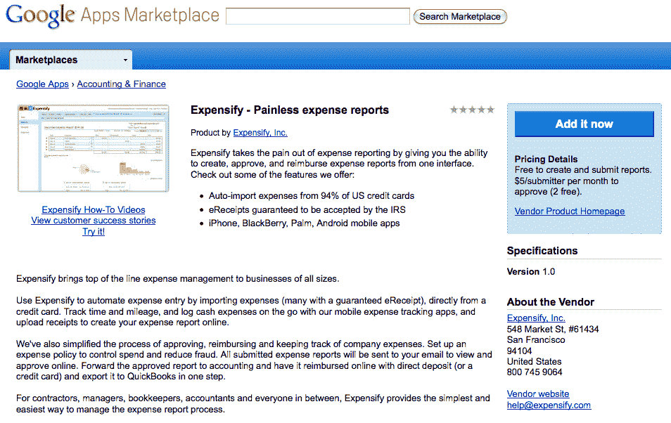

[Source: Expensify](https://blog.expensify.com/2010/03/09/what-google-apps-marketplace-means-to-your-small-business/)

谷歌应用程序市场对每个人来说都是双赢的。谷歌能够为公司提供更广泛的工具和应用程序来帮助他们运营业务，而不必在内部开发这些工具。公司现在可以在云中免费或非常便宜地处理更多的日常任务，而不必被迫为整个组织的定制应用程序部署支付数千美元。第三方开发者可以将他们的应用和工具推向一个更大的市场，并获得了与谷歌合作的额外好处。

“我们发现，当企业开始体验云计算的好处时，他们会想要更多。经常有人问我们什么时候能提供更广泛的业务应用——从会计和项目管理到旅行规划和人力资源管理。如今，我们通过一个新的集成业务应用在线商店，让这些用户和软件提供商能够更轻松地在云中开展业务。”

到 2010 年夏天，谷歌已经与数十家世界上最大的企业合作，并了解了这些组织的独特需求。2010 年 7 月，该公司将这一新发现的知识应用于下一次实验，推出了面向政府的谷歌应用程序。

Google Apps for Government 的特别之处不一定是向州和联邦政府机构提供基于云的 IT 服务的可观收入潜力——与联邦政府合作提供的海量数据才是 Google 真正想要的。即使在 2010 年，谷歌的原始计算能力也超过了这个星球上几乎所有的公司实体。通过作为美国政府的 IT 和云计算提供商提供服务，谷歌不仅可以获得前所未有的对大量宝贵的人口、金融和政策数据的访问，还可以让自己成为世界上最大的机构组织之一不可或缺的一员。

然而，尽管谷歌政府应用程序的推出具有战略意义，但它确实给谷歌带来了一些问题。尤其是谷歌应用程序旗下各种应用程序的范围越来越混乱。为了精简其不断扩大的服务层范围，Google Apps Premier Edition 更名为 Google Apps for Business，Google Apps Standard Edition 更名为 Google Apps。

虽然更名很有必要，但它实际上有两个目的。首先，它简化了产品层次，使每个层次的目标受众更加明显。其次，它为谷歌工具套件货币化战略的下一阶段奠定了基础，这一阶段将从 2011 年 4 月开始，届时一家公司可以注册免费谷歌应用套件账户的用户数量上限将从 50 个降至 10 个，并为其商业计划引入按月计费。

然而，2010 年 11 月谷歌应用程序的更名被谷歌迄今为止最大的一次产品发布所掩盖。其 Chrome 操作系统。

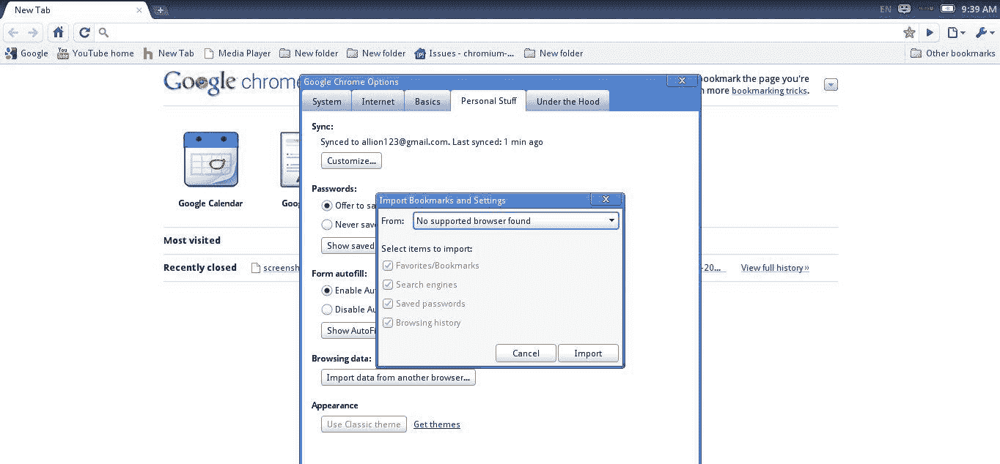

[François Beaufort](https://plus.google.com/+FrancoisBeaufort/posts/GhHWTLTzi8Q)

Chrome 标志着谷歌公司思维的重大转变。截至 2010 年底，AdWords 为谷歌创造了超过 280 亿美元的年收入，比 2006 年应用程序首次推出时谷歌从 AdWords 获得的 100 亿美元收入增长了 180%。然而，尽管谷歌的广告业务带来了惊人的收入，但一些投资者担心谷歌过于依赖广告作为收入来源。Chrome OS 的发布揭示了谷歌与其主要竞争对手微软和苹果更紧密结盟的意图，这两家公司都有强劲的硬件业务。

不幸的是，谷歌等了太久才进入硬件领域。

到 2010 年 Chrome OS 发布时，谷歌的 Chrome 网络浏览器已经推出两年了，全球约有 8%的个人电脑安装了该浏览器。Chrome OS 是 Chrome 浏览器的延伸。它看起来一样，摸起来一样，从技术上来说，可以说是一样的，只是在架构上有一些小的不同。Chrome 浏览器为 Chrome 操作系统的延续奠定了基础，也就是说本地硬盘存储的概念已经过时。谷歌已经帮助企业将他们的生产力迁移到云上——现在它也想将每个人硬盘上的内容迁移到云上。

然而，谷歌没有考虑到的是，在此期间，消费者 IT 硬件市场的变化速度之快令人难以置信。当谷歌在 2008 年首次开始开发 Chrome 浏览器时，上网本市场似乎是家庭计算领域的下一个重大范式转变。它们足够轻便，实用且高度便携，似乎非常适合与 Google Apps 等基于云的工具一起工作。然而，随着谷歌在 2008 年至 2010 年间开发其 Chrome 操作系统，苹果凭借 iPad 的发布独自改变了硬件市场的格局。当 Chrome OS 向世界公布时，上网本的销售已经被 iPad 的失控销售所摧毁——这一趋势将在接下来的几年中持续下去。当然，相关性并不总是等同于因果关系，但是影响是显著的。

[Source: Ignition Framework](https://ignitionframework.com/innovation-lessons-steve-jobs-apple-story-ipad/)

2012 年 4 月，该公司宣布推出在线存储服务 Google Drive。Drive 的推出对谷歌至关重要。Drive 不仅是其应用产品未来不可或缺的一部分，也是谷歌进军竞争领域的一次大胆尝试。当谷歌发布 Drive 时，Dropbox 已经拥有超过 5000 万用户，苹果和微软都在提供云存储产品。

Drive 一开始就是一个强大的产品，它建立在谷歌对 Gmail 的成功策略之上。Drive 从发布之日起就可以在 PC、Mac、Android 和 iOS 上使用，Google Apps 用户可以免费获得 5GB 的存储空间。这使得 Drive 与苹果的 iCloud 平起平坐，后者当时也提供 5GB 的免费存储空间，提供的存储空间是 Dropbox 的 2GB 的两倍多。然而，它没有达到微软 SkyDrive 服务提供的 7GB(在英国广播公司 BSkyB 提起诉讼后，该服务于 2013 年[更名为 OneDrive)。超级用户可以为额外的存储空间支付更多费用，每月 4 美元起，购买额外的 20GB 空间，最多可以购买 16TB，这在当时是一个难以置信的空间量。硬盘还拥有强大的安全功能，标配强大的文件加密和可选的两步验证。](https://www.bbc.com/news/technology-23530337)

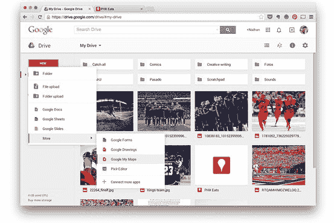

[Source: WSJ](https://blogs.wsj.com/personal-technology/2014/12/10/google-my-maps-lets-you-create-and-save-custom-maps/)

2012 年 11 月，谷歌宣布发布首款 Chromebook 上网本电脑，致力于打一场败仗。Chromebook 受到了谷歌忠实用户和临时用户的欢迎，但最终未能成为谷歌希望的硬件成功故事。Chromebook 的使用体验非常棒。这些机器速度很快，冷启动只需 15 秒或更短时间。Chrome OS 的用户界面时尚优雅，使用起来反应灵敏。第一款谷歌 chrome book Cr-48 也有一些有趣的设计选择，例如快捷键取代了传统功能键，专用搜索键取代了大写锁定键。

然而，这还不够。它看起来和感觉上都太像传统的笔记本电脑了，而且它对云的依赖意味着 Chromebooks 的离线效用有限。然而，谷歌最大的错误并不是设计了错误的硬件，而是在浏览器上下了大赌注。谷歌对云计算和 SaaS 产品未来的直觉最终被证明是正确的。关于云计算的未来以网络浏览器为中心的观点是完全错误的。尽管 Chromebook 最初的销量相当强劲，但苹果 iPad 的销量很快就超过了谷歌的上网本。虽然一次基本上失败的硬件发布可能会让其他公司破产，但谷歌并没有被吓住。相反，Chromebook 的开发和推出是另一个宝贵的经验。

谷歌继续围绕应用完善其盈利战略。2012 年 12 月，谷歌宣布，所有企业，无论规模大小，如果想使用谷歌基于云的工具，现在都必须使用谷歌企业应用程序。在此之前，公司可以选择使用谷歌企业应用套件标准版。

“当我们推出高级商业版时，我们也保留了免费的基本版。企业和个人都注册了这个版本，但时间表明，在实践中，这种体验对任何一方都不太合适。— [克莱·巴沃](https://cloud.googleblog.com/2012/12/changes-to-google-apps-for-businesses.html)，谷歌应用程序前产品管理总监

将其众多不同的工具和服务连接到一个单一的谷歌账户是明智之举。谷歌知道，其基于云的存储产品将面临激烈的竞争。然而，Gmail 是目前最好的免费网络邮件客户端。到 2012 年 6 月， [Gmail 拥有超过 4 . 25 亿月活跃用户](https://googleblog.blogspot.com/2012/06/chrome-apps-google-io-your-web.html)——他们都有一个谷歌账户。通过将 Gmail——以及用户的谷歌账户——连接到所有其他基于云的服务，谷歌的竞争优势变成了谷歌用户可以在各种产品之间轻松移动。这种无摩擦的无缝连接是谷歌的王牌。

即使苹果、Dropbox 和微软提高了它们的免费存储空间限制，用户仍然必须手动在谷歌和第三方服务之间移动，这相对容易——只是不像从一个谷歌产品移动到另一个谷歌产品那么容易。谷歌搜索功能在 Drive、Apps 甚至 Gmail 中的连通性是谷歌用户使用谷歌产品而非竞争产品的另一个令人信服的原因。

为了进一步简化其不断增加的云服务，谷歌在 2013 年 5 月对付费谷歌账户实施了全球存储限制。在那之前，驱动器存储空间被限制在 5GB，而 Gmail 被限制在 25GB。改变之后，高级用户可以按照他们认为合适的方式在 Gmail 和 Google Drive 之间分配他们的 30GB 总存储空间限制。类似的存储限制重组也适用于谷歌的基本账户，让免费用户对如何分配他们的 15GB 存储空间有更多的控制权。这是一个相对较小的变化，但消除存储限制的任意分离对免费和高级用户来说是另一个积极的步骤。

几个月后的 2013 年 9 月，谷歌终于发布了桌面版应用。这一宣布恰逢其 Chrome 浏览器五周年，并对 Windows 和 Mac OS 用户开放，前提是这些平台的用户也使用谷歌的 Chrome 浏览器。

支持桌面版应用程序的决定对谷歌来说有几个目的:

1.  对于那些正在寻找微软办公软件替代品，但还不完全信任基于云的生产力工具的企业用户来说，这使得应用程序变得更有吸引力
2.  它鼓励在 PC 和 Mac 平台上采用应用程序和 Chrome 浏览器，同时也推动了谷歌 Chrome 浏览器在这些操作系统上的采用
3.  它极大地拓宽了谷歌应用程序的潜在覆盖范围
4.  它吸引了第三方软件开发人员，他们可以为 web 编写软件，而不是为不同的计算环境开发相同工具的多个版本

尽管桌面版应用程序提供了所有优势，但这也是默认了谷歌对纯在线未来的愿景有点乐观——至少在我们很快就会回忆起过去的物理硬盘时代方面。

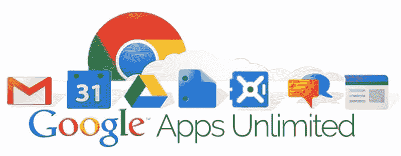

2014 年 6 月，随着 Google Apps Unlimited 的推出，Google Apps 经历了三大品牌重塑中的第二次。Google Apps Unlimited 本质上是与 Google Apps for Business 相同的产品，具备了企业应用的所有功能，只是用户现在每月只需支付 10 美元就可以获得无限的存储空间。唯一真正的限制是，只有四个用户或更少用户的公司每个用户的存储上限为 1TB。然而，公司不能有选择地选择哪些用户升级到无限制；要么每个用户都升级了，要么没人升级。

2010 年至 2014 年间，谷歌设法削弱了微软在生产力垂直领域的市场份额。只是没有谷歌希望的那么大。为了成功实现与微软竞争的雄心，谷歌不得不超越基于浏览器的应用程序。要做到这一点，谷歌会尽自己最大的努力，不断地、有条不紊地优化产品。在未来几年，这种改进将以更智能的应用程序的形式出现，这些应用程序建立在谷歌大量的用户数据及其尖端的机器学习技术之上。

## 2015 年至今:智能应用，更智能的技术

到 2015 年，全球数百万个人和公司都在使用 G Suite。尽管其优惠计划是一个有价值的收入来源，谷歌意识到进一步的产品开发将是赢得与微软之战的关键。这就是为什么从 2015 年开始，谷歌加倍努力改进 G Suite 的应用程序，使其更智能、更高效，并对个人用户和企业客户等更有帮助。它始于通过改进 Gmail 追根溯源。

2015 年 3 月，谷歌推出了智能回复，这是 Gmail 多年来最大的更新之一。智能回复本质上是 Google Suggest 的一个扩展，这是一个网址补全工具，由初级软件工程师 Kevin Gibbs 早在 2004 年在一辆公交车上独自开发。智能回复扫描用户的电子邮件，寻找上下文关键词线索，然后根据电子邮件的内容提供最多三个建议的回复。

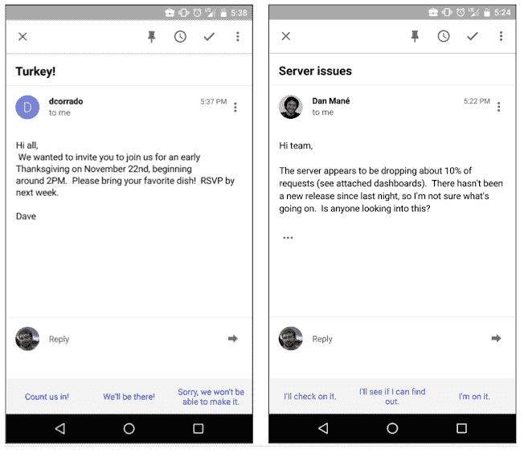

智能回复是你必须亲身体验的产品功能之一。对于桌面 Gmail 用户来说，智能回复可能感觉不到特别的革命性。然而，如果你在手机上使用过 Gmail，你可能已经是一个热情的智能回复者，或者至少尝试过一两次。智能回复最令人兴奋的不一定是节省的时间——尽管最铁杆的生产力倡导者无疑会珍惜智能回复为他们节省的宝贵的几秒钟——而是智能回复告诉我们谷歌的计划。

如果谷歌现在能为我们节省几分钟，那么未来它将为我们节省几个小时。

谷歌的生产力团队在引入智能回复后保持了相对低调。这种情况在 2016 年 9 月发生了变化，当时谷歌正式宣布将应用程序第三次也是最后一次更名为 G Suite，这是在谷歌应用程序为你的领域推出十年后。

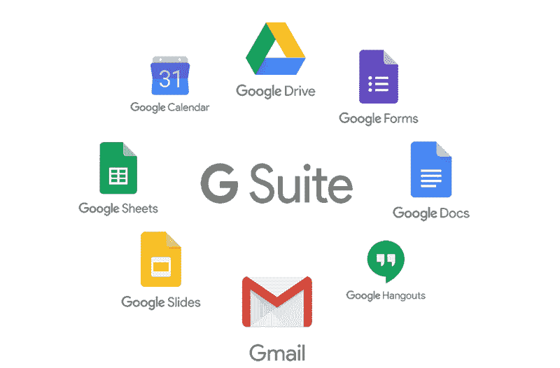

这一品牌重塑不仅仅是为了最大限度地减少对其各种产品的困惑，也是迄今为止最强烈的迹象，表明谷歌打算积极寻求基于云的企业生产力市场。在那之前，谷歌的商业工具主要服务于教育机构和初创企业(在较小程度上也服务于政府机构)。这对谷歌来说是一次非常宝贵的学习经历，尤其是在它尝试进入生产力市场的最初阶段。然而，就长期收入或市场份额而言，大学和创业公司不会削减它。截至 2015 年，[谷歌仅占有企业生产力市场的 3%](https://www.recode.net/2017/3/18/14955654/short-history-g-suite),年收入接近 4 亿美元。另一方面，微软控制了大约 95%的企业生产力空间，收入将近 127 亿美元。

“Google G Suite 有很多令人喜欢的地方，尤其是如果你使用免费版本或者利用付费版本的专业电子邮件和会议功能。但将它与万能的 Office 365 相比，就像是借用斯蒂芬·金(Stephen King)的一个比喻，将手电筒比作灯塔。”—[PCMag 专栏作家埃里克·格雷斯塔德](https://uk.pcmag.com/business/77669/at-home-with-google-g-suite)

谷歌企业魅力攻势的下一阶段发生在 G Suite 更名的几个月后，当时谷歌在 2016 年 9 月将其企业业务更名为谷歌云。像以前一样，这一更名是必要的，以区分谷歌不断增加的平台和产品，特别是在该公司准备追赶世界上最大的科技公司的时候。然而，更名本身并不是令人兴奋的部分——它是谷歌正在寻求的企业客户很快就能利用的机器学习工具。

微软 Office 可能拥有更大的企业用户群和更高的收入，但谷歌拥有更强大的计算能力。谷歌的云机器学习产品，通过谷歌云更名面向所有企业开放，允许企业使用自己的数据训练自己的神经网络，但使用谷歌的计算能力。这是谷歌的竞争优势。它可以提供与微软 Office 竞争的生产力工具，以及可以与亚马逊网络服务和类似平台竞争的技术马力。结合其尖端的机器学习技术，谷歌准备成为企业领域的一个严重威胁。

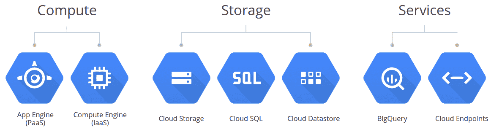

谷歌咄咄逼人的姿态很快得到了回报。在更名为 G Suite 并引入新的企业级工具和服务之后，谷歌缓慢但稳定地在企业生产力领域取得了进展。截至 2017 年 1 月，谷歌在全球拥有超过[300 万付费 G Suite 客户](http://blog.workato.com/2017/06/cloud-history-google-suite/)。仅仅一年后，也就是 2018 年 2 月，这个数字[已经增长到超过 400 万](https://www.compelo.com/google-cloud-ceo-diane-greene-google-next-18/)。

这些用户大多是小公司和初创公司，它们长期以来构成了 G Suite 用户群的大部分。然而，谷歌已经成功吸引了稳定的大型企业，包括高露洁棕榄、尼尔森控股和威瑞森，这些知名客户为谷歌从 G 套件销售中获得的 13 亿美元收入做出了贡献。每一个注册 G Suite 的企业客户都让谷歌的工具作为一个严肃的 Office 竞争者更加可信。很快，那些从未考虑过依赖谷歌工具的公司开始带着新的好奇心审视 G Suite 的潜力。

“我一直在和政府、航空航天、金融服务等领域的传统保守公司交谈。这在两年前是不会发生的。”— [高德纳公司分析师杰弗里·曼](https://www.reuters.com/article/us-alphabet-gsuite/googles-g-suite-is-no-microsoft-killer-but-still-winning-converts-idUSKBN1FL3ZX)

微软可能拥有更大的市场份额，但谷歌相对于其巨人般的竞争对手有一个至关重要的优势——移动。微软从未真正“得到”移动设备，尤其是在 Office 方面。这一直是微软的致命弱点。Office 拥有大量 G Suite 用户可能永远得不到的复杂功能，但这并不一定会转化为人们今天的工作方式。人们不喜欢 G Suite 是因为它的高级功能。他们喜欢它，因为它简单、容易、快捷，而且无处不在。根据 Google 的数据，花在文档、表格和幻灯片上的时间有将近 75%是协作性的。这个比例如此之高，是因为与 Office 不同，G Suite 可以放在人们需要它的任何地方——放在他们口袋里的移动设备上，放在他们包里的平板电脑上，或者放在他们办公室的桌面上。微软投入了大量的时间、金钱和精力试图模仿这种无缝的跨平台体验。不幸的是，微软公司仍然没有解决这个问题，并赶上了。

2019 年 1 月，[谷歌宣布推出新的 Docs API](https://techcrunch.com/2019/02/11/google-docs-gets-an-api-for-task-automation/)，允许用户在其文字处理工具中自动化一系列日常任务。该 API 从 2018 年 4 月开始开发，在此期间，几家公司针对内部用例调整了该 API。例如，自动化工具开发商 Zapier 使用 Docs API 来帮助用户基于一系列预设模板创建聘书。网飞使用它来简化和自动化其内部文档处理过程。

Docs API 真正令人兴奋的不是用户现在可以自动化的任务范围——而是谷歌将随着这项技术的发展做些什么。Docs API 是迄今为止最明确的信号之一，表明谷歌完全打算通过消除许多占用我们大量时间的繁重、耗时的任务来改变我们的工作方式。与最初从桌面客户端向云的转移相比，这有可能是一场更深远的生产力转变。

如果有哪家公司有可能危及微软在生产力领域(尤其是企业领域)的主导地位，那就是谷歌。尽管有一些失误，谷歌在如何将企业产品的功能与以消费者为中心的应用程序的易用性和美观性结合起来方面学到了很多。未来几年，真正让谷歌与微软区别开来的是，它能在多大程度上把机器学习技术融入 G Suite，以及它如何进一步利用其无与伦比的计算能力，帮助下一代企业家创办更聪明的公司。

## G 组曲将何去何从？

试图预测谷歌的下一步行动总是一项创造性的练习。也就是说，就 G Suite 而言，谷歌有几个可能的举措。G 组曲将何去何从？

1.  更多的机器学习技术/自动化。机器学习技术的复杂性是谷歌真正胜过微软的少数领域之一。因此，我们可能会更多地关注 Gmail 最近更新的效率，如智能回复。如果谷歌现在每周能为我们节省几分钟，他们很可能会在不久的将来为我们节省几个小时。
2.  面向企业客户的更多功能/更高价格，面向个人的更多免费内容。如果谷歌希望继续在消费者或企业市场获得市场份额，它就不能满足于现状。谷歌似乎将继续为其大型企业客户开发额外的特性和功能，并提高价格。以及为个人用户提供更多的免费优惠，如更多的硬盘存储空间，以跟上消费者领域的竞争对手，如苹果和 Dropbox。
3.  旨在阻止/抢占潜在竞争的重大收购。由于未能收购 GitHub，谷歌输给了微软。谷歌还面临着来自缺乏直接竞争对手的进一步竞争的风险。谷歌可能会收购 Slack(或 Atlassian，进行更有利于企业的收购)这样的重要竞争对手，而不是冒险投资必要的时间在内部开发竞争产品。

## 我们能从 G 组曲中学到什么？

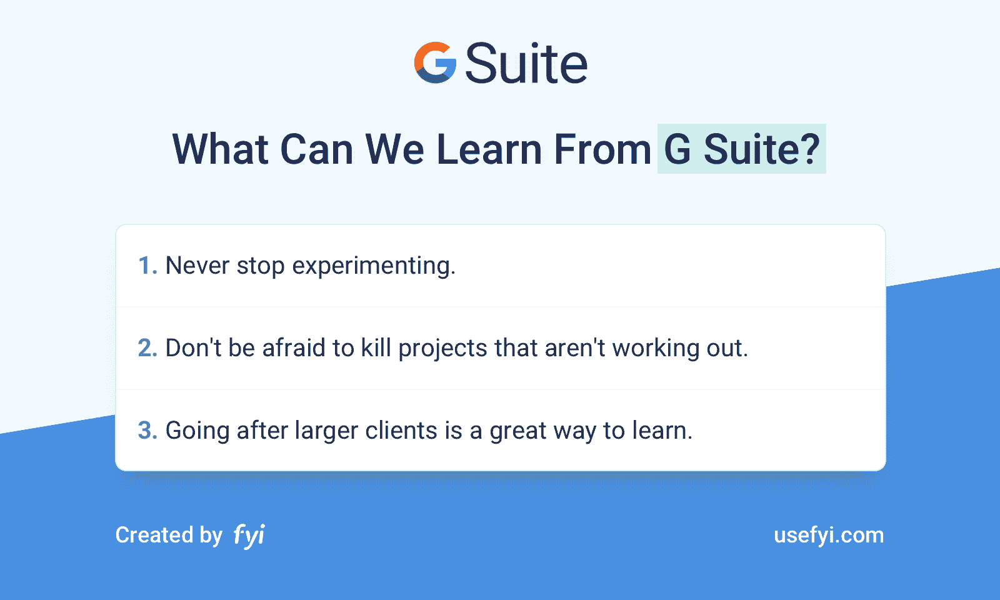

1.永远不要停止实验。谷歌不断试验和冒险的内部文化已被证明是谷歌发展的重要驱动力，也是公司不断学习的过程。虽然大多数初创公司的创始人不能推出上网本来“看看会发生什么”，但初创公司可以进行许多小实验。

看看你的产品，回答以下问题:

*   现在可以做什么实验？我们希望从这些实验中学到什么？我们多快能设置好它们？我们将如何衡量它们？
*   谷歌对其硬件项目和 Chrome OS 的雄心被苹果 iPad 的意外发布和流行所粉碎。不管你的产品是实物产品还是数字服务，你如何识别在快速变化的市场中可能出现的潜在漏洞？这些威胁给你的产品带来了什么样的风险？
*   谷歌从微软的自满中看到了机会，并利用这一机会开发了一款更快、更易用的免费产品。这一举动彻底背离了 2004 年的核心搜索业务。你能在自己的行业中找到类似的机会吗？它们可能看起来像什么？

2.不要害怕扼杀那些不成功的项目。正如谷歌从来不羞于尝试新事物和押注从未成功的项目(谷歌眼镜，有人吗？)，企业家不应该害怕“杀死他们的宠儿”，停止生产产品，甚至停止不交付的实验。

回想一下你的产品迄今为止的历史:

*   老实说——你曾经被沉没成本谬论所欺骗吗？如果是这样，你会有什么不同的做法？
*   相反，想想你取消一个项目或停止开发一个新功能的时候。如果你允许实验继续进行，会发生什么？
*   谷歌从来不羞于尝试新事物。然而，即使是公司的失败也是宝贵的学习机会，公司利用这些机会来制定未来的计划。你上一次从一个失败的计划中学到有价值的东西是什么时候，你是如何把你学到的东西应用到你未来的计划中的？

3.追逐大客户是一个很好的学习方法。在 G Suite 的早期，该公司有意瞄准像 Salesforce 和宝洁(T2)这样的大公司，尽管当时它的企业产品有点缺乏。对于 G Suite 团队来说，这是一次非常有价值的学习经历，并提供了对企业客户需要什么以及他们如何工作的前所未有的洞察力。

思考你的产品、你所处的行业，以及你如何营销和定位你的产品:

*   如果你能神奇地在一夜之间得到你的梦想客户或顾客，那会是谁？你能从获得他们的生意中学到什么？
*   你如何向客户或公司证明你的产品的价值？为了实现这一目标，你需要做些什么？
*   假设你正在开发一个主要面向 B2B 目标市场的 SaaS 产品。一个大型的、家喻户晓的品牌向你提出了一个愿望清单，列出了他们希望在你的产品中看到的、能让这个品牌考虑使用你的产品的三个特性——但你只能制造一个。您如何确定构建哪个功能的优先级，这对您的发展战略有什么影响？

## 云中的头

看着谷歌在如此长的时间内逐步迭代 G Suite 是一件令人着迷的事情——更不用说它是如何精明地从微软手中夺取宝贵的市场份额了。

G Suite 可能永远不会像许多人认为的那样成为 Office 杀手级应用，但谷歌不需要打败微软就能成功。对于数百万用户来说，G Suite 早在几年前就超过了 Office。未来几年，谷歌将如何利用其越来越受欢迎的生产力套件，以及微软和饥渴的新来者将如何应对，仍有待观察。

你用 G 套件吗？ *使用 FYI ，你只需点击 [3 次或更少，就能找到你的 G Suite 文档以及其他应用程序的文档。](https://nira.com)*