# 从展示 HN 到 D 系列| Twilio 细分博客

> 原文：<https://segment.com/blog/show-hn-to-series-d/?utm_source=wanqu.co&utm_campaign=Wanqu+Daily&utm_medium=website>

每隔六个月，你就会在黑客新闻上看到这样一个帖子:

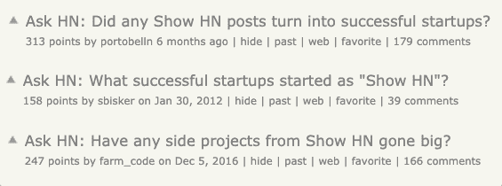

现实是，白手起家创业很难。你需要合适的人、合适的产品、合适的时机，通常还需要很多运气。但即使是这些也不能保证成功。

在细分市场，我们有着不可思议和不可思议的运气，在那些确切的条件下建立了一个真正的企业。六年半前，我们推出了我们产品的第一小片，作为展示品 HN 邮报。

我们还有很长的路要走。然而，今天是一个重要的里程碑。 [**我们宣布，我们已经筹集了 1.75 亿美元的 D 轮融资**](http://www.globenewswire.com/news-release/2019/04/02/1795157/0/en/Segment-Raises-175-Million-Series-D-to-Liberate-Customer-Data-from-CRM-and-Usher-in-a-New-Era-of-Customer-Relationships.html) 。对我们来说，这是一个重要的时刻，如果没有我们所有用户的支持和反馈，这一时刻就不会到来。

像每一次创业旅程一样，我们也经历过起起落落。在本帖中，我们想让您了解 Segment 在第一年的历程；从**最初的产品发布**，到我们的**第一百个客户**，再到**我们用来筹集第一笔资金的宣传平台**。对于所有处境相似的创业公司，希望你能从我们的经验中吸取一些东西，并应用到你自己的创业中。

六年前，我们只是四名工程师，坐在旧金山俄罗斯山上的一间公寓里。我们有 6 个月的走秀时间，而且几乎不给自己任何报酬。

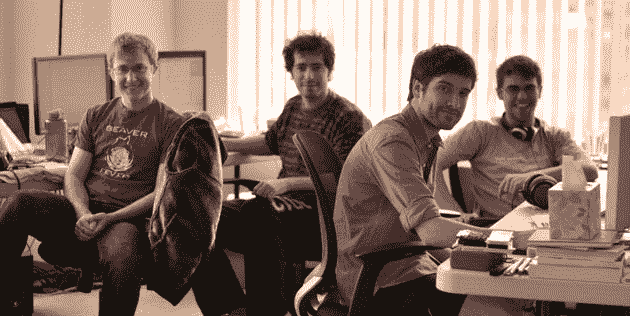

这是我们登上 HN 后第一年的故事。

# 显示 HN: Analytics.js

让我们从 2012 年 12 月开始。那时，我们四个人已经为失败的想法努力了 18 个月。我们还有 9 个月的走秀时间。

给你一个到目前为止的超级缩略时间表:

*   2011 年 5 月:我们被 Y Combinator 接纳为他们 2011 年夏季项目的一部分(作为一家教育科技创业公司！)

*   【2011 年 9 月:我们完成了 YC 那一批，筹集了一轮种子资金，然后搬到了波士顿

*   【2011 年 10 月:在数千行代码之后，我们意识到我们的 Edtech 初创公司没有适合市场的产品，所以我们转向构建一个专注于细分市场的 Mixpanel 竞争对手

*   2012 年 5 月:我们搬回旧金山

*   【2012 年 12 月: 6 次产品迭代之后，什么都没用。我们试图在团体旅行计划者和最终的细分市场之间做出选择。那是一段黑暗的时光。

我们意识到我们只有最后一次机会了。所以我们决定开源一个我们构建的库，通过一个 API 将我们的分析数据发送给所有不同的分析工具(包括我们的 Mixpanel 竞争对手)。

当时，它只是一个 400 行的 javascript 文件，可以将数据发送到 T2 的八个目的地:T4、谷歌分析、KISSmetrics、Mixpanel、Intercom、Customer.io、CrazyEgg、Olark、T5 和 T6 Chartbeat。

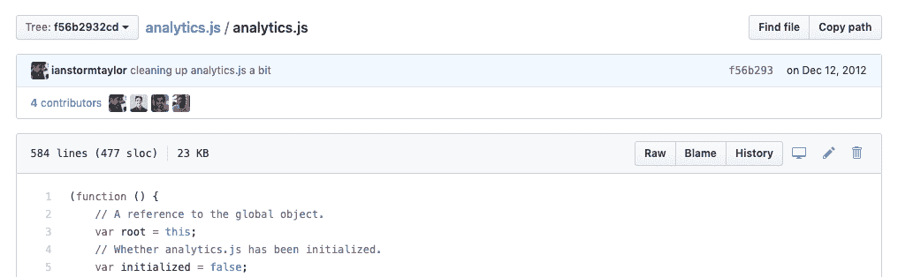

掩盖这些不同的 API 看起来似乎是一个微不足道的问题…但这个问题显然已经让我们很恼火，以至于我们不得不编写一些代码来解决它。

我们内部讨论了 5 天，这个周末项目实际上是否是一个可行的业务。我们一直在兜圈子，提出支持和反对这个想法的论点。尽管我们尽了最大努力，我们还是无法达成共识。

所以我们对它进行了测试。2012 年 12 月 12 日，[我们在 HN](https://news.ycombinator.com/item?id=4912076) 推出了这款产品，反响令人震惊:

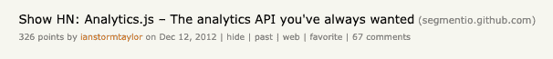

这篇文章一整天都坐在黑客新闻的首位，有数百次投票，数十条评论和数百条推文。但最令人惊讶的是，专业工程师说“我们在工作中需要这个。”

我们被吹走了。我们终于碰到了一个真正的问题——但我们是否能建立一个企业还有待观察。

我们在 segment.io 上发布了一个登陆页面，以测试用户是否想要一个托管版本。我们告诉他们留下他们的电子邮件，然后我们会回复他们。

那天，我们收到了数百封类似下面这样的电子邮件，不分昼夜地涌来:

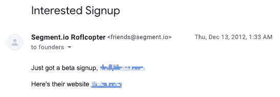

我们终于造出了人们想要的东西！我们终于挖掘出了一些真正有潜力的东西，并开始解决一个真正的商业问题。因此，我们连续七天致力于交付产品的第一个版本。

它是最小的——它所做的只是为用户托管 Analytics.js。他们可以打开我们 10 个集成中的任何一个，输入他们的配置，我们将在 Cloudfront CDN 后面呈现一个定制版本。我们还通过节点 API 收集这些事件，并在仪表板中显示这些事件，但是没有任何数据通过我们的服务器主动代理。

寒假是我们的 API 第一次有稳定的流量。我们看到每秒钟都有几十个请求进来。

这与我们今天看到的成千上万的请求相去甚远，但至少是一个开始:

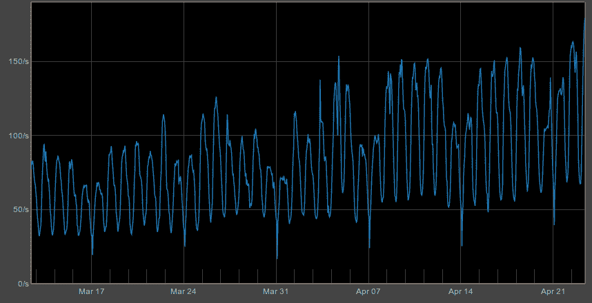

# 全力投入 Segment.io

我们在 1 月份回来，开始在 Segment.io 上“全押”

我们联系了几家不同的媒体，最终宣布我们得到了 YC 的资助。我们很幸运，TechCrunch [报道了我们的故事。](https://techcrunch.com/2013/01/25/yc-backed-segment-io-lets-developers-integrate-with-multiple-analytics-providers-in-hours-not-weeks/)

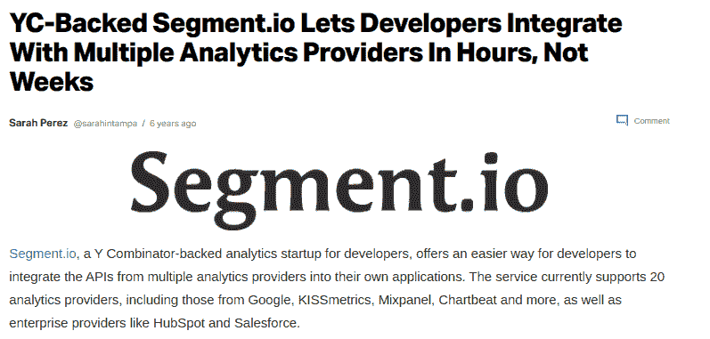

在早期用户采用和媒体关注的推动下，我们接下来将注意力转向构建功能。

我们在这个阶段做过的最有价值的事情是通过 Olark 启用 livechat。它给了我们一个无与伦比的窗口来了解用户的需求。

与我们早期的想法不同，我们现在得到了关于产品的持续不断的反馈。人们会开始使用该产品，然后不断要求我们提供更多。

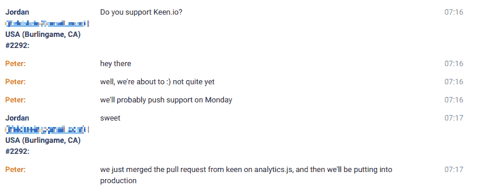

这对我们来说是一种振奋人心的感觉。他们没有模糊地猜测用户可能想要什么，而是直接告诉我们！

既然我们已经有了产品市场适应的早期“品味”,我们就开始疯狂地建造。我们从[保罗·格拉厄姆的](http://paulgraham.com/startuplessons.html) [(pg)](http://paulgraham.com/startuplessons.html) [中吸取了一叶创业的教训:](http://paulgraham.com/startuplessons.html)

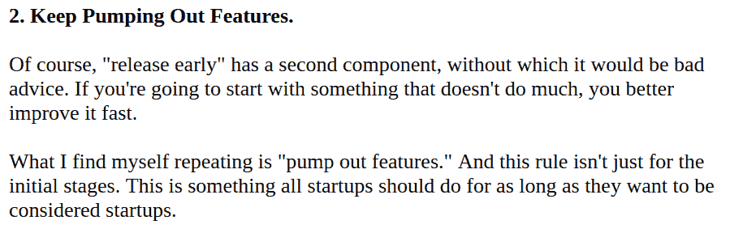

我们接受了他的建议。我们不断与用户交流，推出新功能，看看哪些功能能坚持下去。在前四个月，我们增加了:

*   **6 个客户端库** : Node、Ruby、Python、Java、。NET，PHP

*   23 服务器端集成

*   **2 个移动图书馆**和 iOS + Android 的原生集成

在那段时间里，我们只有一个媒体来宣传我们的产品:我们的博客。我们没有真正的媒体联系人，没有分析师关系，我们当然也没有钱买广告。

所以我们建了又建，并在我们的博客中强调了我们所建的…

虽然在我们的博客上发表确实有助于我们宣传我们正在建造的东西，但是有一个问题。

我们觉得它没有抓住用户的所有问题。它有助于回答“细分市场的新功能是什么？”但是它完全忽略了“我应该如何思考分析”这个问题

当时，对于许多公司来说，分析是一个相对较新的概念。仅仅谈论特性是不够的；我们需要帮助企业了解使用它们的最有效方式。

为了帮助回答这个问题，我们推出了 [**分析学院**](https://segment.com/academy/) [。](https://segment.com/academy/)

# 通过分析学院从功能到内容

分析学院是我们尝试创建自己的内容营销的第一次尝试。我们通过电子邮件向我们的用户发布了它(也在 HN 上发布了[)。](https://news.ycombinator.com/item?id=5183824)

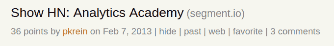

前提很简单。每周，我们都会发布一个新的课程，承诺带你从零到分析专家。我们希望这是一个传播我们过去一年在分析生态系统中获得的所有知识的好方法。

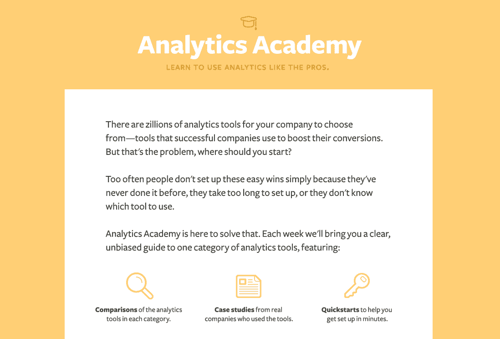

似乎我们又一次找到了人们想要的东西！整个分析生态系统令人困惑……有数百家不同的供应商……我们的内容似乎真的能教会我们的用户一些东西。

问题是，我们的内容似乎没有登陆。我们没有看到它被重新分享，帖子似乎也没有引起共鸣。与我们之前在博客上的成功相比，这一切都感觉很差劲。

伊利亚(我们四个人中的一个)给他的哥哥迈克发了一份草稿，征求他的反馈，迈克经营着自己的创业公司。

在我们发表的一篇关于实时聊天工具的帖子中，Mike 对我们提出了一些残酷但诚实的批评。他给我们回了封邮件:

他指出，学院的帖子激起了他的兴趣…但并没有真正实现他们的核心目标:*教他有关分析的知识。*

我们打算在接下来的帖子中做得更好。对于每一个，我们都专注于一系列细节。他可以马上拿走的东西来帮助他的生意。

到了三月，我们已经到了一个更好的地方:

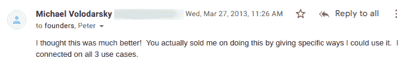

从那以后，这个教训就一直伴随着我们。我们的目标是让我们博客上的所有内容既具体又可行。

我们最终发布了六个不同的教程，从仪表板到实时聊天和电子邮件工具。这并不容易，但现在学院仍然是迄今为止我们最受欢迎的内容之一。

# 钱用完了:大桥回合

尽管我们第一次尝到了产品与市场匹配的成功，但我们开始遇到一些严重的问题。

5 月份，我们的资金开始枯竭。我们还没有开始对产品收费，我们正在考虑大约三个月的时间。

我们计划融资 100 万美元，作为估值 800 万美元的更大一轮种子融资的一部分。我们在我们的网站上公开定价，承诺有吸引力和很大的势头，但我们仍然是预收入。

彼得正在筹集资金，并联系了我们关注的所有投资者。我们发了几十封邮件，有 3 封回复了。其中包括 e.Ventures 和 KPCB。

为了让您了解业务的现状，我在下面提供了来自我们的 **2013“系列种子”推介资料**的全套幻灯片。按照[YC](https://blog.ycombinator.com/intro-to-the-yc-seed-deck/)的建议，我们包括:1)对产品极其清晰的描述 2)相关的预收入指标 3)一套对未来的想法。

**幻灯片 1 & 2**

我们从产品的简单描述和一些截图开始，为投资者提供细分市场的基础。

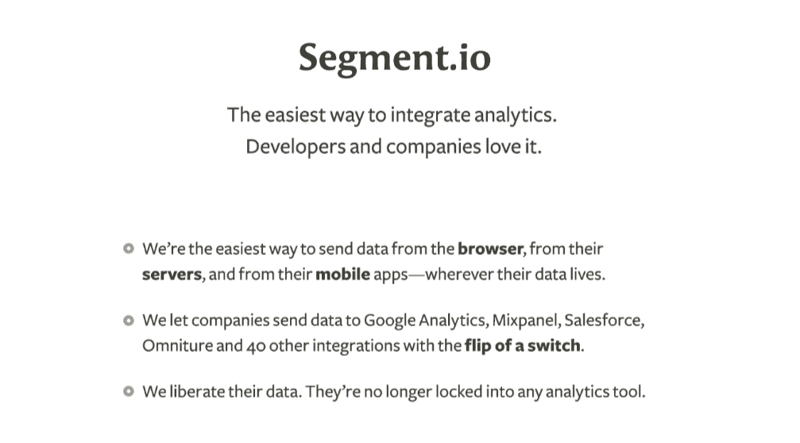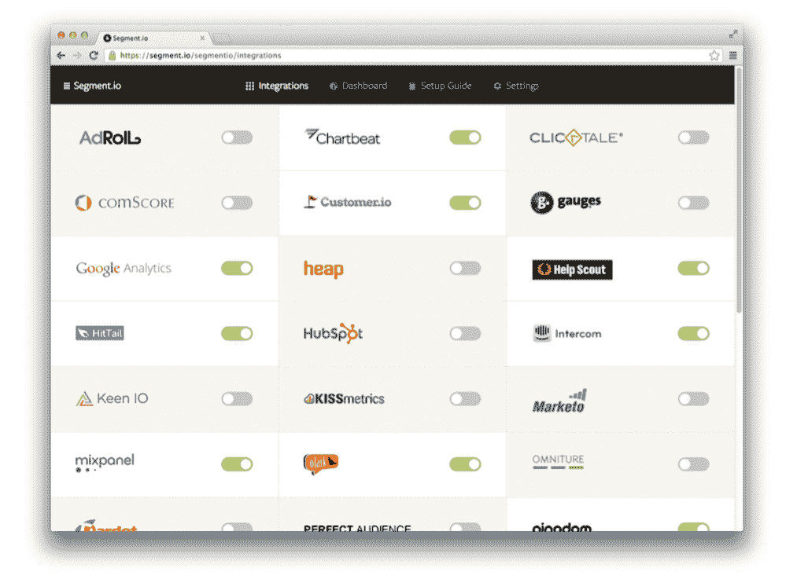

本质上，Segment 是一种技术产品，因此解释它的作用和工作方式是关键。几周前，我们刚刚推出了我们的移动图书馆，我们正在利用新版本的势头。

**幻灯片 3 & 4**

接下来是我们的增长数字。

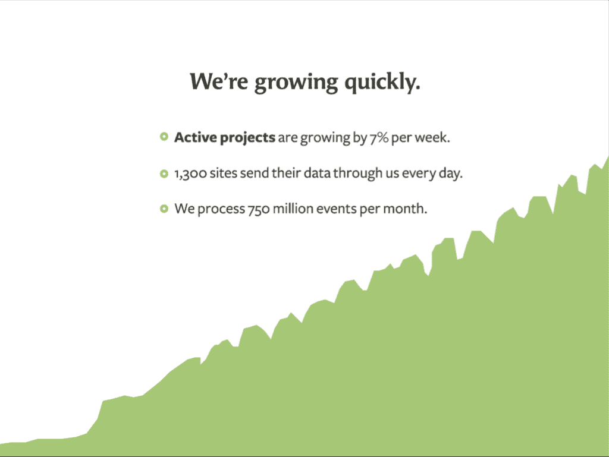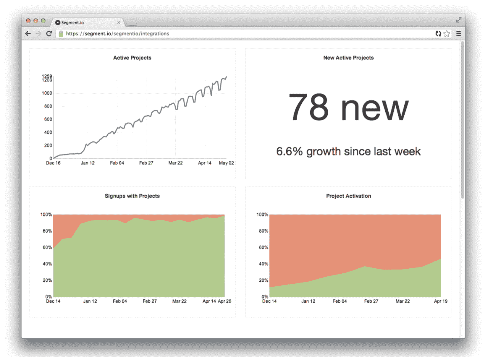

对我们来说重要的主要指标是发送数据的新项目的数量。我们的定价基于数据量，每个新项目每月至少支付我们 10 美元。

第二张幻灯片中显示的图表是我们每周都在看的图表。奇怪的是，我们没有使用分析工具(今天我们使用 Mode 而不是 Redshift)，而是连接了一个 Google sheet。我们总是喜欢能够查看原始数据。

左上图显示了发送数据的活动项目的数量。您可以看到它呈线性增长，有时在周末较小的项目不发送数据时会下降。

左下方的图表显示了实际创建项目的注册用户的百分比(我们漏斗中的第一步)。右下角的图表显示了实际到达发送数据点的项目的百分比。

我们把这些放在公寓的仪表板上，虔诚地监控着它们。你可以看到我们在大约两周内将注册流程固定为“自动创建”项目，并稳步开始看到更高水平的激活。

**幻灯片 5 & 6**

由于我们没有太多(阅读:接近零)的收入可言，我们认为“社会证明”会更好。

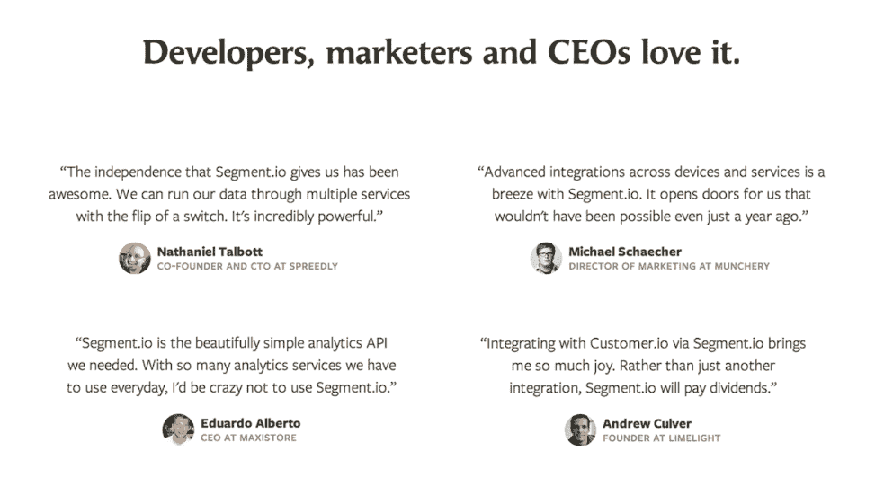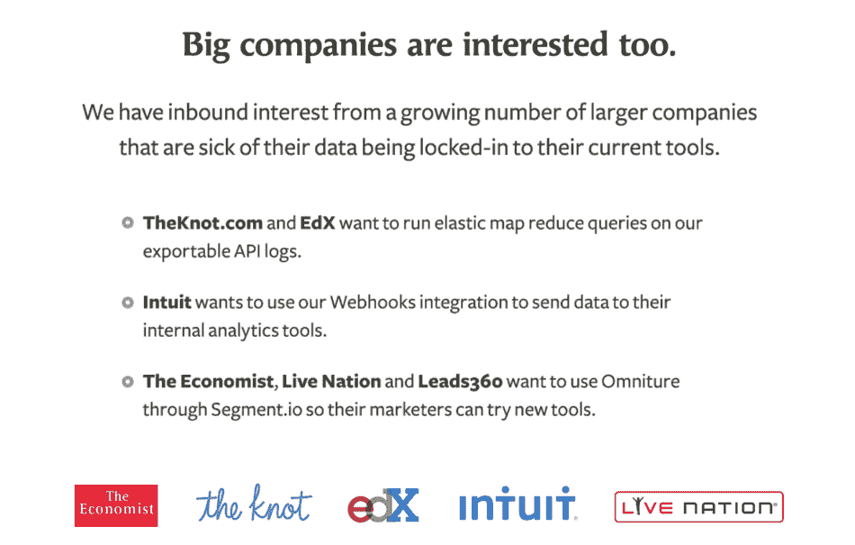

这最后一张幻灯片在我们后来筹集 A 轮融资时变得至关重要，尽管回过头来看，我们意识到当时包括它是多么厚颜无耻。

正如我们向投资者明确表示的那样，这些公司中没有一家实际上在当时使用了部门。他们都表达了兴趣和他们想做的事情的意图。但是我们没有说服他们中的任何一个人真正使用这个产品。

一年后，当我们开始筹集 A 轮融资时，我们再次展示了这张完全相同的幻灯片，但我们自豪地指出:*“一年前，这六家潜在客户表达了兴趣。如今，这上面的六个名字中有五个已经成为了客户。”*

Segment 一直在这里。

**幻灯片 7 & 8**

为了真正说明这一点，我们放了几张幻灯片，介绍我们在市场中的定位、我们可能如何盈利，并详细说明了使用细分市场的好处。

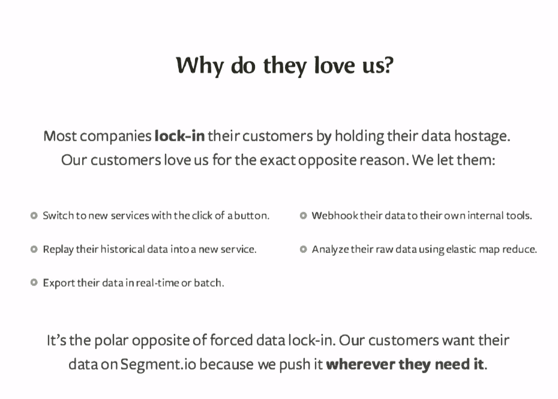

今天变化最大的是我们的盈利方式。当时，我们认为与合作伙伴分享收入可能是一个好主意，但最终收入流很小，而且在向客户提供最佳工具方面存在利益冲突，因此我们不再与合作伙伴分享收入。相反，我们只从客户那里获得收入。

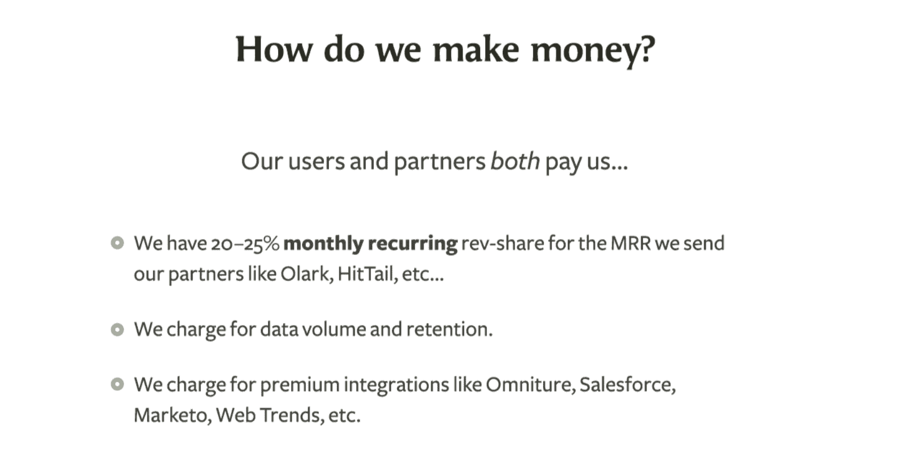

**我们也不再对高级集成收费**。我们很快意识到，当用户集成更多的工具时，他们可以从细分市场中获得最大的价值。让用户在启用集成之前三思，感觉对我们的客户和我们自己的伤害大于帮助。

**第九张幻灯片**

当然，我们想分享一些我们对未来的想法。构建一个简单的方法来集成不同的工具就像是 Segment 的第一步。我们认为我们更大的前进道路是为客户数据创建平台。

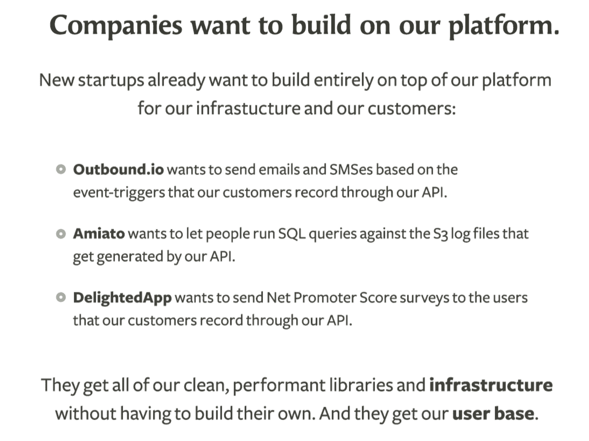

我们最终整合了其中 2/3 的公司(我们从未有机会与被亚马逊收购的 Amiato 合作)。

随着上个月我们[开发者中心的启动，这一承诺越来越成为现实。从那时起，**我们已经增加了 180 个集成。**仅在过去的一个月里，我们就增加了](https://segment.com/blog/the-growth-stacks-of-2019/) [**25 个新的集成**](https://twitter.com/webaficionado/status/1103012975894392832) ，全部建立在细分数据之上。

**幻灯片 10 & 11**

最后，我们解释了我们的目标:成为让您管理客户数据的基础设施。随着我们的成长，这种宣传基本上是一致的。Segment 是发送您的第一方数据的地方。

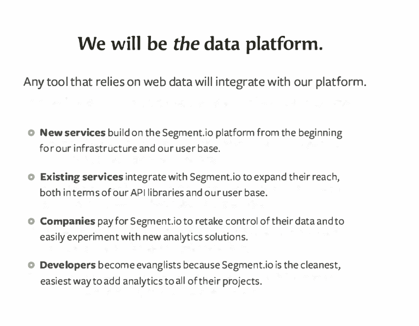

最后，我们分享了我们能找到的所有凭证。这是一个很短的名单，有四个人以前从未做过“真正的”工作……但是两年的经验足以让我们变得危险

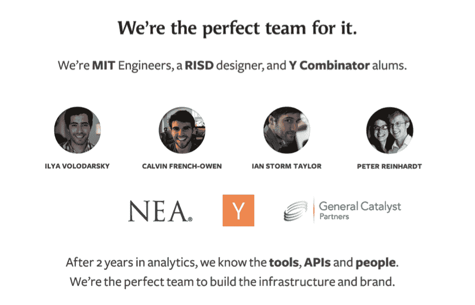

就这样了！

我们在 e.ventures 和 KPCB 的新融资中关闭了$2M，这给了我们必要的跑道来度过下一年，并超过我们年度经常性收入 100 万美元的第一个里程碑。

这是彼得发给我们在 KPCB 的合伙人雷的电子邮件，就在这轮融资以 200 万美元结束后，融资后估值为 1050 万美元。

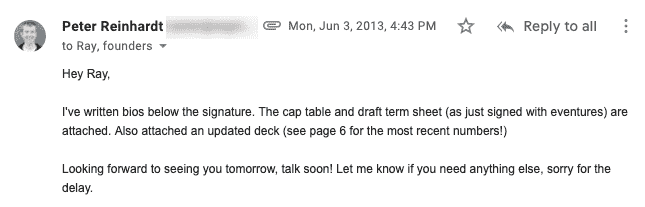

那年 11 月，我们开始招聘工程、客户成功和销售人员。我们在 2013 年 11 月预订了第一份年度合同。那一年，我们从 4 个人发展到 10 个人，开始了规模化的道路。

# 从那时起我们的进化

自早期以来，细分市场发展迅猛。

*   最初节目《HN》中的 analytics.js 现在每月在**10 亿**不同的设备上加载**150 亿**不同的次数

*   我们的数据量增长了 **10，000 倍**，现在每秒处理**超过 100，000 条消息**

*   我们现在为一些世界上最大的品牌的客户数据基础设施提供支持，包括 [**、IBM**](https://segment.com/industry/enterprise/) [、](https://segment.com/industry/enterprise/)[**21 世纪福克斯、Intuit**](https://segment.com/industry/enterprise/) [和](https://segment.com/industry/enterprise/) [**VMWare**](https://segment.com/industry/enterprise/)

*   我们已经从 [**段. io 重新贴牌为段**](https://news.ycombinator.com/item?id=8427713) [**(而**](https://news.ycombinator.com/item?id=8427713) [**拿到了。com！)**](https://news.ycombinator.com/item?id=8427713)

*   我们扩展了细分市场平台，我们的集成目录从 [**8 个集成**](https://segment.com/catalog/) [增加到](https://segment.com/catalog/)[**250 多个**](https://segment.com/catalog/) **。**

*   我们的用户现在在一年中启用了超过 **80，000** 个新目的地，这相当于每个工作日每 **1.4 分钟**启用一次整合。

*   我们已经构建了详细的视图，用于理解进入段 的 [**数据，以及去往我们所有目的地**](https://segment.com/blog/the-new-live-debugger/) 的 [**数据**](https://segment.com/blog/new-data-visibility-features/)

*   我们添加了对 [**数据仓库**](https://segment.com/blog/best-data-warehouse/) 和来自[**云数据源**](https://segment.com/blog/introducing-sources-your-data-together/)[**牛肚、**](https://segment.com/blog/introducing-sources-your-data-together/)[**S**](https://segment.com/blog/introducing-sources-your-data-together/)[**ales force 和**](https://segment.com/blog/introducing-sources-your-data-together/)[**Z**](https://segment.com/blog/introducing-sources-your-data-together/)[**endesk**](https://segment.com/blog/introducing-sources-your-data-together/)

*   **我们增加了[**d**](https://segment.com/blog/exactly-once-delivery/)[**e-**](https://segment.com/blog/exactly-once-delivery/)[**d**](https://segment.com/blog/exactly-once-delivery/)[**重复，以确保消息**](https://segment.com/blog/exactly-once-delivery/) 即使面对脆弱的网络也能正确处理**

*   **我们已经将我们的核心管道重写为 [**，以改善在下游故障**](https://segment.com/blog/introducing-centrifuge/) 时的交付和重试行为**

*   **发布了一个 [**公共 API，用于管理工作区、源和目的地**](https://segment.com/blog/config-api-convenient-and-extensible-workspace-configuration/)**

*   **发布了我们的第二个产品 [**，人物角色**](https://segment.com/blog/put-your-customers-first-with-personas/) ，它在我们的核心产品之上提供受众管理**

*   **发布了我们的第三个产品， [**协议，这是一个帮助执行您的跟踪计划**](https://segment.com/blog/introducing-protocols/) 的产品，我们的用户已经为客户创建了 **500** 不同的跟踪计划**

*   **成为 [**ISO 认证、**](https://segment.com/security/)T5 并发布了新的 [**bug 赏金程序**](https://segment.com/security/)**

*   **这个团队已经从 4 人发展到 350 人(T2+T3)，现在遍布全球的 5 个办公室(T4)**

**为了推动所有这些产品改进，我们还对基础架构进行了大量更改。自 2012 年首次发布以来，我们:**

**也就是说，有些事情没有改变。我们的博客仍然是我们发布产品的主要渠道。我们不断开源我们的内部工具，与社区共享。我们一直在阅读 HN 关于这项业务的每一条评论和推文。我们继续分享我们学到的东西。**

**最重要的是，我们一直在努力为客户创造动力和价值。并非我们所有的赌注都成功了。但是只要我们继续下注，他们中的一些人就会下注。**

# **展望未来**

**通过这次最新的融资，我们有三种新的方式来为客户服务:**

****1。继续扩建平台****

**在过去的 6 年里，我们已经从 8 个整合发展到超过 250 个 T2 整合。今年，我们的重点是大幅增加这一数字。我们将继续通过我们的[开发者中心](https://segment.com/partners/integration/)提供更强大的整合方式，并继续让新的合作伙伴加入细分市场生态系统。仅在这个月，我们就增加了 **25 个与细分市场整合的新合作伙伴。****

****2。重复我们的定价****

**我们听到的反馈是，对于早期、大规模、以消费者为中心的初创公司，我们的定价可能会很贵。我们已经采取了第一步来解决这个问题，我们的启动项目[免费赠送两年的片段](https://segment.com/industry/startups/)。正如我们所说的，我们正在与世界各地的初创公司合作，以找出更适合他们的定价结构。**

****3。给你超能力****

**我们今年的新目标是“给你超能力”。我们有大量的产品在我们的管道中，应该给你无与伦比的方式来管理你的数据管道，所有这些都不改变你的跟踪代码。高级过滤、工作流和隐私产品正在开发中。**

* * *

**从更个人的角度来说，我们要感谢每一个一直陪伴我们的人。直到今天，我们四个人仍然会转发来自我们最早的用户和客户的 5 年前的电子邮件。你对产品的兴奋给了我们继续生产的信心。**

**没有你，Segment 会是另一个失败的副业。在您的帮助下，我们现在能够帮助成千上万的企业为他们的客户提供世界级的体验。明天，我们期待着帮助成千上万的人。**

**谢谢你。**

**-细分市场创始人**