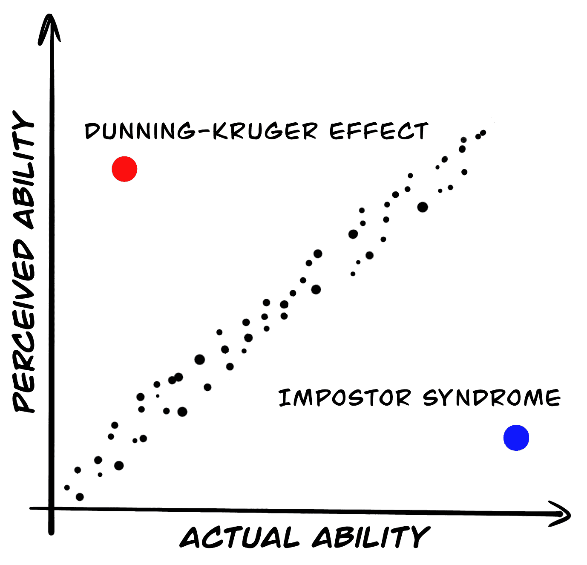

# 伟大的开发人员是培养出来的，而不是雇佣来的——爱德华·西佐夫

> 原文：<https://sizovs.net/2019/04/10/the-best-developers-are-raised-not-hired/?utm_source=wanqu.co&utm_campaign=Wanqu+Daily&utm_medium=website>

市场上的每家公司都在寻找最优秀的人才。公司都在等着“人才”会从哪里冒出来，就像有秘密的人才工厂一样。理想的候选人将具备所有必要的技能，将是一个很好的“文化契合”，并将在很少或没有监督的情况下表现良好。

* * *

但是有一个问题:

我雇佣的最好的开发人员远不是理想的候选人。他们缺乏技术技能，不知道如何测试软件，也不知道如何在敏捷团队中工作。他们不相信自己和自己的能力。他们不认为自己能成为好领导。在求职面试中，他们听起来没有说服力。**他们中的一些人患有冒名顶替综合症，怀疑自己的实际能力:**

Impostor Syndrome vs. Dunning-Kruger Effect

如今，公司创造了复杂得离谱的多步面试流程，[过滤掉](https://rejected.us)名“不够好”的候选人。我们很少给被劣质公司和恶劣影响宠坏的候选人机会。我们忘记了一些候选人不够幸运，没有遇到鼓舞人心的导师或在支持他们的团队中工作。坏掉的玩具不受欢迎:

A broken toy

我们更喜欢雇佣有可靠记录的自信摇滚明星。原因很简单——我们未能创造环境和工作条件，让人们能够专业成长，养成良好习惯，成为摇滚明星。熟练的开发人员没有时间指导，因为他们忙于编码和架构。指导不是我们招聘和交付流程的一部分。指导不是一个时髦的词，你不能在 Coursera 上学习它，也不能在科技雷达上看到它。

公司在 TA 部门、招聘人员、推广网站和视频上花费数百万，努力寻找最优秀的人才。我们有这个疯狂的人才搜索问题，因为公司正在寻找最好的工程师，而不是培养他们。大家都在钓鱼，但是剩下的鱼不多了。招募更多的渔民并向他们支付高额佣金于事无补。池塘是空的。

Nowaday's recruiting

在当前的市场形势下，每个公司都需要建立指导能力。最有经验的开发人员应该找时间通过结对编程、持续反馈、职业建议来培养经验不足的同事。我们必须建议[书籍](/2019/03/17/the-best-books-all-software-developers-must-read/)、博客、[视频](https://youtube.com/c/DevTernity)，鼓励同事参加聚会、[会议](https://devternity.com)和研讨会。

指导并不容易；它需要大量的时间投入和优秀的沟通技巧。我们必须鼓励工程师[发展](https://principal.dev)指导技能。如果你不确定是否应该花时间指导，我可以向你保证，指导是获得追随者和提升你的权威和声誉的最佳方式。**你的学员将在你的余生中支持你，提拔你。**

Your mentees are your fan club.

通过在工作中培养指导能力，你可以雇佣新人、坏掉的玩具、冒名顶替者，并把他们变成忠诚的高素质劳动力。将焦点从评估转移到指导可以简化你的面试过程。不要试图通过问一些尖锐的问题并让应聘者经历九层地狱来预测未来的表现，你可以雇佣具有成长心态的应聘者并培养他们。

你能把这块石头扔到垃圾桶里吗？

A stone that doesn't look like a diamond

经过精心切割和抛光的同一颗宝石:

Now it's a beautiful diamond.

有人必须拿出一颗看起来像普通石头的原石，切割、抛光，瞧，你就有了一颗漂亮闪亮的钻石。公司正在寻找抛光钻石，并创造了将原钻扔进垃圾桶的招聘流程。

我们可以学会打磨钻石，而不是扔掉它们。我们可以创造一个环境，让有学习热情和能力的人成为优秀的开发人员。

怎么会？

*   把你花在招聘上的一些钱、精力和时间投资到[教授](https://principal.dev)你最好的开发人员指导技能上。给你最好的开发人员时间进行指导，把他们从日常任务中解放出来。他们将建立一支超出你预期的员工队伍。

*   调整你的面试流程，给那些还不够优秀，但是渴望学习，有成长心态的考生一个机会。它们是未加工的钻石。

*   放松招聘广告中的“硬性要求”,避免过滤掉冒名顶替者。记住，大多数女性只申请完全符合要求的职位。

*   如果你在大公司工作，关心我们的职业，可以考虑为完全的新手创建一个训练营。

你可以创造一个环境，让有经验的开发人员指导没有经验的开发人员，从而逃避这场疯狂的招聘竞赛。雇佣态度，教授技能。伟大的开发者是培养出来的，不是雇佣来的。

成为这样一家公司:我们正在~~招聘~~ **指导**。

