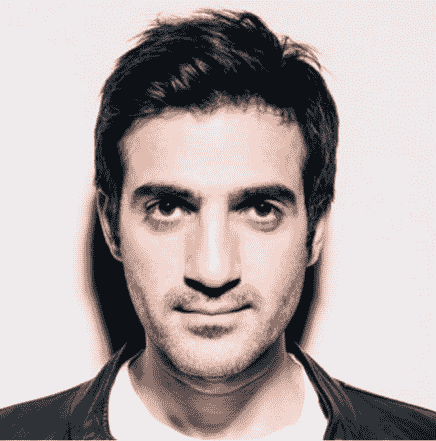
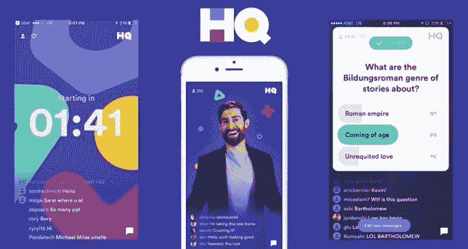
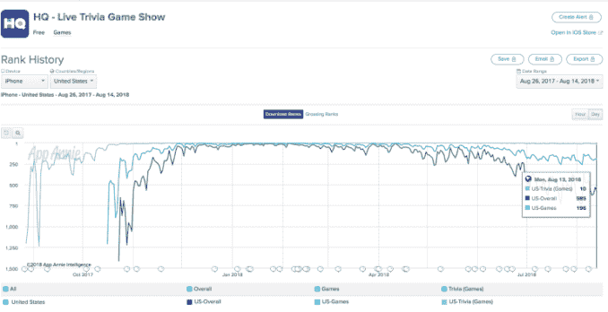
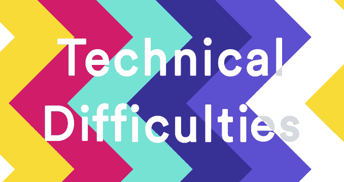
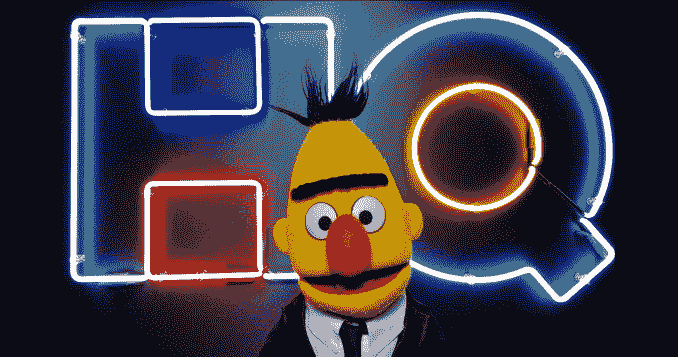
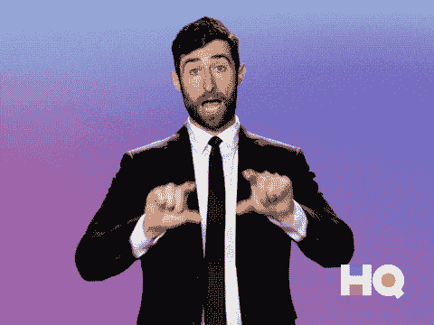

# 总部琐事哗变未能驱逐首席执行官 TechCrunch

> 原文：<https://techcrunch.com/2019/04/14/trivia-game-of-thrones/?utm_source=wanqu.co&utm_campaign=Wanqu+Daily&utm_medium=website>

主持人 Scott Rogowsky 本周被驱逐出 仅仅是决定谁将领导总部琐事的持续斗争的一个征兆。根据多个消息来源，超过一半的初创公司员工签署了一份内部请愿书，要求罢免首席执行官 Rus Yusupov，因为他们认为他对公司管理不善。但 Yusupov 随后解雇了兵变的一些核心支持者，导致士气下降，反映了总部应用商店排名的直线下降。

TechCrunch 采访了熟悉 HQ Trivia 内部问题的多个消息来源，以拼凑出这款视频直播手机游戏是如何从一鸣惊人到几近破产的。两名消息人士称，总部最近只有大约 600 万美元的银行存款，但每个月都在燃烧超过 100 万美元，这意味着它的跑道可能正在缩小。但是它的早期投资者不愿意给 Yusupov 更多的现金。

【2020 年 2 月 14 日更新: [HQ Trivia 已经关闭](https://techcrunch.com/2020/02/14/hq-trivia-shuts-down/)并裁员。]

员工请愿罢免 HQ Trivia 的首席执行官 Rus Yusupov

随着 2017 年 8 月推出 12 道问答游戏，HQ 重新构想了游戏和移动娱乐，玩家们都在每天两次的直播节目中竞争；任何答对所有问题的人都将分享一份现金大奖。因为你只能在指定的时间参与游戏，所以游戏感觉很紧迫，与朋友或陌生人玩游戏很有趣，获胜的意义是单人游戏或不间断在线游戏无法比拟的。

当 [TechCrunch 在 2017 年 10 月](https://techcrunch.com/2017/10/17/hq-trivia/)撰写第一篇关于总部琐事的报道时，它只有 3500 名并发玩家。但到了 1 月份，它已经攀升至 App Store 中第三大游戏和第六大应用，并在 3 月份增长到 238 万玩家。很快，来自中国和脸书的模仿者进入了市场。但是他们都缺少 HQ 的秘密武器——勇敢的主持人，喜剧演员斯科特·罗格夫斯基。他被每天玩游戏的“HQties”亲切地称为“智力竞赛爸爸”、“智力竞赛哈利法”、“主持人马龙”和“陷阱特雷贝克”,他是这家初创公司事实上的代言人。

然而，总部的基础并不稳固。据 Recode 报道，联合创始人科林·克罗尔(Colin Kroll)也与尤素波夫一起创建了 Vine，并将其出售给了 Twitter，但在 18 个月后，他因管理不善被 Twitter 解雇。TechCrunch 了解到，他还因在女员工和 Vine stars 周围令人毛骨悚然而臭名昭著。快速增长和早期 HQ 投资者 Jeremy Liew 的调查发现 Kroll 没有严重的不当行为，为 1500 万美元的投资铺平了道路。这轮融资由 Founders Fund 的 Cyan Bannister 牵头，对 HQ 的估值超过 1 亿美元。

Yusupov 未能将现金转化为持续增长和产品创新。他的公开行为已经引起了注意。在电视台的泰勒·洛伦茨未经尤素波夫同意采访罗戈夫斯基后，他对一名《每日野兽》记者大喊大叫，威胁要解雇主持人。“你让斯科特的工作岌岌可危。这是你想要的吗？。。。  请把你的故事一字不差地读给我听，”尤素波夫说。当他得知罗戈夫斯基表达了他对沙拉连锁餐厅 Sweetgreen 的偏好时，尤素波夫喊道:“他不能这么说！我们与 Sweetgreen 没有品牌交易！在任何情况下他都不能这么说。”第二天，Yusupov 谎称他从未威胁过 Rogowsky 的工作。

由于总部的银行账户已满，消息人士称 Yusupov 做决定极其缓慢，导致总部停滞不前。通过电话玩游戏赚钱的新鲜感已经开始消退，人们越来越忽视 HQ 的推送通知来加入它的下一个游戏。但是，除了引入一些嘉宾主持人和在回答错误后购买第二次机会的选择权，总部停止了发展。 [HQ 随着并发玩家的减少](https://techcrunch.com/2018/08/14/hq-trivia-apple-tv/) 落到了 iOS 上第 196 位的游戏和第 585 位的整体 app。

从那时起，事情开始变得有点像权力的游戏。

## 首席执行官战争中的棋子

2018 年 9 月， Liew 推动总部[将 Kroll 替换为首席执行官](https://techcrunch.com/2018/09/18/hq-trivia-teases-upcoming-wheel-of-fortune-style-mobile-game/) ，同时将 Yusupov 任命为首席创意官，尽管人力资源部门对 Kroll 的激进管理提出了投诉，但这一点得到了证实。然而，三个消息来源告诉 TechCrunch，Yusupov 推动该总部员工对 Kroll 提起诉讼。正如《华尔街日报》在克罗尔死后报道的那样，那名员工后来离开了这家初创公司，因为他们觉得自己被剥削了。一位消息人士称:“肯定有操纵的感觉，这也是那名员工从公司辞职的原因。”。另一位消息人士称，该员工“认为 Rus 利用了他们对工作的不满，将他们作为其首席执行官战争中的一枚棋子，而不是因为 Rus 实际上关心解决问题。”

据 Recode 的 Kurt Wagner 报道，创始人基金的 Cyan Bannister 在决定交换 Yusupov 后辞去了总部董事会的职务，因为她的公司以控制创始人而闻名。有消息称，尽管克罗尔名声在外，员工们还是信任他。“Colin 热爱总部，对所有员工的奉献超过了 Rus。Rus 关心 Rus。一位消息人士告诉我，“科林关心内容。

三个消息来源称，为了保住权力和阻止克罗尔的崛起，尤苏波夫孤注一掷地建议让没有技术或管理经验的喜剧演员罗戈夫斯基担任 HQ Trivia 的首席执行官。他甚至建议公司拍摄一部关于罗戈夫斯基接管的真人秀。那个想法很快被斥为荒谬。

“我不想让科林担任首席执行官，这是一种非常个人化的绝望策略。这不是一个经过专业思考的想法，”一位消息人士告诉我，尽管另一位消息人士说，很难判断 Yusupov 的疯狂想法是不是玩笑。Yusupov 和 HQ Trivia 都拒绝回应多次置评请求，但如果有回音，我们会及时更新。

HQ Trivia 联合创始人科林·克罗尔于去年 12 月去世

然后，悲剧在 12 月发生了。 [时任 CEO 的克罗尔](https://techcrunch.com/2018/12/16/hq-trivia-and-vine-co-founder-colin-kroll-found-dead-of-suspected-overdose/) 被发现死于自己的公寓里，死因是。员工们对接下来会发生什么忧心忡忡。“科林的计划是快速出货，并在那里获得新的东西，”一位消息人士说，并指出克罗尔已经推动了总部的第一个新游戏类型 [HQ Words 模仿幸运之轮](https://techcrunch.com/2018/12/23/how-to-play-hq-words/)的发布。“他并不完美，但在他掌管期间，这艘船开始转向，但当罗斯再次接管时，就像是我们什么也没做的九个月。”

## 总部政变

到了 2019 年 2 月，HQ 的员工受够了。两个消息来源证实，大约 35 名员工中有 20 名签署了一封信，要求董事会罢免 Yusupov，并设立一名新的首席执行官。随着总部的下载率持续下降，他们担心他会把这家初创公司搞垮。一位消息人士表示，Yusupov 可能宁愿看到整个创业公司因产品受到指责而崩溃，也不愿看到他在秋天发挥了重要作用。这封信从未正式发出，但消息人士认为董事会知道，这封信的语气不是指责，而是呼吁公司的未来和员工的工作保障透明。

在 2 月底匆忙召开的全体会议上，总部投资者 Liew 告诉该公司，他的基金 Lightspeed 将支持寻找新的首席执行官来取代 Yusupov，并为新首席执行官提供 18 个月的资金。刘特佐告诉员工，一旦找到首席执行官，他将从董事会辞职，但搜索仍在继续，因此刘特佐仍留在总部的董事会。

大多数人都站在杰里米一边，因为没人愿意在罗斯手下工作。杰里米并不想像罗斯那样欺骗他。他只是想做正确的事，而不是所有人都想做的事，”一位消息人士这样评价刘特佐。

相反，总部董事会着手建立一个新的执行决策委员会，由 Yusupov、总部生产主管 Nick Gallo 和工程副总裁 Ben Sheats 组成。Yusupov 将继续担任临时首席执行官，他继续抓住权力不放，首席执行官更换过程几乎没有透明度。在找到新的首席执行官之前，总部必须依靠现有资金生存。员工们“总是担心用完跑道”，当他们问领导还剩多少钱时，得到的回答含糊不清。

3 月 1 日，委员会在一次会议后解雇了三名员工——其中两名带头请愿并直言不讳地批评了尤素波夫的过失。

罗戈夫斯基没有被解雇，尽管有消息称他曾试图组织员工罢工。其他员工对与 Yusupov 对抗持谨慎态度。“每个人都害怕遭到报复。他们的担心完全被证实了，”一位消息人士解释道。有很好就业前景的工程师和其他职员开始从公司流失。那些留下来的人只是想保住他们的工作。如果没有鼓舞人心的领导力或扭转用户流失的策略，招聘替代者将会非常困难。

Yusupov 和 Tinder 首席执行官 Elie Seidman 仍然留在董事会，Yusupov 任命他担任另外一个共同席位。刘保留他的席位，直到找到新的首席执行官，并给予该席位。克罗尔的位子似乎被光速的搭档麦西·维多利亚·格蕾丝占据了。创始人基金的 Lightspeed 和 Cyan Bannister 拒绝回应置评请求。

[更新:Seidman 告诉 TechCrunch，他认为，既然 Yusupov 已经接受了新 CEO 的任命，那么 CEO 职位的内部斗争已经结束。这种寻找正在进行，选出的首席执行官将向董事会报告，但在其他方面将被赋予完全的自主权，按照他们的选择经营公司。这包括对尤素波夫拥有雇佣和解雇权。塞德曼正确地认为，HQ 为移动游戏生态系统贡献了重要的想法，现在是这家初创公司的责任，将这些想法转化为稳定的业务。]

## 丢面子

本周 TMZ 报道，总部的紧张局势和多样化前景的愿望促使罗戈夫斯基兼职主持 DAZN 网络上的棒球脱口秀节目 ChangeUp。他希望在周末大赛期间继续主持 HQ。但与 Yusupov 的紧张关系以及首席执行官希望主机只留在总部的愿望导致谈判失败，导致 Rogowsky 完全离开了这家初创公司。TechCrunch 是第一个报道[被前总部嘉宾主持马特·理查兹](https://techcrunch.com/2019/04/12/hq-trivia-new-host/)取代的，周五，尤素波夫直言不讳地告诉我，他在总部顶级球员的 SurveyMonkey 调查中的支持率高于罗戈夫斯基。

在推特上， [Rogowsky 透露了](https://twitter.com/ScottRogowsky/status/1116813997725102085?ref_src=twsrc%5Etfw%7Ctwcamp%5Etweetembed%7Ctwterm%5E1116813997725102085&ref_url=https%3A%2F%2Ftechcrunch.com%2F2019%2F04%2F12%2Fhq-trivia-new-host%2F)“很遗憾，我不可能像我希望的那样继续同时主持总部了，”他指出，“我没有得到告别演出的礼遇。”找到一种方法来保持罗戈夫斯基与总部的联系可能对这家初创公司来说是最好的。[一年前，TechCrunch 提出了一个担忧](https://techcrunch.com/2018/03/06/hq-trivia-questions/),即除非罗戈夫斯基在总部获得适当的股权授予时间表，否则他可能会离开。或者更糟的是，他可能被脸书、Snapchat 或 YouTube 挖走，去托管一个总部竞争对手。

“罗斯是一个有远见的人，但不是一个好的领导者。他以一种徒劳无益的方式极度控制欲强。一位消息人士指出:“他是一个非常在乎自己名声的人。”。“员工中的许多负面情绪是，他们认为他更关心自己的声誉，而不是公司本身。”

总部重振增长的下一个尝试似乎是[总部编辑推荐的](https://www.facebook.com/225275794507519/posts/a-new-live-show-on-your-phone-where-our-host-shows-funny-viral-videos-and-you-de/1571645076302159/)，被描述为“一个新的手机直播节目，我们的主持人在这里展示有趣的病毒视频，你决定谁得到报酬。”最后，它似乎愿意接受琐事和谜题之外的互动直播视频娱乐的潜力。据 [App Annie](https://www.appannie.com/apps/ios/app/hq-live-trivia-game-show/rank-history/?vtype=day&countries=US&device=iphone&view=rank&legends=222&date=2019-01-12~2019-04-12) 报道，由于 HQ 在上个月跌出了前 1500 款 iOS 应用，HQ 编辑的选择将面临一场艰苦的战斗。 [Sensor Tower](https://sensortower.com/) 估计，总部 2019 年 3 月的下载量仅为 2018 年 3 月的 8%。

在失去了精神动物罗戈夫斯基、员工选择的领导者克罗尔、资深投资者塞恩班尼斯特(Cyan Bannister)的监督及其产品势头之后，棘手的问题仍然是总部的琐事。该公司的挣扎使其在寻找吸引用户的新病毒机制或游戏格式方面的进展陷入瘫痪。虽然 HQ Words 很有趣，但它与它的琐事比赛太相似了，无法改变初创公司的轨迹。所有的内讧可能会吓跑任何希望扭转总部局面的人才。不幸的是，确保游戏的额外寿命将需要比 3.99 美元更多的应用内购买。

