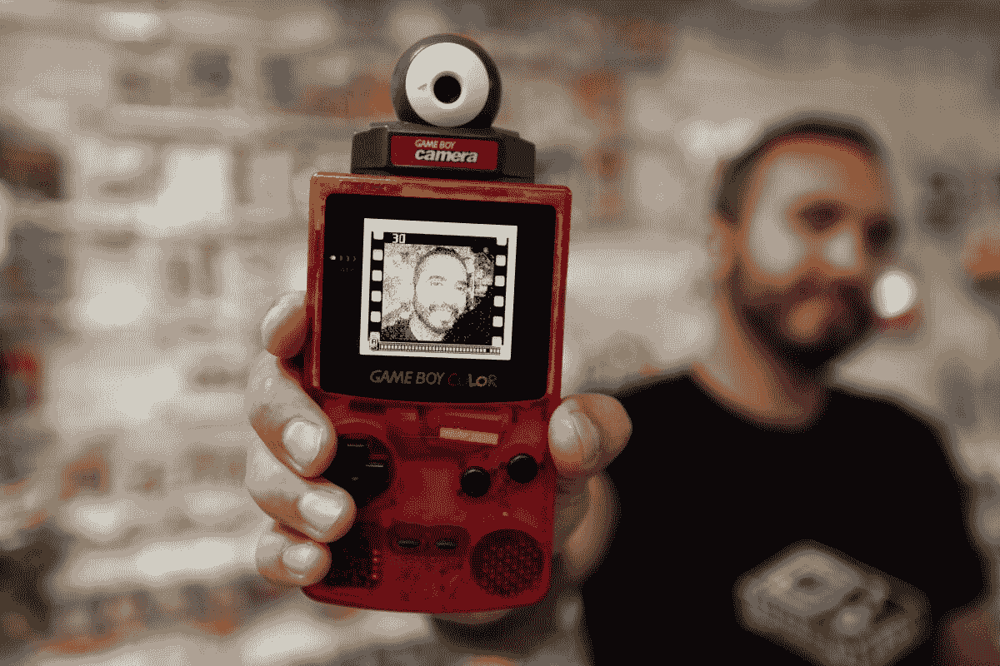

# 游戏男孩有无限的生命。30 岁时，他们以意想不到的方式继续生活——洛杉矶时报

> 原文：<https://www.latimes.com/entertainment/herocomplex/la-et-hc-nintendo-game-boy-anniversary-20190421-story.html?utm_source=wanqu.co&utm_campaign=Wanqu+Daily&utm_medium=website>

今天乍一看，任天堂的 Game Boy 就像一个笨重的灰色掌上游戏机。

但是这个小盒子里的魔法被证明是令人难忘的。随着开关的翻转，单色绿色屏幕可以活过来，8 位任天堂标志将从顶部慢慢下降，直到停在中间，发出“叮！”

在它发布 30 年后，便携设备的遗产和热情以远远超出其预期用途的方式继续存在。

Game Boy 于 1989 年 4 月 21 日首次在日本发布，并不是当时技术最先进的手持设备。但多亏了发明家横井冈平的指导哲学，Game Boy 才能够击败其竞争对手，如雅达利山猫和世嘉的游戏设备。

横井先生以他称之为“用枯萎的技术进行横向思考”的哲学而闻名，他的方法是寻求用现有的技术为消费者创造新的东西。这是一个今天继续指导任天堂的哲学，因为它的热销开关缺乏索尼的 PlayStation 4 或微软的 Xbox One 的力量。

“Game Boy 之所以拔得头筹，是因为它能够提供更低的价格，而且人们实际上可以在旅途中使用它。他们不必携带额外的电池和壁式充电器。它真的是一个真正的便携式游戏机，”视频游戏历史基金会的项目经理凯尔西·勒温说，该基金会旨在保存、编目和数字化所有与视频游戏有关的材料。该基金会正在为研究人员、记者和其他人能够使用的数据库建立收藏。一些资料被送到电子游戏博物馆，包括纽约的斯特朗游戏博物馆，进行安全保管。

当掌上电脑于 1989 年登陆美国市场时，《洛杉矶时报》指出，“通过 Game Boy，任天堂希望进一步巩固其在视频游戏市场的地位。”确实如此。到 2001 年——当 Game Boy Advance 发布时——任天堂已经在全球销售了 1.1 亿台，使 Game Boy 成为当时最畅销的游戏系统。

Game Boy 最终为手机游戏和我们今天的游戏方式铺平了道路。

“Game Boy 处于一个独特的位置，它不是第一台掌上电脑，但它肯定是最有效的一台，”24 岁的 Lewin 说，他还在网上发布关于视频游戏历史的迷你纪录片风格的视频，并共同拥有西雅图的视频游戏零售商 Pink Gorilla。“这实际上感觉就像你在玩和在家玩的一样的游戏。”

“我认为游戏机迷上了游戏。句号，”她说。

随着任天堂继续升级和完善其手持游戏产品，Game Boy 的影响力现在可以看到了。但是，随着人们继续为这项技术寻找创造性的用途，最初的游戏机本身已经显示出了它们的弹性。

事实证明，游戏男孩有无限的寿命。

### 适合各种风格的游戏机

Game Boy 的便携性为游戏玩家提供了亲密的个人体验。他们可以很容易地携带它四处游玩，但有一个条件:必须有足够的光线。原始屏幕在光线较暗的情况下很难看清。

如今，添加背光和其他修改的说明可以在网上找到，已经修改过的 Game Boys 也可以购买。这些定制赋予了最初的游戏男孩新的生命，因为游戏玩家现在可以拥有符合他们个性或风格的设备。

<picture><source type="image/webp" srcset="https://ca-times.brightspotcdn.com/dims4/default/0e2364b/2147483647/strip/true/crop/2048x1365+0+0/resize/320x213!/format/webp/quality/80/?url=https%3A%2F%2Fcalifornia-times-brightspot.s3.amazonaws.com%2F92%2F49%2Fca70afd3c5c2466c8fecee6ef6e4%2Fla-1555795811-tfyqkiebee-snap-image 320w,https://ca-times.brightspotcdn.com/dims4/default/976625d/2147483647/strip/true/crop/2048x1365+0+0/resize/568x379!/format/webp/quality/80/?url=https%3A%2F%2Fcalifornia-times-brightspot.s3.amazonaws.com%2F92%2F49%2Fca70afd3c5c2466c8fecee6ef6e4%2Fla-1555795811-tfyqkiebee-snap-image 568w,https://ca-times.brightspotcdn.com/dims4/default/aa8735d/2147483647/strip/true/crop/2048x1365+0+0/resize/768x512!/format/webp/quality/80/?url=https%3A%2F%2Fcalifornia-times-brightspot.s3.amazonaws.com%2F92%2F49%2Fca70afd3c5c2466c8fecee6ef6e4%2Fla-1555795811-tfyqkiebee-snap-image 768w,https://ca-times.brightspotcdn.com/dims4/default/6827ae4/2147483647/strip/true/crop/2048x1365+0+0/resize/1024x683!/format/webp/quality/80/?url=https%3A%2F%2Fcalifornia-times-brightspot.s3.amazonaws.com%2F92%2F49%2Fca70afd3c5c2466c8fecee6ef6e4%2Fla-1555795811-tfyqkiebee-snap-image 1024w,https://ca-times.brightspotcdn.com/dims4/default/8e68f03/2147483647/strip/true/crop/2048x1365+0+0/resize/1200x800!/format/webp/quality/80/?url=https%3A%2F%2Fcalifornia-times-brightspot.s3.amazonaws.com%2F92%2F49%2Fca70afd3c5c2466c8fecee6ef6e4%2Fla-1555795811-tfyqkiebee-snap-image 1200w" sizes="100vw"> </picture> 

吉列尔莫·埃尔南德斯用相机展示了他修改过的 Game Boy 颜色，并在屏幕上显示了他的图像。掌上电脑是 Game Boy 系列中的第四款，于 1998 年发布。

(弗朗辛·奥尔/洛杉矶时报)

35 岁的吉列尔莫·埃尔南德斯对他 8、9 岁时得到他的游戏机有着美好的回忆。2016 年，他购买了一个背光屏幕的改装系统。当它停止工作，卖家拒绝收回时，他不得不自己修理。

他现在[设计和销售定制游戏男孩](https://www.instagram.com/gameboyjunky/)，包括不同的外观颜色组合等等。

埃尔南德斯从干净的外壳或游戏机外壳开始他的设计。他使用喷漆为外壳的内侧上色，以保护设备上的油漆。

“我开始在 Game Boy 外壳上添加艺术品，这真的很难做到，”Hernandez 说。“如果做得不对，会浪费很多钱。所以我觉得这是让我与其他人有所区别的一件事。”

但他的修改并不都是表面上的:在内部，他给自己的作品增加了背光屏幕和按钮。

“一旦你给一个游戏机打了背光，你就能真正欣赏到这些游戏中的所有艺术作品。你真的可以一个像素一个像素地看。它看起来很完美，”埃尔南德斯说。“当我开始玩它的时候，它很棒，但我们不知道它会有多好看。”

埃尔南德斯还专门为音乐家做音频调整。他创造了一个他称之为“合成器男孩”的东西，将一个合成器套件打包到一个 Game Boy 中，作为 chiptune 艺术家的一体化工具。

### 怀旧的音色

音乐编辑程序，如 Little Sound DJ 和 Nanoloop，使 chiptune 艺术家能够在现场表演中利用 Game Boy 的便携性。该软件安装在盒式磁带中，允许音乐家将手持游戏设备用作音乐发生器。音乐家们已经用雅达利 2600 和 Commodore 64 做到了这一点，但它们在舞台上显得笨拙。

这些声音可能会唤醒一些人的怀旧感，因为 8 位技术与心爱游戏的原声相同，但洛杉矶 chiptune 乐队成员杰西·阿维拉(Jesse Avila)表示，这对他来说意义重大。

“对我来说，通过游戏机或任天堂的哔哔声和哔哔声传达的情感不仅仅是怀旧。这是非常复杂的——既有天真无邪的情感，也有近乎孤立和疏远的情感，”他说。

“我觉得这种声音的本质——它是陌生的、人工的，但也有点像纯粹和无辜的——有点有助于共鸣或传达我们从小玩到大的许多游戏的信息，如塞尔达或马里奥，”阿维拉说。"这些不被看好的英雄不是典型的大男子主义类型."

他的三人独立摇滚乐队使用修改过的原始游戏男孩和任天堂来完成他们的合奏。在舞台上，乐队使用 MIDI 控制器来控制游戏机的声音。

“没有它，我们只是一个典型的独立摇滚乐队，但我觉得(8 位)给了它一个额外的情感维度，可以说，传达了我们的立场，”阿维拉说。

阿维拉是当地团体“8bitLA”的联合创始人，该团体最初成立于 2012 年左右，最初是一个 chiptune 集体。他说，自那以后，它已经扩展到包括其他音乐流派的乐队，这些乐队分享包容性和社区的主题。其他本地 chip tune 音乐人包括[《你我之间》](https://herebetweenyoume.bandcamp.com/)、[霓虹死亡猫](https://soundcloud.com/neondeathcat)、[《我们相遇的夜晚》](https://tnwm.bandcamp.com/)和[邪恶的 Wezil](https://evilwezil.bandcamp.com/) 。

**[相关:复古黑胶最新最大趋势？电子游戏音乐](https://www.latimes.com/entertainment/music/la-ca-ms-vintage-video-game-vinyl-20170511-story.html)**

### 用 8 位捕捉世界

不仅对经典游戏《男孩》的喜爱持续了几十年，对其一些古怪外设的欣赏也是如此。

Game Boy 相机是一个图像捕捉附件，它使用控制台的墨盒插槽，使手持设备能够拍摄 128 x 112 像素的黑白照片。这些照片可以用与相机一起发布的 Game Boy 打印机打印出来。

《泰晤士报》将 1998 年的 Game Boy 相机描述为“令人惊讶的有趣”和“浪费一个周末拍摄日常生活片段的完美方式。”

南圣地亚哥居民马克斯韦尔·谢勒(Maxwell Scheller)也有同感，他最近几年重新发现了这种设备的乐趣。他在参加各种活动、节日和会议时用 GB 相机给人们拍照，并把他拍的照片打印出来给他们。

“这是一项复古技术，真的会让人抓狂，”谢勒说。

自从 Game Boy 相机首次发布以来，Scheller 就一直拥有它，尽管他记得当时拿着它很开心，但它最终还是和他的其他旧游戏一起打包了。

2014 年左右，他决定在当地一家游戏商店买一台游戏机打印机，并带着它们去参加一个名为“荒地周末”的后世界末日主题活动，于是他又把它拉了回来。

“我把它带到了我能去的任何地方，”谢勒说。“无论哪里的人都穿着戏服。”

多年来，许多其他 GB 相机爱好者已经通过修改该设备的摄影功能进行了实验，如添加长焦镜头或创建彩色照片的技巧。但谢勒喜欢使用它的经典状态，原来的游戏男孩和所有。

“我觉得这是一门艺术，”谢勒说。“这让我觉得很艺术。”