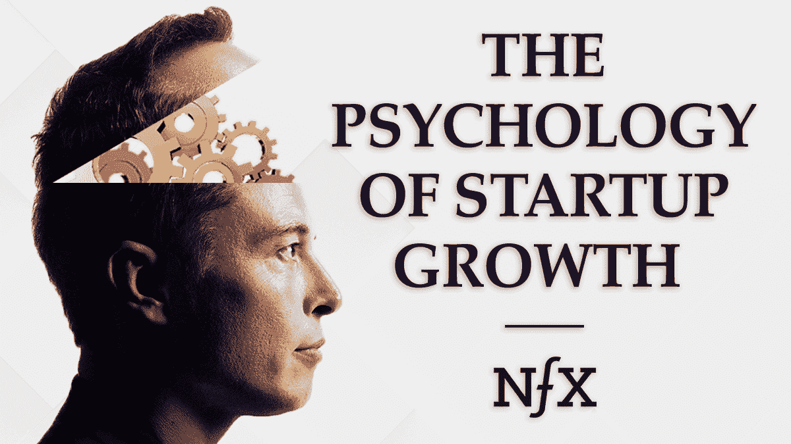

# 创业成长心理学

> 原文：<https://www.nfx.com/post/psychology-startup-growth?utm_source=wanqu.co&utm_campaign=Wanqu+Daily&utm_medium=website>

詹姆斯·库里耶 *是硅谷最著名的增长和网络效应专家之一。作为一名四次连续创业的企业家，他创办了 Tickle(1.5 亿用户)、wonder hill Gaming(4500 万用户)等公司，帮助 10 多家公司获得了超过 1000 万用户，其中包括 Goodreads 和 Poshmark。他是用户生成模型、病毒营销、A/B 测试、众包和其他有影响力的增长技术的先驱。*

<noscript>T3】</noscript>

*‍* *下面是詹姆斯·柯瑞尔朗读的这篇文章的音频版本* *。*

*‍* 当公司向我寻求增长建议时，他们通常会问:

"*明天我能做什么来获得 1000 万用户？我应该使用哪些渠道？哪些战术？”。*

事情不是这样的。成长不是一次性的噱头。要获得 1000%的增长，没有什么灵丹妙药。

成长来自于采用正确的心理。正确的心态。你多年来一直坚持的日常工作方式。策略会改变并变得过时，但成长是一种无止境的创造性努力。你必须为此发展你的心理学。

我们已经看到，高绩效成长心理学有五个特征。

1.  语言第一
2.  为用户着想
3.  总是在移动
4.  数据之恋
5.  忍受失败的痛苦

有五种心态是我们花最多时间试图与团队沟通的。从表面上看，它们似乎很简单。然而，一旦你试图实现它们，就像许多真正有价值的事情一样，它们会变得更加复杂。我们在下面详细介绍了它们，以帮助您将它们付诸实践。

还有一件事。我们经常听到这样一种普遍观点，即所有好的增长想法都已经尝试过了，但我们不这么认为。我们坚信，与已经尝试过的增长机会相比，还有 10 倍以上的增长机会等着我们去发现，这些机会可以用来建立行业定义的公司。

你只需要正确的创始人心理学就可以实现。

## 1.语言第一

我们看到的一个更常见的错误是，公司首先构建功能，然后“把语言放在上面”

这是落后的。语言应该是第一位的。

你选择用来描述你的产品和公司的确切语言告诉你在做什么，也告诉你的用户期待什么。你的语言定义了你。它告诉用户你是如何与他们的生活相关的。

“拼车市场？”与我无关。“在 4 分钟或更短时间内搭车？”好了，现在我注意到你了。如果你的按钮上写着“分享你的照片”，这个功能将与“存储你的照片”不同，你必须做两件不同的事情。

你的语言可以是增长的倍增器，也可以是增长的抑制剂——从你的公司名称开始。

很少有人意识到这一点，但语言是成长的第一步。

## 2.为用户着想

典型的“好”创始人整天都在思考他们的产品。他们希望他们的产品能引起用户的注意和喜爱，对用户来说是有用的和令人愉快的。

但是考虑你的产品和考虑你的用户是两码事——尽管很容易把两者混为一谈。

伟大的创始人会花更多的时间考虑用户的想法和感受。关于他们的心理。

现实是这样的。你的用户有一个庞大而复杂的生活，而你正在努力成为其中的一小部分。他们有他们的工作，他们的家庭，他们的公寓，他们的朋友，他们的汽车，他们生病的妈妈，他们的狗，他们的保险，他们的债务，即将到来的下一个假期，他们的孩子，孩子的学校，他们的智能手机有 100 个应用程序，等等。

你就埋在那里。在你的世界里，你的产品就是一切。每天 12 小时，每周 6 天。在他们看来，你的产品只是很小的一部分(如果你很棒的话)。

所以你每天要问的问题是“*你的产品* ***对他们来说是什么*** 这样它才配得上在他们复杂的生活中占有一席之地？”

你的答案应该反映出这样的观察结果:在每个有趣的科技公司背后，都有一个关于人类心理的强大洞察力。这种洞察力让那条信息在他们的用户面前脱颖而出。

例如:

*   脸书的洞察力是人类对喝彩和社会声誉的需求:“看我表演吧。”
*   Snapchat 利用了人们对隐私(甚至保密)和短暂性的渴望:“我厌倦了表演”。
*   Instagram 利用了人们对魅力和外观的渴望。互联网时代的雕塑和肖像:“看到我好的一面。”
*   Etsy 允许人们在大规模商业化的时代买卖小型手工艺品。“我想有独特的感觉。”
*   随着社会原子化程度的提高，WeWork 在日益增长的零工和远程工作经济中挖掘了对社区的渴望:“我想归属。”

了解你的用户心理——知道你对他们来说是什么样的人——你实现 1000%增长的道路会变得更加清晰。

## 3.总是在移动

回到 8500 万年前。谁是地球上最主要的生命形式？

恐龙。它们很大。他们处于食物链的顶端。他们是统治地球的巨人。

‍:但是他们并不孤单。在矮树丛中疾走的是一种微小的、像鼩鼱一样的生物——现代哺乳动物的祖先。一个颤抖的，被忽视的小人物，生活在巨大食肉动物的恐惧中。悍妇对恐龙没有优势，除了一个…

…它不停地移动。一天中的每一分钟，甚至在睡眠中，它都在不停地移动。

后来一颗小行星来了，一切都变了。气候被彻底破坏了。生存竞争呈现出新的层面。最终，泼妇赢了。为什么？因为在快速变化的时代，它的小体积和速度被证明是有利的，而恐龙，它们自己统治的受害者，笨拙地走向灭绝。庞大的体型成为他们最大的弱点。

悍妇应该是伟大创始人的图腾。今天的创业公司应该熟悉它的故事，并采用它的思维模式。正如安迪·格罗夫所说，“只有偏执狂才能生存。”你也生活在一个由巨人统治的世界里。你也没有优势，除了一个:**速度。**

不断移动。比谁都多出招。为了成长，你必须进行更快的实验。迭代更快。永不停止。这就需要泼妇心理了。

## 4.数据之恋

如果你想成长，你必须致力于衡量一切。您必须测试、度量和迭代。这是推动增长的引擎。

数据不能是事后的想法。“数据驱动”不能成为流行语。你必须真正投入进去。投入*大量*工程资源进行测量。甚至高达你一半的工程资源。

你必须热爱你的数据。那一定是你的心理。你的每日统计电子邮件应该是你的文化的核心部分，足够出色，让你公司的每个人都引以为豪。

当我去观察初创公司时，我希望看到每个人都在看三角形保留图。我想在你办公室墙上的大屏幕上看到所有人都能看到的统计仪表板。看到这一点意味着创始人在周末花时间和精力出去买了一台电视，把它组装起来，处理布线和安装以及其他所有令人头疼的安装问题。这表明创始人真的很喜欢他们的数据。

## 5.忍受失败的痛苦

不断迭代是增长引擎的下一部分，说起来容易做起来难。这意味着在你的心理中，你必须学会承受失败的痛苦。

你每天都会失败。你投入时间和精力的大多数事情都将是消极的。大多数新策略都不会奏效。

你必须能够从失败中走出来。你团队的每个成员也是如此。*是制度，是不能失败的成长心理*。

有一句名言:“成功就是从一次失败走向另一次失败，而不丧失热情。”为了 1000%的成长，这就是你需要接受的心理。这样的进步来之不易。你需要勇气和毅力，让你在别人放弃的时候继续前进。

## 让它发挥作用

创始人——尤其是首席执行官——需要具备上述心理素质。但是你如何在一个 6 人或更多人的团队中贯彻成长心理学的原则呢？

这五个步骤将大有帮助:

1.  首席执行官必须将这种心态传授给团队，尤其是忍受反复小失败的意愿。
2.  员工必须被告知，他们直接负责增长是他们工作的一部分，即使他们的头衔是产品、工程或营销。从这个意义上说，每个人都是成长团队的一员，尤其是首席执行官。
3.  首席执行官必须给他们的团队明确的权力来改变产品和分配人力资源，以追求突破性的增长。
4.  团队应该比 CEO 更积极地拓展增长的边界。如果你处在一个成长的位置，而首席执行官正敦促你进行更多的实验，而不是相反，那你就做错了工作。
5.  你必须不停地大幅度摆动。每月 10%的增长是可以的，但是一旦你到了那里，可能就有办法每月增长 40%。找到 40%的增长，甚至 1000%的增长，需要创造力和跳出自己的框框。正如我们的朋友 [Andy Johns](https://twitter.com/ibringtraffic?ref_src=twsrc%5Egoogle%7Ctwcamp%5Eserp%7Ctwgr%5Eauthor) 在[最近与](https://www.nfx.com/post/why-growth-hacking-is-broken) [Pete Flint](https://twitter.com/peteflint) 的对话中指出的，过度依赖低风险 A/B 测试和优化不会让你达到 1000%的增长。

增长最终是整个公司的努力，但这种努力的质量来自首席执行官的心理。通过每天一千个小小的行动，创始人将他们的心理烙印在他们的创业上。

正因为如此，培养良好的成长心理对你公司未来的成功有着连锁反应。这就是受缓慢增长困扰的初创公司和通过数据可见性、持续移动和大规模行动实现 1000%增长的初创公司之间的区别。如果你在第二阵营，来和我们谈谈。