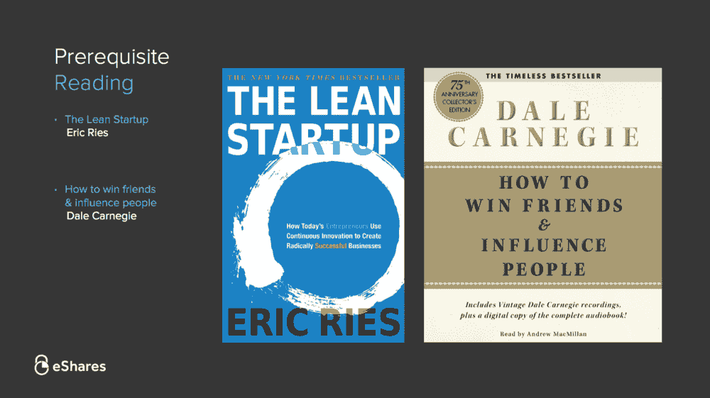
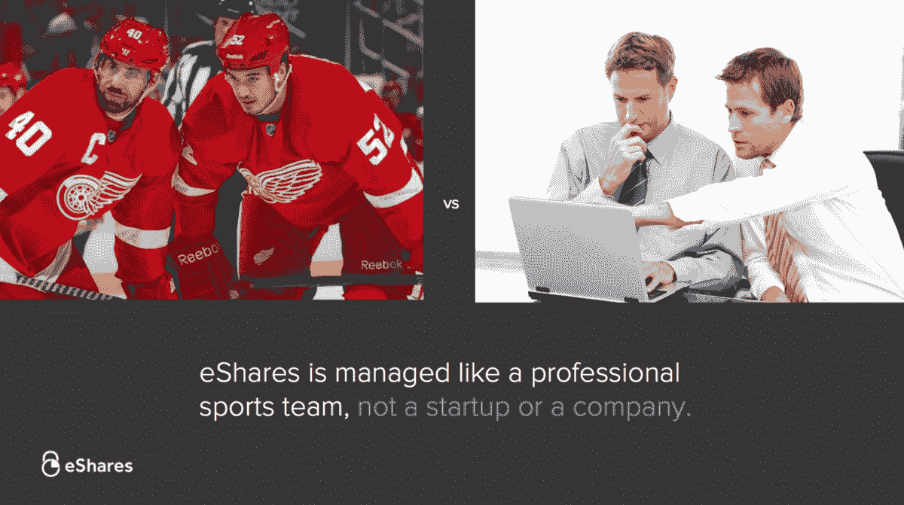
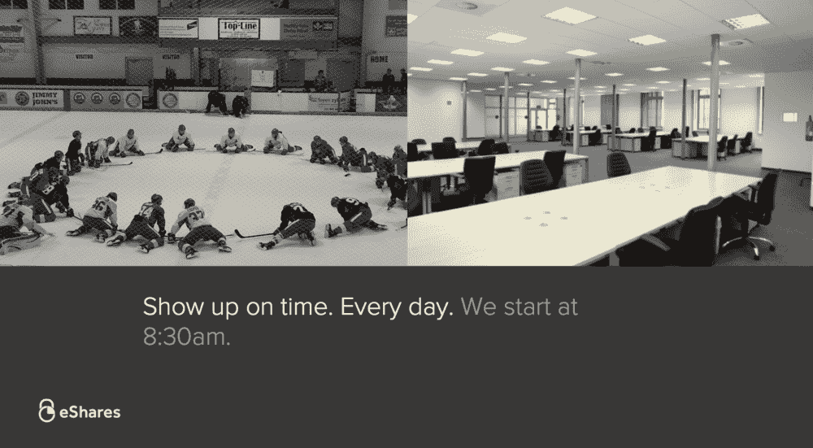
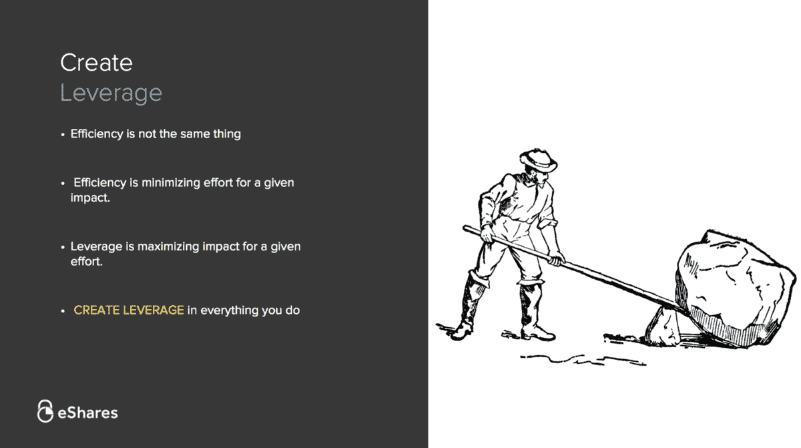
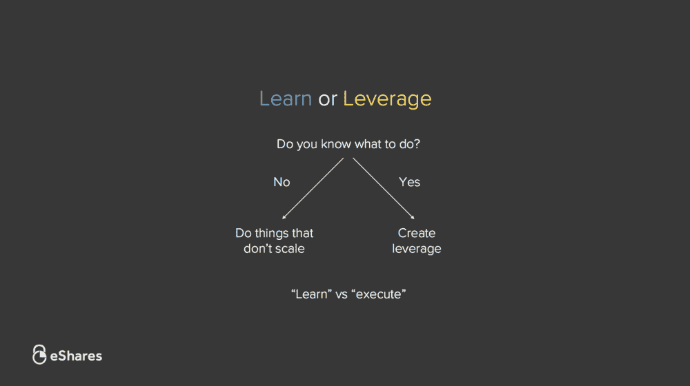
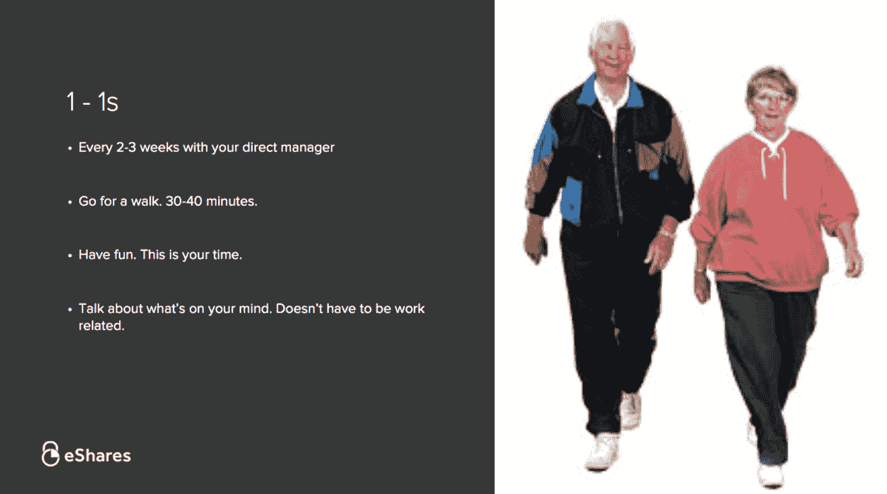
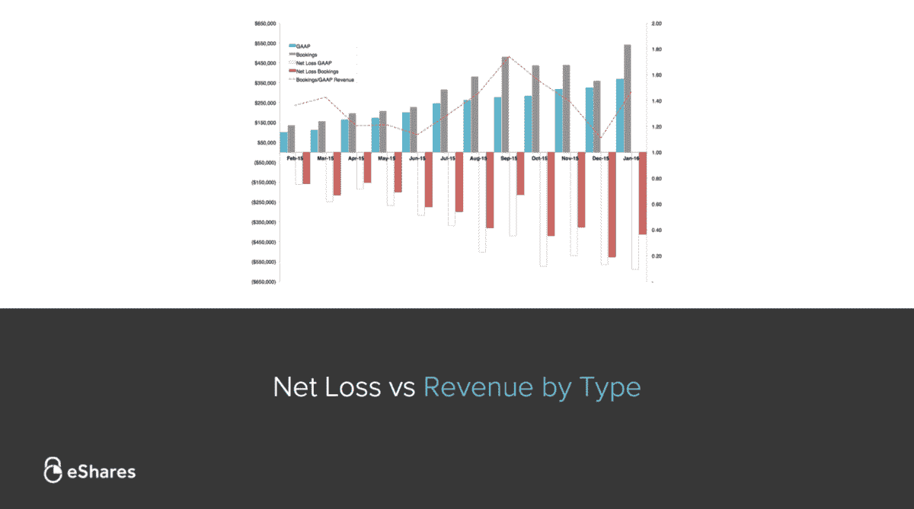
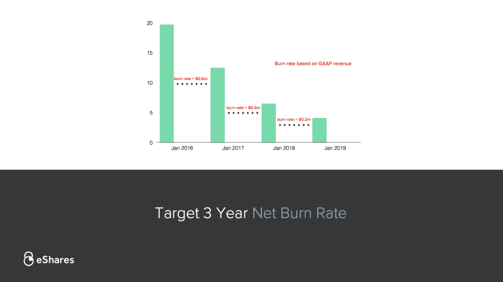
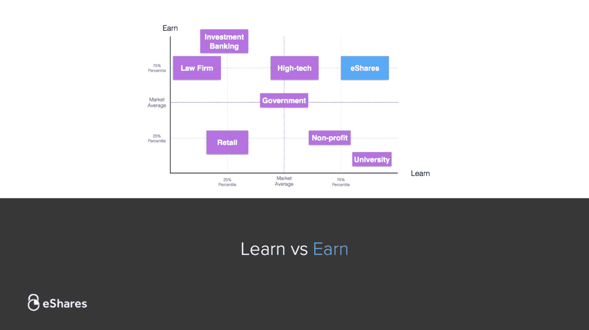
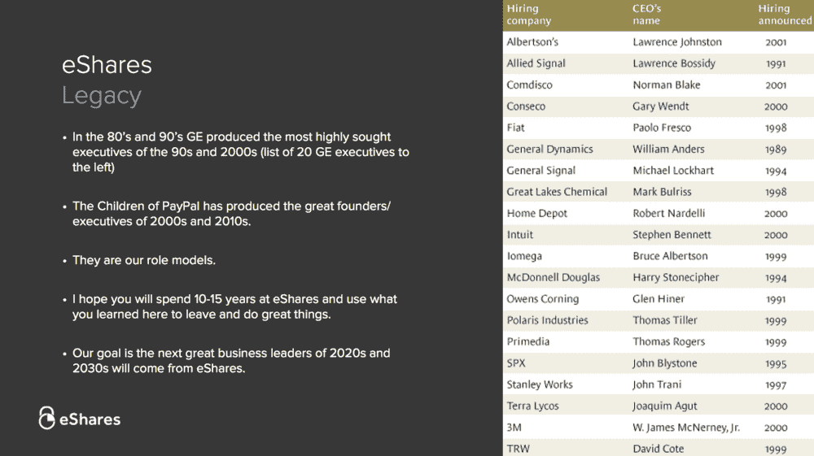

# 卡塔 101 -我们的公司、价值观和战略|卡塔

> 原文：<https://carta.com/blog/carta-101/?utm_source=wanqu.co&utm_campaign=Wanqu+Daily&utm_medium=website>

**注意:自从这篇文章在 2015 年发表以来，我们的一些想法已经发生了变化，我们的收入和烧钱率都增加了，我们的定位也发生了变化。但是，正如你将在后面读到的，我们仍然希望人们在 Carta 呆上十年或更长时间。**

所有 Carta 员工(新老员工)都要参加名为 Carta 101 的全天课程。这是对我们公司、我们的价值观和我们的执行战略的介绍。班级人数很少(8-10 人)，因此每个人都可以参与小组讨论。我每月在星期五上一次课。

在这篇文章中，我还从我的讲稿中摘录了一些内容，并附上了几张幻灯片。希望对致力于规模化文化的成长期公司 CEO 和员工有所帮助。

## 先决条件

这门课的先决条件是阅读 [*精益创业*](https://theleanstartup.com/) 和*如何赢得朋友&影响人*。希望你们都读过这两本书。你应该在第一天就收到了，我们在卡塔图书馆有很多。

术语“MVP”(最低可存活产品)在 Carta 每天都在使用。它是每个想法、讨论、实验、特征和产品的基本单位。你会听到这样的问题，“这家律师事务所的 MVP 特征是什么？”或者，“我们企业客户的 MVP 定价是多少？”你会很好地了解和理解这个概念。

你还将每天把戴尔·卡内基的规则应用到你的客户、同事、供应商和团队中。这是我们人民的圣经。如果你不确定如何处理人际关系，读一读戴尔·卡内基关于这方面的章节。没有比这更好或更实用的管理人的书了。它是保持我们职业关系平稳运行的润滑油。

## Carta 就像专业运动队一样运作

大多数公司都会在其他公司找到榜样(例如脸书、谷歌、通用电气)。他们渴望像“X 公司”一样。我提出了 Carta 的另一种模式。我们不以公司为榜样。我们模仿专业运动队。我给你的问题是，“公司和职业运动队的区别是什么？”[引导 20 分钟的讨论]

## 每天准时出现

(**注:这方面在 Carta** 不再强制)Carta 和职业运动队有很多相似之处。首先，我们整个公司每天早上 8:30 集合，一起开始新的一天。每个人——工程、销售、服务、办公室管理。没有人能幸免。在体育运动中，即使是守门员，他的练习时间表可能与球队其他人完全不同，但仍然会在同一时间见面热身。

团队开会解决问题，集思广益，分享工作，或只是赶上。每周二和周四，全公司的人会聚在一起，进行长达一小时的展示和讲述。这是每个人分享、辩论和参与 Carta 进展和决策的机会。

大多数人认为我们让每个人每天早上 8:30 都在办公室是疯狂的。我们认为不这样做是疯狂的。新英格兰爱国者队永远不会告诉球员，“在方便的时候出现练习。”如果你想在你所做的事情上成为世界上最好的，那就从每天在一起开始吧。

## 我们是软件人

现在我们将观看，我认为，科技界最被低估的演讲——杰夫·劳森的*我们是软件人*。杰夫是 Twilio 令人惊叹的首席执行官，他在 20 分钟内抓住了解决我们[正在解决的问题的那种人意味着什么。](/private-companies/)

在 Carta，我们都是软件人。我们每天都在交付“大规模的惊人的客户体验”，并“将世界更多的东西吸收到我们的软件中。”你不一定要成为工程师才能做到这一点。你只需要相信你的工作就是把现实世界的问题转化为软件问题。

<iframe loading="lazy" title="unSEXY Conf 2013: Jeff Lawson, Twilio" src="https://www.youtube.com/embed/ReSlJ5cq5D0?feature=oembed" frameborder="0" allow="accelerometer; autoplay; clipboard-write; encrypted-media; gyroscope; picture-in-picture" allowfullscreen="">视频</iframe>

Carta 没有人每天都做同样的事情。每个人都在努力让自己失业。这是我们的“创造性破坏”,驱使我们进化、成长和适应。

## 创造杠杆，而不是效率

很多人混淆了杠杆和效率。他们是不同的。效率是确定一个期望的产出，并尽可能减少实现它的努力。我们不是一家注重效率的公司。

我们是一家杠杆公司。对于固定量的努力，你如何能最大化你的影响？这个问题是你的指路明灯。在你做的每一件事情中，弄清楚如何将你的影响放大 10 倍。

永远不要混淆效率和杠杆。效率是懒人所向往的。杠杆是我们的工作。

## 学习与执行

你每天要做的工作有两种。首先是学习。在任何角色中，在你适应之前，总会有一个初始学习阶段。在某一点上，你的学习会停滞不前，这时第二种工作开始了:执行。这是应用这些知识来完成工作并创造优势的行为。最终，你会创造出足够的杠杆来自动完成这项工作，或者放弃它，这就是你重新开始循环的时候。学习。执行。

## 竞争是失败者的专利

如果你在考虑去商学院，不要去。如果你已经忘记了，请试着忘记你所学的大部分内容。接下来的 45 分钟视频涵盖了你需要了解的所有商业知识。

彼得·泰尔的*竞赛是失败者的*是我们的剧本。我作为首席执行官的工作很简单。我照彼得说的做。他是这样说的:

### 1.避免竞争

我们不同意“竞争意味着我们在做有价值的事情”的观点。事实上，我们的看法正好相反。我们避免竞争对手和投资者想做的事情。我们喜欢做别人不想做的事情。凌乱的工资表、粗糙的 T2 409 a 估价、法律文书——当我们看到其他人对某个空间或问题感到兴奋时，这是我们远离的信号。

### 2.从小市场开始

我们艰难地筹集资金，因为投资者反驳说，“你们的市场太小了”。这是有意的。我们在小市场创造垄断，然后同心协力发展成新的市场。我喜欢彼得将脸书的第一个市场定义为 20，000 名哈佛学生的描述，他们“幸运地”在 10 天内开始占领 60%的市场。

### 3.增长后的持久性

在彼得的演讲中，我最喜欢的词是“耐用”这就是我对我们的描述。我们从不担心增长率。相反，我们担心 30 年后我们的企业、产品和文化是否还会存在。对于一家风投支持的公司来说，说我们不担心增长率似乎很荒谬，但这是事实。我们有信心，如果我们建立一些持久的，可防御的，重要的东西，我们的公司将是有价值的长远发展。我们不在乎成为增长最快的金融基础设施公司。我们在乎成为最后一个。

## 1 对 1

您将每 2-3 周与您的经理进行一次一对一的交流，每 4-6 周与您经理的经理进行一次交流，每 4-6 个月与我进行一次交流。

我们从三个员工开始就一直这么做。Carta 的经理需要上一堂如何一对一的课。对于管理者来说，指示很简单:倾听。对你来说，想说什么就说什么。不一定要和工作有关。这是你分享自己想法的机会。

我们的竞争优势就是我们团队的实力(还记得体育类比吗？).把我们的团队想象成一个由边连接起来的节点网络。一对一是我们加强这些优势的方式。这是你在这里要做的最重要的活动。

## 金融的

每个月我都会给投资者发送我们的业绩更新，包括我们的损益表和资产负债表。我把这封邮件转发给公司，所以你会看到同样的信息。

关于我们的财务状况，有三件重要的事情需要了解:

1.  我们的目标是每月 60 万美元的消耗率。如果我们每月烧钱超过 60 万美元，那我们就太冒险了。如果我们燃烧得少，我们摄入的就不够。(这是我们截至 2015 年的燃烧率)
2.  因为我们有一个目标烧钱率，如果我们想投资项目，我们必须赚到它。我们每月允许自己拥有一定数量的权益资本，但任何超出部分都需要用收入来支付:

1.  我们目前在银行有大约 2000 万美元的存款。在 target，我们将在 2016 年花费 720 万美元。2017 年，我们将把目标成本降低到 600 万美元。2018 年，我们将进一步降低烧钱率，支出 240 万美元。到 2019 年，我们将实现盈利:

我们的燃烧率是我们的节流阀。虽然我们已经筹集了大量的资金，我们慢慢地应用气体。许多公司筹集了大量资金，准备在 12-18 个月内投入使用。这是他们的闪电战策略。我们将在一个持续的时期内耐心地部署我们资产负债表的全部力量。这是我们的围攻策略。

## 补偿

我们的薪酬框架借鉴了[网飞](https://www.keithrull.com/blog/wp-content/uploads/2013/01/netflix_culture.pdf)和[马克·苏斯特](https://medium.com/@msuster)的优秀[学习 vs .赚取](https://bothsidesofthetable.com/is-it-time-for-you-to-earn-or-to-learn-34270acd2f4)。但是我们对它们进行了改造，使之为我们服务。基本原则是:

1.  **薪酬(工资+股权)由市场对你的技能组合和你的技能水平决定**。这意味着不会自动每年加薪 2.4%。不存在基于你的经理是否比其他人更喜欢你的主观增加。你的报酬完全取决于你的销售能力。
2.  **通过增加适销性来增加薪酬**。游说、熬夜、邀功、买啤酒——这些都与你的薪酬无关。如果你想增加你的报酬，那就做得更好。这很简单。还记得我们的职业运动队模式吗？这里也一样。通过成为一名进球更多的球员来增加你的合同价值。剩下的都是噪音。
3.  **您将在 9 个月的周年纪念日以及之后的每 12 个月**进行市值计价。如果你的技能在市场上增值了，或者你的个人技能增加了，你的报酬也会增加。
4.  **我们的目标是让您的薪酬达到第 75 个百分点**。这意味着如果你去其他地方面试，我们预计 1/4 的公司会给你比我们更高的薪水。为什么我们不按市价支付呢？
5.  **我们赢得我们的员工**。最优秀的人是招来的，不是买来的。支付高于市场的薪酬的公司将永远赢得薪酬最优化的人才。最优秀的人优化学习(还记得学习 vs 赚取吗？).赢得并留住这些人意味着创造一种环境，让人们愿意用短期薪酬换取长期职业资本。许多公司认为支付最多的薪水可以得到最好的人才。他们错了。教授最多的公司得到最好的人才。我们的薪酬结构是我们的校验和，以确保我们提供最好的学习环境。

## 放置您的 dota

大家都看过史蒂夫·乔布斯的斯坦福毕业典礼演讲。看了几十遍还是撕。但是这个信息是永恒的。

我从他的演讲中最喜欢的一课是“把点点滴滴连接起来”几乎每天，我都会利用几年前学到的一些技能或经验。我大学毕业后的第一份工作是在全国飞来飞去做软件演示。我真的很擅长做演示，但我不认为我会再使用这项技能。

差不多 15 年后，我在沙丘路跑来跑去，做《卡塔》的演示。学习并更好地做你所做的事情，并相信它以后会有用。

## 卡塔遗产

在上世纪 90 年代和 21 世纪初，通用电气培养出了最受追捧的商业领袖。在通用电气度过大部分职业生涯后，数十名高管最终离开，成为财富 1000 强公司的首席执行官。PayPal 在 2000 年和 2010 年创造了类似的遗产。第二代 PayPal 高管创造了 Yelp、SpaceX、特斯拉、LinkedIn、Yammer。

我知道我这么说听起来很奇怪，但我希望你能在卡塔呆上十年或更久。我希望卡塔能成为你职业生涯中重要的一部分，如果不是大部分的话。我的幻想不是卡塔会成为一家伟大的公司。我的幻想是，当你最终决定离开卡塔时，你会继续做更好的事情。Paypal 给我们带来的最大好处不是在线支付。是彼得、埃隆、里德、杰里米、马克斯和许多其他人。卡塔将产生的最伟大的东西就是你。

杰森·卡拉卡尼斯曾问彼得·泰尔，为什么 Paypal 产生了这么多伟大的创始人。Paypal 是怎么回事？我喜欢彼得的回答——大多数人的创业经历分为两类。许多人为失败的创业公司工作，他们知道创业是不可能的，所以他们从不尝试。其他人则为谷歌或脸书这样的初创公司工作，他们知道创业很容易，所以当创业变得困难时，他们就会退出。Paypal“刚刚好”。Paypal 早期员工了解到创业公司确实很辛苦，但还是有可能成功的。

做 Carta 很难。你很快就会明白的。我的希望是它会足够难。我很期待看到你在这里的成就。欢迎来到卡塔。

*感谢詹姆斯·西利*